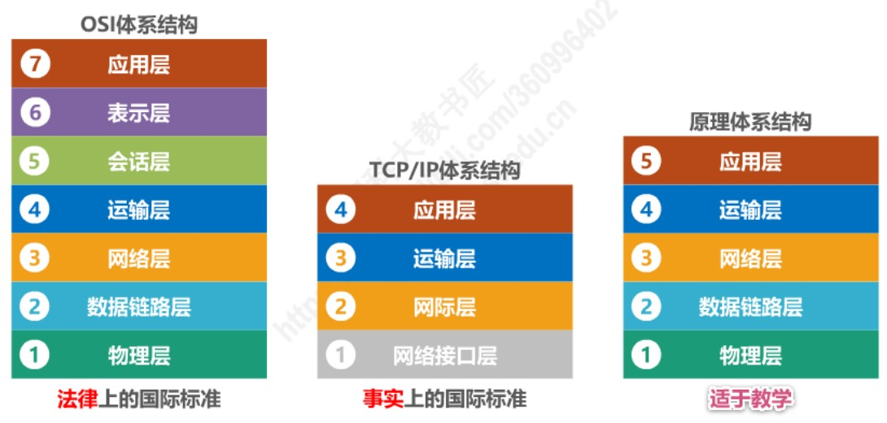
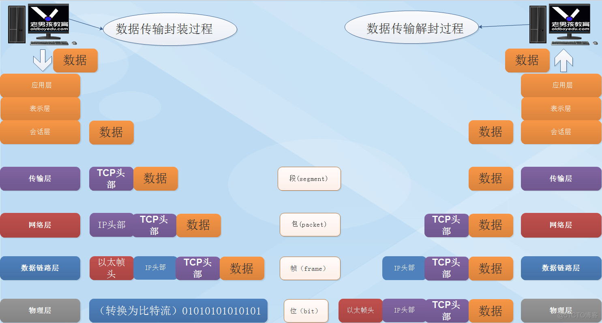
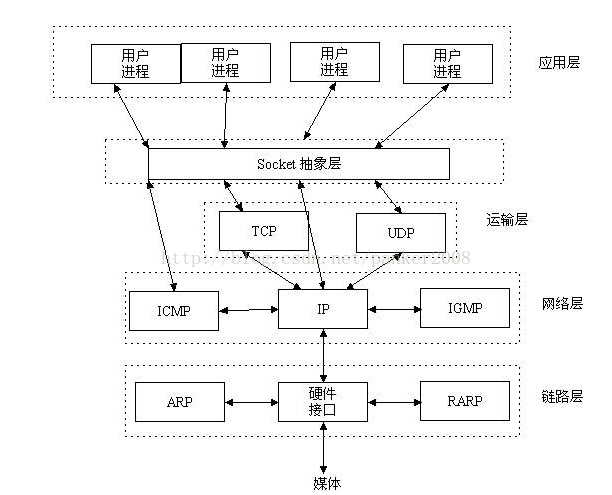
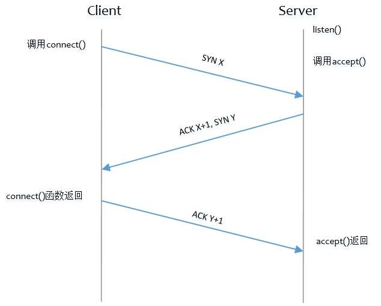
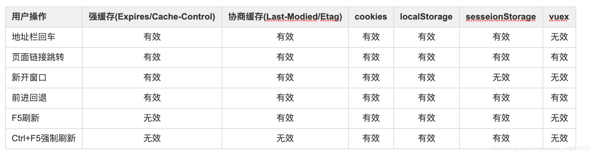

# 基础

## 常见的计算机网络体系结构



### 分层的必要性

1. **各层之间相互独立**：每层只实现一种相对独立的功能，降低了问题复杂度；
2. **灵活性好**：各层内部操作不会影响其它层；
3. **结构上可分离**：各层之间都可以采用最合适的技术来实现；
4. **易于实现和维护**：整个系统被分解为相对独立的子系统；
5. **促进标准化工作**：每一层的功能和提供的服务都能给出精确的说明。

### 各层功能

- 应用层：解决通过应用进程的交互来实现特定网络应用的问题；
  - 应用层协议分类：DNS、FTP、SMTP、HTTP、SNMP、TELNET。
- 表示层：处理**数据格式的转换**、**数据加密**等；
- 会话层：建立、维护和管理会话；
- 运输层：负责端到端的数据传输；
- 网络层：解决数据分组在**多个**网络上传输（路由）的问题；负责数据的路由、转发、分片；
- 数据链路层：解决数据分组在**一个**网络（或一段链路）上传输的问题；负责数据的封帧和差错检测，以及 MAC 寻址；
- 物理层：负责在物理网络中传输**数据帧**；



### TCP/IP 网络模型

- 应用层，负责向用户提供应用功能，比如 HTTP、DNS、FTP 等;
- 传输层，负责端到端的通信，比如 TCP、UDP 等；
- 网络层，负责网络包的封装、分片、路由、转发，比如 IP、ICMP 等；
- 网络接口层，负责网络包在物理网络中的传输，比如网络包的封帧、 MAC 寻址、差错检测，以及通过网卡传输网络帧等；

# HTTP

## HTTP报文


## HTTP 状态码


`1xx` 类状态码属于**提示信息**，是协议处理中的一种中间状态，实际用到的比较少。

`2xx` 类状态码表示服务器**成功**处理了客户端的请求，也是我们最愿意看到的状态。

- 「**200 OK**」是最常见的成功状态码，表示一切正常。如果是非 `HEAD` 请求，服务器返回的响应头都会有 body 数据。
- 「**204 No Content**」也是常见的成功状态码，与 200 OK 基本相同，但响应头**没有 body 数据**。
- 「**206 Partial Content**」是应用于 HTTP **分块下载或断点续传**，表示响应返回的 body 数据并不是资源的全部，而是其中的一部分，也是服务器处理成功的状态。

`3xx` 类状态码表示客户端请求的资源发送了变动，需要客户端用新的 URL 重新发送请求获取资源，也就是**重定向**。

- 「**301 Moved Permanently**」表示永久重定向，说明请求的资源已经不存在了，需改用新的 URL 再次访问。
- 「**302 Found**」表示临时重定向，说明请求的资源还在，但暂时需要用另一个 URL 来访问。

301 和 302 都会在响应头里使用字段 `Location`，指明后续要跳转的 URL，浏览器会自动重定向新的 URL。

- 「**304 Not Modified**」不具有跳转的含义，表示资源未修改，重定向已存在的缓冲文件，也称缓存重定向，也就是告诉客户端可以继续使用缓存资源，用于缓存控制。

`4xx` 类状态码表示**客户端错误**，发送的**报文有误**，服务器无法处理，也就是错误码的含义。

- 「**400 Bad Request**」表示客户端请求的报文有错误，但只是个笼统的错误。
- 「**403 Forbidden**」表示**服务器禁止访问资源**，并不是客户端的请求出错。
- 「**404 Not Found**」表示请求的资源在服务器上不存在或未找到，所以无法提供给客户端。

`5xx` 类状态码表示客户端请求报文正确，但是**服务器处理时内部发生了错误**，属于服务器端的错误码。

- 「**500 Internal Server Error**」与 400 类型，是个笼统通用的错误码，服务器发生了什么错误，我们并不知道。
- 「**501 Not Implemented**」表示客户端请求的**功能还不支持**，类似“即将开业，敬请期待”的意思。
- 「**502 Bad Gateway**」通常是服务器**作为网关或代理时返回的错误码**，表示服务器自身工作正常，访问后端服务器发生了错误。
- 「**503 Service Unavailable**」表示服务器当前很**忙**，暂时无法响应服务器，类似“网络服务正忙，请稍后重试”的意思。

## HTTP常见首部字段

| 字段              | 描述                                           |
| ----------------- | ---------------------------------------------- |
| HOST              | 客户端发送请求时，用来指定服务器的域名。       |
| Content-Length    | 表明本次回应的数据长度。                       |
| Connection        | 客户端要求服务器使用 TCP 持久连接              |
| Content-Type      | 服务器回应时，告诉客户端，本次数据是什么格式。 |
| Content-Encoding  | 表示服务器返回的数据使用了什么压缩格式         |
| Cache-Control     | 强缓存                                         |
| Expires           | 强缓存，失效日期，绝对时间                     |
| Upgrade           | 升级更高版本的协议                             |
| Warning           | 告知与缓存相关的警告                           |
| Accept            | 通知服务器用户能处理的媒体类型和优先级         |
| If-Modified-Since | 请求 基于时间                                  |
| If-None-match     | 请求 基于标识                                  |
| Last-Modified     | 响应 基于时间                                  |
| Etag              | 响应 基于标识                                  |
| Allow             | 告知客户端支持的HTTP方法                       |
| Set-Cookie        | 响应                                           |
| Cookie            | 请求                                           |

## HTTP请求方法

| 方法    | 描述                                     |
| ------- | ---------------------------------------- |
| GET     | 请求资源                                 |
| HEAD    | 请求资源，但只获取报头                   |
| POST    | 提交资源                                 |
| PUT     | 覆盖资源                                 |
| DELETE  | 删除资源                                 |
| CONNECT | 建立一个到由目标资源标识的服务器的隧道   |
| OPTIONS | 描述目标资源的通信选项                   |
| TRACE   | 沿着到目标资源的路径执行一个消息环回测试 |
| PATCH   | 局部覆盖                                 |

## GET vs POST

根据 **RFC 规范**，**GET 的语义是从服务器获取指定的资源**，这个资源可以是静态的文本、页面、图片视频等。GET 请求的参数位置一般是写在 URL 中，URL 规定只能支持 ASCII，所以 GET 请求的参数只允许 ASCII 字符 ，而且浏览器会对 **URL 的长度有限制**（HTTP协议本身对 URL长度并没有做任何规定）。

根据 RFC 规范，**POST 的语义是根据请求负荷（报文body）对指定的资源做出处理**，具体的处理方式视资源类型而不同。POST 请求携带数据的位置一般是写在**报文 body 中**， body 中的数据可以是任意格式的数据，只要客户端与服务端协商好即可，而且**浏览器不会对 body 大小做限制。**

|                  | GET                                                          | POST                         |
| ---------------- | ------------------------------------------------------------ | ---------------------------- |
| 后退按钮/刷新    | 无害                                                         | 数据会被重新提交             |
| 缓存             | 能被缓存                                                     | 不能缓存                     |
| 对数据长度的限制 | 当发送数据时，GET 方法向 URL 添加数据；URL 的最大长度是 2048 个字符 | 无限制                       |
| 对数据类型的限制 | 只允许 ASCII 字符                                            | 没有限制，允许二进制数据     |
| 安全性           | GET 安全性较差，因为发送数据是 URL 的一部分                  | 参数不会被保存在历史或日志中 |
| 可见性           | URL 对所有人可见                                             | 数据不会显示在 URL 中        |

## HTTP/1.1 性能

- **持久连接**：让客户端对同一个域名长期持有一个或多个不会用完即断的 TCP 连接，借助一个 FIFO 队列，取完数据暂不断开，以便获取下一个资源时直接复用，避免创建 TCP 连接的成本。
  - 持久连接仅表示一个连接可以被反复使用，每次使用仅进行一个 HTTP 请求和响应报文的处理，在没有管道技术的支持下无法在一个持久连接中并行发送多个请求，**必须等待前一个请求的响应到达才能发送下一个请求**；
  - **如何在不断开连接的情况下判断数据已经获取完毕**？早期借助 HTTP 字段 `Content-Length` 来标识数据大小即可判断数据是否获取完毕，但由于后来加入了“即时压缩”技术，输出 Header 时服务端还不知道压缩后的资源大小。在 HTTP/1.1 修复了这个缺陷，使用一个全新的字段 `Transfer-Encoding: chunked` 用于表示响应报文将采用分块编码，Body 部分改为用一系列”分块“来传输，每个分块包含长度值和数据内容，最后以一个长度值为 0 的分块来表示资源结束。
- **HTTP 管道**：服务端也建立类似的 FIFO 队列，让客户端**一次性**将所有请求的资源名单发送给服务端，服务端可以按照不同的资源类型进行并行化处理，缩短服务端的延时时间，但是一次性请求的资源名单仍有先后顺序，服务端必须按照先后顺序对资源进行发送，这就会出现队首阻塞问题。
  - HTTP 管道技术得益于 TCP 滑动窗口机制的实现。
- **队首阻塞**：浏览器按照遇见资源的顺序向服务端发送资源请求，虽然服务端可以根据不同的资源请求进行并行处理，但是服务端返回给客户端则必须按照资源请求到达的顺序进行返回，服务端不能哪个请求先完成就先返回，也不能将所有资源混杂在一起进行返回，原因是**只用一个 TCP 连接来传输多个资源**的话，如果顺序乱了，客户端很难区分哪个包归属于哪个资源了。

## HTTP 和 HTTPS

区别：

1. 端口不同，前者 80，后者 443；
2. 后者在应用层 HTTP 协议和传输层 TCP 协议之间加了一个 SSL/TLS 协议，**保证传输的安全性**；
3. 前者只需要三次握手后便可以开始进行传输，后者在三次握手后还需要进行 SSL/TLS 握手过程才可进入加密报文传输；
4. 后者需要向 CA 申请**数字证书**，来保证服务器身份是可靠的。

HTTPS 解决的问题：

1. 混合加密实现机密性；
   - 使用**非对称加密算法**传递**对称算法密钥**，使用**对称加密算法**传递 **HTTP 报文**；
   - **非对称加密算法**使用公钥和私钥解决了密钥交换问题，但是**运算速度慢**；
   - 对称加密算法只使用一个密钥，运算**速度快**，但密钥必须保密，**无法做到安全**的密钥交换。
   
2. 摘要算法实现完整性；

   客户端在发送明文之前会通过**摘要算法**算出明文的「**指纹**」，发送的时候把「指纹 + 明文」一同加密成密文后，发送给服务器，服务器解密后，用相同的摘要算法算出发送过来的明文，通过比较客户端携带的「指纹」和当前算出的「指纹」做**比较**，若「指纹」相同，说明数据是完整的。

3. 数字证书实现真实性。

   - 服务端所颁发的**公钥被存放在数字证书**当中，一旦**客户端验证服务端身份成功**，即可取出公钥进行加密操作。

## HTTP/1.1、HTTP/2、HTTP/3 演变


HTTP 0.9：

- 请求时，不支持请求头；
- 只支持 GET 方法。

HTTP 1.0：

- 请求中增加了 HTTP 协议版本号；
- 支持请求头，不论是请求还是响应；
- 增加各种状态码；
- `Content-Type` 支持传输不同格式的数据。

HTTP/1.1 相比 1.0 的改进：

- 启用**长连接**：长连接技术(Keep-Alive)在 HTTP/1.0 就存在，但是在 1.1 默认开启；改善性能开销
- **管道复用**技术。

HTTP/1.1 的性能瓶颈：

- HTTP 报文 header 无法压缩，只能压缩 body 部分；
- 报文 header 部分存在冗余；
- **队首阻塞问题**；
- 没有请求**优先级控制**；
- 请求**只能从客户端开始**，服务端只能被动响应。

HTTP/2 相比 1.1 的改进：

1. 头部压缩：同时发出多个请求，如果请求头是一样或者类似的，协议会**消除重复**的部分；这就是**HPACK算法**
2. 二进制格式：**抛弃文本形式**的报文首部和主体，采用二进制形式的头信息帧 header frame 和数据帧 data frame，还添加了一些用于流控制的 frame；因为计算机只懂二进制，那么收到报文后，无需再将明文的报文转成二进制，而是直接解析二进制报文，这**增加了数据传输的效率**。
3. 数据流：引入数据流的概念，在一个 TCP 连接中有多个可以**并行**处理的逻辑数据流，**不同 Stream 的帧是可以乱序发送的（因此可以并发不同的 Stream ）**，因为每个帧的头部会携带 Stream ID 信息，所以接收端可以通过 Stream ID 有序组装成 HTTP 消息，这些流中传输的就是二进制形式的 frame；
4. **多路复用**：借助 stream 和 frame，**一个连接中并发多个请求或回应，而不用按照顺序一一对应**。移除了 HTTP/1.1 中的串行请求，不需要排队等待，也就不会再出现「队头阻塞」问题，**降低了延迟，大幅度提高了连接的利用率**。客户端和服务端能以任意顺序传输任意数量的资源，根据 **stream ID** 对 **frame帧**进行重组得到请求和响应报文；
   - 不同 stream 的帧可以乱序发送，但是同一 stream 内部的帧必须是有序的。
5. 服务器推送：服务器可以**主动**提前推送 HTML 页面中剩余的资源，减少用户页面下拉时的延时等待；
   - 规定奇数 stream ID 为客户端所发起的流，规定偶数 stream ID 为服务端为了进行主动推送所发起的流；
   - 双方都可在这些流上进行双向数据传输，规定奇数偶数是为了防止双方发起流时可能发生的 stream ID 冲突。
6. 优先级：为 stream 引入优先级，分配最佳带宽给高优先级的 stream，以便响应资源尽早到达客户端。

HTTP/2 的性能瓶颈：

- 无论是 HTTP/1.1 还是 HTTP/2，传输层所借助的协议都是 **TCP 协议**，TCP 协议在发生丢包时，就会触发重传机制，同时阻塞后续 HTTP 请求的发送。还是会有**队头阻塞**的问题

HTTP/3 的改进：

1. **将传输层协议从 TCP 换成了 UDP**，实现了基于 UDP 的 QUIC 协议来保证可靠性传输（在属于用户态级别下的应用层实现），因为基于 UDP，因此不管是**队首阻塞还是重传机制**都不会出现；
2. 可以对每个**流**进行单独控制，其中一个流出现丢包也不影响其它流的传输；
3. **更快的建立连接**， HTTP/1 和 HTTP/2 协议，TCP 和 TLS 是分层的，分别属于内核实现的传输层，openssl 库实现的表示层，难以合并，HTTP/3 QUIC 内部包含了 TLS，仅需 1 个 RTT 就可以「同时」完成建立连接与密钥协商。
4. 提出“**连接标识符**”概念，在网络进行切换时，只需要发送一个**连接标识符**即可**重新建立连接**，如果使用 TCP 协议，已有连接都会超时、中断，然后根据需要进行重连，可以理解为是可插拔技术的一种。

## HTTP/1.1 如何优化

1. 利用缓存避免发送 HTTP 请求；

   - 源主机在第一次请求到资源后，缓存在本地，后续发出相同请求时，可以直接从本地进行获取，但缓存也不是一直有效，需设置超时时间，过了超时时间后，再次发出请求，如果此时目的主机的资源仍不变，则目的主机会返回 `304` 响应，表示该请求的资源仍有效，目的主机也不会将资源再次发送过来。

2. 减少 HTTP 请求次数；

   - 减少重定向的请求次数，可以将**重定向的工作交给代理服务器**，代理服务器收到目的服务器的 `302` 响应时，自己去获取数据，然后再返回给源主机，这样源主机就少了一次发送请求的次数；

   - 合并请求，就是合并资源，用一个大资源的请求替换多个小资源的请求，但是当大资源中某一个小资源发生变化后，源主机必须重新下载完整的大资源文件；比如**精灵图技术**
   - **延迟发送**请求，使用**按需加载**的方法，一般 HTML 页面会包含许多资源 URL，没必要一次性将其获取完成，可以等待用户将页面下拉时，再发出请求。

3. 减少 HTTP 响应的数据大小。

   - 无损压缩，适用于文本文件、程序可执行文件、程序源代码等，`Accept-Encoding` 和 `Content-Encoding` 分别是请求方支持的压缩格式以及服务方所选择的压缩格式；
   - 有损压缩，适用于多媒体数据，音频、视频、图片，通过请求头部的 `Accept` 字段里的【q质量因子】，表述自己所期望的资源质量。

## HTTP 范围请求

如果下载过程中遇到网络中断的情况，那就必须从头开始。为了解决该问题，需要一种可恢复的机制。所谓恢复是指能从之前中断处恢复下载。

要实现该功能需要指定下载的实体范围，像这种指定范围发送的请求叫做范围请求。

对一份 10000 字节大小的资源，如果使用范围请求，可以只请求 5001 ~ 10000 字节内的资源。

客户端通过在首部字段中加入 `Range: bytes =5001-10000` 即表示请求资源的 5001 ~ 10000 字节的数据。

此时服务端通过在首部字段中加入：

- `Content-Range: bytes 5001-10000/10000` 表示返回的资源范围；
- `Content-Length: 5000` 表示资源的大小；
- `Content-Type: image/jpeg` 表示资源的类型。

并且服务端返回的是状态码为 `206 Partial Content` 的响应报文，如果服务端无法响应范围请求，则返回状态码 `200 OK` 和完整的实体内容。

## HTTPS RSA 握手

### TLS 握手过程


### ⚝RSA 握手过程

1. 客户端发送**支持**的**加密套件**、**支持**的**协议版本**、随机数 C，得到服务端 **ACK**；（第一次握手）
2. 服务端发送**选择**的加密套件、**选择**的协议版本、随机数 S；（第二次握手）
3. 服务端发送**数字证书**；（第二次握手）
4. 服务端发送**结束消息**，得到客户端 **ACK**；（第二次握手）
5. 客户端**验证数字证书**，取出 RSA 公钥，对生成的 **新随机数pre-master** 加密，发送；（第三次握手）
6. **客户端和服务端**使用随机数 C 和随机数 S 和 pre-master （**三个随机数**）在本地算出**会话密钥**；
7. 客户端发送通知消息，通知接下去使用**会话密钥加密**；（第三次握手）
8. 客户端发送之前所有握手数据的**摘要**，得到服务端 **ACK**；（第三次握手）
9. 服务端发送通知消息，通知接下去使用会话密钥加密；（第四次握手）
10. 服务端发送之前所有握手数据的**摘要**，得到客户端 **ACK**。（第四次握手）
11. 双方验证加密和解密没问题，那么握手正式完成。

### ⚝流程概括

整体过程分为**证书验证**和**数据传输**阶段

**① 证书验证阶段**

1. 浏览器发起 HTTPS 请求
2. 服务端返回 HTTPS 证书
3. 客户端验证证书是否合法，如果不合法则提示告警

**② 数据传输阶段**

1. 当证书验证合法后，在本地生成随机数
2. 通过公钥加密随机数，并把加密后的随机数传输到服务端
3. 服务端通过私钥对随机数进行解密
4. 服务端通过客户端传入的随机数构造对称加密算法，对返回结果内容进行加密后传输

### 密码套件

假设服务端选择的密码套件是 `TLS_RSA_WITH_AES_128_GCM_SHA256`。

其基本形式是【密钥交换算法】+【签名算法】+【对称加密算法】+【摘要算法】。

因此上述密码套件的意思是：

- 由于 WITH 单次前面只有一个 RSA，说明握手时密钥交换算法和签名算法都使用 RSA；
- 握手后的通信采用 AES 对称加密算法，密钥长度为 128 位，分组模式是 GCM；
- 摘要算法 SHA256 用于消息认证和产生随机数。

### 客户端验证数字证书

证书签名过程：

- CA 将**服务端公钥、证书拥有者、发布机构、有效时间**等信息打成一个包，使用**摘要算法**得到 hash 值；
- CA 使用自己的私钥对 hash 值进行加密，相当于对证书进行签名；
- 将包和签名放在一起，形成数字证书。

验证过程：

- 客户端使用**同一个摘要算法**对数字证书中的包进行计算得到 hash 值；
- 客户端使用 **CA 的公钥**（预装于本地操作系统中）对数字证书中的签名进行解密得到 hash 值；
- 客户端**比对**自身计算的哈希值和 CA 计算的哈希值是否一致，一致则信任该数字证书，取出里面的【服务端公钥】进行加密操作。

证书链：

实际上，证书的验证过程存在一个证书【信任链】的问题，我们向 CA 申请的证书一般不是由根证书签发，而是由中间证书签发的。

假设目前有这样的一个三级证书链：`GlobalSign Root CA` => `GlobalSign Organization Validation CA - SHA256 - G2` => `baidu.com`。

其验证过程如下：

- 客户端拿到 `baidu.com` 的证书后，发现该证书的签发者不是根证书，因此无法根据本地已有的根证书中的公钥验证 `baidu.com` 证书是否可信。于是，客户端根据 `baidu.com` 证书中的签发者，找到证书的颁发机构是 `GlobalSign Organization Validation CA - SHA256 - G2`，然后向 CA 请求该中间证书。
- 请求到中间证书后发现 `GlobalSign Organization Validation CA - SHA256 - G2` 是由 `GlobalSign Root CA` 签发的，由于后者证书没有再上一级的签发机构，说明它是根证书。应用软件会检查此证书是否已经预载于根证书清单上，如果有，则利用根证书中的公钥去验证 `GlobalSign Organization Validation CA - SHA256 - G2` 证书，如果验证通过，说明该中间证书可信。
- `GlobalSign Organization Validation CA - SHA256 - G2` 证书被信任后，可以使用该证书的公钥去验证 `baidu.com` 证书的可信性，如果验证通过，则可以信任 `baidu.com` 证书。

总结一下就是：用户信任操作系统或浏览器的软件商，操作系统或浏览器信任根证书，根证书信任中间证书，中间证书信任服务端证书，于是用户最终也信任了服务端证书。

**之所以将证书链分为多个中间层级是为了确保根证书的绝对安全性**，将根证书隔离地越严格越好，不然根证书一旦失守，整个信任链都会出现问题。

### 为什么数据传输是用对称加密？

首先，非对称加密的加解密效率是非常低的，而 http 的应用场景中通常端与端之间存在大量的交互，非对称加密的效率是无法接受的；

另外，在 HTTPS 的场景中只有服务端保存了私钥，一对公私钥只能实现单向的加解密，所以 HTTPS 中内容传输加密采取的是对称加密，而不是非对称加密。

### 为什么需要 CA 认证机构颁发证书？

假设不存在认证机构，任何人都可以制作证书，这带来的安全风险便是经典的**“中间人攻击”**问题。“中间人攻击”的具体过程如下：


过程原理：

1. 本地请求被劫持（如DNS劫持等），所有请求均发送到中间人的服务器
2. **中间人服务器返回中间人自己的证书**
3. 客户端创建随机数，通过中间人证书的公钥对随机数加密后传送给中间人，然后凭随机数构造对称加密对传输内容进行加密传输
4. 中间人因为拥有客户端的随机数，可以通过对称加密算法进行内容解密
5. 中间人以客户端的请求内容再向正规网站发起请求
6. 因为中间人与服务器的通信过程是合法的，正规网站通过建立的安全通道返回加密后的数据
7. 中间人凭借与正规网站建立的对称加密算法对内容进行解密
8. 中间人通过与客户端建立的对称加密算法对正规内容返回的数据进行加密传输
9. 客户端通过与中间人建立的对称加密算法对返回结果数据进行解密

由于缺少对证书的验证，所以客户端虽然发起的是 HTTPS 请求，**但客户端完全不知道自己的网络已被拦截，传输内容被中间人全部窃取。**

### 为什么用抓包工具看HTTPS是明文的

HTTPS抓包过程

**这个时候抓包工具对客户端来说相当于服务器，对服务器来说相当于客户端。在这个传输过程中，客户端会以为它就是目标服务器，服务器也会以为它就是请求发起的客户端。**

1. **客户端连接抓包工具提供的代理服务；**
2. **客户端需要安装抓包工具的根证书；**
3. 客户端发出 `HTTPS` 请求，抓包工具模拟服务器与客户端进行 `TLS` 握手交换密钥等流程；
4. 抓包工具发送一个 `HTTPS` 请求给客户端请求的目标服务器，并与目标服务器进行 `TLS` 握手交换密钥等流程；
5. 客户端使用与抓包工具协定好的密钥加密数据后发送给抓包工具；
6. 抓包工具使用与客户端协定好的密钥解密数据，并将结果进行展示；
7. 抓包工具将解密后的客户端数据，使用与服务器协定好的密钥进行加密后发送给目标服务器；
8. 服务器解密数据后，做对应的逻辑处理，然后将返回结果使用与抓包工具协定好的密钥进行加密发送给抓包工具；
9. 抓包工具将服务器返回的结果，用与服务器协定好的密钥解密，并将结果进行展示；
10. 抓包工具将解密后的服务器返回数据，使用与客户端协定好的密钥进行加密后发送给客户端；
11. 客户端解密数据；

### RSA 算法缺陷

**RSA 密钥协商算法不支持前向保密性**，所谓前向保密性指的是长期使用的主密钥泄漏不会导致过去的会话密钥泄漏。

RSA 密钥协商算法不具备前向保密性的理由是，随机数 C 和随机数 S 都由明文发送，pre-master 虽借助服务端公钥加密发送，但**如果服务端私钥发生泄漏**，第三方就可以对【**过去**】捕获的所有 TLS 通讯密文进行解密。

## HTTPS ECDHE 握手

ECDHE 密钥交换算法因为具备**前向保密性**，被广泛使用。

ECDHE 可以从 DH 算法讲起，DH 算法应用在密钥交换中，简而言之可以理解为双方各自计算私钥和公钥，然后交换公钥，使用对方的公钥和自身的私钥在本地计算得到会话密钥，即使第三方拿到了相关素数以及公钥，凭借现有计算机的能力想推算出会话密钥是非常难的，除非再获得双方的私钥。

DHE 算法指的是每次进行密钥交换通信时，双方都**临时**生成一组公钥和私钥，然后协商出会话密钥，但 DHE 本身计算性能不佳，再加上临时生成，因此算法性能偏下，现在更主流的是 ECDHE 密钥交换算法，它在 DHE 算法的基础上利用了 ECC 椭圆曲线特性，以更少的计算量计算得到公钥以及最终的会话密钥。

ECDHE 密钥交换算法过程：

1. 双方事先确定某种椭圆曲线以及曲线上的基点 G，这两者都是公开的；
2. 双方各自生成一个随机数作为私钥 d，与基点 G 相乘得到公钥 Q；
3. 双方交换公钥，根据各自的私钥 d 和公钥 Q 计算得到坐标点 (x, y)，其中 x 就是会话密钥。

ECDHE 握手过程（四次握手）：

ECDHE 在 TLS 第四次握手前，客户端就已经发送了加密后的 HTTP 数据，而 RSA 必须在四次握手完成后才进行数据发送，提高了传输效率。

从 TLS 握手原理上来讲，第一次握手和第二次握手之后，会话密钥已经产生，第三次和第四次握手是双方的一个互相通知和验证，因此进行【数据抢跑】是完全可行的。

1. 客户端发送支持的加密套件、支持的协议版本、随机数 C；

2. 服务端发送选择的加密套件、选择的协议版本、随机数 S；

   `TLS_ECDHE_RSA_WITH_AES_256_GCM_SHA256`

   - **密钥协商算法是 ECDHE；**
   - **签名算法是 RSA；**
   - **握手后的通信使用 AES 对称算法，密钥长度 256 位，分组模式是 GCM；**
   - **摘要算法使用 SHA256。**

3. 服务端发送数字证书；

4. **服务端选择椭圆曲线以及基点 G，生成椭圆曲线私钥，利用私钥和基点 G 得到公钥，将椭圆曲线、基点 G、椭圆曲线公钥发送给客户端；**
- **RSA 算法是没有这一步的，RSA 公钥被附在数字证书中。**
5. 客户端验证数字证书；

6. 客户端生成椭圆曲线私钥，和基点 G 得到公钥，发送给服务端；

7. 双方根据自身的椭圆曲线私钥和对方的椭圆曲线公钥计算得到坐标点，其中的 x 坐标就是会话密钥的**一部分**；

8. 最终的会话密钥由【随机数 C、随机数 S、坐标点 x】组合得到；

9. 客户端通知服务端接下去使用加密通信，并对之前发送过的消息做摘要发给服务端；

10. 服务端通知客户端接下去使用加密通信，并对之前发送过的消息做摘要发给客户端。

## HTTPS 如何优化

HTTPS 性能损耗的两个环节：

1. TLS 四次握手；
2. 加密传输。

HTTPS 优化手段

1. 硬件优化：
   - 使用性能强劲的 CPU，因为 HTTPS 协议是计算密集型。
2. 软件优化：
   - 升级 Linux 内核，升级 OpenSSL 版本。
3. 会话复用：对会话密钥进行**缓存**，减少握手协商的次数。
   - Session ID：双方缓存会话密钥，用 Session ID 进行对应；
   - Session Ticket：服务端对会话密钥进行加密，加密后的会话密钥被称为 Session Ticket，由客户端进行存储；
   - Pre-shared Key：上述两种方式都需要 1 个 RTT 之后才能恢复会话，Pre-shared Key 和 Session Ticket 类似，但是会把 HTTP 请求和 Ticket 一同发送给服务端，在 0 个 RTT 内完成会话恢复。
4. 协议优化：
   - 使用 **ECDHE 密钥交换**算法，可以进行【消息抢跑】，并具备前向安全性；
   - 将 **TLS 1.2 升级为 TLS 1.3，从四次握手改为二次握手，**只需要 1 个 RTT 即可完成 TLS 握手过程，并且 TLS 1.3 废除了不具备前向安全性的 RSA 和 DH 算法，只使用 ECDHE 算法，因此一些大型网站的密码套件格式变为 `TLS_AES_128_GCM_SHA256`，直接将【密钥协商算法】和【签名算法】给省略了，只留下【对称加密算法】和【摘要算法】。
5. 证书优化：
   - 证书传输优化：使用 ECDSA 证书，该证书体积更小；
   - 证书验证优化：定期向 CA 查询证书状态并缓存，不用每次都进行查询。

# TCP

## TCP头部


## TCP 三握与四挥

### TCP 基本认识

#### 头部格式


#### TCP 最大连接数

理论计算公式：最大 TCP 连接数 = 客户端的 IP 数 ✖ 客户端的端口数，大约为 2 的 48 次方；

但是会受到服务端【文件描述符】以及【内存大小】的限制，因此实际最大 TCP 连接数并无法达到那么大的数量级。

#### TCP 和 UDP 区别

TCP 也叫传输控制协议，UDP 也叫用户数据包协议。

1. 连接
   - TCP 是面向连接的传输层协议，传输数据前需要先建立连接；
   - UDP 是不需要连接，即可传输数据。
2. 服务对象
   - TCP 仅支持一对一的两点服务；
   - UDP 支持一对一、一对多、多对多的交互通信，因此可用于广播通信。
3. 可靠性
   - TCP 是**可靠交付**数据的，数据可以无差错、不丢失、不重复、按需到达；
   - UDP 是**尽最大努力交付**，不保证可靠交付数据。
4. 拥塞控制、流量控制
   - TCP 有拥塞控制和流量控制机制，增加数据传输的可靠性；
   - UDP 没有，即使网络拥堵，也不会影响 UDP 的发送效率。
5. 首部开销
   - TCP 首部长度较长，有一定开销，在没有【选项】字段时是 20 个字节，使用了【选项】字段则会更长；
   - UDP 首部只有 8 个字节（源端口、目的端口、长度、检验和），并且是固定不变的，开销较小。
6. 传输方式
   - TCP 是**流式传输**，没有边界，但保证顺序和可靠；
   - UDP 是一个包一个包的发送，有边界，但可能会丢包和乱序。
7. 分片不同
   - TCP 报文大小如果大于 MSS （TCP 数据部分）大小，则会在**传输层**进行分片；
   - UDP 报文大小如果大于 MTU （MAC 数据部分）大小，则会在**网络层**进行分片；
   - TCP 是流式协议，消息无边界，理论上一个报文可以无限大；
   - UDP 是报文协议，消息有边界，其包头长度字段占 16 位，即报文大小最大可达 65535 个字节大小，扣掉 8 个字节的 UDP 首部和 20 个字节的 IP 首部，一个 UDP 数据包的消息体可以有 65507 个字节大小。
8. 应用场景
   - TCP：FTP 文件传输、HTTP、HTTPS；
   - UDP：DNS、SNMP、视频和音频通信、广播。

#### 一台主机上只能保持最多 65535 个 TCP 连接吗？

参考：[知乎](https://www.zhihu.com/question/361111920)

1. 服务端理论最大并发数

   TCP 连接四元组是由源地址、源端口、目的地址、目的端口组成的，只要其中一个发生变化，就是一条完全不同的新连接。

   以 Nginx 为例，假设它的 IP 为 A，端口 80，那就只剩下源地址和源端口是**可变**的。

   IPv4 地址是 32 位整数，因此可以有 2 的 32 次方不同的 IP 地址，TCP 端口是一个 16 位的整数，因此端口数量就是 2 的 16 次方，两者相乘的结果大约为两百多万亿。

   所以理论上，一个服务器可以接收的连接上限就是两百多万亿。但实际上，每个 TCP 连接都会消耗服务器内存，不可能达到如此高的一个理论数字。

2. 客户端理论最大并发数

   情况一：实际上 65535 个端口是**一个** IP 下的可用端口号的数量，一台机器上是可以配置多个 IP 的，假如配置了 20 个不同的 IP，那该客户端就可以发起将近一百二十多万个 TCP 连接。

   情况二：就算假设只有一个 IP，也就只能发起 65535 个连接吗？其实不是的，上述说到一个 TCP 连接由四元组组成，假设客户端的 IP 和端口完全相同，但如果连接的服务端 IP 和端口不同，也是两个不同的连接，所以客户端能发起的理论连接是一个比两百万亿更大的一个天文数字。

3. Linux 最大文件描述符限制

   Linux 处于系统安全角度的考虑，在多个层面对一个进程可以打开的文件描述符作了限制，包括系统级、进程级、用户进程级等。

4. TCP 连接的内存开销

### 三次握手


可以这样理解客户端和服务端的状态变化：

- 客户端：发送 SYN 包后，状态转为【同步已发送】（SYN_SENT），当接收到服务端返回的 SYN+ACK 包后，发送 ACK 包，状态转为【建立】（ESTAB）；
- 服务端：收到 SYN 包后，发送 SYN+ACK 包，状态转为【同步已接收】（SYN_RCVD），当接收到客户端返回的 ACK 包后，状态转为【建立】（ESTAB）。

**第三次握手是可以携带数据的，前两次握手是不可以携带数据的**，

#### 为什么是三次握手

1. **防止旧的重复连接初始化造成混乱（主要原因）**；

   **两次握手连接，就无法阻止历史连接**，假设仅有**两次握手**，客户端发送一个 SYN 包请求建立连接，由于网络原因未到达服务端，于是客户端超时重发第二个 SYN 包，**如果这时第一个SYN包先到了**，客户端收到 SYN 报文后，就进入 ESTABLISHED 状态，建立连接，发送数据，但是客户端还没有进入 ESTABLISHED 状态，客户端判断到此次连接为历史连接，那么就会回 RST 报文来断开连接，服务端只有收到 RST 报文后，才会断开连接。

   **如果第二个SYN包先到**，经过连接建立、数据传输、连接关闭，此时客户端处于 CLOSE 状态，服务端处于 LISTEN 状态。

   此前旧的 SYN 包到达了服务端，服务端进入 ESTABLISHED 状态（注意是两次握手），但客户端处于 CLOSE 状态，会丢弃服务端所发送的响应包，导致服务端一直处于 ESTABLISHED 状态，造成了服务端资源的浪费。

   **两种情况都是因为服务端只要收到第一次握手就建立起连接，但是不是客户端想要的，造成了重复创建连接，造成资源浪费。**

   如果是三次握手，旧的 SYN 包到达了服务端，服务端就会回一个 `SYN + ACK` 报文给客户端，**不会立即建立连接，有一个中间状态**；客户端收到后可以根据自身的上下文，判断这是一个历史连接（序列号过期或超时），那么客户端就会发送 `RST` 报文给服务端，表示中止这一次连接。

2. 同步双方的**初始序列号**；

   当客户端发送携带「初始序列号」的 `SYN` 报文的时候，需要服务端回一个 `ACK` 应答报文，表示客户端的 SYN 报文已被服务端成功接收，那当服务端发送「初始序列号」给客户端的时候，依然也要得到客户端的应答回应，**这样一来一回，才能确保双方的初始序列号能被可靠的同步。** 如果只有两次握手，客户端知道发的报文被成功接收了，但是服务端不知道。

3. 三次握手理论上已经可以建立可靠连接，不需要四次握手。

#### 序列号相关

双方的初始序列号是基于**时间戳**随机得到的，不会相同。

一方面是为了防止旧连接的历史报文，如果序列号相同，会导致无法进行区分。

一方面是为了防止黑客伪造序列号相同的报文被对方接收。

#### 分片相关


假设 TCP 报文交给网络层进行分片，IP 报文超过 MTU 大小时会进行分片，**而一个 IP 分片的丢失，会导致所有分片的重传，相当于重传了整个 TCP 报文**。

如果 TCP 报文由传输层自己进行分片，TCP 报文超过 MSS 大小时会进行分片，自然也不会超过 MTU 大小，不会造成 IP 报文分片。

由传输层自己进行分片后，一个分片丢失，只会重传该 MSS 大小的分片，不会重传所有分片，提升了重传效率。

对于丢失分片后的后续操作，是 IP 协议和 TCP 协议自身协议特性所决定的。

#### 第一次握手丢失了，会发生什么？

第一次握手丢失，**客户端迟迟收不到服务端的 SYN-ACK 报文（第二次握手）**，就会触发「**超时重传**」机制，重传 SYN 报文。

在 Linux 里，客户端的 SYN 报文最大重传次数由 `tcp_syn_retries`内核参数控制，这个参数是可以自定义的，默认值一般是 5。

通常，第一次超时重传是在 1 秒后，第二次超时重传是在 2 秒，第三次超时重传是在 4 秒后，第四次超时重传是在 8 秒后，第五次是在超时重传 16 秒后。没错，**每次超时的时间是上一次的 2 倍**。

当第五次超时重传后，会继续等待 32 秒，如果服务端仍然没有回应 ACK，客户端就不再发送 SYN 包，然后断开 TCP 连接。

所以，总耗时是 1+2+4+8+16+32=63 秒，大约 1 分钟左右。

#### 第二次握手丢失了，会发生什么？

第二次握手的 `SYN-ACK` 报文其实有两个目的 ：

- 第二次握手里的 ACK， 是对第一次握手的确认报文；
- 第二次握手里的 SYN，是服务端发起建立 TCP 连接的报文；

**客户端**就觉得可能自己的 SYN 报文（第一次握手）丢失了，于是**客户端就会触发超时重传机制，重传 SYN 报文**

如果第二次握手丢失了，**服务端**就收不到第三次握手，于是**服务端这边会触发超时重传机制，重传 SYN-ACK 报文**。

**因此，当第二次握手丢失了，客户端和服务端都会重传：**

#### 第三次握手丢失了，会发生什么？

第三次握手的 ACK 是对第二次握手的 SYN 的确认报文，所以当第三次握手丢失了，如果**服务端**那一方迟迟收不到这个确认报文，就会触发**超时重传机制**，重传 SYN-ACK 报文，直到收到第三次握手，或者达到最大重传次数。**ACK 报文是不会有重传的，当 ACK 丢失了，就由对方重传对应的报文**。

#### SYN 攻击

**SYN 攻击就是攻击者伪造不同 IP 地址的 SYN 请求发送到服务端，服务端返回的 SYN + ACK 无法得到应答，此时服务端处于 SYN_RCVD 状态，这样状态的连接越多，久而久之就占满了半连接队列，无法为正常用户提供服务**。

**避免SYN攻击**

1、修改 Linux 内核参数，控制队列大小和当队列满直接回报 RST

2、设置cookie，检查合法性

- 当 「 SYN 队列」满之后，后续服务器收到 SYN 包，不进入「 SYN 队列」；（正常流程是放入SYN队列，等到收到ACK，将其移入ACK队列）
- 计算出一个 `cookie` 值，再以 SYN + ACK 中的「序列号」返回客户端，
- 服务端接收到客户端的应答报文时，服务器会检查这个 ACK 包的合法性。如果合法，直接放入到「 Accept 队列」。
- 最后应用通过调用 `accpet()` socket 接口，从「 Accept 队列」取出的连接

### 四次挥手


可以这样理解主动关闭方和被动关闭方的状态变化：

- 主动关闭方：
  - 发送 FIN 包后，进入【终止等待 1】（FIN_WAIT_1）；
  - 收到 ACK 包后，进入【终止等待 2】（FIN_WAIT_2），**表示主动方此时的【发送通道】已经关闭了**；
  - 收到 FIN 包后，回复 ACK 包，进入【时间等待】（TIME_WAIT），在 Linux 下大约 1 分钟后，连接彻底关闭。
- 被动关闭方：
  - 收到 FIN 包后，内核自动回复 ACK 包，进入【关闭等待】（CLOSE_WAIT），**表示被动方此时在等待进程调用 close() 函数关闭连接**；
  - 被动方继续处理数据，处理完毕后发送 FIN 包，进入【最终确认】（LAST_ACK），**表示等待主动方返回的 ACK 包**；
  - 收到 ACK 包后，连接彻底关闭。

#### 为什么挥手需要四次

通常服务端在收到客户端发送的 FIN 报文时，还有一些数据未发送，因此先回一个 ACK 报文，等待自己这端的数据都发送完毕后才发送 FIN 报文，因此需要 4 次。但是，如果说服务端没有数据要发送，那么也可以直接发送 ACK + FIN 报文给到客户端，这样只需要三次就完成了双端的关闭。

#### 第一次挥手丢失了，会发生什么？

如果第一次挥手丢失了，那么客户端迟迟收不到被动方的 ACK 的话，也就会触发超时重传机制，重传 FIN 报文，重发次数由 `tcp_orphan_retries` 参数控制。

当客户端重传 FIN 报文的次数超过 `tcp_orphan_retries` 后，就不再发送 FIN 报文，直接进入到 `close` 状态。

#### 第二次挥手丢失了，会发生什么？

**ACK 报文是不会重传的**，所以如果服务端的第二次挥手丢失了，**客户端就会触发超时重传机制**，重传 FIN 报文，直到收到服务端的第二次挥手，或者达到最大的重传次数。

#### 第三次挥手丢失了，会发生什么？

**服务端**就会重发 FIN 报文，重发次数仍然由 `tcp_orphan_retrie`s 参数控制，这与客户端重发 FIN 报文的重传次数控制方式是一样的。

#### 第四次挥手丢失了，会发生什么？

当**客户端**收到服务端的第三次挥手的 FIN 报文后，就会回 ACK 报文，也就是第四次挥手，此时客户端连接进入 `TIME_WAIT` 状态。

在 Linux 系统，TIME_WAIT 状态会持续 2MSL 后才会进入关闭状态。

**服务端**（被动关闭方）没有收到 ACK 报文前，还是处于 LAST_ACK 状态。如果第四次挥手的 ACK 报文没有到达服务端，**服务端**就**会重发 FIN 报文**，重发次数仍然由前面介绍过的 `tcp_orphan_retries` 参数控制。

#### 为什么等待时间是 2MSL

`MSL` 是 Maximum Segment Lifetime，**报文最大生存时间**，它是任何报文在网络上存在的最长时间，超过这个时间报文将被丢弃。

MSL 与 TTL 的区别：MSL 的单位是时间，TTL 是经过路由跳数。MSL 应该要大于等于 TTL 消耗为 0 的时间，以确保报文被自然消亡。

假设客户端最后一个 ACK 包丢失（发出直到消亡 1MSL），此时服务端超时重发 FIN 包（接收直到消亡 1MSL），一去一回正好 2MSL，如果这段时间内客户端都没有再收到服务端发送的 FIN 包，则进入 CLOSE 状态。

实际上就相当于**至少允许报文丢失一次**，不是 4MSL 或 8MSL 的原因是连续两次丢包的概率太小（假设丢一次概率是百分之一，连丢两次的概率就是万分之一），**忽略它比解决它更具性价比**。

当客户端重新收到服务端的 FIN 包时，2MSL 会重新开始计时。

Linux 2MSL 的时间固定为 60 秒，即 1MSL 为 30 秒。

#### 为什么需要 TIME_WAIT 状态

- 一是保证被动方的正常关闭，假设没有 TIME_WAIT 状态，最后一个 ACK 包丢失，被动方重传后的 FIN 包无法得到回应，导致被动方**长时间**处于 LAST_ACK 状态，占用系统资源；
- 二是防止旧连接的数据包，2MSL 足以让两个方向上的数据包都被丢弃，再出现的数据包一定是新建立连接产生的。

#### TIME_WAIT 状态过多的危害

**只有主动发起连接关闭请求的一方才有 TIME_WAIT 状态。**

- 对客户端来说，TIME_WAIT 状态过多，将**导致大量端口被占用，无法发起新连接**；
- 对服务端来说，TIME_WAIT 状态过多，虽然服务端只监听一个端口，但是会把建立好的连接丢给后续线程处理，处于这样状态的连接线程越多，将**导致内存资源被占满，无法处理新请求**。

#### 如何优化 TIME_WAIT

- 复用 TIME_WAIT 状态的socket为新连接所用；
  - 只有连接发起方（客户端）可以使用，当客户端发起新连接时，会复用处于 TIME_WAIT 状态**一定时间**的连接，另外使用该功能的前提是打开对 TCP 时间戳的支持，这是为了防止旧数据包的影响。
- （不推荐）设定最大 TIME_WAIT 状态连接数，超出阈值将直接关闭后续进入 TIME_WAIT 状态的连接；
- （不推荐）不使用 TIME_WAIT 状态，主动方收到 FIN 报文后直接发送一个 RST 报文后进入 CLOSE 状态，对端接收到 RST 报文后也直接进入 CLOSE 状态。

#### 保活机制（如果已经建立了连接，但是客户端突然出现故障了怎么办？）

TCP 保活机制是指 TCP 连接在一定时间内**没有任何活动**，此时将启动保活机制，向对端发送检测报文，如果多次都得不到响应，将关闭当前连接。

保活机制的应用需注意以下几种情况：

- 对端正常，将收到检测报文的响应，此时保活时间将被重置；
- 对端崩溃并重启，连接丢失，对端会**响应 RST 报文**，可以尽早重置当前连接；
- 对端崩溃，发出探测报文得不到响应，多次无响应后，会报告当前连接已经死亡。

Linux 保活机制的默认参数设定如下：

- 7200 秒（**2小时**）内无任何活动，启动保活机制；
- 每隔 75 秒发送一次探测报文；
- 总计发送 9 次探测报文。

也就是说，在 Linux 系统中至少需要 2 小时 11 分钟 15 秒的时间才可以发现一个死亡连接。

#### FIN 包一定要通过 shutdown 或者 close 函数进行发送吗

不一定，有的时候进程被异常关闭，此时内核也会发送 FIN 包给到对端。

#### FIN_WAIT_2 状态特别多，可能是什么原因

可能就是对端迟迟不发送 FIN 包，即对端一直处于 CLOSE_WAIT 状态。

#### 主动方执行 close 之后收到的数据如何处理

一般情况下，执行 close 函数的时候：

- 如果接收缓冲区有数据，会发送 RST；
- 如果发送缓冲区有数据，则会等待数据发送完毕，再发 FIN 包。

TCP 是全双工的，发送数据的同时可以接收数据。

理论上，被动在第一次回复 ACK 和第一次发送 FIN 包之间的 CLOSE_WAIT 状态是可以发送数据，但如果主动方是通过 close 函数进行连接关闭的，则主动不会去收这个消息（因为我们通常不在 close 函数后面进行业务逻辑处理），甚至还会回一个 RST 包，直接结束此次连接。

#### 第二次和第三次挥手之间不能传输数据吗

也不是，close 是关闭了输出和输入，但是 shutdown 可以控制只关闭其中一个或两个同时关闭。

如果 shutdown 只是关闭了输出流，那此时输入流就可以继续接收消息。

#### 怎么知道对端是执行 close 还是 shutdown

该发数据的时候就直接发数据，不要管对方是 close 关闭连接还是 shutdown 关闭连接。

如果对端是 shutdown 关闭了输出流，那发出去的数据可以被对端正常接收。

如果对端是 close 关闭连接，那对端收到消息后会直接**丢弃**，然后回复一个 RST。

被动方**内核协议栈**收到了 RST 报文，会关闭当前连接，但是连接是由内核来关闭的，应用程序此时也不知道连接被关闭（除非被通知）。

但是应用层接下来可能的业务逻辑无非就是写或者读。

- 如果是读，则返回 RST 错误，也就是 connection reset by peer；
- 如果是写，则会产生 SIGPIPE 信号，应用层代码会捕获该信号并处理，默认情况下进程会终止，异常退出。

总结一下就是：当被动方调用 recv 函数返回 EOF 时，说明主动方关闭了连接，如果此时被动方执行两次 send，**第一次一般会成功返回**，第二次则会根据主动方的关闭操作得到不同的结果。

#### 在 TIME_WAIT 状态的 TCP 连接，收到 SYN 后会发生什么？

首先得看SYN 的「序列号和时间戳」是否合法，合法 SYN是指客户端的 SYN 的「序列号」比服务端「期望下一个收到的序列号」要大，并且 SYN 的「时间戳」比服务端「最后收到的报文的时间戳」要大，反之非法。

如果是合法SYN，**就会重用此四元组连接，跳过 2MSL 而转变为 SYN_RECV 状态，接着就能进行建立连接过程**。相当于这个SYN是第一次握手；

如果是非法SYN，就会**再回复一个第四次挥手的 ACK 报文，客户端收到后，发现并不是自己期望收到确认号（ack num），就回 RST 报文给服务端**。

#### 在 TIME_WAIT 状态，收到 RST 会断开连接吗？

- 如果 `net.ipv4.tcp_rfc1337` 参数为 0，则提前结束 TIME_WAIT 状态，释放连接。
- 如果 `net.ipv4.tcp_rfc1337` 参数为 1，则会丢掉该 RST 报文。

#### 如果被动方一直不进行第三次挥手会如何

如果主动方是 close 关闭连接，则在 fin_wait_2 会等待 60S 后直接关闭连接，不会进入 TIME_WAIT 状态。

如果主动方是 shutdown 关闭输出流，但可以继续读，因此在 FIN_WAIT_2 状态会死等。

#### 四次挥手中收到乱序的 FIN 包会如何处理？

当四次挥手时，因为网络问题，第三次挥手的FIN包比数据包先到达主动关闭方，这时候那个延迟的数据包还能被正常处理并接收吗

如果 FIN 报文比数据包先抵达客户端，此时 FIN 报文其实是一个乱序的报文，此时客户端的 TCP 连接并不会从 FIN_WAIT_2 状态转换到 TIME_WAIT 状态。而会将收到乱序的 FIN 报文，加入到「**乱序队列**」等再次收到前面被网络延迟的数据包时，会判断乱序队列有没有数据，然后会检测乱序队列中是否有可用的数据，如果能在乱序队列中找到与当前报文的序列号保持的顺序的报文，就会看该报文是否有 FIN 标志，如果发现有 FIN 标志，这时才会进入 TIME_WAIT 状态。

#### 三次挥手

如果被动方在第二次挥手之后没有数据要发送，那可以合并二次挥手和三次挥手，发送 FIN+ACK 包。

当然，还有一种【延迟确认】的机制，就是说让 ACK 随着数据包进行发送提高网络利用率，此时会发送 FIN+数据+ACK 包。

#### 两次挥手和四次握手

同一个 socket 自己连接自己，会产生【TCP 自连接】，自连接的挥手是两次挥手。

没有 listen，两个客户端之间也能建立连接，这种情况叫【TCP 同时打开】，由四次握手产生。

## TCP 可靠传输

TCP 是通过【序列号】、【确认应答】、【重发控制】、【连接管理】、【窗口控制】等机制实现可靠传输的。

### 重传机制

- 超时重传：当此前数据包的 ACK 包不在 RTO 时间内到达，将重传此前数据包，当再次超时时，**超时时间将翻倍**，表示网络环境差，不宜频繁发送；

  RTO计算：采样RTT，加权平均

  - RTO（超时重传时间） 应略大于 RTT（往返时延），是一个动态变化的值，有相关规定定义了 RTO 的计算公式；
  - RTO 较大则延缓了此前数据包的**重新**发送，进而延缓后续数据包的发送；
  - RTO 较小则导致不必要的重传，增加网络负担。

- 快速重传：当收到三个同样的 ACK 包时就触发一次数据包重传。

  ACK 包中所包含的【确认应答号】是对此前接收包的一个确认，以及接下去希望接收到的包的序号。

  在【滑动窗口】的帮助下，发送方可以不用等待此前数据包的 ACK 包，就发送之后的数据包。

  接收方在未收到指定序号的数据包之前，会缓存之后到达的数据包，并发送指定未接收数据包的 ACK 包。

  例如，客户端连续发送 SEQ 1/2/3/4/5，接收方收到 SEQ 1 返回 ACK 2，SEQ 2 丢失，接收方收到 SEQ 3/4/5，连续返回三个 ACK 2。

  **客户端**由于接收到三个同样的 ACK 2 包，因此触发快速重传机制，可以尽快重发丢失数据包，不再**等待超时时间到达**。

  **由时间驱动转为数据驱动，前提是接收方返回的 ACK 包没有丢失，正常到达了发送方，否则只能走超时重传。**

  快速重传的一个问题是，既然收到了三个 ACK 2 包，触发快速重传，那此时客户端是单独重传 SEQ 2 还是重传 SEQ 2/3/4/5，因为服务端只重传了 ACK 2 包，客户端并不知道后续发送的 SEQ 3/4/5 是否被正常接收。

- SACK：用于解决**快速重传**中应该**重传哪些数据包**的问题。

  将接收方的**接收缓冲区**内容放到 TCP 头部的【选项】字段中，当发送方进行**快速重传**时，就可以重发接收缓冲区中**丢失**的内容。

  如果没有开启 SACK 机制，就必须重传丢失包之后的所有包。

- D-SACK：**借助 SACK** 告诉发送方哪些数据被**重复接收**了。

  场景一：ACK 丢包

  当接收方对于连续接收到的数据包所返回的 ACK 包都丢失时，发送方会走【超时重传】机制，重传最早发送的未确认数据包，此时接收方相当于接收了两份同样的数据包。

  例如发送方发送的 3000-3499/3500-3999 两个数据包都到达了接收方，但接收方返回的 ACK 3500  和 ACK 4000 都发生了丢失，此时发送方【超时重传】了 3000-3499 数据包，于是接收方在接收到重复数据包时，便在下一次的 ACK 4000 包中的【选项】字段填入 SACK = 3000-3499 表示 3000-3499 数据包被重复接收，发送方查看 ACK 4000 包中 SACK=3000-3499，便知该包被没有丢失，而是接收方的 ACK 包丢失了，此时的 SACK 被称为 D-SACK。

  **发送方通过【超时重传】和【D-SACK】知道是接收方回应的 ACK 包丢失了。**

  场景二：网络延时（特指发送方到接收方的网络延时，接收方到发送方的 ACK 包接收正常）

  发送方某次发送的数据包由于网络延时而滞留，随后发送的数据包被接收方正常接收，于是接收方重发了三个同样的 ACK 包，触发了发送方的【快速重传】机制重发滞留数据包，而随后滞留数据包也到达了接收方，于是接收方就重复接收了同一个数据包，于是接收方在下一次的 ACK 包中附带了滞留数据包的内容，告诉发送方有数据包被重复接收了。

  **发送方通过【快速重传】和【D-SACK】知道自己此前所发送的数据包被网络延迟了。**

### 滑动窗口

在没有滑动窗口之前，一个 TCP 数据包必须在上一个数据包的应答到达之后才能发送，随着数据包往返的时间越长，通信的效率就越低。

引入【滑动窗口】机制，发送方可以在接收方滑动**窗口未被填满之前继续发送数据包**。

通过【滑动窗口】还可以引出另外一个概念叫做【**累计确认**】，意思就是对于连续发送的数据包，即使第一个数据包的应答包丢失了，也可以直接通过**后续数据包的应答包进行覆盖确认**。

滑动窗口所存放的字节数都是放在操作系统的**内存缓冲区**中的，而操作系统的缓冲区**会被操作系统自身所调整**。

TCP 规定不允许同时减少缓存又收缩窗口，**应先收缩窗口，过段时间再减少缓存**，避免丢包情况。

#### 窗口关闭的潜在风险

当接收窗口被填满而接收方又来不及处理数据时，接收方会发送一个窗口大小为 0 的数据包告知发送方此时接收方的窗口已经关闭，直到接收方有剩余窗口大小时，会发送最新的窗口大小告知发送方，让发送方继续发送数据。

**当通知最新窗口大小的数据包发生丢包时，此时发送方会一直等待接收方的窗口非 0 通知，而接收方一直在等待发送方发送的数据，发生了死锁等待现象。**

解决该现象的办法就是当发送方收到接收方的 0 窗口通知时，便**启动一个计时器**，超时后会发送窗口探测报文，打破死锁局面。

#### 糊涂窗口综合症

**所谓糊涂窗口综合症指的是无论接收方发送多大的窗口大小给发送方，发送方都会义无反顾地发送数据。**但实际上，对于仅有几个字节的窗口大小，发送方此时发送的包就会显得“头重脚轻”，即 TCP + IP 包头有 40 个字节大小，而数据部分却只有几个字节，发送这样的数据包会降低网络的传输效率。

- 如何让接收方不通知“小窗口”：当接收窗口小于特定值时，接收方直接发送 0 窗口通知；
- 如何让发送方避免发送“小数据”：使用 Nagle 算法，该算法的思路是延时发送数据，在满足特定条件时才进行数据发送。

### 流量控制

流量控制，是 TCP 所提供的可以让发送方根据接收方的实际接受能力控制发送数据量的一种机制。

流量控制借助**滑动窗口**来进行，发送方根据**接收方所提供的窗口大小以及应答数据包**，可知自己目前所还能发送的数据量。

### 拥塞控制

- 拥塞控制是作用于**网络**的，防止过多数据注入网络， 避免网络出现负载过大的情况。
- 流量控制是作用于**接收者**的，是用来控制发送者速率，使得接收者来得及接收，防止分组丢失。

**在网络出现拥堵时，如果继续发送大量数据包，可能会导致数据包时延、丢失等，这时 TCP 就会重传数据，但是一重传就会导致网络的负担更重，于是会导致更大的延迟以及更多的丢包，这个情况就会进入恶性循环被不断地放大....**

为了保护网络尽可能不出现拥堵现象，引入了【**拥塞窗口**】概念，因此【**发送窗口**】的大小取决于【接收窗口】和【拥塞窗口】中的最小值。

**如果发送方发生了【超时重传】，可以认为此时网络出现了拥堵。**

拥塞控制的四个控制算法

#### 慢启动

设定一个【**慢启动门限**】，【拥塞窗口】大小从 1 开始，**指数**增长直至到达门限值。

#### 拥塞避免

当【拥塞窗口】到达或超过【慢启动门限】，窗口大小变为**线性**增长。

#### 拥塞发生

- 发生【超时重传】时，【拥塞窗口】将直接变为 1，重新开始慢启动算法，而【慢启动门限】也会变为原来的 1/2；
- 发生【快速重传】时，【拥塞窗口】变为原来的 1/2，【慢启动门限】变为和【拥塞窗口】一致，此时将开始快速恢复算法。

#### 快速恢复

1. 因为快速重传收到了三个 ACK 包，因此【拥塞窗口】大小 +3；
2. 重传丢失的数据包；
3. 如果再收到**重复**的 ACK 包，则【拥塞窗口】大小继续 +1；
4. 如果收到**新数据**的 ACK 包，则【拥塞窗口】变为和【慢启动门限】一致，恢复过程结束，进入拥塞避免算法。

## 实战抓包

### 三次握手异常

#### 第一次 SYN 丢包

发送方 SYN 丢包，在超时时间到达后没有收到接收方的 ACK 包，将重传 SYN 包。

- 每次重传的 RTO 时间是翻倍上涨的；
- 当重传次数达到 `tcp_syn_retries` 时，将中止连接请求。

#### 第二次 SYN + ACK 丢包

接收方 SYN + ACK 丢包，除了自身会超时重发 SYN + ACK 包外，发送方也会重发 SYN 包。

- 当重传次数达到 `tcp_synack_retries` 时，将中止此次连接。

#### 第三次 ACK 丢包

发送方 ACK 丢包，接收方会处于 SYN_REVD 状态，而发送方会处于 ESTABLISHED 状态。

接收方会重发 SYN + ACK 包，如果发送方 ACK **反复丢包**，则到达一定次数后接收方会断开此次连接。

**此时**发送方有两种情况：

- 发送方处于 ESTABLISHED 状态，但没有任何操作，将在一定时间后启动【保活机制】；
- 发送方处于 ESTABLISHED 状态，进行了数据发送操作，但无法得到对端的响应，于是重传数据包，直到重传次数到达 `tcp_retries2`，客户端断开连接。
  - 注意数据发送时自然包含了对上一个服务端报文的 ACK 字段，这是【确认应答】机制所需要的，但由于服务端此时已经处于关闭状态，故即使 ACK 最终到达了服务端，服务端也无法进入 ESTABLISHED 状态；
  - 在有数据传输的情况下，不一定达到 `tcp_retries2` 次数才会断开连接，内核还有根据该参数计算一个【最大超时时间】，在满足其中任意一个条件后，客户端都会断开连接。

### TCP 快连接


TFO  几个关键点：

1. 服务端在返回 SYN + ACK 包时，会根据客户端 IP 地址生成一个 Cookie，一并放到包中进行发送，客户端会缓存这个 Cookie；
2. 当客户端第二次发起 TCP 连接时，在 SYN 包中附带这个 Cookie，**此时 SYN 包的数据部分允许附带请求数据**；
3. 服务端先发送 SYN + ACK 包，再发送一个 ACK 包，该包附带了对上述数据的响应数据；
4. 对比一般的 TCP 连接，只允许在第三次 ACK 包中附带请求数据，至少需要 2 个 RTT 才能获得服务端的响应数据。

可以看到启用了 TCP 【快连接】机制，第一次建立连接仍需要 2 个 RTT 才能从服务端获取数据，而第二次建立连接只需要 1 个 RTT 即可从服务端获取数据。

Cookie 相当于是对客户端身份的一个验证，由服务端加密生成并发送至客户端进行存储。

### TCP 延迟确认与 Nagle 算法

【延迟确认】和【Nagle 算法】是为了减少**小报文**的传输次数而提出的两种策略，小报文会影响网络的传输效率。

#### Nagle 算法

```c
if there is new data to send then
    if the window size ≥ MSS and available data is ≥ MSS then
        send complete MSS segment now
    else
        if there is unconfirmed data still in the pipe then
            enqueue data in the buffer until an acknowledge is received
        else
            send data immediately
        end if
    end if
end if
```

- 如果接收窗口大小和可发送数据量都大于 MSS，则立即发送 MSS 大小的数据；
- 如果有已发送数据包的 ACK 报文还未到达，则一直进行**数据囤积**，一旦有已发送但未确认报文的 ACK 报文到达，则立即发送数据。

对于一些需要小数据包交互场景的程序，比如 telnet 和 ssh 这样交互性比较强的程序，则需要关闭 Nagle 算法，或者改用 UDP 协议 。

在 Socket 编程中通过配置 `TCP_NODELAY` 选项来关闭 Nagle 算法，Nagle 算法默认是开启的。

通常会选择**关闭** Nagle 算法，一方面是提升实时性，一方面是现如今网络带宽以及网络建设远比过去要来得好，Nagle 算法其实是一个相对有年代的产物了。

#### 延迟确认

【延迟确认】和【累计确认】是不同的概念，【累计确认】指的是接收方不需要对每个已接收包都返回 ACK 报文，可以在接收到一定数据包之后，发送最新的 ACK 报文，表示对之前所有已接收报文的确认。

**【延迟确认】想要解决的是，用于响应的 ACK 小报文，如果不携带任何数据而直接传输，网络传输效率会变得低下。**

- 如果有响应数据要发送，则 ACK 随着响应数据一起发送；
- 如果没有响应数据要发送，则 ACK 延迟一段时间，以等待是否有响应数据可以一起发送；
  - 最大延迟时间为 200 ms，最小延迟时间为 40 ms。
- 如果延迟等待期间，第二个数据报文到达，则立即发送 ACK。

在 Socket 编程中通过配置 `TCP_QUICKACK` 选项来关闭延迟确认算法。

#### 二者混用

**当两种策略搭配不当时，会导致耗时延长。**

例如发送方启用 Nagle 算法，接收方启用延迟确认：

- 发送方发出一个报文，接收方收到后，**如果此时没有需要发送的数据**，由于延迟确认机制，便等待发送方的下一个数据包到达才发送 ACK 报文；
- 发送方由于 Nagle 算法，未收到第一个报文的确认报文之前，会一直囤积数据，不会发送后续数据；
- 接收方等待延迟时间到达后，发送了 ACK 报文，发送方收到 ACK 报文后，发送后续数据。

**可以理解为，发送方使用了 Nagle 算法，发送报文需要 ACK 报文，而接收方使用了延迟确认，延迟了 ACK 报文的发送，这样就造成了网络“很慢”的感觉**。

要么发送方关闭 Nagle 算法，要么接收方关闭延迟确认。

## 半连接和全连接队列

### 概念


服务端收到客户端的 SYN 报文后，**内核将连接存储到半连接队列**，并返回 SYN+ACK 报文，接着客户端返回 ACK 报文，服务端收到 ACK 报文后，**内核从半连接队列中将连接移除，创建新的完全的连接，添加到全连接队列**，等待进程**使用 accept() 函数将连接取出**。

因此，半连接队列也叫 SYN 队列，全连接队列也叫 ACCEPT 队列。

### 全连接队列溢出

**当全连接队列溢出时，后续到达的 ACK 报文会被丢弃****，这是 Linux 内核的默认行为。

可以通过修改 `tcp_abort_on_overflow` 参数来**修改此类行为**：

- 0：全连接队列满时，服务端丢弃第三次握手的 ACK 报文，**此时不会将连接从半连接队列移除**；
- 1：全连接队列满时，服务端返回一个 RST 报文，告知客户端**废除**此次握手过程以及连接。

如果 `tcp_abort_on_overflow` 参数设置为 1，客户端连接不上服务端时，如果是由于全连接队列溢出的原因，则会在客户端异常中看到许多 `connection by reset by peer` 错误。

通常情况下，`tcp_abort_on_overflow` 参数应设置为 0，**有利于应对突发流量**。

举个例子，此时客户端处于连接状态，在连接上进行数据发送，由于服务端没有回复 ACK 报文，故进行**重发**，如果服务端进程只是短暂繁忙导致全连接队列满而没有返回 ACK 报文，那么当全连接队列有空位时，由于再收到的请求包含 ACK 字段，仍然会触发服务端成功建立完整连接。（**可以结合第三次握手异常章节进行理解**）

因此 `tcp_abort_on_overflow` 设置为 0，有利于提高连接建立的成功率，除非明确知道全连接队列会长期溢出，此时才设置为 1 以尽快通知客户端。

**调整全连接队列的大小**，它取决于以下两个参数中的最小值：

- `backlog`：这是 Socket 编程时，服务端 `listen()` 函数的参数；
- `somaxconn`：这是 Linux 的内核参数。

### 半连接队列溢出

**半连接队列大小** `max_qlen_log`，是由 `tcp_max_syn_backlog` 和 `somaxconn` 和 `backlog` 三个参数共同决定的，大致的一个关系就是，如果 `tcp_max_syn_backlog` 大于后面两者中的最小值，则半连接队列大小为后两者中最小值的 2 倍，否则就是 `tcp_max_syn_backlog` 的 2 倍，但实际上服务端可以处于 SYN_RECV 状态的连接数量和 `max_qlen_log` 并不是相等的关系。

当**半连接队列溢出**时，会**丢弃客户端发送的 SYN 包**，可以通过开启 `syncookies` 功能来变相地“扩容”半连接队列，在不使用半连接队列的情况下建立连接。

`syncookies` 的做法是：服务端根据**源地址端口、目标地址端口、当前时间戳**计算出一个**特殊的序列号**，放在发出的 SYN+ACK 报文中，当客户端返回 ACK 报文时，取出该值进行验证，如果合法，则连接成功，**放入全连接队列**。

注意：正常情况下不应使用 `syncookies` 来处理连接负载大的情况，它是一个妥协版的 TCP 协议，并不严谨。通常要么选择减少 SYN+ACK 的重试次数，要么选择增大半连接队列数，要么干脆直接拒绝连接。

`tcp_syncookies` 参数有如下取值：

- 0 值，不启用该功能；
- 1 值，仅当半连接队列满时才使用该功能；
- 2 值，无条件开启该功能。

#### SYN攻击

模拟TCP半连接溢出场景不难，实际上就是对服务端一直发送TCP SYN包，但是不回第三次握手ACK，这样就会使得服务端有大量的处于SYN_RECV状态的TCP连接。
这其实也就是所谓的SYN洪泛、SYN攻击、DDos攻击。

#### 抵御 SYN 攻击

- 增大半连接队列；
- 开启 `syncookies` 功能；
- 减少 SYN+ACK 重传次数，尽快断开 SYN_RECV 状态的连接。

## SYN 报文什么时候情况下会被丢弃

SYN 报文被丢弃的两种场景：

- 开启 tcp_tw_recycle 参数，并且在 NAT 环境下，造成 SYN 报文被丢弃
- TCP 两个队列满了（半连接队列和全连接队列），造成 SYN 报文被丢弃

当服务器造成syn攻击，就有可能导致 **TCP 半连接队列满了，这时后面来的 syn 包都会被丢弃**。

但是，**如果开启了syncookies 功能，即使半连接队列满了，也不会丢弃syn 包**。

**在服务端并发处理大量请求时，如果 TCP accpet 队列过小，或者应用程序调用 accept() 不及时，就会造成 accpet 队列满了 ，这时后续的连接就会被丢弃，这样就会出现服务端请求数量上不去的现象。**


## TCP 优化相关

- 三次握手

  | 策略                                           | TCP 内核参数                            |
  | ---------------------------------------------- | --------------------------------------- |
  | **客户端**调整 SYN 报文的重传次数              | tcp_syn_retries                         |
  | **服务端**调整半连接队列长度                   | tcp_max_syn_backlog、somaxconn、backlog |
  | **服务端**调整 SYN+ACK 报文的重传次数          | tcp_synack_retries                      |
  | **服务端**调整全连接队列长度                   | min(backlog, somaxconn)                 |
  | 绕过三次握手， HTTP 请求减少了 1 个 RTT 的时间 | **tcp_fastopen**                        |

- 四次挥手

  | 策略                                                      | TCP 内核参数                 |
  | --------------------------------------------------------- | ---------------------------- |
  | 调整 FIN 报文重传次数                                     | tcp_orphan_retries           |
  | 调整 FIN_WAIT_2 状态的时间（只适用 close 函数关闭的连接） | tcp_fin_timeout              |
  | 调整孤儿连接的上限个数（只适用 close 函数关闭的连接）     | tcp_max_orphans              |
  | 调整 TIME_WAIT 状态的上限个数                             | tcp_max_tw_buckets           |
  | 复用 TIME_WAIT 状态的连接（只适用于客户端）               | tcp_tw_reuse、tcp_timestamps |

- 数据传输

  | 策略                   | TCP 内核参数        |
  | ---------------------- | ------------------- |
  | 扩大窗口大小           | tcp_window_scaling  |
  | 调整发送缓冲区范围     | tcp_wmem            |
  | 调整接收缓冲区范围     | tcp_rmem            |
  | 打开接收缓冲区动态调节 | tcp_moderate_rcvbuf |
  | 调整内存范围           | tcp_mem             |

### TCP 四次挥手的性能提升

#### 主动方

关闭连接有两种方式，一种是 **RST 报文关闭和 FIN 报文关闭**，前者比较暴力，直接跳过四次挥手关闭连接，后者是安全关闭连接的一种方式，借助 `close()` 和 `shutdown()` 函数发起 FIN 报文（`shutdown()` 需传入 `SHUT_WR` 或者 `SHUT_RDWR` 参数才会发送 FIN 报文）。

`close()` 函数是关闭连接对象本身，此时无法发送数据也无法接收数据，调用了 `close()` 函数的一方被称为【孤儿连接】，此时查看连接对应的进程名已经为空，直至连接状态转为 CLOSE，释放资源。

`shutdown()` 函数可以控制关闭输入流还是输出流，如果是关闭输出流，则最终也会关闭连接：

- SHUT_RD：关闭输入流，缓冲区剩余数据会被丢弃，后续再接收的数据会回复 ACK 报文，然后丢弃；
- **SHUT_WR：关闭输出流，这是所谓的【半关闭】连接，缓冲区剩余数据会被立即发出，随后发送一个 FIN 报文给对端；**
- SHUT_RDWR：相当于上述两种操作各执行一次，既关闭输入流也关闭输出流。

**FIN_WAIT_1 状态优化：**

主动方如果迟迟收不到被动方的 ACK 报文，内核会定时**重发 FIN 报文**，重发次数由 `tcp_orphan_retries` 参数控制，默认值为 0，特指 8 次，当重发次数到达指定次数后，将直接关闭连接。

对于 FIN_WAIT_1 状态过多的一般情况，调整 `tcp_orphan_retries` 参数即可，但如果遭遇恶意攻击，**连 FIN 报文都无法发送**，这是由于 TCP 的两种特性导致的：

- TCP 保证报文是有序发送的，如果缓冲区仍有数据未发送，则 FIN 报文也不能提前发送；
- TCP 有流量控制机制，接收窗口为 0 时，发送方不会发送数据，假设攻击者在接收方大量下载文件，导致接收窗口变为 0，就会导致 FIN 报文无法发送，导致发送方一直处于 FIN_WAIT_1 状态（这里的意思应该是调用了 `close()` 或 `shutdown()` 函数后就会进入该状态，同时发送 FIN 报文）。

**对于 FIN 报文无法发送的情况**，通过调整 `tcp_max_orphans` 参数来调整【孤儿连接】的最大数量，当使用 `close()` 函数关闭连接时，此时无法接收和发送数据，这样的【孤儿连接】数量过多，既不能发送和接收数据，**又无法及时转为 CLOSE 状态释放资源**，会导致系统资源大量被占用。因此提供 `tcp_max_orphans` 参数来定义最大孤儿数量，新增的【孤儿连接】将直接发送 RST 报文强制关闭连接。

**FIN_WAIT_2 状态优化：**

如果连接采用 `shutdown()` 函数关闭，则连接可以一直处于 FIN_WAIT_2 状态，因为此时还可以接收或发送数据。

但对于 `close()` 函数关闭的连接，因为无法发送和接收数据，因此该状态不可以持续太久，要尽快释放资源，参数 `tcp_fin_timeout` 用于控制 FIN_WAIT_2 状态下【孤儿连接】的持续时长，默认是 60 秒，和 TIME_WAIT 持续时间相同。

**TIME_WAIT 状态优化：**

参考四次挥手章节中的相关知识。

#### 被动方

**CLOSE_WAIT 状态优化：**

处于 CLOSE_WAIT 状态的连接会等待进程调用 `close()` 函数来关闭连接。

内核没有权利去替代进程来关闭连接，假设主动方如果是通过 `shutdown()` 函数关闭输出流从而关闭连接，此时意味着主动方还想在【半关闭】连接上接收数据。因此，**Linux 没有限制 CLOSE_WAIT 状态的持续时间**。

但是，大部分应用程序并不使用 `shutdown()` 函数来关闭连接，如果发现存在大量的 CLOSE_WAIT 状态连接，可能是应用程序在 `read()` 函数返回 0 时，没有调用 `close()` 函数关闭连接。

**LAST_ACK 状态优化：**

在 CLOSE_WAIT 状态下等待应用程序调用 `close()` 函数关闭连接，发送 FIN 报文后进入 LAST_ACK 状态，如果得不到主动方的 ACK 报文，则重发 FIN 报文，重传次数由 `tcp_orphan_retries` 控制。

#### 特殊情况

**双方同时发送 FIN 报文**，即双方发出 FIN 报文后原是等待对方的 ACK 报文，但等来的是对方的 FIN 报文，在返回 ACK 报文后，会在 FIN_WAIT_1 状态后会进入一个新的状态【CLOSING】，它代替了 FIN_WAIT_2 状态。当收到对方的 ACK 报文后，进入 TIME_WAIT 状态，等待 2MSL，连接关闭。

## TCP 异常断开连接

先回顾 TCP Keepalive：

- 如果**对端程序正常工作**，则发送探测报文会得到正确响应，保活时间会被重置；
- 如果**对端主机崩溃，或由于其它原因导致报文不可达**，在连续探测报文无响应后，TCP 向上层报告该连接已死亡。

**异常场景一**：一端没有开启 TCP Keepalive，双方没有数据交互，另一端【主机崩溃】，会是什么情况？

答：非主机崩溃端的 TCP 连接会一直处于【已建立】状态，直到该端重启进程。

**异常场景二**：其中一端发生【进程崩溃】，会是什么情况？

答：操作系统感知到进程崩溃，会向对端发送 FIN 报文，然后进行 TCP 四次挥手。

**异常场景三**：在有数据传输的前提下，客户端主机宕机，又迅速重启，会发生什么？

答：服务端发送的数据遇到主机宕机得不到响应，将【超时重传】该数据。如果此时客户端主机重启完毕，内核会重新接收数据：

- 如果客户端主机上**没有**进程监听 TCP 报文的目标端口号，将回复 RST 报文，重置该连接；
- 如果客户端主机上**有**进程监听 TCP 报文的目标端口号，但是因为重启导致先前的 TCP 连接数据结构丢失，同样会回复 RST 报文，重置该连接。

**异常场景四**：在有数据传输的前提下，客户端主机宕机，一直没有重启，会发生什么？

答：服务端重传数据达到 `tcp_retries2` 次数（默认为 15）或超过最大超时时间后，将停止重传，断开连接。

**异常场景五：**在没有数据传输的前提下，客户端中途宕机，服务端处于 establish 状态，客户端恢复后，向服务端建立连接，此时服务端会怎么处理？

答：TCP 连接是由「四元组」唯一确认的，所以这个问题关键要看客户端发送的 SYN 报文中的源端口是否和上一次连接的源端口相同。

1、客户端的 SYN 报文里的端口号与历史连接**不相同**，服务端会认为是新的连接要建立，于是就会通过三次握手来建立新的连接。

旧连接里处于 establish 状态的服务端，如果服务端发送了数据包给客户端，由于客户端的连接已经被关闭了，此时客户的内核就会回 **RST 报文**，服务端收到后就会释放连接。

如果服务端一直没有发送数据包给客户端，在超过一段时间后， TCP **保活机制**就会启动，检测到客户端没有存活后，接着服务端就会释放掉该连接。

2、客户端的 SYN 报文里的端口号与历史连接**相同**，处于 establish 状态的服务端会收到了这个 SYN 报文。因为SYN报文序列号会重新初始化，服务端会回复一个携带了正确序列号和确认号的 ACK 报文，客户端收到后发现不是自己想要的，就会发送**RST 报文**，释放连接。

## 拔掉网线，TCP连接状态

有数据传输的情况：

- 在客户端拔掉网线后，如果服务端发送了数据报文，那么在服务端**重传次数**没有达到最大值之前，客户端就插回了网线，那么双方原本的 TCP 连接还是能正常存在，就好像什么事情都没有发生。
- 如果服务端**重传次数**达到了最大值时，服务端就会断开 TCP 连接。等到客户端插回网线后，向服务端发送了数据，因为服务端已经断开了与客户端相同四元组的 TCP 连接，所以就会回 RST 报文，客户端收到后就会断开 TCP 连接。至此， 双方的 TCP 连接都断开了。

没有数据传输的情况：

- 如果双方都没有开启 TCP keepalive 机制，那么在客户端拔掉网线后，如果客户端一直不插回网线，那么客户端和服务端的 TCP 连接状态将会一直保持存在。
- 如果双方都开启了 TCP keepalive 机制，那么在客户端拔掉网线后，如果客户端一直不插回网线，TCP keepalive 机制会探测到对方的 TCP 连接没有存活，于是就会断开 TCP 连接。而如果在 TCP 探测期间，客户端插回了网线，那么双方原本的 TCP 连接还是能正常存在。

## 如何基于 UDP 协议实现可靠传输？

 TCP 协议四个方面的缺陷：

- 升级 TCP 的工作很困难；因为TCP是在内核实现的
- TCP 建立连接的**延迟**；
- TCP 存在**队头阻塞**问题；
- 网络迁移需要重新建立 TCP 连接

### QUIC 实现可靠传输的

QUIC协议的头部字段

拿 HTTP/3 举例子，在 UDP 报文头部与 HTTP 消息之间，共有 3 层头部：


QUIC实现可靠传输主要靠Packet Header和QUIC Frame Header

####  Packet Header

Packet Header 细分这两种：

- Long Packet Header 用于首次建立连接。
- Short Packet Header 用于日常传输数据。

QUIC 也是需要三次握手来建立连接的，主要目的是为了协商连接 ID。**Short Packet Header** 中的 **Packet Number** 是每个报文**独一无二**的编号，它是**严格递增**的，也就是说就算 Packet N 丢失了，重传的 Packet N 的 Packet Number 已经不是 N，而是一个比 N 大的值。

所以，Packet Number 单调递增的两个好处：

- 可以更加精确计算 RTT，没有 TCP 重传的歧义性问题；
- 可以支持**乱序确认**，因为丢包重传将当前窗口阻塞在原地，而 TCP 必须是顺序确认的，丢包时会导致窗口不滑动；

#### QUIC Frame Header

- Stream ID 作用：多个并发传输的 HTTP 消息，通过不同的 Stream ID 加以区别，类似于 HTTP2 的 Stream ID；
- Offset 作用：类似于 TCP 协议中的 Seq 序号，**保证数据的顺序性和可靠性**；
- Length 作用：指明了 Frame 数据的长度。

**通过 Stream ID + Offset 字段信息实现数据的有序性**，通过比较两个数据包的 Stream ID 与 Stream Offset ，如果都是一致，就说明这两个数据包的内容一致。

总的来说，**QUIC 通过单向递增的 Packet Number，配合 Stream ID 与 Offset 字段信息，可以支持乱序确认而不影响数据包的正确组装**，摆脱了TCP 必须按顺序确认应答 ACK 的限制，解决了 TCP 因某个数据包重传而阻塞后续所有待发送数据包的问题。

### QUIC解决 TCP 队头阻塞问题

TCP 队头阻塞分为**发送窗口的队头阻塞**和**接收窗口的队头阻塞**。

**发送窗口的队头阻塞**

**但是如果某个数据报文丢失或者其对应的 ACK 报文在网络中丢失，会导致发送方无法移动发送窗口，这时就无法再发送新的数据**，只能超时重传这个数据报文，直到收到这个重传报文的 ACK，发送窗口才会移动，继续后面的发送行为。

**接收窗口的队头阻塞**

**当接收窗口收到的数据不是有序的，比如收到第 33～40 字节的数据，由于第 32 字节数据没有收到， 接收窗口无法向前滑动，那么即使先收到第 33～40 字节的数据，这些数据也无法被应用层读取的**。

#### QUIC解决方法

**QUIC 给每一个 Stream 都分配了一个独立的滑动窗口，这样使得一个连接上的多个 Stream 之间没有依赖关系，都是相互独立的，各自控制的滑动窗口**。

### QUIC 实现流量控制

TCP 流量控制是通过让「接收方」告诉「发送方」，它（接收方）的接收窗口有多大，从而让「发送方」根据「接收方」的实际接收能力控制发送的数据量。

QUIC 实现流量控制的方式：

- 通过 window_update 帧告诉对端自己可以接收的字节数，这样发送方就不会发送超过这个数量的数据。
- 通过 BlockFrame 告诉对端由于流量控制被阻塞了，无法发送数据。

QUIC 实现了两种级别的流量控制，分别为 Stream 和 Connection 两种级别：

- **Stream 级别的流量控制**：Stream 可以认为就是一条 HTTP 请求，每个 Stream 都有独立的滑动窗口，所以每个 Stream 都可以做流量控制，防止单个 Stream 消耗连接（Connection）的全部接收缓冲。
- **Connection 流量控制**：限制连接中所有 Stream 相加起来的总字节数，防止发送方超过连接的缓冲容量。

### QUIC 拥塞控制的改进

QUIC 协议当前默认使用了 TCP 的 Cubic 拥塞控制算法（我们熟知的慢开始、拥塞避免、快重传、快恢复策略）

但是QUIC 是处于应用层的，**可以针对不同的应用设置不同的拥塞控制算法**，这样灵活性就很高了

### QUIC 更快的连接建立

对于 HTTP/1 和 HTTP/2 协议，TCP 和 TLS 是分层的，分别属于**内核**实现的传输层、openssl 库实现的**表示层**，因此它们难以合并在一起，需要分批次来握手，先 TCP 握手（1RTT），再 TLS 握手（2RTT），所以需要 3RTT 的延迟才能传输数据，就算 Session 会话服用，也需要至少 2 个 RTT。

HTTP/3 的 QUIC 协议并不是与 TLS 分层，而是**QUIC 内部包含了 TLS，它在自己的帧会携带 TLS 里的“记录”，再加上 QUIC 使用的是 TLS1.3，因此仅需 1 个 RTT 就可以「同时」完成建立连接与密钥协商，甚至在第二次连接的时候，应用数据包可以和 QUIC 握手信息（连接信息 + TLS 信息）一起发送，达到 0-RTT 的效果**。

### QUIC 实现迁移连接的

基于 TCP 传输协议的 HTTP 协议，由于是通过四元组（源 IP、源端口、目的 IP、目的端口）确定一条 TCP 连接。

那么**当移动设备的网络从 4G 切换到 WIFI 时，意味着 IP 地址变化了，那么就必须要断开连接，然后重新建立 TCP 连接**。

QUIC 协议没有用四元组的方式来“绑定”连接，而是通过**连接 ID**来标记通信的两个端点，客户端和服务器可以各自选择一组 ID 来标记自己，因此即使移动设备的网络变化后，导致 IP 地址变化了，只要仍保有上下文信息（比如连接 ID、TLS 密钥等），就可以“无缝”地复用原连接，消除重连的成本，没有丝毫卡顿感，达到了**连接迁移**的功能。

# IP

## IP头部


## MAC头部


## 基础知识

- IP 地址**分类**的本质是为了快速得到网络号和主机号各自的位数。

- 主机号全为 0 的地址用于指定某个网络，主机号全为 1 的地址用于某个网络下的所有主机之间进行**广播通信**。

- IP 分类的**缺点**在于同一网络下的所有主机没有地址层次，其次不能与现实网络很好地进行匹配。

- **无分类地址 CIDR** 既可以通过一个特殊的标记(a.b.c.d/x)指出网络号的位数，也可以通过子网掩码来直接得到网络号。

- 不管是分类还是不分类，其目的就是为了**快速得到一个 IP 地址中的网络号和主机号各自的位数**。

- **子网掩码**，掩码的意思就是掩盖掉主机号，剩余的就是网络号。**将子网掩码和 IP 地址按位计算 AND，就可得到网络号。** **子网掩码**还有一个作用就是进行**子网划分**，上述提到 IP 分类下的主机之间没有地址层次，通过子网掩码可以对 IP 分类当中的地址进一步进行划分。
- IP 分类中的 A、B、C 类地址，各自划分了一部分 IP 地址作为**私有地址**，私有地址允许 IT 人员自己管理、自己分配、和其它网络重复，而公有地址则是由特定的组织统一进行分配，就像两个小区都有 X 栋 XXX 号，但两个小区的路牌上 XXX 路 XXX 号则是由国家统一规划，不能发生重复。
- 主机和路由器上都有各自的**路由控制表**，它用于指出网络包下一步应到达的路由器或主机，通过从网络包中获取**目标地址中的网络地址**信息，查询路由控制表，转发给下一个路由器或者主机，如果网络地址和路由控制表中的多个记录匹配，则优先选择**相同位数最多**的记录。
  - 在**主机**的路由控制表中存在一个特殊的记录 `0.0.0.0/0`（路由器无默认路由记录），它的下一跳目的地是当前网络中的默认路由，当网络地址在路由控制表中找不到相应记录时，便会被转发到默认路由。
- **环回地址**是单个主机上的应用之间进行网络通信所使用的一个默认地址，通常为 `127.0.0.1` 或 `localhost`，使用这两个地址作为目标地址时，数据包不会流向网络。
- IP 报文大小超过 MTU（MAC 报文中数据部分最大值）时，IP 报文会在当前主机上进行分片，到达目的主机后被重组，**在分片传输中，一旦某个分片丢失，则整个 IP 报文会作废（IP 协议不对报文的正确传输负责）**，因此上层 TCP 协议引入了 MSS （TCP 报文中数据部分最大值）概念，在 TCP 层就完成报文分片，而不再由 IP 层进行分片，另外 UDP 协议也选择尽量不发送大于 MTU 的数据报文。
- IP和MAC：**MAC 的作用则是实现「直连」的两个设备之间通信，而 IP 则负责在「没有直连」的两个网络之间进行通信传输。源IP地址和目标IP地址在传输过程中是不会变化的，只有源 MAC 地址和目标 MAC 一直在变化。**

### IPv6

- 位数由原来的 32 位扩展到 **128** 位；
- 可**自动配置**，不需要 DHCP 服务器也可以实现自动分配 IP 地址，即插即用；
- 首部长度固定为 40 字节，简化了首部结构，减轻网络负荷，**提升传输性能**；
- 有应对伪造 IP 地址的网络安全功能以及防止线路窃听的功能，提升安全性；
- ...


IPv6 相比 IPv4 的首部改进：

1. **取消首部校验和字段**：因为链路层和传输层都会进行校验，故取消网络层的校验；
2. **取消分片/重装等相关字段**：因为分片/组装是一项耗时的操作，IPv6 不允许在中间路由器上进行该操作，只能在发送方和接收方进行，如果路由器收到的报文因太大而无法转发到链路上时，会丢弃该报文，并向发送方发送一个“目标不可达”的 ICMP 差错报文。
3. **取消选项字段**：并没有取消选项机制，而是选项可能出现在【下一个首部】所指出的位置上。

## 路由最长匹配规则

- 路由条目中的网络地址必须和目的 IP 前缀一致，比如目的 IP `172.16.2.1`，则可以匹配 `172.16.2.0/24`，但无法匹配 `172.16.1.0/24`；
- 如果有多个路由条目的网络地址和目的 IP 前缀一致，则优先选择最长的路由条目，比如目的 IP `172.16.2.1`，可以匹配 `172.16.0.0/16`，也可以匹配 `172.16.2.0/24`，但明显后者网络地址更长，更长意味着更具体，因此会选择后者设备进行路由转发。

## 路由转发过程

一个主机可以直接将 IP 数据报转发给同一网络中的其它主机，这被称为”直接交付“。而需要转发给其它网络的主机时，需要通过路由器来进行转发，这被称为”间接交付“。

那当前主机是如何知道自己和目的主机是否处于同一网络中呢？这就需要通过将自己的 IP 地址和子网掩码相与得到网络地址，将目的主机的 IP 地址和目的主机的子网掩码相与得到网络地址，比较两个网络地址是否相同来判断是否处于【同一网络】之中。

当前主机要将数据报转发到其它网络时，会将其转发到预设的一个**默认网关路由器**上。

路由器会对收到的 IP 数据包进行【查表转发】，会将目的 IP 地址和路由表中每一条目的【子网掩码】进行相与得到网络地址，查看其是否和条目中的【目的网络】相同，相同则说明匹配成功，会将其转发到【下一跳】的机器上。

## 相关协议

### DNS

**DNS 域名解析**，DNS 可以将**域名网址自动转换为具体的 IP 地址**


上面展示的 DNS 查询过程称为【迭代查询】，即由本地 DNS 服务器先后向**根域、顶级域、权限域**发出查询消息得到对应 IP 之后返回给客户端。

与之对应的还有一种查询过程称为【递归查询】，即由本地向根域请求，根域再向顶级域请求，顶级域再向权限域请求，最后按照先前的请求路线将对应的 IP 地址原路返回。

**递归查询对于被查询的域名服务器负担太大**，通常采用以下模式：**从请求主机到本地域名服务器的查询是递归查询，而其余的查询是迭代查询。**

可以这样理解，如果是递归查询，从本地域名服务器出发到根域名服务器，然后根域名服务器出发到顶级域名服务器，后续顶级域名服务器得返回到根域名服务器，最后根域名服务器得返回到本地域名服务器，前后【根域名服务器】进行了四次交互动作。

如果是迭代查询，本地域名服务器出发到根域名服务器之后就返回给本地域名服务器，这样【根域名服务器】只进行了两次交互动作。其实就相当于将被查询域名服务器的负担分配给了本地域名服务器。

从理论上讲，**任何 DNS 查询既可以是递归的，也可以是迭代的**。

**实际上在 DNS 请求发往本地 DNS 服务器之前，浏览器首先看一下自己的缓存里有没有，如果没有就向操作系统的缓存要，还没有就检查本机域名解析文件 `hosts`，如果还是没有，才会 DNS 服务器进行查询**

DNS 查询**选择 UDP 或者 TCP** 两种不同协议时的主要原因：

- UDP 协议：
  - DNS 查询的数据包较小、机制简单；
  - UDP 协议的额外开销小、有着更好的性能表现。
- TCP 协议：
  - DNS 查询由于 DNSSEC （域名系统安全扩展）和 IPv6 的引入迅速膨胀，导致 DNS 响应经常超过 MTU 造成数据的分片和丢失，我们需要依靠更加可靠的 TCP 协议完成数据的传输；
  - 随着 DNS 查询中包含的数据不断增加，TCP 协议头以及三次握手带来的额外开销比例逐渐降低，不再是占据总传输数据大小的主要部分。

无论是选择 UDP 还是 TCP，最核心的矛盾就在于需要传输的**数据包大小**，如果数据包小到一定程度，UDP 协议绝对最佳的选择，但是当数据包逐渐增大直到突破 512 字节以及 MTU 1500 字节的限制时，我们也只能选择使用更可靠的 TCP 协议来传输 DNS 查询和相应。

#### Linux DNS 查询

使用 `dig 网址` 即可进行 DNS 查询。返回的结果如下：

1. 域名的 `A` 记录，`A` 表示 address，即域名的 IP 地址；
2. 域名服务器的 `NS` 记录，即向这些域名服务器查询都可以得到目标网址的 IP 地址；
3. 域名服务器的 `A` 记录，该部分随着上一部分返回，即域名服务器的 IP 地址。

域名的层级结构：`主机名.次级域名.顶级域名.根域名`。

所谓分级查询就是：

1. 从”根域名服务器“查到”顶级域名服务器“的 NS 记录和 A 记录（IP 地址）；
2. 从”顶级域名服务器“查到”次级域名服务器“的 NS 记录和 A 记录（IP 地址）；
3. 从”次级域名服务器“查出”主机名“的 IP 地址。

之所以不查询根域名服务器是因为它的 NS 记录和 A 记录地址一般是不变化的，所以内置在 DNS 服务器里面。

常见的 DNS 记录类型如下：

1. `A`：地址记录，返回域名指向的 IP 地址；
2. `NS`：域名服务器记录，返回保存下一级域名信息的服务器地址。只能设置为域名，不能设置为 IP 地址；
3. `MX`：邮件记录，返回接收电子邮件的服务器地址；
4. `CNAME`：规范名称记录，返回另一个域名，即当前查询的域名是另一个域名的跳转；
5. `PTR`：逆向查询记录，只用于从 IP 地址查询域名。

一般来说，为了服务的安全可靠，至少应该有两条 `NS` 记录，而 `A` 记录和 `MX` 记录可以有多条，提供了服务的冗余性，防止单点失败。

`CNAME` 记录主要用于**域名的内部跳转**，为服务器配置提供灵活性，对用户来说是透明的。也就是说当你查询某个域名时，如果返回的是一个 `CNAME` 记录，**说明查询该域名的 IP 地址时，查询的是 `CNAME` 域名的 IP 地址**。这样做的好处是当服务器 IP 地址发生变更时，只要修改 `CNAME` 域名就好了，原先查询的域名不用修改。

#### DNS 劫持

**域名劫持又称 DNS 劫持**，是指在劫持的网络范围内拦截域名解析的请求，分析请求的域名，把审查范围以外的请求放行，否则返回假的 IP 地址或者什么都不做使请求失去响应，其效果就是对**特定的网络不能访问或访问的是假网址**。

由于**域名劫持往往只能在特定的被劫持的网络范围内进行**，所以在此范围外的域名服务器能够返回正常的 IP 地址，高级用户可以在网络设置中把 DNS 指向这些正常的域名服务器以实现对网址的正常访问。

如果知道该域名的真实 IP 地址，则可以**直接用此 IP 代替域名后进行访问**，从而绕开域名劫持。

**httpdns**

为解决传统DNS的诸多问题，人们推出了HttpDNS的域名解析方案，HttpDNS不走传统的DNS解析，而是**通过http请求直连的方式获取域名所对应的ip**，这样就可以解决传统DNS可能被劫持的问题。由于客户端请求的是HttpDNS服务器，不走运营商本地DNS，所以也就不存在域名转发的问题 而其DNS服务器集群分布在多个地点多个运营商，它可以根据客户端的国家、省市、运营商等信息选择最佳的服务节点进行解析，这样也从一定程度上解决DNS解析延迟问题。 如今腾讯、阿里、谷歌等都有自己的HttpDNS服务，我也在项目中使用了阿里的HttpDNS服务，从而极大的提升了国外用户的访问速度。大家可根据实际情况选择适合自己的HttpDNS服务。

#### HOSTS 和 DNS

参考：[CSDN 文章](https://blog.csdn.net/u010559460/article/details/87903745)

两者都被用于域名解析，HOSTS 文件是早期计算机数量较少时，通过**配置文件**的形式进行域名解析。随着互联网的发展，计算机数量越来越多，在每个计算机上维护和更新 HOSTS 文件的工作量也越来越大，DNS 服务器的出现就是为了减少这一部分的工作量，只需要在每个计算机上配置 DNS 服务器的地址即可。

HOSTS 文件的优点在于：

1. 解析速度快（不经过网络传输）；
2. 属于主动解析（可以将域名强制指向我们配置的 IP 地址上）。

缺点在于：

1. 维护麻烦；
2. 存在安全问题（HOSTS 文件内容被攻击者恶意修改）。

应用场景：

1. 适用于小型公司局域网或本地的域名解析工作；
2. DNS 服务解析出错时，可临时修改 HOSTS 文件来解决解析问题；
3. 通过修改 HOSTS 文件，添加相应记录，可达到屏蔽广告的效果（把广告页面的域名解析指向 `127.0.0.1` 本地地址）。

DNS 服务的优点在于：

1. 维护工作量低（只需维护一台 DNS 服务器即可）；
2. 提供统一服务，相对较安全（有保障的 DNS 服务器的安全措施相对个人电脑来说要更好一点）。

缺点在于：

1. 解析速度慢（尽管有缓存机制，但比起 HOSTS 文件还是慢了一点）；
2. 存在一定风险（内网环境下，如果 DNS 服务器集群无法提供服务，将无法完成域名解析工作）。

### ARP

网络层的下一层是链路层，传输 IP 报文时除了需要知道目标 IP 地址，还需要知道下一跳设备的 MAC 地址。

ARP 协议借助 ARP 请求和 ARP 响应确定 MAC 地址。

- 主机通过本地**广播**发送 ARP 请求，该包中包含了想要知道 MAC 地址的目标 IP 地址；
- 当同个网络下的所有设备收到 ARP 请求时，会取出目标 IP 地址和自己的 IP 地址进行比对，如果一致，则将自己的 MAC 地址放入 ARP 响应包以**单播**的形式返回给主机。

**ARP 是通过 IP 地址求 MAC 地址，而 RARP 则是通过 MAC 地址求 IP 地址**，通常用于将**打印机服务器等小型嵌入式设备**接入到网络时常用到。

需要架设一台 **RARP 服务器**，在这个服务器上注册设备的 MAC 地址和 IP 地址，然后将设备接入到网络，然后：

- 设备发送”我的 MAC 地址是 XXX，请告诉我，我的 IP 地址应该是什么“的请求消息；
- RARP 服务器收到消息后返回”MAC 地址是 XXX 的设备，IP 地址为 XXX“的消息给该设备。

#### ARP 缓存

ARP 高效运行的关键就是维护每个主机和路由器上的 `ARP 缓存(或表)`。这个缓存维护着每个 IP 到 MAC 地址的映射关系。通过把第一次 ARP 获取到的 MAC 地址作为 IP 对 MAC 的映射关系到一个 ARP 缓存表中，下一次再向这个地址发送数据报时就不再需要重新发送 ARP 请求了，而是直接使用这个缓存表中的 MAC 地址进行数据报的发送。每发送一次 ARP 请求，缓存表中对应的映射关系都会被清除。

通过 ARP 缓存，降低了网络流量的使用，在一定程度上防止了 ARP 的大量广播。

#### ARP 攻击

简单案例：

1. 攻击者聆听局域网上的 MAC 地址，它只要收到两台主机泛洪的 ARP 请求，就可以进行欺骗活动。
2. 主机 A、B 都泛洪了 ARP 请求，攻击者现在有了两台主机的 IP、MAC 地址，开始攻击。
3. 攻击者发送一个 ARP 响应给主机 B，把此包协议头里的发送方 IP 设为 A 的 IP 地址，发送方 MAC 设为攻击者自己的 MAC 地址。
4. 主机 B 收到 ARP 响应后，更新它的 ARP 表，把主机 A 的 MAC 地址（IP_A, MAC_A）改为（IP_A, MAC_攻击者）。
5. 当主机 B 要发送数据包给主机 A 时，它根据 ARP 表来封装数据包的 MAC 报头，把目的 MAC 地址设为 MAC_攻击者，而非 MAC_A。
6. 当交换机收到 B 发送给 A 的数据包时，根据此包的目的 MAC 地址（MAC_攻击）而把数据包转发给攻击者。
7. 攻击者收到数据包后，可以把它存起来后再发送给 A，达到偷听效果，攻击者也可以篡改数据后才发送数据包给 A，造成伤害。

解决方案：

1. 最理想的方式是在局域网的各个主机上配置静态的 ARP 表，这对于大型网络来说不太可行；
2. 使用 DHCP snooping，借由 DHCP 服务器来保存各个主机的 MAC 地址，当伪造的 ARP 包发出时即可被侦测到。

### DHCP

DHCP 协议用于主机**动态**获取 IP 地址时使用。

先说明，DHCP 进程在客户端的监听端口是  68，而在服务端的监听端口是 67。


一旦客户端收到 DHCP ACK 报文后，客户端便能够在租用期内使用 DHCP 服务器分配的 IP 地址。

如果 DHCP IP 地址过期，客户端会向服务端发送 DHCP 请求报文申请延长租期，服务端如果回送 DHCP ACK 报文，则表示同意延长，如果回送 DHCP NACK 报文，则客户端需要停止使用该 IP 地址。

DHCP 交互中，**全程使用 UDP 广播通信**（UDP 支持一对多通信，且 DHCP 报文的目标地址都是 `255.255.255.255`）。

如果 DHCP 和客户端不在同一个网络中，而路由器又不会转发本地广播包，岂不是每个网络都需要配置 DHCP 服务器？

为了解决上述问题，出现了【DHCP 中继代理】，有了该设备后，对不同网段的 IP 地址分配也可以只用一个 DHCP 服务器进行管理。客户端会通过本地广播的形式向中继代理发送 DHCP 报文，中继代理收到后，以**单播**的形式发给 DHCP 服务器。

### NAT

**网络地址转换 NAT 是为了缓解 IPv4 地址耗尽问题所提出的技术。**

简单来说就是公司、学校、家庭内的主机对外通信时，**将源地址从私有 IP 地址转换为公有 IP 地址**。**以不同的端口号作为区分。**

普通的 NAT 转换（一个私有地址对应一个公有地址）没有什么意义，由于目前绝大多数的网络应用在传输层都是使用 TCP 和 UDP 协议进行数据传输，因此可以将【**IP 地址 + 端口号**】一起进行转换，这种转换技术被称为【网络地址与端口转换 NAPT】。


NAT/NAPT 的缺点在于：

- 外部无法主动与 NAT 内部服务器建立连接，因为 NAPT 转换表没有转换记录；
- 转换表的生成和转换操作都会产生性能开销；
  - 如果是 TCP 协议，建立 TCP 连接时的 SYN 包一经发出，就会生成表记录，当收到关闭连接时发出的 FIN 包的 ACK 包时，就会从表中删除。
- **通信过程中，如果 NAT 路由器重启，则所有 TCP 连接会被重置。**

解决上述问题的方法：

- 改用 IPv6：IPv6 的地址数量多到不需要这些地址转换技术；
- **NAT 穿透技术**：客户端主动从 NAT 设备获取公有 IP 地址，自己建立端口映射记录，使用该记录对外通信，就不需要 NAT 设备来进行转换了。

### ICMP

互联网**控制**报文协议。

**ICMP 主要功能：确认 IP 包是否成功送达、报告发送过程中 IP 包被废弃的原因和改善网络设置等。**


#### 查询报文

【回送请求】和【回送应答】，**可用于判断数据包是否达到对端**。


#### 差错报文

- 【目标不可达】：用于告诉发送端主机目标不可达；
  - 网络不可达：路由表匹配不到目标地址的网络号；
  - 主机不可达：路由表中找不到主机信息或主机没有接入网络；
  - 协议不可达：对端主机防火墙禁止当前协议数据包进行访问；
  - 端口不可达：对端主机没有对指定端口进行监听；
  - 需要分片但设置不允许分片。
- 【原点抑制】：通知源主机网络某一处发生了拥堵，需要增大数据包的传输间隔；
- 【重定向】：通知源主机下次将数据包发送给另一线路上的路由器，通常是最优路径；
- 【超时】：IP 首部有个 TTL 字段，每经过一个设备，TTL 值便会减一，当 TTL 为 0 时，数据包将被丢弃并通知源主机。

### IGMP

IGMP 和 ICMP 没有任何关联。

IGMP 是因特网**组**管理协议，用于管理当前主机加入和退出某个**组播**所在分组。

## ping -- ICMP 查询报文的使用

**ping 程序使用了 ICMP 协议中的【回送请求】和【回送应答】报文。**

- 源主机构建一个 ICMP 回送请求数据包（类型为 8，序号为 1，当前时间）；
- 交给网络层，添加 IP 头，交给链路层，添加 MAC 头；
- 目的主机构建一个 ICMP 回送应答数据包（类型为 0，序号为 1，当前时间）；

**如果源主机能收到目的主机的【回送应答】报文，则表示目的主机可达。**

## traceroute -- ICMP 差错报文的使用

- 追踪数据包到达目的主机时的沿途路由器；
  - 通过逐个发送 TTL 递增的 UDP 包（**端口号是一个不可能的端口号**），强制接收沿途路由器的 ICMP 【超时】报文，当到达目标主机时，会返回 ICMP 【端口不可达】报文，说明此时到达了目的主机。
- 不设置分片，确定路径的 MTU 大小；
  - 通过发送设置了不允许分片的 UDP 包，路由器会将大于自身 MTU 大小的数据包丢弃，并返回 ICMP 【需分片但无法分片】报文，每次接收到此类报文，源主机就减少包的大小再次发送，以此确定一个合适的 MTU 值。

# 综合

## 跨域

### 同源策略

同源策略/SOP（Same origin policy）是一种约定，由Netscape公司1995年引入浏览器，它是**浏览器**最核心也最基本的安全功能，**如果缺少了同源策略，浏览器很容易受到XSS、CSRF等攻击**。所谓同源是指"**协议+域名+端口**"三者相同，即便两个不同的域名指向同一个ip地址，也非同源。

**`XMLHttpRequest` 和 Fetch API遵循同源策略**

**

**同源策略限制内容有：**

- Cookie、LocalStorage、IndexedDB 等存储性内容
- DOM 节点和Js对象无法获得
- AJAX 请求发送后，结果被浏览器拦截了

但是有三个标签是允许跨域加载资源：

- ``
- `<link href=XXX>`
- `<script src=XXX>`

> 1、表单默认提交（跳转页面或刷新页面）、超链接访问域外的资源，这是允许的，因为在点击按钮/超链接时，浏览器地址已经变了，这就是一个普通的请求，不属于跨域； 
>
> 2、ajax(借助xmlhttprequest)跨域请求，这是被禁止的，因为ajax就是为了接受接受响应，这违背了，不允许跨域读的原则； 
>
> 3、jsonp属于跨域读且形式限制为GET方式，它利用了script标签的特性；这是允许的。因为浏览器把跨域读脚本，当作例外，类似的img、iframe的src都可以请求域外资源； 
>
> 4、出现Access control allow origin错误，说明是跨域请求失败！浏览器发送请求成功，同时浏览器也接收到响应了，但是限制了XmlHttpRquest接收请求，不会让xmlhttprequest接受到响应，并且在js控制台报错。这也就是我们在网络控制台(Network)能看见http 状态码是200，但是在js控制台(Console)出现js错误的原因。


### **常见跨域场景**

**当协议、子域名、主域名、端口号中任意一个不相同时，都算作不同域**。不同域之间相互请求资源，就算作“跨域”。常见跨域场景如下图所示：

**


特别说明两点：

**第一：如果是协议和端口造成的跨域问题“前台”是无能为力的。**

**第二：在跨域问题上，仅仅是通过“URL的首部”来识别而不会根据域名对应的IP地址是否相同来判断。“URL的首部”可以理解为“协议, 域名和端口必须匹配”**。

这里你或许有个疑问：**请求跨域了，那么请求到底发出去没有？**

**跨域并不是请求发不出去，请求能发出去，服务端能收到请求并正常返回结果，只是结果被浏览器拦截了**。你可能会疑问明明通过表单的方式可以发起跨域请求，为什么 Ajax 就不会?因为归根结底，跨域是为了阻止用户读取到另一个域名下的内容，Ajax 可以获取响应，浏览器认为这不安全，所以拦截了响应。但是表单并不会获取新的内容，所以可以发起跨域请求。同时也说明了跨域并不能完全阻止 CSRF，因为请求毕竟是发出去了。

### 为什么有跨域需求?

A：场景 —— 工程服务化后，不同职责的服务分散在不同的工程中，往往这些工程的域名是不同的，但一个需求可能需要对应到多个服务，这时便需要调用不同服务的接口，因此会出现跨域。

### 跨域资源共享 CORS

是目前主流的跨域解决方案。

CORS是一个W3C标准，全称是"跨域资源共享"（Cross-origin resource sharing）。

**CORS 需要浏览器和后端同时支持。IE 8 和 9 需要通过 XDomainRequest 来实现**。

浏览器会自动进行 CORS 通信，实现 CORS 通信的关键是后端。只要后端实现了 CORS，就实现了跨域。

服务端设置 **Access-Control-Allow-Origin** 就可以开启 CORS。 **该属性表示哪些域名可以访问资源，如果设置通配符则表示所有网站都可以访问资源。**

虽然设置 CORS 和前端没什么关系，但是通过这种方式解决跨域问题的话，会在发送请求时出现两种情况，分别为**简单请求**和**复杂请求**。

#### 简单请求

只要同时满足以下条件，**就属于简单请求，直接发出CORS请求，不会发送预检请求**

情况一: 使用以下方法(意思就是以下请求以外的都是非简单请求)

- [`GET`](https://link.juejin.cn?target=https%3A%2F%2Fdeveloper.mozilla.org%2Fzh-CN%2Fdocs%2FWeb%2FHTTP%2FMethods%2FGET)
- [`HEAD`](https://link.juejin.cn?target=https%3A%2F%2Fdeveloper.mozilla.org%2Fzh-CN%2Fdocs%2FWeb%2FHTTP%2FMethods%2FHEAD)
- [`POST`](https://link.juejin.cn?target=https%3A%2F%2Fdeveloper.mozilla.org%2Fzh-CN%2Fdocs%2FWeb%2FHTTP%2FMethods%2FPOST)

情况二: 人为设置以下集合外的请求头

- [`Accept`](https://link.juejin.cn?target=https%3A%2F%2Fdeveloper.mozilla.org%2Fzh-CN%2Fdocs%2FWeb%2FHTTP%2FHeaders%2FAccept)
- [`Accept-Language`](https://link.juejin.cn?target=https%3A%2F%2Fdeveloper.mozilla.org%2Fzh-CN%2Fdocs%2FWeb%2FHTTP%2FHeaders%2FAccept-Language)
- [`Content-Language`](https://link.juejin.cn?target=https%3A%2F%2Fdeveloper.mozilla.org%2Fzh-CN%2Fdocs%2FWeb%2FHTTP%2FHeaders%2FContent-Language)
- [`Content-Type`](https://link.juejin.cn?target=https%3A%2F%2Fdeveloper.mozilla.org%2Fzh-CN%2Fdocs%2FWeb%2FHTTP%2FHeaders%2FContent-Type) （需要注意额外的限制）
- `DPR`
- `Downlink`
- `Save-Data`
- `Viewport-Width`
- `Width`

情况三：`Content-Type`的值仅限于下列三者之一：(例如 application/json 为非简单请求)

- `text/plain`
- `multipart/form-data`
- `application/x-www-form-urlencoded`

情况四:

请求中的任意[`XMLHttpRequestUpload`](https://link.juejin.cn?target=https%3A%2F%2Fdeveloper.mozilla.org%2Fzh-CN%2Fdocs%2FWeb%2FAPI%2FXMLHttpRequestUpload) 对象均没有注册任何事件监听器；[`XMLHttpRequestUpload`](https://link.juejin.cn?target=https%3A%2F%2Fdeveloper.mozilla.org%2Fzh-CN%2Fdocs%2FWeb%2FAPI%2FXMLHttpRequestUpload) 对象可以使用 [`XMLHttpRequest.upload`](https://link.juejin.cn?target=https%3A%2F%2Fdeveloper.mozilla.org%2Fzh-CN%2Fdocs%2FWeb%2FAPI%2FXMLHttpRequest%2Fupload) 属性访问。

情况五:

请求中没有使用 [`ReadableStream`](https://link.juejin.cn?target=https%3A%2F%2Fdeveloper.mozilla.org%2Fzh-CN%2Fdocs%2FWeb%2FAPI%2FReadableStream) 对象。

**简单请求的流程**

1. 浏览器直接发送实际请求，浏览器自动在请求header中加上**Origin字段**, 告诉服务器这个请求来自哪个源(请求协议+域名+端口). 服务器**接受到请求之后**， 会对比这个字段, **无论字段值在不在服务器的许可范围内，都会返回一个正常的HTTP响应。**
2. 如果不在服务器的许可范围内，服务器响应头中不会包**含Access-Control-Allow-Origin**字段, 那么浏览器会把获取到的数据拦截，抛出异常。
3. 如果这个源在服务器的许可范围内，服务器的**响应头会加上以下字段**，浏览器会跟请求头中的`Origin: http://www.study.com`进行对比，如果满足要求，就把数据发送给用户。

```
Access-Control-Allow-Origin:http://ip:port
必需项, 值为请求头中的Origin的值.

Access-Control-Allow-Credentials:true
可选项, 值为boolean, 表示是否允许浏览器发送cookie, 需要在服务器配置.

Access-Control-Expose-Headers:
浏览器可以从跨域请求响应头中获取的字段值, 由服务器配置. 默认可以获取Cache-Control、Content-Language、Content-Type、Expires、Last-Modified、Pragma这六个字段.
```


#### 复杂请求

不符合以上条件的请求就肯定是复杂请求了。 复杂请求的CORS请求，**会在正式通信之前，增加一次HTTP查询请求，称为"预检"请求,**该请求**是 option 方法**的，浏览器先询问服务器，当前网页所在的域名是否在**服务器的许可名单之中**，以及可以使用哪些HTTP动词和 头信息字段。**只有得到肯定答复，浏览器才会发出正式的XMLHttpRequest请求，否则就报错。预检请求可以缓存(缓存时间由服务器定义), 在缓存有效期内再执行CORS请求时无需进行预检请求.**

#### 预检请求

```
预检请求:
a. 预检请求的请求方式为OPTIONs, 表示这个请求是用来询问的。
b. 请求头信息包含以下字段:
    Origin: 请求源.
    Access-Control-Request-Method: cors请求会用到的请求方式.
    Access-Control-Request-Headers: cors请求会额外发送的请求头字段.
c. 服务器收到预检请求后会检查上面的三个字段值以确定是否允许跨域请求, 如果任意一项不完全满足则都不允许进行跨域请求.
d. 预检请求的响应中会包含如下字段:
    Access-Control-Allow-Origin:
    必需项, 值为请求头中的Origin的值.
    Access-Control-Allow-Credentials:
    可选项, 值为boolean, 表示是否允许浏览器发送cookie, 需要在服务器配置.
    Access-Control-Allow-Headers:
    可选项, 允许跨域请求额外发送的header字段, 需要在服务器配置.
    Access-Control-Allow-Methods:
    必需项, 允许跨域请求的请求方式.
    Access-Control-Max-Age:
    必需项, 预检请求的缓存时间.

如果预检请求正常返回, 接下来执行实际请求. 在预检请求缓存有效期内, 再执行跨域请求时无需进行预检请求.
```

#### 为什么要有预检请求

原因有以下几点：

1. **减少复杂跨域请求对服务器的影响**（服务器有时候不想理睬跨域请求），比如**PUT、DELETE**请求可以直接新建或者修改、删除服务器中的资源。预检请求可以防止该情况发生。
2. 减少服务器对于是否跨域的计算量，如果预检请求通过之后，**正式请求都不用再次计算**。而且一次预检请求通过后，因为**具有缓存**，之后的每次请求都只会发正式请求。节约了很多服务端的计算量。

#### **前端设置：**

1.）原生ajax

```javascript
// 前端设置是否带cookie
xhr.withCredentials = true;
```

示例代码：

```javascript
var xhr = new XMLHttpRequest(); // IE8/9需用window.XDomainRequest兼容

// 前端设置是否带cookie
xhr.withCredentials = true;

xhr.open('post', 'http://www.domain2.com:8080/login', true);
xhr.setRequestHeader('Content-Type', 'application/x-www-form-urlencoded');
xhr.send('user=admin');

xhr.onreadystatechange = function() {
    if (xhr.readyState == 4 && xhr.status == 200) {
        alert(xhr.responseText);
    }
};
```

2.）jQuery ajax

```javascript
$.ajax({
    ...
   xhrFields: {
       withCredentials: true    // 前端设置是否带cookie
   },
   crossDomain: true,   // 会让请求头中包含跨域的额外信息，但不会含cookie
    ...
});
```

3.）vue框架

a.) axios设置：

```javascript
axios.defaults.withCredentials = true
```

*b.) vue-*resource*设置：*

```javascript
Vue.http.options.credentials = true
```

#### **服务端设置：**

若后端设置成功，前端浏览器控制台则不会出现跨域报错信息，反之，说明没设成功。

1.）Java后台：

```java
/*
 * 导入包：import javax.servlet.http.HttpServletResponse;
 * 接口参数中定义：HttpServletResponse response
 */

// 允许跨域访问的域名：若有端口需写全（协议+域名+端口），若没有端口末尾不用加'/'
response.setHeader("Access-Control-Allow-Origin", "http://www.domain1.com"); 

// 允许前端带认证cookie：启用此项后，上面的域名不能为'*'，必须指定具体的域名，否则浏览器会提示
response.setHeader("Access-Control-Allow-Credentials", "true"); 

// 提示OPTIONS预检时，后端需要设置的两个常用自定义头
response.setHeader("Access-Control-Allow-Headers", "Content-Type,X-Requested-With");
```

2.）Nodejs后台示例：

```javascript
var http = require('http');
var server = http.createServer();
var qs = require('querystring');

server.on('request', function(req, res) {
    var postData = '';

    // 数据块接收中
    req.addListener('data', function(chunk) {
        postData += chunk;
    });

    // 数据接收完毕
    req.addListener('end', function() {
        postData = qs.parse(postData);

        // 跨域后台设置
        res.writeHead(200, {
            'Access-Control-Allow-Credentials': 'true',     // 后端允许发送Cookie
            'Access-Control-Allow-Origin': 'http://www.domain1.com',    // 允许访问的域（协议+域名+端口）
            /* 
             * 此处设置的cookie还是domain2的而非domain1，因为后端也不能跨域写cookie(nginx反向代理可以实现)，
             * 但只要domain2中写入一次cookie认证，后面的跨域接口都能从domain2中获取cookie，从而实现所有的接口都能跨域访问
             */
            'Set-Cookie': 'l=a123456;Path=/;Domain=www.domain2.com;HttpOnly'  // HttpOnly的作用是让js无法读取cookie
        });

        res.write(JSON.stringify(postData));
        res.end();
    });
});

server.listen('8080');
console.log('Server is running at port 8080...');
```

### 图片跨域问题

问题：通过 dom 节点的  标签来直接访问是没有问题，因为浏览器本身不会有跨域问题。而图片再次被复用到 canvas 上去时/**通过JS来使用时**，就报跨域错误。

**解决方法：**

**图片增加crossOrigin属性**

```

```

pdf根据图片生成pdf时，**JS创建的image标签，给图片也加上crossOrigin属性**

```
const img = new Image();
img.crossOrigin = 'anonymous';
```

加了 crossorigin 属性，则表明图片就一定会按照 CORS 来请求图片。而通过CORS 请求到的图片可以再次被复用到 canvas 上进行绘制。换言之，如果不加 crossorigin 属性的话，那么图片是不能再次被复用到 canvas 上去的。

**什么是crossOrigin?**


 相较于anonymous，use-credentials 是加了证书的 CORS。

**浏览器缓存图片问题**

对于用户以前访问过的图片，浏览器默认情况下会将其缓存起来。当我们从 JS 的代码中创建的  再去访问同一个图片时，浏览器就不会再发起新的请求，而是直接访问缓存的图片。而缓存中的图片是不带跨域头的，所以浏览器直接就拒绝了。

**处理方式：**

pdf生成图片时，使用时间戳去直接访问服务器资源，**绕过访问浏览器缓存**；至此问题彻底解决。

```
       const img = new Image();
-      img.src = src;
+      img.src = `${src}?${Date.now()}`;
       img.crossOrigin = 'anonymous';
```

### 跨域请求如何携带cookie?

前端请求时在`request`对象中配置`"withCredentials": true`；

服务端在`response`的`header`中配置`"Access-Control-Allow-Origin", "http://xxx:${port}"`;

服务端在`response`的`header`中配置`"Access-Control-Allow-Credentials", "true"*`

**但是谷歌最新版不一定能行，因为Chrome 80 默认将没有设置SameSite设置为`SameSite=Lax`**

SameSite取值

- *Strict*

```
    Scrict最为严格，完全禁止第三方Cookie，跨站点时，任何情况下都不会发送Cookie，允许同站
```

- *Lax*

```
Lax规则稍稍放宽，大多数情况也是不发送第三方 Cookie，但是导航到目标网址的 Get 请求除外。
```

- *None*

```
网站可以选择显式关闭SameSite属性，将其设为None。
不过，前提是必须同时设置Secure属性（Cookie 只能通过 HTTPS 协议发送），否则无效
```


解决：**报文里面set-cookie，添加SameSite=None; Secure=true，host需要https**

现在谷歌中Cookie 遵循的是**同站策略**而不是同源策略(服务器和网址只是端口不同是同站但不是同源)，，也就是Cross-Site和Cross-Origin**跨站必定跨域，而跨域不一定跨站**。Cookie的Same-Site属性是根据两个地址是否属于同一个Site来决定是否携带的(针对普通请求)。而对于js发起的请求，还有另外一个限制，就是文章中提到的Credentials，分别对应3个值：omit/same-origin/include
omit就是完全不发送cookie，即使是满足SameSite要求
same-origin同源才发送cookie，同源必定满足SameSite要求
include不同源也可以发送cookie，但需要满足SameSite才可以发送cookie

总结一句话，SameSite是总的框架，超过这个框架，免谈！而在这个框架内，credentials可以根据需要微调。

### **jsonp**

#### 原理

利用 `<script>` 标签没有跨域限制的漏洞，网页可以得到从其他来源动态产生的 JSON 数据。JSONP请求一定需要对方的服务器做支持才可以。

#### JSONP优缺点

JSONP优点是简单兼容性好，可用于解决主流浏览器的跨域数据访问的问题。**缺点是仅支持get方法具有局限性,不安全可能会遭受XSS攻击。**

#### ⚝解析流程

1.前端定义解析函数（例如 jsonpCallback=function(){....}）

2.通过 params 形式包装请求参数，并且声明执行函数(例如 cb=jsonpCallback)

3.后端获取前端声明的执行函数（jsonpCallback），并以**带上参数并调用执行函数的方式**传递给前端。

**1.）原生实现：**

```xml
 <script>
    var script = document.createElement('script');
    script.type = 'text/javascript';

    // 传参一个回调函数名给后端，方便后端返回时执行这个在前端定义的回调函数
    script.src = 'http://www.domain2.com:8080/login?user=admin&callback=handleCallback';
    document.head.appendChild(script);

    // 回调执行函数
    function handleCallback(res) {
        alert(JSON.stringify(res));
    }
 </script>
```

服务端返回如下（返回时即执行全局函数）：

```javascript
handleCallback({"status": true, "user": "admin"})
```

**2.）jquery ajax：**

```javascript
$.ajax({
    url: 'http://www.domain2.com:8080/login',
    type: 'get',
    dataType: 'jsonp',  // 请求方式为jsonp
    jsonpCallback: "handleCallback",    // 自定义回调函数名
    data: {}
});
```

**3.）vue.js：**

```javascript
this.$http.jsonp('http://www.domain2.com:8080/login', {
    params: {},
    jsonp: 'handleCallback'
}).then((res) => {
    console.log(res); 
})
```

**后端node.js代码示例：**

```javascript
var querystring = require('querystring');
var http = require('http');
var server = http.createServer();

server.on('request', function(req, res) {
    var params = qs.parse(req.url.split('?')[1]);
    var fn = params.callback;

    // jsonp返回设置
    res.writeHead(200, { 'Content-Type': 'text/javascript' });
    res.write(fn + '(' + JSON.stringify(params) + ')');

    res.end();
});

server.listen('8080');
console.log('Server is running at port 8080...');
```

### 正向代理和反向代理

#### 正向代理

正向代理（forward proxy）：是一个位于客户端和目标服务器之间的服务器(代理服务器)，为了从目标服务器取得内容，客户端向代理服务器发送一个请求并指定目标，然后代理服务器向目标服务器转交请求并将获得的内容返回给客户端。

有时候，用户想要访问某国外网站，该网站无法在国内直接访问，但是我们可以访问到一个代理服务器，这个代理服务器可以访问到这个国外网站。这样呢，用户对该国外网站的访问就需要通过代理服务器来转发请求，并且该代理服务器也会将请求的响应再返回给用户。这个上网的过程就是用到了正向代理。


**

**正向代理，其实是"代理服务器"代理了"客户端"，去和"目标服务器"进行交互**

通过正向代理服务器访问目标服务器，目标服务器是不知道真正的客户端是谁的，甚至不知道访问自己的是一个代理（有时候中介也直接冒充租客）。

#### 正向代理的用途

**突破访问限制** 

通过代理服务器，可以突破自身IP访问限制，访问国外网站，教育网等。

**提高访问速度**

通常代理服务器都设置一个较大的硬盘缓冲区，会将部分请求的响应保存到缓冲区中，当其他用户再访问相同的信息时， 则直接由缓冲区中取出信息，传给用户，以提高访问速度。

**隐藏客户端真实IP**

上网者也可以通过这种方法隐藏自己的IP，免受攻击。

#### 反向代理

反向代理（reverse proxy）：是指以代理服务器来接受internet上的连接请求，然后将请求转发给内部网络上的服务器，并将从服务器上得到的结果返回给internet上请求连接的客户端，此时代理服务器对外就表现为一个反向代理服务器。

对于常用的场景，就是我们在Web开发中用到的[负载均衡](https://cloud.tencent.com/product/clb?from=10680)服务器（二房东），客户端（租客）发送请求到负载均衡服务器（二房东）上，负载均衡服务器（二房东）再把请求转发给一台真正的服务器（房东）来执行，再把执行结果返回给客户端（租客）。

**反向代理，其实是"代理服务器"代理了"目标服务器"，去和"客户端"进行交互。**

通过反向代理服务器访问目标服务器时，客户端是不知道真正的目标服务器是谁的，甚至不知道自己访问的是一个代理。

**隐藏服务器真实IP**

使用反向代理，可以对客户端隐藏服务器的IP地址。

**负载均衡**

反向代理服务器可以做负载均衡，根据所有真实服务器的负载情况，将客户端请求分发到不同的真实服务器上。

**提高访问速度**

反向代理服务器可以对于静态内容及短时间内有大量访问请求的动态内容提供缓存服务，提高访问速度。

**提供安全保障**

反向代理服务器可以作为应用层防火墙，为网站提供对基于Web的攻击行为（例如DoS/DDoS）的防护，更容易排查恶意软件等。还可以为后端服务器统一提供加密和SSL加速（如SSL终端代理），提供HTTP访问认证等。

#### **正向代理和反向代理的区别**

虽然正向代理服务器和反向代理服务器所处的位置都是客户端和真实服务器之间，所做的事情也都是把客户端的请求转发给服务器，再把服务器的响应转发给客户端，但是二者之间还是有一定的差异的。

1、**正向代理其实是客户端的代理**，帮助客户端访问其无法访问的服务器资源。**反向代理则是服务器的代理**，帮助服务器做负载均衡，安全防护等。

2、**正向代理一般是客户端架设的**，比如在自己的机器上安装一个代理软件。而**反向代理一般是服务器架设的**，比如在自己的机器集群中部署一个反向代理服务器。

3、**正向代理中，服务器不知道真正的客户端到底是谁**，以为访问自己的就是真实的客户端。而在**反向代理中，客户端不知道真正的服务器是谁**，以为自己访问的就是真实的服务器。

4、正向代理和反向代理的作用和目的不同。**正向代理主要是用来解决访问限制问题。而反向代理则是提供负载均衡、安全防护等作用。二者均能提高访问速度。**


### nginx反向代理

**同源策略是浏览器需要遵循的标准，而如果是服务器向服务器请求就无需遵循同源策略。**

实现思路：通过nginx配置一个代理服务器（域名与domain1相同，端口不同）做跳板机，反向代理访问domain2接口，并且可以顺便修改cookie中domain信息，方便当前域**cookie写入**，实现跨域登录。

nginx需要配置Access-Control-Allow-Origin：

```js
location / {
  add_header Access-Control-Allow-Origin *;
}
```

nginx具体配置：

```nginx
#proxy服务器
server {
    listen       81;
    server_name  www.domain1.com;

    location / {
        proxy_pass   http://www.domain2.com:8080;  #反向代理
        proxy_cookie_domain www.domain2.com www.domain1.com; #修改cookie里域名
        index  index.html index.htm;

        # 当用webpack-dev-server等中间件代理接口访问nignx时，此时无浏览器参与，故没有同源限制，下面的跨域配置可不启用
        add_header Access-Control-Allow-Origin http://www.domain1.com;  #当前端只跨域不带cookie时，可为*
        add_header Access-Control-Allow-Credentials true;
    }
}
```

1.) 前端代码示例：

```javascript
var xhr = new XMLHttpRequest();

// 前端开关：浏览器是否读写cookie
xhr.withCredentials = true;

// 访问nginx中的代理服务器
xhr.open('get', 'http://www.domain1.com:81/?user=admin', true);
xhr.send();
```

2.) Nodejs后台示例：

```javascript
var http = require('http');
var server = http.createServer();
var qs = require('querystring');

server.on('request', function(req, res) {
    var params = qs.parse(req.url.substring(2));

    // 向前台写cookie
    res.writeHead(200, {
        'Set-Cookie': 'l=a123456;Path=/;Domain=www.domain2.com;HttpOnly'   // HttpOnly:脚本无法读取
    });

    res.write(JSON.stringify(params));
    res.end();
});

server.listen('8080');
console.log('Server is running at port 8080...');
```

### Node 正向代理

 代理服务器，需要做以下几个步骤：

- 接受客户端请求 。

- 将请求 转发给服务器。

- 拿到服务器 响应 数据。

- 将 响应 转发给客户端。

  **

##### **1、 非vue框架的跨域（2次跨域）**

利用node + express + http-proxy-middleware搭建一个proxy服务器。

1.）前端代码示例：

```javascript
var xhr = new XMLHttpRequest();

// 前端开关：浏览器是否读写cookie
xhr.withCredentials = true;

// 访问http-proxy-middleware代理服务器
xhr.open('get', 'http://www.domain1.com:3000/login?user=admin', true);
xhr.send();
```

2.）中间件服务器：

```javascript
var express = require('express');
var proxy = require('http-proxy-middleware');
var app = express();

app.use('/', proxy({
    // 代理跨域目标接口
    target: 'http://www.domain2.com:8080',
    changeOrigin: true,

    // 修改响应头信息，实现跨域并允许带cookie
    onProxyRes: function(proxyRes, req, res) {
        res.header('Access-Control-Allow-Origin', 'http://www.domain1.com');
        res.header('Access-Control-Allow-Credentials', 'true');
    },

    // 修改响应信息中的cookie域名
    cookieDomainRewrite: 'www.domain1.com'  // 可以为false，表示不修改
}));

app.listen(3000);
console.log('Proxy server is listen at port 3000...');
```

3.）Nodejs后台同（六：nginx）

##### **2、 vue框架的跨域（1次跨域）**

利用node + webpack + webpack-dev-server代理接口跨域。在开发环境下，由于vue渲染服务和接口代理服务都是webpack-dev-server同一个，所以页面与代理接口之间不再跨域，无须设置headers跨域信息了。

webpack.config.js部分配置：

```javascript
module.exports = {
    entry: {},
    module: {},
    ...
    devServer: {
        historyApiFallback: true,
        proxy: [{
            context: '/login',
            target: 'http://www.domain2.com:8080',  // 代理跨域目标接口
            changeOrigin: true,
            secure: false,  // 当代理某些https服务报错时用
            cookieDomainRewrite: 'www.domain1.com'  // 可以为false，表示不修改
        }],
        noInfo: true
    }
}
```


### websocket

[WebSocket](https://link.juejin.cn?target=http%3A%2F%2Fdev.w3.org%2Fhtml5%2Fwebsockets%2F) 规范定义了一种 API，可在网络浏览器和服务器之间建立“套接字”连接。简单地说：客户端和服务器之间存在持久的连接，而且双方都可以随时开始发送数据。WebSocket和HTTP都是应用层协议，都基于 TCP 协议。但是 **WebSocket 是一种双向通信协议，在建立连接之后，WebSocket 的 server 与 client 都能主动向对方发送或接收数据**。同时，WebSocket 在**建立连接时需要借助 HTTP 协议**，连接建立好了之后 client 与 server 之间的双向通信就与 HTTP 无关了。


这种方式本质**没有使用了 HTTP 的响应头**, 因此也没有跨域的限制，没有什么过多的解释直接上代码吧。

前端部分

```
<script>
  let socket = new WebSocket("ws://localhost:8080");
  socket.onopen = function() {
    socket.send("秋风的笔记");
  };
  socket.onmessage = function(e) {
    console.log(e.data);
  };
</script>
```

**后端部分**

```
const WebSocket = require("ws");
const server = new WebSocket.Server({ port: 8080 });
server.on("connection", function(socket) {
  socket.on("message", function(data) {
    socket.send(data);
  });
});
```

### postMessage

postMessage是HTML5 XMLHttpRequest Level 2中的API，且是为数不多可以跨域操作的window属性之一，它可用于解决以下方面的问题：

- 页面和其打开的新窗口的数据传递
- 多窗口之间消息传递
- 页面与嵌套的iframe消息传递
- 上面三个场景的跨域数据传递

用法：postMessage(data,origin)方法接受两个参数
data： html5规范支持任意基本类型或可复制的对象，但部分浏览器只支持字符串，所以传参时最好用JSON.stringify()序列化。
origin： 协议+主机+端口号，也可以设置为""，表示可以传递给任意窗口，如果要指定和当前窗口同源的话设置为"/"。

1.）a.html：([http://www.domain1.com/a.html)](https://link.segmentfault.com/?enc=qfO4%2FTvWaCTNeUoZGy09Mg%3D%3D.B3Iyqh1%2Fuj3ZBe5RnSfAG%2By0hEBPl2cmQejNIpL1v88%3D)

```xml
<iframe id="iframe" src="http://www.domain2.com/b.html" style="display:none;"></iframe>
<script>       
    var iframe = document.getElementById('iframe');
    iframe.onload = function() {
        var data = {
            name: 'aym'
        };
        // 向domain2传送跨域数据
        iframe.contentWindow.postMessage(JSON.stringify(data), 'http://www.domain2.com');
    };

    // 接受domain2返回数据
    window.addEventListener('message', function(e) {
        alert('data from domain2 ---> ' + e.data);
    }, false);
</script>
```

2.）b.html：([http://www.domain2.com/b.html)](https://link.segmentfault.com/?enc=NgvVcJqhNMkwdFiS1BP7SA%3D%3D.5xhax46EXobr%2FNLZ5NTL30CHcb%2BY8heGK4qQv%2FeQn2M%3D)

```xml
<script>
    // 接收domain1的数据
    window.addEventListener('message', function(e) {
        alert('data from domain1 ---> ' + e.data);

        var data = JSON.parse(e.data);
        if (data) {
            data.number = 16;

            // 处理后再发回domain1
            window.parent.postMessage(JSON.stringify(data), 'http://www.domain1.com');
        }
    }, false);
</script>
```

### document.domain + iframe跨域

**此方案仅限主域相同，子域不同的跨域应用场景**。

实现原理：两个页面都通过js强制设置document.domain为基础主域，就实现了同域。

1.）父窗口：([http://www.domain.com/a.html)](https://link.segmentfault.com/?enc=iPwwacp4CUMLlVz41FTxmg%3D%3D.xbuNMwaxCyMOzZpFWcd3ga9PdboRBV4Frh3EmoudxYM%3D)

```xml
<iframe id="iframe" src="http://child.domain.com/b.html"></iframe>
<script>
    document.domain = 'domain.com';
    var user = 'admin';
</script>
```

2.）子窗口：([http://child.domain.com/b.html)](https://link.segmentfault.com/?enc=2qYXPtOF6YMH83otW6ysWA%3D%3D.tPSi385rqaQYBt3%2BPFk2iUOvqWehlklUVt%2BB9kw%2F01M%3D)

```xml
<script>
    document.domain = 'domain.com';
    // 获取父窗口中变量
    alert('get js data from parent ---> ' + window.parent.user);
</script>
```

### location.hash + iframe跨域

实现原理： a欲与b跨域相互通信，通过中间页c来实现。 三个页面，不同域之间利用iframe的location.hash传值，相同域之间直接js访问来通信。

具体实现：A域：a.html -> B域：b.html -> A域：c.html，a与b不同域只能通过hash值单向通信，b与c也不同域也只能单向通信，但c与a同域，所以c可通过parent.parent访问a页面所有对象。

1.）a.html：([http://www.domain1.com/a.html)](https://link.segmentfault.com/?enc=i0PMzUMp2KCePuXpjdjLxw%3D%3D.M7SmvR1y27RSkz8qvu8c%2B%2FBjt530spu3vZLp6OXVv1Q%3D)

```xml
<iframe id="iframe" src="http://www.domain2.com/b.html" style="display:none;"></iframe>
<script>
    var iframe = document.getElementById('iframe');

    // 向b.html传hash值
    setTimeout(function() {
        iframe.src = iframe.src + '#user=admin';
    }, 1000);
    
    // 开放给同域c.html的回调方法
    function onCallback(res) {
        alert('data from c.html ---> ' + res);
    }
</script>
```

2.）b.html：([http://www.domain2.com/b.html)](https://link.segmentfault.com/?enc=bWIZyY3FRzBVurmC6H8jjw%3D%3D.KTMiYDunTI3qqAlWnetRNyvonrzvV1KfYxAtEoLYisA%3D)

```xml
<iframe id="iframe" src="http://www.domain1.com/c.html" style="display:none;"></iframe>
<script>
    var iframe = document.getElementById('iframe');

    // 监听a.html传来的hash值，再传给c.html
    window.onhashchange = function () {
        iframe.src = iframe.src + location.hash;
    };
</script>
```

3.）c.html：([http://www.domain1.com/c.html)](https://link.segmentfault.com/?enc=ZyQ4FnioLcdoRHM313gexQ%3D%3D.tbts16z%2BRm8vkwTGVKuimd9768hFcH5Xjm%2FvMklPQJU%3D)

```xml
<script>
    // 监听b.html传来的hash值
    window.onhashchange = function () {
        // 再通过操作同域a.html的js回调，将结果传回
        window.parent.parent.onCallback('hello: ' + location.hash.replace('#user=', ''));
    };
</script>
```

### window.name + iframe跨域

window.name属性的独特之处：name值在不同的页面（甚至不同域名）加载后依旧存在，并且可以支持非常长的 name 值（2MB）。

1.）a.html：([http://www.domain1.com/a.html)](https://link.segmentfault.com/?enc=272ab1oBC2FbmWJCspjxkw%3D%3D.ffPEb0Pq5jmfdree8kBZ7iVxKHXWQ3GHh7J2F1Z1JWs%3D)

```javascript
var proxy = function(url, callback) {
    var state = 0;
    var iframe = document.createElement('iframe');

    // 加载跨域页面
    iframe.src = url;

    // onload事件会触发2次，第1次加载跨域页，并留存数据于window.name
    iframe.onload = function() {
        if (state === 1) {
            // 第2次onload(同域proxy页)成功后，读取同域window.name中数据
            callback(iframe.contentWindow.name);
            destoryFrame();

        } else if (state === 0) {
            // 第1次onload(跨域页)成功后，切换到同域代理页面
            iframe.contentWindow.location = 'http://www.domain1.com/proxy.html';
            state = 1;
        }
    };

    document.body.appendChild(iframe);

    // 获取数据以后销毁这个iframe，释放内存；这也保证了安全（不被其他域frame js访问）
    function destoryFrame() {
        iframe.contentWindow.document.write('');
        iframe.contentWindow.close();
        document.body.removeChild(iframe);
    }
};

// 请求跨域b页面数据
proxy('http://www.domain2.com/b.html', function(data){
    alert(data);
});
```

*2.）proxy.html：([http://www.domain1.com/proxy....](https://link.segmentfault.com/?enc=l5FVR%2Ft3LdZg3Qf5lZFGWw%3D%3D.vWICwxT3uCgkmNZi0xlJ%2BobRpuFHpGWT5edOUOfDkYOHKvUxAmPRwMTidu%2Bf061i)
中间代理页，与a.html同域，内容为空即可。

3.）b.html：([http://www.domain2.com/b.html)](https://link.segmentfault.com/?enc=FoDZd3vVlbkbTlJhozEOnw%3D%3D.334o9Llwnop5k05uVvXvcaWHWbX%2F0YE3ra3PgHAjgss%3D)

```xml
<script>
    window.name = 'This is domain2 data!';
</script>
```

总结：通过iframe的src属性由外域转向本地域，跨域数据即由iframe的window.name从外域传递到本地域。这个就巧妙地绕过了浏览器的跨域访问限制，但同时它又是安全操作。

### 为什么服务端不会存在跨域

因为服务端没有域名，所以也不存在跨域。
跨域本质是服务器的信任问题，因为数据都存在服务器，所以服务器的安全性需要保障，如何保障安全性，就在于有个机制让服务器判断是否应该信任请求方，那首先就是标识请求方，前端页面可以用域名标识，后端和客户端没有域名，可以有其他的方式解决信任问题，比如access_token等。

### 总结

简单的跨域请求jsonp即可，复杂的cors，窗口之间JS跨域postMessage，开发环境下接口跨域用nginx反向代理或node中间件比较方便。

跨域的解决方案思路两种，躲避绕过去和cors；
各种iframe方式可传递数据，但组织和控制代码逻辑太复杂，鸡肋；
jsonp前几年使用，现在浏览器兼容性高了，以及受限于仅get方式，逐步淘汰了；
nginx反向代理是绕过去的方式，是从古至今通吃的没完解决方案，缺点也许是服务器压力大一点，实际中那点压力根本不是大问题；同时反向代理更适合内部应用间访问和共享；
cors才是真正的称得上跨域请求解决方案，因为请求存在跨域，结果是拿到了数据，也就是说服务器和浏览器之间进行了协商通信控制后，才得以允许或拒绝；


## XHR，ajax，axios，fetch之间的区别

### 原生xhr对象

现代浏览器，最开始与服务器交换数据，都是通过XMLHttpRequest对象。它可以使用JSON、XML、HTML和text文本等格式发送和接收数据。
好处:

1. **不重新加载页面**的情况下更新网页
2. 在页面已加载后从服务器请求/接收数据
3. 在后台向服务器发送数据。

缺点：

1. 使用起来也比较**繁琐**，需要设置很多值。
2. 早期的IE浏览器有自己的实现，这样需要写兼容代码。

#### **XMLHttpRequest状态**

0 Uninitialized	初始化状态。xhr对象已创建或已被 abort() 方法重置。
1 Open	             open() 方法已调用，但是 send() 方法未调用。请求还没有被发送。
2 Sent	               send() 方法已调用，HTTP 请求已发送到 Web 服务器。未接收到响应。
3 Receiving	      所有响应头部都已经接收到。响应体开始接收但未完成。
4 Loaded	          HTTP 响应已经完全接收。

```javascript
if (window.XMLHttpRequest) { // model browser
  xhr = new XMLHttpRequest()
} else if (window.ActiveXObject) { // IE 6 and older
  xhr = new ActiveXObject('Microsoft.XMLHTTP')
}
xhr.open('POST', url, true)
xhr.send(data)
xhr.onreadystatechange = function () {
  try {
    // TODO 处理响应
    if (xhr.readyState === XMLHttpRequest.DONE) {
      // XMLHttpRequest.DONE 对应值是 4
      // Everything is good, the response was received.
      if (xhr.status === 200) {
        // Perfect!
      } else {
        // There was a problem with the request.
        // For example, the response may hava a 404 (Not Found)
        // or 500 (Internal Server Error) response code.
      }
    } else {
      // Not ready yet
    }
  } catch (e) {
    // 通信错误的事件中（例如服务器宕机）
    alert('Caught Exception: ' + e.description)
  }
}
```

### jQuery ajax

**AJAX，它的全称是：Asynchronous JavaScript And XML，翻译过来就是“异步的 Javascript 和 XML”。是一个技术统称，是一个概念模型，它囊括了很多技术，并不特指某一技术，它很重要的特性之一就是让页面实现局部刷新。**

jQuery ajax，是jQuery对XMLHttpRequest对象的封装。它里面的AJAX请求也兼容了各浏览器，可以有简单易用的方法$.get，$.post。

```js
$.ajax({
  type: 'POST',
  url: url, 
  data: data,
  dataType: dataType,
  success: function () {},
  error: function () {}
})

```

优点

1. 对原生XHR的封装，做了兼容处理，简化了使用。
2. 增加了对JSONP的支持，可以简单处理部分跨域。

缺点：

1. 如果有多个请求，并且有依赖关系的话，容易形成回调地狱。
2. 本身是针对MVC的编程，不符合现在前端MVVM的浪潮。
3. 易遭受XSS攻击和CSRF攻击

### axios

Axios是一个**基于promise的HTTP库**，可以用在浏览器和 node.js 中。它本质**也是对原生XMLHttpRequest的封装**，只不过它是**Promise的实现版本**，符合最新的ES规范。

```js
axios({
    method: 'post',
    url: '/user/12345',
    data: {
      firstName: 'liu',
      lastName: 'weiqin'
    }
  })
  .then(res => console.log(res))
  .catch(err => console.log(err))
```

优点：

1. 从浏览器中创建XMLHttpRequests

2. 从 node.js 创建 http 请求
3. 支持 Promise API
4. **拦截请求和响应**
5. **转换请求数据和响应数据**
6. **取消请求**
7. **自动转换 JSON 数据**
8. **客户端支持防御 CSRF**

缺点：

1. 只持现代代浏览器.

#### 基本使用方式

axios基本使用方式主要有

1. axios(config)
2. axios.method(url, data , config)

```js
// index.html文件
<html>
<script type="text/javascript" src="axios"></script>
<body>
<button class="btn">点我发送请求</button>
<script>
    document.querySelector('.btn').onclick = function() {
        // 分别使用以下方法调用，查看myaxios的效果
        axios.post('/postAxios', {
          name: '小美post'
        }).then(res => {
          console.log('postAxios 成功响应', res);
        })

        axios({
          method: 'post',
          url: '/getAxios'
        }).then(res => {
          console.log('getAxios 成功响应', res);
        })
    }
</script>
</body>
</html>
</html>
```

#### 请求和响应拦截器

```js
// 添加请求拦截器
axios.interceptors.request.use(function (config) {
    // 在发送请求之前做些什么
    return config;
  }, function (error) {
    // 对请求错误做些什么
    return Promise.reject(error);
  });

// 添加响应拦截器
axios.interceptors.response.use(function (response) {
    // 对响应数据做点什么
    return response;
  }, function (error) {
    // 对响应错误做点什么
    return Promise.reject(error);
  });
```

拦截器是什么意思呢？其实就是在我们发送一个请求的时候**会先执行请求拦截器的代码**，然后再真正地执行我们发送的请求，这个过程会对config，也就是我们发送请求时传送的参数进行一些操作。

而当接收响应的时候，**会先执行响应拦截器的代码**，然后再把响应的数据返回来，这个过程会对response，也就是响应的数据进行一系列操作。

### fetch

Fetch API提供了一个 JavaScript 接口，用于访问和操作HTTP管道的部分，例如请求和响应。它还提供了一个全局fetch()方法，该方法提供了一种简单，合理的方式来跨网络异步获取资源。
fetch是**低层次的API**，代替XHR，可以轻松处理各种格式，非文本化格式。可以很容易的被其他技术使用，例如Service Workers。但是想要很好的使用fetch，**需要做一些封装处理**。

```js
fetch('http://example.com/movies.json')
  .then(function(response) {
    return response.json();
  })
  .then(function(myJson) {
    console.log(myJson);
  });
```

优势：跨域的处理
在配置中，添加mode： 'no-cors'就可以跨域了

```js
fetch('/users.json', {
    method: 'post', 
    mode: 'no-cors',
    data: {}
}).then(function() { /* handle response */ });
```


fetch目前遇到的问题：

1. fetch只对网络请求报错，对400，500都当做成功的请求，需要封装去处理
2. fetch默认不会带cookie，需要添加配置项。
3. fetch不支持abort，不支持超时控制，使用setTimeout及Promise.reject的实现超时控制并不能阻止请求过程继续在后台运行，造成了流量的浪费。
4. fetch没有办法原生监测请求的进度，而XHR可以。


## 路由器与交换机的区别和联系

### 工作地点

根据 OSI模型的网络体系划分，自底向上，**路由器工作在第三层（网络层）** ，而我们常说的**交换机 工作在第二层（链路层）**（目前有更加高级的三层交换机，四层交换机，甚至还有七层交换机）

### 怎么工作

它们的主要工作如下：
 **路由器：寻址，转发（依靠 IP 地址）**
 **交换机：过滤，转发（依靠 MAC 地址）**

我们可以看出这两者的主要工作就是转发数据，但是不同之处是，依靠的地址不同，这是一个根本区别！

路由器内有一份**路由表**，里面有它的寻址信息（就像是一张地图），它收到网络层的**数据报**后，会根据路由表和选路算法将数据报转发到下一站（可能是**路由器、交换机、目的主机**）

交换机内有一张**MAC表**，**端口号和MAC地址的对应关系**，它会根据收到的**数据帧**的首部信息内的目的MAC地址在自己的表中查找，如果有就转发，如果没有就放弃


假设A要发消息到D。也就是`192.168.0.105/24`要发消息到`192.168.1.11/24`。

那么A会把消息经过交换机发到路由器。

路由器通过`192.168.0.105/24`获得其网络号是 `192.168.0.0` ，而目的地的网络号是`192.168.1.0`，二者网络号不同，处于不同局域网。

查**路由表**，发现`192.168.1.0`,在e2端口，那么就会把消息从e2端口发出，到达交换机，交换机发现MAC地址是它局域网下的D机器，就把消息打过去。

当然，如果路由表里找不到，那就打到默认**网关**吧，也就是从e1口发出，发到IP`192.0.2.1`。**这个路由器的路由表不知道该去哪，说不定其他路由器知道**。


我们来看一个网络拓扑图例子：
 

通过拓扑图我们应该知道：
 **每一个路由器与其之下连接的设备，其实构成一个局域网**
 交换机工作在路由器之下，就是也就是**交换机工作在局域网内**
 交换机用于**局域网内网的数据转发**
 路由器用于**连接局域网和外网**

举个例子：
 我们每个人相当于主机，路由器相当于快递员，宿管大爷相当于交换机，学校是一个局域网
 快递员根据学校地址（IP）把包裹送到学校，再根据公寓号（子网IP）把快递交给这个公寓的宿管大爷，宿管大爷根据你的名字（MAC）交给你

### 路由器和交换机的主要区别

##### MAC模块的区别

路由器和交换机不同点在于，它的**每个网口下，都有一个MAC地址和IP地址**。

正因为路由器具有 MAC 地址，因此它能够成为数据链路层的的**发送方和接收方**。

怎么理解这句话？

前面提到交换机，是不具备MAC地址的，而**MAC报头**是需要填上目的MAC地址的。因此**交换机从来都不是数据的目的地，它只简单转发数据帧到目的地**。

但路由器，是有MAC地址的，因此MAC报头就可以写上，下一站目的地就是xx路由。

到了路由器后，路由器可以再次组装下一站的目的MAC地址是再下一个路由，通过这一点，让数据在路由和路由之间传输。

**而同时因为交换机不具有MAC地址，因此也不会校验收到的数据帧的MAC地址是不是自己的，全部收下做转发。而路由器则会校验数据帧的MAC报头里的目的MAC地址是不是自己，是的话才会收入内存缓冲区，否则丢弃。**

##### 找不到转发目的地时的处理方式有区别

如果在路由表中无法找到匹配的记录，路由器会丢弃这个包，并通过 ICMP消息告知发送方。

而交换机在**MAC地址表**里找不到转发端口时会选择**广播**。

这里的处理方式两者是不同的，原因在于网络规模的大小。

交换机连接的网络最多也就是几千台设备的规模，这个规模并 不大。如果只有几千台设备，遇到不知道应该转发到哪里的包，交换机可以将包发送到所有的端口上，虽然这个方法很简单粗暴，但不会引发什么 问题。

但路由器工作的网络环境就是互联网，全世界所有的设备都连接在互联网上，规模非常大，并且这个规模还在持续扩大中。如果此时它的操作跟交换机一样，将不知道应该转发到哪里的包发送到整个网络上，那就会产生大量的网络包，造成网络拥塞。因此，路由器遇到不知道该转发到哪里的包， 就会直接丢弃。

##### **分割广播域**

- **分割广播域，控制流量**

桥接无法控制广播在不同物理接口之间的穿梭，广播域（物理接口）多，连接的主机多，广播报文多，广播嘈杂，对主机的干扰程度越严重。

此外，同一个桥接下的主机，可以自由通信，桥对这些通信没有任何控制。

所谓控制，就是过滤，没有办法过滤掉某些主机与另外一些主机的通信。

而**路由功能**，**可以将某些主机放在一个广播域，将另外一些主机放在另外的广播域**。这样不同的广播域的通信必须流经路由器，路由器就可以控制是让过，还是不让过。

****

### 路由器和光猫有什么区别

不管是交换机还是路由器，前面都是提到网口输入的是**电信号**。但现在流行的是**光纤传输**，传输的是**光信号**。

而**光猫**（modem），是一种调制解调器，其实就是用于**光电信号转换**的设备。

接收数据时，可以将光纤里的**光信号转化为电信号**，发给路由器，路由器内部再转成数字信号，并在此基础上做各种处理。

相反，也会把路由器传来的**电信号转为光信号**，发到光纤，并进入互联网。

### **它们两个可不可以少一个？**

交换机在局域网内工作，它根据 MAC 地址转发数据，如果没有了路由器在网络层寻址，那么我们的数据就不能发送到其他网络终端上去了

路由器内集成了交换机的功能，主机与路由器相连也可以实现数据转发，但是不足之处是：
可扩展的**接口**不如交换机多
**交换机通常由硬件加速转发，路由器主要靠软件寻址**，速度慢

### NAT

路由器利用 NAT(Network Address Translation)，将你的主机IP（局域网IP）转换为外网IP，还会修改端口号，对外完全隐藏你的主机，再根据路由表选择一条合适的路径进行转发：

在接下来的过程中，每个节点都只改变 MAC 地址，然后在网络中一路向着目的地发送

### 关于NAT：

NAT是一种网络隐蔽技术，它通过建立IP地址映射来隐藏内部的网络
 它的主要功能有：

- 提高内部网络的安全性
- 共享网络地址，减少地址消耗

NAT主要有三种实现方式：

- 静态NAT（Basic NAT）：最基本的网络转换实现，只转换IP地址，建立IP地址的一对一映射，不支持端口转换
- 网络地址端口转换（NAPT）：这种方式支持端口的映射，并允许多台主机共享一个公网IP地址
- 端口多路复用（Port address Translation,PAT)：是指改变外出数据包的源端口并进行端口转换，即端口地址转换.采用端口多路复用方式。

## 一个数据包经过交换机和路由器时内容会发生什么变化

交换机（MAC）：没有变化；

路由器（IP）：源 MAC 和目的 MAC 地址会发生变化，TTL 会减一。

当数据包需要在不同网段间转发时需要通过路由器做转发，路由器收到数据包后，**会根据数据包中的目的IP地址选择一条最优的路径**，并将数据包转发到下一个路由器，路径上最后的路由器负责将数据包送交目的主机。

## 有了 IP/MAC 地址，为什么还要用 MAC/IP 地址？

为什么需要 IP 地址呢？因为如果我们只用 MAC 地址的话，我们会发现路由器需要记住每个 MAC 地址所在的子网是哪一个（不然每一次收到数据包的时候路由器都要重新满世界地去找这个 MAC 地址的位置）。而世界上有![[公式]](https://www.zhihu.com/equation?tex=2%5E%7B48%7D)个 MAC 地址，这就意味着即使我们给每个 MAC 地址只留 1 字节的储存空间，每个路由器也需要 256 TB 的内存！这显然是不可能实现的。

这就是我们需要 IP 地址的原因了。和 MAC 不同的是，IP 地址是和地域相关的。对于位于同一个子网上的设备，我们给他们分配的 IP 地址前缀都是一样的。这个前缀就像邮政编码一样。这样，路由器过 IP 地址的前缀就能知道这个设备在哪个子网上了。现在，路由器只需要记住每个子网的位置即可，大大减少了路由器所需要的内存。

既然 IP 地址不能去掉，那么能不能去掉 MAC 地址呢？也不能。因为 IP 地址是要设备上线以后，才能根据他进入了哪个子网来分配的，在设备还没有 IP 地址的时候（或者分配 IP 地址的过程中），我们还需要用 MAC 地址来区分不同的设备。

总之，MAC 地址就像自己的 ID 号，而 IP 地址就像带着邮政编码的住址，各有各的用途。所以我们需要两个地址，缺一不可。

## Socket 编程

Socket 本质是编程接口(API)，对 TCP/IP 的封装，TCP/IP 也要提供可供程序员做网络开发所用的接口，这就是 Socket 编程接口；

​	

### TCP

以 Java 语言为例，进行 TCP 编程时，需要如下几个步骤：

- 服务器端用 `ServerSocket` **监听**指定端口；
- 客户端使用 `Socket(InetAddress, port)` **连接**服务器；
- 服务器端用 `accept()` **接收**连接并返回 `Socket`；
- 双方通过 `Socket` 打开 `InputStream` / `OutputStream` 读写数据；
- 服务器端通常使用多线程同时处理多个客户端连接，利用线程池可大幅提升效率；
- `flush()` 用于强制输出缓冲区到网络。


### UDP

以 Java 语言为例，进行 UDP 编程时，需要如下几个步骤：

- 服务器端用 `DatagramSocket(port)` **监听**端口；
- 客户端使用 `DatagramSocket.connect()` **指定**远程地址和端口；
- 双方通过 `receive()` 和 `send()` 读写数据；
- `DatagramSocket` 没有 I/O 流接口，数据被直接写入 `byte[]` 缓冲区。

### Linux 下的 Socket 编程

- 服务端和客户端初始化 `socket`，得到文件描述符；
- 服务端调用 `bind`，绑定 IP 地址和端口；
- 服务端调用 `listen`，监听端口；
  - `listen` 可指定 `backlog` 参数值，该值和内核中的 `somaxconn` 取最小值决定全连接队列的大小。
- 服务端调用 `accept`，等待客户端连接；
- 客户端调用 `connect`，向服务端的 IP 地址和端口发起连接请求；
- 服务端 `accept` 返回用于传输的 `socket` 的文件描述符；
- 客户端调用 `write` 写入数据 / 服务端调用 `read` 读取数据；
- 客户端断开连接时，会调用 `close`，那么服务端 `read` 读取数据的时候，会返回 `EOF`，待处理完数据后，服务端调用 `close`，表示连接关闭。

## TCP与SOCKET的三次握手的对应关系

在讲解socket API前我们需要理解TCP协议的双方分为**主动打开**和**被动打开**，从三次握手的角度讲，主动发起握手的一方属于主动打开；被动接受握手的一方属于被动打开。

很显然，客户端属于主动打开，服务器端属于被动打开。

接下来我们就可以看socket API了。

在socket编程中有几个API非常重要，但很多资料对其解释差强人意。

实际上这些API分为两类，一类客户端和服务器端都可以调用；另一类API独属于客户端或者服务器端：

客户端和服务器端都可以调用的API:

```stylus
socket(), bind(), send/write()，write()/recv()，close()
```

独属于客户端和服务器端的API：

```scss
客户端：connect()
服务器端：listen()，accept()
```

在这里我们比较感兴趣的是第二类API，**connect函数只能被客户端调用、listen与accept函数只能被服务器端调用**




**三次握手其实是客户端通过connect函数发起的**，客户端调用connect函数不会立即返回，只有当三次握手成功完成后connect函数才会返回。

只有当服务器端调用listen函数后，服务器端才会做好准备来进行三次握手，**注意这和调没调用accept函数没有任何关系**。只要服务器端调用了listen函数，即使没有调用accept三次握手也可以成功。

三次握手后服务器端和客户端成功建立起链接(准确讲是成功交换了彼此说话的起始序号)，服务器和相应客户端的连接信息会被放到**操作系统的等待队列中**，等等，为什么要放入队列中呢？因为**一个服务器可以和多个客户端建立连接**，三次握手成功后需要维护这些客户端的连接信息，因此这些信息通常是操作系统用队列来维护的。

那么队列中的这些连接数据什么时候会被取出来呢？这就是accept函数的作用了，服务器端调用accept函数后会从队列中取出一个已经成功三次握手的连接数据，此后双方就可以进行正常通信了。

从这里我们也可以看出accept函数不会影响三次握手，**但该函数能否很快返回是和三次握手有关的**，当服务器端调用listen准备进行三次握手后假设还没有任何客户端同服务器端进行通信，这时服务器端调用accept函数是不会返回的，原因很简单，因为此时队列中还没有任何成功建立的连接，该情形就是上图所示，当第一个客户端同服务器端成功三次握手后队列中才会有连接信息，此时accept函数从队列取出该数据后才会返回。

#### 总结

**初始阶段**

服务端和客户端初始化 `socket`，得到文件描述符；

服务端调用 `bind`，绑定 IP 地址和端口；

服务端调用 `listen`，监听端口；并准备了**半连接队列**，用于保存SYN；还准备了**已完成的全连接队列**，保存ACK。

服务器端调用accept，此时accept阻塞

**第一次握手**

客户端调用 `connect`，此时**connect阻塞**，向服务端的 IP 地址和端口发起连接请求；发送SYN；

**第二次握手**

服务端发动SYN+ACK报文，**connect返回**，客户端单向连接建立成功

**第三次握手**

客户端发送ACK报文，到达服务端后，**accept返回**，服务端单向连接建立成功

**accept**

accept的作用是去检查上面说的已完成的连接队列，如果有，返回accept函数，进行通信，没有就等待或者return

**挥手阶段**

第一次挥手客户端调用close

第二次挥手服务端read返回EOF

第三次挥手服务端调用close

- 服务端收到 ACK 确认包后，就进入了最后的 CLOSE 状态；
- 客户端经过 `2MSL` 时间之后，也进入 CLOSE 状态；

## WebSocket

### 什么是WebSocket

WebSocket 是一种在**单个TCP连接**上进行**全双工通信**的协议。WebSocket 使得客户端和服务器之间的数据交换变得更加简单，允许**服务端主动向客户端推送数据。**

在 WebSocket API 中，浏览器和服务器**只需要完成一次握手，两者之间就直接可以创建持久性的连接， 并进行双向数据传输**。

WebSocket本质上一种`计算机网络应用层的协议`，用来弥补http协议在持久通信能力上的不足。

WebSocket 协议在2008年诞生，2011年成为国际标准。现在最新版本浏览器都已经支持了。

它的最大特点就是，服务器可以主动向客户端推送信息，客户端也可以主动向服务器发送信息，是真正的双向平等对话，属于[服务器推送技术](https://link.juejin.cn?target=https%3A%2F%2Fen.wikipedia.org%2Fwiki%2FPush_technology)的一种。

WebSocket 的其他特点包括：

（1）建立在 **TCP 协议**之上，服务器端的实现比较容易。

（2）与 HTTP 协议有着良好的兼容性。**默认端口也是80和443**，并且握手阶段采用 HTTP 协议，因此握手时不容易屏蔽，能通过各种 HTTP 代理服务器。

（3）数据格式比较轻量，**性能开销小**，通信高效。

（4）可以发送**文本**，也可以发送**二进制**数据。

（5）**没有同源限制**，客户端可以与任意服务器通信。

（6）协议标识符是`ws`（如果加密，则为`wss`），服务器网址就是 URL。

```js
ws://example.com:80/some/path
```


### 为什么需要 WebSocket？

我们已经有了 HTTP 协议，为什么还需要另一个协议？它能带来什么好处？

因为 HTTP 协议有一个缺陷：**通信只能由客户端发起，不具备服务器推送能力**。

举例来说，我们想了解查询今天的实时数据，只能是客户端向服务器发出请求，服务器返回查询结果。HTTP 协议做不到服务器主动向客户端推送信息。

这种单向请求的特点，注定了如果服务器有连续的状态变化，客户端要获知就非常麻烦。我们只能使用["轮询"](https://link.juejin.cn?target=https%3A%2F%2Fwww.pubnub.com%2Fblog%2F2014-12-01-http-long-polling%2F)：每隔一段时候，就发出一个询问，了解服务器有没有新的信息。最典型的场景就是聊天室。轮询的效率低，非常浪费资源（因为必须不停连接，或者 HTTP 连接始终打开）。

在 WebSocket 协议出现以前，创建一个和服务端进双通道通信的 web 应用，需要依赖HTTP协议，进行不停的轮询，这会导致一些问题：

- 服务端被迫维持来自每个客户端的大量不同的连接
- 大量的轮询请求会造成高开销，比如会带上多余的header，造成了无用的数据传输。

http协议本身是没有持久通信能力的，但是我们在实际的应用中，是很需要这种能力的，所以，为了解决这些问题，WebSocket协议由此而生，于2011年被IETF定为标准RFC6455，并被RFC7936所补充规范。

并且在HTML5标准中增加了有关WebSocket协议的相关api，所以只要实现了HTML5标准的客户端，就可以与支持WebSocket协议的服务器进行全双工的持久通信了。

**WebSocket 与 HTTP 的区别**

WebSocket 与 HTTP的关系图：


**相同点：** 都是一样基于TCP的，都是可靠性传输协议。都是**应用层协议**。

**联系：** **WebSocket在建立握手时，数据是通过HTTP传输的。但是建立之后，在真正传输时候是不需要HTTP协议的。**

下面一张图说明了 HTTP 与 WebSocket 的主要区别：


1、WebSocket是双向通信协议，模拟Socket协议，可以双向发送或接受信息，而HTTP是单向的； 2、WebSocket是需要浏览器和服务器握手进行建立连接的，而http是浏览器发起向服务器的连接。

### WebSocket连接的过程

首先，客户端发起http请求，经过3次握手后，建立起TCP连接；http请求里存放WebSocket支持的版本号等信息，如：Upgrade、Connection、WebSocket-Version等；

然后，服务器收到客户端的握手请求后，同样采用HTTP协议回馈数据；

最后，客户端收到连接成功的消息后，开始借助于TCP传输信道进行全双工通信。

### Websocket的优缺点

**优点：**

- WebSocket协议一旦建议后，互相沟通所**消耗的请求头是很小**的
- 服务器可以向客户端推送消息了

**缺点：**

- 少部分浏览器不支持，浏览器支持的程度与方式有区别（IE10）

### 应用场景

- 在线协同编辑/编辑
- 实时数据流的拉取与推送
- 体育/游戏实况
- 实时地图位置
- 即时`Web`应用程序：即时`Web`应用程序使用一个`Web`套接字在客户端显示数据，这些数据由后端服务器连续发送。在`WebSocke`t中，数据被连续推送/传输到已经打开的同一连接中，这就是为什么`WebSocket`更快并提高了应用程序性能的原因。 例如在交易网站或比特币交易中，这是最不稳定的事情，它用于显示价格波动，数据被后端服务器使用Web套接字通道连续推送到客户端。
- 游戏应用程序：在游戏应用程序中，你可能会注意到，服务器会持续接收数据，而不会刷新用户界面。屏幕上的用户界面会自动刷新，而且不需要建立新的连接，因此在`WebSocket`游戏应用程序中非常有帮助。
- 聊天应用程序：聊天应用程序仅使用`WebSocket`建立一次连接，便能在订阅户之间交换，发布和广播消息。它重复使用相同的`WebSocket`连接，用于发送和接收消息以及一对一的消息传输。

### 不能使用的场景

如果我们需要通过网络传输的任何实时更新或连续数据流，则可以使用`WebSocket`。如果我们要获取旧数据，或者只想获取一次数据供应用程序使用，则应该使用`HTTP`协议，不需要很频繁或仅获取一次的数据可以通过简单的`HTTP`请求查询，因此在这种情况下最好不要使用`WebSocket`。

### websocket 断线重连

心跳包机制

在TCP的机制里面，本身是存在有心跳包的机制的，也就是TCP的选项：SO_KEEPALIVE。系统默认是设置的2小时的心跳频率。但是它检查不到机器断电、网线拔出、防火墙这些断线。而且逻辑层处理断线可能也不是那么好处理。一般，如果只是用于保活还是可以的。

心跳检测步骤：

1. 客户端每隔一个时间间隔发生一个探测包给服务器
2. 客户端发包时启动一个超时定时器
3. 服务器端接收到检测包，应该回应一个包
4. 如果客户机收到服务器的应答包，则说明服务器正常，删除超时定时器
5. 如果客户端的超时定时器超时，依然没有收到应答包，则说明服务器挂了

## TCP Keepalive 和 HTTP Keep-Alive

- HTTP Keep-Alive 是应用层（用户态）实现的，称为【HTTP 长连接】；
- TCP Keepalive 是传输层（内核态）实现的，称为【TCP 保活机制】。

### HTTP Keep-Alive

一次 HTTP 请求的过程：TCP 连接建立 => HTTP 请求 => HTTP 响应 => TCP 连接释放。如果每次请求都是这样的一个过程，那么该方式就是【HTTP 短连接】。

**而一次 TCP 连接期间多次进行 HTTP 请求 / 响应，这个方法叫【HTTP 长连接】，可避免多次 TCP 连接建立和释放的开销。**

HTTP Keep-Alive 功能在 1.0 版本已经实现，但默认关闭，浏览器要开启该功能，需要在请求头中加入**字段** `Connection: Keep-Alive`，服务器收到请求后，在响应头中也加入 `Connection: Keep-Alive`，之后会保持该连接直到一方提出断开连接。

**在 1.1 版本该功能默认开启**，如果要关闭，需要在请求头中加入 `Connection: close`。

【HTTP 长连接】也为【HTTP 流水线】技术提供了可实现的基础，即客户端可以一次性发送多个请求，中途不需要等待服务端的响应，但服务端还是会按照请求顺序进行响应，而且必须要等待服务端处理完一批请求后，客户端才能发送下一批请求，如果前一批请求存在响应较慢的请求，则会发生【队头阻塞】问题。

当然，为了避免过多的空闲【HTTP 长连接】占用系统资源，WEB 服务软件通常会提供类似 `keepalive_timeout` 参数，指定一个超时时间，在一个请求发送后，启动一个定时器，如果期间没有新的 HTTP 请求，则在到达超时时间后，释放该连接。

### TCP Keepalive

参考上述已有的相关章节。

### 总结

- HTTP Keep-Alive 意图在于【连接复用】；
- TCP Keepalive 意图在于【连接保活】。

## 加密与安全

### 编码

编码算法是编码算法，它不具备加密和解密的功能，**它的作用是将一种格式的数据转换为另一种格式。**

- URL 编码的目的是把任意文本数据编码为 % 前缀表示的文本，便于浏览器和服务器处理；
- Base64 编码的目的是把任意二进制数据编码为文本，但编码后数据量会增加 1/3。

原始数据=>编码=>中间数据=>解码=>原始数据。

### 哈希

**哈希算法又称摘要算法，它的作用是：对任意一组输入数据进行计算，得到一个固定长度的输出摘要。**

**哈希算法的目的就是为了验证原始数据是否被篡改，同样不具备有加密和解密的功能。**

MD5、SHA-1、RipeMD-160、SHA-256、SHA-512 都是哈希算法。

原始数据=>哈希=>哈希值。

### 对称加密

**对称加密就是使用同一个密钥进行加密和解密操作。**

DES、AES、IDEA 都是对称加密算法。

使用对称加密算法需要指定其工作模式（例如指定每次生成的密文都不相同）和填充模式。

### 密钥交换

为了能在不安全的信道上安全地传输密钥，密钥交换算法即 DH 算法应运而生。

**DH 算法解决了在双方不直接传递密钥的情况下完成密钥交换。**

更确切地说，DH 算法是一个密钥**协商**算法，双方最终协商出一个共同的密钥，而这个密钥不会通过网络传输。

**DH 算法的本质就是双方各自生成自己的私钥和公钥，私钥仅对自己可见，然后交换公钥，并根据自己的私钥和对方的公钥，生成最终的密钥。**

DH 算法并**未解决中间人攻击**，即双方并不能确保与自己通信的是否真的是对方。

### 非对称加密

从 DH 算法我们可以看到，公钥-私钥组成的密钥对是非常有用的加密方式，因为公钥是可以公开的，而私钥是完全保密的，由此奠定了非对称加密的基础。

**非对称加密就是加密和解密使用的不是相同的密钥：只有同一个公钥-私钥对才能正常加解密。**

RSA 是经典的非对称加密算法。

**非对称加密的缺点就是运算速度非常慢，比对称加密要慢上几个数量级。**

在实际应用的时候，非对称加密总是和对称加密一起使用：

1. 小明生成一个随机的 AES 口令，然后用小红的公钥通过 RSA 加密这个口令，并发给小红；
2. 小红用自己的 RSA 私钥解密得到 AES 口令；
3. 双方使用这个共享的 AES 口令用 AES 加密通信。

只使用非对称加密算法不能防止中间人攻击。

### 签名

使用非对称加密算法的时候，对于一个公钥-私钥对，通常是用公钥加密，私钥解密。实际上使用私钥加密，公钥解密是完全可行的。

**私钥是保密的，而公钥是公开的，用私钥加密，那相当于所有人都可以用公钥解密。**

这个加密的意义在于，如果小明用自己的私钥加密了一条消息，比如`小明喜欢小红`，然后他公开了加密消息，由于任何人都可以用小明的公钥解密，从而使得任何人都可以确认`小明喜欢小红`这条消息肯定是小明发出的，其他人不能伪造这个消息，小明也不能抵赖这条消息不是自己写的。

因此，**私钥加密得到的密文实际上就是数字签名**，要验证这个签名是否正确，只能用私钥持有者的公钥进行解密验证。使用数字签名的目的是为了确认某个信息确实是由某个发送方发送的，任何人都不可能伪造消息，并且，发送方也不能抵赖。

1. 在实际应用的时候，签名实际上并不是针对原始消息，而是针对**原始消息的哈希**进行签名。

2. 对签名进行验证实际上就是用公钥解密；
3. 然后把解密后的哈希与原始消息的哈希进行对比。

MD5withRSA、SHA1withRSA、SHA256withRSA 都是常用的数字签名算法，它们实际上就是指定某种哈希算法并进行 RSA 签名的方式。

**使用其它公钥，或者验证签名的时候修改原始信息，都无法验证成功。**

数字签名用于：

- 防止伪造：只要用户私钥没有发生泄漏，用该用户公钥去解密其它原始数据必定失败；
- 防止抵赖：使用某个用户的公钥解密并验证成功，那么该原始消息必定是该用户发出的；
- 检测篡改：附带了哈希算法，可对原始数据完整性进行验证。


## cookie，session，localStorage，sessionStorage

### **Cookie**

HTTP Cookie（也叫 Web Cookie或浏览器 Cookie）是服务器发送到用户浏览器并保存在本地的一小块数据，它会在浏览器下次向同一服务器再发起请求时被携带并发送到服务器上。通常，它用于告知服务端两个请求是否来自同一浏览器，如保持用户的登录状态。Cookie 使基于无状态的 HTTP 协议记录稳定的状态信息成为了可能。

Cookie 主要用于以下三个方面：

- 会话状态管理（如用户登录状态、购物车、游戏分数或其它需要记录的信息）
- 个性化设置（如用户自定义设置、主题等）
- 浏览器行为跟踪（如跟踪分析用户行为等）

有**两种类型的 Cookies**，一种是 Session Cookies，一种是 Persistent Cookies，**会话 Cookie** 有个特征，客户端关闭时 Cookie 会删除，因为它没有指定`Expires`或 `Max-Age` 指令。**持久性 Cookie** 不会在客户端关闭时过期，而是在`特定日期（Expires）`或`特定时间长度（Max-Age）`外过期。

### cookie各属性详解

- **Name**: cookie名
- **Value**: cookie值。
- **Domain**: cookie的域名。如果设成.example.com，那么子域名a.example.com和b.example.com，都可以使用.example.com的cookie;反之则不可以。
- **Path**: 允许读取cookie的url路径，一般设置为/。
- **Expires**： cookie过期时间。不设置，则为Session会话期，页面退出时cookie失效。
- **HttpOnly**: 设置为true时，只有http能读取。js只能读取未设置HttpOnly的cookie。
- **Secure**: 标记为Secure的cookie，只有https的请求可以携带。
- **SameSite**: 限制第三方url是否可以携带cookie。有3个值：Strict/Lax(默认)/None。（chrome51新增属性，chrome80+强制执行）
  - **Strict**: 仅允许发送同站点请求的的cookie
  - **Lax**: 允许部分第三方请求携带cookie，即导航到目标网址的get请求。包括超链接 ，预加载和get表单三种形式发送cookie
  - **None**: 任意发送cookie，设置为None，（需要同时设置Secure，也就是说网站必须采用https）
- **Priority**：优先级，chrome的提案（firefox不支持），定义了三种优先级，Low/Medium/High，当cookie数量超出时，低优先级的cookie会被优先清除。

**domain和path共同决定了cookie可以被哪些url访问。**

### **HttpOnly（禁止浏览器修改cookie）**

- 会话 Cookie 中缺少 HttpOnly 属性会导致攻击者可以通过程序(JS脚本、Applet等)获取到用户的 Cookie 信息，造成用户 Cookie 信息泄露，增加攻击者的跨站脚本攻击威胁。**有助于避免 XSS 攻击。**
- HttpOnly 是微软对 Cookie 做的扩展，该值指定 Cookie **是否可通过客户端脚本访问**。
- 如果在 Cookie 中没有设置 HttpOnly 属性为 true，可能导致 Cookie 被窃取。窃取的 Cookie 可以包含标识站点用户的敏感信息，如 ASP.NET 会话 ID 或 Forms 身份验证票证，攻击者可以重播窃取的 Cookie，以便伪装成用户或获取敏感信息，进行跨站脚本攻击等。

### Secure（规定HTTPS）

设置以后客户端**只有 HTTPS 协议下cookie才会发送给服务端。**
使用 HTTPS安全协议，可以**保护 Cookie 在浏览器和 Web 服务器间的传输过程中不被窃取和篡改**。

### SameSite

可以设置 `Cookie` 在**什么场景下会被发送**。从而屏蔽跨站时发送 cookie，用于阻止**跨站请求伪造攻击（CSRF）**。

`SameSite` 可以设置下面三个值：

1. **Strict** 只允许**同站**请求携带 Cookie。比如 `lilnong.top` 跳转到 `www.lilnong.top/cors/`，就属于同站。
2. **Lax**（**chrome 80 后**的默认值） **允许部分第三方请求场景** 携带Cookie。
3. **None**（**chrome 80 前**的默认值） 无论是否跨站都会发送 Cookie。**必须同时加上 Secure 属性，否则无效，**也就是说只支持 HTTPS。

### ajax请求携带cookie问题，什么时候携带、不携带/cookie跨域问题

这个问题**与发起ajax请求的方式有关**

**fetch在默认情况下, 不管是同域还是跨域ajax请求都不会带上cookie**, 只有当设置了 `credentials` 时才会带上该ajax请求所在域的cookie, 服务端需要设置响应头 `Access-Control-Allow-Credentials: true`, 否则浏览器会因为安全限制而报错, 拿不到响应

**axios和jQuery ajax**在同域ajax请求时会带上cookie, **跨域请求不会,** 跨域请求需要设置 `withCredentials` 和服务端响应头

### **Session**

**Session 代表着服务器和客户端一次会话的过程。Session 对象存储特定用户会话所需的属性及配置信息。**这样，当用户在应用程序的 Web 页之间跳转时，存储在 Session 对象中的变量将不会丢失，而是在整个用户会话中一直存在下去。当客户端关闭会话，或者 Session 超时失效时会话结束。**session 的运行依赖 session id，而 session id 是存在 cookie 中的，需要借助cookie传递。**

### Session 如何判断是否是同一会话

服务器第一次接收到请求时，开辟了一块 Session 空间（创建了Session对象），同时生成一个 **sessionId** ，并通过响应头的 **Set-Cookie：JSESSIONID=XXXXXXX **命令，向客户端发送要求设置 Cookie 的响应； 客户端收到响应后，在本机客户端设置了一个 **JSESSIONID=XXXXXXX **的 Cookie 信息，该 Cookie 的过期时间为浏览器会话结束；


接下来客户端每次向同一个网站发送请求时，请求头都会带上该 Cookie信息（包含 sessionId ）， 然后，服务器通过读取请求头中的 Cookie 信息，获取名称为 JSESSIONID 的值，得到此次请求的 sessionId。

### 如果浏览器中禁止了 Cookie，如何保障整个机制的正常运转。

第一种方案，每次请求中都携带一个 SessionID 的参数，也可以 Post 的方式提交，也可以在请求的地址后面拼接`xxx?SessionID=123456...`。

第二种方案，Token 机制。Token 机制多用于 App 客户端和服务器交互的模式，也可以用于 Web 端做用户状态管理。

Token 的意思是“令牌”，是服务端生成的一串字符串，作为客户端进行请求的一个标识。Token 机制和 Cookie 和 Session 的使用机制比较类似。

当用户第一次登录后，服务器根据提交的用户信息生成一个 Token，响应时将 Token 返回给客户端，以后客户端只需带上这个 Token 前来请求数据即可，无需再次登录验证。

### cookie 和 session 区别

- cookie数据存放在**浏览器**中，session数据存放在**服务器**上
- cookie是**不安全**的，别人可以分析存放在本地的cookie并进行cookie诈骗，考虑到**安全性能**，应尽量使用session
- session会在一定时间内保存在服务器上。当访问增多时，会比较占用服务器的性能。考虑到**服务性能**，应尽量使用cookie
- 单个cookie保存的数据不能超过**4k**，很多浏览器都限制一个站点最多保存20个cookie

cookie和session都用来存储用户信息，cookie存放于客户端有可能被窃取，所以cookie一般用来存放不敏感的信息，比如用户设置的**网站主题**，敏感的信息用session存储，比如用户的**登录信息**

### cookie，sessionStorage，localStorage 区别

- HTML5中提出了**webStorage**的概念，webStorage包括sessionStorage和localStorage，**只为了保存数据，不会与服务器进行通信**
- cookie,localStorage,sessionStorage都是在**客户端**（本地）保存数据，存储数据的类型：**字符串**
- cookie会随着HTTP请求发送到服务器，webStorage不会随着HTTP发送到服务器端，所以**安全性**相对来说比cookie高，不必担心截获
- webStorage拥有更大的存储量，cookie大小限制**4kb**，webStorage达到**5M或更大**
- webStorage拥有`setItem,getItem,removeItem,clear`等api，cookie需要自己封装
- **生命周期不同**（见后文），localStorage要手动清除，sessionStorage在浏览器关闭后清除

### cookie，sessionStorage，localStorage 生命周期

- cookie ：可设置失效时间，否则默认为关闭浏览器后消失
- localStorage ：除非被手动清除，否则永久保存
- sessionStorage：仅在当前网页会话下有效，关闭页面或浏览器后就会被清除


## Token

### Acesss Token

- **访问资源接口（API）时所需要的资源凭证**
- **简单 token 的组成：** uid(用户唯一的身份标识)、time(当前时间的时间戳)、sign（签名，token 的前几位以哈希算法压缩成的一定长度的十六进制字符串）
- 特点：
  - **服务端无状态化、可扩展性好**
  - **支持移动端设备**
  - 安全
  - 支持跨程序调用

### Refresh Token

- 另外一种 token——refresh token
- refresh token 是专用于刷新 access token 的 token。如果没有 refresh token，也可以刷新 access token，但每次刷新都要用户输入登录用户名与密码，会很麻烦。有了 refresh token，可以减少这个麻烦，客户端直接用 refresh token 去更新 access token，无需用户进行额外的操作。

### Token 和 Session 的区别

- Session 是一种**记录服务器和客户端会话状态的机制，使服务端有状态化，可以记录会话信息**。而 Token 是**令牌**，**访问资源接口（API）时所需要的资源凭证**。Token **使服务端无状态化，不会存储会话信息。**
- Session 和 Token 并不矛盾，作为身份认证 Token 安全性比 Session 好，因为每一个请求都有签名还能防止监听以及重放攻击，而 Session 就必须依赖链路层来保障通讯安全了。**如果你需要实现有状态的会话，仍然可以增加 Session 来在服务器端保存一些状态。**
- 所谓 Session 认证只是简单的把 User 信息存储到 Session 里，因为 SessionID 的不可预测性，暂且认为是安全的。而 Token ，如果指的是 OAuth Token 或类似的机制的话，提供的是 认证 和 授权 ，认证是针对用户，授权是针对 App 。其目的是让某 App 有权利访问某用户的信息。这里的 Token 是唯一的。不可以转移到其它 App上，也不可以转到其它用户上。Session 只提供一种简单的认证，即只要有此 SessionID ，即认为有此 User 的全部权利。是需要严格保密的，这个数据应该只保存在站方，不应该共享给其它网站或者第三方 App。所以简单来说：**如果你的用户数据可能需要和第三方共享，或者允许第三方调用 API 接口，用 Token 。如果永远只是自己的网站，自己的 App，用什么就无所谓了。**

## JWT

- JSON Web Token（简称 JWT）是目前最流行的**跨域认证**解决方案。
- 是一种**认证授权机制**。
- JWT 是为了在网络应用环境间**传递声明**而执行的**一种基于 JSON 的开放标准**（[RFC 7519](https://link.juejin.cn/?target=https%3A%2F%2Ftools.ietf.org%2Fhtml%2Frfc7519)）。JWT 的声明一般被用来在身份提供者和服务提供者间传递被**认证的用户身份信息，以便于从资源服务器获取资源**。比如用在用户登录上。
- 可以使用 HMAC 算法或者是 RSA 的公/私秘钥对 JWT 进行签名。因为数字签名的存在，这些传递的信息是可信的。

### ⚝JWT 认证流程

- 用户输入用户名/密码登录，服务端认证成功后，会返回给客户端一个 JWT
- 客户端将 token 保存到本地（通常使用 localstorage，也可以使用 cookie）
- 当用户希望访问一个受保护的路由或者资源的时候，需要请求头的 Authorization 字段中使用Bearer 模式添加 JWT

- 服务端的保护路由将会检查请求头 Authorization 中的 JWT 信息，如果合法，则允许用户的行为

- **因为 JWT 是自包含的（内部包含了一些会话信息），因此减少了需要查询数据库的需要**

- 因为 JWT 并不使用 Cookie 的，所以你可以使用任何域名提供你的 API 服务而不需要担心跨域资源共享问题（CORS）

- 因为用户的状态不再存储在服务端的内存中，所以这是一种无状态的认证机制

### JWT 的使用方式

客户端收到服务器返回的 JWT，可以储存在 Cookie 里面，也可以储存在 localStorage。

#### 方式一

当用户希望访问一个受保护的路由或者资源的时候，可以把它放在 Cookie 里面自动发送，但是这样不能跨域，所以更好的做法是放在 HTTP 请求头信息的 Authorization 字段里，使用 Bearer 模式添加 JWT。

```vbnet
GET /calendar/v1/events
Host: api.example.com
Authorization: Bearer <token>
```

- 用户的状态不会存储在服务端的内存中，这是一种 **无状态的认证机制**
- 服务端的保护路由将会检查请求头 Authorization 中的 JWT 信息，如果合法，则允许用户的行为。
- 由于 JWT 是自包含的，因此减少了需要查询数据库的需要
- JWT 的这些特性使得我们可以完全依赖其无状态的特性提供数据 API 服务，甚至是创建一个下载流服务。
- 因为 JWT 并不使用 Cookie ，所以你可以使用任何域名提供你的 API 服务而**不需要担心跨域资源共享问题**（CORS）

#### 方式二

跨域的时候，可以把 JWT 放在 POST 请求的数据体里。

#### 方式三

通过 URL 传输

```ini
http://www.example.com/us
```

### Token 和 JWT 的区别

**相同：**

- 都是访问资源的令牌
- 都可以记录用户的信息
- 都是使服务端无状态化
- 都是只有验证成功后，客户端才能访问服务端上受保护的资源

**区别：**

- Token：服务端验证客户端发送过来的 Token 时，还需要查询数据库获取用户信息，然后验证 Token 是否有效。
- JWT： 将 Token 和 Payload 加密后存储于客户端，服务端只需要使用密钥解密进行校验（校验也是 JWT 自己实现的）即可，不需要查询或者减少查询数据库，因为 JWT 自包含了用户信息和加密的数据。

### Token和session的区别

- Session实现了认证的功能，但是需要额外的Redis服务器才可以实现分布式的认证。**而使用JWT不需要额外的服务器，它是把token放在header中的**。但是JWT同样存在缺点，最明显的就是这段**token无法让他手动失效**，生成token后，就算注销登陆，token依然是有效的。
- 第二点缺点是人员信息是base64后的数据，相当于只要拿到就可以被使用，因此**JWT只能传输非敏感的人员数据**。
- 第三点缺点是由于每次请求都需要在header中携带token信息，**增大了带宽的压力**。


## 浏览器的（HTTP）强缓存和协商缓存

### 缓存是什么？数据存储是什么？

缓存是避免发送 HTTP 请求,在代理服务器或客户端磁盘内保存的一个资源副本。

当我们向服务器请求资源后，会根据情况将资源 copy 一份副本存在本地，以方便下次读取。

它与本地存储 [localStorage](https://so.csdn.net/so/search?q=localStorage&spm=1001.2101.3001.7020) 、cookie 等不同，本地存储更多是**数据记录，存储量较小，为了本地操作方便。**

而缓存更多是为了**减少资源请求，多用于存储文件，存储量相对较大。**

前端缓存两步：在“请求”和“响应”中进行。

在“请求”步骤中，浏览器也可以通过存储结果的方式直接使用资源，直接省去了发送请求；

而“响应”步骤需要浏览器和服务器共同配合，通过减少响应内容来缩短传输时间

前端的数据存储：通过把数据存储在浏览器中，用户不必每次都向服务器请求获取同一个信息。

在离线时，使用本地存储的数据而不是向远端服务器上请求数据

客户端存储可以通过这些技术来实现：cookie、Web Storage、IndexedDB、userData。

### 强缓存和协商缓存

浏览器缓存分为强缓存和协商缓存，两者有两个比较明显的区别：

1. **如果浏览器命中强缓存，则不需要给服务器发请求**；**而协商缓存最终由服务器来决定是否使用缓存**，即客户端与服务器之间存在一次通信。
2. 在 `chrome` 中强缓存（虽然没有发出真实的 `http` 请求）的请求状态码返回是 `200 (from cache)`；而协商缓存如果命中走缓存的话，相应的状态码是 `304 (not modified)`。 不同浏览器的策略不同，在 `Fire Fox`中，`from cache` 状态码是 304.

### 什么是强制缓存？

强缓存指的是只要浏览器判断缓存没有过期，则直接使用浏览器的本地缓存，**决定是否使用缓存的主动性在于浏览器这边。**

强缓存是利用下面这**两个 HTTP 响应头部**（Response Header）字段实现的，它们都用来表示**资源在客户端缓存的有效期**：

- `Cache-Control`， 是一个相对时间；
- `Expires`，是一个绝对时间；

如果 HTTP 响应头部同时有 Cache-Control 和 Expires 字段的话，**Cache-Control的优先级高于 Expires** 。

Cache-control 选项更多一些，设置更加精细，所以建议使用 Cache-Control 来实现强缓存。具体的实现流程如下：

- 当浏览器第一次请求访问服务器资源时，服务器会在返回这个资源的同时，在 Response 头部加上 Cache-Control，Cache-Control 中设置了过期时间大小；
- 浏览器再次请求访问服务器中的该资源时，会先**通过请求资源的时间与 Cache-Control 中设置的过期时间大小，来计算出该资源是否过期**，如果没有，则使用该缓存，否则重新请求服务器；
- 服务器再次收到请求后，会再次更新 Response 头部的 Cache-Control。


如下图中，返回的是 200 状态码，但在 size 项中标识的是 **from disk cache**，就是使用了强制缓存。

size标识有三种情况：

1.from memory cache

2.from disk cache

3.资源本身的大小(如：1.5k)

**三种区别**

**from memory cache**：字面理解是从内存中，其实也是字面的含义，这个资源是直接从内存中拿到的，**不会请求服务器**一般已经加载过该资源且缓存在了内存当中，**当关闭该页面时，此资源就被内存释放掉**了，再次重新打开相同页面时不会出现from memory cache的情况

**from disk cache**：其实就是http缓存 通过http 协议来约定，由服务端来设置response header，此资源是从磁盘当中取出的，也是在已经在之前的某个时间加载过该资源，**不会请求服务器**但是此资源不会随着该页面的关闭而释放掉，因为是**存在硬盘当中的**，下次打开仍会from disk cache

**资源本身大小数值**：**当http状态为200是实实在在从浏览器获取的资源**，**当http状态为304时该数字是与服务端通信报文的大小**，并不是该资源本身的大小，该资源是从本地获取的


### 什么是协商缓存？

**协商缓存就是与服务端协商之后，通过协商结果来判断是否使用本地缓存**。

协商缓存可以基于两种头部来实现。

第一种：**请求头部**中的 **If-Modified-Since 字段**与**响应头部**中的 **Last-Modified 字段**实现，这两个字段的意思是：

- 响应头部中的 `Last-Modified`：标示这个响应资源的最后修改时间；
- 请求头部中的 `If-Modified-Since`：当资源过期了，发现响应头中具有 Last-Modified 声明，则再次发起请求的时候带上 Last-Modified 的时间，服务器收到请求后发现有 If-Modified-Since 则与被**请求资源的最后修改时间进行对比**（Last-Modified），如果最后修改时间较新（大），说明资源又被改过，则返回最新资源，HTTP 200 OK；如果最后修改时间较旧（小），说明资源无新修改，响应 HTTP 304 走缓存。

第二种：**请求头部**中的 **If-None-Match 字段**与**响应头部**中的 **ETag 字段**，这两个字段的意思是：

- 响应头部中 `Etag`：**唯一标识响应资源**；
- 请求头部中的 `If-None-Match`：当资源过期时，浏览器发现响应头里有 Etag，则再次向服务器发起请求时，会将请求头If-None-Match 值设置为 Etag 的值。服务器收到请求后进行比对，如果资源没有变化返回 304，如果资源变化了返回 200。

第一种实现方式是**基于时间**实现的，第二种实现方式是基于一个**唯一标识**实现的，相对来说后者可以更加准确地判断文件内容是否被修改，避免由于时间篡改导致的不可靠问题。

如果 HTTP 响应头部同时有 Etag 和 Last-Modified 字段的时候， Etag 的优先级更高，也就是先会判断 Etag 是否变化了，如果 Etag 没有变化，然后再看 Last-Modified。

注意，**协商缓存这两个字段都需要配合强制缓存中 Cache-control 字段来使用，只有在未能命中强制缓存的时候，才能发起带有协商缓存字段的请求**。


使用 ETag 字段实现的协商缓存的过程如下；

- 当浏览器第一次请求访问服务器资源时，服务器会在返回这个资源的同时，在 Response 头部加上 ETag 唯一标识，这个唯一标识的值是根据当前请求的资源生成的；

- 当浏览器再次请求访问服务器中的该资源时，首先会先检查强制缓存是否过期，如果没有过期，则直接使用本地缓存；如果缓存过期了，会在 Request 头部加上 If-None-Match 字段，该字段的值就是 ETag 唯一标识；

- 服务器再次收到请求后，

  会根据请求中的 If-None-Match 值与当前请求的资源生成的唯一标识进行比较：

  - **如果值相等，则返回 304 Not Modified，不会返回资源**；
  - 如果不相等，则返回 200 状态码和返回资源，并在 Response 头部加上新的 ETag 唯一标识；

- 如果浏览器收到 304 的请求响应状态码，则会从本地缓存中加载资源，否则更新资源。

### 为什么要有 Etag

`HTTP1.1` 中 `Etag` 的出现主要是为了解决几个 `Last-Modified` 比较难解决的问题：

- 一些文件也许会**周期性的更改**，但是**内容并不改变**(仅仅改变的修改时间)，这个时候我们并不希望客户端认为这个文件被修改了，而重新 GET；
- 某些文件**修改非常频繁**，比如在秒以下的时间内进行修改，(比方说 1s 内修改了 N 次)，`If-Modified-Since` 能检查到的粒度是秒级的，使用 `Etag` 就能够保证这种需求下客户端在 1 秒内能刷新 N 次 cache。
- 某些服务器不能精确的得到文件的最后修改时间。

### 优先级

```mathematica
 Cache-Control  > expires > Etag > Last-Modified
```

### 对比



### 启发式缓存:

如果响应中未显示Expires，Cache-Control：max-age或Cache-Control：s-maxage，并且设置了`Last-Modified`, 那么浏览器默认会采用一个**启发式的算法**。缓存可以使用启发式方法计算新鲜度寿命。通常会根据响应头中的2个时间字段 Date 减去 Last-Modified 值的 10% 作为缓存时间。

```
// Date 减去 Last-Modified 值的 10% 作为缓存时间。
// Date：创建报文的日期时间, Last-Modified 服务器声明文档最后被修改时间
  response_is_fresh =  max(0,（Date -  Last-Modified)) % 10
```

### 缓存设置

1.`HTML Meta`标签控制缓存（非HTTP协议定义）

我们通过下面这串代码来进行设置，告诉浏览器当前页面不被缓存，所以每次访问都会去服务器获取。代码如下：

```html
<META HTTP-EQUIV="Pragma" CONTENT="no-cache">
```

2.HTTP头信息控制缓存

这个方法的话是通过 `Expires`（强缓存）、`Cache-control`（强缓存）、`Last-Modified/If-Modified-Since`（协商缓存）、`Etag/If-None-Match`（协商缓存）这些方式实现的。

**Cache-Control:**

**Http协议的cache-control的常见取值及其组合释义:**
**no-cache**: **数据内容不能被缓存,** 每次请求都重新访问服务器, 若有max-age, 则缓存期间不访问服务器.
**no-store**: **不仅不能缓存, 连暂存也不可以**(即: 临时文件夹中不能暂存该资源).
private(默认): 只能在浏览器中缓存, 只有在第一次请求的时候才访问服务器, 若有max-age, 则缓存期间不访问服务器.
public: 可以被任何缓存区缓存, 如: 浏览器、服务器、代理服务器等.
**max-age**: **相对过期时间**, 即以秒为单位的缓存时间.
no-cache, private: 打开新窗口时候重新访问服务器, 若设置max-age, 则缓存期间不访问服务器.
\- private, 正数的max-age: 后退时候不会访问服务器.
\- no-cache, 正数的max-age: 后退时会访问服务器.

比如

```js
res.setHeader('Cache-Control', 'public, max-age=xxx');
```


## CDN 内容分发网络

### 何为CDN ？

CDN（**Content Delivery Network**）， 又称**内容分发网络**。
 它是建立并覆盖在承载网之上，由分布在不同区域的**边缘节点服务器群组成**的**分布式网络**。

### CDN什么作用 ？

粗略地来讲，CDN是用来**优化网络资源请求的时间**的。
 它将储存在目标服务器的资源缓存在了离终端较近的节点服务器中，等下次再获取时，就直接从节点服务器上获取。 这样就大大降低了请求获取资源的时间。

**那如何将请求分配到就近的节点服务器呢？**

CDN会通过**负载均衡技术**，将用户的请求定向到最合适的缓存服务器上去获取内容。
 比如说，北京的用户，我们让他访问北京的节点，深圳的用户，我们让他访问深圳的节点。通过就近访问，加速用户对网站的访问，进而解决Internet网络拥堵状况，提高用户访问网络的响应速度。

### 为什么要使用CDN ？

如果一个网站（作为盈利渠道或是品牌窗口）需要要吸引大流量， 以下几点因素是制胜的关键：

- 内容有吸引力
- 访问速度快
- 支持频繁的用户互动
- 可以在各处浏览无障碍

满足这些条件的前提就是：**网站访问快**

那么`CDN`就是一个**加速网站访问**的优秀解决方案

除此之外，CDN还有一些作用：

**1. 为了实现跨运营商、跨地域的全网覆盖**

互联不互通、区域ISP地域局限、出口带宽受限制等种种因素都造成了网站的区域性无法访问。CDN加速可以覆盖全球的线路，通过和运营商合作，部署IDC资源，在全国骨干节点商，合理部署CDN边缘分发存储节点，充分利用带宽资源，平衡源站流量。阿里云在国内有500+节点，海外300+节点，覆盖主流国家和地区不是问题，可以确保CDN服务的稳定和快速。

**2. 为了保障你的网站安全**

CDN的负载均衡和分布式存储技术，可以加强网站的**可靠性**，相当无无形中给你的网站添加了一把保护伞，应对绝大部分的互联网攻击事件。防攻击系统也能避免网站遭到恶意攻击。

**3. 为了异地备援**

当某个服务器发生意外故障时，系统将会调用其他临近的健康服务器节点进行服务，进而提供接近100%的可靠性，这就让你的网站可以做到永不宕机。

**4. 为了节约成本投入**

使用CDN加速可以实现网站的全国铺设，你根据不用考虑购买服务器与后续的托管运维，服务器之间镜像同步，也不用为了管理维护技术人员而烦恼，节省了人力、精力和财力。

**5. 为了让你更专注业务本身**

CDN加速厂商一般都会提供一站式服务，业务不仅限于CDN，还有配套的云存储、大数据服务、视频云服务等，而且一般会提供7x24运维监控支持，保证网络随时畅通，你可以放心使用。并且将更多的精力投入到发展自身的核心业务之上。

### CDN工作原理

借用阿里云官网的例子，来简单介绍CDN的工作原理。


假设通过CDN加速的域名为`www.a.com`，接入CDN网络，开始使用加速服务后，当终端用户（北京）发起HTTP请求时，处理流程如下：

1. 当终端用户（北京）向`www.a.com`下的指定资源发起请求时，首先向LDNS（本地DNS）发起域名解析请求。
2. LDNS检查缓存中是否有`www.a.com`的IP地址记录。如果有，则直接返回给终端用户；如果没有，则向**授权DNS查询**。
3. 当授权DNS解析`www.a.com`时，返回**域名CNAME 指向的DNS调度系统**对应IP地址。
4. 域名解析请求发送至阿里云DNS调度系统，并为请求分配最佳节点IP地址。
5. LDNS获取DNS返回的解析IP地址。
6. 用户获取解析IP地址。
7. 用户向获取的IP地址发起对该资源的访问请求。

- 如果该IP地址对应的节点已缓存该资源，则会将数据直接返回给用户，例如，图中步骤7和8，请求结束。
- 如果该IP地址对应的节点未缓存该资源，则节点向源站发起对该资源的请求。获取资源后，结合用户自定义配置的缓存策略，将资源缓存至节点，例如，图中的北京节点，并返回给用户，请求结束。

### CDN适用场景

CDN应用广泛，支持多种行业、多种场景内容加速，例如：

- 图片小文件
- 大文件下载
- 视音频点播
- 直播流媒体
- 全站加速
- 安全加速。


# 浏览器安全

浏览器安全可以分为三大块：**Web页面安全、浏览器网络安全、浏览器系统安全**

Web页面安全主要就是同源策略限制

## 什么是同源策略

同源指的是我们访问站点的：`协议`、`域名`、`端口号`必须一至，才叫`同源`。

浏览器默认同源之间的站点是可以相互访问资源和操作DOM的，而不同源之间想要互相访问资源或者操作DOM，那就需要加一些安全策略的限制，俗称同源策略

同源策略主要限制了三个方面：

1. **DOM层面**：不同源站点之间不能相互访问和操作DOM
2. **数据层面**：不能获取不同源站点的Cookie、LocalStorage、indexDB等数据
3. **网络层面**：不能通过XMLHttpRequest向不同源站点发送请求

当然**同源策略限制也不是绝对隔离不同源的站点**，比如link、img、script标签都没有跨域限制，这让我们开发更灵活了，但是也同样带来了一些安全问题，也就是**浏览器网络安全**问题，最典型的就是XSS攻击和CSRF攻击

## SYN 攻击

**SYN 攻击就是攻击者伪造不同 IP 地址的 SYN 请求发送到服务端，服务端返回的 SYN + ACK 无法得到应答，此时服务端处于 SYN_RCVD 状态，这样状态的连接越多，久而久之就占满了半连接队列，无法为正常用户提供服务**。

**避免SYN攻击**

1、修改 Linux 内核参数，控制队列大小和当队列满直接回报 RST

2、开启 `syncookies` 功能；

- 当 「 SYN 队列」满之后，后续服务器收到 SYN 包，不进入「 SYN 队列」；（正常流程是放入SYN队列，等到收到ACK，将其移入ACK队列）
- 计算出一个 `cookie` 值，再以 SYN + ACK 中的「序列号」返回客户端，
- 服务端接收到客户端的应答报文时，服务器会检查这个 ACK 包的合法性。如果合法，直接放入到「 Accept 队列」。
- 最后应用通过调用 `accpet()` socket 接口，从「 Accept 队列」取出的连接

3、增大半连接队列；

4、减少 SYN+ACK 重传次数，尽快断开 SYN_RECV 状态的连接。

## DNS 劫持

**域名劫持又称 DNS 劫持**，是指在劫持的网络范围内拦截域名解析的请求，分析请求的域名，把审查范围以外的请求放行，否则返回假的 IP 地址或者什么都不做使请求失去响应，其效果就是对**特定的网络不能访问或访问的是假网址**。

由于**域名劫持往往只能在特定的被劫持的网络范围内进行**，所以在此范围外的域名服务器能够返回正常的 IP 地址，高级用户可以在网络设置中把 DNS 指向这些正常的域名服务器以实现对网址的正常访问。

如果知道该域名的真实 IP 地址，则可以**直接用此 IP 代替域名后进行访问**，从而绕开域名劫持。

**httpdns**

为解决传统DNS的诸多问题，人们推出了HttpDNS的域名解析方案，HttpDNS不走传统的DNS解析，而是**通过http请求直连的方式获取域名所对应的ip**，这样就可以解决传统DNS可能被劫持的问题。由于客户端请求的是HttpDNS服务器，不走运营商本地DNS，所以也就不存在域名转发的问题 而其DNS服务器集群分布在多个地点多个运营商，它可以根据客户端的国家、省市、运营商等信息选择最佳的服务节点进行解析，这样也从一定程度上解决DNS解析延迟问题。 如今腾讯、阿里、谷歌等都有自己的HttpDNS服务，我也在项目中使用了阿里的HttpDNS服务，从而极大的提升了国外用户的访问速度。大家可根据实际情况选择适合自己的HttpDNS服务。

## ARP 攻击

简单案例：

1. 攻击者聆听局域网上的 MAC 地址，它只要收到两台主机泛洪的 ARP 请求，就可以进行欺骗活动。
2. 主机 A、B 都泛洪了 ARP 请求，攻击者现在有了两台主机的 IP、MAC 地址，开始攻击。
3. 攻击者发送一个 ARP 响应给主机 B，把此包协议头里的发送方 IP 设为 A 的 IP 地址，发送方 MAC 设为攻击者自己的 MAC 地址。
4. 主机 B 收到 ARP 响应后，更新它的 ARP 表，把主机 A 的 MAC 地址（IP_A, MAC_A）改为（IP_A, MAC_攻击者）。
5. 当主机 B 要发送数据包给主机 A 时，它根据 ARP 表来封装数据包的 MAC 报头，把目的 MAC 地址设为 MAC_攻击者，而非 MAC_A。
6. 当交换机收到 B 发送给 A 的数据包时，根据此包的目的 MAC 地址（MAC_攻击）而把数据包转发给攻击者。
7. 攻击者收到数据包后，可以把它存起来后再发送给 A，达到偷听效果，攻击者也可以篡改数据后才发送数据包给 A，造成伤害。

解决方案：

1. 最理想的方式是在局域网的各个主机上配置静态的 ARP 表，这对于大型网络来说不太可行；
2. 使用 DHCP snooping，借由 DHCP 服务器来保存各个主机的 MAC 地址，当伪造的 ARP 包发出时即可被侦测到。

## 说一下XSS攻击

**跨站脚本攻击**（**Cross Site Scripting**, 安全专家们通常将其缩写成**XSS,原本应当是css，但为了和层叠样式表（Cascading Style Sheet,CSS ）有所区分，故称XSS**）是一种**代码注入攻击**，通过恶意注入脚本在浏览器运行，然后盗取用户信息。

**造成XSS攻击其实本质上还是因为网站没有过滤恶意代码，与正常代码混在一起之后，浏览器没有办法分辨哪些是可信的，然后导致恶意代码也被执行**。然后可能导致以下情况：

- 页面数据或用户信息被窃取，如DOM、Cookie、LocalStorage
- 修改DOM，比如伪造登录窗口或在页面生成浮窗广告
- 监听用户行为，比如在登录或银行等站点用 addEventListener 监听键盘事件，窃取账号密码等信息
- 流量被劫持向其他网站

XSS攻击有三种类型：**存储型**、**反射型**、**DOM型**

1. `存储型`：是在有发贴评论等带有数据保存功能的网站的input、textarea将恶意代码提交到**网站数据库**中，如`<script src="http://恶意网站"></script>` ，然后比如在显示评论的页面就会从数据获取，并直接执行这个script标签里的恶意代码
2. `反射型`：是攻击者将恶意JS脚本作为用户发送给**网站请求中的一部分**，然后**网站又把恶意脚本返回给用户**，这时候就会在页面中被执行。比如打开**包含带恶意脚本的链接**，当打开后会向服务器请求后，服务器会获取URL中的数据然后拼接在HTML上返回，然后执行。它和存储型不同的是不会储存在服务器里
3. `基于DOM型`：就是攻击者通过一些劫持手段，在页面**资源传输过程中**劫持并修改页面的数据，插入恶意代码

## 怎么防范XSS攻击，有什么解决办法？

- 就是对输入框的**内容**进行**过滤**或使用转义符进行**转码**

- 使用CSP，就是**白名单**，告诉浏览器哪些外部资源可以加载执行，让即使插入进来恶意代码的也不会执行，或者可以向哪些第三方站点提交数据。开启白名单的方式有两种：

  - 使用 meta 标签 `<meta http-equiv="Content-Security-Policy">`
  - 设置http头部的 `Content-Security-Policy`

- 对一些敏感信息进行保护，在`Cookie`信息中添加**httpOnly**，告诉浏览器在保存Cookie，且不要对客户端脚本开放访问权限，然后就不能通过document.cookie获取cookie了

```
Set-Cookie: widget_session=123456; httpOnly
```

- 使用**验证码**，避免脚本伪装成用户执行一些操作

## 说一下CSRF/XSRF攻击

就是**跨站请求伪造攻击**（Cross-site request forgery），**主要就是利用用户的登录状态发起跨站请求**，比如邮箱里的乱七八糟的链接，打开链接的时候邮箱肯定是处于登录状态，然后黑客就可以用这个登录状态，伪造带有正确 Cookie 的 http 请求，直接**绕过后台的登录验证**，然后**冒充用户执行一些操作**

发起CSRF攻击有三个必要条件：

1. 目标网站一定要有CSRF漏洞
2. 用户登录过目标网站，并且浏览器保存了**登录状态**
3. 需要用户主动打开第三方站点

**本质是利用cookie在同源请求中携带发送给服务器的特点，来实现冒充用户**

CSRF攻击也有三种类型：**GET类型**、**POST类型**、**链接型**

- `自动发GET类型`：比如`img`或`iframe`标签等，当用户打开这个网站时会自动发起带Cookie的资源请求

```html

```

- `自动发POST类型`：比如整一个隐藏的`表单`，在用户进入页面的时候自动提交表单

```html
<form id="hack" action="https://恶意网址" method="post">
    ...
</form>
<script>document.getElementById('hack').submit()</script>
```

- `诱导链接型`：就是诱导用户主动点击链接，比如`a标签`

```html
<a href="https://恶意网址">点击领取大礼包</a>
<a href="https://恶意网址">点击下载美女视频</a>
```

## 怎么防范CSRF攻击，有什么解决办法？

1. 在**Cookie信息中添加SameSite属性**，这个属性有三个值：

   - **strict**：**严格模式**，完全禁止使用Cookie
   - **lax**：**宽松模式**，允许部分情况使用Cookie，`跨域的都行`，a标签跳转，link标签，GET提交表单
   - **none**：任何情况下都会发送Cookie，但必须同时设置Secure属性，意思是需要安全上下文，Cookie 只能通过https发送，否则无效

   **Chrome 80之前默认值是none，之后是lax**

   ```
   Set-Cookie: widget_session=123456; SameSite=None; Secure
   ```

2. **验证请求来源**：服务器根据http请求头中的`Origin`或`Referer`属性判断是否为允许访问的站点，从而对请求进行过滤。优先判断Origin，如果两个都不存在的话就直接阻止。

   - Referer：记录了请求是从哪个链接跳过来的并且包含了路径信息，也就是来源地址，所有请求都会有。不过这家伙不太可靠，所以后来又新增了Origin属性

     ```
     Referer: https://juejin.cn/editor/drafts/xxxx
     ```
     
   - origin：记录了域名信息，没有具体的URL路径，post请求才会有

     ```
     Origin: https://juejin.cn
     ```

3. **Token验证**：服务器向用户返回一个随机数Token，再次请求时在请求头中以参数的形式添加入这个Token，然后服务器验证这个Token，如果没有或者内容不正确，就拒绝请求。缺点是

   - 每个请求都得添加比较繁琐
   - 单方面验证Cookie可能会被冒用，
   - 如果网站不止一台服务器，通过负载均衡转到了其他服务器的话，其他所有服务器中的Session中都得保留Token，不然就验证不了了

4. **双重验证Cookie**：利用攻击者只能利用Cookie，不能获取Cookie的特点，用户访问页面时，服务器向请求域名添加一个Cookie随机字符串，然后，用户再次请求时从Cookie中取出这个字符串，添加到URL参数中，然后服务器通过对Cookie中的数据和参数中的数据对比验证，不一样就拒绝请求。

   缺点是如果网站存在XSS漏洞，这法子就会失效，而且不能做到子域名的隔离

5. **验证码**：验证码的种类有很多，比如图形验证码，基于人机之间知识差异的验证码，行为式验证码。CSRF 攻击往往是在用户不知情的情况下成功伪造请求。而验证码会强制用户必须与应用进行交互，才能完成最终请求，而且因为 CSRF 攻击无法获取到验证码，因此通常情况下，验证码能够很好地遏制 CSRF 攻击。

## 浏览器系统安全 - 安全沙箱

首先，我们设想一下，如果我们下载了一个恶意程序，但是没有执行它，对我们有没有影响？

那肯定没有，而浏览器也是一样的

浏览器可以安全地下载各种网络资源，但是执行的时候就需要谨慎了。比如解析HTML、CSS、执行JS等操作，一不小心黑客就会利用这些操作对有漏洞的浏览器发起攻击

**所以需要在渲染进程和操作系统之间建一堵墙，有这堵墙在挡着，黑客能黑进来，也只能获取渲染进的操作权限(如下图)，不会影响到外面，而这隔离操作系统和渲染进程的一堵墙就是**`安全沙箱`


安全沙箱最小的保护单位是进程，并且能限制进程对操作系统资源的访问和修改，这就意味着，安全沙箱所在的进程不能有读写操作系统的功能，比如读写本地文件、发起网络请求，调用GPU接口等

### 安全沙箱怎么影响各个模块功能

- ```
  持久存储
  ```

  - 存储Cookie的读写，浏览器内核会维护一个存放所有Cookie的Cookie数据库，在渲染进程通过JS读取Cookie时，渲染进程会通过IPC将读取Cookie的信息发送给内核，浏览器内核读取Cookie之后再将内容通过IPC返回给渲染进程
  - 缓存文件的读写也是由浏览器内核实现

- `网络访问`：渲染进程不能直接访问网络，也需要通过浏览器内核，而浏览器内核在处理URL请求之前，会检查渲染进程有没有权限请求该URL，比如有没有跨域

- ```
  用户交互
  ```

  - 输入时：操作系统会将输入事件传给浏览器内核，内核判断如果是地址栏输入事件就直接在内核处理，如果是页面里的就转发给渲染进程
  - 渲染时：渲染进程渲染出位图后，需要将生成好的位图发送给浏览器内核，再由内核将位图复制到屏幕上显示

### 站点隔离你知道吗

我们知道一个标签页会有一个渲染进程，假如这个标签页里面有多个不同站点的 iframe 呢？ 这就会导致多个不同站点的内容运行在同一个渲染进程中，这肯定不行

> 所有操作系统中都存在两个A级漏洞：幽灵（Spectre）和熔毁（Meltdown），这是处理器架构导致的，很难修补

**如果银行页面中有一个恶意 iframe ，这个恶意站点利用两个A级漏洞入侵渲染进程，那恶意程序就可以读取银行站点渲染进程内所有内容了，这对用户来说风险就很大了，如果没有沙箱保护，甚至还可以对操作系统发起攻击**

所以后来Chrome对渲染进程进行重构，将标签级的渲染进程改成 iframe 级渲染进程，就是说一个标签页内可能运行多个渲染进程，并且相互隔离，这样恶意 iframe 就无法访问页面中其他的内容了，也就无法攻击其他站点了，这就是站点隔离

## 中间人攻击

**中间人攻击**是一种“间接”的入侵攻击，这种攻击模式是通过各种技术手段**将入侵者控制的一台计算机虚拟放置在网络连接中的两台通信计算机之间，这台计算机就称为“中间人”。**

　　中间人攻击的攻击者与通讯的两端分别创建独立的联系，并交换其所收到的数据，**使通讯的两端认为他们正在通过一个私密的连接与对方直接对话，但事实上整个会话都被攻击者完全控制，在传输过程中消息容易被中间人窃取、伪造、篡改**

### 中间人攻击的方式

**DNS欺骗**

DNS欺骗，是目标将其DNS请求发送到攻击者这里，然后攻击者伪造DNS响应，将正确的IP地址替换为其他IP，之后你就登陆了这个攻击者指定的IP，而攻击者早就在这个IP中安排好了一个伪造的网站如某银行网站，从而骗取用户输入他们想得到的信息。

**ARP欺骗**

arp欺骗就是通过欺骗局域网内访问者PC的网关MAC地址，使访问者PC错以为攻击者更改后的MAC地址是网关的MAC，此种攻击可让攻击者获取局域网上的数据包甚至可以嗅探、篡改数据包，且可让网络上特定计算机或所有计算机无法正常连线。


那怎么让数据可以更安全的传输呢？

就是使用 https ，利用 https 安全层对数据进行加解密操作，以保证数据安全。

### 使用了HTTPS就绝对安全了吗?

在客户端授权的情况下，可以组建中间人网络，而抓包工具便是作为中间人的代理。通常，HTTPS抓包工具会生成一个证书(类比的假证书)，用户安装在客户端或添加信任。此时，客户端先与抓包工具通信，抓包工具再将请求转发到服务器，服务器返回的信息，抓包工具可进行处理或输出，然后再返回给客户端。

因此，HTTPS的安全性更多的体现在用户不知情的情况下进行的访问，**如果用户已知情或主动授信，表明用户已经明确了风险，此时如果出现中间人攻击的问题，HTTPS还是不安全的。**

### 用了 HTTPS 会被抓包吗？

HTTPS 的数据是加密的，常规下抓包工具代理请求后抓到的包内容是加密状态，无法直接查看。

但是，正如前文所说，浏览器只会提示安全风险，如果用户授权仍然可以继续访问网站，完成请求。因此，只要客户端是我们自己的终端，我们**授权的情况下，便可以组建中间人网络，而抓包工具便是作为中间人的代理**。通常 HTTPS 抓包工具的使用方法是会生成一个证书，用户需要手动把证书安装到客户端中，然后终端发起的所有请求通过该证书完成与抓包工具的交互，然后抓包工具再转发请求到服务器，最后把服务器返回的结果在控制台输出后再返回给终端，从而完成整个请求的闭环。

既然 HTTPS 不能防抓包，那 HTTPS 有什么意义？
HTTPS 可以防止用户在不知情的情况下通信链路被监听，对于主动授信的抓包操作是不提供防护的，因为这个场景用户是已经对风险知情。要防止被抓包，需要采用应用级的安全防护，例如采用私有的对称加密，同时做好移动端的防反编译加固，防止本地算法被破解。

### 如何避免被中间人抓取数据？

还可以通过 **HTTPS 双向认证**来避免这种问题。

一般我们的 HTTPS 是单向认证，客户端只会验证了服务端的身份，但是服务端并不会验证客户端的身份。

如果用了双向认证方式，不仅客户端会验证服务端的身份，而且服务端也会验证客户端的身份。服务端一旦验证到请求自己的客户端为不可信任的，服务端就拒绝继续通信，客户端如果发现服务端为不可信任的，那么也中止通信。


### 对称加密算法

就是加密和解密使用同一个密钥。如`AES、DES`。加解密过程：

1. 浏览器给服务器并发送一个随机数`client-random`和`加密套件`(一个支持的加密方法列表)
2. 服务器生成给浏览器返回另一个随机数`server-random`和`加密套件`
3. 两边分别返回确认消息。然后两者用加密方法将两个随机数混合生成密钥，这就是通信双上加解密的密钥

有了密钥之后就可以对数据进行加密传输了

问题是`client-random`和`server-random`都是明文的，双方如何安全的传递两个随机数和加密方法呢？直接传给客户端，那过程中就很可能被窃取，中间人还是能解密拿到数据，往下看

### 非对称加密算法

就是一对密钥，有`公钥`(public key)和`私钥`(private key)，其中一个密钥加密后的数据，只能用另一个密钥进行解密。如`RSA`、`ECDHE`。加解密过程：

1. 浏览器给服务器发送`加密套件`
2. 服务器选好支持的`加密方法`和`公钥`(明文) 传给浏览器
3. 两边分别返回确认消息。然后浏览器用公钥对数据进行加密，这个密钥只能用`私钥`解密

这是不是看上去很完美了

其实还存在很严重的问题

1. 使用公钥反推出私钥是非常困难，但不是做不到，随着计算机运算能力提高，非对称密钥`至少要2048位才能保证安全性`，这就导致加解密速度慢，效率太低
2. 无法保证服务器发送给浏览器的数据安全。因为浏览器可以用公钥来加密，而浏览器就只能用私钥加密，公钥是明文传输的，中间人可以获取到，这样服务器端的数据安全就得不到保证了

所以！

### 混合加密

**TLS实际用的是两种算法的混合加密**。**通过 非对称加密算法 交换 对称加密算法 的密钥，交换完成后，再使用对称加密进行加解密传输数据**。这样就保证了会话的机密性。过程如下

1. 浏览器给服务器发送一个随机数`client-random`、`对称和非对称加密套件`
2. 服务器把另一个随机数`server-random`、`加密套件`、`公钥`传给浏览器
3. 浏览器又生成另一个随机数`pre-random`，并用公钥对 `pre-random` 加密后传给服务器
4. 服务器再用私钥解密，得到`pre-random`，并返回确认消息
5. 这样浏览器和服务器都有三个随机数了，然后各自将三个随机数用加密方法混合生成最终的对称密钥

然后开始数据加密传输

这样即便被截持，中间人没有私钥就拿不到`pre-random`，就无法生成最终密钥

这样就安全了吗？

emmmm......还没

因为问题又来了，如果一开始DNS就被`中间人劫持`，那么请求被中间人截获，中间人把他自己的服务器公钥给了浏览器，浏览器收到公钥就把信息发给中间人了，中间人解密拿到数据，并干了一些见不得人的勾当之后，再请求实际服务器，拿到服务器公钥，再把加密处理过后的数据发给服务器

这样不知不觉间信息就被人窃取了，所以在结合对称和非对称加密的基础上，还需要**服务器向浏览器证明身份**，那怎么证明呢？

所以`数字证书`来了，往下看

## 如何保证数据/公钥不被篡改？

### 数字证书(数字签名)

它可以帮我们`验证服务器身份`，而且数字证书里包含了公钥，而数字证书需要向有权威的`认证机构(CA)`获取授权给服务器。

相比之前就变成了

- 服务器不直接返回公钥给浏览器，而是返回数字证书，而公钥就在数字证书中
- 浏览器这边多了一步证书验证，验证成功才能继续后续流程

### 那么如何申请数字证书呢？

- 首先，服务器准备一套`公钥`和`私钥`，私钥留着自己用
- 服务器将公钥和站点等信息提交给CA认证，这个是`要钱`的
- CA`验证`服务器提供的信息
- 审核通过后签发认证的数字证书，包含了`公钥`、`CA信息`、`有效时间`、`证书序列`等这些都是明文的，还有一个CA生成的`签名`

### CA的签名过程

- CA也有一套`公钥`和`私钥`
- CA使用摘要算法计算服务器提交的明文信息并得出`信息摘要`
- 然后CA再用它的私钥和特定的算法对信息摘要加密，生成`签名`
- 把`签名`、`服务器公钥`等信息打包`放入数字证书`，并返回给服务器
- 服务器配置好证书，以后浏览器连接服务器，都先把证书发给客户端验证

> 摘要算法：主要用于保证信息的完整性。常见的**MD5算法**、**散列函数**、**hash函数**都属于这类算法，其特点就是`单向性`、`无法反推原文`

### 浏览器如何验证数字证书

- 浏览器连接服务器，都先把证书发给客户端验证
- 使用**CA公钥**和声明的签名算法对CA中的签名进行**解密**，得到服务器的`摘要内容`和服务器公钥
- 再用摘要算法对证书里的服务器公钥生成摘要，再把这个摘要和上一步得到的摘要`对比`
- 然后将两个信息摘要对比，如果是一致的，就说明证书是合法的，即证明了服务器自己，否则就是非法的

证书认证又分为`单向认证`和`双向认证`

**单向认证**：服务器发送证书，客户端验证证书
**双向认证**：服务器和客户端分别提供证书给对方，并互相验证对方的证书

**不过大多数https服务器都是单向认证，如果服务器需要验证客户端的身份，一般通过用户名、密码、手机验证码等之类的凭证来验证。只有更高级别的要求的系统，比如大额网银转账等，就会提供双向认证的场景，来确保对客户身份提供认证性**

另外在申请和使用证书的过程中，需要注意

- 申请数字证书是不需要提供私钥的，**要确保私钥永远只能由服务器掌握**
- **数字证书最核心的是CA使用它的私钥生成的数字签名**
- 内置CA对应的证书称为根证书，根证书是最权威的机构，它们自己为自己签名，这称为`自签名证书`


