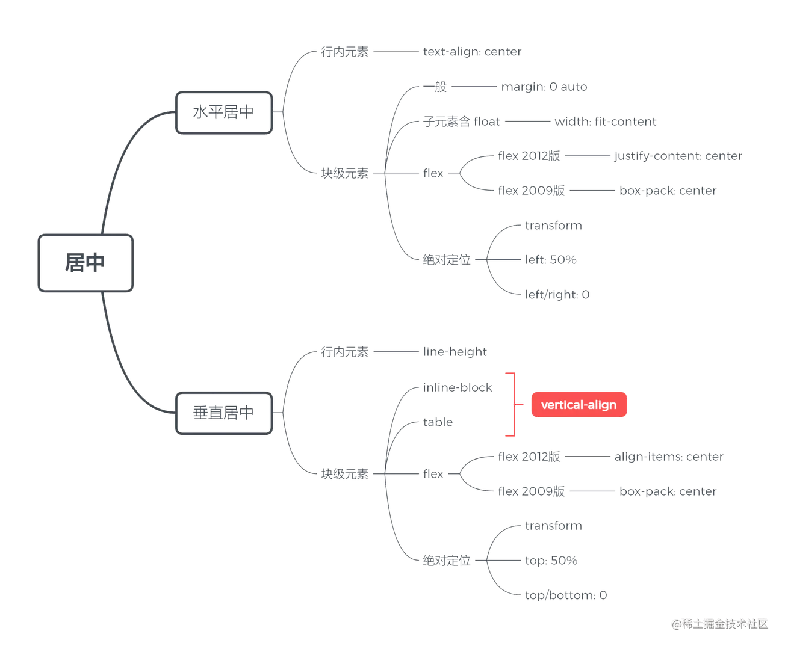
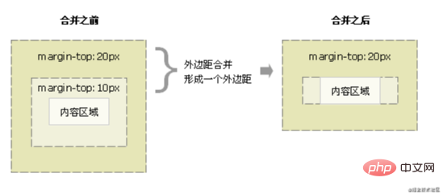
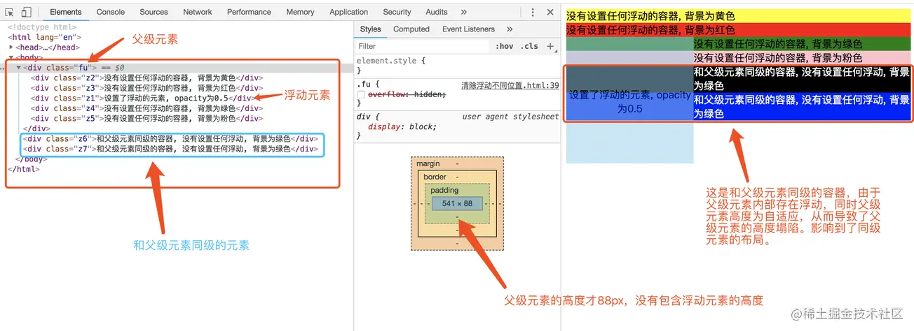
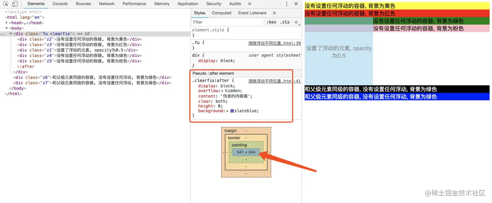
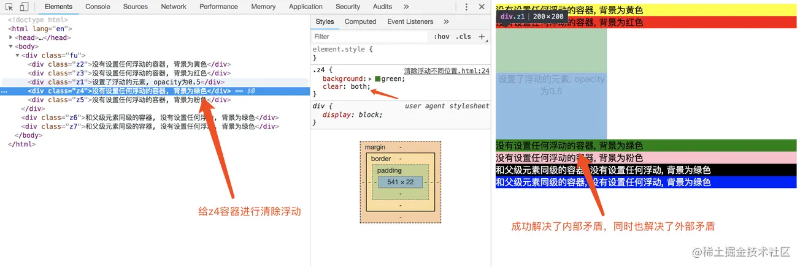

# DOCTYPE

`Doctype`是HTML5的**文档声明**，通过它可以告诉浏览器，**使用哪一个HTML版本标准解析文档**。在浏览器发展的过程中，HTML出现过很多版本，不同的版本之间格式书写上略有差异。如果没有事先告诉浏览器，那么浏览器就不知道**文档解析标准**是什么？此时，大部分浏览器将开启最大兼容模式来解析网页，我们一般称为`怪异模式`，这不仅会降低解析效率，而且会在解析过程中产生一些难以预知的`bug`，所以文档声明是必须的。

# html语义化

1. **概念**：

   HTML5的语义化指的是**合理正确的使用语义化的标签来创建页面结构**。【正确的标签做正确的事】

2. **语义化标签**：

   header nav main article section aside footer

3. **语义化的优点**:

   - 在`没CSS样式的情况下，页面整体也会呈现很好的结构效果`
   - `代码结构清晰`，易于阅读，
   - `利于开发和维护` 方便其他设备解析（如屏幕阅读器）根据语义渲染网页。
   - `有利于搜索引擎优化（SEO）`，搜索引擎爬虫会根据不同的标签来赋予不同的权重

# meta标签

meta标签一般放在整个`html`页面的`head`部分，在`MDN`中对他这样定义：

> meta是**文档级元数据元素**，用来表示那些不能由其它 HTML 元相关元素（`<base>`、`<link>`, `<script>`、`<style>`或 `<title>`）之一表示的任何元数据。

说白了就是为了**传达信息**。

先看看`meta` 元素定义的元数据的类型：

- 如果设置了 `name`属性，`meta` 元素提供的是文档级别的**元数据**，应用于整个页面。
- 如果设置了 `http-equiv`属性，`meta` 元素则是**编译指令**，提供的信息与**类似命名的 HTTP 头部相同**。
- 如果设置了 `charset`属性，`meta` 元素是一个字符集声明，告诉文档使用哪种字符编码。
- 如果设置了 `itemprop` 属性，`meta` 元素提供用户定义的元数据。

**SEO搜索引擎优化**

```html
<!-- 关键词，填写网页关键词，优化SEO的重要标签 -->
<meta name="keywords" content="请输入网页关键字，例如：程序员;写代码;高薪;加班严重"/>
<!-- 声明优先使用的浏览器，例如下面是优先使用的是edge和chrome -->
<meta http-equiv="X-UA-Compatible" content="IE=edge,chrome=1"/>
<!-- 网页概述，优化SEO的重要标签 -->
<meta name="description" content="请输入网页概述，例如：知识社区，前端技术"/>
```

- 自动刷新
- 跳转页面
- 定义语言

## name属性

`name`和`content`一起使用，前者表示要表示的元数据的`名称`，后者是元数据的`值`。

**author**

用来表示网页的作者的名字，例如某个组织或者机构。

```html
<meta name="author" content="aaa@mail.abc.com">
```

**description**

是一段简短而精确的、对页面内容的**描述**。以头条和taobao的`description`标签为例：


**keywords**

与页面内容相关的关键词，使用逗号分隔。某些搜索引擎在遇到这些关键字时，会用这些关键字对文档进行分类。 还是以头条和taobao为例


**viewpoint**

为 viewport（视口）的初始大小提供指示。目前仅用于移动设备。

可能你也发现了，我们在`vscode`中自动生成`html`的代码片段时，会自动生成：

```html
<meta name="viewport" content="width=device-width, initial-scale=1.0">
```

`width`用来设置 viewport 的宽度为设备宽度;

`initial-scale`为设备宽度与 viewport 大小之间的缩放比例。


**robots**

表示爬虫对此页面的处理行为，或者说，应当遵守的规则，是用来做搜索引擎抓取的。

它的`content`可以为：

1. `all`:搜索引擎将索引此网页，并继续通过此网页的链接索引文件将被检索
2. `none`:搜索引擎讲忽略此网页
3. `index`:搜索引擎索引此网页
4. `follow`:搜索引擎继续通过此网页的链接索引搜索其它的网页

**renderer**

用来指定双核浏览器的渲染方式，比如360浏览器，我们可以通过这个设置来指定360浏览器的渲染方式

```html
<meta name="renderer" content="webkit"> //默认webkit内核
<meta name="renderer" content="ie-comp"> //默认IE兼容模式
<meta name="renderer" content="ie-stand"> //默认IE标准模式
```

## http-equiv

`http-equiv`也是和`content`一起使用，前者表示要表示的元数据的`名称`，后者是元数据的`值`。

`http-equiv` 所有允许的值都是特定 HTTP 头部的名称，

**X-UA-Compatible**

我们最常见的`http-equiv`值可能就是`X-UA-Compatible`了，它常常长这个样子：


**指定浏览器渲染方式**

`IE=edge`告诉浏览器，以当前浏览器支持的最新版本来渲染，IE9就以IE9版本来渲染。

`chrome=1`告诉浏览器，如果当前IE浏览器安装了`Google Chrome Frame`插件，就以chrome内核来渲染页面。

像上图这种两者都存在的情况：如果有chrome插件，就以chrome内核渲染，如果没有，就以当前浏览器支持的最高版本渲染。

另外，这个属性支持的范围是`IE8-IE11`

你可能注意到了，如果在我们的`http`头部中也设置了这个属性，并且和`meta`中设置的有冲突，那么哪一个优先呢？ 答案是：开发者偏好（`meta`元素）优先于Web服务器设置（HTTP头）。

**content-type**

用来声明**文档类型和字符集**


**x-dns-prefetch-control**

一般来说，HTML页面中的a标签会自动启用DNS提前解析来提升网站性能，但是在使用https协议的网站中失效了，我们可以设置：


来打开dns对a标签的提前解析

**Refresh**

设置自动刷新或者跳转新页面，其中`content`第一个数字代表 5 秒后自动刷新：

```xml
<meta http-equiv="Refresh" content="5;URL=www.baidu.com" />
```

**Set-Cookie**

设置 Cookie ，如果网页过期，这个网页的cookies的也会被删除：

```xml
<meta http-equiv="Set-Cookie" content="cookie value=xxx;expires=2020 05:28:00 GMT+0800 (CST) path=/" />
```

**Content-Language**

设置页面的语言的：

```xml
<meta http-equiv="Content-Language" content="zh-cn" />
```

**cache-control、Pragma、Expires**

和缓存相关的设置，但是遗憾的是这些往往不生效，我们一般都通过`http headers`来设置缓存策略

# title 与 h1 的区别、b 与 strong 的区别、i 与 em 的区别？

- title 属性表示网页的标题，h1 元素则表示层次明确的页面内容标题，对页面信息的抓取也有很大的影响
- strong 是标明重点内容，有语气加强的含义，使用阅读设备阅读网络时：strong会重读，而b是展示强调内容
- i 是italic(斜体)的简写，是早期的斜体元素，表示内容展示为斜体，而 em 是emphasize（强调）的简写，表示强调的文本

# 严格模式与混杂模式

- 严格模式：是以浏览器支持的最高标准运行
- 混杂模式：页面以宽松向下兼容的方式显示，模拟老式浏览器的行为

# 前端页面三层构成

构成：`结构层`、`表示层`、`行为层`

1. 结构层（structural layer）

   结构层类似于盖房子需要打地基以及房子的悬梁框架，它是由HTML超文本标记语言来创建的，也就是页面中的各种标签，在结构层中保存了用户可以看到的所有内容，比如说：一段文字、一张图片、一段视频等等

2. 表示层（presentation layer）

   表示层是由CSS负责创建，它的作用是如何显示有关内容，学名：`层叠样式表`，也就相当于装修房子，看你要什么风格的，田园的、中式的、地中海的，总之CSS都能办妥

3. 行为层（behaviorlayer）

   行为层表示网页内容跟用户之间产生交互性，简单来说就是用户操作了网页，网页给用户一个反馈，这是`JavaScript`和`DOM`主宰的领域

# iframe的作用以及优缺点

iframe也称作**嵌入式框架**，嵌入式框架和框架网页类似，它可以把一个网页的框架和内容嵌入到现有的网页中。

优点：

- 可以用来处理加载缓慢的内容，比如：广告

缺点：

- iframe会**阻塞主页面的Onload事件**
- iframe和主页面共享连接池，而浏览器对相同域的连接有限制，所以会影响页面的并行加载。但是可以通过JS动态给ifame添加src属性值来解决这个问题，当然也可以解决iframe会阻塞主页面的Onload事件的问题
- 会产生很多页面，不易管理
- 浏览器的**后退按钮没有作用**
- 无法被一些搜索引擎识别

#  img上 title 与 alt

- alt：全称`alternate`，切换的意思，如果无法显示图像，浏览器将显示alt指定的内容
- title：当鼠标移动到元素上时显示title的内容

区别：

一般当鼠标滑动到元素身上的时候显示`title`，而`alt`是img标签特有的属性，是图片内容的等价描述，用于图片无法加载时显示，这样用户还能看到关于丢失了什么东西的一些信息，相对来说比较友好。

# 对于Web标准以及W3C的理解

`Web标准`简单来说可以分为结构、表现、行为。其中结构是由HTML各种标签组成，简单来说就是body里面写入标签是为了页面的结构。表现指的是CSS层叠样式表，通过CSS可以让我们的页面结构标签更具美感。行为指的是页面和用户具有一定的交互，这部分主要由JS组成

`W3C`，全称：world wide web consortium是一个制定各种标准的非盈利性组织，也叫万维网联盟，标准包括HTML、CSS、ECMAScript等等，web标准的制定有很多好处，比如说：

- 可以统一开发流程，统一使用标准化开发工具（VSCode、WebStorm、Sublime），方便多人协作
- 学习成本降低，只需要学习标准就行，否则就要学习各个浏览器厂商标准
- 跨平台，方便迁移都不同设备
- 降低代码维护成本

# Quirks（怪癖）模式和Standards（标准）

页面如果写了DTD，就意味着这个页面采用对CSS支持更好的布局，而如果没有，则采用兼容之前的布局方式，这就是Quirks模式，有时候也叫怪癖模式、诡异模式、怪异模式。

区别：总体会有布局、样式解析、脚本执行三个方面区别，这里列举一些比较常见的区别：

- `盒模型`：在W3C标准中，如果设置一个元素的宽度和高度，指的是元素内容的宽度和高度，然而在Quirks模式下，IE的宽度和高度还包含了padding和border
- `设置行内元素的高宽`：在Standards模式下，给行内元素设置width和height都不会生效，而在Quriks模式下会生效
- `用margin：0 auto设置水平居中`:在Standards模式下，设置margin：0 auto；可以使元素水平居中，但是在Quriks模式下失效
- `设置百分比高度`:在Standards模式下，元素的高度是由包含的内容决定的，如果父元素没有设置百分比的高度，子元素设置百分比的高度是无效的

# 什么是微格式？在前端构建中应该考虑微格式吗？

所谓的微格式是建立在已有的、被广泛采用的标准基础之上的一组简单的、开放的数据格式。

具体表现是把语义嵌入到HTML中，以便有助于分离式开发，并通过制定一些简单的约定，来兼顾HTML文档的人机可读性，相当于对web网页进行语义注解。

采用微格式的web页面，在HTML文档中给一些标签增加一些属性，这些属性对信息的语义结构进行注解，有助于处理HTML文档的软件，更好的理解HTML文档。当爬取web内容时，能够更为准确地识别内容块的语义，微格式可以对网站进行SEO优化。

# HTML5为什么只需要写`<!DOCTYPE html>`?

为什么HTML5只需要写一段：

```html
<!DOCTYPE html>
```

而HTML4却需要写很长的一段

```html
<!DOCTYPE HTML PUBLIC "-//W3C//DTD HTML 4.01 Transitional//EN" "http://www.w3.org/TR/html4/loose.dtd">
```

其实主要是因为HTML5不基于SGML，所以不需要引用DTD。在HTML4中，`<!DOCTYPE>`声明引用DTD，因为HTML4基于SGML。DTD规定了标记语言的规则，这样浏览器才能正确的呈现内容。

# HTML5新特性

HTML5主要是关于图像、位置、存储、多任务等功能的增加：

- **语义化标签**，如：article、footer、header、nav等
- **视频video、音频audio**
- **画布**canvas
- 表单控件，calemdar、date、time、email
- 地理
- 本地离线存储**webStorage**，localStorage长期存储数据，浏览器关闭后数据不丢失，sessionStorage的数据在浏览器关闭后自动删除
- 拖拽释放

移除的元素：

- 纯表现的元素：`basefont、font、s、strike、tt、u、big、center`
- 对可选用性产生负面影响的元素：`frame、frameset、noframes`

# css3新特性

```
  新增各种CSS选择器  （: not(.input)：所有 class 不是“input”的节点）
  圆角           （border-radius:8px）
  多列布局        （multi-column layout）
  阴影和反射        （Shadow\Reflect）
  文字特效      （text-shadow、）
  文字渲染      （Text-decoration）
  线性渐变      （gradient）
  旋转          （transform）
  增加了旋转,缩放,定位,倾斜,动画，多背景
  transform:\scale(0.85,0.90)\ translate(0px,-30px)\ skew(-9deg,0deg)\Animation:
```


# @import和link引入样式的区别

### 1.从属关系区别

`@import`是 CSS 提供的语法规则，**只有导入样式表**的作用；`link`是HTML提供的标签，不仅可以加载 CSS 文件，还可以定义 RSS、rel 连接属性等。rel为relationship表示为两者的关系

> ​    link（链接式）语法为：
>
> ​    <link rel="stylesheet" href="style.css" type="text/css"/>
>
> ​    @import（导入式）语法为：
>
> ​        <style type="text/css">
>
> ​    @import url("style.css");
>
> ​    </style>

### 2.加载顺序区别

加载页面时，`link`标签引入的 CSS 被同时加载；`@import`引入的 CSS 将在页面加载完毕后被加载。

### 3.兼容性区别

`@import`是 CSS2.1 才有的语法，故只可在 IE5+ 才能识别；`link`标签作为 HTML 元素，不存在兼容性问题。

### 4.DOM可控性区别

可以通过 JS 操作 DOM ，插入`link`标签来改变样式；由于DOM方法是基于文档的，无法使用`@import`的方式插入样式。

 **link 标签的加载机制是由浏览器决定的，不同的浏览器可能有不同的表现**。**link标签引入css资源时在火狐浏览器中是异步加载的，在谷歌浏览器中是同步加载的。**

link是**异步**操作 遇到link不会开辟新的HTTP线程去获取资源 GUI继续渲染页面；(这句话并不正确，要想link为异步，应该用以下设置)

```html
<link rel="preload" href="mystyles.css" as="style" onload="this.rel='stylesheet'">
```

@import 是**同步**的 GUI渲染页面的时候遇到@import会等它获取新的样式回来后继续渲染

# src和href的区别

href是Hypertext Reference的简写，表示**超文本引用**，指向**网络资源所在位置**。

常见场景:

```javascript
<a href="http://www.baidu.com"></a> 
<link type="text/css" rel="stylesheet" href="common.css">
```

src是source的简写，目的是要把文件下载到html页面中去。

常见场景:

```javascript
 
<iframe src="top.html"> 
<script src="show.js">
```

### 作用结果

1. href 用于在当前文档和引用资源之间确立联系
2. src 用于替换当前内容

### 浏览器解析方式

1. 当浏览器**遇到href会并行下载资源并且不会停止对当前文档的处理**。(同时也是为什么建议使用 link 方式加载 CSS，而不是使用 @import 方式)
2. 当浏览器解析到src ，**会暂停其他资源的下载和处理，直到将该资源加载或执行完毕**。(这也是script标签为什么放在底部而不是头部的原因)


# 块级元素和内联元素

这道题就是会问你块级元素有哪些和内联元素有哪些及特点，以及之间怎么相互转换

## 块级元素

常见块级元素

```html
<div>、<p>、<h1>-<h6>、<ol>、<ul>、<dl>、<table>、<address>、<blockquote> 、<form>
```

- 块级元素会**独自占据一行**，可以**声明宽和高**
- display:block可以把元素转换为块级元素

## 行内元素

常见行内元素

```html
<a>、<span>、<br>、<i>、<em>、<strong>、<label>、<q>、<var>、<cite>、<code>
```

- 行内元素会出现在一行，不会起新行。**不能直接声明宽高**，如果要声明宽高需要把元素转换为行内或者行内块元素。
- display:inline把元素转换为行内元素

## 行内块元素

常见行内块元素

```html
、<input>
```

- **不自动换行，可以声明宽高**
- display: inline-block将元素转换为行内块元素

# 选择器及优先级

### 基本选择器

| 选择器  | 含义           | 作用                                         | CSS  |
| ------- | -------------- | -------------------------------------------- | ---- |
| .class  | 类选择器       | 匹配 class 包含(不是等于)特定类的元素        | 1    |
| #id     | id选择器       | 匹配特定 id 的元素                           | 1    |
| *       | 通用元素选择器 | 匹配页面任何元素（这也就决定了我们很少使用） | 2    |
| element | 元素选择器     | 选择HTML元素                                 | 1    |

### 组合选择器

| 选择器 | 含义                         | 作用                                                     | CSS  |
| ------ | ---------------------------- | -------------------------------------------------------- | ---- |
| E,F    | 并集选择器                   | 同时匹配元素E或元素F                                     | 1    |
| EF     | 交集选择器                   | 相交的部分为所选择的标签                                 | 1    |
| E F    | 后代选择器                   | 匹配E元素所有的后代（不只是子元素、子元素向下递归）元素F | 1    |
| E>F    | 子元素选择器                 | 匹配E元素的所有直接子元素                                | 2    |
| E+F    | 直接相邻选择器               | 匹配E元素之后的相邻的同级元素F                           | 2    |
| E~F    | 普通相邻选择器（弟弟选择器） | 匹配E元素之后的同级元素F（无论直接相邻与否）             | 3    |

### 属性选择器

| 选择器                  | 示例            | 示例说明                                    | CSS  |
| ----------------------- | --------------- | ------------------------------------------- | :--: |
| [attribute]             | [target]        | 选择所有带有target属性元素                  |  2   |
| [attribute=value]       | [target=-blank] | 选择所有使用target="-blank"的元素           |  2   |
| [attribute~=value]      | [title~=flower] | 选择标题属性包含单词"flower"的所有元素      |  2   |
| [attribute ^= language] | [lang ^= en]    | 选择一个lang属性的**起始值**="EN"的所有元素 |  2   |
| [attribute $= language] | [lang $= en]    | 选择一个lang属性的**结尾值**="EN"的所有元素 |  2   |
| [attribute *= language] | [lang *= en]    | 选择一个lang属性的**包含**"EN"的所有元素    |  2   |

### 伪类选择器

| 选择器           | 示例          | 示例说明                       | CSS  |
| ---------------- | ------------- | ------------------------------ | ---- |
| :link            | a:link        | 选择所有未访问链接             | 1    |
| :visited         | a:visited     | 选择所有访问过的链接           | 1    |
| **:hover**       | a:hover       | 把鼠标放在链接上的状态         | 1    |
| :active          | a:active      | 选择正在活动链接               | 1    |
| :focus           | input:focus   | 选择元素输入后具有焦点         | 2    |
| **:first-child** | p:first-child | 选择作为子元素的第一个p元素    | 2    |
| :last-child      |               | 选取当前选择器下的最后一个元素 |      |
| :only-child      |               | 选取元素唯一的子元素           |      |
| :nth-child(an+b) |               | 选取指定位置的元素,            |      |

### 伪元素选择器

| 选择器                       | 作用                     | 说明                                                         | CSS  |
| ---------------------------- | ------------------------ | ------------------------------------------------------------ | ---- |
| ::before/:before             | 在被选元素前插入内容。   | 需要使用 content 属性来指定要插入的内容。被插入的内容实际上不在文档树中。 | 2    |
| ::after/:after               | 在选被元素后插入内容     | 其用法和特性与:before相似。                                  | 2    |
| ::first-letter/:first-letter | 匹配元素中文本的首字母。 | 被修饰的首字母不在文档树中。                                 | 1    |
| ::first-line/:first-line     | 匹配元素中第一行的文本。 | 这个伪元素只能用在块元素中，不能用在内联元素中。             | 1    |

### 选择器优先级

#### 优先级计算规则

> 内联 > ID选择器 > 类选择器 > 标签选择器。

到具体的计算层⾯，优先级是由 A 、B、C、D 的值来决定的，其中它们的值计算规则如下：

- 如果存在**内联样式**，那么 A = 1, 否则 A = 0
- B的值等于 **ID选择器**出现的次数
- C的值等于 **类选择器** 和 **属性选择器** 和 **伪类** 出现的总次数
- D 的值等于 **标签选择器** 和 **伪元素** 出现的总次数

这里举个例子：

```css
#nav-global > ul > li > a.nav-link
```

套用上面的算法，依次求出 `A` `B` `C` `D` 的值：

- 因为没有内联样式 ，所以 A = 0
- ID选择器总共出现了1次， B = 1
- 类选择器出现了1次， 属性选择器出现了0次，伪类选择器出现0次，所以 C = (1 + 0 + 0) = 1
- 标签选择器出现了3次， 伪元素出现了0次，所以 D = (3 + 0) = 3

上面算出的`A` 、 `B`、`C`、`D` 可以简记作：`(0, 1, 1, 3)`

知道了优先级是如何计算之后，就来看看比较规则：

- 从左往右依次进行比较 ，较大者优先级更高
- 如果相等，则继续往右移动一位进行比较
- 如果4位全部相等，则后面的会覆盖前面的

经过上面的优先级计算规则，我们知道内联样式的优先级最高，如果**外部样式需要覆盖内联样式，就需要使用!important**

即在声明键值对后面加上!important

#### 超越!important的情况

一些情况，我们可以超越 `!important`,

- html:

```
<div class="box" style="background: #f00; width: 300px!important;">我的宽度是多少呢？？<div>
```

- css:

```
.box {
	max-width: 100px;
}
```

这时候 `.box` 的宽度只有 `100px` , 而不是 `300px`, 可见，`max-width` 可以超越 `width!important`!但是，这实际上不是优先级的问题，因为优先级是比较相同属性的，而 `max-width` 和 `width` 是两个不同的属性。

# 水平垂直居中

### 一、水平居中

#### 1.1 行内元素

```css
.parent {
    text-align: center;
}
```

#### 1.2 块级元素

#### 1.2.1 块级元素一般居中方法

```css
.son {
    margin: 0 auto;
}
```

#### 1.2.2 子元素含 float

```css
.parent{
    width:fit-content;
    margin:0 auto;
}

.son {
    float: left;
}
```

#### 1.2.3 Flex 弹性盒子和grid盒子

1） flex 2012版和grid

```css
.parent {
    display: flex;
    justify-content: center;
}
```

2）flex 2009版

```css
.parent {
    display: box;
    box-orient: horizontal;
    box-pack: center;
}
```


#### 1.2.4 绝对定位

1）transform

```css
.son {
    position: absolute;
    left: 50%;
    transform: translate(-50%, 0);
}
```

2）left: 50%

```css
.son {
    position: absolute;
    width: 宽度;
    left: 50%;
    margin-left: -0.5*宽度
}
```

3）left/right: 0

```css
.son {
    position: absolute;
    width: 宽度;
    left: 0;
    right: 0;
    margin: 0 auto;
}
```

### 二、垂直居中

#### 2.1 行内元素

```css
.parent {
    height: 高度;
}

.son {
    line-height: 高度;
}
```

**注：① 子元素 line-height 值为父元素 height 值。② 单行文本。**

#### 2.2 块级元素

#### 2.2.1 行内块级元素

```css
.parent::after, .son{
    display:inline-block;
    vertical-align:middle;
}
.parent::after{
    content:'';
    height:100%;
}
```

适应 IE7。

#### 2.2.2 table

```css
.parent {
  display: table;
}
.son {
  display: table-cell;
  vertical-align: middle;
}
```

**优点**

- 元素高度可以动态改变, 不需再CSS中定义, 如果父元素没有足够空间时, 该元素内容也不会被截断。

**缺点**

- IE6~7, 甚至IE8 beta中无效。

#### 2.2.3 Flex 弹性盒子和grid盒子

1）flex 2012版和grid

```css
.parent {
    display: flex;
    align-items: center;
}
```

flex**优点**

- 内容块的宽高任意, 优雅的溢出。
- 可用于更复杂高级的布局技术中。

flex**缺点**

- IE8/IE9不支持。
- 需要浏览器厂商前缀。
- 渲染上可能会有一些问题。

2）flex 2009版

```css
.parent {
    display: box;
    box-orien: vertical;
    box-pack: center;
}
```

**优点**

- 实现简单, 扩展性强。

**缺点**

- 兼容性差, 不支持IE。

#### 2.2.4 绝对定位

1）transform

```css
.son {
    position: absolute;
    top: 50%;
    transform: translate( 0, -50%);
}
```

**优点**

- 代码少。

**缺点**

- IE8不支持, 属性需要追加浏览器厂商前缀, 可能干扰其他 transform 效果, 某些情形下会出现文本或元素边界渲染模糊的现象。

2）top: 50%

```css
.son {
    position: absolute;
    top: 50%;
    height: 高度;
    margin-top: -0.5高度;
}
```

**优点**

- 适用于所有浏览器。

**缺点**

- 父元素空间不够时, 子元素可能不可见(当浏览器窗口缩小时,滚动条不出现时).如果子元素设置了overflow:auto, 则高度不够时, 会出现滚动条。

3）top/bottom: 0;

```css
.son {
    position: absolute;
    top: 0;
    bottom: 0;
    margin: auto 0;
}
```

**优点**

- 简单。

**缺点**

- 没有足够空间时, 子元素会被截断, 但不会有滚动条

### 




# CSS 三大特性

### 层叠性

所谓层叠性是指多种CSS样式的叠加。

是浏览器处理冲突的一个能力,如果一个属性通过两个相同选择器设置到同一个元素上，那么这个时候一个属性就会将另一个属性层叠掉

比如先给某个标签指定了内部文字颜色为红色，接着又指定了颜色为蓝色，此时出现一个标签指定了相同样式不同值的情况，这就是样式冲突。

一般情况下，如果出现样式冲突，则会按照CSS书写的顺序，以最后的样式为准。

1. 样式冲突，遵循的原则是`就近原则`。 那个样式离着结构近，就执行那个样式。
2. 样式`不冲突，不会层叠`

### 继承性

在**css**中，继承是指的是给父元素设置一些属性，后代元素会自动拥有这些属性

关于继承属性，可以分成：

- 字体系列属性
  - font:组合字体
  - font-family:规定元素的字体系列
  - font-weight:设置字体的粗细
  - font-size:设置字体的尺寸
  - font-style:定义字体的风格
  - font-variant:偏大或偏小的字体
- 文字系列属性
  - text-indent：文本缩进
  - text-align：文本水平
  - line-height：行高
  - word-spacing：增加或减少单词间的空白
  - letter-spacing：增加或减少字符间的空白
  - text-transform：控制文本大小写
  - direction：规定文本的书写方向
  - color：文本颜色
- 元素可见性
  - visibility
- 表格布局属性
  - caption-side：定位表格标题位置
  - border-collapse：合并表格边框
  - border-spacing：设置相邻单元格的边框间的距离
  - empty-cells：单元格的边框的出现与消失
  - table-layout：表格的宽度由什么决定
- 列表属性
  - list-style-type：文字前面的小点点样式
  - list-style-position：小点点位置
  - list-style：以上的属性可通过这属性集合
- 引用
  - quotes：设置嵌套引用的引号类型
- 光标属性
  - cursor：箭头可以变成需要的形状

> 继承中比较特殊的几点：

- a 标签的字体颜色不能被继承
- h1-h6标签字体的大下也是不能被继承的

> 无继承的属性

- display
- 文本属性：vertical-align、text-decoration
- 盒子模型的属性：宽度、高度、内外边距、边框等
- 背景属性：背景图片、颜色、位置等
- 定位属性：浮动、清除浮动、定位position等
- 生成内容属性：content、counter-reset、counter-increment
- 轮廓样式属性：outline-style、outline-width、outline-color、outline
- 页面样式属性：size、page-break-before、page-break-after

### 优先级

总结优先级：

1. 使用了 !important声明的规则。
2. 内嵌在 HTML 元素的 style属性里面的声明。
3. 使用了 ID 选择器的规则。
4. 使用了类选择器、属性选择器、伪元素和伪类选择器的规则。
5. 使用了元素选择器的规则。
6. 只包含一个通用选择器的规则。
7. 同一类选择器则遵循就近原则。


# 盒模型/margin塌陷

### 定义

CSS盒模型本质上是一个盒子，封装周围的HTML元素，它包括：`外边距（margin）`、`边框（border）`、`内边距（padding）`、`实际内容（content）`四个属性。

盒模型各部分说明：

- Margin(外边距) ：清除边框外的区域，外边距是透明的（可以为负值）。
- Border(边框) ：围绕在内边距和内容外的边框。
- Padding(内边距) ：清除内容周围的区域，内边距是透明的（不允许负值）。
- Content(内容) ：盒子的内容，显示文本和图像。

### 盒模型分类

盒模型分为两类: IE盒模型和W3C标准盒模型。 两者的区别在于:

> IE盒模型的width/height = content + border + padding
> 标准盒模型的width/height = content

#### CSS如何设置这两种模型

标准：`box-sizing: content-box;` ( 浏览器默认设置 )
IE： `box-sizing: border-box;`

css的盒模型由content(内容)、padding(内边距)、border(边框)、margin(外边距)组成。**但盒子的大小由content+padding+border这几部分决定**，**把margin算进去的那是盒子占据的位置，而不是盒子的大小！**

我们可以试着给上面的粉色方块设置box-sizing属性为**border-box**发现，会发现：无论我们怎么改border和padding盒子大小始终是定义的width和height.

### JS如何获取盒模型对应的宽和高

```js
1``) dom.style.width/height【只能取到内联元素】
2``) dom.currentStyle.width/height【只有IE支持】
3``) document.getComputedStyle(dom,null).width/height 取到的是最终渲染后的宽和高，如果有设置宽高，则不论哪种盒模型获取到的都是设置的宽高，和currentStyle相同，但是兼容性更好，IE9 以上支持。
4``) dom.getBoundingClientRect().width/height 得到渲染后的宽和高，大多浏览器支持。IE9以上支持。
5``) dom.offsetWidth/offsetHeight【常用】包括高度（宽度）、内边距和边框，不包括外边距。最常用，兼容性最好。
```

### 根据盒模型解释边距重叠(边距塌陷)

边距重叠是指两个【**垂直**】 【**相邻**】的**块级元素**，当上下两个边距相遇时，其外边距会产生重叠现象，且重叠后的外边距，等于其中较大者。（水平方向不会发生）

**注意**：只有普通文档流中**块框的垂直外边距才会发生外边距合并**，行内框、浮动框或绝对定位之间的外边距不会合并。

#### 原因

根据[W3C文档](https://link.juejin.cn/?target=https%3A%2F%2Fwww.w3.org%2FTR%2FCSS22%2Fbox.html%23collapsing-margins)的说明，当符合以下条件时，就会触发外边距重合

- 都是普通流中的元素且属于同一个 BFC
- 没有被 padding、border、clear 或非空内容隔开
- 两个或两个以上垂直方向的「相邻元素」

> 相邻元素包括父子元素和兄弟元素

**『重叠后的margin计算』**

- 1、margin都是正值时取较大的margin值
- 2、margin都是负值时取绝对值较大的，然后负向位移。
- 3、margin有正有负，从负值中选绝对值最大的，从正值中选取绝对值最大的，然后相加

#### 边距重叠详解及解决方案

**1、嵌套块（父子）元素垂直外边距的合并**

对于两个嵌套关系的块元素，如果父元素没有`padding-top`及`border`，则父元素的`margin-top`会与子元素的`margin-top`发生合并，合并后的外边距为两者中的较大者，即使父元素的上外边距为0，也会发生合并。



**『解决办法』**

1、为**父元素**定义1px的**border**-top或**padding**-top。

2、触发bfc(块级格式上下文),改变父级的渲染规则

改变父级的渲染规则有以下四种方法,给父级盒子添加 **OFDP**

```scss
(1)position:absolute/fixed

(2)display:inline-block;

(3)float:left/right;

(4)overflow:hidden;
```

这四种方法都能触发bfc,但是使用的时候都会带来不同的麻烦,具体使用中还需根据具体情况选择没有影响的来解决margin塌陷

3、父元素加前置内容（::before）生成。


**2、相邻块（兄弟）元素垂直外边距的合并（外边距塌陷）**

当上下相邻的两个块元素相遇时，如果

- 上面的元素有下外边距margin-bottom，
- 下面的元素有上外边距margin-top，

则他们之间的垂直间距**不是margin-bottom与margin-top之和**，而是**两者中的较大者**。


**『解决办法』**

1）为了达到想要的间距，最好在设置margin-top/bottom值时统一设置上或下；

2）用BFC解决，1、给第二个元素加上为BFC的父级元素；2、给两个元素都加上为BFC的父元素


# BFC

**BFC(Block Formatting Context)**：**块级格式化上下文**。
一个**独立**的**块级渲染区域**，该区域拥有一套**渲染规格**来约束**块级盒子**的**布局**，且与区域外部无关。

### BFC的布局规则（原理/渲染规则）

（1）内部的 `Box` 会在**垂直方向**，从顶部开始一个接着一个地放置；
（2）`Box` 垂直方向的距离由 `margin` (外边距)决定，属于同一个 `BFC` 的两个相邻 `Box` 的 `margin` 会发生重叠；
（3）每个元素的 `margin Box` 的左边， 与包含块 `border Box` 的左边相接触，（对于从左到右的格式化，否则相反）。即使存在浮动也是如此；
（4）BFC 在页面上是一个**隔离的独立容器**，**里外元素互不影响**。文字环绕效果，设置 `float`；
（5）BFC 的区域不会与 `float Box` 重叠（**清浮动**）;
（6）计算 `BFC` 的**高度时，浮动元素也参与计算**。

### 创建出BFC的情况（即脱离文档流）（OFDP）

1. 根元素，即 HTML 元素（最大的一个 `BFC`）
2. 浮动（ `float 的值不为 none` ）
3. 绝对定位元素（ `position 的值为 absolute 或 fixed` ）
4. 行内块（ `display 为 inline-block` ）
5. 表格单元（ `display 为 table、table-cell、table-caption、inline-block 等 HTML 表格相关的属性` )
6. 弹性盒（ `display 为 flex 或 inline-flex` ）
7. 网格布局（ `display 为 grid 或 inline-grid` ）
8. 默认值。内容不会被修剪，会呈现在元素框之外（`overflow 不为 visible`）

> 并不是任意一个元素都可以被当做BFC，只有当这个元素满足以上任意一个条件的时候，这个元素才会被当做一个BFC

### BFC作用（使用场景）

1、**防止margin塌陷**，分属于不同的 `BFC` 时，可以阻止 `margin` 重叠，**垂直方向margin塌陷问题**

2、自适应两（三）栏布局（避免多列布局由于宽度计算四舍五入而自动换行）
3、避免元素被浮动元素覆盖
4、可以让**父元素**的高度包含子浮动元素，**清除内部浮动**,**防止塌陷**（原理：触发父 `div` 的 `BFC` 属性，使下面的子 `div` 都处在父 `div`的同一个 `BFC` 区域之内）

# 浮动

浮动会**使当前元素脱离文档流**，浮动元素碰到包含**它的边框或者浮动元素的边框停留**。会影响页面布局，可以通过清除浮动来解决。同时浮动**会造成父元素高度塌陷**，影响和父元素同级的Dom布局，可以触发父元素的BFC解决。

加了浮动之后的元素,会具有很多特性,需要我们掌握的.

1．浮动元素**会脱离标准流**(脱标)

2．浮动的元素**会一行内显示并且元素顶部对齐**

3．浮动的元素会具有**行内块元素的特性**

### 浮动的影响

`float`不会影响前面已经渲染好的文档，而会影响在其后面将要渲染的文档。

> 第一个影响：影响了后面元素的布局。

> 第二个影响：影响了父容器的高度，正常父元素的高度是自适应的，高度为其包含的内容总高度，而内部元素的浮动造成了父容器高度塌陷。（脱离标准流）

> 第三个影响：父容器高度塌陷了，将会影响和父元素同级的文档布局。

要解决这三个影响，需要从两个方向思考：

> 第一个方向：解决父元素给其同级的元素造成的影响，比喻成解决**外部矛盾**。

> 第二个方向：解决父级元素内部的浮动元素对其同级元素的影响，比喻成解决**内部矛盾**。



如图所示，绿粉为内部影响，黑蓝为外部影响。

### 解决外部矛盾（解决父元素给其同级的元素造成的影响）

### 1、触发bfc

触发方式：可以给父级元素设置`overflow:auto`，hidden或者scroll都行

### 2、clear原理

> clear属性用于在块级元素中清除浮动效果,其值可以设置成：
>
> clear：both 清除左右两边的的浮动
> clear：left 清除左边的浮动
> clear： right 清除右边浮动
> clear： none 左右都有浮动效果

设置了clear属性的元素，相应的会在两侧按照没有浮动元素的样式排下去，所以不会受到浮动元素的影响，从而实现清除浮动

**1、after伪元素清除浮动**

```css
    .clearfix:after {
        display: block;
        overflow: hidden;
        content: '';
        clear: both;
        height: 0;
    }
//给父元素添加这个class即可
```

**本质**上就是给**父元素**再加一个**块级子容器**，当然这个也就是父元素的最后一个块级子容器了。同时给这个**块级子容器设置clear属性来清除其浮动**，这样这个子容器就能排列在**浮动元素的后面**，同时也把父元素的高度撑起来了。那么父元素的同级元素也能正常排列了。所以这个子容器不能有高度和内容，不然会影响父元素的布局。

**2、额外标签法**

在浮动**父元素**结束标签之前插入**清除浮动的块级元素**。假设空块级元素为`<div class='emptyClear'></div>`。我们还需要为其设置清楚浮动的CSS属性

```css
.emptyClear{
    clear:both;
}
```

> 在父级元素末尾添加的元素必须是一个**块级元素**，否则无法撑起父级元素高度。

**3、双伪元素清除浮动**

```css
.clearfix:before,
.clearfix:after {
    content: "";
    display: table;
}
.clearfix:after {
    clear: both;
}
//给父元素添加这个class即可
```

原理是给父元素添加第一个子容器和最后一个子容器。

**三种方法的原理一样，都是添加块级子容器来清除浮动。**

解决**外部矛盾**的效果如图：



### 解决内部矛盾

解决内部矛盾的原理和解决外部矛盾的第二种方式的原理是一样的，通过给**被浮动影响的第一个元素**进行清除浮动，就可以使后面的元素也不会受到浮动影响了。

```css
  .z4 {
    background: green;
    clear:both;/*加了这个*/
  }
```

**给内部元素设置`clear:both;`清除浮动后，会直接解决内部矛盾和外部矛盾。**




# 定位

**文档流**

文档流就是HTML文档内所有元素按照一定规律排列并显示的形式。

CSS文档流大致可以分为3种：标准流，浮动流，定位流。

| **值**   | **描述**                                                     | **归属文档流** |
| -------- | ------------------------------------------------------------ | -------------- |
| static   | **默认值**，**静态定位**，**没有定位**，元素出现在**正常的流**中（忽略 top, bottom, left, right 或者 z-index 声明）。 | 常规文档流     |
| relative | 参照**自身**在常规流中的位置通过top，right，bottom，left这4个定位**偏移属性**进行偏移时**不会影响常规流中的任何元素** | 常规文档流     |
| absolute | 生成**绝对定位**的元素，相对于 static 定位以外的第一个父元素进行定位。元素的位置通过 "left", "top", "right" 以及 "bottom" 属性进行规定。  偏移属性参照的是**离自身最近的定位祖先元素**，如果没有定位的祖先元素，则一直回溯到body元素。**盒子的偏移位置不影响常规流中的任何元素，其margin不与其他任何margin折叠** | 脱离文档流     |
| fixed    | 生成**绝对定位**的元素，相对于**浏览器窗口**进行定位。 元素的位置通过 "left", "top", "right" 以及 "bottom" 属性进行规定。  与absolute一致，但偏移定位是以窗口为参考。当出现滚动条时，对象不会随着滚动 | 脱离文档流     |
| inherit  | 规定应该从父元素继承 position 属性的值。                     |                |
| sticky   | **粘性定位**position: sticky; 的元素根据用户的滚动位置进行定位。 粘性元素根据滚动位置在相对（relative）和固定（fixed）之间切换。起先它会被**相对定位**，直到在视口中遇到给定的偏移位置为止 - 然后将其“粘贴”在适当的位置（比如 position:fixed）。 | 常规文档流     |

**只要不是float和绝对定位方式布局，都在文档流里**

### absolute 详解

加了absolute定位后后面是文字的话，文字会被图片遮盖了，这点和**float**不同。float是欺骗父元素，让其父元素误以为其高度塌陷了，但**float元素本身仍处于文档流**中，文字会环绕着float元素，不会被遮蔽。

但absolute其实已经不能算是欺骗父元素了，而是出现了**层级**关系。从父元素的视点看，设成absolute的图片已经完全消失不见了，因此从最左边开始显示文字。而absolute的层级高，所以图片遮盖了文字。

### 堆叠顺序z-index

在使用定位布局时，可能会出现盒子重叠的情况。

加了定位的盒子，默认`后来者居上`， 后面的盒子会压住前面的盒子。

应用 `z-index` 层叠等级属性可以**调整盒子的堆叠顺序**。如下图所示：

`z-index` 的特性如下：

1. 属性值：正整数、负整数或 0，默认值是 0，数值越大，盒子越靠上；
2. 如果属性值相同，则按照书写顺序，后来居上；
3. 数字后面不能加单位。

注意：`z-index` 只能应用于**相对定位**、**绝对定位**和**固定定位**的元素，其他标准流、浮动和静态定位无效。

### 减少重绘和回流的开销

例如将元素隐藏，你或许会用display:none。

其实我更推荐的是absolute控制隐藏和显示。方法当然相当简单，如absolute+ top:-9999em，或absolute + visibility:hidden。

优点是absolute由于层级的关系，隐藏和显示只会重绘，但不会回流（其实我对absolute不会导致回流这一观点是持怀疑态度的，说不会回流显得过于武断，应该是absolute的回流开销小于正常DOM流中回流的开销。但我战斗力不够，尚未找到靠谱合理的检测回流的方法）。而用display:none会导致render tree重绘和回流。

另外，考虑到重绘和回流的开销，可以将动画效果放到absolute元素中，避免浏览器将render tree回流。

# flexbox（弹性盒布局模型）

`Flexible Box` 简称 `flex`，意为”弹性布局”，可以简便、完整、响应式地实现各种页面布局

采用Flex布局的元素，称为`flex`容器`container`

**它的所有子元素自动成为容器成员**，称为flex**项目item**

**任何一个容器都可以指定为 Flex 布局**,行内元素也可以使用 Flex 布局,Webkit 内核的浏览器，必须加上`-webkit`前缀。

**注意，设为 Flex 布局以后，子元素的`float`、`clear`和`vertical-align`属性将失效。**


容器中默认存在**两条轴，主轴和交叉轴**，呈90度关系。**项目默认沿主轴排列**，通过`flex-direction`来决定主轴的方向

每根轴都有起点和终点，这对于元素的对齐非常重要

## 属性

关于`flex`常用的属性，我们可以划分为**父容器属性**和**容器成员属性**

### 父容器属性

- flex-direction
- flex-wrap
- flex-flow
- justify-content
- align-items
- align-content

#### **flex-direction**

决定主轴的方向(即项目的排列方向)

```css
.container {   
    flex-direction: row | row-reverse | column | column-reverse;  
} 
```

属性对应如下：

- row（默认值）：主轴为水平方向，起点在左端
- row-reverse：主轴为水平方向，起点在右端
- column：主轴为垂直方向，起点在上沿。
- column-reverse：主轴为垂直方向，起点在下沿

如下图所示：


#### **flex-wrap**

弹性元素永远沿主轴排列，那么如果主轴排不下，通过`flex-wrap`决定容器内项目**是否可换行**

```css
.container {  
    flex-wrap: nowrap | wrap | wrap-reverse;
}  
```

属性对应如下：

- nowrap（默认值）：不换行
- wrap：换行，第一行在下方
- wrap-reverse：换行，第一行在上方

默认情况是不换行，但这里也不会任由元素直接溢出容器，会涉及到元素的弹性伸缩

#### **flex-flow**

是`flex-direction`属性和`flex-wrap`属性的简写形式，默认值为`row nowrap`

```css
.box {
  flex-flow: <flex-direction> || <flex-wrap>;
}
```

#### **justify-content**

定义了项目在**主轴上的对齐方式**

```css
.box {
    justify-content: flex-start | flex-end | center | space-between | space-around;
}
```

属性对应如下：

- flex-start（默认值）：左对齐
- flex-end：右对齐
- center：居中
- space-between：两端对齐，项目之间的间隔都相等
- space-around：两个项目两侧间隔相等

效果图如下：


#### align-items

定义项目在交叉轴上如何对齐

```css
.box {
  align-items: flex-start | flex-end | center | baseline | stretch;
}
```

属性对应如下：

- flex-start：交叉轴的起点对齐
- flex-end：交叉轴的终点对齐
- center：交叉轴的中点对齐
- baseline: 项目的第一行文字的基线对齐
- stretch（默认值）：如果项目未设置高度或设为auto，将占满整个容器的高度

#### align-content

定义了多根轴线的对齐方式。如果项目只有一根轴线，该属性不起作用

```css
.box {
    align-content: flex-start | flex-end | center | space-between | space-around | stretch;
}
```

属性对应如吓：

- flex-start：与交叉轴的起点对齐
- flex-end：与交叉轴的终点对齐
- center：与交叉轴的中点对齐
- space-between：与交叉轴两端对齐，轴线之间的间隔平均分布
- space-around：每根轴线两侧的间隔都相等。所以，轴线之间的间隔比轴线与边框的间隔大一倍
- stretch（默认值）：轴线占满整个交叉轴

效果图如下：


### 容器成员属性

**容器成员属性**如下：

- `order`
- `flex-grow`
- `flex-shrink`
- `flex-basis`
- `flex`
- `align-self`

#### order

定义项目的排列顺序。数值越小，排列越靠前，默认为0

```css
.item {
    order: <integer>;
}
```

#### flex-grow

上面讲到当容器设为`flex-wrap: nowrap;`不换行的时候，容器宽度**有不够分**的情况，弹性元素会根据`flex-grow`来决定

定义项目的放大比例（容器宽度>元素总宽度时如何伸展）

默认为`0`，即如果存在剩余空间，也不放大

```css
.item {
    flex-grow: <number>;
}
```

如果所有项目的`flex-grow`属性都为1，则它们将等分剩余空间（如果有的话）


如果一个项目的`flex-grow`属性为2，其他项目都为1，则前者占据的剩余空间将比其他项多一倍


弹性容器的宽度正好等于元素宽度总和，无多余宽度，此时无论`flex-grow`是什么值都不会生效

#### flex-shrink

定义了项目的缩小比例（容器宽度<元素总宽度时如何收缩），默认为1，**即如果空间不足**，该项目将缩小

```css
.item {
    flex-shrink: <number>; /* default 1 */
}
```

如果所有项目的`flex-shrink`属性都为1，当空间不足时，都将等比例缩小

如果一个项目的`flex-shrink`属性为0，其他项目都为1，则空间不足时，前者不缩小


在容器宽度有剩余时，`flex-shrink`也是不会生效的

#### flex-basis

设置的是元素在主轴上的**初始尺寸**，所谓的初始尺寸就是元素在`flex-grow`和`flex-shrink`生效前的尺寸

浏览器根据这个属性，计算主轴是否有多余空间，默认值为`auto`，即项目的本来大小，如设置了`width`则元素尺寸由`width/height`决定（主轴方向），没有设置则由内容决定

```css
.item {
   flex-basis: <length> | auto; /* default auto */
}
```

当设置为0的是，会根据内容撑开

它可以设为跟`width`或`height`属性一样的值（比如350px），则项目将占据固定空间

#### flex

`flex`属性是`flex-grow`, `flex-shrink` 和 `flex-basis`的简写，默认值为`0 1 auto`，也是比较难懂的一个复合属性

```css
.item {
  flex: none | [ <'flex-grow'> <'flex-shrink'>? || <'flex-basis'> ]
}
```

一些属性有：

- flex: 1 = flex: 1 1 0%
- flex: 2 = flex: 2 1 0%
- flex: auto = flex: 1 1 auto
- flex: none = flex: 0 0 auto，常用于固定尺寸不伸缩

`flex:1` 和 `flex:auto` 的区别，可以归结于`flex-basis:0`和`flex-basis:auto`的区别

当设置为0时（绝对弹性元素），此时相当于告诉`flex-grow`和`flex-shrink`在伸缩的时候不需要考虑我的尺寸

当设置为`auto`时（相对弹性元素），此时则需要在伸缩时将元素尺寸纳入考虑

注意：建议优先使用这个属性，而不是单独写三个分离的属性，因为浏览器会推算相关值

#### align-self

允许单个项目有与其他项目不一样的对齐方式，可覆盖`align-items`属性

默认值为`auto`，表示继承父元素的`align-items`属性，如果没有父元素，则等同于`stretch`

```css
.item {
    align-self: auto | flex-start | flex-end | center | baseline | stretch;
}
```

效果图如下：


# flex布局经典场景

## 水平垂直居中

```css
.box{
    display: flex;
    width: 100%;
    height: 500px;
    background: #CCCCCC;
    justify-content: center;   //主轴居中
    align-items: center; //交叉轴居中    
   }
   
   .box div{
    width: 50px;
    height: 50px;
    background: red;
    border:2px solid #007AFF;
  
   }
 <div class="box">
  <div class="div1">你大爷</div>
 </div>
```

## 每行的项目数固定并自动换行的列表项

```css
ul{
  display:flex;
  flex-wrap:wrap;
}
li{
  list-style:none;
  flex:0 0 25%;
  background:#ddd;
  height:100px;
  border:1px solid red;
}

```

## 两列布局

### 左列定宽右列自适应

html代码:

```xml
<body>
<div id="parent">
    <div id="left">左列定宽</div>
    <div id="right">右列自适应</div>
</div>
</body>

```

css代码:

```css
#parent{
    width: 100%;
    height: 500px;
    display: flex;
}
#left {
    width: 100px;
    background-color: #f00;
}
#right {
    flex: 1; /*均分了父元素剩余空间*/
    background-color: #0f0;
}
```

### 一列不定，一列自适应

html代码:

```xml
<body>
<div id="parent">
    <div id="left">左列不定宽</div>
    <div id="right">右列自适应</div>
</div>
</body>
```

css代码:

```css
#parent{
    display: flex;
}
#left { /*不设宽度*/
    margin-right: 10px;
    height: 500px;
    background-color: #f00;
}
#right {
    height: 500px;
    background-color: #0f0;
    flex: 1;  /*均分#parent剩余的部分*/
}
```

## 三列布局

左右定宽中间自适应

```xml
<body>
<div id="parent">
    <div id="left">左列定宽</div>
    <div id="center">中间自适应</div>
    <div id="right">右列定宽</div>
</div>
</body>

复制代码
```

css代码:

```css
#parent {
    height: 500px;
    display: flex;
}
#left {
    width: 100px;
    background-color: #f00;
}
#center {
    flex: 1;  /*均分#parent剩余的部分*/
    background-color: #eeff2b;
}
#right {
    width: 200px;
    background-color: #0f0;
}
```

## 平均分配空间的栅格布局

  各大UI里栅格布局基本是必备的布局之一，平均分配布局又是栅格布局里最常用的布局，利用flex实现平均分配的栅格布局，关键之处就是利用它的自动收缩空间。


图4

html如下：

```ini
<div class="row">
         <div class="column">column1</div>
         <div  class="column">colum22</div>
         <div  class="column">colum322</div>
</div>

```

css如下：

```css
.row{
  display:flex;
  flex-wrap:wrap;
  border:1px solid black;
}
.column{
  list-style:none;
  background:#ddd;
  flex:1;               == flex: 1 1 0%
  height:100px; 
  border:1px solid red;
}
```


## 上-中-下布局

```css
* {
    margin: 0;
    padding: 0;
}
body {
    min-height: 100vh;
    display: flex;
    flex-direction: column;
}
header {
    /*min-height: 50px;*/
    flex: none;
    background-color: cadetblue;
}
article {
    flex: auto;
    /*flex-basis: auto;*/
}
footer {
    /*min-height: 50px;*/
    flex: none;
    background-color: aqua;
}
```

```html
<body>
    <header>HEADER</header>
    <article>CONTENT</article>
    <footer>FOOTER</footer>
</body>
```

demo 1 - Sticky Footer

## Fixed-Width Sidebar

在上-中-下布局的基础上，加了左侧定宽 sidebar。

```css
        * {
            margin: 0;
            padding: 0;
        }
        body {
            min-height: 100vh;
            display: flex;
            flex-direction: column;
        }
        header {

            background-color: cadetblue;
        }
        footer {

            background-color: aqua;
        }
        .content {
            flex: auto;
            display: flex;
        }
        .content aside {
            background-color: blanchedalmond;
            width: 900px;
        }
        .content article {
            flex: auto;
        }
```

```html
<body>
<header>HEADER</header>
<div class="content">
    <aside>ASIDE</aside>
    <article>CONTENT</article>
</div>
<footer>FOOTER</footer>
</body>
```


demo 2 - Fixed-Width Sidebar

## Sidebar

左边是定宽 sidebar，右边是上-中-下布局。

demo 3

```css
<body>
  <aside>ASIDE</aside>
  <div class="content">
    <header>HEADER</header>
    <article>CONTENT</article>
    <footer>FOOTER</footer>
  </div>
</body>复制代码
body {
  min-height: 100vh;
  display: flex;
}
aside {
  flex: none;
}
.content {
  flex: auto;
  display: flex;
  flex-direction: column;
}
.content article {
  flex: auto;
}
.content header {
  background-color: cadetblue;
}
.content footer {
  background-color: aqua;
}
```

## Sticky Header

demo 4 - Sticky Header


```css
<body>
  <header>HEADER</header>
  <article>CONTENT</article>
  <footer>FOOTER</footer>
</body>复制代码
body {
  min-height: 100vh;
  display: flex;
  flex-direction: column;
  padding-top: 60px;
}
header {
  height: 60px;
  position: fixed;
  top: 0;
  left: 0;
  right: 0;
  padding: 0;
}
article {
  flex: auto;
  height: 1000px;
}
```

## 圣杯布局

```css
        body {
            display: flex;
            flex-direction: column;
            min-height: 100vh;
            font-weight: bolder;
        }

        header,
        footer {
            height: 150px;
            background-color: #666;
            display: flex;
            justify-content: center;
            align-items: center;
            flex: none;
        }

        .content {
            flex: 1; /* 高度自适应 */
            display: flex;
        }

        nav,
        aside {
            background-color: #eb6f43;
            flex: 0 1 200px;
            display: flex;
            justify-content: center;
            align-items: center;
        }

        main {
            display: flex;
            justify-content: center;
            align-items: center;
            flex: 1; /* 宽度自适应 */
            background-color: #d6d6d6;
        }

        nav {
            order: -1; /* 调整顺序在main前面 */
        }
```

```html
<body>
<header>
    header
</header>
<div class="content">
    <main>main</main>
    <nav>nav</nav>
    <aside>aside</aside>
</div>
<footer>
    footer
</footer>
</body>
```


# grid网格布局

`Grid` 布局即网格布局，是一个**二维**的布局方式，由纵横相交的**两组网格线**形成的框架性布局结构，能够同时处理行与列

擅长将一个页面划分为几个主要区域，以及定义这些区域的大小、位置、层次等关系


这与之前讲到的**`flex`一维布局**不相同

设置`display:grid/inline-grid`的元素就是网格布局容器，这样就能出发浏览器渲染引擎的网格布局算法

```css
<div class="container">
    <div class="item item-1">
        <p class="sub-item"></p >
 	</div>
    <div class="item item-2"></div>
    <div class="item item-3"></div>
</div> 
```

上述代码实例中，`.container`元素就是网格布局容器，`.item`元素就是网格的项目，由于**网格元素只能是容器的顶层子元素**，所以`p`元素并不是网格元素

这里提一下，网格线概念，有助于下面对`grid-column`系列属性的理解

网格线，即划分网格的线，如下图所示：


上图是一个 2 x 3 的网格，共有3根水平网格线和4根垂直网格线

## 属性

同样，`Grid` 布局属性可以分为两大类：

- 容器属性，
- 项目属性

### 容器属性

**display 属性**

文章开头讲到，在元素上设置`display：grid` 或 `display：inline-grid` 来创建一个网格容器

- display：grid 则该容器是一个块级元素
- display: inline-grid 则容器元素为行内元素

**grid-template-columns 属性，grid-template-rows 属性**

`grid-template-columns` 属性设置列宽，`grid-template-rows` 属性设置行高

```css
.wrapper {
  display: grid;
  /*  声明了三列，宽度分别为 200px 200px 200px */
  grid-template-columns: 200px 200px 200px;
  grid-gap: 5px;
  /*  声明了两行，行高分别为 50px 50px  */
  grid-template-rows: 50px 50px;
}
```

以上表示固定列宽为 200px 200px 200px，行高为 50px 50px

上述代码可以看到重复写单元格宽高，通过使用`repeat()`函数，可以简写重复的值

- 第一个参数是重复的次数
- 第二个参数是重复的值

所以上述代码可以简写成

```css
.wrapper {
  display: grid;
  grid-template-columns: repeat(3,200px);
  grid-gap: 5px;
  grid-template-rows:repeat(2,50px);
}
```

除了上述的`repeact`关键字，还有：

- auto-fill：示自动填充，让一行（或者一列）中尽可能的容纳更多的单元格

> `grid-template-columns: repeat(auto-fill, 200px)` 表示列宽是 200 px，但列的数量是不固定的，只要浏览器能够容纳得下，就可以放置元素

- fr：片段，为了方便表示比例关系

> `grid-template-columns: 200px 1fr 2fr` 表示第一个列宽设置为 200px，后面剩余的宽度分为两部分，宽度分别为剩余宽度的 1/3 和 2/3

- minmax：产生一个长度范围，表示长度就在这个范围之中都可以应用到网格项目中。第一个参数就是最小值，第二个参数就是最大值

> ```
> minmax(100px, 1fr)`表示列宽不小于`100px`，不大于`1fr
> ```

- auto：由浏览器自己决定长度

> `grid-template-columns: 100px auto 100px` 表示第一第三列为 100px，中间由浏览器决定长度

**grid-row-gap 属性， grid-column-gap 属性， grid-gap 属性**

`grid-row-gap` 属性、`grid-column-gap` 属性分别设置行间距和列间距。`grid-gap` 属性是两者的简写形式

`grid-row-gap: 10px` 表示行间距是 10px

`grid-column-gap: 20px` 表示列间距是 20px

`grid-gap: 10px 20px` 等同上述两个属性

**grid-template-areas 属性**

用于定义区域，一个区域由一个或者多个单元格组成

```css
.container {
  display: grid;
  grid-template-columns: 100px 100px 100px;
  grid-template-rows: 100px 100px 100px;
  grid-template-areas: 'a b c'
                       'd e f'
                       'g h i';
}
```

上面代码先划分出9个单元格，然后将其定名为`a`到`i`的九个区域，分别对应这九个单元格。

多个单元格合并成一个区域的写法如下

```css
grid-template-areas: 'a a a'
                     'b b b'
                     'c c c';
```

上面代码将9个单元格分成`a`、`b`、`c`三个区域

如果某些区域不需要利用，则使用"点"（`.`）表示

**grid-auto-flow 属性**

划分网格以后，容器的子元素会按照顺序，自动放置在每一个网格。

顺序就是由`grid-auto-flow`决定，默认为行，代表"先行后列"，即先填满第一行，再开始放入第二行


当修改成`column`后，放置变为如下：


**justify-items 属性， align-items 属性， place-items 属性**

`justify-items` 属性设置单元格内容的水平位置（左中右），`align-items` 属性设置单元格的垂直位置（上中下）

两者属性的值完成相同

```css
.container {
  justify-items: start | end | center | stretch;
  align-items: start | end | center | stretch;
}
```

属性对应如下：

- start：对齐单元格的起始边缘
- end：对齐单元格的结束边缘
- center：单元格内部居中
- stretch：拉伸，占满单元格的整个宽度（默认值）

`place-items`属性是`align-items`属性和`justify-items`属性的合并简写形式

**justify-content 属性， align-content 属性， place-content 属性**

`justify-content`属性是整个内容区域在容器里面的水平位置（左中右），`align-content`属性是整个内容区域的垂直位置（上中下）

```css
.container {
  justify-content: start | end | center | stretch | space-around | space-between | space-evenly;
  align-content: start | end | center | stretch | space-around | space-between | space-evenly;  
}
```

两个属性的写法完全相同，都可以取下面这些值：

- start - 对齐容器的起始边框
- end - 对齐容器的结束边框
- center - 容器内部居中


- space-around - 每个项目两侧的间隔相等。所以，项目之间的间隔比项目与容器边框的间隔大一倍
- space-between - 项目与项目的间隔相等，项目与容器边框之间没有间隔
- space-evenly - 项目与项目的间隔相等，项目与容器边框之间也是同样长度的间隔
- stretch - 项目大小没有指定时，拉伸占据整个网格容器


**grid-auto-columns 属性和 grid-auto-rows 属性**

有时候，一些项目的指定位置，在现有网格的外部，就会产生显示网格和隐式网格

比如网格只有3列，但是某一个项目指定在第5行。这时，浏览器会自动生成多余的网格，以便放置项目。超出的部分就是隐式网格

而`grid-auto-rows`与`grid-auto-columns`就是专门用于指定隐式网格的宽高

### 项目属性

**grid-column-start 属性、grid-column-end 属性、grid-row-start 属性以及grid-row-end 属性**

指定网格项目所在的四个边框，分别定位在哪根网格线，从而指定项目的位置

- grid-column-start 属性：左边框所在的垂直网格线
- grid-column-end 属性：右边框所在的垂直网格线
- grid-row-start 属性：上边框所在的水平网格线
- grid-row-end 属性：下边框所在的水平网格线

举个例子：

```html
<style>
    #container{
        display: grid;
        grid-template-columns: 100px 100px 100px;
        grid-template-rows: 100px 100px 100px;
    }
    .item-1 {
        grid-column-start: 2;
        grid-column-end: 4;
    }
</style>

<div id="container">
    <div class="item item-1">1</div>
    <div class="item item-2">2</div>
    <div class="item item-3">3</div>
</div>
```

通过设置`grid-column`属性，指定1号项目的左边框是第二根垂直网格线，右边框是第四根垂直网格线


**grid-area 属性**

`grid-area` 属性指定项目放在哪一个区域

```css
.item-1 {
  grid-area: e;
}
```

意思为将1号项目位于`e`区域

与上述讲到的`grid-template-areas`搭配使用

**justify-self 属性、align-self 属性以及 place-self 属性**

`justify-self`属性设置单元格内容的水平位置（左中右），跟`justify-items`属性的用法完全一致，但只作用于单个项目。

`align-self`属性设置单元格内容的垂直位置（上中下），跟`align-items`属性的用法完全一致，也是只作用于单个项目

```css
.item {
  justify-self: start | end | center | stretch;
  align-self: start | end | center | stretch;
}
```

这两个属性都可以取下面四个值。

- start：对齐单元格的起始边缘。
- end：对齐单元格的结束边缘。
- center：单元格内部居中。
- stretch：拉伸，占满单元格的整个宽度（默认值）

### 应用场景

文章开头就讲到，`Grid`是一个强大的布局，如一些常见的 CSS 布局，如居中，两列布局，三列布局等等是很容易实现的，在以前的文章中，也有使用`Grid`布局完成对应的功能

关于兼容性问题，结果如下：


总体兼容性还不错，但在 IE 10 以下不支持

目前，`Grid`布局在手机端支持还不算太友好


# sprites精灵图

### css sprites

css sprite又叫css精灵/雪碧图，是把网页中的一些背景图整合到一张图片中，再通过background-position属性进行图片定位。

### 优点

1. **减少http请求**，提高页面加载速度，减轻服务器的负担
2. 风格更换方便，只需要修改一张图片就可以改变整个网页的风格
3. 命名简单，只需要给一张整合的图片命名即可

### 缺点

1. **定位繁琐**，需要精确计算图片大小和图片位置
2. **维护麻烦**，修改一个地方可能需要重新布局整张图片、样式
3. 宽屏、高分屏下的自适应页面，如果图片宽度不够，可能会出现背景断裂的现象


# css 画基本形状

### 画三角形

然后我们可以通过给任意三边的颜色设置为 `transparent` 即可分别实现任一方向的三角形。

通过设置某条边的宽度比其x它边宽，来调整三角形的高度。

```css
    <style>
        .triangle {
            width: 0;
            height: 0;
            border: 100px solid transparent;
            border-bottom: 200px solid #0ff;
        }
    </style>
```

### 画梯形

梯形也是基于 border 来绘制的，只不过绘制梯形时，宽高和border尺寸相同。

```css
    .trapezoid {
      width: 50px;
      height: 50px;
      background: transparent;
      border-top: 50px solid #f00;
      border-bottom: 50px solid transparent;
      border-left: 50px solid transparent;
      border-right: 50px solid transparent;
    }
```

### 画扇形

原理：左上角是圆角，其余三个角都是直角：左上角的值为宽和高一样的值，其他三个角的值不变（等于0）。 `border-radius`四个值的顺序是：左上角，右上角，右下角，左下角。

```css
    <style>
        .sector1 {
            border-radius:100px 0 0;
            width: 100px;
            height: 100px;
            background: #00f;
        }

    </style>
```

### 画圆

```css
    <style>
        .sector1 {
            border-radius:50%;
            width: 100px;
            height: 100px;
            background: #00f;
        }

    </style>
```

### 画椭圆

椭圆依旧依赖 `border-radius` 属性，很多人应该都没注意过，border-radius 其实可以设置水平半径和垂直半径两个值 ，具体用法为 `border-radius: 水平半径 / 垂直半径;`.

```css
<style>
        .oval {
            width: 100px;
            height: 50px;
            background: #ff0;
            border-radius: 50px / 25px;
        }
</style>
<div class="oval"></div>
```


# 动画animation

CSS 动画用于实现元素从一个 CSS 样式配置转换到另一个 CSS 样式配置。

动画包括两个部分: **描述动画的样式规则**和用于**指定动画开始、结束以及中间点样式的关键帧**。

```CSS
div {
    animation: change 3s;
}

@keyframes change {
    0% {
        color: #f00;
    }
    100% {
        color: #000;
    }
}
```

1. `animation: move 1s` 部分就是动画的第一部分，用于描述动画的各个规则;
2. `@keyframes move {}` 部分就是动画的第二部分，用于指定动画开始、结束以及中间点样式的关键帧;

一个 CSS 动画一定要由上述两部分组成。

## CSS 动画的语法

接下来，我们简单看看 CSS 动画的语法。

创建动画序列，需要使用 animation 属性或其子属性，该属性允许配置**动画时间、时长以及其他动画细节**，但该属性不能配置动画的实际表现，动画的实际表现是由 @keyframes 规则实现。

animation 的子属性有：

- animation-name：指定由 @keyframes 描述的关键帧**名称**。
- animation-duration：设置动画一个周期的**时长**。
- animation-delay：设置**延时**，即从元素加载完成之后到动画序列开始执行的这段时间。
- animation-direction：设置动画在每次**运行完**后是反向运行还是重新回到开始位置重复运行。
- animation-iteration-count：设置动画**重复次数**， 可以指定 infinite 无限次重复动画
- animation-play-state：允许**暂停和恢复**动画。
- animation-timing-function：设置**动画速度**， 即通过建立加速度曲线，设置动画在关键帧之间是如何变化。
- animation-fill-mode：指定动画执行前后如何为目标元素应用样式
- @keyframes 规则，当然，一个动画想要运行，还应该包括 @keyframes 规则，在内部设定动画关键帧

其中，对于一个动画：

- **必须项**：`animation-name`、`animation-duration` 和 `@keyframes`规则
- **非必须项**：`animation-delay`、`animation-direction`、`animation-iteration-count`、`animation-play-state`、`animation-timing-function`、`animation-fill-mode`，当然不是说它们不重要，只是不设置时，它们都有默认值

**@keyframes:**

```
@keyframes animationname {keyframes-selector {css-styles;}}
```

| 值                 | 描述                                                         |
| ------------------ | ------------------------------------------------------------ |
| animationname      | 必需, 定义动画的名称                                         |
| keyframes-selector | 必需, 定义动画的多个中间态 合法值: 0-100% from(和0%相同) to(和100%相同) |
| css-styles         | 必需的, 一个或多个合法的CSS样式属性                          |


## animation-delay 详解

`animation-delay` 就比较有意思了，它可以设置动画延时，即从元素加载完成之后到动画序列开始执行的这段时间。

**animation-delay 可以为负值**

关于 `animation-delay`，最有意思的技巧在于，它可以是负数。也就是说，虽然属性名是**动画延迟时间**，但是运用了负数之后，动画可以**提前进行**。

## animation-timing-function 缓动函数

缓动函数在动画中非常重要，它定义了动画在每一动画周期中执行的节奏。

缓动主要分为两类：

1. cubic-bezier-timing-function 三次贝塞尔曲线缓动函数
2. step-timing-function 步骤缓动函数（这个翻译是我自己翻的，可能有点奇怪）

## animation-play-state

接下来，我们讲讲 `animation-play-state`，顾名思义，它可以控制动画的状态 -- 运行或者暂停。类似于视频播放器的开始和暂停。是 CSS 动画中有限的控制动画状态的手段之一。

它的取值只有两个（默认为 running）：

```CSS
{
    animation-play-state: paused | running;
}
```

## CSS 动画的优化

动画的性能优化的方向，**减少元素的重绘与回流**。

这其中，如何减少页面的回流与重绘呢，这里就会运用到我们常说的**GPU 加速**。

GPU 加速的本质其实是减少浏览器渲染页面每一帧过程中的 reflow 和 repaint，其根本，就是让需要进行动画的元素，生成自己的 **GraphicsLayer**。

浏览器渲染一个页面时，它使用了许多没有暴露给开发者的中间表现形式，其中最重要的结构便是层(layer)。

在 Chrome 中，存在有不同类型的层： RenderLayer(负责 DOM 子树)，GraphicsLayer(负责 RenderLayer 的子树)。

GraphicsLayer ，它对于我们的 Web 动画而言非常重要，通常，Chrome 会将一个层的内容在作为纹理上传到 GPU 前先绘制(paint)进一个位图中。如果内容不会改变，那么就没有必要重绘(repaint)层。

而当元素生成了自己的 GraphicsLayer 之后，在动画过程中，Chrome 并不会始终重绘整个层，它会尝试智能地去重绘 DOM 中失效的部分，也就是发生动画的部分，在 Composite 之前，页面是处于一种分层状态，借助 GPU，浏览器仅仅在每一帧对生成了自己独立 GraphicsLayer 元素层进行重绘，如此，大大的降低了整个页面重排重绘的开销，提升了页面渲染的效率。

因此，CSS 动画（Web 动画同理）优化的第一条准则就是**让需要动画的元素生成了自己独立的 GraphicsLayer，强制开始 GPU 加速**，而我们需要知道是，GPU 加速的本质是利用让元素生成了自己独立的 GraphicsLayer，降低了页面在渲染过程中重绘重排的开销。

除了上述准则之外，还有一些提升 CSS 动画性能的建议：

**减少使用耗性能样式**

不同样式在消耗性能方面是不同的，改变一些属性的开销比改变其他属性要多，因此更可能使动画卡顿。

例如，与改变元素的文本颜色相比，改变元素的 `box-shadow` 将需要开销大很多的绘图操作。`box-shadow` 属性，从渲染角度来讲十分耗性能，原因就是与其他样式相比，它们的绘制代码执行时间过长。这就是说，如果一个耗性能严重的样式经常需要重绘，那么你就会遇到性能问题。

类似的还有 CSS 3D 变换、`mix-blend-mode`、`filter`，这些样式相比其他一些简单的操作，会更加的消耗性能。我们应该尽可能的在动画过程中降低其使用的频率或者寻找替代方案。

当然，没有不变的事情，在今天性能很差的样式，可能明天就被优化，并且浏览器之间也存在差异。

因此关键在于，我们需要针对每一起卡顿的例子，借助开发工具来分辨出性能瓶颈所在，然后设法减少浏览器的工作量。学会 Chrome 开发者工具的 Performance 面板及其他渲染相关的面板非常重要，当然这不是本文的重点。大家可以自行探索。

**使用 will-change 提高页面滚动、动画等渲染性能**

`will-change` 为 Web 开发者提供了一种告知浏览器该元素会有哪些变化的方法，这样浏览器可以在元素属性真正发生变化之前提前做好对应的优化准备工作。 这种优化可以将一部分复杂的计算工作提前准备好，使页面的反应更为快速灵敏。

值得注意的是，用好这个属性并不是很容易：

- 不要将 `will-change` 应用到太多元素上：浏览器已经尽力尝试去优化一切可以优化的东西了。有一些更强力的优化，如果与 will-change 结合在一起的话，有可能会消耗很多机器资源，如果过度使用的话，可能导致页面响应缓慢或者消耗非常多的资源。
- 有节制地使用：通常，当元素恢复到初始状态时，浏览器会丢弃掉之前做的优化工作。但是如果直接在样式表中显式声明了 `will-change` 属性，则表示目标元素可能会经常变化，浏览器会将优化工作保存得比之前更久。所以最佳实践是当元素变化之前和之后通过脚本来切换 `will-change` 的值。
- 不要过早应用 `will-change` 优化：如果你的页面在性能方面没什么问题，则不要添加 `will-change` 属性来榨取一丁点的速度。 `will-change` 的设计初衷是作为最后的优化手段，用来尝试解决现有的性能问题。它不应该被用来预防性能问题。过度使用 `will-change` 会导致大量的内存占用，并会导致更复杂的渲染过程，因为浏览器会试图准备可能存在的变化过程。这会导致更严重的性能问题。
- 给它足够的工作时间：这个属性是用来让页面开发者告知浏览器哪些属性可能会变化的。然后浏览器可以选择在变化发生前提前去做一些优化工作。所以给浏览器一点时间去真正做这些优化工作是非常重要的。使用时需要尝试去找到一些方法提前一定时间获知元素可能发生的变化，然后为它加上 `will-change` 属性。

有人说 `will-change` 是良药，也有人说是毒药，在具体使用的时候，可以多测试一下。

# 动画animation和过渡transition和2D转换 transform

## **transform转换**

`transform`主要用于给元素做变换,主要由以下几种变换,`rotate`(旋转),`scale`(缩放),`skew`(扭曲),`translate`(移动)和`matrix`(矩阵变换).

**语法:**

```css
transform: none | transform-functions
```

`none`表示不做变换, `transform-functions`表示变化函数,可以使一个变换函数或者多个变换函数的组合.

```css
.transform-multi:hover {
  transform: scale(1.2) rotate(30deg);
}
```

包含四个常用的功能：

- translate：位移
- scale：缩放
- rotate：旋转
- skew：倾斜

一般配合`transition`过度使用

## **transition过渡**

用来定义某个css属性或者多个css属性的变化的过渡效果.

**属性定义及使用说明:**

| 值                         | 描述                                                         |
| -------------------------- | ------------------------------------------------------------ |
| transition-property        | 指定CSS属性的name，transition效果: 大小,位置,扭曲等          |
| transition-duration        | 规定完成过渡效果需要花费的时间（以秒或毫秒计）。 默认值是 0，意味着不会有效果。 |
| transition-timing-function | 指定transition效果的转速曲线                                 |
| transition-delay           | 定义transition效果开始的时候                                 |

1. 需要具体数值，不能用block,none等
2. transition**需用事件触发**【比如加个hover伪类】，不能在网页加载时自动发生
3. 一次性，不能重复发生，除非**一再触发**
4. 只有两个状态：开始和结束状态
5. 一条transition规则只能定义一个属性

animation就是为了解决以上问题的

## transition和transform结合例子

transition和transform结合实现动画过渡

**html:**

```css
<h2>利用transition和transform结合实现动画过渡</h2>
<div class="boll1" id="boll1"></div>
复制代码
```

**css:**

```css
.boll1 {
  width: 40px;
  height: 40px;
  border-radius: 50%;
  background: #03A9F4;
  transform: translateY(0px);
  margin-bottom: 300px;
  transition: all cubic-bezier(0.42,0,0.58,1) 2.0s 1.0s;
  cursor: pointer
}
.boll1:hover {
  transform: translateY(200px);
}
```

**效果图:**


日常的菜单交互,鼠标移进放大,小球下落等交互都可以使用transition实现,transition一般只有两个状态,始态和终态.一般只有两个状态的单次动画交互使用transition.

## 区别

- transform**本身是没有过渡**效果的,它只是对元素做大小,旋转,倾斜等各种变换,通过和transition或者animation相结合,可以让这一变换过程具有动画的效果,它通常只有一个到达态,中间态的过渡可以通过和**transition或者animation相结合实现**,也可以通过js设置定时器来实现.
- transition一般是定义单个或多个css属性发生变化时的过渡动画,比如width,opacity等.当定义的css属性发生变化的时候才会执行过渡动画,animation动画一旦定义,就会在页面加载完成后自动执行.
- transition定义的动画触发一次**执行一次**,想要再次执行想要再次触发.animation定义的动画可以**指定播放次数**或者无限循环播放. transition: 需要用户操作,执行次数固定.
- transition定义的动画**只有两个状态**,开始态和结束态,animation可以定义**多个动画中间态,**且可以控制多个复杂动画的有序执行.


# JS CSS 实现返回顶部

## 锚点法CSS回到顶部

原理是利用a标签 href="#"**回到顶部**，设置**样式scroll-behavior: smooth**来设置**平滑移动**

html：

```html
<body>
  <a class="back" href="#"></a><!--添加再这里就行了-->
  <article>
  ...很多内容
  </article>
</body>
```

css

```css
html,body{
  scroll-behavior: smooth;
}
.back{
  position: sticky;
  float: right;
  top: -110px;
  margin-top: -50px;
  border-radius: 50%;
  background: url("data:image/svg+xml,%3Csvg xmlns='http://www.w3.org/2000/svg' viewBox='0 0 320 512'%3E %3Cpath fill='%23ffffff' d='M177 159.7l136 136c9.4 9.4 9.4 24.6 0 33.9l-22.6 22.6c-9.4 9.4-24.6 9.4-33.9 0L160 255.9l-96.4 96.4c-9.4 9.4-24.6 9.4-33.9 0L7 329.7c-9.4-9.4-9.4-24.6 0-33.9l136-136c9.4-9.5 24.6-9.5 34-.1z'%3E%3C/path%3E %3C/svg%3E") center no-repeat dodgerblue;
  background-size: 50%;
  width: 50px;
  height: 50px;
  transform: translateY(calc(100vh + 50px));
}
```

## JS 回到顶部

1、scrollTop

scrollTop属性表示被隐藏在内容区域上方的像素数。元素未滚动时，scrollTop的值为0，如果元素被垂直滚动了，scrollTop的值大于0，且表示元素上方不可见内容的像素宽度

由于**scrollTop**是可写的，可以利用scrollTop来实现回到顶部的功能。

```html
<body style="height:2000px;">
    <button id="test" style="position:fixed;right:0;bottom:0">回到顶部</button>
    <script>
        test.onclick = function(){
            document.body.scrollTop = document.documentElement.scrollTop = 0;
        }
    </script>
</body>
```

2、scrollTo()

scrollTo(x,y)方法滚动当前window中显示的文档，让文档中由坐标x和y指定的点位于显示区域的左上角

```html
<body style="height:2000px;">
    <button id="test" style="position:fixed;right:0;bottom:0">回到顶部</button>
    <script>
        test.onclick = function(){
            scrollTo(0,0);
        }
    </script>
</body>
```

**js也可以设置scroll-behavior: smooth达到平滑滚动的效果！**

# CSS单位

## 介绍

传统的项目开发中，我们只会用到`px`、`%`、`em`这几个单位，它可以适用于大部分的项目开发，且拥有比较良好的兼容性

从`CSS3`开始，浏览器对计量单位的支持又提升到了另外一个境界，新增了`rem`、`vh`、`vw`、`vm`等一些新的计量单位

利用这些新的单位开发出比较良好的响应式页面，适应多种不同分辨率的终端，包括移动设备等、

## 单位

在`css`单位中，可以分为长度单位、绝对单位，如下表所指示

| CSS单位      |                                        |
| ------------ | -------------------------------------- |
| 相对长度单位 | em、ex、ch、rem、vw、vh、vmin、vmax、% |
| 绝对长度单位 | cm、mm、in、px、pt、pc                 |

这里我们主要讲述px、em、rem、vh、vw

### px

px，表示**像素**，所谓像素就是呈现在我们显示器上的一个个小点，每个像素点都是大小等同的，所以像素为计量单位被分在了**绝对长度单位**中

有些人会把`px`认为是相对长度，原因在于在移动端中存在设备像素比，`px`实际显示的大小是不确定的

这里之所以认为`px`为绝对单位，在于`px`的大小和元素的其他属性无关。

### **百分比%**

常见 **相对长度单位**，相对于**父元素**的尺寸的取值，实际使用中，如果父元素是一个非稳定的取值，可能会导致父元素被撑开，而实际值取决于其祖先元素中最近的一个拥有稳定取值的元素。整数取值，并不适用于解决自适应问题。

### em

em是**相对长度单位**。**相对于当前对象内文本的字体尺寸**。如当前对行内文本的字体尺寸未被人为设置，则**相对于浏览器的默认字体尺寸**（`1em = 16px`）

为了简化 `font-size` 的换算，我们需要在`css`中的 `body` 选择器中声明`font-size`= `62.5%`，这就使 em 值变为 `16px*62.5% = 10px`

这样 `12px = 1.2em`, `10px = 1em`, 也就是说只需要将你的原来的`px` 数值除以 10，然后换上 `em`作为单位就行了

特点：

- em 的值并不是固定的
- em 会继承父级元素的字体大小
- em 是相对长度单位。相对于当前对象内文本的字体尺寸。如当前对行内文本的字体尺寸未被人为设置，则相对于浏览器的默认字体尺寸
- 任意浏览器的默认字体高都是 16px

###  rem

rem，**相对单位**，相对的只是**HTML根元素**`font-size`的值

同理，如果想要简化`font-size`的转化，我们可以在根元素`html`中加入`font-size: 62.5%`

```css
html {font-size: 62.5%;  } /*  公式16px*62.5%=10px  */ 
```

这样页面中1rem=10px、1.2rem=12px、1.4rem=14px、1.6rem=16px;使得视觉、使用、书写都得到了极大的帮助

特点：

- rem单位可谓集相对大小和绝对大小的优点于一身
- 和em不同的是rem总是相对于根元素，而不像em一样使用级联的方式来计算尺寸

#### vh、vw

vw ，就是根据**窗口的宽度**，分成100等份，100vw就表示满宽，50vw就表示一半宽。（vw 始终是针对窗口的宽），同理，`vh`则为**窗口的高度**

这里的窗口分成几种情况：

- 在桌面端，指的是浏览器的**可视区域**
- 移动端指的就是布局视口

像`vw`、`vh`，比较容易混淆的一个单位是`%`，不过百分比宽泛的讲是相对于父元素：

- 对于普通定位元素就是我们理解的父元素
- 对于position: absolute;的元素是相对于已定位的父元素
- 对于position: fixed;的元素是相对于 ViewPort（可视窗口）

## 总结

**px**：绝对单位，页面按精确像素展示

**em**：相对单位，基准点为父节点字体的大小，如果自身定义了`font-size`按自身来计算，整个页面内`1em`不是一个固定的值

**rem**：相对单位，可理解为`root em`, 相对根节点`html`的字体大小来计算

**vh、vw**：主要用于**页面视口大小布局**，在页面布局上更加方便简单


# display: none;、visibility: hidden、opacity=0区别总结

### display: none;

1、浏览器不会生成属性为display: none;的元素。
2、display: none;不占据空间（毕竟都不渲染啦），所以动态改变此属性时**会引起重排**。
3、display: none;不会被子类继承，但是···子类是不会显示的，毕竟都一起被kill啦。
4、display,是个尴尬的属性，transition对她无效。(毫无争议)

### visibility: hidden;

1、元素会被隐藏，但是不会消失，**依然占据空间**。
2、visibility: hidden会被子类继承，子类也可以通过显示的设置visibility: visible;来反隐藏。
3、visibility: hidden;**不会触发该元素已经绑定的事件**。
4、visibility: hidden;动态修改此属性**会引起重绘**。
5、visibility,transition对她无效。(亲测)

### opacity=0

1、opacity=0只是透明度为100%,元素隐藏，依然占据空间。
2、opacity=0会被子元素继承,且，子元素并不能通过opacity=1，进行反隐藏。不能。
3、opacity=0的元素依然**能触发已经绑定的事件**。
4、opacity,transition对她有效(毫无争议)

# 元素隐藏的方法

## display

```css
.hide-display {
  display: none;
}
```

- 真正意义上的隐藏，元素不会占据任何空间
- 用户无法与其进行直接的交互
- **通过DOM依然可以获取到该元素**
- 其子孙元素即使重新设置`display: block`也无法显示
- `transition`动画会失效

## visibility

```css
.hide-visibility {
  visibility: hidden;
}
```

- 隐藏元素的依然占据着空间，影响其他元素的布局
- 不会响应任何用户交互
- 通过DOM依然可以获取该元素，**无法响应DOM事件**
- 其子孙元素可以通过重新设置`visibility: visible`来显示

## opacity

```css
.hide-opacity {
  opacity: 0;
}
```

- 只是视觉上的隐藏，隐藏元素的依然占据着空间，影响其他元素的布局
- 依然能够响应用户的交互
- 通过DOM依然可以获取该元素，可以响应DOM事件
- 其子孙元素即使重新设置了`opacity: 1`也无法显示

## hidden

HTML5新增的`hidden`属性，可以直接隐藏元素。

```css
<div hidden>
  我是被隐藏的元素
</div>
```

特点：

**跟`display`表现一致。**

## position

```css
.hide-position {
  position: absolute;
  top: -9999px;
  left: -9999px;
}
```

- 视觉上的隐藏，实际显示在屏幕的可视区之外，不会占据空间，不影响其他元素的布局
- 用户无法与其进行直接的交互
- 通过DOM依然可以获取到该元素
- 其子孙元素无法通过重新设置对应的属性来显示

## clip-path

通过裁剪元素来实现隐藏。

```css
.hide-clip {
  clip-path: polygon(0 0, 0 0, 0 0, 0 0);
}
```

- 视觉上的隐藏，隐藏元素的依然占据着空间，影响其他元素的布局
- 用户无法与其进行直接的交互
- 通过DOM依然可以获取到该元素
- 其子孙元素无法通过重新设置对应的属性来显示

## overflow

通过设置元素的宽高为`0`来隐藏元素。

```css
.hide-overflow {
  width: 0;
  height: 0;
  overflow: hidden;
}
```

必须加上`overflow: hidden`，否则其子孙元素依然可以显示，

- 视觉上的隐藏，隐藏元素的不会占据任何空间，不会影响其他元素的布局
- 用户无法与其进行直接的交互
- 通过DOM依然可以获取到该元素
- 其子孙元素无法通过重新设置对应的属性来显示

## transform

```css
.hide-transform {
  transform: translate(-9999px, -9999px);
}
```

- 视觉上的隐藏，隐藏元素的依然占据着空间，影响其他元素的布局
- 用户无法与其进行直接的交互
- 通过DOM依然可以获取到该元素
- 其子孙元素无法通过重新设置对应的属性来显示

### 完全隐藏

针对上面所列的8种方法，能够实现完全隐藏的只有下面这3种：

- display: none
- visibility: hidden
- HTML5新增的hidden属性

### 视觉上的隐藏

- opacity
- position
- transform
- clip-path
- overflow

### 语义上的隐藏

- aria-hidden="true"

## 其他区别

| 隐藏方式   | 占据原来的空间 | 直接跟用户交互 | 直接响应DOM事件 |
| ---------- | -------------- | -------------- | --------------- |
| opacity    | 是             | 是             | 是              |
| visibility | 是             | 否             | 否              |
| display    | 否             | 否             | 否              |
| hidden     | 否             | 否             | 否              |
| position   | 否             | 否             | 否              |
| clip-path  | 是             | 否             | 否              |
| overflow   | 否             | 否             | 否              |
| transform  | 是             | 否             | 否              |

# 媒体查询与自适应网页设计

### 前序

Media Query（媒体查询）是CSS3中的新增内容，用于定义**不同媒体类型在不同CSS属性时的样式表现**。

在以前，如果我们想同一个网站对不同设备（比如PC端，手机端，平板端等等）提供支持，一般性的做法是针对不同的设备额外实现一套页面，在web端判断出访问设备类型时再路由到不同的实现。

这种做法的弊端很明显，因为额外的实现，所以后续的更新及维护都比较繁琐且成本越来越高。那么我们有没有一种方法，就是只有一份实现但是可以根据不同的设备自动做展现上的调整。Media Query为这种思路的实现提供了支持。

[这里](http://runjs.cn/detail/zybewetf)是一个例子，当改变浏览器窗口的大小时，页面上文本的颜色将会发生变化。其实现原理就是使用Media Query。

### 媒体类型（Media Type）

我们先来谈一谈**媒体类型**的相关内容。那么，何为媒体类型呢？

注意之前我们有说到，所谓**媒体查询就是针对不同媒体类型在不同CSS属性时的样式表现**。注意这句话，它有两个要素，第一是针对不同*媒体类型*，第二是针对*CSS属性*。

具体点，我们来点代码，如下，


```
@media screen and (width: 888px) {
    p {
        color: gold;
    }
}
```

其中，

- `@media`是关键字（可以将其理解成css的一种语法糖，跟`@import`类似）
- `screen`，这个关键字就是我们所说的**媒体类型**（这里`screen`其实就是电脑屏幕）
- `width: 888px`，需要查询的CSS属性

所以上面的CSS Media Query代码要表达的意思就是：当页面在电脑屏幕上展现时，且屏幕的`width`（宽度）属性为888px时，设置所有的`p`标签元素的字体颜色为`gold`（土豪金，哈哈~）。

除了上面提到的`screen`，常见有**媒体类型**如下表,

| 媒体类型     | 备注                                     | 是否常用 |
| ------------ | ---------------------------------------- | -------- |
| `all`        | 匹配所有设备                             | **是**   |
| `braille`    | 盲文设备                                 | 否       |
| `embossed`   | 盲文打印                                 | 否       |
| `handheld`   | 手持设备                                 | 否       |
| `print`      | 打印模式                                 | **是**   |
| `projection` | 演示模式、幻灯片等                       | 否       |
| `screen`     | 电脑屏幕                                 | **是**   |
| `speech`     | 演讲                                     | 否       |
| `tty`        | 固定字母间距的网格的媒体，比如电传打字机 | 否       |
| `tv`         | 电视媒体                                 | 否       |

看到上面关于媒体类型的表格后，其实我们常用的也就`all`、`print`、`screen`这几种类型。其中`screen`要属于最常用的媒体类型了。

在具体使用`media type`时，我们还可以使用`not`或者`only`这两个关键字修饰媒体类型，比如


```
@media only screen and (width: 888px) {
    /* your css code */
}
```

或者


```
@media not print and (width: 888px) {
    /* your css code */
}
```

其中，前者（`only`修饰词）表示`@media`设置的样式只对`screen`类型适用；后者（`not`修饰词）表示`@media`设置的样式对除了`print`类型之外的所有设备类型生效。

### 媒体查询（Media Query）

说完了媒体类型，我们再来说一说媒体查询。其一般的语法如下，


```
@media screen and (width: 888px) {
    /* your css code */
}
```

媒体查询中**查询**两字的含义就体现在`screen`和`width: 888px`上（可能更加倾向后者）。换句话说，`screen`和`width: 888px`其实都是查询的条件，当有多个条件时，我们使用`and`将他们连起来。

上面的示例代码中，查询页面的`width`属性，当其宽度为888px时，将应用特别设置的样式。

不过Media Query所支持的CSS属性是有限的，与一般的CSS属性并不一致，而且会有一些特别的可选项。如下表，

| 可查询属性            | 属性值类型                 | 是否可用Max/Min前缀 | 描述                                                         | 常用   |
| --------------------- | -------------------------- | ------------------- | ------------------------------------------------------------ | ------ |
| `color`               | 整数                       | 是                  | 定义每一组输出设备的彩色原件个数。如果不是彩色设备，则等于0  | 否     |
| `color-index`         | 整数                       | 是                  | 定义在输出设备的彩色查询表中的条目数。如果没有使用彩色查询表，则等于0 | 否     |
| `width`               | 长度                       | 是                  | 定义输出设备中的页面可见区域宽度                             | **是** |
| `height`              | 长度                       | 是                  | 定义输出设备中的页面可见区域高度                             | **是** |
| `device-width`        | 长度                       | 是                  | 定义输出设备的屏幕可见宽度（设备本身的宽度）                 | **是** |
| `device-height`       | 长度                       | 是                  | 定义输出设备的屏幕可见高度（设备本身的高度）                 | **是** |
| `orientation`         | `portrait`/`landscape`     | 否                  | 定义`height`是否大于或等于`width`。值`portrait`代表是（**竖屏**），landscape代表否（**横屏**） | **是** |
| `aspect-ratio`        | 整数/整数                  | 是                  | 定义`width`与`height`的比率（**宽高比**）                    | **是** |
| `device-aspect-ratio` | 整数/整数                  | 是                  | 定义`device-width`与`device-height`的比率（**宽高比**）。如常见的显示器比率：4/3, 16/9, 16/10 | **是** |
| `monochrome`          | 整数                       | 是                  | 定义在一个单色框架缓冲区中每像素包含的单色原件个数。如果不是单色设备，则等于0 | 否     |
| `scan`                | `progressive`/`interlaced` | 否                  | 定义电视类设备的扫描工序                                     | 否     |
| `grid`                | 整数                       | 否                  | 用来查询输出设备是否使用栅格或点阵。只有`1`和`0`才是有效值，`1`代表是，`0`代表否 | 否     |
| `resolution`          | dpi/dpcm                   | 是                  | 定义设备的分辨率。如：96dpi, 300dpi, 118dpcm                 | 否     |

看过上面的表格之后，我们会发现其实Media Query就是为了不同设备而诞生的。就目前而言，我们常用的查询属性也就那么几个，大部分与宽高有关系（其实就是设置的展现区域大小）。

从上面的表格中，我们可以看出有部分的可查询属性还有添加`max-`或者`min-`前缀进行修饰。比如，


```
@media screen and (min-width: 961px) and (max-width: 1200px) {
    p {
        color: pink;
    }
}
```

上面代码的含义是指，当展现页面的宽度大于960px且小于1200px时，将`p`标签的字体颜色设置为粉色。

这个例子中，我们使用了`width`和`height`这两个可查询属性，而且还使用了`max`和`min`对齐进行修饰，分别表示**最小宽度**和**最大宽度**。

### 自适应（响应式）网页设计

Responsive Web Design，国人将其翻译成响应式Web设计，个人觉得翻译成自适应Web设计可能更佳。它的意思就是**可以自动识别屏幕宽度、并做出相应调整的网页设计**。

我们可以使用CSS3的Media Query做一些自适应的网页设计。比如，


```
<head>
    <link rel="stylesheet" media="screen and (max-width: 480px)" href="tiny.css" />
    <link rel="stylesheet" media="screen and (min-width: 481px) and (max-width: 600px)" href="small.css" />
    <link rel="stylesheet" media="screen and (min-width: 601px) and (max-width: 960px)" href="middle.css" />
    <link rel="stylesheet" media="screen and (min-width: 961px)" href="pc.css" />
</head>
```

上述代码的含义很明确，查询屏幕的宽度属性，根据不同的宽度加载不同的css文件。

有时候我们为了减少css文件的解析，将所有的媒体查询代码写在同一个css文件中，在html中仅作一次加载。如下，


```
<head>
    <link rel="stylesheet" href="style.css" />
</head>
```


```
@media screen and (max-width: 480px) {
    /* your css code */
}
@media screen and (min-width: 481px) and (max-width: 600px) {
    /* your css code */
}
/* more css code */
```

这两种做法的效果是一致的。

### 自适应布局的局限性

这里额外说一点，所谓的自适应布局远远没有这么简单，并不是靠着在不同屏幕大小上对页面布局做一些调整就可以了。

它还将面临下面的几个问题，

- 不同屏幕尺寸下，图片（视频）等资源的展示如何处理
- 在较小的屏幕尺寸下，往往需要对一些元素进行隐藏，这势必会造成流量（带宽资源）的浪费
- 即使一套页面可以自适应好几种设备了，此时一旦有更新，需要同时维护各个设备相关的css代码并且要做好协调


### 响应式设计与自适应设计的区别？

**响应式设计**：响应式**开发一套界面**，通过检测视口分辨率，针对不同客户端在客户端做代码处理，来展现不同的布局和内容。

**自适应设计**：自适应需要**开发多套界面**，通过检测视口分辨率，来判断当前访问的设备是 `PC` 端、平板还是手机，从而请求服务层，返回不同的页面。

#### 响应式设计与自适应设计如何选取？

- 页面不是太复杂的情况下，采用响应式布局的方式
- 页面中信息较多，布局较为复杂的情况，采用自适应布局的方式

#### 响应式设计与自适应设计的优缺点？

##### 响应式布局

**优点**：灵活性强，能够快捷解决多设备显示适用问题

**缺点**

- 效率较低，兼容各设备工作量大
- 代码较为累赘，加载时间可能会加长
- 在一定程度上改变了网站原有的布局结构

##### 自适应布局

**优点**

- 对网站复杂程度兼容更大
- 代码更高效
- 测试和运营都相对容易和精准

**缺点**：同一个网站需要为不同的设备开发不同的页面，增加的开发的成本

# CSS提升页面性能

## 内联首屏关键CSS

将CSS直接内联到HTML文档中能使CSS更快速地下载。而使用外部CSS文件时，需要在HTML文档下载完成后才知道所要引用的CSS文件，然后才下载它们。所以说，**内联CSS能够使浏览器开始页面渲染的时间提前**，因为在HTML下载完成之后就能渲染了。

但是不能内敛较大的CSS文件，会使服务器和浏览器之间进行多次的往返，我们应当**只将渲染首屏内容所需的关键CSS内联到HTML中**。

不过内联CSS有一个缺点，**内联之后的CSS不会进行缓存**，每次都会重新下载。

## 异步加载CSS

CSS会阻塞渲染，在CSS文件请求、下载、解析完成之前，浏览器将不会渲染任何已处理的内容。有时，这种**阻塞是必须的，因为我们并不希望在所需的CSS加载之前，浏览器就开始渲染页面**。那么将首屏关键CSS内联后，剩余的CSS内容的阻塞渲染就不是必需的了，可以使用外部CSS，并且**异步加载**。

```HTML
<link rel="preload" href="mystyles.css" as="style" onload="this.rel='stylesheet'">
```

注意，`as`是必须的。忽略`as`属性，或者错误的`as`属性会使`preload`等同于`XHR`请求，浏览器不知道加载的是什么内容，因此此类资源加载优先级会非常低。`as`的可选值可以参考上述标准文档。

## 压缩

属性设置简写 比如设置一个元素的上下左右margin,可以直接简写margin: 10px 12px 23px 34px；

其实可以把0后面的单位去掉：margin: 0 10px;目的是减少最后打包代码的包的体积。

用构建工具，如webpack、gulp/grunt、rollup等也都支持CSS压缩功能。压缩后的文件能够明显减小，可以大大降低了浏览器的加载时间。

## 选择器的选择

**CSS选择器的匹配是从右向左进行的**，这一策略导致了不同种类的选择器之间的性能也存在差异

**Tips：为什么CSS选择器是从右向左匹配的？**

CSS中更多的选择器是不会匹配的，所以在考虑性能问题时，需要考虑的是如何在选择器不匹配时提升效率。从右向左匹配就是为了达成这一目的的，通过这一策略能够使得CSS选择器在不匹配的时候效率更高。这样想来，在匹配时多耗费一些性能也能够想的通了。

1. 保持简单，**不要使用嵌套过多**过于复杂的选择器。
2. **通配符和属性选择器效率最低**，需要匹配的元素最多，尽量避免使用。
3. 不要使用类选择器和ID选择器修饰元素标签，如`h3#markdown-content`，这样多此一举，还会降低效率。
4. 不要为了追求速度而放弃可读性与可维护性。

## 优化重排与重绘

**减少重排**

如下所示，有很多操作会触发**重排**，我们应该避免频繁触发这些操作。

1. 改变`font-size`和`font-family`
2. 改变元素的内外边距
3. 通过JS改变CSS类
4. 通过JS获取DOM元素的位置相关属性（如width/height/left等）
5. CSS伪类激活
6. 滚动滚动条或者改变窗口大小

**避免重绘**

## 不要使用@import

不建议使用@import主要有以下两点原因。

首先，使用@import引入CSS会影响浏览器的并行下载。使用@import引用的CSS文件只有在引用它的那个css文件被下载、解析之后，浏览器才会知道还有另外一个css需要下载，这时才去下载，然后下载后开始解析、构建render tree等一系列操作。这就导致浏览器无法并行下载所需的样式文件。

其次，多个@import会导致下载顺序紊乱。在IE中，@import会引发资源文件的下载顺序被打乱，即**排列在@import后面的js文件先于@import下载，并且打乱甚至破坏@import自身的并行下载**。

所以不要使用这一方法，使用link标签就行了。

## 图片处理

- 用css代替图片

比如，可以用css画三角形代替一些箭头图片

这样做的目的是减少http请求

- 用css雪碧图代替单个图片

这样做的目的是减少http请求节约带宽

## 封装公共样式

把长段相同样式提取出来作为公用样式使用，比如常用的清除浮动，单行超出显示省略号，多行超出省略号等等。
