# js基本数据类型哪几个？引用类型有哪些？

### 基本数据类型：（原始值）

null, undefined, number, boolean, string, symbol(ES6)，bigint(ES10)；存储在栈中 

### 引用数据类型：（对象值）

引用类型统称为 object 类型，细分的话有：Object 类型、Array 类型、Date 类型、RegExp 类型、Function 类型，特殊的基本包装类型(String、Number、Boolean)以及单体内置对象(Global、Math)；存储在堆中 

JS的字符串是不能更改的，最大长度2^53 - 1

所有 JavaScript 数字均为 64 位，JavaScript 不是类型语言。与许多其他编程语言不同，JavaScript 不定义不同类型的数字，比如整数、短、长、浮点等等。

在JavaScript中，数字不分为整数类型和浮点型类型，所有的数字都是由 浮点型类型。JavaScript 采用 IEEE754 标准定义的 64 位浮点格式表示数字，它能表示最大值（Number.MAX_VALUE）为 ±1.7976931348623157e+308，最小值（Number.MIN_VALUE）为 ±5e-324。

**

```javascript
1. typeof 可判断undefined, number, boolean, string, symbol, function且返回值为对应字符串；null, Array, object返回值为Object
2. new Number(2) instanceOf Number; 不能判断null和undefined；返回值为bool类型
3. Object.prototype.toString.call(obj) === '[object Object]' 都可判别
```

### 基本数据类型和基本包装类型

基本包装类型：Boolean, Number, String

```javascript
let str = 'test'
let str2 = str.substring(2)
console.log(str2) //st
```

上面 str 变量存储的值是一个字符串，'test' 字符串是基本数据类型 String 类型的值。
按照常理来说，字符串不是引用类型，所以它不应该有自己的方法，第二行代码应该报错才对。

字符串 'test' 确实不应该有自己的方法，但是在执行第二行代码时，后台会自动进行下面的步骤：
1.自动创建 String 类型的一个实例（和基本类型的值不同，这个实例就是一个基本包装类型的对象）
2.调用实例（对象）上指定的方法
3.销毁这个实例

用代码的方式解释就是如下：

```javascript
//用 String 构造函数创建一个实例，这个实例是一个对象
let str = new String('test')
//对象中有内置方法供开发人员调用
let str2 = str.substring()
str = null
```

虽然基本类型的值没有方法可以调用，但是后台临时创建的构造函数实例（也就是对象）上有内置方法可以让我们对值进行操作，因此这样我们就可以对字符串、数值、布尔值这三种基本数据类型的数据进行更多操作，这也是基本包装类型的主要用处：便于操作基本类型值。

基本包装类型的对象和引用类型的对象最大的一个区别是，对象的生存期不同，导致的一个结果就是，基本包装类型无法自定义自己的方法。

对于引用类型的数据，在执行流离开当前作用域之前都会保存在内存中，而对于自动创建的基本包装类型的对象，只存在于一行代码的执行瞬间，执行完毕就会立即被销毁。

# JS中基本数据类型和引用类型在内存上有什么区别？

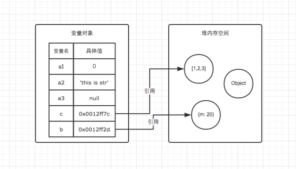

1. **基本类型** 基本数据类型变量保存在栈（stack）中,它们的值直接存储在变量访问的位置。这是因为这些原始类型占据的空间是固定的，所以可将它们存储在较小的内存区域 – 栈中。这样存储便于迅速查寻变量的值。
2. **引用类型** javascript 的引用数据类型是**同时保存在栈内存和堆内存中**的对象。与其它语言的不同是，你不可以直接访问堆内存空间中的位置和操作堆内存空间。只能操作对象在栈内存中的引用地址。准确地说，引用类型的存储需要内存的栈区和堆区（堆区是指内存里的堆内存）共同完成，栈区内存保存变量标识符和指向堆内存中该对象的指针，也可以说是该对象在堆内存的地址。由于引用值的大小会改变，所以不能把它放在栈中，否则会降低变量查寻的速度。

### **复制值**

**基本类型** 在将一个保存着原始值的变量复制给另一个变量时，会将原始值的副本赋值给新变量，此后这两个变量是完全独立的，它们只是拥有相同的 value 而已。

很显然，a 不全等 b

**引用类型** 在将一个保存着对象内存地址的变量复制给另一个变量时，会把这个内存地址赋值给新变量，也就是说这两个变量都指向了堆内存中的同一个对象，它们中任何一个作出的改变都会反映在另一个身上。（这里要理解的一点就是，复制对象时并不会在堆内存中新生成一个一模一样的对象，只是多了一个保存指向这个对象指针的变量罢了）。多了一个指针

结果然显然，a 全等 b，因为它们的指针指向同一个堆内存

### **传递值**

JS 高级程序设计—> 4.1.3 中提到: “ECMAScript 中所有函数的参数都是按值传递的” 结论：没有差别


# 浅拷贝与深拷贝

### 赋值和深/浅拷贝的区别

- 当我们把一个对象赋值给一个新的变量时，**赋的其实是该对象的在栈中的地址，而不是堆中的数据**。也就是两个对象指向的是同一个存储空间，无论哪个对象发生改变，其实都是改变的存储空间的内容，因此，两个对象是联动的。

  JS 分为原始类型和引用类型，**对于原始类型的拷贝，并没有深浅拷贝的区别，我们讨论的深浅拷贝都只针对引用类型**。

  - 浅拷贝和深拷贝都复制了值和地址，都是为了解决引用类型赋值后互相影响的问题。
  - 但是浅拷贝**只进行一层复制**，深层次的引用类型还是共享内存地址，原对象和拷贝对象还是会互相影响。
  - 深拷贝就是**无限层级拷贝**，深拷贝后的原对象不会和拷贝对象互相影响。

  

### 浅拷贝的实现方式

#### 1.Object.assign()

Object.assign() 方法可以把任意多个的源对象自身的**可枚举属性拷贝给目标对象**，然后返回目标对象。

```js
let obj1 = { person: {name: "kobe", age: 41},sports:'basketball' };
let obj2 = Object.assign({}, obj1);
obj2.person.name = "wade";
obj2.sports = 'football'
console.log(obj1); // { person: { name: 'wade', age: 41 }, sports: 'basketball' }
```

#### 2.函数库lodash的_.clone方法

该函数库也有提供_.clone用来做 Shallow Copy,后面我们会再介绍利用这个库实现深拷贝。

```js
var _ = require('lodash');
var obj1 = {
    a: 1,
    b: { f: { g: 1 } },
    c: [1, 2, 3]
};
var obj2 = _.clone(obj1);
console.log(obj1.b.f === obj2.b.f);// true
```

#### 3.展开运算符...

展开运算符是一个 es6 / es2015特性，它提供了一种非常方便的方式来执行浅拷贝，这与 Object.assign ()的功能相同。

```js
let obj1 = { name: 'Kobe', address:{x:100,y:100}}
let obj2= {... obj1}
obj1.address.x = 200;
obj1.name = 'wade'
console.log('obj2',obj2) // obj2 { name: 'Kobe', address: { x: 200, y: 100 } }
```

#### 4.Array.prototype.concat()

```js
let arr = [1, 3, {
    username: 'kobe'
    }];
let arr2 = arr.concat();    
arr2[2].username = 'wade';
console.log(arr); //[ 1, 3, { username: 'wade' } ]
```

#### 5.Array.prototype.slice()

```js
let arr = [1, 3, {
    username: ' kobe'
    }];
let arr3 = arr.slice();
arr3[2].username = 'wade'
console.log(arr); // [ 1, 3, { username: 'wade' } ]
```

#### 6.使用循环

对象循环我们使用 **for in** 循环，但**for in** 循环会遍历到对象的继承属性，我们只需要它的私有属性，所以可以加一个判断方法：**hasOwnProperty** 保留对象私有属性。

```javascript
let obj2 = {};
for(let i in obj) {
    if(!obj.hasOwnProperty(i)) break; // 这里使用 continue 也可以
    obj2[i] = obj[i];
}
```

#### 7.数组静态方法 Array.from

```js
const arr = ['lin', 'is', 'handsome']
const newArr = Array.from(arr)

arr[2] = 'rich' // 改变原来的数组

console.log(newArr) // ['lin', 'is', 'handsome']

console.log(arr == newArr) // false 两者指向不同地址
```

### 深拷贝的实现方式

#### 1.JSON.parse(JSON.stringify())

```js
let arr = [1, 3, {
    username: ' kobe'
}];
let arr4 = JSON.parse(JSON.stringify(arr));
arr4[2].username = 'duncan'; 
console.log(arr, arr4)
```

*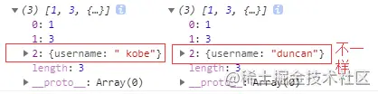*

这也是利用JSON.stringify将对象转成JSON字符串，再用JSON.parse把字符串解析成对象，一去一来，新的对象产生了，而且对象会开辟新的栈，实现深拷贝。

**这种方法虽然可以实现数组或对象深拷贝,但不能处理函数和正则**，因为这两者基于JSON.stringify和JSON.parse处理后，得到的正则就不再是正则（变为空对象），得到的函数就不再是函数（变为null）了。

还有**循环引用**和**递归爆栈**的问题。

比如下面的例子：

```js
let arr = [1, 3, {
    username: ' kobe'
},function(){}];
let arr4 = JSON.parse(JSON.stringify(arr));
arr4[2].username = 'duncan'; 
console.log(arr, arr4)
```

*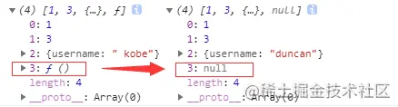*


#### 2.函数库lodash的_.cloneDeep方法

该函数库也有提供_.cloneDeep用来做 Deep Copy

```
var _ = require('lodash');
var obj1 = {
    a: 1,
    b: { f: { g: 1 } },
    c: [1, 2, 3]
};
var obj2 = _.cloneDeep(obj1);
console.log(obj1.b.f === obj2.b.f);// false
```

#### 3.jQuery.extend()方法

jquery 有提供一個`$.extend`可以用来做 Deep Copy

```
$.extend(deepCopy, target, object1, [objectN])//第一个参数为true,就是深拷贝
复制代码
var $ = require('jquery');
var obj1 = {
    a: 1,
    b: { f: { g: 1 } },
    c: [1, 2, 3]
};
var obj2 = $.extend(true, {}, obj1);
console.log(obj1.b.f === obj2.b.f); // false
```

#### 4.手写递归方法

递归方法实现深度克隆原理：**遍历对象、数组直到里边都是基本数据类型，然后再去复制，就是深度拷贝**。

有种特殊情况需注意就是对象存在**循环引用**的情况，即对象的属性直接的引用了自身的情况，解决循环引用问题，我们可以额外开辟一个存储空间，来存储当前对象和拷贝对象的对应关系，当需要拷贝当前对象时，先去存储空间中找，有没有拷贝过这个对象，如果有的话直接返回，如果没有的话继续拷贝，这样就巧妙化解的循环引用的问题。关于这块如有疑惑，请仔细阅读`ConardLi大佬`[如何写出一个惊艳面试官的深拷贝?](https://link.juejin.cn?target=https%3A%2F%2Fsegmentfault.com%2Fa%2F1190000020255831)这篇文章。

```js
function deepClone(obj, hash = new WeakMap()) {
  if (obj === null) return obj; // 如果是null或者undefined我就不进行拷贝操作
  if (obj instanceof Date) return new Date(obj);
  if (obj instanceof RegExp) return new RegExp(obj);
  // 可能是对象或者普通的值  如果是函数的话是不需要深拷贝
  if (typeof obj !== "object") return obj;
  // 是对象的话就要进行深拷贝
  if (hash.get(obj)) return hash.get(obj);
  let cloneObj = new obj.constructor();
  // 找到的是所属类原型上的constructor,而原型上的 constructor指向的是当前类本身
  hash.set(obj, cloneObj);
  for (let key in obj) {
    if (obj.hasOwnProperty(key)) {
      // 实现一个递归拷贝
      cloneObj[key] = deepClone(obj[key], hash);
    }
  }
  return cloneObj;
}
let obj = { name: 1, address: { x: 100 } };
obj.o = obj; // 对象存在循环引用的情况
let d = deepClone(obj);
obj.address.x = 200;
console.log(d);
```

#### 5.structuredClone()

```js
const obj = {
  person: {
    name: 'lin'
  }
}

const newObj = structuredClone(obj) // 
obj.person.name = 'xxx' // 改变原来的对象

console.log('原来的对象', obj)
console.log('新的对象', newObj)

console.log('更深层的对象指向同一地址', obj.person == newObj.person)
```

结构化克隆解决了该`JSON.stringify()`技术的许多（尽管不是全部）缺点。结构化克隆可以处理循环依赖，支持许多内置数据类型，并且更健壮且速度更快。

但是，它仍然有一些限制：

- **原型**：如果你使用`structuredClone()`类实例，你将获得一个普通对象作为返回值，因为结构化克隆会丢弃对象的原型链。
- **函数**：如果你的对象包含函数，它们将被悄悄丢弃。
- **不可克隆**：有些值不是结构化可克隆的，尤其是`Error`、 `DOM 节点` 和 `Function`。尝试这样做将引发 `DataCloneError` 异常。
- **属性描述符**：setter和getter(以及类似元数据的功能)不会被复制。例如，如果使用属性描述符将对象标记为只读，则复制后的对象中是可读写(默认配置)。
- **RegExp**：RegExp对象的lastIndex字段不会保留。


# 为什么0.1+0.2 != 0.3 

在小数点运算时，JavaScript将隐式的采取[IEEE754二进制浮点运算](https://link.zhihu.com/?target=https%3A//www.h-schmidt.net/FloatConverter/IEEE754.html)。而不是我们想象中的十进制运算。而十进制和二进制转换时，就可能出现精度丢失的问题。

那么应该怎样来解决0.1+0.2等于0.3呢? 最好的方法是**设置一个误差范围值**，通常称为”机器精度“，而对于Javascript来说，这个值通常是2^-52,而在ES6中，已经为我们提供了这样一个

属性：Number.EPSILON，而这个值正等于2^-52。这个值非常非常小，在底层计算机已经帮我们运算好，并且无限接近0，但不等于0,。这个时候我们只要判断Math.abs((0.1+0.2)-0.3)小于`Number.EPSILON`，在这个误差的范围内就可以判定0.1+0.2===0.3为true。

```js
function numbersequal(a,b){ 
    return Math.abs(a-b)<Number.EPSILON;
} 
var a=0.1+0.2， b=0.3;
console.log(numbersequal(a,b)); //true
```


# null和undefined的区别？

**null**表示“没有对象”，null值是一个空对象指针，既该处不应该有值。

  （1）作为函数的参数，表示该函数的参数不是对象。

  （2）作为对象原型链的终点。

​    object.getPrototypeOf(Object.prototype)

**undefind**表示“缺少值”，就是此处应该有一个值，但是没有定义。

   （1）变量被声明了，但是没有赋值时，就等undefined。

​        var i；  i // undefined

   （2）调用函数是，应该提供方的参数没有提供，该参数等于undefined。

************

​        function f(x){ console.log(x) }

​          f() //undefined

   （3）对象没有赋值的属性，该属性的值为undefined。

​        var 0 = new Object();

​        0.p //undefined

   （4）函数没有返回值时，默认返回undefined。

​        var x = f()  x //undefined*


# *== 和 === 的区别*

```
==用于一般比较，===用于严格比较;
==在比较的时候可以转换数据类型，===严格比较，只要类型不匹配就返回flase。
```

*==如果是基本数据类型类型之间的比较，会**转换成数值类型**进行比较，如果是存在引用类型，会先将引用类型转换原始类型，然后再进行比较。这里就涉及到另外两个函数`toString` 和`valueOf` 。*

*=== 比较运算符相比较`==` 运算符,不会做隐式转换，也就是不会自动调用`toString` `valueof` 方法。他会首先判断类型是否一致，然后再做比较*


# *字符串转数字*

## *1. parseInt*

***定义和用法***

*parseInt() 函数可解析一个字符串，并返回一个整数。*

***语法***

*parseInt(string, radix)*

```js
parseInt("10");			// 10
parseInt("19",10);		// 19 
parseInt("11",2);		// 3 
parseInt("17",8);		// 15 
parseInt("1f",16);		// 31 
parseInt("010",2);              // 2
//按10 为基数来解析  
parseInt("010");		// 10  陷阱         
parseInt('08');                 // 8   陷阱  
// 只读取字符串以数字开头的整数部分
parseInt('44.jpg');              // 44   陷阱 
parseInt('jpg12');              //NaN  
```

> *注意：`ECMAScript 5` 规范不再允许 `parseInt` 函数的实现环境把以` 0` 字符开始的字符串作为八进制数值。如果 `radix` 没有指定或者为` 0`，参数会被假定以 `10` 为基数来解析，如果数值以字符对 `0x` 或 `0X` 开头，会假定以 `16` 为基数来解析。*

*`parseInt`: 没有传入基数时，默认是传入的基数为`10` `parseInt(num, 10)`，如果你不知道`num`属性的类型，不要使用`parseInt`进行字符串转数字。*

## *2. parseFloat*

***定义和用法***

*parseFloat() 函数可解析一个字符串，并返回一个浮点数。*

*该函数指定字符串中的首个字符是否是数字。如果是，则对字符串进行解析，直到到达数字的末端为止，然后以数字返回该数字，而不是作为字符串。*

***语法***

*parseFloat(string)*

```js
parseFloat("10");//10
parseFloat("10.33"); //10.33
//字符串中有空格来分割数字，那么只会读取第一个数字
parseFloat("34 45 66"); //34
parseFloat(" 60 ")//60
// 只读取字符串以数字开头的整数部分
parseFloat("40 years");//40
parseFloat("He was 40");//NaN
parseInt(-0xFF) //  -255
parseInt("-0xFF") //  -255
parseFloat(-0xFF) //  -255
//字符串中的负十六进制数字是一个特殊情况 
parseFloat("-0xFF") //  -0   陷阱 
```

> *注意：`parseFloat`: 转换十六进制数时要小心，如果你不知道要转换对象的类型，不要使用 parseFloat。字符串中的负十六进制数字是一个特殊情况，如果你用 `parseFloat` 解析，结果是不正确的。为了避免程序出现 `NaN` 的情况，应该检查转化后的值。*

## *3. 按位非*

*可以把字符串转换成整数，但他不是浮点数。如果是一个字符串转换，它将返回0；*

```js
~~1.23 // 1 陷阱 只取整数部分
~~"1.23" // 1 
~~"23" // 23
~~"Hello world" // 0  陷阱 只对整数有效，对字符串字符无效
~~"0xFF"  // 255
~~-0xff   // -255
~~"-0xFF"  // 0  陷阱  对于字符串负十六进制数无法解析
```

> *注意：`~`是按位取反运算，`~~`是取反两次。`~~`的作用是去掉小数部分，因为位运算的操作值要求是整数，其结果也是整数，所以经过位运算的都会自动变成整数。*

*按位非：用它确保输入中没有字符，仅用于整数*

## *4.Number*

***定义和用法***

*`Number()` 函数把对象的值转换为数字。*

*如果对象的值无法转换为数字，那么 Number() 函数返回 NaN。*

***语法***

*Number(object)*

*`Number`：几乎不用它。*

```js
Number("023") //  23  陷阱
Number("0XFF") //  255
Number("-0XFF") // NaN  陷阱
Number(023) //  19  
```

> *注意：023实际上是一个八进制数，无论你怎么做，都是返回19；对于没有单引号或双引号的十六进制数一样。但是对于带有单引号和双引号的八进制数（以`0`字符开始的）,是不会转为八进制对应的十进制数的，只会当做十进制来解析。对于字符串中的负十六进制数字，Number是不能解析的，显示为NaN。*

## *5.一元运算符(重点)*	

```js
+"023" //23 推荐使用 + 
+"16"  //16
+"-15" //-15
+"-0xFF" //NaN  
+"0xFF"  //255
"1.23" * 1  //1.23
"1.23" / 1  //1.23
"2.23" - 0  // 2.23
"0xFF.jpg" / 1  // NaN 
```

*加法运算符会触发三种类型转换：*

- *转换为原始值*
- *转换为数字*
- *转换为字符串*

> *注意：一元运算符与其它的解析方式不同，如果是一个 `NaN` 值，那么返回的也是 `NaN` 。基本使用`+`操作符，因为这个方式不容易混淆。虽然` -0` 的用法也很好，但它并没有很好的表达转换为数字的本意。 `+`是将字符串转换为数字的最快方法。*

## *总结*

*负十六进制数字符串转换为数字时。最好使用带基数的 `parseInt` 解析为数字。明确知到进制数的也是通过带基数的 `parseInt` 解析为数字。其他的建议使用一元运算符`+`来将字符串转数字，也是最快的。*

**

*还有移位运算符、相乘、Math.floor*


# typeof,instanceof,constructor,valueOf 四种类型检测的区别toString

### **typeof**

- 1、定义：用来检测数据类型的运算符
- 2、语法：`tyepof [value]`
- 3、返回值：
  - `typeof` 检测的结果首先是一个字符串；
  - 字符串中包含了对应的数据类型（例如：  `“number”`、`“string”`、`“boolean”`、`“undefined”`、`“object”`、`“function”`、`“symbol”`、`“bigint”`）


**


- 4、优点：使用起来简单，基本数据类型值基本上都可以有效检测，引用数据类型值也可以检测出来
- 5、局限性（特殊值）
  - 1)、`NaN` / `Infinity` 都是数字类型的，检测结果都是`“number”`;
  - 2)、typeof null的结果是“object”
    - （这是浏览器的`BUG`：所有的值在计算中都以二进制编码储存，浏览器中把前三位`000`的当作对象，而`null`的二进制前三位是`000`，所以被识别为对象，但是他不是对象，他是空对象指针，是基本类型值）
  - 3)、`typeof` `普通对象/数组对象/正则对象...`， 结果都是`“object”`，这样就无法基于`typeof` 区分是`普通对象`还是`数组对象``...`等了
- 6、应用场景

> - 已知有一个变量x，但是我们无法确认其数据类型，我们需要有一个判断操作：当x的类型是对象的时候（什么对象都可以），则处理对应的事情

```
if (typeof x == "object") {         
    //=>null检测结果也会是"object"，所以结果是"object"不一定是对象，还可能是null呢
    ...
}
```

可以用👇的条件进行判断

```
if (x != null && typeof x == "object") {
    // ...
}
```

- 7、练习题

> console.log(typeof []); //=>"object"
>
> console.log(typeof typeof typeof []); //=>"string"


`typeof`返回的结果**永远是一个字符串**（字符串中包含了对应的类型），所以连续出现`两个及两个以上typeof检测`的时候，最后结果都是` "string"`

### instanceof

- 1、定义：用来检测某个**实例是否属于这个类**
  - 当前**类的原型只要出现在了实例的原型链上**就返回`true`
- 2、语法：`实例 instanceof 类`
- 3、属于返回`TRUE`，不属于返回`FALSE`
- 4、优点：
  - 基于这种方式，可以弥补 `typeof` 无法细分对象类型的缺点（想检测这个值是否为数组，只需要看他是否为Array类的实例即可）

```
let arr = [10, 20];

console.log(typeof arr); //=>"object"
console.log(arr instanceof Array); //=>true
console.log(arr instanceof RegExp); //=>false
console.log(arr instanceof Object); //=>true  不管是数组对象还是正则对象，都是Object的实例，检测结果都是TRUE，所以无法基于这个结果判断是否为普通对象 
```

- 5、局限性:
  - 1)、要求检测的实例必须**是对象数据类型**的
  - 2)、基本数据类型的实例是无法基于它检测出来的
    - 字面量方式创建的不能检测
    - 构造函数创建的就可以检测
  - 3)、不管是数组对象还是正则对象，**都是 Object 的实例**，检测结果都是 TRUE ，所以无法基于这个结果判断是否为普通对象

```
// instanceof检测的实例必须都是引用数据类型的，它对基本数据类型值操作无效
console.log(10 instanceof Number); //=>false
console.log(new Number(10) instanceof Number); //=>true

// instanceof检测机制：验证当前类的原型prototype是否会出现在实例的原型链__proto__上，只要在它的原型链上，则结果都为TRUE
function Fn() {}
Fn.prototype = Object.create(Array.prototype);
let f = new Fn;
console.log(f instanceof Array); //=>true f其实不是数组，因为它连数组的基本结构都是不具备的 
```

### constructor

- 1、定义：判断当前的实例的`constructor`的属性值是不是预估的类（利用他的实例数据类型检测）
- 2、语法：`实例.constructor === 类`
- 3、返回值：属于返回`TRUE`，不属于返回`FALSE`
- 4、优点：
  - `实例.constructor` 一般都等于 `类.prototype.constructor` 也就是当前类本身（前提是你的 `constructor` 并没有被破坏）
  - 能检测基本数据类型
- 5、局限性：
  - 1)、不能够给当前类的原型进行重定向，会造成检测的结果不准确(`Object`)
  - 2)、不能够给当前实例增加私有属性`constructor`，也会造成检测的结果不准确(`Object`)
  - 3)、非常容易被修改，因为`JS`中的`constructor`是不被保护的（用户可以自己随便改），这样基于`constructor`检测的值存在不确定性（但是项目中，基本没有人会改内置类的`constructor`）

```
let arr = [],
    obj = {},
    num = 10;
console.log(arr.constructor === Array); //=>true
console.log(arr.constructor === Object); //=>false
console.log(obj.constructor === Object); //=>true
console.log(num.constructor === Number); //=>true 
```

还可以使用 xx.constructor.name 构造函数来判断。

```
// constructor 构造来判断
console.log(fn.constructor.name) // Function
console.log(date.constructor.name)// Date
console.log(arr.constructor.name) // Array
console.log(reg.constructor.name) // RegExp
```


### toString

> 这个方法在Object的原型上

- 1、定义：找到`Object.prototype`上的`toString`方法，让`toString`方法执行，并且基于`call`让方法中的`this`指向检测的数据值，这样就可以实现数据类型检测了

- 2、原理：

  - 1.每一种数据类型的构造函数的原型上都有`toString`方法；

  - 2.除了`Object.prototype`上的`toString`是用来**返回当前实例所属类的信息**（检测数据类型的，是一个字符串），其余的都是转换为字符串的（因为被重写了）

  - 3.`对象实例.toString()` ：`toString`方法中的`THIS`是对象实例，也就是检测它的数据类型，也就是`THIS`是谁，就是检测谁的数据类型

  - 4.`Object.prototype.toString.call([value])` 所以我们是把`toString`执行，基于`call`改变`this`为要检测的数据值，

  - 之所以必须改变this指向是因为，`toString`内部是获取`this`指向那个对象的`[[Class]]`属性值的，如果不改变`this`指向为我们的目标变量，`this`将永远指向调用`toString`的`prototype`。
     另外也是因为，很多对象继承的`toString`方法重写了，为了能调用正确的`toString`，才间接的使用`call/apply`方法。

  ************

- 3、使用方法:

  - Object.prototype.toString.call(被检测的实例)
  - ({}).toString.call(被检测的实例)

```
Object.prototype.toString.call(10)
({}).toString.call(10)
({}).toString===Object.prototype.toString
```

- 4、返回值：
  - **是一个字符串**“[Object 当前被检测实例所属的类]”

```
let class2type = {};
let toString = class2type.toString; //=>Object.prototype.toString

console.log(toString.call(10)); //=>"[object Number]"
console.log(toString.call(NaN)); //=>"[object Number]"
console.log(toString.call("xxx")); //=>"[object String]"
console.log(toString.call(true)); //=>"[object Boolean]"
console.log(toString.call(null)); //=>"[object Null]"
console.log(toString.call(undefined)); //=>"[object Undefined]"
console.log(toString.call(Symbol())); //=>"[object Symbol]"
console.log(toString.call(BigInt(10))); //=>"[object BigInt]"
console.log(toString.call({xxx:'xxx'})); //=>"[object Object]"
console.log(toString.call([10,20])); //=>"[object Array]"
console.log(toString.call(/^\d+$/)); //=>"[object RegExp]"
console.log(toString.call(function(){})); //=>"[object Function]" 
```

- 5、优点：
  - 专门用来检测数据类型的方法，基本上不存在局限性的数据类型检测方式
  - 基于他可以有效的检测任何数据类型的值
- 6、局限性：
  - 1)、只能检测内置类，**不能检测自定义类**
  - 2)、只要是自定义类返回的都是‘[Object Object]’

**注意：此方法是基于JS本身专门进行数据检测的，所以是目前检测数据类型比较好的方法**

### valueOf

1.如果存在任意原始值，它就默认将对象转换为表示它的原始值

2.对象是复合值，而大多数对象无法真正表示为一个原始值，因此默认的valueOf()方法简单地返回对象本身，而不是返回一个原始值


# 如何判断数组类型的数据

因为数组属于引用类型，所以常规的typeof方法并不能判断数组类型。

### **instanceof**

instanceof用于检测**构造函数**的prototype属性是否出现在某个对象的原型链上

```js
var arr = [1,2,3];

console.log(arr instanceof Array);
```

### constructor

判断对象的**构造函数**是否是数组。

**`constructor`** 是一种用于创建和初始化`class`创建的对象的特殊方法。如果我们判断该对象的构造函数就是`Array`，那就是说该对象可以通过数组的构造函数（`Array`）创建得到，也就说明它是数组了。

```js
var arr = [1,2,3];

console.log(arr.constructor == Array);
```

### Object.prototype.toString.call()

`toString() ` 方法返回一个表示该对象的字符串。

每个对象都有一个 `toString()` 方法，当该对象被表示为一个文本值时，或者一个对象以预期的字符串方式引用时自动调用。默认情况下，`toString()` 方法被每个 `Object` 对象继承。如果此方法在自定义对象中未被覆盖，`toString()` 返回 "[object type]"，其中 `type` 是对象的类

```js
var arr = [1,2,3];
console.log(Object.prototype.toString.call(arr);
console.log(Object.prototype.toString.call(arr) === '[object Array]');
```

*.png)*

### Array.prototype.isPrototypeOf()

`isPrototypeOf() ` 方法用于测试一个对象是否存在于另一个对象的原型链上。

> `isPrototypeOf()` 与 [`instanceof`](https://link.juejin.cn?target=https%3A%2F%2Fdeveloper.mozilla.org%2Fzh-CN%2Fdocs%2FWeb%2FJavaScript%2FReference%2FOperators%2Finstanceof) 运算符不同。在表达式 "`object instanceof AFunction`"中，`object` 的原型链是针对 `AFunction.prototype` 进行检查的，而不是针对 `AFunction` 本身

### Array.isArray

在ES6中提供了Array.isArray()方法来检测数组类型。

```js
var arr = [1,2,3];
console.log(Array.isArray(arr));
```


# *隐式转换（valueOf和toString）*

### *三种隐式转换类型*

*涉及隐式转换最多的两个运算符 + 和 ==。*

******+运算符即可数字相加，也可以字符串相加。所以转换时很麻烦。== 不同于===，故也存在隐式转换。- * / 这些运算符只会针对number类型，故转换的结果只能是转换成number类型。******

*隐式转换中主要涉及到三种转换：*

*1、将值转为原始值，ToPrimitive()。*

*2、将值转为数字，ToNumber()。*

*3、将值转为字符串，ToString()。*

### *通过ToPrimitive将值转换为原始值*

*js引擎内部的抽象操作ToPrimitive有着这样的签名：*

*ToPrimitive(input, PreferredType?)*

*input是要转换的值，PreferredType是可选参数，可以是Number或String类型。他只是一个转换标志，转化后的结果并不一定是这个参数所值的类型，但是转换结果一定是一个原始值（或者报错）。*

***如果PreferredType被标记为Number，则会进行下面的操作流程来转换输入的值。***

```js
1、如果输入的值已经是一个原始值，则直接返回它
2、否则，如果输入的值是一个对象，则调用该对象的valueOf()方法，
   如果valueOf()方法的返回值是一个原始值，则返回这个原始值。
3、否则，调用这个对象的toString()方法，如果toString()方法返回的是一个原始值，则返回这个原始值。
4、否则，抛出TypeError异常。
```

***如果PreferredType被标记为String，则会进行下面的操作流程来转换输入的值。***

```js
1、如果输入的值已经是一个原始值，则直接返回它
2、否则，调用这个对象的toString()方法，如果toString()方法返回的是一个原始值，则返回这个原始值。
3、否则，如果输入的值是一个对象，则调用该对象的valueOf()方法，
   如果valueOf()方法的返回值是一个原始值，则返回这个原始值。
4、否则，抛出TypeError异常。
```

*既然PreferredType是可选参数，那么如果没有这个参数时，怎么转换呢？PreferredType的值会按照这样的规则来自动设置：*

```js
1、该对象为Date类型，则PreferredType被设置为String
2、否则，PreferredType被设置为Number
```

### *valueOf方法和toString方法解析*

*上面主要提及到了valueOf方法和toString方法，那这两个方法在对象里是否一定存在呢？答案是肯定的。在控制台输出Object.prototype，你会发现其中就有valueOf和toString方法，而Object.prototype是所有对象原型链顶层原型，所有对象都会继承该原型的方法，故任何对象都会有valueOf和toString方法。*

*先看看对象的valueOf函数，其转换结果是什么？对于js的常见内置对象：`Date, Array, Math, Number, Boolean, String, Array, RegExp, Function`。*

*1、Number、Boolean、String这三种构造函数生成的基础值的对象形式，通过valueOf转换后会变成相应的原始值。如：*

```js
var num = new Number('123');
num.valueOf(); // 123

var str = new String('12df');
str.valueOf(); // '12df'

var bool = new Boolean('fd');
bool.valueOf(); // true
```

*2、Date这种特殊的对象，其原型Date.prototype上内置的valueOf函数将日期转换为日期的毫秒的形式的数值。*

```js
var a = new Date();
a.valueOf(); // 1515143895500
```

*3、除此之外返回的都为this，即对象本身*

```js
var a = new Array();
a.valueOf() === a; // true

var b = new Object({});
b.valueOf() === b; // true
```

*再来看看toString函数，其转换结果是什么？对于js的常见内置对象：`Date, Array, Math, Number, Boolean, String, Array, RegExp, Function`。*

*1、Number、Boolean、String、Array、Date、RegExp、Function这几种构造函数生成的对象，通过toString转换后会变成相应的字符串的形式，因为这些构造函数上封装了自己的toString方法。如：*

```js
Number.prototype.hasOwnProperty('toString'); // true
Boolean.prototype.hasOwnProperty('toString'); // true
String.prototype.hasOwnProperty('toString'); // true
Array.prototype.hasOwnProperty('toString'); // true
Date.prototype.hasOwnProperty('toString'); // true
RegExp.prototype.hasOwnProperty('toString'); // true
Function.prototype.hasOwnProperty('toString'); // true

var num = new Number('123sd');
num.toString(); // 'NaN'

var str = new String('12df');
str.toString(); // '12df'

var bool = new Boolean('fd');
bool.toString(); // 'true'

var arr = new Array(1,2);
arr.toString(); // '1,2'

var d = new Date();
d.toString(); // "Wed Oct 11 2017 08:00:00 GMT+0800 (中国标准时间)"

var func = function () {}
func.toString(); // "function () {}"
```

*除这些对象及其实例化对象之外，其他对象返回的都是该对象的类型，(有问题欢迎告知)，都是继承的Object.prototype.toString方法。*

```js
var obj = new Object({});
obj.toString(); // "[object Object]"
Math.toString(); // "[object Math]"
```

*从上面valueOf和toString两个函数对对象的转换可以看出为什么对于ToPrimitive(input, PreferredType?)，PreferredType没有设定的时候，除了Date类型，PreferredType被设置为String，其它的会设置成Number。*

*因为valueOf函数会将Number、String、Boolean基础类型的对象类型值转换成 **基础类型**，Date类型转换为毫秒数，其它的返回对象本身，而toString方法会将所有对象转换为**字符串**。显然对于大部分对象转换，valueOf转换更合理些，因为并没有规定转换类型，应该尽可能保持原有值，而不应该想toString方法一样，一股脑将其转换为字符串。*

*所以对于没有指定PreferredType类型时，先进行valueOf方法转换更好，故将PreferredType设置为Number类型。*

*而对于Date类型，其进行valueOf转换为毫秒数的number类型。在进行隐式转换时，没有指定将其转换为number类型时，将其转换为那么大的number类型的值显然没有多大意义。（不管是在+运算符还是==运算符）还不如转换为字符串格式的日期，所以默认Date类型会优先进行toString转换。故有以上的规则：*

*PreferredType没有设置时，Date类型的对象，PreferredType默认设置为String，其他类型对象PreferredType默认设置为Number。*

### *通过ToNumber将值转换为数字*

*根据参数类型进行下面转换：*

| *参数*      | *结果*                                                       |
| ----------- | ------------------------------------------------------------ |
| *undefined* | *NaN*                                                        |
| *null*      | *+0*                                                         |
| *布尔值*    | *true转换1，false转换为+0*                                   |
| *数字*      | *无须转换*                                                   |
| *字符串*    | *有字符串解析为数字，例如：‘324’转换为324，‘qwer’转换为NaN*  |
| *对象(obj)* | *先进行 ToPrimitive(obj, Number)转换得到原始值，在进行ToNumber转换为数字* |

### *通过ToString将值转换为字符串*

*根据参数类型进行下面转换：*

| *参数*      | *结果*                                                       |
| ----------- | ------------------------------------------------------------ |
| *undefined* | *'undefined'*                                                |
| *null*      | *'null'*                                                     |
| *布尔值*    | *转换为'true' 或 'false'*                                    |
| *数字*      | *数字转换字符串，比如：1.765转为'1.765'*                     |
| *字符串*    | *无须转换*                                                   |
| *对象(obj)* | *先进行 ToPrimitive(obj, String)转换得到原始值，在进行ToString转换为字符串* |

*讲了这么多，是不是还不是很清晰，先来看看一个例子：*

```
({} + {}) = ?
两个对象的值进行+运算符，肯定要先进行隐式转换为原始类型才能进行计算。
1、进行ToPrimitive转换，由于没有指定PreferredType类型，{}会使默认值为Number，进行ToPrimitive(input, Number)运算。
2、所以会执行valueOf方法，({}).valueOf(),返回的还是{}对象，不是原始值。
3、继续执行toString方法，({}).toString(),返回"[object Object]"，是原始值。
故得到最终的结果，"[object Object]" + "[object Object]" = "[object Object][object Object]"
```

*再来一个指定类型的例子：*

```
2 * {} = ?
1、首先*运算符只能对number类型进行运算，故第一步就是对{}进行ToNumber类型转换。
2、由于{}是对象类型，故先进行原始类型转换，ToPrimitive(input, Number)运算。
3、所以会执行valueOf方法，({}).valueOf(),返回的还是{}对象，不是原始值。
4、继续执行toString方法，({}).toString(),返回"[object Object]"，是原始值。
5、转换为原始值后再进行ToNumber运算，"[object Object]"就转换为NaN。
故最终的结果为 2 * NaN = NaN
```

### *== 运算符隐式转换*

***== 运算符的规则规律性不是那么强，按照下面流程来执行,es5文档***

```
比较运算 x==y, 其中 x 和 y 是值，返回 true 或者 false。这样的比较按如下方式进行：

1、若 Type(x) 与 Type(y) 相同， 则

    1* 若 Type(x) 为 Undefined， 返回 true。
    2* 若 Type(x) 为 Null， 返回 true。
    3* 若 Type(x) 为 Number， 则
  
        (1)、若 x 为 NaN， 返回 false。
        (2)、若 y 为 NaN， 返回 false。
        (3)、若 x 与 y 为相等数值， 返回 true。
        (4)、若 x 为 +0 且 y 为 −0， 返回 true。
        (5)、若 x 为 −0 且 y 为 +0， 返回 true。
        (6)、返回 false。
        
    4* 若 Type(x) 为 String, 则当 x 和 y 为完全相同的字符序列（长度相等且相同字符在相同位置）时返回 true。 否则， 返回 false。
    5* 若 Type(x) 为 Boolean, 当 x 和 y 为同为 true 或者同为 false 时返回 true。 否则， 返回 false。
    6*  当 x 和 y 为引用同一对象时返回 true。否则，返回 false。
  
2、若 x 为 null 且 y 为 undefined， 返回 true。
3、若 x 为 undefined 且 y 为 null， 返回 true。
4、若 Type(x) 为 Number 且 Type(y) 为 String，返回比较 x == ToNumber(y) 的结果。
5、若 Type(x) 为 String 且 Type(y) 为 Number，返回比较 ToNumber(x) == y 的结果。
6、若 Type(x) 为 Boolean， 返回比较 ToNumber(x) == y 的结果。
7、若 Type(y) 为 Boolean， 返回比较 x == ToNumber(y) 的结果。
8、若 Type(x) 为 String 或 Number，且 Type(y) 为 Object，返回比较 x == ToPrimitive(y) 的结果。
9、若 Type(x) 为 Object 且 Type(y) 为 String 或 Number， 返回比较 ToPrimitive(x) == y 的结果。
10、返回 false。
```

*上面主要分为两类，x、y类型相同时，和类型不相同时。*

*类型相同时，没有类型转换，主要注意NaN不与任何值相等，包括它自己，即NaN !== NaN。*

*类型不相同时，*

*1、x,y 为null、undefined两者中一个   // 返回true*

*2、x、y为Number和String类型时，则转换为Number类型比较。*

*3、有Boolean类型时，Boolean转化为Number类型比较。*

*4、一个Object类型，一个String或Number类型，将Object类型进行原始转换后，按上面流程进行原始值比较。*

### *例子解析*

*所以类型不相同时，可以会进行上面几条的比较，比如：*

```js
var a = {
  valueOf: function () {
     return 1;
  },
  toString: function () {
     return '123'
  }
}
true == a // true;
首先，x与y类型不同，x为boolean类型，则进行ToNumber转换为1,为number类型。
接着，x为number，y为object类型，对y进行原始转换，ToPrimitive(a, ?),没有指定转换类型，默认number类型。
而后，ToPrimitive(a, Number)首先调用valueOf方法，返回1，得到原始类型1。
最后 1 == 1， 返回true。
```

*我们再看一段很复杂的比较，如下：*

```js
[] == !{}
//
1、! 运算符优先级高于==，故先进行！运算。
2、!{}运算结果为false，结果变成 [] == false比较。
3、根据上面第7条，等式右边y = ToNumber(false) = 0。结果变成 [] == 0。
4、按照上面第9条，比较变成ToPrimitive([]) == 0。
    按照上面规则进行原始值转换，[]会先调用valueOf函数，返回this。
   不是原始值，继续调用toString方法，x = [].toString() = ''。
   故结果为 '' == 0比较。
5、根据上面第5条，等式左边x = ToNumber('') = 0。
   所以结果变为： 0 == 0，返回true，比较结束。
```

*最后我们看看文章开头说的那道题目：*

```js
const a = {
  i: 1,
  toString: function () {
    return a.i++;
  }
}
if (a == 1 && a == 2 && a == 3) {
  console.log('hello world!');
}
```

*1、当执行a == 1 && a == 2 && a == 3 时，会从左到右一步一步解析，首先 a ==  1，会进行上面第9步转换。ToPrimitive(a， Number) == 1。*

*2、ToPrimitive(a, Number)，按照上面原始类型转换规则，会先调用valueOf方法，a的valueOf方法继承自Object.prototype。返回a本身，而非原始类型，故会调用toString方法。*

*3、因为toString被重写，所以会调用重写的toString方法，故返回1，注意这里是i++，而不是++i，它会先返回i，在将i+1。故ToPrimitive(a, Number) = 1。也就是1 == 1，此时i = 1 + 1 = 2。*

*4、执行完a == 1返回true，会执行a == 2，同理，会调用ToPrimitive(a, Number)，同上先调用valueOf方法，在调用toString方法，由于第一步，i = 2此时，ToPrimitive(a, Number) = 2， 也就是2 == 2, 此时i = 2 + 1。*

*5、同上可以推导 a == 3也返回true。故最终结果 a == 1 && a == 2 && a == 3返回true*

#  JS 中数组、字符串和Object的常用方法

### 数组的常用方法 

#### **往数组里增加项**

*`array.push(value, ...)` 给数组最后添加一个或多个元素*

- *参数：`value`，要添加到 `array` 尾部的值，可以是一个或多个*
- *返回值：把指定的值添加到数组后数组的新长度*

*`array.unshift(value, ...)` 给数组最前面添加一个或多个元素*

- *参数：`value`，要插入数组头部的一个或多个值*
- *返回值：把指定的值添加到数组后数组的新长度*

#### ********从数组里删除项********

*`array.pop()` 删除并返回数组的最后一个元素*

- *参数：无*
- *返回值：`array` 的最后一个元素*
- *方法 `pop()` 将删除 `array` 的最后一个元素，把数组长度减 `1`，并且返回它删除的元素的值。*
- *如果数组已经为空，则 `pop()` 不改变数组，返回 `undefined`*

*`array.shift()` 将数组中的第一个元素移出数组*

- *参数：无*
- *返回值：数组原来的第一个元素*
- *方法 `shift()` 将把 `array` 的第一个元素移出数组，返回那个元素的值，并且将余下的所有元素前移一位，以填补数组头部的空缺。*
- *如果数组是空的，`shift()` 将不进行任何操作，返回 `undefined`*
- *方法 `shift()` 和 方法 `pop()` 相似，只不过它在数组头部操作，而不是在尾部操作。该方法常常和 `unshift()` 一起使用*

#### ***更改数组项***

*`array.reverse()` 颠倒数组中元素的顺序*

- *`array` 对象的方法 `reverse()` 将颠倒数组中元素的位置。*
- *它在原数组上实现这一操作，即重排指定的 `array` 元素，但并不创建新数组。*
- *如果对 `array` 有多个引用，那么通过所有引用都可以看到数组元素的新顺序。*

*`array.sort(function)` 对数组元素进行排序*

- *参数：`function` 可以控制数字排序*
- *返回值：对数组的引用。*
- *注意：数组在原数组上进行排序，不制作副本*
- *如果调用方法 `sort()` 时没有使用参数，将按字母顺序（按照字符编码的顺序）对数组中的元素进行排序*

#### ***查询数组项***

- *`indexOf()`*
- *`lastIndexOf()`*
- *这两个属性可以参照字符串的定义和介绍*
- *includes()*
- *find()*
- *findIndex()*

#### *迭代器方法*

- *keys()*
- *values()*
- *entries()*

#### ***遍历数组***

```
array.forEach(item[, thisObject])
```

- *参数：*
  - *`item`：函数参数数组中每个元素*
  - *`thisObject`：对象作为该执行回调时使用*
- *返回值：返回创建数组*

```
array.map(item[, thisObject])
```

- *方法返回一个由原数组中的每个元素调用一个制定方法后的返回值组成的新数组*

*forEach 和 map 的区别*

> *`forEach` 是遍历，而 `map` 是映射*

#### ***截取数组值***

*`array.slice(start, end)` 返回数组的一部分*

- *参数：*
  - *`start`：数组片段开始处的数组下标。如果是负数，它声明从数组尾部开始算起的位置*
  - *`end`：数组片段结束处的后一个元素的数组下标*
  - *如果没有指定 `end`，则默认包含从 `start` 开始到数组结束的所有元素。*
- *返回值：一个新数组，包含从 `start` 到 `end` (不包括该元素)指定的 `array` 元素*
- ***注意**：不改变原数组！如果想删除数组中的一段元素，应该使用 `array.splice`*

*`array.splice(start, length, value, ...)` 插入、删除或替换数组中的元素*

- *参数：*
  - *`start`：开始插入或删除的数组元素的下标*
  - *`length`：从 `start` 开始，包括 `start` 所指的元素在内要删除的元素个数。如果没有指定 `length`，`splice()` 将删除从 `start` 开始到原数组结尾的所有元素。*
  - *`value`：要插入数组的零个或多个值，从 `start` 所指的下标处开始插入。*
- *返回值：如果从 `array` 中删除了元素，返回的是被删除元素的数组。*

#### *其他数组方法*

*`array.concat(value, ...)` 拼接数组*

- *参数：`value，...，` 要增加到 `array` 中的值，可以是任意多个*
- *返回值：一个新数组*
- *方法 `concat()` 将创建并返回一个新数组，这个数组是将所有参数添加到 `array` 中生成的。*
- *不修改原数组 `array`*
- ***如果要进行 `concat()` 操作的参数是一个数组，那么添加的是数组中的元素，而不是数组。***

*`array.join(separator)` 将数组元素连接起来以构建一个字符串*

- *参数：`separator`，在返回的字符串中用于分割数组元素的字符或字符串，它是可选的。如果省略了这个参数，用逗号作为分隔符。*
- *返回值：一个字符串，通过把 `array` 的每个元素转换成字符串，然后把这些字符串连接起来，在两个元素之间插入 `separator` 字符串而生成。*

*批量复制方法**copyWithin()***

*填充数组方法**fill()***

***toLocalString()、toString()、valueOf()***

#### *迭代方法*

***Array.filter()**方法在数组中查找**满足特定条件的所有元素**。返回的新数组，如果数组中没有项目符合条件，则返回一个空数组。*

**

*a、newArray是返回的新数组。*

*b、array 是我们要进行查找的数组本身。*

*c、callback 是应用于数组每个元素的回调函数。*

***every() 方法**用于检测数组**所有元素是否都符合指定条件**。如果数组中检测到有一个元素不满足，则整个表达式返回false，且剩余的元素不会再进行检测。如果所有元素都满足条件，则返回 true。 every() 不会对空数组进行检测。every() 不会改变原始数组。*

#### ***归并方法***

*reduce（）*

*reduceRight（）*


### *2、Javscript字符串的常用方法* 

#### ***1）增***

*除了常用的+以及${}进行字符串拼接之外，还可以通过contact()方法用于讲一个或多个字符串拼接成一个新字符串。*

#### ***2）删：substr()、slice()、substring()***

*******string\*.substr(\*start\*,\*length\*) 方法**可在字符串中抽取从 **开始****下标开始的指定数目**的字符。length子串中的字符数。必须是数值。如果省略了该参数，那么返回从 stringObject 的开始位置到结尾的字串。******

***slice(start, end) 方法**可提取字符串的某个部分，并以新的字符串返回被提取的部分。使用 start（包含） 和 **end（不包含）参数**来指定字符串提取的部分。*

***substring(from, to) 方法**用于提取字符串中介于两个指定下标之间的字符。返回的子串包括开始处的字符，**但不包括\*结束\* 处**的字符。*

#### ***3）改：不改变原有字符串，创建一个字符串副本***

***trim()、trimLeft()、trimRight() 方法**用于删除前、后或前后所有空格符。*

***repeat() 方法**表示将字符串复制多少次，然后返回。接受一个整数参数。*

***toLowerCase()、toUpperCase()****方法**用于大小写转换。*

#### ***4）查：charAt()、indexOf()、startWith()、includes()***

***charAt() 方法**返回给定索引位置的字符。需传入一个整数参数。*

***indexOf() 方法**返回某个字符在字符串中的位置。需传入一个字符。*

***startWith() 方法**返回一个布尔值，判断字符串是否以传入的字符开头。*

***includes() 方法**返回一个布尔值，判断字符串是否包含传入的字符。*

#### ***5）转换方法：split()***

***split() 方法**把字符串按照指定的分隔符，返回一个数组。*

#### ***6）匹配方法：match()、search()、replace()***

***match() 方法**接受一个参数（正则表达式字符串或者正则表达式对象）。返回是一个数组。*

***search() 方法**接受一个参数（正则表达式字符串或者正则表达式对象）。返回是布尔值。*

**replace() 方法**接受两个参数，第一个是匹配的内容，第二个是替换的元素。替换的是第一次匹配到的。

### *如何去除字符串中的最后一个字符？* 

******有三种方法: **str.slice(0,str.length-1)、substr(0,length-1)、str.substring(0,str.length-1)***** 
***

### ***js 获取字符串最后一个字符？***

*有三种：**str.charAt(str.length-1)、str.substr(str.length-1,1)、 str.substring(str.length-1) 、str.slice(str.length-1)、let res = str.split("")；res[str.length - 1]。***

#### *1）slice(start,end)*

*start : 要抽取的片断的起始下标。如果是负数，则该参数规定的是从字符串的尾部开始算起的位置。*

*end:要抽取的片段的结尾的下标。若未指定此参数，则要提取的子串包括 start 到原字符串结尾的字符串。如果该参数是负数，那么它规定的是从字符串的尾部开始算起的位置。*

#### *2）substr(start,length)* 

*start : 必需。要抽取的子串的起始下标。必须是数值。如果是负数，那么该参数声明从字符串的尾部开始算起的位置。*

*length : 可选。子串中的字符数。必须是数值。如果省略了该参数，那么返回从 stringObject 的开始位置到结尾的字串。*

#### *3）substring(start,stop)*

***与 slice() 和 substr() 方法不同的是，substring() 不接受负的参数***

*start : 必需。一个非负的整数，规定要提取的子串的第一个字符在 stringObject 中的位置*

*stop : 可选。一个非负的整数，**比要提取的子串的最后一个字符在 stringObject 中的位置多 1**。*

#### *js字符串拼接有哪些方法*

*1）使用 + 运算符；*

*2）使用concat()方法；*

*3）使用 join 方法。*

**

### *3、Object的常用方法* 

***1）Object.values()：**返回一个对象属性值的数组。*

*2）Object.keys()：返回一个对象属性名的数组。*

*3）Object.entries()：创建一个数组，其中包含一个对象的键/值对数组。*

*4）Object.is()：相等运算符（==）和严格相等运算符（===）。它们都有缺点，前者会自动转换数据类型，后者的NaN不等于自身，以及+0等于-0，Object.is就是用来解决这个问题，与“===”基本一致。*

*5）Object.assign() 浅拷贝：用于对象的合并。*

*6）Object spread (对象展开)：展开一个对象，允许向一个对象添加新的属性和值。*

# js substr,slice,substring 的用法与区别

```javascript
slice(start, end); // 参数可为负数。第二个参数是指定结束位置。
substring(start, end); // 参数为负数被替换成0。交换参数位置，小的在前。第二个参数是指定结束位置。
substr(start, length); // 参数可为负数。第二个参数是指定截取长度。
```

# 常用数组求和

*https://www.cnblogs.com/faithzzz/p/7063952.html*

#### *一、for循环*

```js
var arr = [1,2,3];
function sum(arr) {
  var s = 0;
  for (var i = 0;i<arr.length;i++) {
    s += arr[i];
  }
  return s;
}
console.log(sum(arr));//6
```

#### *二、forEach遍历*

```js
var arr = [1,2,3];
function sum(arr) {
  var s = 0;
  arr.forEach(function(val, idx, arr) {
    s += val;
  }, 0);
  return s;
};
console.log(sum(arr));//6
```

#### *三、reduce*

```js
var arr = [1,2,3];
function sum(arr) {
  return arr.reduce(function(acr, cur){
    return acr + cur;
  });
}
console.log(sum(arr));//6
```

#### *四、递归*

```js
var arr = [1,2,3];
function sum(arr) {
  if(arr.length == 0){
    return 0;
  } else if (arr.length == 1){
    return arr[0];
  } else {
    return arr[0] + sum(arr.slice(1));
  }
}
console.log(sum(arr));//6
```

#### *五、eval*

```js
var arr = [1,2,3];
function sum(arr) {
  return eval(arr.join("+"));
};
console.log(sum(arr));//6
```

# *数组去重*

### *利用ES6 Set去重（ES6中最常用）*

*ES6 提供了新的数据结构 Set。它类似于数组，但是成员的值都是唯一的，没有重复的值。Set 本身是一个构造函数，用来生成 Set 数据结构。*

```js
let resultArr = Array.from(new Set(originalArray));

// 或者用扩展运算符
let resultArr = [...new Set(originalArray)];

// 再简化
let unique = (a) => [...new Set(a)]

console.log(resultArr);
// [1, "1", 2, true, "true", false, null, {…}, {…}, "abc", undefined, NaN]
```

*Set 并不是真正的数组，这里的 `Array.from` 和 `...` 都可以将 Set 数据结构，转换成最终的结果数组。*

*这是最简单快捷的去重方法，但是细心的同学会发现，这里的 `{}` 没有去重。可是又转念一想，2 个空对象的地址并不相同，所以这里并没有问题，结果 ok。*

### *利用for嵌套for，然后splice去重（ES5中最常用）*

```js
for (let i = 0; i < originalArray.length; i++) {
    for (let j = (i + 1); j < originalArray.length; j++) {
        // 第一个等于第二个，splice去掉第二个
        if (originalArray[i] === originalArray[j]) {
            originalArray.splice(j, 1);
            j--;
        }
    }
}

console.log(originalArray);
// [1, "1", 2, true, "true", false, null, {…}, {…}, "abc", undefined, NaN, NaN]
```

*splice 方法会修改源数组，所以这里我们并没有新开空数组去存储，最终输出的是修改之后的源数组。但同样的没有处理 `NaN`。*

### *indexOf 和 includes*

```js
function unique(arr) {
    if (!Array.isArray(arr)) {
        console.log('type error!')
        return
    }
    var array = [];
    for (var i = 0; i < arr.length; i++) {
        if (array .indexOf(arr[i]) === -1) {
            array .push(arr[i])
        }
    }
    return array;
}
var arr = [1,1,'true','true',true,true,15,15,false,false, undefined,undefined, null,null, NaN, NaN,'NaN', 0, 0, 'a', 'a',{},{}];
console.log(unique(arr))
   // [1, "true", true, 15, false, undefined, null, NaN, NaN, "NaN", 0, "a", {…}, {…}]  //NaN、{}没有去重
```

*indexOf 并不没处理 `NaN`。*

*再来看 includes，它是在 ES7 中正式提出的。*

```js
const resultArr = [];
for (let i = 0; i < originalArray.length; i++) {
    if (!resultArr.includes(originalArray[i])) {
        resultArr.push(originalArray[i]);
    }
}
console.log(resultArr);
// [1, "1", 2, true, "true", false, null, {…}, {…}, "abc", undefined, NaN]
```

*includes 处理了 `NaN`，结果 ok。*

### *sort*

*先将原数组排序，生成新的数组，然后遍历排序后的数组，相邻的两两进行比较，如果不同则存入新数组。*

```js
const sortedArr = originalArray.sort();

const resultArr = [sortedArr[0]];

for (let i = 1; i < sortedArr.length; i++) {
    if (sortedArr[i] !== resultArr[resultArr.length - 1]) {
        resultArr.push(sortedArr[i]);
    }
}
console.log(resultArr);
// [1, "1", 2, NaN, NaN, {…}, {…}, "abc", false, null, true, "true", undefined]
```

### *对象的属性*

*每次取出原数组的元素，然后在对象中访问这个属性，如果存在就说明重复。*

```js
const resultArr = [];
const obj = {};
for(let i = 0; i < originalArray.length; i++){
    if(!obj[originalArray[i]]){
        resultArr.push(originalArray[i]);
        obj[originalArray[i]] = 1;
    }
}
console.log(resultArr);
// [1, 2, true, false, null, {…}, "abc", undefined, NaN]
```

*但这种方法有缺陷。从结果看，它貌似只关心值，不关注类型。还把 {} 给处理了，但这不是正统的处理办法，所以 **不推荐使用**。*

### *利用filter*

```js
function unique(arr) {
  return arr.filter(function(item, index, arr) {
    //当前元素，在原始数组中的第一个索引==当前索引值，否则返回当前元素
    return arr.indexOf(item, 0) === index;
  });
}
    var arr = [1,1,'true','true',true,true,15,15,false,false, undefined,undefined, null,null, NaN, NaN,'NaN', 0, 0, 'a', 'a',{},{}];
        console.log(unique(arr))
//[1, "true", true, 15, false, undefined, null, "NaN", 0, "a", {…}, {…}]
```

*思想: 利用indexOf检测元素在数组中第一次出现的位置是否和元素现在的位置相等，如果不等则说明该元素是重复元素*

### *reduce 实现对象数组去重复*

```js
var resources = [
            { name: "张三", age: "18" },
            { name: "张三", age: "19" },
            { name: "张三", age: "20" },
            { name: "李四", age: "19" },
            { name: "王五", age: "20" },
            { name: "赵六", age: "21" }
        ]
     var temp = {};
     resources = resources.reduce((prev, curv) => {
         // 如果临时对象中有这个名字，什么都不做
         if (temp[curv.name]) {
         }
         // 如果临时对象没有就把这个名字加进去，同时把当前的这个对象加入到prev中
         else {
             temp[curv.name] = true;
             prev.push(curv);
         }
         return prev
     }, []);
     console.log("结果", resources);
```

*这种方法是利用高阶函数 reduce 进行去重， 这里只需要注意initialValue得放一个空数组[]，不然没法push。*

### *filter + hasOwnProperty*

*filter 方法会返回一个新的数组，新数组中的元素，通过 hasOwnProperty 来检查是否为符合条件的元素。*

```js
const obj = {};
const resultArr = originalArray.filter(function (item) {
    return obj.hasOwnProperty(typeof item + item) ? false : (obj[typeof item + item] = true);
});

console.log(resultArr);
// [1, "1", 2, true, "true", false, null, {…}, "abc", undefined, NaN]
```

*这 `貌似` 是目前看来最完美的解决方案了。这里稍加解释一下：*

- *hasOwnProperty 方法会返回一个布尔值，指示对象自身属性中是否具有指定的属性。*
- *`typeof item + item` 的写法，是为了保证值相同，但类型不同的元素被保留下来。例如：第一个元素为 number1，第二第三个元素都是 string1，所以第三个元素就被去除了。*
- *`obj[typeof item + item] = true` 如果 hasOwnProperty 没有找到该属性，则往 obj 里塞键值对进去，以此作为下次循环的判断依据。*
- *如果 hasOwnProperty 没有检测到重复的属性，则告诉 filter 方法可以先积攒着，最后一起输出。*

*`看似` 完美解决了我们源数组的去重问题，但在实际的开发中，一般不会给两个空对象给我们去重。所以稍加改变源数组，给两个空对象中加入键值对。*

```js
let originalArray = [1, '1', '1', 2, true, 'true', false, false, null, null, {a: 1}, {a: 2}, 'abc', 'abc', undefined, undefined, NaN, NaN];
```

*然后再用 filter + hasOwnProperty 去重。*

*然而，结果竟然把 `{a: 2}` 给去除了！！！这就不对了。*

*所以，这种方法有点去重 `过头` 了，也是存在问题的*

### *lodash 中的 _.uniq*

### *lodash 如何实现去重*

*简单说下 `lodash` 的 `uniq` 方法的源码实现。*

*这个方法的行为和使用 Set 进行去重的结果一致。*

*当数组长度大于等于 `200` 时，会创建 `Set `并将 `Set` 转换为数组来进行去重（Set 不存在情况的实现不做分析）。当数组长度小于 `200` 时，会使用类似前面提到的 双重循环 的去重方案，**另外还会做 NaN 的去重**。*


### *性能考虑*

***双重 for 循环 > Array.filter()加 indexOf > Array.sort() 加一行遍历冒泡 > Object 键值对去重复 > ES6中的Set去重***

### *内存考虑*

*以上的所有数组去重方式，应该 Object 对象去重复的方式是时间复杂度是最低的，除了一次遍历时间复杂度为`O(n)` 后，查找到重复数据的时间复杂度是`O(1)`，类似散列表，大家也可以使用 ES6 中的 Map 尝试实现一下。*

*但是对象去重复的空间复杂度是最高的，因为开辟了一个对象，其他的几种方式都没有开辟新的空间，从外表看来，更深入的源码有待探究，这里只是要说明大家在回答的时候也可以考虑到`时间复杂度`还有`空间复杂度`。*

*另外补充一个**误区**，有的小伙伴会认为 `Array.filter()`加 `indexOf` 这种方式时间复杂度为 `O(n)` ,其实不是这样，我觉得也是`O(n^2)`。因为 `indexOf` 函数，源码其实它也是进行 for 循环遍历的。具体实现如下*

```javascript
String.prototype.indexOf = function(s) {
    for (var i = 0; i < this.length - s.length; i++) {
        if (this.charAt(i) === s.charAt(0) &&
            this.substring(i, s.length) === s) {
            return i;
        }
    }
    return -1;
};
```


# *数组展平（扁平/拍平）*

*数组`扁平化`就是将一个`多维数组`，拍平为`一维数组`。*

### *1.Array.flat*

*这个方法是[ES2019](https://link.juejin.cn/?target=https%3A%2F%2Ftc39.es%2Fproposal-flatMap%2F)提供的API，可以直接将数组进行扁平化处理*

```js
let arr = [[1, 2, 3], [4, 5, 6, 7], [8, 9, 10, 11, [12, 13, [14, 15, 16]]], 17];
arr = arr.flat(3)
console.log(arr);
// 打印结果：
[
   1,  2,  3,  4,  5,  6,  7,
   8,  9, 10, 11, 12, 13, 14,
  15, 16, 17
]

```

*`Array.prototype.flat([depth])`中的`depth`指的是`深度`，或者说`几维数组`。上方的`arr`最大维度是`3维`，所以指明参数`depth`为3。在不知道维度的情况下可以指明`depth`为`Infinity`，代表不管`几维数组`，都会降为`一维数组`。*

*特殊：原数组有空位，flat方法会消除空位，即使是flat(0)也会消除空位，所以第1点说的是“只是维数一样”。并且flat方法展开到哪一层，空位就会消除到哪一层，再深层的空位不会消除。*

### *2. 递归*

#### *2.1 常规递归*

```js
function myFlat(arr) {
    let res = []
    // 遍历
    for (const a of arr) {
        // 判断是否是数组
        if(a instanceof Array){
            // 是,则递归调用
            res = res.concat(myFlat(a))
        }else{
            // 不是则直接放入
            res.push(a)
        }
    }
    return res;
}

console.log(myFlat([1, [2], [3, [[4]]]]));// [1,2,3,4]
```

#### *2.2 reduce 递归*

```js
let a = [{ a: 1 }, { b: 2 }, 3, 4, 5, [6, [7, 8, [9]]]]

function myFlat(arr) {
    return arr.reduce((pre, cur) => {
        return pre.concat(Array.isArray(cur) ? myFlat(cur) : cur)
    }, [])
}
console.log(myFlat(a))
// [ { a: 1 }, { b: 2 }, 3, 4, 5, 6, 7, 8, 9 ]
```

#### *2.3 优化：深度优化和空位处理d*

```js
function myFlat(arr, depth = 1) {
  if (depth <= 0) {
    return arr;
  }
  let res = [];
  for (const item of arr) {
    if (Array.isArray(item)) {
      res = res.concat(myFlat(item, depth - 1));
    } else {
      // 判断数组空位
      item !== undefined && res.push(item);
    }
  }
  return res;
}
```


### *3.toString*

***如果数组中存储元素都为数字**，那么我们可以取巧，使用`toString`方法来解决。*

#### *3.1 split*

```js
var arr = [1,[2,[3,4]]];

function flatten(arr){
	return arr.toString().split(',').map(function(item){
		return item;
	})
}
console.log(flatten(arr)); //[ '1', '2', '3', '4' ]
```

#### *3.2 JSON.parse()*

```js
var arr = [1,[2,[3,4]]];

function flatten(arr){
	return JSON.parse('[' + arr.toString() + ']');
}
console.log(flatten(arr)); //[ '1', '2', '3', '4' ]
```

*也可以给数组字符串的首尾分别加中括号`[]`包裹，再通过`JSON.parse()`将数组字符串转换为`真正的数组`*

#### *4.扩展运算符 使用while循环 + some*

*ES6增加了这个运算符，用于取出对象所有可遍历的属性，放到当前对象内，我们来试试这个方法。*

```js
var arr = [1,[2,[3,4]]];
console.log([].concat(...arr)); //[ 1, 2, [ 3, 4 ] ]
```

*将取出arr中所有可以遍历的属性，将他们放到一个新数组中。*

*但是只扁平了一层，于是可以*

```js
while(arr.some(item=>Array.isArray(item))){
    // 只要有数组类型 都会通过展开运算符进行降维
    arr = [].concat(...arr);
}
console.log(arr);
// 打印结果:
[
   1,  2,  3,  4,  5,  6,  7,
   8,  9, 10, 11, 12, 13, 14,
  15, 16, 17
]
```


# *forEach（）和map（）区别*

### *forEach*

*forEach方法用于调用数组的每个元素，并将元素传递给回调函数。*

```
array.forEach(function(currentValue, index, arr), thisValue)
```

### *map*

*返回一个新数组，并且照原始数组元素顺序依次处理元素，数组中的元素为原始数组元素调用函数处理后的值。*

```
array.map(function(currentValue,index,arr), thisValue)
```

### *共同点*

- *对空数组都是不会执行回调函数的*
- *都能够对数组进行循环*

### *区别*

- *map() 不会改变原始数组，并且会返回一个新的数组*
- *forEach() 会改变原始数组，返回值为undefined*

### *总结*

*forEach适合于你并不打算改变数据的时候，而只是想用数据做一些事情 – 比如存入数据库或则打印出来。*

```html
let arr = [ 'a' , 'b' , 'c' , 'd' ];
arr.forEach((letter) => {
  console.log(letter);
});
// a
// b
// c
// d
12345678
```

*map()适用于你要改变数据值的时候。不仅仅在于它更快，而且返回一个新的数组。这样的优点在于你可以使用复合(composition)(map(), filter(), reduce()等组合使用)来玩出更多的花样。*

```html
let arr = [1, 2, 3, 4, 5];
let arr2 = arr.map(num => num * 2).filter(num => num > 5);
// arr2 = [6, 8, 10]
123
```

*我们首先使用map将每一个元素乘以2，然后紧接着筛选出那些大于5的元素。最终结果赋值给arr2。*

*核心要点*

*能用forEach()做到的，map()同样可以。反过来也是如此。*

*map()会分配内存空间存储新数组并返回，forEach()不会返回数据。*

*forEach()允许callback更改原始数组的元素。map()返回新的数组。*


# const、let和var的区别

*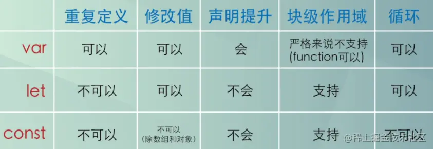*


## 简述

1. var声明变量存在变量提升，let和const不存在变量提升
2. let、const都是块级局部变量
3. 同一作用域下let和const不能声明同名变量，而var可以

## 详述

1. var 定义**变量**，没有块的概念，可以跨块访问，但不能跨函数访问，不初始化会出现undefined，不会报错；有变量提升。
2. let定义**变量**，只能在当前块级作用域里访问，也不能跨函数访问，对函数外部无影响；无变量提升。
3. const定义**常量**，只能在当前块级作用域里访问，也不能跨函数访问，使用时**必须初始化**(即必须赋值)，而且不能修改(引用数据类型，如指向的对象，即内存地址不能修改，但是能修改里面的属性)；无变量提升。

## 变量提升

> 通常JS引擎会在正式执行之前先进行一次预编译，在这个过程中，首先将变量声明及函数声明提升至当前作用域的顶端，然后进行接下来的处理。

使用 `var` 声明，存在变量提升的情况:

```js
console.log(a); // undefined
var a = 1;
console.log(a); // 1

// ======= 实际等效于 =========
var a;
console.log(a); // undefined
a = 1;
console.log(a); // 1
```

`函数声明式`存在`函数提升`的情况:

`JavaScript` 不同于 `Java` 等强类型语言，是在一个 `class` 中执行；在遇到函数直接相互调用的情况，都是通过 `this` 的形式，所以不需要考虑`函数提升`；而对于`JavaScript`，`函数提升`就是解决多个函数相互调用的情况，那有些人就说了，可以将函数当参数来解决这种情况，但是这种形式的话，代码的结构就...

```js
console.log(fn); // ƒ fn() {}
function fn() {}
```

在同一个作用域声明一个与函数名相同的变量名，函数会覆盖变量名：

```js
console.log(a); // ƒ a() {}
var a = 1;
function a() {};
console.log(a); // 1

// ======= 实际等效于 =========
function a() {};
console.log(a);  // ƒ a() {}
a = 1;
console.log(a); // 1

```

函数表达式的本质，是先声明一个变量，然后将一个匿名函数赋值给这个变量。

```js
console.log(fn); // undefined
var fn = function(){}
console.log(fn); // ƒ (){}
```

## js暂时性死区

ES6 规定，如果代码区块中存在 `let` 和 `const` 命令声明的变量，这个区块对这些变量从**一开始就形成了封闭作用域，直到声明语句完成，这些变量才能被访问（获取或设置），假如我们尝试在声明前去使用这类变量,就会报错**`ReferenceError`。这在语法上称为“暂时性死区”（英temporal dead zone，简 TDZ），即代码块开始到变量声明语句完成之间的区域。

1、通过 `var` 声明的变量拥有变量提升、**没有暂时性死区**，作用于函数作用域：

- 当进入变量的作用域（包围它的函数），立即为它创建（绑定）存储空间，**立即被初始化并被赋值为 `undefined`**
- 当执行到变量的声明语句时，如果变量定义了值则会被赋值

```js
(function fn() {  //函数作用域开始
        console.log(temp)  //undefined
        //声明
        var temp 
        console.log(temp)  //undefined
        //赋值
        temp = 123
        console.log(temp)  //123
    })()
    //在函数作用域外访问
    console.log(temp)  //ReferenceError: temp is not defined
```

2、通过 `let` 声明的变量没有变量提升、拥有暂时性死区，作用于块级作用域：

- 当进入变量的作用域（包围它的语法块），立即为它创建（绑定）存储空间，不会立即初始化，也不会被赋值
- 访问（获取或设置）该变量会抛出异常 `ReferenceError`
- 当执行到变量的声明语句时，如果变量定义了值则会被赋值，如果变量没有定义值，则被赋值为`undefined`

```js
{  //函数作用域开始，TDZ开始
            console.log(temp)  //ReferenceError: temp is not defined
            //声明
            let temp  
            console.log(temp)  //ReferenceError: Cannot access 'temp' before initialization
            //赋值
            temp = 345  //TDZ结束
            console.log(temp)  //345
            //块级作用域结束
        }
        //在块级作用域外访问
        console.log(temp)  //ReferenceError: temp is not defined
```

3、通过 const 声明的常量，需要在定义的时候就赋值，并且之后不能改变，暂时性死区与 let 类似。

```js
 {   //作用域开始，TDZ开始
            console.log(temp)  //ReferenceError: temp is not defined
            //声明并赋值
            const temp = 789  //TDZ结束
            console.log(temp)  //789 
            //给常量赋值
            temp = 987  //TypeError: Assignment to constant variable
            //作用域结束
        }   
        //在作用域外访问
        console.log(temp)  //ReferenceError: temp is not defined
```


# 执行栈和执行上下文、作用域、作用域链、原型、原型链

### 什么是执行上下文

执行上下文是当前 JavaScript 代码被**解析和执行**时所在环境的抽象概念。

#### 执行上下文类型

JavaScript 中有三种执行上下文类型。

- **全局执行上下文** — 这是默认或者说基础的上下文，任何不在函数内部的代码都在全局上下文中。它会执行两件事：创建一个全局的 window 对象（浏览器的情况下），并且设置 `this` 的值等于这个全局对象。一个程序中只会有一个全局执行上下文。
- **函数执行上下文** — 每当一个函数被调用时, 都会为该函数创建一个新的上下文。每个函数都有它自己的执行上下文，不过是在函数被调用时创建的。函数上下文可以有任意多个。每当一个新的执行上下文被创建，它会按定义的顺序（将在后文讨论）执行一系列步骤。
- **Eval 函数执行上下文** — 执行在 `eval` 函数内部的代码也会有它属于自己的执行上下文，但由于 JavaScript 开发者并不经常使用 `eval`，所以在这里我不会讨论它。

### 执行栈

执行栈，也叫调用栈，具有 LIFO（后进先出）结构，用于存储在代码执行期间创建的所有执行上下文。

首次运行JS代码时，会创建一个**全局**执行上下文并Push到当前的执行栈中。每当发生**函数调用**，引擎都会为该函数创建一个**新的函数**执行上下文并Push到当前执行栈的栈顶。

根据执行栈LIFO规则，当栈顶函数运行完成后，其对应的**函数**执行上下文将会从执行栈中Pop出，上下文控制权将移到当前执行栈的**下一个**执行上下文。

### 执行上下文的生命周期

https://juejin.cn/post/6844903798784131079#heading-4

执行上下文的生命周期包括三个阶段：**创建阶段→执行阶段→回收阶段**。

#### 1.创建阶段

当函数被调用，但未执行任何其内部代码之前，会做以下三件事：

- 创建**变量对象**：首先初始化函数的参数arguments，提升函数声明和变量声明。
- 创建**作用域链**（Scope Chain）：在执行期上下文的创建阶段，作用域链是在变量对象之后创建的。作用域链本身包含变量对象。作用域链用于解析变量。当被要求解析变量时，JavaScript 始终从代码嵌套的最内层开始，如果最内层没有找到变量，就会跳转到上一层父作用域中查找，直到找到该变量。
- 确定**this指向**：包括多种情况，下文会详细说明

在一段 JS 脚本执行之前，要先解析代码（所以说 JS 是解释执行的脚本语言），解析的时候会先创建一个全局执行上下文环境，先把代码中即将执行的变量、函数声明都拿出来。变量先暂时赋值为undefined，函数则先声明好可使用。这一步做完了，然后再开始正式执行程序。

另外，一个函数在执行之前，也会创建一个函数执行上下文环境，跟全局上下文差不多，不过 函数执行上下文中会多出this arguments和函数的参数。

#### 2.执行阶段

执行变量赋值、代码执行

#### 3.回收阶段

执行上下文出栈等待虚拟机回收执行上下文


### 什么是作用域、作用域链？

**作用域概念**：在某一区域执行Js代码时，需对变量或函数的值进行访问，而这一区域又提供对变量或函数的查找，并确定是否可以访问，则称该区域为作用域

**重要性**

1. **作用域最为重要的一点是安全。**变量只能在特定的区域内才能被访问，有了作用域我们就可以避免在程序其它位置意外对某个变量做出修改。
2. **作用域也会减轻命名的压力。**我们可以在不同的作用域下面定义相同的变量名。

**类型**

作用域又分为**全局作用域**和**局部作用域**。在ES6之前，局部作用域只包含了函数作用域，ES6的到来为我们提供了 **‘块级作用域’**（由一对花括号包裹），可以通过新增命令let和const来实现；而对于全局作用域这里有一个小细节需要注意一下：

> - 在 Web 浏览器中，全局作用域被认为是 **`window`** 对象，因此所有全局变量和函数都是作为 **`window`** 对象的属性和方法创建的。
> - 在 Node环境中，全局作用域是 **`global`** 对象。

全局作用域很好理解，现在我们再来解释一下局部作用域吧，先来看看**函数作用域**，所谓函数作用域，顾名思义就是由函数定义产生出来的作用域，代码示例：

```
function fun1(){
    var variable = 'abc'
}
function fun2(){
    var variable = 'cba'
}
fun1();
fun2();
//这里有两个函数，他们分别都有一个同名变量variable，在严格模式下，程序不会报错，
//这是因为这两个同名变量位于不同的函数内，也就是位于不同的作用域中，所以他们不会产生冲突。
```

我们再来看看**块级作用域**，ES6 之前 JavaScript 没有块级作用域，只有全局作用域和函数（局部）作用域。块语句（ **`{}`** 中间的语句），如 **`if`** 和 **`switch`** 条件语句， **`for`** 和 **`while`** 循环语句，不同于函数，它们**不会创建一个新的作用域**；但是ES6及之后的版本，块语句也**会创建一个新的作用域，** 块级作用域可通过新增命令**let和const**声明，所声明的变量在**指定块**的**作用域外无法被访问**。块级作用域在如下情况被创建：

> 1. 在一个函数内部
> 2. 在一个代码块（由一对花括号包裹）内部

let 声明的语法与 var 的语法一致。基本上可以用 let 来代替 var 进行变量声明，但会将变量的作用域限制在当前代码块中 **（注意：块级作用域并不影响var声明的变量）。** 但是使用let时有几点需要**注意**：

> - **声明变量不会提升到代码块顶部，即不存在变量提升**
> - **禁止重复声明同一变量**
> - **for循环语句中（）内部，即圆括号之内会建立一个隐藏的作用域，该作用域不属于for后边的{}中，并且只有for后边的{}产生的块作用域能够访问这个隐藏的作用域，这就使循环中** **绑定块作用域有了妙用**

这里分别演示一下ES5和ES6版本的代码，ES5：

```js
if(true) {
    var a = 1
}
for(var i = 0; i < 10; i++) {
    ...
}
console.log(a) // 1
console.log(i) // 10
```

ES6：

```js
for (let i = 0; i < 10; i++) {
            console.log(i);//0,1,2,3,4,5,6,7,8,9
 }
console.log(i);// Uncaught ReferenceError: i is not defined
```

```js
if (true) {
     let i = 9;
}
console.log(i);// Uncaught ReferenceError: i is not defined
```

**作用域链概念**：**变量取值会到创建这个变量的函数的作用域中取值，如果找不到，就会向上级作用域去查，直到查到全局作用域，这么一个查找过程形成的链条就叫做作用域链。**

### 原型、原型链

**原型**

在JavaScript中，每当定义一个函数数据类型(普通函数、类)时候，都会天生自带一个prototype属性，这个属性指向函数的原型对象。上面定义的属性和方法可以被对象实例**共享**。

**原型链**

1.`__proto__`和constructor

（Chrome、Safari、Firefox）每一个对象数据类型(普通的对象、实例、prototype......)也天生自带一个属性`__proto__`，属性值是当前实例所属类的原型(prototype)。原型对象中有一个属性**constructor**, 它指向函数对象。

> **but  `__proto__` 不是实例的属性，也不是构造函数的属性，在大多数的浏览器中都支持这种非正式的访问方式。实际上 `__proto__` 来自 `Object.prototype`，当使用 `obj.__proto__` 时，可以理解成返回了 `Object.getPrototypeOf(obj)`**

*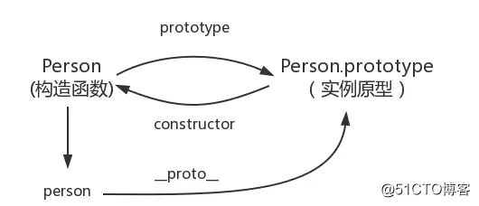*


在JavaScript中万物都是对象，对象和对象之间也有关系，并不是孤立存在的。对象之间的继承关系，在JavaScript中是实例通过proto指向原型对象，原型对象也指向父类的原型对象，直到指向Object对象为止，专业术语称之为**原型链**。

当我们访问对象的一个属性或方法时，它会先在**对象自身**中寻找，如果有则直接使用，如果没有则会去**原型对象**中寻找，如果找到则直接使用。如果没有则去**原型的原型中寻找**,直到找到Object对象的原型，Object对象的原型没有原型，如果在Object原型中依然没有找到，则返回undefined。

*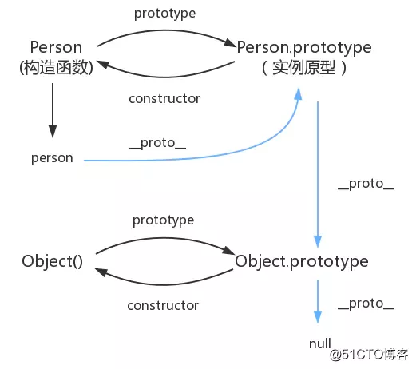*

据类型的基类(最顶层的类)在Object.prototype上没有__proto__这个属性。

```js
console.log(Object.prototype.__proto__ === null) // true
```

*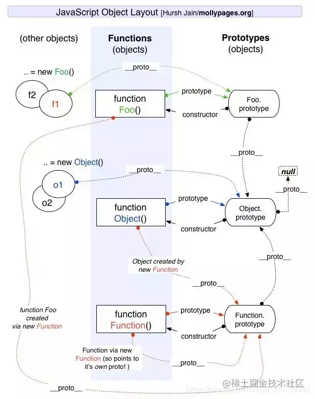*

小结

1、所有的实例的`_proto_`都指向该构造函数的原型对象（`prototype`）。

2、所有的函数（包括构造函数）是`Function`的实例，所以所有函数的`_proto_`的都指向`Function`的原型对象。

3、所有的原型对象（包括 `Function`的原型对象）都是Object的实例，所以`_proto_`都指向 `Object`（构造函数）的原型对象。而`Object`构造函数的 `_proto_`指向 null。

4、`Function`构造函数本身就是`Function`的实例，所以`_proto_`指向`Function`的原型对象。

### constructor 值只读吗

这个得分情况，对于引用类型来说 `constructor` 属性值是可以修改的，但是对于基本类型来说是只读的。

引用类型情况其值可修改这个很好理解，比如原型链继承方案中，就需要对 `constructor`重新赋值进行修正。

```js
// 木易杨
function Foo() {
    this.value = 42;
}
Foo.prototype = {
    method: function() {}
};

function Bar() {}

// 设置 Bar 的 prototype 属性为 Foo 的实例对象
Bar.prototype = new Foo();
Bar.prototype.foo = 'Hello World';

Bar.prototype.constructor === Object;
// true

// 修正 Bar.prototype.constructor 为 Bar 本身
Bar.prototype.constructor = Bar;

var test = new Bar() // 创建 Bar 的一个新实例
console.log(test);
```

**

对于基本类型来说是只读的，比如 `1、“muyiy”、true、Symbol`，当然 `null` 和 `undefined` 是没有 `constructor` 属性的。

```js
// 木易杨
function Type() { };
var	types = [1, "muyiy", true, Symbol(123)];

for(var i = 0; i < types.length; i++) {
	types[i].constructor = Type;
	types[i] = [ types[i].constructor, types[i] instanceof Type, types[i].toString() ];
};

console.log( types.join("\n") );
// function Number() { [native code] }, false, 1
// function String() { [native code] }, false, muyiy
// function Boolean() { [native code] }, false, true
// function Symbol() { [native code] }, false, Symbol(123)
```

为什么呢？因为创建他们的是只读的原生构造函数（`native constructors`），这个例子也说明了依赖一个对象的 `constructor` 属性并不安全。

# 构造函数

### 实例成员 和 静态成员

**实例成员：** 实例成员就是在构造函数内部，通过this添加的成员。实例成员只能通过实例化的对象来访问。

**静态成员：** 在构造函数本身上添加的成员，只能通过构造函数来访问

```
    function Star(name,age) {
        //实例成员
        this.name = name;
        this.age = age;
    }
    //静态成员
    Star.sex = '女';

    let stars = new Star('小红',18);
    console.log(stars);      // Star {name: "小红", age: 18}
    console.log(stars.sex);  // undefined     实例无法访问sex属性

    console.log(Star.name); //Star     通过构造函数无法直接访问实例成员
    console.log(Star.sex);  //女       通过构造函数可直接访问静态成员
```

### 通过构造函数创建对象

该过程也称作实例化

#### 如何通过构造函数创建一个对象？

```
 function Father(name) {
     this.name = name;
 }
 let son = new Father('Lisa');
 console.log(son); //Father {name: "Lisa"}
```

此时，son就是一个新对象。

#### new一个新对象的过程，发生了什么？

(1) 创建一个空对象 son `{}`
 (2) 为 son 准备原型链连接 `son.__proto__ = Father.prototype`
 (3) 重新绑定this，使构造函数的this指向新对象 `Father.call(this)`
 (4) 为新对象属性赋值 `son.name`
 (5) 返回this `return this`，此时的新对象就拥有了构造函数的方法和属性了*

#### 每个实例的方法是共享的吗？

这要看我们如何定义该方法了，分为两种情况。

##### 方法1：在构造函数上直接定义方法（不共享）

```
    function Star() {
        this.sing = function () {
            console.log('我爱唱歌');
        }
    }
    let stu1 = new Star();
    let stu2 = new Star();
    stu1.sing();//我爱唱歌
    stu2.sing();//我爱唱歌
    console.log(stu1.sing === stu2.sing);//false
```

很明显，stu1 和 stu2 指向的不是一个地方。 所以 在构造函数上通过this来添加方法的方式来生成实例，每次生成实例，都是新开辟一个内存空间存方法。这样会导致内存的极大浪费，从而影响性能。

##### 方法2：通过原型添加方法（共享）

构造函数通过原型分配的函数，是所有对象共享的。

```
    function Star(name) {
        this.name = name;
    }
    Star.prototype.sing = function () {
        console.log('我爱唱歌', this.name);
    };
    let stu1 = new Star('小红');
    let stu2 = new Star('小蓝');
    stu1.sing();//我爱唱歌 小红
    stu2.sing();//我爱唱歌 小蓝
    console.log(stu1.sing === stu2.sing);//true
```

#### 实例的属性为基本类型是，它们是共享的吗？

属性存储的是如果存储的是基本类型，不存在共享问题，是否相同要看值内容。

```
    let stu1 = new Star('小红');
    let stu2 = new Star('小红');
    console.log(stu1.name === stu2.name);//true

    let stu1 = new Star('小红');
    let stu2 = new Star('小蓝');
    console.log(stu1.name === stu2.name);//false
```

#### 定义构造函数的规则

公共属性定义到构造函数里面，公共方法我们放到原型对象身上。


# new操作符

### 创建对象的几种方式

#### 对象字面量

```js
const obj = {
  name: 'dz',
  age: 23
}
```

这种方式死板, 灵活度不高, 每次都需要手动创建, 冗余度也很大, 适用于临时对象变量或者局部属性少的对象

#### new

**内置构造函数**

```js
const obj = new Object()
obj.name = name
obj.age = age
```

只能创建一次对象, 复用性较差, 容易创建多个相同内容的对象, 造成代码冗余

**工厂模式**

```js
function Person(name, age) {
  const obj = {}
  obj.name = name
  obj.age = age
  return obj
}

const person = Person('dz', 23)
const person1 = Person('dz1', 24)
console.log(person instanceof Person) // -> false
console.log(person1.__proto__ == person.__proto_) // -> false
```

对象无法识别(不能识别是被哪一个工厂函数创造的), 相同工厂产出的实例的原型 `不是同一个`

**构造函数**

```js
function Person(name, age) {
  this.name = name
  this.age  = age
  this.sayname = () => {
    console.log(this.name)
  }
}

const p1 = new Person('dz', 23)
const p2 = new Person('dz1', 24)
console.log(p1 instanceof Person, p2 instanceof Person)// --> true true
```

构造函数简化了工厂模式的操作过程, 并且通过实例化对象, 可以知道该对象的标识, 能识别是被哪一个 `构造函数` 创造的, 使用`instanceof` 来判断是否属于某个构造函数的实例

但是, 构造函数内部存在方法, `方法就是对象`, 就意味着每次创建对象(实例)的时候就会重新创建方法, 重复的创建方法开辟了新的内存来储存

(js高程)使用构造函数主要问题就是每个方法都要在每个实例上重新创建一遍, 每个方法作用和使用方法一样, 根本不用重复创建Function实例. 况且有this对象在, 不用在执行代码前就把函数绑定到特定的对象上面.

(js高程)可以将函数定义到 `构造函数外部` 解决问题. 这样虽然解决了重复做同一件事的问题, 但是这让一个在全局作用域的方法只能被特定的对象调用就有点让全局作用域名不其实.

**原型模式**

```js
function Person(name, age) {
  Person.prototype.name = name
  Person.prototype.age  = age
  Person.prototype.likes  = ['apple', 'banana', 'watermelon']
  Person.prototype.sayname = () => {
    console.log(this.name)
  }
}
const p1 = new Person('dz', 23)
const p2 = new Person('dz1', 24)

p1.likes.pop() // -> 删除 watermelon
console.log(p1.name == p2.name) // -> true,  p2的属性覆盖了p1的属性
console.log(p1.likes) // -> ['apple', 'banana']
console.log(p2.likes) // -> ['apple', 'banana']
```

创建对象之后将构造函数 `原型` 上添加属性和方法, 这样的好处就是每一个实例都共享以同一个方法, 避免了重复创建相同的方法, 但是有一个大问题就是, 大家都是共享的, 因此每一个实例都可能更改这个原型里面的属性, 后面创建的对象包含的属性会覆盖上次一创建的对象的属性

(js高程)不必在构造函数中定义对象实例的信息, 而是可以将这些信息直接添加到原型对象中, 可以是一般实例都需要属于自己的全部属性, 甚少有人但单独使用原型模式

**组合模式(构造函数模式+原型模式)**

```js
function Person(name, age) {
  this.name = name
  this.age  = age
}

Person.prototype.sayname = () => {
  console.log(this.name)
}

const p1 = new Person('dz', 23)
const p2 = new Person('dz1', 24)
console.log(p1.name, p2.name)// dz dz1
```

这种方式结合两者的有点, 每个实例拥有自己的属性和方法, 以及共享相同的方法, 用的较多一种模式

**动态原型模式**

```js
function Person(name, age) {
  this.name = name
  this.age  = age
  if(typeof this.sayname != 'function') {
    Person.prototype.sayname = () => {
      console.log(this.name)
    }
  }
}
const p1 = new Person('dz', 23)
console.log(p1.sayname) // -> dz
```

这里只在`sayname` 方法不存在的情况下才添加到原型中, 只会在`初次调用` 构造函数时才会执行.

这样的代码, 使得每个对象的name、age都是`各自的`(不共有), 然后函数写在原型上, 就又是共享的.

**寄生构造函数**

这种模式的基本思想是创建一个函数, 该函数的作用仅仅是封装创建对象的代码, 然后再返回新创建的对象；但从表面上看, 这个函数又很像是典型的构造函数.

```js
function SpecialArray(){
  var array = new Array();
  array.push.apply(array,arguments);
  array.toPipedString = function(){
      return this.join("|");
  };
  return array;
}
var colors = new SpecialArray("red","green","pink");
alert(colors.toPipedString());// red|green|pink
alert(colors instanceof SpecialArray); // false 
```

我们知道, 当我们自定义一个构造函数后, 使用 `new` 的方式来创建一个对象时, 默认会返回一个 `新对象` 实例, 构造函数中是没有return语句的. 而这里所谓的寄生构造函数, 基本思想是创建一个函数, 这个函数的作用仅仅是为了某一个`特定的功能`而添加一些代码, 最后再将这个对象返回.

除了使用了new操作符并把包装的函数叫做构造函数外, 这个模式跟工厂模式没有任何区别.

另外, 这个 `SpecialArray()` 返回的对象, 与 `SpecialArray()构造函数` 或者与 `构造函数的原型对象` 之间没有任何关系, 就像你在SpecialArray()外面创建的其他对象一样, 所以如果用 `instanceof` 操作符来检测的话, 结果只能是 `false` 咯. 所以这是它的问题

**稳妥构造函数模式**

先说稳妥二字, 别人定义了一个稳妥对象, 即没有公共属性, 而且其方法也 `不引用this对象`, 这种模式适应于一些安全环境中(禁止使用this和new), 或防止数据被其他应用程序改动, 像下面这样：

```js
function Person(name,age,gender){
  var obj = new Object();
  obj.sayName = function(){
      alert(name);
  };
  return obj;
}
var person = Person("Stan",0000,"male"); // 这里没有使用new操作符
person.sayName(); // Stan
alert(person instanceof Person); // false
```

这里 `person` 中保存了一个稳妥对象, 除了调用`sayName()`方法外, 没有别的方式可以访问其数据成员. 即使有其他代码会给这个对象添加方法或属性, 但也不可能有别的办法访问传入到构造函数中的原始数据 . 同样与寄生函数模式类似, 使用稳妥构造函数模式创建的对象与构造函数之间也没有任何关系.

**class(ES6)**

```js
class Person {
  constructor(name, age) { // constructor构造函数
    this.name = name
    this.age  = age
  }

  sayname() { //原型上的
    console.log(this.name)
  }
  static sayAge() {
    console.log(this.age)
  }
}

const per = new Person('dz', 23)
per.sayname() // -> dz
Person.sayAge() // 23
```

`constructor`是构造方法,类似构造函数, 定义这个方法里面的内容都是实例自身的属性和方法, 不会被其他实例共享, 而写在外面的`sayname`表示原型上的方法, 是会被`共享`的.

`static` 表示静态，加了static的函数`不会`挂载到`prototype` 上,而是挂载到 `class类` 上, 类似于:

```javascript
Promise.resolve(...)
Math.max(...)
```

#### Object.create()

[js继承实现之Object.create](https://segmentfault.com/a/1190000014592412)

#### 区别

1.new的话只能是class（即函数），但是Object.create()的参数可以为对象也可以为函数， 2. 如果Object.create()的参数是对象的话，那么新的对象会继承原对象的属性；如果参数是类（函数）的话，Object.create()的参数为类（函数）原型，如您所说的，它没有绑定this，并没有属性被继承。3. Object.create(null)可以实现一个空对象，即没有原型的对象，但使用new就办不到。

[setPrototypeOf 与 Object.create区别](https://juejin.cn/post/6844903527941144589)

### new的流程

new做了什么工作呢？

- 新建一个对象`obj`
- 把这个obj的 _ _proto__ 属性指向构造函数的 prototype 属性
- 将构造函数的`this`指向obj
- 如果该函数没有返回对象，则返回`this`

*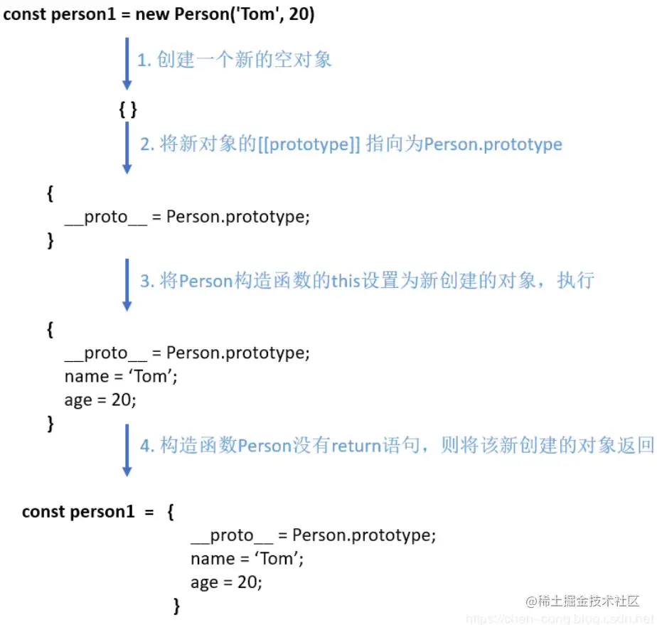*


在内存中体现就是：

- 同样开辟一个私有作用域栈内存，形参赋值和变量提升
- **JS 代码执行之前，构造函数会在当前私有作用域内创建一个对象也就是开辟一个堆内存空间，但暂时不存储任何内容。浏览器会让函数中的主体 this 指向这个堆内存地址**
- 代码自上而下执行
- **最后代码执行结束后，浏览器会把创建的对像堆内存的对象默认返回，不需要写 `return`。返回的也就是一个实例**

### 实现一个new

```js
function create(Con, ...args) {
  let obj = {}
  Object.setPrototypeOf(obj, Con.prototype)
  let result = Con.apply(obj, args)
  return result instanceof Object ? result : obj
}

```

这就是一个完整的实现代码，我们通过以下几个步骤实现了它：

1. 首先函数接受不定量的参数，第一个参数为构造函数，接下来的参数被构造函数使用
2. 然后内部创建一个空对象 `obj`
3. 因为 `obj` 对象需要访问到构造函数原型链上的属性，所以我们通过 `setPrototypeOf` 将两者联系起来。这段代码等同于 `obj.__proto__ = Con.prototype`
4. 将 `obj` 绑定到构造函数上，并且传入剩余的参数
5. 判断构造函数返回值是否为对象，如果为对象就使用构造函数返回的值，否则使用 `obj`，这样就实现了忽略构造函数返回的原始值

接下来我们来使用下该函数，看看行为是否和 `new` 操作符一致

```js
function Test(name, age) {
  this.name = name
  this.age = age
}
Test.prototype.sayName = function () {
    console.log(this.name)
}
const a = create(Test, 'yck', 26)
console.log(a.name) // 'yck'
console.log(a.age) // 26
a.sayName() // 'yck'
```


**返回值**

构造函数执行，不写 return ，浏览器会默认返回创建的实例，但是如果我们自己写了 return 。

- 基本值： return 是一个基本值，返回的结果依然是类的实例，没有收到影响。
- 引用值：如果返回的是一个对象，则将默认的返回的实例覆盖，接收的结果就不再是当前类的实例。

**in : 检测对象属性（私有 + 共有）**

检测当前对象是否存在某个属性（不管当前这个属性是对象的私有属性还是公有属性，只要有结果就是true）

**hasOwnProperty （私有）**

检测当前属性是否为对象的私有属性（不仅要有这个属性，而且必须还是私有的才可以）

```js
let arr = new Array();
arr.a = 1
arr.__proto__.b = 1
arr.hasOwnProperty('a') // true
arr.hasOwnProperty('b') // false
```


# 常用八种继承方案

### **原型链继承**

*构造函数、原型和实例之间的关系：每个构造函数都有一个原型对象，原型对象都包含一个指向构造函数的指针，而实例都包含一个原型对象的指针。*

*继承的本质就是**复制，即重写原型对象，代之以一个新类型的实例**。*

```js
function SuperType() {
    this.property = true;
}

SuperType.prototype.getSuperValue = function() {
    return this.property;
}

function SubType() {
    this.subproperty = false;
}

// 这里是关键，创建SuperType的实例，并将该实例赋值给SubType.prototype
SubType.prototype = new SuperType(); 

SubType.prototype.getSubValue = function() {
    return this.subproperty;
}

var instance = new SubType();
console.log(instance.getSuperValue()); // true

```

*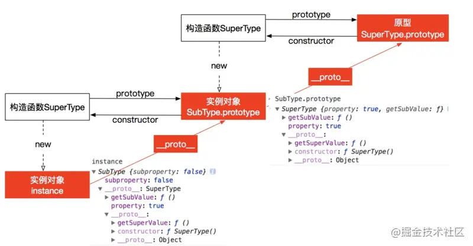*

原型链方案存在的缺点：多个实例对引用类型的操作会被篡改。

```js
function SuperType(){
  this.colors = ["red", "blue", "green"];
}
function SubType(){}

SubType.prototype = new SuperType();

var instance1 = new SubType();
instance1.colors.push("black");
alert(instance1.colors); //"red,blue,green,black"

var instance2 = new SubType(); 
alert(instance2.colors); //"red,blue,green,black"

```

### **借用构造函数继承**

**使用父类的构造函数来增强子类实例，等同于复制父类的实例给子类**（不使用原型）

```js
function  SuperType(){
    this.color=["red","green","blue"];
}
function  SubType(){
    //继承自SuperType
    SuperType.call(this);
}
var instance1 = new SubType();
instance1.color.push("black");
alert(instance1.color);//"red,green,blue,black"

var instance2 = new SubType();
alert(instance2.color);//"red,green,blue"

```

核心代码是`SuperType.call(this)`，创建子类实例时调用`SuperType`构造函数，于是`SubType`的每个实例都会将SuperType中的属性复制一份

缺点：

- 只能继承父类的**实例**属性和方法，**不能继承原型**属性/方法
- 无法实现复用，每个子类都有父类实例函数的副本，影响性能

### **组合继承**

组合上述两种方法就是组合继承。用**原型链实现对原型属性和方法的继承，用借用构造函数技术来实现实例属性的继承。**

```js
function SuperType(name){
  this.name = name;
  this.colors = ["red", "blue", "green"];
}
SuperType.prototype.sayName = function(){
  alert(this.name);
};

function SubType(name, age){
  // 继承属性
  // 第二次调用SuperType()
  SuperType.call(this, name);
  this.age = age;
}

// 继承方法
// 构建原型链
// 第一次调用SuperType()
SubType.pro	totype = new SuperType(); 
// 重写SubType.prototype的constructor属性，指向自己的构造函数SubType
SubType.prototype.constructor = SubType; 
SubType.prototype.sayAge = function(){
    alert(this.age);
};

var instance1 = new SubType("Nicholas", 29);
instance1.colors.push("black");
alert(instance1.colors); //"red,blue,green,black"
instance1.sayName(); //"Nicholas";
instance1.sayAge(); //29

var instance2 = new SubType("Greg", 27);
alert(instance2.colors); //"red,blue,green"
instance2.sayName(); //"Greg";
instance2.sayAge(); //27

```

**

缺点：

- 第一次调用`SuperType()`：给`SubType.prototype`写入两个属性name，color。
- 第二次调用`SuperType()`：给`instance1`写入两个属性name，color。

实例对象`instance1`上的两个属性就屏蔽了其原型对象SubType.prototype的两个同名属性。所以，组合模式的缺点就是在使用子类创建实例对象时，其原型中会存在两份相同的属性/方法。

### 原型式继承

```js
function object(obj){
  function F(){}
  F.prototype = obj;
  return new F();
}
```

*object()对传入其中的对象执行了一次`浅复制`，将构造函数F的原型直接指向传入的对象*

```js
var person = {
  name: "Nicholas",
  friends: ["Shelby", "Court", "Van"]
};

var anotherPerson = object(person);
anotherPerson.name = "Greg";
anotherPerson.friends.push("Rob");

var yetAnotherPerson = object(person);
yetAnotherPerson.name = "Linda";
yetAnotherPerson.friends.push("Barbie");

alert(person.friends);   //"Shelby,Court,Van,Rob,Barbie"

```

缺点：

- 原型链继承多个实例的引用类型属性指向相同，存在篡改的可能。
- 无法传递参数

另外，ES5中存在`Object.create()`的方法，能够代替上面的object方法。

### 寄生式继承

核心：在原型式继承的基础上，增强对象，返回构造函数

```js
function createAnother(original){
  var clone = object(original); // 通过调用 object() 函数创建一个新对象
  clone.sayHi = function(){  // 以某种方式来增强对象
    alert("hi");
  };
  return clone; // 返回这个对象
}
```

*函数的主要作用是为构造函数新增属性和方法，以**增强函数***

```js
var person = {
  name: "Nicholas",
  friends: ["Shelby", "Court", "Van"]
};
var anotherPerson = createAnother(person);
anotherPerson.sayHi(); //"hi"

```

缺点（同原型式继承）：

- 原型链继承多个实例的引用类型属性指向相同，存在篡改的可能。
- 无法传递参数

### 寄生组合式继承

结合借用构造函数传递参数和寄生模式实现继承

```js
function inheritPrototype(subType, superType){
  var prototype = Object.create(superType.prototype); // 创建对象，创建父类原型的一个副本
  prototype.constructor = subType;                    // 增强对象，弥补因重写原型而失去的默认的constructor 属性
  subType.prototype = prototype;                      // 指定对象，将新创建的对象赋值给子类的原型
}

// 父类初始化实例属性和原型属性
function SuperType(name){
  this.name = name;
  this.colors = ["red", "blue", "green"];
}
SuperType.prototype.sayName = function(){
  alert(this.name);
};

// 借用构造函数传递增强子类实例属性（支持传参和避免篡改）
function SubType(name, age){
  SuperType.call(this, name);
  this.age = age;
}

// 将父类原型指向子类
inheritPrototype(SubType, SuperType);

// 新增子类原型属性
SubType.prototype.sayAge = function(){
  alert(this.age);
}

var instance1 = new SubType("xyc", 23);
var instance2 = new SubType("lxy", 23);

instance1.colors.push("2"); // ["red", "blue", "green", "2"]
instance1.colors.push("3"); // ["red", "blue", "green", "3"]

```

*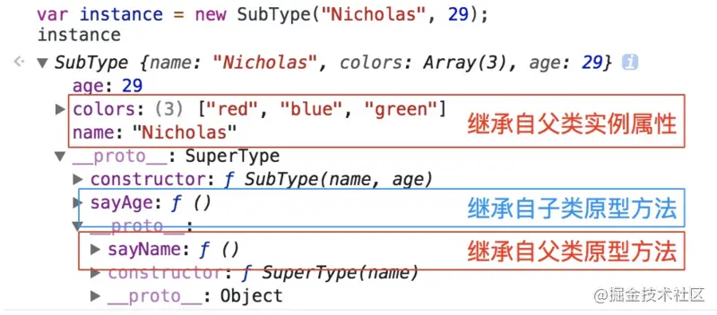*

这个例子的高效率体现在它只调用了一次`SuperType` 构造函数，并且因此避免了在`SubType.prototype` 上创建不必要的、多余的属性。于此同时，原型链还能保持不变；因此，还能够正常使用`instanceof` 和`isPrototypeOf()`

**这是最成熟的方法，也是现在库实现的方法**

### 混入方式继承多个对象

```js
function MyClass() {
     SuperClass.call(this);
     OtherSuperClass.call(this);
}

// 继承一个类
MyClass.prototype = Object.create(SuperClass.prototype);
// 混合其它
Object.assign(MyClass.prototype, OtherSuperClass.prototype);
// 重新指定constructor
MyClass.prototype.constructor = MyClass;

MyClass.prototype.myMethod = function() {
     // do something
};

```

`Object.assign`会把 `OtherSuperClass`原型上的函数拷贝到 `MyClass`原型上，使 MyClass 的所有实例都可用 OtherSuperClass 的方法。

### ES6类和extends

`ES6` 的`class`可以看作只是一个`ES5`生成实例对象的构造函数的语法糖。它参考了`java`语言，定义了一个类的概念，让对象原型写法更加清晰，对象实例化更像是一种面向对象编程。`Class`类可以通过`extends`实现继承。它和ES5构造函数的不同点

- `ES6`的`class`类必须用`new`命令操作，而`ES5`的构造函数不用`new`也可以执行。
- `ES6`的`class`类不存在变量提升，必须先定义`class`之后才能实例化，不像`ES5`中可以将构造函数写在实例化之后。
- `ES5` 的继承，实质是先创造子类的实例对象`this`，然后再将父类的方法添加到`this`上面。`ES6` 的继承机制完全不同，实质是先将父类实例对象的属性和方法，加到`this`上面（所以必须先调用`super`方法），然后再用子类的构造函数修改`this`。


# this,bind,call,apply

**this解决的问题:**

this提供了一种更优雅的方法来隐式'传递'一个对象的引用，因此可以**将API设计得更加简洁并且易于复用**。

### this的指向

在 ES5 中，其实 this 的指向，始终坚持一个原理：**this 永远指向最后调用它的那个对象**，记住这句话，this 你已经了解一半了。

例 1：

```js
var name = "windowsName";
function a() {
    var name = "Cherry";

    console.log(this.name);          // windowsName

    console.log("inner:" + this);    // inner: Window
}
a();
console.log("outer:" + this)         // outer: Window
```

这个相信大家都知道为什么 log 的是 windowsName，因为根据刚刚的那句话“**this 永远指向最后调用它的那个对象**”，我们看最后调用 `a` 的地方 `a();`，前面没有调用的对象那么就是全局对象 window，这就相当于是 `window.a()`；注意，这里我们没有使用严格模式，如果使用严格模式的话，全局对象就是 `undefined`，那么就会报错 `Uncaught TypeError: Cannot read property 'name' of undefined`。

**this指向window对象，为window绑定**

例 2：

```js
var name = "windowsName";
var a = {
    name: "Cherry",
    fn : function () {
        console.log(this.name);      // Cherry
    }
}
a.fn();
```

在这个例子中，函数 fn 是对象 a 调用的，所以打印的值就是 a 中的 name 的值。

**此处为隐式绑定**

例 3：

```js
var name = "windowsName";
    var a = {
        name: "Cherry",
        fn : function () {
            console.log(this.name);      // Cherry
        }
    }
    window.a.fn();
```

这里打印 Cherry 的原因也是因为刚刚那句话“**this 永远指向最后调用它的那个对象**”，最后调用它的对象仍然是对象 a。

我们再来看一下这个例子：

```js
    var name = "windowsName";
    var a = {
        // name: "Cherry",
        fn : function () {
            console.log(this.name);      // undefined
        }
    }
    window.a.fn();
```

这里为什么会打印 `undefined` 呢？这是因为正如刚刚所描述的那样，调用 fn 的是 a 对象，也就是说 fn 的内部的 this 是对象 a，而对象 a 中并没有对 name 进行定义，所以 log 的 `this.name` 的值是 `undefined`。

这个例子还是说明了：**this 永远指向最后调用它的那个对象**，因为最后调用 fn 的对象是 a，所以就算 a 中没有 name 这个属性，也不会继续向上一个对象寻找 `this.name`，而是直接输出 `undefined`。

再来看一个比较坑的例子：
例 5：*

```js
    var name = "windowsName";
    var a = {
        name : null,
        // name: "Cherry",
        fn : function () {
            console.log(this.name);      // windowsName
        }
    }

    var f = a.fn;
    f();
```

这里你可能会有疑问，为什么不是 `Cherry`，这是因为虽然将 a 对象的 fn 方法赋值给变量 f 了，但是没有调用，再接着跟我念这一句话：“**this 永远指向最后调用它的那个对象**”，由于刚刚的 f 并没有调用，所以 `fn()` 最后仍然是被 window 调用的。所以 this 指向的也就是 window。

由以上五个例子我们可以看出，this 的指向并不是在创建的时候就可以确定的，在 es5 中，永远是**this 永远指向最后调用它的那个对象**。

```js
  var name = "windowsName";

    function fn() {
        var name = 'Cherry';
        innerFunction();
        function innerFunction() {
            console.log(this.name);      // windowsName
        }
    }

    fn()
```

### 绑定的优先级

如果显示绑定和new绑定同时存在，或者更宽泛的说：**在某个调用位置多条绑定规则同时存在怎么办呢**？为了解决这个问题就必须给这些规则设定优先级，这就是我们接下来要介绍的内容。

毫无疑问，Window绑定的优先级是最低的，显式绑定和隐式绑定的优先级，通过上面的例子也可以证明，显式大于隐式。所以目前顺序是：`显式 > 隐式 > Window`

那我们来测试下显示绑定和new绑定的优先级顺序。由于call/apply无法和new一起使用，我们可以使用bind（硬绑定）来验证。

```arcade
function foo() {
  this.name = 'Cherry';
} 
var obj = {
  name: 'obj'
}; 

var fn = foo.bind(obj)
var result = new fn()
console.log(obj.name) // => 'obj'
console.log(result.name) // => 'Cherry'
```

显而易见的，new的优先级，大于显示绑定。最终顺序为：`new > 显式 > 隐式 > Window`。

于是我们判断this，就有了一个顺序：

1. 函数是否在new中调用？
2. 是否通过call、apply、bind等调用？
3. 是否在某个上下文对象中调用？
4. 都不是则是Window绑定。且严格模式下绑定到undefined

### 改变 this 的指向

改变 this 的指向我总结有以下几种方法：

- 使用 ES6 的箭头函数
- 在函数内部使用 `_this = this`
- 使用 `apply`、`call`、`bind`，为**显式绑定**
- new 实例化一个对象，为**new绑定**

例 7：

```js
    var name = "windowsName";

    var a = {
        name : "Cherry",

        func1: function () {
            console.log(this.name)     
        },

        func2: function () {
            setTimeout(  function () {
                this.func1()
            },100);
        }

    };

    a.func2()     // this.func1 is not a function
```

在不使用箭头函数的情况下，是会报错的，因为最后调用 `setTimeout` 的对象是 window，但是在 window 中并没有 func1 函数。

#### 箭头函数

众所周知，ES6 的箭头函数是可以避免 ES5 中使用 this 的坑的。**箭头函数的 this 始终指向函数定义时的 this，而非执行时。**，箭头函数需要记着这句话：“**箭头函数中没有 this 绑定，必须通过查找作用域链来决定其值，如果箭头函数被非箭头函数包含，则 this 绑定的是最近一层非箭头函数的 this，否则，this 为 undefined**”。

例 8 ：

```js
    var name = "windowsName";

    var a = {
        name : "Cherry",

        func1: function () {
            console.log(this.name)     
        },

        func2: function () {
            setTimeout( () => {
                this.func1()
            },100);
        }

    };

    a.func2()     // Cherry
```

关于箭头函数，我们还需要注意以下几点：

1. 函数体内的this就是定义时所在的对象，而非调用时所在的对象，和普通函数相反。
2. 箭头函数无法用做构造函数，即不能使用new调用
3. 不能使用arguments对象，函数中不存在这个对象。
4. 不可使用yield命令，即无法用做Generator函数。

其中第一点尤其值得注意，之所以this是固定的，是因为箭头函数本身没有this，箭头函数的this不是自己的。所以不能修改，也正因为没有this，所以不能用作构造函数。这些限制都是因为没有this导致的。

#### 在函数内部使用 `_this = this`

如果不使用 ES6，那么这种方式应该是最简单的不会出错的方式了，我们是先将调用这个函数的对象保存在变量 `_this` 中，然后在函数中都使用这个 `_this`，这样 `_this` 就不会改变了。

例 9：

```js
    var name = "windowsName";

    var a = {

        name : "Cherry",

        func1: function () {
            console.log(this.name)     
        },

        func2: function () {
            var _this = this;
            setTimeout( function() {
                _this.func1()
            },100);
        }

    };

    a.func2()       // Cherry
```

这个例子中，在 func2 中，首先设置 `var _this = this;`，这里的 `this` 是调用 `func2` 的对象 a，为了防止在 `func2` 中的 setTimeout 被 window 调用而导致的在 setTimeout 中的 this 为 window。我们将 `this(指向变量 a)` 赋值给一个变量 `_this`，这样，在 `func2` 中我们使用 `_this` 就是指向对象 a 了。

#### 使用 apply、call、bind

**使用 apply**

例 10：

```js
    var a = {
        name : "Cherry",

        func1: function () {
            console.log(this.name)
        },

        func2: function () {
            setTimeout(  function () {
                this.func1()
            }.apply(a),100);
        }

    };

    a.func2()            // Cherry
```

**使用 call**

例 11：

```js
    var a = {
        name : "Cherry",

        func1: function () {
            console.log(this.name)
        },

        func2: function () {
            setTimeout(  function () {
                this.func1()
            }.call(a),100);
        }

    };

    a.func2()            // Cherry
```

**使用 bind**

例 12：

```js
    var a = {
        name : "Cherry",

        func1: function () {
            console.log(this.name)
        },

        func2: function () {
            setTimeout(  function () {
                this.func1()
            }.bind(a)(),100);
        }

    };

    a.func2()            // Cherry
```

### call、apply、bind区别

刚刚我们已经介绍了 apply、call、bind 都是可以改变 this 的指向的，但是这三个函数稍有不同。

**语法：**

```js
fun.call(thisArg, param1, param2, ...)
fun.apply(thisArg, [param1,param2,...])
fun.bind(thisArg, param1, param2, ...)
```

**返回值：**

call/apply：`fun`执行的结果  bind：返回`fun`的拷贝，并拥有指定的`this`值和初始参数

**参数**

**调用`call`/`apply`/`bind`的必须是个函数**

call、apply和bind是挂在Function对象上的三个方法,只有函数才有这些方法。

只要是函数就可以，比如: `Object.prototype.toString`就是个函数，我们经常看到这样的用法：`Object.prototype.toString.call(data)`

它们的作用就是改变函数执行时的this指向，目前所有关于它们的运用，都是基于这一点来进行的。


传给`fun`的参数写法不同：

- `call`从第2~n的参数都是传给`fun`的。

- `apply`是 第2个参数，这个参数是一个数组：传给`fun`参数都写在数组中。

- call/apply与bind的区别

  **执行**：

  - call/apply改变了函数的this上下文后马上**执行该函数**
  - bind则是返回改变了上下文后的函数,**不执行该函数**

  **返回值**:

  - call/apply 返回`fun`的执行结果
  - bind返回fun的拷贝，并**指定了fun的this指向，保存了fun的参数。**

  返回值这段在下方bind应用中有详细的示例解析。

  ```js
  function fn(a, b) {
      console.log(this, a, b)
  }
  
  var obj = {
      name: '林一一'
  }
  
  fn.call(obj, 20, 23)   // {name: "林一一"} 20 23
  
  fn.call(20, 23) // Number {20} 23 undefined
  
  fn.call()   //Window {0: global, window: …} undefined undefined     | 严格模式下为 undefined
  
  fn.call(null)   //Window {0: global, window: …} undefined undefined       | 严格模式下为 null
  
  fn.call(undefined)  //Window {0: global, window: …} undefined undefined     | 严格模式下为 undefined
  ```

  `fn`调用了`call`，`fn` 的 `this` 指向 `obj`，最后 `fn` 被执行；`this` 指向的值都是引用类型，在非严格模式下，不传参数或传递 `null/undefined`，`this` 都指向 `window`。传递的是原始值，原始值会被包装。严格模式下，`call` 的一个参数是谁就指向谁

  ```js
  var obj1 = {
      a: 10,
      fn: function(x) {
          console.log(this.a + x)
      }
  }
  
  var obj2 = {
      a : 20,
      fn: function(x) {
          console.log(this.a - x)
      }
  }
  
  obj1.fn.call(obj2, 20) //40
  ```

  稍微变量一下，原理不变`obj1.fn` 中 `fn`的 `this` 指向到 `obj2`，最后还是执行 `obj1.fn` 中的函数。

以上就是三种显示绑定的方法，但有三点需要注意：

1. call和apply是立即执行，bind则是返回一个绑定了this的新函数，只有你调用了这个新函数才真的调用了目标函数
2. bind函数存在多次绑定的问题，如果多次绑定this，则以第一次为准。
3. bind函数实际上是显示绑定（call、apply）的一个变种，称为**硬绑定**。由于硬绑定是一种非常常用的模式，所以在 ES5 中提供了内置的方法`Function.prototype.bind`

为什么多次使用bind绑定this，以第一次为准呢？我们看下面的例子：

```php
function foo() {
  console.log( this.name );
} 

var obj1 = {
  name: 'obj1'
}; 

var obj2 = {
  name: 'obj2'
}

var fn = foo.bind(obj1).bind(obj2)
fn() // => 'obj1'
fn.call(obj2) // => 'obj1'
```

也就是说bind函数只能绑定一次，多次绑定是没有用的，绑定后的函数this无法改变，即使call/apply也不行，所以才称作硬绑定。


# 闭包、柯里化、内存泄漏、防抖节流、单例模式

```js
var n = 10
function fn(){
    var n =20
    function f() {
       n++;
       console.log(n)
    }
    f()
    return f
}

var x = fn()
x()
x()
console.log(n)
/* 输出
*  21
    22
    23
    10
/
```

> ****思路：`fn` 的返回值是什么变量 `x` 就是什么，这里 `fn` 的返回值是函数名 `f` 也就是 `f` 的堆内存地址，`x()` 也就是执行的是函数 `f()`，而不是 `fn()`，输出的结果显而易见****

**JS 堆栈内存释放**

堆内存：存储引用类型值，对象类型就是键值对，函数就是代码字符串。

堆内存释放：将引用类型的空间地址变量赋值成 `null`，或没有变量占用堆内存了浏览器就会释放掉这个地址

栈内存：提供代码执行的环境和存储基本类型值。

栈内存释放：一般当函数执行完后函数的私有作用域就会被释放掉。

> **但栈内存的释放也有特殊情况：① 函数执行完，但是函数的私有作用域内有内容被栈外的变量还在使用的，栈内存就不能释放里面的基本值也就不会被释放。② 全局下的栈内存只有页面被关闭的时候才会被释放**

### 闭包定义

> **闭包是指有权访问另一个函数作用域中变量的函数**，**通常在嵌套函数中实现**。

### 形成闭包的原因

> **内部的函数存在外部作用域的引用就会导致闭包**。从上面介绍的上级作用域的概念中其实就有闭包的例子 `return f`就是一个表现形式。

```js
var a = 0
function foo(){
    var b =14
    function fo(){
        console.log(a, b)
    }
    fo()
}
foo()
//这里的子函数 fo 内存就存在外部作用域的引用 a, b，所以这就会产生闭包
```

### 闭包变量存储的位置

> 直接说明：**闭包中的变量存储的位置是堆内存。**
>
> 假如闭包中的变量存储在栈内存中，那么栈的回收 会把处于栈顶的变量自动回收。所以闭包中的变量如果处于栈中那么变量被销毁后，闭包中的变量就没有了。所以闭包引用的变量是出于堆内存中的。

### 闭包的作用

- **保护**函数的私有变量不受外部的干扰。形成不销毁的栈内存。
- **保存**，把一些函数内的值保存下来。闭包可以实现方法和属性的私有化。

### 闭包经典使用场景

1. `return` 回一个函数

   ```js
   var n = 10
   function fn(){
       var n =20
       function f() {
          n++;
          console.log(n)
        }
       return f
   }
   
   var x = fn()
   x() // 21
   //这里的 return f, f()就是一个闭包，存在上级作用域的引用。
   ```

2. **函数作为参数**

   ```js
   var a = '林一一'
   function foo(){
       var a = 'foo'
       function fo(){
           console.log(a)
       }
       return fo
   }
   
   function f(p){
       var a = 'f'
       p()
   }
   f(foo())
   /* 输出
   *   foo
   / 
   //使用 return fo 返回回来，fo() 就是闭包，f(foo()) 执行的参数就是函数 fo，因为 fo() 中的 a 的上级作用域就是函数foo()，所以输出就是foo
   ```

3. IIFE（自执行函数）

   ```js
   var n = '林一一';
   (function p(){
       console.log(n)
   })()
   /* 输出
   *   林一一
   / 
   //同样也是产生了闭包p()，存在 window下的引用 n。
   ```

4. 循环赋值

   ```js
   for(var i = 0; i<10; i++){
     (function(j){
          setTimeout(function(){
           console.log(j)
       }, 1000) 
     })(i)
   }
   //因为存在闭包的原因上面能依次输出1~10，闭包形成了10个互不干扰的私有作用域。将外层的自执行函数去掉后就不存在外部作用域的引用了，输出的结果就是连续的 10。为什么会连续输出10，因为 JS 是单线程的遇到异步的代码不会先执行(会入栈)，等到同步的代码执行完 i++ 到 10时，异步代码才开始执行此时的 i=10 输出的都是 10。
   ```

5. 使用回调函数就是在使用闭包

   ```js
   window.name = '林一一'
   setTimeout(function timeHandler(){
     console.log(window.name);
   }, 100)
   ```

6. 单例模式

   单例模式是一种常见的设计模式，它**保证了一个类只有一个实例**。实现方法一般是先判断实例是否存在，如果存在就直接返回，否则就创建了再返回。单例模式的好处就是避免了重复实例化带来的内存开销：

   ```js
   const getSingleBuider = function(fn) {
       let instance;
       return function() {
           return instance || (instance = fn.apply(this, arguments));
       }
   }
   ```

   

### 节流防抖

### 函数防抖(debounce)

> 在事件被触发n秒后再执行回调，如果在这n秒内又被触发，则重新计时。

方式：每次触发事件时设置一个延迟调用方法，并且取消之前的延时调用方法

```js
//防抖debounce代码：
function debounce(fn) {
    let timeout = null; // 创建一个标记用来存放定时器的返回值
    return function () {
        // 每当用户输入的时候把前一个 setTimeout clear 掉
        clearTimeout(timeout); 
        // 然后又创建一个新的 setTimeout, 这样就能保证interval 间隔内如果时间持续触发，就不会执行 fn 函数
        timeout = setTimeout(() => {
            fn.apply(this, arguments);
        }, 500);
    };
}
// 处理函数
function handle() {
    console.log(Math.random());
}
// 滚动事件
window.addEventListener('scroll', debounce(handle));
```

### 函数节流(throttle)

> 规定在一个单位时间内，只能触发一次函数。如果这个单位时间内触发多次函数，只有一次生效。

实现方式：每次触发事件时，如果当前有等待执行的延时函数，则直接return

```js
//节流throttle代码：
function throttle(fn) {
    let canRun = true; // 通过闭包保存一个标记
    return function () {
         // 在函数开头判断标记是否为true，不为true则return
        if (!canRun) return;
         // 立即设置为false
        canRun = false;
        // 将外部传入的函数的执行放在setTimeout中
        setTimeout(() => { 
        // 最后在setTimeout执行完毕后再把标记设置为true(关键)表示可以执行下一次循环了。
        // 当定时器没有执行的时候标记永远是false，在开头被return掉
            fn.apply(this, arguments);
            canRun = true;
        }, 500);
    };
}

function sayHi(e) {
    console.log(e.target.innerWidth, e.target.innerHeight);
}
window.addEventListener('resize', throttle(sayHi));
```

函数节流与函数防抖都是为了限制函数的执行频次，以优化函数触发频率过高导致的响应速度跟不上触发频率，出现延迟，假死或卡顿的现象。 **总结：**
 **函数防抖**：将多次操作合并为一次操作进行。原理是维护一个计时器，规定在delay时间后触发函数，但是在delay时间内再次触发的话，就会取消之前的计时器而重新设置。这样一来，只有最后一次操作能被触发。

**函数节流**：使得一定时间内只触发一次函数。原理是通过判断是否有延迟调用函数未执行。

**区别**： 函数节流不管事件触发有多频繁，都会保证在规定时间内一定会执行一次真正的事件处理函数，而函数防抖只是在最后一次事件后才触发一次函数。 比如在页面的无限加载场景下，我们需要用户在滚动页面时，每隔一段时间发一次 Ajax 请求，而不是在用户停下滚动页面操作时才去请求数据。这样的场景，就适合用节流技术来实现。

### 柯里化

#### 高阶函数（HOF）

高阶函数（`Higher-Order Function`）是至少满足如下条件之一的函数：

1. 函数可以作为参数被传递
2. 函数可以作为返回值输出

在JavaScript中常见于回调函数则是作为了参数被传递，闭包则是返回了函数

#### 函数柯里化

函数柯里化指的是将能够接收多个参数的函数转化为接收单一参数的函数，并且返回接收余下参数且返回结果的新函数的技术。

函数柯里化的主要作用和特点就是参数复用、提前返回和延迟执行。

**代码实现**

```js
const curry = function(fn) {
  return function inner() {
    // 浅拷贝入参
    const args = Array.prototype.slice.call(arguments);
    // 如果下一个参数的长度大于了函数的行参个数，则跳出递归
    if (arguments.length >= fn.length) {
      return fn.apply(undefined, args);
    } else {
      // 否则继续处理后续参数，返回curring函数
      return function() {
        // 获取合并上一次和下一次的入参
        const allArgs = args.concat(Array.prototype.slice.call(arguments));
        return inner.apply(undefined, allArgs);
      };
    }
  };
}

function sum(a, b, c) {
    return a + b + c;
}

const currySum = curry(sum);
console.log(currySum(1)(2)(3)); //6
```

**ES6实现**

```js
const curry = fn =>
  judge = (...args) =>
    args.length >= fn.length 
      ? fn(...args) 
      : arg => judge(...args, arg);

```

*另一种实现*

```js
function curry(fn, len = fn.length) {
    return _curry(fn, len)
}

function _curry(fn, len, ...arg) {
    return function (...params) {
        let _arg = [...arg, ...params]
        if (_arg.length >= len) {
            return fn.apply(this, _arg)
        } else {
            return _curry.call(this, fn, len, ..._arg)
        }
    }
}

let fn = curry(function (a, b, c, d, e) {
    console.log(a + b + c + d + e)
})

fn(1, 2, 3, 4, 5)  // 15
fn(1, 2)(3, 4, 5)
fn(1, 2)(3)(4)(5)
fn(1)(2)(3)(4)(5)
```

*`javascript` 中常见的 `bind` 方法就可以用柯里化的方法来实现：*

```
Function.prototype.myBind = function (context = window) {
    if (typeof this !== 'function') throw new Error('Error');
    let selfFunc = this;
    let args = [...arguments].slice(1);
    
    return function F () {
        // 因为返回了一个函数，可以 new F()，所以需要判断
        if (this instanceof F) {
            return new selfFunc(...args, arguments);
        } else  {
            // bind 可以实现类似这样的代码 f.bind(obj, 1)(2)，所以需要将两边的参数拼接起来
            return selfFunc.apply(context, args.concat(arguments));
        }
    }
}
```


### *经典面试题*

- *for 循环和闭包(号称必刷题)*

```js
var data = [];

for (var i = 0; i < 3; i++) {
  data[i] = function () {
    console.log(i);
  };
}

data[0]();
data[1]();
data[2]()
/* 输出
    3
    3
    3
/
```

> *这里的 `i` 是全局下的 `i`，共用一个作用域，当函数被执行的时候这时的 `i=3`，导致输出的结构都是3。*

- *使用闭包改善上面的写法达到预期效果，写法1：自执行函数和闭包*

```js
var data = [];

for (var i = 0; i < 3; i++) {
    (function(j){
      setTimeout( data[j] = function () {
        console.log(j);
      }, 0)
    })(i)
}

data[0]();
data[1]();
data[2]()
```

- *写法2：使用 `let`*

```js
var data = [];

for (let i = 0; i < 3; i++) {
  data[i] = function () {
    console.log(i);
  };
}

data[0]();
data[1]();
data[2]()
```

> *`let` 具有块级作用域，形成的3个私有作用域都是互不干扰的。*

***思考题和上面有何不同 (字节)***

```js
var result = [];
var a = 3;
var total = 0;

function foo(a) {
    for (var i = 0; i < 3; i++) {
        result[i] = function () {
            total += i * a;
            console.log(total);
        }
    }
}

foo(1);
result[0]();  // 3
result[1]();  // 6
result[2]();  // 9
```

> *tip：这里也形成了闭包。total 被外层引用没有被销毁。*


### 使用闭包需要注意什么

> ```
> 容易导致内存泄漏。闭包会携带包含其它的函数作用域，因此会比其他函数占用更多的内存。过度使用闭包会导致内存占用过多，所以要谨慎使用闭包。
> ```

### **内存泄漏**

#### **定义**

> 内存泄漏（Memory leak）是在计算机科学中，由于疏忽或错误造成程序未能释放已经不再使用的内存。并非指内存在物理上的消失，而是应用程序分配某段内存后，由于设计错误，导致在释放该段内存之前就失去了对该段内存的控制，从而造成了内存的浪费

#### ****引起内存泄漏的情况****

1. ***意外的全局变量***

全局变量的生命周期最长，直到页面关闭前，它都存活着，所以全局变量上的内存一直都不会被回收

当全局变量使用不当，没有及时回收（手动赋值 null），或者拼写错误等将某个变量挂载到全局变量时，也就发生内存泄漏了

2. **遗忘的定时器**

setTimeout 和 setInterval 是由浏览器专门线程来维护它的生命周期，所以当在某个页面使用了定时器，当该页面销毁时，没有手动去释放清理这些定时器的话，那么这些定时器还是存活着的

也就是说，定时器的生命周期并不挂靠在页面上，所以当在当前页面的 js 里通过定时器注册了某个回调函数，而该回调函数内又持有当前页面某个变量或某些 DOM 元素时，就会导致即使页面销毁了，由于定时器持有该页面部分引用而造成页面无法正常被回收，从而导致内存泄漏了

如果此时再次打开同个页面，内存中其实是有双份页面数据的，如果多次关闭、打开，那么内存泄漏会越来越严重

而且这种场景很容易出现，因为使用定时器的人很容易遗忘清除

所以，当不需要 `interval` 或者 `timeout` 时，最好调用 `clearInterval` 或者 `clearTimeout`来清除，另外，浏览器中的 `requestAnimationFrame` 也存在这个问题，我们需要在不需要的时候用 `cancelAnimationFrame` API 来取消使用。


**3. 使用不当的闭包**

函数本身会持有它定义时所在的词法环境的引用，但通常情况下，使用完函数后，该函数所申请的内存都会被回收了

但当函数内再返回一个函数时，由于返回的函数持有外部函数的词法环境，而返回的函数又被其他生命周期东西所持有，导致外部函数虽然执行完了，但内存却无法被回收

所以，返回的函数，它的生命周期应尽量不宜过长，方便该闭包能够及时被回收

正常来说，闭包并不是内存泄漏，因为这种持有外部函数词法环境本就是闭包的特性，就是为了让这块内存不被回收，因为可能在未来还需要用到，但这无疑会造成内存的消耗，所以，不宜烂用就是了。

**4. 遗漏的 DOM 元素**

DOM 元素的生命周期正常是取决于是否挂载在 DOM 树上，当从 DOM 树上移除时，也就可以被销毁回收了

但如果某个 DOM 元素，在 js 中也持有它的引用时，那么它的生命周期就由 js 和是否在 DOM 树上两者决定了，记得移除时，两个地方都需要去清理才能正常回收它

还有 `DOM` 的事件绑定，移除 `DOM` 元素前如果忘记了注销掉其中绑定的事件方法，也会造成内存泄露：

```js
const wrapDOM = document.getElementById('wrap');
wrapDOM.onclick = function (e) {console.log(e);};

// some codes ...

// remove wrapDOM
wrapDOM.parentNode.removeChild(wrapDOM);
```

**5.网络回调**

某些场景中，在某个页面发起网络请求，并注册一个回调，且回调函数内持有该页面某些内容，那么，当该页面销毁时，应该注销网络的回调，否则，因为网络持有页面部分内容，也会导致页面部分内容无法被回收。

**遗忘的事件监听器**

当事件监听器在组件内挂载相关的事件处理函数，而在组件销毁时不主动将其清除时，其中引用的变量或者函数都被认为是需要的而不会进行回收，如果内部引用的变量存储了大量数据，可能会引起页面占用内存过高，这样就造成意外的内存泄漏。

我们就拿 Vue 组件来举例子，React 里也是一样的：

```html
<template>
  <div></div>
</template>

<script>
export default {
  created() {
    window.addEventListener("resize", this.doSomething)
  },
  beforeDestroy(){
    window.removeEventListener("resize", this.doSomething)
  },
  methods: {
    doSomething() {
      // do something
    }
  }
}
</script>
```

**遗忘的监听者模式**

监听者模式想必我们都知道，不管是 Vue 、 React 亦或是其他，对于目前的前端开发框架来说，监听者模式实现一些消息通信都是非常常见的，比如 `EventBus`. . .

当我们实现了监听者模式并在组件内挂载相关的事件处理函数，而在组件销毁时不主动将其清除时，其中引用的变量或者函数都被认为是需要的而不会进行回收，如果内部引用的变量存储了大量数据，可能会引起页面占用内存过高，这样也会造成意外的内存泄漏。

还是用 Vue 组件举例子，因为比较简单：

```html
<template>
  <div></div>
</template>

<script>
export default {
  created() {
    eventBus.on("test", this.doSomething)
  },
  beforeDestroy(){
    eventBus.off("test", this.doSomething)
  },
  methods: {
    doSomething() {
      // do something
    }
  }
}
</script>
```

如上，我们只需在 `beforeDestroy` 组件销毁生命周期里将其清除即可。

**遗忘的Map、Set对象**

当使用 `Map` 或 `Set` 存储对象时，同 `Object` 一致都是强引用，如果不将其主动清除引用，其同样会造成内存不自动进行回收。

如果使用 `Map` ，对于键为对象的情况，可以采用 `WeakMap`，`WeakMap` 对象同样用来保存键值对，对于键是弱引用（注：`WeakMap` 只对于键是弱引用），且必须为一个对象，而值可以是任意的对象或者原始值，由于是对于对象的弱引用，不会干扰 `Js` 的垃圾回收。

如果需要使用 `Set` 引用对象，可以采用 `WeakSet`，`WeakSet` 对象允许存储对象弱引用的唯一值，`WeakSet` 对象中的值同样不会重复，且只能保存对象的弱引用，同样由于是对于对象的弱引用，不会干扰 `Js` 的垃圾回收。

这里可能需要简单介绍下，谈弱引用，我们先来说强引用，之前我们说 JS 的垃圾回收机制是如果我们持有对一个对象的引用，那么这个对象就不会被垃圾回收，这里的引用，指的就是 `强引用` ，而弱引用就是一个对象若只被弱引用所引用，则被认为是不可访问（或弱可访问）的，因此可能在任何时刻被回收。

不明白？来看例子就晓得了：

```js
// obj是一个强引用，对象存于内存，可用
let obj = {id: 1}

// 重写obj引用
obj = null 
// 对象从内存移除，回收 {id: 1} 对象
```

上面是一个简单的通过重写引用来清除对象引用，使其可回收。

再看下面这个：

```js
let obj = {id: 1}
let user = {info: obj}
let set = new Set([obj])
let map = new Map([[obj, 'hahaha']])

// 重写obj
obj = null 

console.log(user.info) // {id: 1}
console.log(set)
console.log(map)
```

此例我们重写 `obj` 以后，`{id: 1}` 依然会存在于内存中，因为 `user` 对象以及后面的 `set/map` 都强引用了它，Set/Map、对象、数组对象等都是强引用，所以我们仍然可以获取到 `{id: 1}` ，我们想要清除那就只能重写所有引用将其置空了。

接下来我们看 `WeakMap` 以及 `WeakSet`：

```js
let obj = {id: 1}
let weakSet = new WeakSet([obj])
let weakMap = new WeakMap([[obj, 'hahaha']])

// 重写obj引用
obj = null

// {id: 1} 将在下一次 GC 中从内存中删除
```

*如上所示，使用了 `WeakMap` 以及 `WeakSet` 即为弱引用，将 `obj` 引用置为 `null` 后，对象 `{id: 1}` 将在下一次 GC 中被清理出内存。*

**未清理的console输出**

写代码的过程中，肯定避免不了一些输出，在一些小团队中可能项目上线也不清理这些 `console`，殊不知这些 `console` 也是隐患，同时也是容易被忽略的，我们之所以在控制台能看到数据输出，是因为浏览器保存了我们输出对象的信息数据引用，也正是因此未清理的 `console` 如果输出了对象也会造成内存泄漏。

所以，开发环境下我们可以使用控制台输出来便于我们调试，但是在生产环境下，一定要及时清理掉输出。

可能有同学会觉得不可思议，甚至不相信，这里我们留一个例子，大家看完文章刚好可以自己测试一下，可以先保存这段代码哦！（如何测试看完下文就明白啦）

```html
<!DOCTYPE html>
<html lang="en">

<head>
  <meta charset="UTF-8">
  <title>test</title>
</head>

<body>
  <button id="click">click</button>

  <script>
    !function () {
      function Test() {
        this.init()
      }
      Test.prototype.init = function () {
        this.a = new Array(10000).fill('isboyjc')
        console.log(this)
      }

      document.querySelector('#click').onclick = function () {
        new Test();
      }
    }()
  </script>
</body>

</html>
```


#### 怎么检查内存泄露

- F12浏览器工具中的performance 面板 和 memory 面板可以找到泄露的现象和位置

#### 浏览器解决方法：

垃圾回收机制


# 垃圾回收

### 概念

`GC` 即 `Garbage Collection` ，程序工作过程中会产生很多 `垃圾`，这些**垃圾是程序不用的内存或者是之前用过了，以后不会再用的内存空间，**而 `GC` 就是负责回收垃圾的，因为他工作在引擎内部，所以对于我们前端来说，`GC` 过程是相对比较无感的，这一套引擎执行而对我们又相对无感的操作也就是常说的 `垃圾回收机制` 了

#### 可达性

JavaScript 中内存管理的主要概念是可达性。

简单地说，**“可达性” 值就是那些以某种方式可访问或可用的值**，它们被保证存储在内存中。

**1. 有一组基本的固有可达值，由于显而易见的原因无法删除。例如:**

- 本地函数的局部变量和参数
- 当前嵌套调用链上的其他函数的变量和参数
- 全局变量
- 还有一些其他的，内部的

**这些值称为根。**

**2. 如果引用或引用链可以从根访问任何其他值，则认为该值是可访问的。**

例如，如果局部变量中有对象，并且该对象具有引用另一个对象的属性，则该对象被视为**可达性**， 它引用的那些也是可以访问的，详细的例子如下。

JavaScript 引擎中有一个后台进程称为[垃圾回收器](https://link.segmentfault.com/?enc=oacf9nqaahoxkw9sIAeKcw%3D%3D.w6cXsKFVJX7ldc8qs8n%2F10i2NTudcOP3T0spgYtM8CJw9HF5YWx0Y1QGHvPkgBDrXRQooaPtN254zorhhq8hpeyoLA0JenJ%2BdRFLhcjjWao%3D)，它监视所有对象，并删除那些不可访问的对象。


### 垃圾回收策略

我们都可以 Get 到这之中的重点，那就是怎样找出所谓的垃圾？

这个流程就涉及到了一些算法策略，有很多种方式，我们简单介绍两个最常见的

- 标记清除算法
- 引用计数算法

**标记清除法步骤**：

- 垃圾回收器获取根并**“标记”**(记住)它们。
- 然后它访问并“标记”所有来自它们的引用。
- 然后它访问标记的对象并标记它们的引用。所有被访问的对象都被记住，以便以后不再访问同一个对象两次。
- 以此类推，直到有未访问的引用(可以从根访问)为止。
- 除标记的对象外，所有对象都被删除。

综上所述，标记清除算法或者说策略就有两个很明显的缺点

- **内存碎片化**，空闲内存块是不连续的，容易出现很多空闲内存块，还可能会出现分配所需内存过大的对象时找不到合适的块
- **分配速度慢**，因为即便是使用 `First-fit` 策略，其操作仍是一个 `O(n)` 的操作，最坏情况是每次都要遍历到最后，同时因为碎片化，大对象的分配效率会更慢

而 **标记整理（Mark-Compact）算法** 就可以有效地解决，它的标记阶段和标记清除算法没有什么不同，只是标记结束后，标记整理算法会将活着的对象（即不需要清理的对象）向内存的一端移动，最后清理掉边界的内存

**引用计数算法步骤**

它的策略是跟踪记录每个变量值被使用的次数

- 当声明了一个变量并且将一个引用类型赋值给该变量的时候这个值的引用次数就为 1
- 如果同一个值又被赋给另一个变量，那么引用数加 1
- 如果该变量的值被其他的值覆盖了，则引用次数减 1
- 当这个值的引用次数变为 0 的时候，说明没有变量在使用，这个值没法被访问了，回收空间，垃圾回收器会在运行的时候清理掉引用次数为 0 的值占用的内存

**优点**

引用计数算法的优点我们对比标记清除来看就会清晰很多，首先引用计数在引用值为 0 时，也就是在变成垃圾的那一刻就会被回收，所以它可以立即回收垃圾

而标记清除算法需要每隔一段时间进行一次，那在应用程序（JS脚本）运行过程中线程就必须要暂停去执行一段时间的 `GC`，另外，标记清除算法需要遍历堆里的活动以及非活动对象来清除，而引用计数则只需要在引用时计数就可以了

**缺点**

引用计数的缺点想必大家也都很明朗了，首先它需要一个计数器，而此计数器需要占很大的位置，因为我们也不知道被引用数量的上限，还有就是无法解决**循环引用**无法回收的问题，这也是最严重的


### 优化

- **分代回收**——对象分为两组:“新对象”和“旧对象”。许多对象出现，完成它们的工作并迅速结 ，它们很快就会被清理干净。那些活得足够久的对象，会变“老”，并且很少接受检查。
- **增量回收**——如果有很多对象，并且我们试图一次遍历并标记整个对象集，那么可能会花费一些时间，并在执行中会有一定的延迟。因此，引擎试图将垃圾回收分解为多个部分。然后，各个部分分别执行。这需要额外的标记来跟踪变化，这样有很多微小的延迟，而不是很大的延迟。
- **空闲时间收集**——垃圾回收器只在 CPU 空闲时运行，以减少对执行的可能影响。


# *正则表达式* RegExp

> 正则表达式是用于匹配字符串中字符组合的模式。在 JavaScript 中，正则表达式也是对象。这些模式被用于 [`RegExp`](https://developer.mozilla.org/zh-CN/docs/Web/JavaScript/Reference/Global_Objects/RegExp) 的 [`exec`](https://developer.mozilla.org/zh-CN/docs/Web/JavaScript/Reference/Global_Objects/RegExp/exec) 和 [`test`](https://developer.mozilla.org/zh-CN/docs/Web/JavaScript/Reference/Global_Objects/RegExp/test) 方法，以及 [`String`](https://developer.mozilla.org/zh-CN/docs/Web/JavaScript/Reference/Global_Objects/String) 的 [`match`](https://developer.mozilla.org/zh-CN/docs/Web/JavaScript/Reference/Global_Objects/String/match)、[`matchAll`](https://developer.mozilla.org/zh-CN/docs/Web/JavaScript/Reference/Global_Objects/String/matchAll)、[`replace`](https://developer.mozilla.org/zh-CN/docs/Web/JavaScript/Reference/Global_Objects/String/replace)、[`search`](https://developer.mozilla.org/zh-CN/docs/Web/JavaScript/Reference/Global_Objects/String/search) 和 [`split`](https://developer.mozilla.org/zh-CN/docs/Web/JavaScript/Reference/Global_Objects/String/split) 方法。

*语法*

```
/正则表达式主体/修饰符(可选)
```

### *模糊匹配*

#### *横向模糊匹配*

*横向模糊指的是，一个正则可匹配的字符串的长度不是固定的，可以是多种情况的。*

*其实现的方式是使用量词。譬如**{m,n}**，表示连续出现最少m次，最多n次。*

*比如`/ab{2,5}c/`表示匹配这样一个字符串：第一个字符是“a”，接下来是2到5个字符“b”，最后是字符“c”。*

#### ***纵向模糊匹配***

*纵向模糊指的是，一个正则匹配的字符串，具体到某一位字符时，它可以不是某个确定的字符，可以有多种可能。*

*其实现的方式是使用字符组。譬如**[abc]**，表示该字符是可以字符“a”、“b”、“c”中的**任何一个**。*

*比如`/a[123]b/`可以匹配如下三种字符串："a1b"、"a2b"、"a3b"。*

### *字符组*

*需要强调的是，虽叫字符组（字符类），但只是其中一个字符。例如`[abc]`，**表示匹配一个字符**，它可以是“a”、“b”、“c”之一。*

#### ***范围表示法***

*比如`[123456abcdefGHIJKLM]`，可以写成`[1-6a-fG-M]`。用连字符`-`来省略和简写。*

*因为连字符有特殊用途，那么要匹配“a”、“-”、“z”这三者中任意一个字符，该怎么做呢？*

*不能写成`[a-z]`，因为其表示小写字符中的任何一个字符。*

*可以写成如下的方式：`[-az]`或`[az-]`或`[a\-z]`。即要么放在开头，要么放在结尾，要么转义。总之不会让引擎认为是范围表示法就行了。*

#### ***排除字符组***

*此时就是排除字符组（反义字符组）的概念。例如`[^abc]`，表示是一个除"a"、"b"、"c"之外的任意一个字符。字符组的第一位放`^`（脱字符），表示求反的概念。*

#### ***常见的简写形式***

*有了字符组的概念后，一些常见的符号我们也就理解了。因为它们都是系统自带的简写形式。*

> ***`\d`**就是`[0-9]`。表示是一位数字。记忆方式：其英文是digit（数字）。*
>
> ***`\D`**就是`[^0-9]`。表示除数字外的任意字符。*
>
> ***`\w`**就是`[0-9a-zA-Z_]`。表示数字、大小写字母和下划线。记忆方式：w是word的简写，也称单词字符。*
>
> ***`\W`**是`[^0-9a-zA-Z_]`。非单词字符。*
>
> ***`\s`**是`[ \t\v\n\r\f]`。表示空白符，包括空格、水平制表符、垂直制表符、换行符、回车符、换页符。记忆方式：s是space character的首字母。*
>
> ***`\S`**是`[^ \t\v\n\r\f]`。 非空白符。*
>
> ***`.`**就是`[^\n\r\u2028\u2029]`。通配符，表示几乎任意字符。换行符、回车符、行分隔符和段分隔符除外。记忆方式：想想省略号...中的每个点，都可以理解成占位符，表示任何类似的东西。*

*如果要匹配任意字符怎么办？可以使用`[\d\D]`、`[\w\W]`、`[\s\S]`和`[^]`中任何的一个。*

### *量词*

#### ***简写形式***

> *`{m,}` 表示至少出现m次。*
>
> *`{m} 等价于`{m,m}，表示出现m次。*
>
> *`? 等价于`{0,1}，表示出现或者不出现。记忆方式：问号的意思表示，有吗？*
>
> *`+ `等价于`{1,}`，表示出现至少一次。记忆方式：加号是追加的意思，得先有一个，然后才考虑追加。*
>
> *`* 等价于`{0,}，表示出现任意次，有可能不出现。记忆方式：看看天上的星星，可能一颗没有，可能零散有几颗，可能数也数不过来。*

#### ***贪婪匹配和惰性匹配***

```ini
var regex = /\d{2,5}/g;
var string = "123 1234 12345 123456";
console.log( string.match(regex) ); 
// => ["123", "1234", "12345", "12345"]
复制代码
```

*其中正则`/\d{2,5}/`，表示数字连续出现2到5次。会匹配2位、3位、4位、5位连续数字。*

*但是其是贪婪的，它会尽可能多的匹配。你能给我6个，我就要5个。你能给我3个，我就3要个。反正只要在能力范围内，越多越好。*

*我们知道有时贪婪不是一件好事（请看文章最后一个例子）。而惰性匹配，就是尽可能少的匹配：*

```lua
var regex = /\d{2,5}?/g;
var string = "123 1234 12345 123456";
console.log( string.match(regex) ); 
// => ["12", "12", "34", "12", "34", "12", "34", "56"]
复制代码
```

*其中`/\d{2,5}?/`表示，虽然2到5次都行，当2个就够的时候，就不在往下尝试了。*

*通过在量词后面加个问号就能实现惰性匹配，因此所有惰性匹配情形如下：*

> ```
> **{m,n}?** `
> `**{m,}?**`
> `**??**`
> `**+?**`
> `***?**
> ```

#### *多选分支*

*一个模式可以实现横向和纵向模糊匹配。而多选分支可以支持多个子模式任选其一。*

*具体形式如下：`(p1|p2|p3)`，其中`p1`、`p2`和`p3`是子模式，用`|`（管道符）分隔，表示其中任何之一。*

*例如要匹配"good"和"nice"可以使用`/good|nice/`。测试如下：*

```ini
var regex = /good|nice/g;
var string = "good idea, nice try.";
console.log( string.match(regex) ); 
// => ["good", "nice"]
```

*但有个事实我们应该注意，比如我用`/good|goodbye/`，去匹配"goodbye"字符串时，结果是"good"：*

```ini
var regex = /good|goodbye/g;
var string = "goodbye";
console.log( string.match(regex) ); 
// => ["good"]
```

*而把正则改成`/goodbye|good/`，结果是：*

```ini
var regex = /goodbye|good/g;
var string = "goodbye";
console.log( string.match(regex) ); 
// => ["goodbye"]
```

*也就是说，分支结构也是惰性的，即当前面的匹配上了，后面的就不再尝试了。*

### *常用方法*

#### *test()*

*test() 方法用于检测一个字符串是否匹配某个模式，如果字符串中含有匹配的文本，则返回 true，否则返回 false。*

```js
/e/.test("The best things in life are free!")
```

#### *exec()*

*exec() 方法用于检索字符串中的正则表达式的匹配。*

```js
/e/.exec("The best things in life are free!");
```

#### ***search()***

***search()** 方法用于检索字符串中指定的子字符串，或检索与正则表达式相匹配的子字符串，并返回子串的起始位置。*

```js
var str = "Visit Runoob!"; 
var n = str.search(/Runoob/i);
var n = str.search("Runoob");//search 方法可使用字符串作为参数。字符串参数会转换为正则表达式：
```

#### *replace()*

***replace()** 方法用于在字符串中用一些字符串替换另一些字符串，或替换一个与正则表达式匹配的子串。*

```js
var str = document.getElementById("demo").innerHTML; 
var txt = str.replace(/microsoft/i,"Runoob");
```

### *常用判断*

#### ***判断是否全为A-Za-z英文字母***

```js
let str = "asaaa"
var isletter2 = /^[a-zA-Z]+$/.test(str);
```

#### *判断是否全为汉字*

```js
/^[\u4e00-\u9fa5]+$/.test(str)
```


# *生成器Generator*

### *介绍*

- generator:可以将生成器视为可以暂停和恢复的进程（代码段),代码在执行的过程中可以主要交出控制权，是 ES6 提供的一种异步编程解决方案

- genearator 语法: function 是一个新的关键字用于生成器函数（也有生成器方法）。
  yield是generator可以自行暂停的运算符。此外，generator还可以通过yield接收输入和发送输出。

```js
function* example() {
 yield 1;
 yield 2;
 yield 3;
}
var iter=example();
iter.next();//{value:1，done:false}
iter.next();//{value:2，done:false}
iter.next();//{value:3，done:false}
iter.next();//{value:undefined，done:true}
```

Generator函数有多个返回值状态（每个yield关键字后跟一个状态），只有调用next()函数时才会返回值，每调用一次next()函数就返回一个对象{value: xxx, done: false}，直到没有对应的yield了就返回done状态为true的对象{value: undefined, done: true}。

*与普通函数相比二者有如下区别:*

- 普通函数使用 function 声明，生成器函数用 function*声明
- *普通函数使用 return 返回值，生成器函数使用 yield 返回值*
- *普通函数是 run to completion 模式，即普通函数开始执行后，会一直执行到该函数所有语句完成，在此期间别的代码语句是不会被执行的；生成器函数是 run-pause-run 模式，即生成器函数可以在函数运行中被暂停一次或多次，并且在后面再恢复执行，在**暂停期间允许其他代码语句被执行***

### *使用案例*

*https://blog.csdn.net/qq_39903567/article/details/115188020*

#### *1.给普通对象添加[遍历](https://so.csdn.net/so/search?q=遍历&spm=1001.2101.3001.7020)器*

*一个普通的对象obj默认是没有遍历器的，意味着不能使用for…of遍历，且不能使用…操作符解构。*
*可见都是报错obj is not iterable，我们通过Generator函数给其添加遍历器。*

```js
let obj = {
    name:'zhangsan',
    age:18,
    sex:'man'
}
obj[Symbol.iterator]=function* (){
    for(var key in obj){
        yield obj[key];
    }
}
for(let value of obj){
    console.log(value);//zhangsan 18 man
}
console.log([...obj]);//["zhangsan", 18, "man"]
```

#### *2.将[ajax](https://so.csdn.net/so/search?q=ajax&spm=1001.2101.3001.7020)请求转成类似的 let a = ajax()的同步赋值形式*

*经常碰见一个业务内多个请求串联依赖，即后者依赖前者的请求结果，目前只能有3种做法，*

- *回调函数嵌套*

- *使用promise的.then进行链式调用*

- *但现在我们学习了Generator函数后可以有第三种选择*
  *将前一个网络请求的返回值赋值给一个变量，在下一个请求中使用*
  *即以下形式：*

- ```js
  let a = 请求1(){}
  let b = 请求2(a){}
  
  let res = 0;
  //封装一个网络请求函数，不做实际动作，就打印一下参数param
  function ajaxMy(method,url,param,varibal){
      console.log(param);
      //使用延时计时器模拟网络请求1秒后返回正确结果response
      setTimeout(function(){
          let response = res++;
          varibal.next(response);
      },300)
  }
  
  let k;
  let tell = function* (){
      //网络请求1
      let a = yield ajaxMy('get','www.baidu.com',10,k);
      console.log(a);//0
      //网络请求2
      let b = yield ajaxMy('get','www.baidu.com',a,k);
      console.log(b);//1
      //网络请求3
      let c = yield ajaxMy('get','www.baidu.com',b,k);
      console.log(c);//2
      //网络请求4
      let d = yield ajaxMy('get','www.baidu.com',c,k);
      console.log(d);//3
  }
  k = tell()
  k.next();
  ```

  *以上代码let a = yield ajaxMy(‘get’,‘www.baidu.com’,10,k);类似于将一个网络请求的返回值赋值给了a变量，可在下一步请求yield ajaxMy(‘get’,‘www.baidu.com’,a,k);中作为参数使用，这样一来编写业务逻辑就会清晰很多。*

#### *3.实现[状态机]*

```js
let state = function* (){
    while(1){
        yield 'block';
        yield 'none';
    }
}
let displayClass = state();
console.log(displayClass.next().value);//block
console.log(displayClass.next().value);//none
console.log(displayClass.next().value);//block
console.log(displayClass.next().value);//none
```

### *实现原理*

*先简单回顾一下JS的运行规则：*

1. *JS是单线程的，只有一个主线程*
2. *函数内的代码从上到下顺序执行，遇到被调用的函数先进入被调用函数执行，待完成后继续执行*
3. *遇到异步事件，浏览器另开一个线程，主线程继续执行，待结果返回后，执行回调函数*

*****那么，Generator函数是如何进行异步化为同步操作的呢？ 实质上很简单， 和 yield 是一个标识符，在浏览器进行软编译的时候，遇到这两个符号，自动进行了代码转换：******

```js
// 异步函数
function asy() {
    $.ajax({
        url: 'test.txt',
        dataType: 'text',
        success() {
            console.log("我是异步代码");
        }
    })
}

function* gener() {
    let asy = yield asy();
    yield console.log("我是同步代码");
}
let it = gener().next();
it.then(function() {
    it.next();
})
// 我是异步代码
// 我是同步代码
```

*浏览器编译之后:*

```js
function gener() {
    // let asy = yield asy(); 替换为
    $.ajax({
        url: 'test.txt',
        dataType: 'text',
        success() {
            console.log("我是异步代码");
            // next 之后执行以下
            console.log("我是同步代码");
        }
    })
    // yield console.log("我是同步代码");
}
```

**整个过程类似于，浏览器遇到标识符 * 之后，就明白这个函数是生成器函数，一旦遇到 yield 标识符，就会将以后的函数放入此异步函数之内，待异步返回结果后再进行执行。**

*更深一步，从内存上来讲：*
*普通函数在被调用时，JS 引擎会创建一个栈帧，在里面准备好局部变量、函数参数、临时值、代码执行的位置（也就是说这个函数的第一行对应到代码区里的第几行机器码），在当前栈帧里设置好返回位置，然后将新帧压入栈顶。待函数执行结束后，这个栈帧将被弹出栈然后销毁，返回值会被传给上一个栈帧。*

*当执行到 yield 语句时，Generator 的栈帧同样会被弹出栈外，但Generator在这里耍了个花招——它在堆里保存了栈帧的引用（或拷贝）！这样当 it.next 方法被调用时，JS引擎便不会重新创建一个栈帧，而是把堆里的栈帧直接入栈。因为栈帧里保存了函数执行所需的全部上下文以及当前执行的位置，所以当这一切都被恢复如初之时，就好像程序从原本暂停的地方继续向前执行了。*
*而因为每次 yield 和 it.next 都对应一次出栈和入栈，所以可以直接利用已有的栈机制，实现值的传出和传入。*


# *期约Promise*

*是异步编程的一种解决方案，比传统的解决方案（回调函数）更加合理和更加强大*

*在 Promise 出现以前，在我们处理多个异步请求嵌套时，可能产生**回调地狱**，产生**回调地狱**的原因归结起来有两点：*

1. ***嵌套调用**，第一个函数的输出往往是第二个函数的输入；*
2. ***处理多个异步请求并发**，开发时往往需要同步请求最终的结果。*

*原因分析出来后，那么问题的解决思路就很清晰了：*

1. ***消灭嵌套调用**：通过 Promise 的链式调用可以解决；*
2. ***合并多个任务的请求结果**：使用 Promise.all 获取合并多个任务的错误处理。*

### *状态*

*`promise`对象仅有三种状态*

- *`pending`（进行中）*
- *`fulfilled`（已成功）*
- *`rejected`（已失败）*

### *特点*

- *对象的状态不受外界影响，只有异步操作的结果，可以决定当前是哪一种状态*
- *一旦状态改变（从`pending`变为`fulfilled`和从`pending`变为`rejected`），就不会再变，任何时候都可以得到这个结果*

**

*`Promise`对象是一个构造函数，用来生成`Promise`实例*

```
const promise = new Promise(function(resolve, reject) {});
Promise`构造函数接受一个函数作为参数，该函数的两个参数分别是`resolve`和`reject
```

- *`resolve`函数的作用是，将`Promise`对象的状态从“未完成”变为“成功”*
- *`reject`函数的作用是，将`Promise`对象的状态从“未完成”变为“失败”*

### *实例方法*

*`Promise`构建出来的实例存在以下方法：*

- *then()*
- *catch()*
- *finally()*

#### *then()*

***“promise本身不是异步的，是用来管理异步的，但是then方法是异步的「微任务」”***

*`then`是实例状态发生改变时的回调函数，第一个参数是`resolved`状态的回调函数，第二个参数是`rejected`状态的回调函数*

*`then`方法**返回的是一个新的`Promise`实例**，也就是`promise`能链式书写的原因*

```js
getJSON("/posts.json").then(function(json) {
  return json.post;
}).then(function(post) {
  // ...
});
```

#### *catch*

*`catch()`方法是`.then(null, rejection)`或`.then(undefined, rejection)`的别名，用于指定发生错误时的回调函数*

```js
getJSON('/posts.json').then(function(posts) {
  // ...
}).catch(function(error) {
  // 处理 getJSON 和 前一个回调函数运行时发生的错误
  console.log('发生错误！', error);
});
```

*`Promise `对象的错误具有“冒泡”性质，会一直向后传递，直到被捕获为止*

```js
getJSON('/post/1.json').then(function(post) {
  return getJSON(post.commentURL);
}).then(function(comments) {
  // some code
}).catch(function(error) {
  // 处理前面三个Promise产生的错误
});
```

*一般来说，使用`catch`方法代替`then()`第二个参数*

*`Promise `对象抛出的错误不会传递到外层代码，即不会有任何反应*

```js
const someAsyncThing = function() {
  return new Promise(function(resolve, reject) {
    // 下面一行会报错，因为x没有声明
    resolve(x + 2);
  });
};
```

*浏览器运行到这一行，会打印出错误提示`ReferenceError: x is not defined`，但是不会退出进程*

*`catch()`方法之中，还能再抛出错误，通过后面`catch`方法捕获到*

#### *finally()*

*`finally()`方法用于指定不管 Promise 对象最后状态如何，都会执行的操作*

```js
promise
.then(result => {···})
.catch(error => {···})
.finally(() => {···});
```

### *构造函数方法*

*`Promise`构造函数存在以下方法：*

- *all()*
- *race()*
- *allSettled()*
- *resolve()*
- *reject()*
- *try()*

#### *all()*

*`Promise.all()`方法用于将多个 `Promise `实例，包装成一个新的 `Promise `实例*

```js
const p = Promise.all([p1, p2, p3]);
```

*接受一个**数组**（迭代对象）作为参数，**数组成员都应为`Promise`实例***

*实例`p`的状态由`p1`、`p2`、`p3`决定，分为两种：*

- *只有`p1`、`p2`、`p3`的状态都变成`fulfilled`，`p`的状态才会变成`fulfilled`，此时`p1`、`p2`、`p3`的返回值组成一个数组，传递给`p`的回调函数*
- *只要`p1`、`p2`、`p3`之中有一个被`rejected`，`p`的状态就变成`rejected`，此时第一个被`reject`的实例的返回值，会传递给`p`的回调函数*

*注意，如果作为参数的 `Promise` 实例，自己定义了`catch`方法，那么它一旦被`rejected`，并不会触发`Promise.all()`的`catch`方法*

```js
const p1 = new Promise((resolve, reject) => {
  resolve('hello');
})
.then(result => result)
.catch(e => e);

const p2 = new Promise((resolve, reject) => {
  throw new Error('报错了');
})
.then(result => result)
.catch(e => e);

Promise.all([p1, p2])
.then(result => console.log(result))
.catch(e => console.log(e));
// ["hello", Error: 报错了]
```

*如果`p2`没有自己的`catch`方法，就会调用`Promise.all()`的`catch`方法*

```js
const p1 = new Promise((resolve, reject) => {
  resolve('hello');
})
.then(result => result);

const p2 = new Promise((resolve, reject) => {
  throw new Error('报错了');
})
.then(result => result);

Promise.all([p1, p2])
.then(result => console.log(result))
.catch(e => console.log(e));
// Error: 报错了
```

#### *race()*

*`Promise.race()`方法同样是将多个 Promise 实例，包装成一个新的 Promise 实例*

```js
const p = Promise.race([p1, p2, p3]);
```

*只要`p1`、`p2`、`p3`之中有一个实例**率先**改变状态，`p`的状态就跟着改变*

*率先改变的 Promise 实例的返回值则传递给`p`的回调函数*

```js
const p = Promise.race([
  fetch('/resource-that-may-take-a-while'),
  new Promise(function (resolve, reject) {
    setTimeout(() => reject(new Error('request timeout')), 5000)
  })
]);

p
.then(console.log)
.catch(console.error);
```

#### *allSettled()*

*`Promise.allSettled()`方法接受一组 Promise 实例作为参数，包装成一个新的 Promise 实例*

*只有等到所有这些参数实例**都返回结果**，不管是`fulfilled`还是`rejected`，包装实例才会结束*

```js
const promises = [
  fetch('/api-1'),
  fetch('/api-2'),
  fetch('/api-3'),
];

await Promise.allSettled(promises);
removeLoadingIndicator();
```

#### *resolve()*

*将现有对象转为 `Promise `对象*

```js
Promise.resolve('foo')
// 等价于
new Promise(resolve => resolve('foo'))
```

*参数可以分成四种情况，分别如下：*

- *参数是一个 Promise 实例，`promise.resolve`将不做任何修改、原封不动地返回这个实例*
- *参数是一个`thenable`对象，`promise.resolve`会将这个对象转为 `Promise `对象，然后就立即执行`thenable`对象的`then()`方法*
- *参数不是具有`then()`方法的对象，或根本就不是对象，`Promise.resolve()`会返回一个新的 Promise 对象，状态为`resolved`*
- *没有参数时，直接返回一个`resolved`状态的 Promise 对象*

#### *reject()*

```js
Promise.reject(reason)`方法也会返回一个新的 Promise 实例，该实例的状态为`rejected
const p = Promise.reject('出错了');
// 等同于
const p = new Promise((resolve, reject) => reject('出错了'))

p.then(null, function (s) {
  console.log(s)
});
// 出错了
```

*`Promise.reject()`方法的参数，会原封不动地变成后续方法的参数*

```js
Promise.reject('出错了')
.catch(e => {
  console.log(e === '出错了')
})
// true
```

#### *any()*

*`Promise.any()` 接收一个[`Promise`](https://developer.mozilla.org/zh-CN/docs/Web/JavaScript/Reference/Global_Objects/Promise)可迭代对象，只要其中的一个 `promise` 成功，就返回那个已经成功的 `promise` 。如果可迭代对象中没有一个 `promise` 成功（即所有的 `promises` 都失败/拒绝），就返回一个失败的 `promise `和[`AggregateError`](https://developer.mozilla.org/zh-CN/docs/Web/JavaScript/Reference/Global_Objects/AggregateError)类型的实例，它是 [`Error`](https://developer.mozilla.org/zh-CN/docs/Web/JavaScript/Reference/Global_Objects/Error) 的一个子类，用于把单一的错误集合在一起。本质上，这个方法和 [`Promise.all()`](https://developer.mozilla.org/zh-CN/docs/Web/JavaScript/Reference/Global_Objects/Promise/all) 是相反的。*

***返回值***

- *如果传入的参数是一个空的可迭代对象，则返回一个 **已失败（already rejected）** 状态的 [Promise](https://developer.mozilla.org/zh-CN/docs/Web/JavaScript/Reference/Global_Objects/Promise)。*
- *如果传入的参数不包含任何 `promise`，则返回一个 **异步完成** （**asynchronously resolved**）的 [Promise](https://developer.mozilla.org/zh-CN/docs/Web/JavaScript/Reference/Global_Objects/Promise)。*
- *其他情况下都会返回一个**处理中（pending）** 的 [Promise](https://developer.mozilla.org/zh-CN/docs/Web/JavaScript/Reference/Global_Objects/Promise)。 只要传入的迭代对象中的任何一个 `promise` 变成成功（resolve）状态，或者其中的所有的 `promises` 都失败，那么返回的 `promise` 就会 **异步地**（当调用栈为空时） 变成成功/失败（resolved/reject）状态。*

```js
const pErr = new Promise((resolve, reject) => {
  reject("总是失败");
});

const pSlow = new Promise((resolve, reject) => {
  setTimeout(resolve, 500, "最终完成");
});

const pFast = new Promise((resolve, reject) => {
  setTimeout(resolve, 100, "很快完成");
});

Promise.any([pErr, pSlow, pFast]).then((value) => {
  console.log(value);
  // pFast fulfils first
})
// 期望输出: "很快完成"
```


# *事件流*

*事件流描述的是从页面中接收事件的顺序。*

#### *事件冒泡流*

*当节点事件被触发时，会由内圈到外圈 div-->body-->html-->document 依次触发其祖先节点的同类型事件，直到DOM根节点。*

#### *事件捕获流*

*当节点事件被触发时，会从DOM根节点开始，依次触发其子孙节点的同类型事件，直到当前节点自身。由外圈到内圈 document-->html-->body-->div。*

#### *DOM2级事件*

1. *事件捕获阶段（目标在捕获阶段不接收事件）*
2. *目标阶段 （事件的执行阶段，此阶段会被归入冒泡阶段）*
3. *事件冒泡阶段 （事件传回Dom根节点）*

### *事件处理程序*

#### *HTML事件处理程序*

```js
<input id="btn" type="button" value="Button" onclick="alert(event.type)">
```

*使用该方式绑定的事件，在事件函数中存在一个局部变量`event`，用来保存事件对象。*

*该方式存在的缺点：*

- *1、JavaScript与HTML加载顺序的不确定性，可能在JavaScript未加载完成之前就触发相应的事件，产生错误。*
- *2、作用域连在不同的浏览器中会导致不同的结果。*
- *3、JavaScript与HTML代码的紧密耦合，如果需要更换事件处理程序，则需要更改两个地方。*

#### *DOM0级事件处理程序*

```js
<input id="btn" type="button" value="Button">

let btn = document.getElementById('btn')
// 添加事件，多次定义后，最后一个将覆盖之前的定义
btn.onclick = function () {
  alert(this.id)
}
// 删除事件
btn.onclick = null

```

*使用该方式绑定的事件，在事件函数中可以使用`this`访问元素的任何属性和方法，且在事件流的冒泡阶段被处理。*

#### *DOM2级事件处理程序*

*提供了两个方法`addEventListener()`、`removeEventListener()`分别用来指定和删除事件处理程序。所有的DOM节点都包含这两个方法。*

*接收三个参数：*

- *事件名*
- *事件处理程序的函数*
- *布尔值，默认值为false。 `true`: 在捕获阶段调用事件处理程序; `false`: 冒泡阶段调用事件处理程序*

```js
<input id="btn" type="button" value="Button">

let btn = document.getElementById('btn')

function fn ( ) {
   alert('This is a function')
}

// 添加事件，可以定义多个，按照顺序执行
btn.addEventListener('click', function () {
  alert('click1')
}, false)
btn.addEventListener('click', fn, false)

// 删除事件
btn.removeEventListener('click', fn)
```

- *使用addEventListener添加的事件处理程序只能由removeEventListener删除，移除时与传入的三个参数必须完全相同。*
- *removeEventListener无法移除匿名函数。*

#### *IE事件处理程序*

*与DOM2级类似，也提供了两个方法`attachEvent()`、`detachEvent()`分别用来指定和删除事件处理程序。所有的DOM节点都包含这两个方法。*

*使用attachEvent()添加的事件处理程序，均在冒泡阶段被处理。*

*接收两个参数：*

- *事件名*
- *事件处理程序的函数*

*1、主要区别是事件处理程序的作用域。在使用attachEvent()方法的情况下，事件处理程序会在全局作用域中进行，this等于window。*

*2、第一个参数必须是`on + 事件名`的形式。*

*3、添加多个事件处理程序时，不是按照顺序依次执行，而是以相反的顺序执行。*

### *事件流模型的应用*

***事件委托** 又叫 `事件代理`，指的是利用事件冒泡原理，只需给外层父容器添加事件，若内层子元素有点击事件，则会冒泡到父容器上，这就是事件委托，简单说就是：子元素委托它们的父级代为执行事件。*

```js
<ul>
    <li>1</li>
    <li>2</li>
    <li>3</li>
    <li>4</li>
    <li>5</li>
</ul>

let ulDom = document.getElementsByTagName('ul')
ulDom[0].addEventListener('click', function(event){
    alert(event.target.innerHTML)
})
```

*我们现在有一个这样的列表，我想监听所有的`<li>`标签，`<li>`标签我这里只列了五个，但实际业务中这里有可能会循环出成千上万个`<li>`标签。如果我们给每个`<li>`都绑定事件，会极大的影响页面性能，这个时候我们就可以使用`事件委托`来进行优化。*

**

*我们总结一下事件委托的优化：*

- *提高性能:每一个函数都会占用内存空间，只需添加一个事件处理程序代理所有事件，所占用的内存空间更少。*
- *动态监听:使用事件委托可以自动绑定动态添加的元素，即新增的节点不需要主动添加也可以一样具有和其他元素一样的事件。*

# *css3动画与js动画的区别*

### *JS动画*

*缺点：*

*(1)JavaScript在浏览器的主线程中运行，而主线程中还有其它需要运行的JavaScript脚本、样式计算、布局、绘制任务等,对其干扰导致线程可能出现阻塞，从而造成丢帧的情况。*

*(2)代码的复杂度高于CSS动画*

*优点：*

*(1)JavaScript动画控制能力很强, 可以在动画播放过程中对动画进行控制：开始、暂停、回放、终止、取消都是可以做到的。*

*(2)动画效果比css3动画丰富,有些动画效果，比如曲线运动,冲击闪烁,视差滚动效果，只有JavaScript动画才能完成*

*(3)CSS3有兼容性问题，而JS大多时候没有兼容性问题*

### *CSS动画*

*缺点：*

*(1)运行过程控制较弱,无法附加事件绑定回调函数。CSS动画只能暂停,不能在动画中寻找一个特定的时间点，不能在半路反转动画，不能变换时间尺度，不能在特定的位置添加回调函数或是绑定回放事件,无进度报告*

*(2)代码冗长。想用 CSS 实现稍微复杂一点动画,最后CSS代码都会变得非常笨重。*

*优点：*

*(1)浏览器可以对动画进行优化。*

*(2)代码相对简单,性能调优方向固定*

*(3)对于帧速表现不好的低版本浏览器，CSS3可以做到自然降级，而JS则需要撰写额外代码*

### *CSS动画流畅原因*

*渲染线程分为main thread(主线程)和compositor thread(合成器线程)。*

*如果CSS动画只是改变`transform`和`opacity`，这时整个CSS动画得以在compositor thread完成（而JS动画则会在main thread执行，然后触发compositor进行下一步操作）。*

*在JS执行一些昂贵的任务时，main thread繁忙，CSS动画由于使用了compositor thread可以保持流畅。*

### *结论*

*如果动画只是简单的状态切换，不需要中间过程控制，在这种情况下，css动画是优选方案。它可以让你将动画逻辑放在样式文件里面，而不会让你的页面充斥 Javascript 库。然而如果你在设计很复杂的富客户端界面或者在开发一个有着复杂UI状态的 APP。那么你应该使用js动画，这样你的动画可以保持高效，并且你的工作流也更可控。所以，在实现一些小的交互动效的时候，就多考虑考虑CSS动画。对于一些复杂控制的动画，使用javascript比较可靠。*


# *模块*

### *什么是模块?*

- *将一个复杂的程序依据一定的规则(规范)封装成几个块(文件), 并进行组合在一起*
- *块的内部数据与实现是私有的, 只是向外部暴露一些接口(方法)与外部其它模块通信*

### *模块化解决的问题：*

- *命名冲突*
- *文件依赖*

### *凑合的模块系统*

***IIFE模式：匿名函数自调用(闭包)***

```js
// module.js文件
(function(window, $) {
  let data = 'www.baidu.com'
  //操作数据的函数
  function foo() {
    //用于暴露有函数
    console.log(`foo() ${data}`)
    $('body').css('background', 'red')
  }
  function bar() {
    //用于暴露有函数
    console.log(`bar() ${data}`)
    otherFun() //内部调用
  }
  function otherFun() {
    //内部私有的函数
    console.log('otherFun()')
  }
  //暴露行为
  window.myModule = { foo, bar }
})(window, jQuery)
```

- *作用: **数据是私有**的, **外部只能通过暴露的方法操作***
- *编码: 将数据和行为封装到一个函数内部, 通过给window添加属性来向外暴露接口*
- *问题: 如果当前这个模块依赖另一个模块怎么办? 上例子通过jquery方法将页面的背景颜色改成红色，所以必须先引入jQuery库，就把这个库当作参数传入。**这样做除了保证模块的独立性，还使得模块之间的依赖关系变得明显**。*

### *模块化的好处*

- *避免命名冲突(减少命名空间污染)*
- *更好的分离, 按需加载*
- *更高复用性*
- *高可维护性*

# *模块化规范*

### *CommonJS*

#### *概述*

*Node 应用由模块组成，采用 CommonJS 模块规范。每个文件就是一个模块，有自己的作用域。在一个文件里面定义的变量、函数、类，都是私有的，对其他文件不可见。**在服务器端，模块的加载是运行时同步加载的；在浏览器端，模块需要提前编译打包处理。***

#### *特点*

- *所有代码都运行在模块作用域，不会污染全局作用域。*
- *模块可以多次加载，但是**只会在第一次加载时运行一次**，然后运行结果就被缓存了，以后再加载，就直接读取缓存结果。要想让模块再次运行，必须清除缓存。*
- *模块加载的顺序，按照其在代码中出现的**顺序**。*

#### *基本语法*

- *暴露模块：`module.exports = value`或`exports.xxx = value`*
- *引入模块：`require(xxx)`,如果是第三方模块，xxx为模块名；如果是自定义模块，xxx为模块文件路径*

#### *模块的加载机制*

***CommonJS模块的加载机制是，输入的是被输出的值的拷贝。也就是说，一旦输出一个值，模块内部的变化就影响不到这个值**。这点与ES6模块化有重大差异。**除非写成一个函数，才能得到内部变动后的值**。*

### *AMD*

#### *概述*

*CommonJS规范加载模块是同步的，也就是说，只有加载完成，才能执行后面的操作。AMD规范则是非同步加载模块，允许指定回调函数。由于Node.js主要用于服务器编程，模块文件一般都已经存在于本地硬盘，所以加载起来比较快，不用考虑非同步加载的方式，所以CommonJS规范比较适用。但是，**如果是浏览器环境，要从服务器端加载模块，这时就必须采用非同步模式，因此浏览器端一般采用AMD规范**。此外AMD规范比CommonJS规范在浏览器端实现要来着早。*

#### *基本语法*

- *暴露模块：define(function(){   return 模块 })*
- *引入模块：`require(xxx)`*

#### *实现了AMD规范的require.js*

***AMD模块定义的方法非常清晰，不会污染全局环境，能够清楚地显示依赖关系**。AMD模式可以用于浏览器环境，并且允许非同步加载模块，也可以根据需要动态加载模块。*

### *CMD*

#### *概述*

*CMD规范专门用于浏览器端，模块的加载是**异步**的，模块使用时才会加载执行。CMD规范整合了CommonJS和AMD规范的特点。在 Sea.js 中，所有 JavaScript 模块都遵循 CMD模块定义规范。*

### *ES6模块化*

#### *概述*

*ES6 模块的设计思想是尽量的静态化，使得编译时就能确定模块的依赖关系，以及输入和输出的变量。CommonJS 和 AMD 模块，都只能在运行时确定这些东西。比如，CommonJS 模块就是对象，输入时必须查找对象属性。*

#### *基本语法*

*export命令用于规定模块的对外接口，import命令用于输入其他模块提供的功能。*

### *UMD*

*UMD 是一种 JavaScript **通用模块定义规范**，让你的模块能在 JavaScript 所有运行环境中发挥作用。*

*规定如下：*

1. *优先判断是否存在 exports 方法，如果存在，则采用 CommonJS 方式加载模块；*
2. *其次判断是否存在 define 方法，如果存在，则采用 AMD 方式加载模块；*
3. *最后判断 global 对象上是否定义了所需依赖，如果存在，则直接使用；反之，则抛出异常。*


### *ES6 模块与 CommonJS 模块的差异*

*它们有两个重大差异：*

***① CommonJS 模块输出的是一个值的拷贝，ES6 模块输出的是值的引用**。*

***② CommonJS 模块是运行时加载，ES6 模块是编译时输出接口**。*

### *总结*

*CommonJS规范主要用于服务端编程，加载模块是同步的，这并不适合在浏览器环境，因为同步意味着阻塞加载，浏览器资源是异步加载的，因此有了AMD CMD解决方案。*

*AMD规范在浏览器环境中异步加载模块，而且可以并行加载多个模块。不过，AMD规范开发成本高，代码的阅读和书写比较困难，模块定义方式的语义不顺畅。*

*CMD规范与AMD规范很相似，都用于浏览器编程，依赖就近，延迟执行，可以很容易在Node.js中运行。不过，依赖SPM 打包，模块的加载逻辑偏重*

***ES6 在语言标准的层面上，实现了模块功能，而且实现得相当简单，完全可以取代 CommonJS 和 AMD 规范，成为浏览器和服务器通用的模块解决方案**。*


# 事件循环Event Loop

### 概述

`Event Loop`即事件循环，是指浏览器或`Node`的一种解决`javaScript`单线程运行时不会阻塞的一种机制，也就是我们经常使用**异步**的原理。

在`JavaScript`中，任务被分为两种，一种宏任务（`MacroTask`）也叫`Task`，一种叫微任务（`MicroTask`），在最新标准中，它们被分别称为task与jobs。

#### MacroTask（宏任务）

- `script`全部代码、`setTimeout`、`setInterval`、`setImmediate`（浏览器暂时不支持，只有IE10支持，具体可见[`MDN`](https://link.juejin.cn/?target=https%3A%2F%2Fdeveloper.mozilla.org%2Fzh-CN%2Fdocs%2FWeb%2FAPI%2FWindow%2FsetImmediate)）、`I/O`、`UI Rendering`。

#### MicroTask（微任务）

- `Process.nextTick（Node独有）`、`Promise`、`Async/Await(实际就是promise)`、`Object.observe(废弃)`、`MutationObserver`（具体使用方式查看[这里](https://link.juejin.cn/?target=http%3A%2F%2Fjavascript.ruanyifeng.com%2Fdom%2Fmutationobserver.html)）(Mutation Observer API 用来监视 DOM 变动。DOM 的任何变动，比如节点的增减、属性的变动、文本内容的变动，这个 API 都可以得到通知。)


#### *浏览器中的Event Loop*

*`Javascript` 有一个 `main thread` 主线程和 `call-stack` 调用栈(执行栈)，所有的任务都会被放到调用栈等待主线程执行。*	

#### *同步任务和异步任务*

*`Javascript`单线程任务被分为**同步任务**和**异步任务**，同步任务会在**调用栈**中按照顺序等待主线程依次执行，异步任务会在异步任务**有了结果后，将注册的回调函数**放入**任务队列**中等待**主线程空闲**的时候（调用栈被清空），被读取到栈内等待主线程的执行。*

**

**

*同步和异步任务分别进入不同的执行"场所"，**同步的进入主线程，异步的进入Event Table并注册函数。***

*当指定的事情完成时，Event Table会将这个函数移入Event Queue。*

*主线程内的任务执行完毕为空，会去Event Queue读取对应的函数，进入主线程执行。*

*上述过程会不断重复，也就是常说的Event Loop(事件循环)。*

#### *为什么要区分微任务和宏任务？*

*js机制在对待任务时，认为他们应该是不平等的。也就是说**执行更快的任务**应该可以**插队**，不必等执行耗时就的先执行完。从更底层来说：*

- *微任务是线程之间的切换，速度快。不用进行上下文切换，可以快速的一次性做完所有的微任务。*
- *宏任务是进程之间的切换，速度慢，且每次执行需要切换上下文。因此一个Eventloop中只执行一个宏任务。*
- *微任务执行快，一次性可以执行很多个，在当前宏任务执行后立刻清空微任务可以达到**伪同步**的效果，这对视图渲染效果起到至关重要的作用。*

*如果不区分 Microtask 和 Macrotask，那就无法在下一次 Event loop 之前进行插队，其中新注册的任务得等到下一个 Macrotask 完成之后才能进行，这中间可能你需要的状态就无法在下一个 Macrotask 中得到**同步**。*


#### *事件循环的进程模型*

1. *选择当前要执行的任务队列，选择任务队列中最先进入的任务，如果任务队列为空即`null`，则执行跳转到微任务（`MicroTask`）的执行步骤。*
2. *将事件循环中的任务设置为已选择任务。*
3. *执行任务。*
4. *将事件循环中当前运行任务设置为null。*
5. *将已经运行完成的任务从任务队列中删除。*
6. *microtasks步骤：进入microtask检查点。*
7. *更新界面渲染。*
8. *返回第一步。*

#### *执行进入microtask检查点时，用户代理会执行以下步骤：*

1. *设置microtask检查点标志为true。*
2. *当事件循环`microtask`执行不为空时：选择一个最先进入的`microtask`队列的`microtask`，将事件循环的`microtask`设置为已选择的`microtask`，运行`microtask`，将已经执行完成的`microtask`为`null`，移出`microtask`中的`microtask`。*
3. *清理IndexDB事务*
4. *设置进入microtask检查点的标志为false。*

*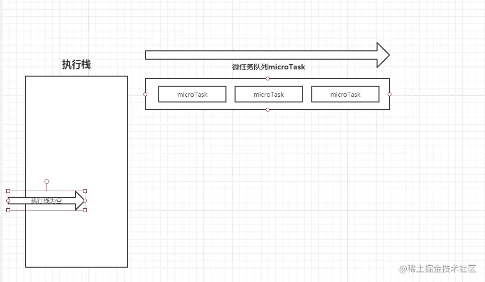*

*执行栈在执行完**同步任务**后，查看**执行栈**是否为空，如果执行栈为空，就会去检查**微任务**(`microTask`)队列是否为空，如果为空的话，就执行`Task`（宏任务），否则就一次性执行完所有微任务。*
 *每次单个**宏任务**执行完毕后，检查**微任务**(`microTask`)队列是否为空，如果不为空的话，会按照**先入先出**的规则全部执行完**微任务**(`microTask`)后，设置**微任务**(`microTask`)队列为`null`，然后再执行**宏任务**，如此循环。*

*总的结论就是，执行**宏任务**，然后执行该宏任务产生的微任务，若微任务在执行过程中产生了**新的微任务**，则继续执行微任务，微任务执行完毕后，再回到**宏任务中**进行下一轮循环。举个例子：*

**

***新版答案**输出为：async2 end => Promise => async1 end => promise1 => promise2 => setTimeout 但是，对于async/await ，我们有个细节还要处理一下。如下：*

***async/await执行顺序***

*我们知道`async`隐式返回 Promise 作为结果的函数,那么可以简单理解为，await后面的函数执行完毕时，await会产生一个微任务(Promise.then是微任务)。但是我们要注意这个微任务产生的时机，**它是执行完await之后，直接跳出async函数，执行其他代码(此处就是协程的运作**，A暂停执行，控制权交给B)。其他代码执行完毕后，再回到async函数去执行剩下的代码，然后把await后面的代码注册到微任务队列当中。我们来看个例子：*

```js
console.log('script start')

async function async1() {
await async2()
console.log('async1 end')
}
async function async2() {
console.log('async2 end')
}
async1()

setTimeout(function() {
console.log('setTimeout')
}, 0)

new Promise(resolve => {
console.log('Promise')
resolve()
})
.then(function() {
console.log('promise1')
})
.then(function() {
console.log('promise2')
})

console.log('script end')
 // 旧版输出如下，但是请继续看完本文下面的注意那里，新版有改动
// script start => async2 end => Promise => script end => promise1 => promise2 => async1 end => setTimeout

```

*分析这段代码：*

- *执行代码，输出`script start`。*
- *执行async1(),会调用async2(),然后输出`async2 end`,此时将会保留async1函数的上下文，然后跳出async1函数。*
- *遇到setTimeout，产生一个宏任务*
- *执行Promise，输出`Promise`。遇到then，产生第一个微任务*
- *继续执行代码，输出`script end`*
- *代码逻辑执行完毕(当前宏任务执行完毕)，开始执行当前宏任务产生的微任务队列，输出`promise1`，该微任务遇到then，产生一个新的微任务*
- *执行产生的微任务，输出`promise2`,当前微任务队列执行完毕。执行权回到async1*
- *执行await,实际上会产生一个promise返回，即*

```js
let promise_ = new Promise((resolve,reject){ resolve(undefined)})
```

*执行完成，执行await后面的语句，输出`async1 end`*

- *最后，执行下一个宏任务，即执行setTimeout，输出`setTimeout`*

***注意***

*新版的chrome浏览器中不是如上打印的，因为chrome优化了,await变得更快了,输出为:*

```js
// script start => async2 end => Promise => script end => async1 end => promise1 => promise2 => setTimeout
```

*可以分2种情况来理解：*

1. *如果await 后面直接跟的为一个变量，比如：await 1；这种情况的话相当于直接把await后面的代码注册为一个微任务，可以简单理解为promise.then(await下面的代码)。然后跳出async1函数，执行其他代码，当遇到promise函数的时候，会注册promise.then()函数到微任务队列，注意此时微任务队列里面已经存在await后面的微任务。所以这种情况会先执行await后面的代码（async1 end），再执行async1函数后面注册的微任务代码(promise1,promise2)。*
2. *如果await后面跟的是一个异步函数的调用，比如上面的代码，将代码改成这样：*

```js
console.log('script start')

async function async1() {
    await async2()
    console.log('async1 end')
}
async function async2() {
    console.log('async2 end')
    return Promise.resolve().then(()=>{
        console.log('async2 end1')
    })
}
async1()

setTimeout(function() {
    console.log('setTimeout')
}, 0)

new Promise(resolve => {
    console.log('Promise')
    resolve()
})
.then(function() {
    console.log('promise1')
})
.then(function() {
    console.log('promise2')
})

console.log('script end')

```

```js
// script start => async2 end => Promise => script end => async2 end1 => promise1 => promise2 => async1 end => setTimeout
```

*此时执行完awit并不先把await后面的代码注册到微任务队列中去，而是执行完await之后，直接跳出async1函数，执行其他代码。然后遇到promise的时候，把promise.then注册为微任务。其他代码执行完毕后，需要回到async1函数去执行剩下的代码，然后把await后面的代码注册到微任务队列当中，注意此时微任务队列中是有之前注册的微任务的。所以这种情况会先执行async1函数之外的微任务(promise1,promise2)，然后才执行async1内注册的微任务(async1 end). 可以理解为，这种情况下，await 后面的代码会在本轮循环的最后被执行. 浏览器中有事件循环，node 中也有，事件循环是 node 处理非阻塞 I/O 操作的机制，node中事件循环的实现是依靠的libuv引擎。由于 node 11 之后，事件循环的一些原理发生了变化，这里就以新的标准去讲，最后再列上变化点让大家了解前因后果。*

### *node 中的事件循环*

***TBC***

*https://juejin.cn/post/6844904079353708557#heading-4*

*https://juejin.cn/post/6844903764202094606#heading-14*


# 为什么 Javascript 是单线程

### 进程 (process) 和线程 (thread)

**进程是 CPU 资源分配的最小单位（是能拥有资源和独立运行的最小单位）。**

**线程是 CPU 调度的最小单位（是建立在进程基础上的一次程序运行单位）。**

现代操作系统都是可以同时运行多个任务的,比如:用浏览器上网的同时还可以听音乐。

**对于操作系统来说,一个任务就是一个进程**,比如打开一个浏览器就是启动了一个浏览器进程,打开一个 Word 就启动了一个 Word 进程。

有些进程同时不止做一件事,比如 Word,它同时可以进行打字、拼写检查、打印等事情。**在一个进程内部,要同时做多件事,就需要同时运行多个“子任务”,我们把进程内的这些“子任务”称为线程**。

### 浏览器的多进程架构

一个好的程序常常被划分为几个相互独立又彼此配合的模块,浏览器也是如此。

以 Chrome 为例,它由多个进程组成,每个进程都有自己核心的职责,它们相互配合完成浏览器的整体功能,

每个进程中又包含多个线程,一个进程内的多个线程也会协同工作,配合完成所在进程的职责。

Chrome 采用多进程架构,其顶层存在一个 Browser process 用以协调浏览器的其它进程。

#### 优点 

由于默认 新开 一个 tab 页面 新建 一个进程,所以单个 tab 页面崩溃不会影响到整个浏览器。

同样,第三方插件崩溃也不会影响到整个浏览器。

多进程可以充分利用现代 CPU 多核的优势。

方便使用沙盒模型隔离插件等进程,提高浏览器的稳定性。

#### 缺点 

系统为浏览器新开的进程分配内存、CPU 等资源,所以内存和 CPU 的资源消耗也会更大。

不过 Chrome 在内存释放方面做的不错,基本内存都是能很快释放掉给其他程序运行的。

## 浏览器的主要进程和职责

#### 主进程 Browser Process 

> 负责浏览器界面的显示与交互。各个页面的管理,创建和销毁其他进程。网络的资源管理、下载等。

#### 第三方插件进程 Plugin Process 

> 每种类型的插件对应一个进程,仅当使用该插件时才创建。

#### GPU 进程 GPU Process 

> 最多只有一个,用于 3D 绘制等

#### 渲染进程 Renderer Process 

> 称为浏览器渲染进程或浏览器内核,内部是多线程的。主要负责页面渲染,脚本执行,事件处理等。 (本文重点分析)

#### 渲染进程 (浏览器内核)

**浏览器的渲染进程是多线程的**,我们来看看它有哪些主要线程 :

*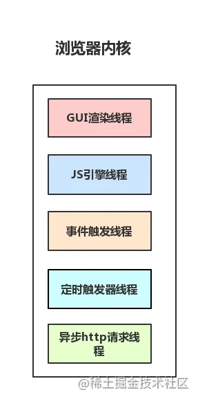*


### *1. GUI 渲染线程* 

- *负责渲染浏览器界面,**解析 HTML,CSS,构建 DOM 树和 RenderObject 树,布局和绘制等**。*
- *当界面需要重绘（Repaint）或由于某种操作引发**回流**(reflow)时,该线程就会执行。*
- *注意**,GUI 渲染线程与 JS 引擎线程是互斥的**,当 JS 引擎执行时 GUI 线程会被挂起（相当于被冻结了）,GUI 更新会被保存在一个队列中等到 JS 引擎空闲时立即被执行。*

### *2. JS 引擎线程* 

- *Javascript 引擎,也称为 JS 内核,负责**处理 Javascript 脚本程序**。（例如 V8 引擎）*
- *JS 引擎线程负责解析 Javascript 脚本,运行代码。*
- *JS 引擎一直等待着任务队列中任务的到来,然后加以处理,一个 Tab 页（renderer 进程）中无论什么时候都只有一个 JS 线程在运行 JS 程序。*
- *注意,GUI 渲染线程与 JS 引擎线程是互斥的,所以如果 JS 执行的时间过长,这样就会造成页面的渲染不连贯,导致页面渲染加载阻塞。*

### *3. 事件触发线程* 

- *归属于浏览器而不是 JS 引擎,用来控制事件循环（可以理解,JS 引擎自己都忙不过来,需要浏览器另开线程协助）*
- *当 JS 引擎执行代码块如 setTimeOut 时（也可来自浏览器内核的其他线程,如鼠标点击、AJAX 异步请求等）,会将对应**任务添加到事件线程**中*
- *当**对应的事件符合触发条件被触发时**,该线程会把**事件添加到待处理队列的队尾,等待 JS 引擎的处理***
- *注意,由于 JS 的单线程关系,所以这些待处理队列中的事件都得排队等待 JS 引擎处理（当 JS 引擎空闲时才会去执行）*

### *4. 定时触发器线程* 

- *传说中的 **setInterval 与 setTimeout 所在线程***
- *浏览器定时计数器并不是由 JavaScript 引擎计数的,（因为 JavaScript 引擎是单线程的, 如果处于阻塞线程状态就会影响记计时的准确）*
- *因此通过**单独线程来计时并触发定时**（计时完毕后,添加到事件队列中,等待 JS 引擎空闲后执行）*
- *注意,W3C 在 HTML 标准中规定,规定要求 setTimeout 中低于 4ms 的时间间隔算为 4ms。*

### *5. 异步 http 请求线程* 

- *在 XMLHttpRequest 在连接后是通过浏览器新开一个线程请求。*
- *将检测到状态变更时,如果设置有回调函数,异步线程就产生状态变更事件,将这个回调再放入事件队列中。再由 JavaScript 引擎执行。*

### 为什么 Javascript 要是单线程的 ? 

首先是历史原因，在创建 javascript 这门语言时，多进程多线程的架构并不流行，硬件支持并不好。

这是因为 Javascript 这门脚本语言诞生的使命所致!JavaScript 为处理页面中用户的交互,以及操作 DOM 树、CSS 样式树来给用户呈现一份动态而丰富的交互体验和服务器逻辑的交互处理。

如果 JavaScript 是多线程的方式来操作这些 UI DOM,则可能出现 **UI 操作的冲突**。

如果 Javascript 是多线程的话,在多线程的交互下,处于 UI 中的 **DOM 节点**就可能成为一个临界资源,

假设存在两个线程同时操作一个 DOM,一个负责修改一个负责删除,那么这个时候就需要浏览器来裁决如何生效哪个线程的执行结果。

当然我们可以通过锁来解决上面的问题。但为了避免因为引入了锁而带来更大的**复杂性**,Javascript 在最初就选择了单线程执行。

### 为什么 JS *阻塞页面加载*（GUI 渲染线程与 JS 引擎线程互斥）

由于 **JavaScript 是可操纵 DOM 的**,如果在修改这些元素属性同时渲染界面（即 JavaScript 线程和 UI 线程同时运行）,那么渲染线程前后获得的元素数据就可能不一致了。

因此为了防止渲染出现不可预期的结果,浏览器设置 **GUI 渲染线程与 JavaScript 引擎为互斥**的关系。

当 JavaScript 引擎执行时 GUI 线程会被挂起,GUI 更新会被保存在一个队列中等到引擎线程空闲时立即被执行。

从上面我们可以推理出,由于 GUI 渲染线程与 JavaScript 执行线程是互斥的关系,

当浏览器在执行 JavaScript 程序的时候,GUI 渲染线程会被保存在一个队列中,直到 JS 程序执行完成,才会接着执行。

因此如果 JS 执行的时间过长,这样就会造成页面的渲染不连贯,导致页面渲染加载阻塞的感觉。

### *css 加载会造成阻塞吗* 

由上面浏览器渲染流程我们可以看出 :

DOM 和 CSSOM 通常是并行构建的,所以 **CSS 加载不会阻塞 DOM 的解析**。

然而,由于 Render Tree 是依赖于 DOM Tree 和 CSSOM Tree 的,

所以他必须等待到 CSSOM Tree 构建完成,也就是 CSS 资源加载完成(或者 CSS 资源加载失败)后,才能开始渲染。

因此,**CSS 加载会阻塞 Dom 的渲染**。

由于 JavaScript 是可操纵 DOM 和 css 样式 的,如果在修改这些元素属性同时渲染界面（即 JavaScript 线程和 UI 线程同时运行）,那么渲染线程前后获得的元素数据就可能不一致了。

因此为了防止渲染出现不可预期的结果,浏览器设置 **GUI 渲染线程与 JavaScript 引擎为互斥**的关系。

因此,样式表会在后面的 js 执行前先加载执行完毕,所以**css 会阻塞后面 js 的执行**。

### DOMContentLoaded 与 load 的区别 

当 DOMContentLoaded 事件触发时,仅当 DOM 解析完成后,不包括样式表,图片。前面提到 **CSS 加载会阻塞 Dom 的渲染和后面 js 的执行,js 会阻塞 Dom 解析**,所以我们可以得到结论:
当**文档中没有脚本时,浏览器解析完文档便能触发 DOMContentLoaded 事件**。如果文档中**包含脚本**,则脚本会阻塞文档的解析,而脚本需要等 CSSOM 构建完成才能执行。在任何情况下,DOMContentLoaded 的触发不需要等待图片等其他资源加载完成。

当 onload 事件触发时,页面上所有的 DOM,样式表,脚本,图片等资源已经加载完毕。

DOMContentLoaded -> load。

### 什么是渲染层合并 (Composite) ?

渲染层合并,对于页面中 DOM 元素的绘制(Paint)是在多个层上进行的。

在每个层上完成绘制过程之后,浏览器会将绘制的位图发送给 GPU 绘制到屏幕上,将所有层按照合理的顺序合并成一个图层,然后在屏幕上呈现。

对于有位置重叠的元素的页面,这个过程尤其重要,因为一旦图层的合并顺序出错,将会导致元素显示异常。

*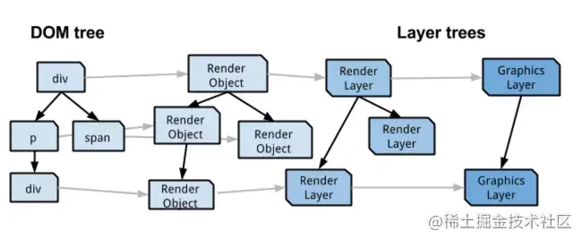*

RenderLayers 渲染层,这是负责对应 DOM 子树。

GraphicsLayers 图形层,这是负责对应 RenderLayers 子树。

RenderObjects 保持了树结构,一个 RenderObjects 知道如何绘制一个 node 的内容, 他通过向一个绘图上下文（GraphicsContext）发出必要的绘制调用来绘制 nodes。

每个 GraphicsLayer 都有一个 GraphicsContext,GraphicsContext 会负责输出该层的位图,位图是存储在共享内存中,作为纹理上传到 GPU 中,最后由 **GPU 将多个位图进行合成**,然后 draw 到屏幕上,此时,我们的页面也就展现到了屏幕上。

GraphicsContext 绘图上下文的责任就是向屏幕进行像素绘制(这个过程是先把像素级的数据写入位图中,然后再显示到显示器),在 chrome 里,绘图上下文是包裹了的 Skia（chrome 自己的 2d 图形绘制库）

某些特殊的渲染层会被认为是合成层（Compositing Layers）,合成层拥有单独的 GraphicsLayer,而其他不是合成层的渲染层,则和其第一个拥有 GraphicsLayer 父层公用一个。

#### 合成层的优点

一旦 renderLayer 提升为了合成层就会有自己的绘图上下文,并且会开启**硬件加速,有利于性能提升**。

- 合成层的位图,**会交由 GPU 合成**,比 CPU 处理要快 (提升到合成层后合成层的位图会交 GPU 处理,但请注意,仅仅只是合成的处理（把绘图上下文的位图输出进行组合）需要用到 GPU,生成合成层的位图处理（绘图上下文的工作）是需要 CPU。)
- 当需要 repaint 时,只需要 repaint 本身,不会影响到其他的层 (当需要 repaint 的时候可以只 repaint 本身,不影响其他层,但是 paint 之前还有 style, layout,那就意味着即使合成层只是 repaint 了自己,但 style 和 layout 本身就很占用时间。)
- 对于 transform 和 opacity 效果,不会触发 layout 和 paint (仅仅是 transform 和 opacity 不会引发 layout 和 paint,其他的属性不确定。)

一般一个元素开启硬件加速后会变成合成层,可以独立于普通文档流中,改动后可以避免整个页面重绘,提升性能。

注意不能滥用 GPU 加速,一定要分析其实际性能表现。因为 GPU 加速创建渲染层是有代价的,每创建一个新的渲染层,就意味着新的内存分配和更复杂的层的管理。并且在移动端 GPU 和 CPU 的带宽有限制,创建的渲染层过多时,合成也会消耗跟多的时间,随之而来的就是耗电更多,内存占用更多。过多的渲染层来带的开销而对页面渲染性能产生的影响,甚至远远超过了它在性能改善上带来的好处。

# 浏览器渲染过程

### 浏览器主要组件结构

*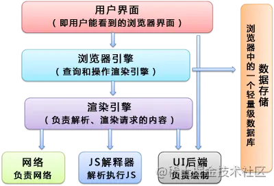*

#### **渲染引擎**

常见的浏览器内核可以分为这四种：Trident（IE）、Gecko（火狐）、Blink（Chrome、Opera）、Webkit（Safari）

### webkit渲染引擎流程

*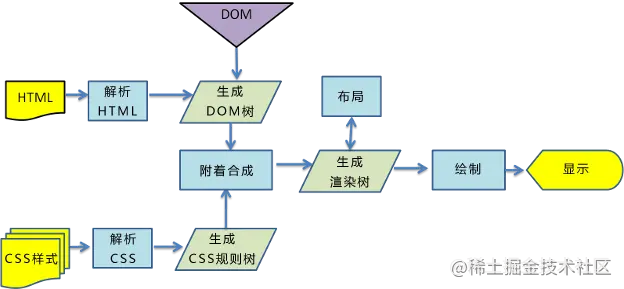*

#### 渲染过程：

**1、解析：**浏览器会解析三个东西

- 一是HTML/SVG/XHTML，HTML字符串描述了一个页面的结构，浏览器会把HTML结构字符串解析转换DOM树形结构。

- 二是CSS，解析CSS会产生CSS规则树，它和DOM结构比较像。
- 三是Javascript脚本，等到Javascript 脚本文件加载后， 通过 DOM API 和 CSSOM API 来操作 DOM树 和 CSS规则树。

**2、构建渲染树**：解析完成后，浏览器引擎会通过DOM树 和 CSS规则树 来构造 渲染树。

- Rendering Tree 渲染树并不等同于DOM树，渲染树只会包括需要显示的节点和这些节点的样式信息。
- CSS 的 Rule Tree主要是为了完成匹配并把CSS Rule附加上Rendering Tree上的每个Element（也就是每个Frame）。
- 然后，计算每个Frame 的位置，这又叫layout和reflow过程。

**3、布局和绘制**

#### 构建DOM树

浏览器会遵守一套步骤将HTML 文件转换为 DOM 树。宏观上，可以分为几个步骤：

**

- 浏览器从磁盘或网络读取HTML的原始字节，并根据文件的指定编码（例如 UTF-8）将它们转换成字符串。

在网络中传输的内容其实都是 0 和 1 这些字节数据。当浏览器接收到这些字节数据以后，它会将这些字节数据转换为字符串，也就是我们写的代码。

- 将字符串转换成Token，例如：`<html>`、`<body>`等。**Token中会标识出当前Token是“开始标签”或是“结束标签”亦或是“文本”等信息**。

节点与节点之间的关系维护由Token要标识“起始标签”和“结束标签”等标识的作用。例如“title”Token的起始标签和结束标签之间的节点肯定是属于“head”的子节点。

- 生成节点对象并构建DOM

事实上，构建DOM的过程中，不是等所有Token都转换完成后再去生成节点对象，而是一边生成Token一边消耗Token来生成节点对象。换句话说，每个Token被生成后，会立刻消耗这个Token创建出节点对象。**注意：带有结束标签标识的Token不会创建节点对象。**

#### 构建CSSOM

DOM会捕获页面的内容，但浏览器还需要知道页面如何展示，所以需要构建CSSOM。

构建CSSOM的过程与构建DOM的过程非常相似，当浏览器接收到一段CSS，浏览器首先要做的是识别出Token，然后构建节点并生成CSSOM。

**

在这一过程中，浏览器会确定下每一个节点的样式到底是什么，并且这一过程其实是很消耗资源的。因为样式你可以自行设置给某个节点，也可以通过继承获得。在这一过程中，浏览器得递归 CSSOM 树，然后确定具体的元素到底是什么样式。

**注意：CSS匹配HTML元素是一个相当复杂和有性能问题的事情。所以，DOM树要小，CSS尽量用id和class，千万不要过渡层叠下去**。

#### 构建渲染树

当我们生成 DOM 树和 CSSOM 树以后，就需要将这两棵树组合为渲染树。

*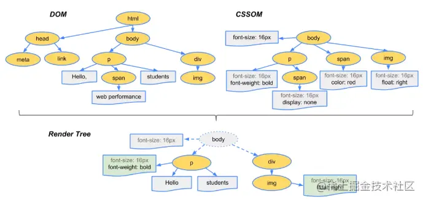*

在这一过程中，不是简单的将两者合并就行了。**渲染树只会包括需要显示的节点和这些节点的样式信息**，如果某个节点是 `display: none` 的，那么就不会在渲染树中显示。

我们或许有个疑惑：**浏览器如果渲染过程中遇到JS文件怎么处理**？

渲染过程中，如果遇到`<script>`就停止渲染，执行 JS 代码。因为浏览器有GUI渲染线程与JS引擎线程，为了防止渲染出现不可预期的结果，这两个线程是互斥的关系。 JavaScript的加载、解析与执行会阻塞DOM的构建，也就是说，在构建DOM时，HTML解析器若遇到了JavaScript，那么它会暂停构建DOM，将控制权移交给JavaScript引擎，等JavaScript引擎运行完毕，浏览器再从中断的地方恢复DOM构建。

也就是说，如果你想首屏渲染的越快，就越不应该在首屏就加载 JS 文件，这也是都建议将 script 标签放在 body 标签底部的原因。当然在当下，并不是说 script 标签必须放在底部，因为你可以给 script 标签添加 defer 或者 async 属性（下文会介绍这两者的区别）。

**JS文件不只是阻塞DOM的构建，它会导致CSSOM也阻塞DOM的构建**。

原本DOM和CSSOM的构建是互不影响，井水不犯河水，但是一旦引入了JavaScript，CSSOM也开始阻塞DOM的构建，只有CSSOM构建完毕后，DOM再恢复DOM构建。

这是什么情况？

这是因为JavaScript不只是可以改DOM，它还可以更改样式，也就是它可以更改CSSOM。因为不完整的CSSOM是无法使用的，如果JavaScript想访问CSSOM并更改它，那么在执行JavaScript时，必须要能拿到完整的CSSOM。所以就导致了一个现象，如果浏览器尚未完成CSSOM的下载和构建，而我们却想在此时运行脚本，那么浏览器将延迟脚本执行和DOM构建，直至其完成CSSOM的下载和构建。也就是说，**在这种情况下，浏览器会先下载和构建CSSOM，然后再执行JavaScript，最后在继续构建DOM**。

*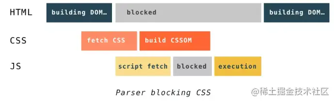*

#### 布局与绘制

当**浏览器生成渲染树以后**，就会根据渲染树来进行**布局**（也可以叫做**回流**）。这一阶段浏览器要做的事情是要弄清楚各个节点在页面中的确切位置和大小。通常这一行为也被称为“自动重排”。

布局流程的输出是一个“盒模型”，它会精确地捕获每个元素在视口内的确切位置和尺寸，所有相对测量值都将转换为屏幕上的绝对像素。

**布局完成后**，浏览器会立即发出“Paint Setup”和“Paint”事件，将**渲染树**转换成屏幕上的像素。

**绘制**（Paint）：遍历渲染树，调用渲染器的 `paint()` 方法在屏幕上绘制出节点内容，本质上是一个像素填充的过程。这个过程也出现于回流或一些不影响布局的 CSS 修改引起的屏幕局部重画，这时候它被称为**重绘**（Repaint）。实际上，**绘制过程是在多个层上完成的**，这些层我们称为**渲染层**（RenderLayer）。

**渲染层合成**（Composite）：多个绘制后的渲染层按照恰当的重叠顺序进行合并，而后生成位图，最终通过显卡展示到屏幕上。


#### *补充*

##### *defer 和 async 属性的区别：*

*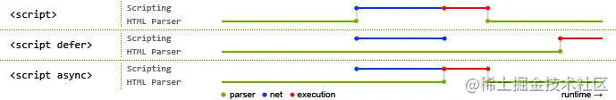*

*其中蓝色线代表JavaScript加载；红色线代表JavaScript执行；绿色线代表 HTML 解析。*

*1）情况1`<script src="script.js"></script>`*

*没有 defer 或 async，浏览器会立即加载并执行指定的脚本，也就是说不等待后续载入的文档元素，读到就加载并执行。*

*2）情况2`<script async src="script.js"></script>`  (**异步下载**)*

*async 属性表示异步执行引入的 JavaScript，与 defer 的区别在于，如果**已经加载好，就会开始执行**——无论此刻是 HTML 解析阶段还是 DOMContentLoaded 触发之后。需要注意的是，这种方式加载的 JavaScript **依然会阻塞 load 事件**。换句话说，async-script 可能在 DOMContentLoaded 触发之前或之后执行，但一定在 load 触发之前执行。*

*3）情况3 `<script defer src="script.js"></script>`(**延迟执行**)*

*defer 属性表示延迟执行引入的 JavaScript，即这段 JavaScript 加载时 HTML 并未停止解析，这两个过程是并行的。整个 **document 解析完毕**且 defer-script 也加载完成之后（这两件事情的顺序无关），才会**执行**所有由 defer-script 加载的 JavaScript 代码，然后触发 DOMContentLoaded 事件。*

*defer 与相比普通 script，有两点区别：**载入 JavaScript 文件时不阻塞 HTML 的解析，执行阶段被放到 HTML 标签解析完成之后。 在加载多个JS脚本的时候，async是无顺序的加载，而defer是有顺序的加载***

##### *为什么操作 DOM 慢*

*把 DOM 和 JavaScript 各自想象成一个岛屿，它们之间用收费桥梁连接。——《高性能 JavaScript》*

*因为 DOM 是属于渲染引擎中的东西，而 JS 又是 JS 引擎中的东西。当我们用 JS 去操作 DOM 时，本质上是 **JS 引擎和渲染引擎之间进行了“跨界交流**”。这个“跨界交流”的实现并不简单，它依赖了桥接接口作为“桥梁”。*

*过“桥”要收费——这个开销本身就是不可忽略的。我们每操作一次 DOM（不管是为了修改还是仅仅为了访问其值），都要过一次“桥”。过“桥”的次数一多，就会产生比较明显的性能问题。因此“减少 DOM 操作”的建议，并非空穴来风。*

##### *回流和重绘*

*渲染的流程基本上是这样（如下图黄色的四个步骤）：1.计算CSS样式 2.构建Render Tree 3.Layout – 定位坐标和大小 4.正式开画*

*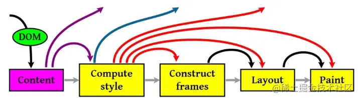*

*注意：上图流程中有很多连接线，这表示了Javascript动态修改了DOM属性或是CSS属性会导致重新Layout，但有些改变不会重新Layout，就是上图中那些指到天上的箭头，比如修改后的CSS rule没有被匹配到元素。*

*这里重要要说两个概念，一个是Reflow，另一个是Repaint*

- *重绘：当我们对 DOM 的修改导致了样式的变化、却**并未影响其几何属性**（比如修改了颜色或背景色）时，浏览器不需重新计算元素的几何属性、**直接为该元素绘制新的样式**（跳过了上图所示的回流环节）。*
- *回流：当我们对 DOM 的修改引发了 **DOM 几何尺寸的变化**（比如修改元素的宽、高或隐藏元素等）时，浏览器需要重新计算元素的几何属性（其他元素的几何属性和位置也会因此受到影响），然后再将计算的结果绘制出来。这个过程就是回流（也叫重排）*

*我们知道，当网页生成的时候，至少会渲染一次。在用户访问的过程中，还会不断重新渲染。重新渲染会重复回流+重绘或者只有重绘。 **回流必定会发生重绘，重绘不一定会引发回流**。重绘和回流会在我们设置节点样式时频繁出现，同时也会很大程度上影响性能。**回流所需的成本比重绘高的多，改变父节点里的子节点很可能会导致父节点的一系列回流。***

*1）常见引起回流属性和方法*

*任何会**改变元素几何信息(元素的位置和尺寸大小)的操作，都会触发回流**，*

- *添加或者删除可见的DOM元素；*
- *元素尺寸改变——边距、填充、边框、宽度和高度*
- *内容变化，比如用户在input框中输入文字*
- *浏览器窗口尺寸改变——resize事件发生时*
- *计算 offsetWidth 和 offsetHeight 属性*
- *设置 style 属性的值*

*2）常见引起重绘属性和方法*


**

*造成回流的属性：*

*width、height、padding、margin、border、position、top、left、bottom、right、float、clear、text-align、vertical-align、line-height、font-weight、font-size、font-family、overflow、white-space*

*造成重绘的属性：*

*color、border-style、border-radius、text-decoration、box-shadow、outline、background*

*3）**如何减少回流、重绘***

***CSS***

- *避免使用 table 布局。*
- *尽可能在 DOM 树的最末端改变 class。*
- *避免设置多层内联样式。*
- *将动画效果应用到 position 属性为 absolute 或 fixed 的元素上。*
- *避免使用 CSS 表达式（例如：calc()）。*

***Javascript***

- *避免频繁操作样式,最好一次性重写 style 属性,或者将样式列表定义为 class 并一次性更改 class 属性。*
- *避免频繁操作 DOM,创建一个 documentFragment,在它上面应用所有 DOM 操作,最后再把它添加到文档中。*
- *也可以先为元素设置 display: none,操作结束后再把它显示出来。因为在 display 属性为 none 的元素上进行的 DOM 操作不会引发回流和重绘。*
- *避免频繁读取会引发回流/重绘的属性,如果确实需要多次使用,就用一个变量缓存起来。*
- *对具有复杂动画的元素使用绝对定位,使它脱离文档流,否则会引起父元素及后续元素频繁回流。*

##### *浏览器渲染性能优化策略*

- *什么是 CRP,即关键渲染路径(Critical Rendering Path)? 如何优化 ?*

  *关键渲染路径是浏览器将 HTML CSS JavaScript 转换为在屏幕上呈现的像素内容所经历的一系列步骤。也就是我们上面说的浏览器渲染流程。*

  *为尽快完成首次渲染,我们需要最大限度减小以下三种可变因素:*

  - *关键资源的数量: 可能阻止网页首次渲染的资源。*
  - *关键路径长度: 获取所有关键资源所需的往返次数或总时间。*
  - *关键字节: 实现网页首次渲染所需的总字节数,等同于所有关键资源传送文件大小的总和。*

  #### *1. 优化 DOM*

  - *删除不必要的代码和注释包括空格,尽量做到最小化文件。*
  - *可以利用 GZIP 压缩文件。*
  - *结合 HTTP 缓存文件。*

  #### *2. 优化 CSSOM*

  *缩小、压缩以及缓存同样重要,对于 **CSSOM** 我们前面重点提过了它会**阻止页面呈现**,因此我们可以从这方面考虑去优化。*

  - *减少关键 CSS 元素数量*
  - *当我们声明样式表时,请密切关注媒体查询的类型,它们极大地影响了 CRP 的性能 。*

  #### *3. 优化 JavaScript*

  *当浏览器遇到 script 标记时,会**阻止解析器继续操作,直到 CSSOM 构建完毕**,JavaScript 才会运行并继续完成 DOM 构建过程。*

  - *async: 当我们在 script 标记添加 async 属性以后,浏览器遇到这个 script 标记时会继续解析 DOM,同时脚本也不会被 CSSOM 阻止,即不会阻止 CRP。*
  - *defer: 与 async 的区别在于,脚本需要等到文档解析后（ DOMContentLoaded 事件前）执行,而 async 允许脚本在文档解析时位于后台运行（两者下载的过程不会阻塞 DOM,但执行会）。*
  - *当我们的脚本不会修改 DOM 或 CSSOM 时,推荐使用 async 。*
  - *预加载 —— preload & prefetch 。*
  - *DNS 预解析 —— dns-prefetch 。*

  #### *总结*

  - *分析并用 **关键资源数 关键字节数 关键路径长度** 来描述我们的 CRP 。*
  - *最小化关键资源数: 消除它们（内联）、推迟它们的下载（defer）或者使它们异步解析（async）等等 。*
  - *优化关键字节数（缩小、压缩）来减少下载时间 。*
  - *优化加载剩余关键资源的顺序: 让关键资源（CSS）尽早下载以减少 CRP 长度 。*


# window.onload 和 DOMContentLoaded 的区别

在js中DOMContentLoaded方法是在**HTML文档**被完全的加载和解析之后才会触发的事件，他并不需要等到（样式表/图像/子框架）加载完成之后再进行。

在看load事件（onload事件），用于检测一个**加载完全**的页面。

### Dom解析过程

1. 解析HTML结构。
2. 加载外部脚本和样式表文件。
3. 解析并执行脚本代码。//js之类的
4. DOM树构建完成。//DOMContentLoaded
5. 加载图片等外部文件。
6. 页面加载完毕。//load
   在第4步的时候`DOMContentLoaded`事件会被触发。
   在第6步的时候`load`事件会被触发。

### 结论

DOMContentLoaded 事件在 **html文档加载完毕，并且 html 所引用的内联 js、以及外链 js 的同步代码都执行完毕后触发**。

当页面 DOM 结构中的 js、css、图片，以及 js **异步加载**的 js、css 、图片**都加载完成**之后，才会触发 load 事件。

注意：

- 页面中引用的js 代码如果有异步加载的 js、css、图片，是会影响 load 事件触发的。
- video、audio、flash 不会影响 load 事件触发。

两者的使用：

```js
//onload
window.onload = function() {
    document.getElementById("bg").style.background="yellow"
}
//DOMContentLoaded
document.addEventListener("DOMContentLoaded", function() {
console.log('DOMContentLoaded回调') // 不兼容老的浏览器，兼容写法见[jQuery中ready与load事件] ，原理看下文
}, false);
```

### 为什么要区分？

开发中我们经常需要给一些元素的事件绑定处理函数。但问题是，如果那个元素还没有加载到页面上，但是绑定事件已经执行完了，是没有效果的。这两个事件大致就是用来避免这样一种情况，将绑定的函数放在这两个事件的回调中，保证能在页面的某些元素加载完毕之后再绑定事件的函数。
当然DOMContentLoaded机制更加合理，因为我们可以容忍图片，flash延迟加载，却不可以容忍看见内容后页面不可交互。

# 跨域

## 同源策略

同源策略/SOP（Same origin policy）是一种约定，由Netscape公司1995年引入浏览器，它是浏览器最核心也最基本的安全功能，如果缺少了同源策略，浏览器很容易受到XSS、CSFR等攻击。所谓同源是指"**协议+域名+端口**"三者相同，即便两个不同的域名指向同一个ip地址，也非同源。

**`XMLHttpRequest` 和 Fetch API遵循同源策略**

**

**同源策略限制内容有：**

- Cookie、LocalStorage、IndexedDB 等存储性内容
- DOM 节点和Js对象无法获得
- AJAX 请求发送后，结果被浏览器拦截了

但是有三个标签是允许跨域加载资源：

- *``*
- *`<link href=XXX>`*
- *`<script src=XXX>`*

> 1、表单默认提交（跳转页面或刷新页面）、超链接访问域外的资源，这是允许的，因为在点击按钮/超链接时，浏览器地址已经变了，这就是一个普通的请求，不属于跨域； 
>
> 2、ajax(借助xmlhttprequest)跨域请求，这是被禁止的，因为ajax就是为了接受接受响应，这违背了，不允许跨域读的原则； 
>
> 3、jsonp属于跨域读且形式限制为GET方式，它利用了script标签的特性；这是允许的。因为浏览器把跨域读脚本，当作例外，类似的img、iframe的src都可以请求域外资源； 
>
> 4、出现Access control allow origin错误，说明是跨域请求失败！浏览器发送请求成功，同时浏览器也接收到响应了，但是限制了XmlHttpRquest接收请求，不会让xmlhttprequest接受到响应，并且在js控制台报错。这也就是我们在网络控制台(Network)能看见http 状态码是200，但是在js控制台(Console)出现js错误的原因。


## **常见跨域场景**

**当协议、子域名、主域名、端口号中任意一个不相同时，都算作不同域**。不同域之间相互请求资源，就算作“跨域”。常见跨域场景如下图所示：

**


特别说明两点：

**第一：如果是协议和端口造成的跨域问题“前台”是无能为力的。**

**第二：在跨域问题上，仅仅是通过“URL的首部”来识别而不会根据域名对应的IP地址是否相同来判断。“URL的首部”可以理解为“协议, 域名和端口必须匹配”**。

这里你或许有个疑问：**请求跨域了，那么请求到底发出去没有？**

**跨域并不是请求发不出去，请求能发出去，服务端能收到请求并正常返回结果，只是结果被浏览器拦截了**。你可能会疑问明明通过表单的方式可以发起跨域请求，为什么 Ajax 就不会?因为归根结底，跨域是为了阻止用户读取到另一个域名下的内容，Ajax 可以获取响应，浏览器认为这不安全，所以拦截了响应。但是表单并不会获取新的内容，所以可以发起跨域请求。同时也说明了跨域并不能完全阻止 CSRF，因为请求毕竟是发出去了。

## 为什么有跨域需求?

A：场景 —— 工程服务化后，不同职责的服务分散在不同的工程中，往往这些工程的域名是不同的，但一个需求可能需要对应到多个服务，这时便需要调用不同服务的接口，因此会出现跨域。

## 跨域解决方案

### 跨域资源共享 CORS

是目前主流的跨域解决方案。

CORS是一个W3C标准，全称是"跨域资源共享"（Cross-origin resource sharing）。

**CORS 需要浏览器和后端同时支持。IE 8 和 9 需要通过 XDomainRequest 来实现**。

浏览器会自动进行 CORS 通信，实现 CORS 通信的关键是后端。只要后端实现了 CORS，就实现了跨域。

服务端设置 **Access-Control-Allow-Origin** 就可以开启 CORS。 **该属性表示哪些域名可以访问资源，如果设置通配符则表示所有网站都可以访问资源。**

虽然设置 CORS 和前端没什么关系，但是通过这种方式解决跨域问题的话，会在发送请求时出现两种情况，分别为**简单请求**和**复杂请求**。

#### 简单请求

只要同时满足以下条件，**就属于简单请求，直接发出CORS请求，不会发送预检请求**

情况一: 使用以下方法(意思就是以下请求以外的都是非简单请求)

- [`GET`](https://link.juejin.cn?target=https%3A%2F%2Fdeveloper.mozilla.org%2Fzh-CN%2Fdocs%2FWeb%2FHTTP%2FMethods%2FGET)
- [`HEAD`](https://link.juejin.cn?target=https%3A%2F%2Fdeveloper.mozilla.org%2Fzh-CN%2Fdocs%2FWeb%2FHTTP%2FMethods%2FHEAD)
- [`POST`](https://link.juejin.cn?target=https%3A%2F%2Fdeveloper.mozilla.org%2Fzh-CN%2Fdocs%2FWeb%2FHTTP%2FMethods%2FPOST)

情况二: 人为设置以下集合外的请求头

- [`Accept`](https://link.juejin.cn?target=https%3A%2F%2Fdeveloper.mozilla.org%2Fzh-CN%2Fdocs%2FWeb%2FHTTP%2FHeaders%2FAccept)
- [`Accept-Language`](https://link.juejin.cn?target=https%3A%2F%2Fdeveloper.mozilla.org%2Fzh-CN%2Fdocs%2FWeb%2FHTTP%2FHeaders%2FAccept-Language)
- [`Content-Language`](https://link.juejin.cn?target=https%3A%2F%2Fdeveloper.mozilla.org%2Fzh-CN%2Fdocs%2FWeb%2FHTTP%2FHeaders%2FContent-Language)
- [`Content-Type`](https://link.juejin.cn?target=https%3A%2F%2Fdeveloper.mozilla.org%2Fzh-CN%2Fdocs%2FWeb%2FHTTP%2FHeaders%2FContent-Type) （需要注意额外的限制）
- `DPR`
- `Downlink`
- `Save-Data`
- `Viewport-Width`
- `Width`

情况三：`Content-Type`的值仅限于下列三者之一：(例如 application/json 为非简单请求)

- `text/plain`
- `multipart/form-data`
- `application/x-www-form-urlencoded`

情况四:

请求中的任意[`XMLHttpRequestUpload`](https://link.juejin.cn?target=https%3A%2F%2Fdeveloper.mozilla.org%2Fzh-CN%2Fdocs%2FWeb%2FAPI%2FXMLHttpRequestUpload) 对象均没有注册任何事件监听器；[`XMLHttpRequestUpload`](https://link.juejin.cn?target=https%3A%2F%2Fdeveloper.mozilla.org%2Fzh-CN%2Fdocs%2FWeb%2FAPI%2FXMLHttpRequestUpload) 对象可以使用 [`XMLHttpRequest.upload`](https://link.juejin.cn?target=https%3A%2F%2Fdeveloper.mozilla.org%2Fzh-CN%2Fdocs%2FWeb%2FAPI%2FXMLHttpRequest%2Fupload) 属性访问。

情况五:

请求中没有使用 [`ReadableStream`](https://link.juejin.cn?target=https%3A%2F%2Fdeveloper.mozilla.org%2Fzh-CN%2Fdocs%2FWeb%2FAPI%2FReadableStream) 对象。

**简单请求的流程**

1. 浏览器直接发送实际请求，浏览器自动在请求header中加上**Origin字段**, 告诉服务器这个请求来自哪个源(请求协议+域名+端口). 服务器接受到请求之后， 会对比这个字段, 无论字段值在不在服务器的许可范围内，都会返回一个正常的HTTP响应。
2. 如果不在服务器的许可范围内，服务器响应头中不会包**含Access-Control-Allow-Origin**字段, 那么浏览器会把获取到的数据拦截，抛出异常。
3. 如果这个源在服务器的许可范围内，服务器的响应头会加上以下字段，浏览器会跟请求头中的`Origin: http://www.study.com`进行对比，如果满足要求，就把数据发送给用户。

```
Access-Control-Allow-Origin:http://ip:port
必需项, 值为请求头中的Origin的值.

Access-Control-Allow-Credentials:true
可选项, 值为boolean, 表示是否允许浏览器发送cookie, 需要在服务器配置.

Access-Control-Expose-Headers:
浏览器可以从跨域请求响应头中获取的字段值, 由服务器配置. 默认可以获取Cache-Control、Content-Language、Content-Type、Expires、Last-Modified、Pragma这六个字段.
```


#### 复杂请求

不符合以上条件的请求就肯定是复杂请求了。 复杂请求的CORS请求，**会在正式通信之前，增加一次HTTP查询请求，称为"预检"请求,**该请求**是 option 方法**的，浏览器先询问服务器，当前网页所在的域名是否在**服务器的许可名单之中**，以及可以使用哪些HTTP动词和 头信息字段。**只有得到肯定答复，浏览器才会发出正式的XMLHttpRequest请求，否则就报错。预检请求可以缓存(缓存时间由服务器定义), 在缓存有效期内再执行CORS请求时无需进行预检请求.**

#### 预检请求

```
预检请求:
a. 预检请求的请求方式为OPTIONs, 表示这个请求是用来询问的。
b. 请求头信息包含以下字段:
    Origin: 请求源.
    Access-Control-Request-Method: cors请求会用到的请求方式.
    Access-Control-Request-Headers: cors请求会额外发送的请求头字段.
c. 服务器收到预检请求后会检查上面的三个字段值以确定是否允许跨域请求, 如果任意一项不完全满足则都不允许进行跨域请求.
d. 预检请求的响应中会包含如下字段:
    Access-Control-Allow-Origin:
    必需项, 值为请求头中的Origin的值.
    Access-Control-Allow-Credentials:
    可选项, 值为boolean, 表示是否允许浏览器发送cookie, 需要在服务器配置.
    Access-Control-Allow-Headers:
    可选项, 允许跨域请求额外发送的header字段, 需要在服务器配置.
    Access-Control-Allow-Methods:
    必需项, 允许跨域请求的请求方式.
    Access-Control-Max-Age:
    必需项, 预检请求的缓存时间.

如果预检请求正常返回, 接下来执行实际请求. 在预检请求缓存有效期内, 再执行跨域请求时无需进行预检请求.
```

#### 为什么要有预检请求

原因有以下几点：

1. 减少复杂跨域请求对服务器的影响（服务器有时候不想理睬跨域请求），比如PUT、DELETE请求可以直接新建或者修改、删除服务器中的资源。预检请求可以防止该情况发生。
2. 减少服务器对于是否跨域的计算量，如果预检请求通过之后，正式请求都不用再次计算。而且一次预检请求通过后，因为具有缓存，之后的每次请求都只会发正式请求。节约了很多服务端的计算量。

#### **前端设置：**

1.）原生ajax

```javascript
// 前端设置是否带cookie
xhr.withCredentials = true;
```

示例代码：

```javascript
var xhr = new XMLHttpRequest(); // IE8/9需用window.XDomainRequest兼容

// 前端设置是否带cookie
xhr.withCredentials = true;

xhr.open('post', 'http://www.domain2.com:8080/login', true);
xhr.setRequestHeader('Content-Type', 'application/x-www-form-urlencoded');
xhr.send('user=admin');

xhr.onreadystatechange = function() {
    if (xhr.readyState == 4 && xhr.status == 200) {
        alert(xhr.responseText);
    }
};
```

2.）jQuery ajax

```javascript
$.ajax({
    ...
   xhrFields: {
       withCredentials: true    // 前端设置是否带cookie
   },
   crossDomain: true,   // 会让请求头中包含跨域的额外信息，但不会含cookie
    ...
});
```

3.）vue框架

a.) axios设置：

```javascript
axios.defaults.withCredentials = true
```

*b.) vue-*resource*设置：*

```javascript
Vue.http.options.credentials = true
```

#### **服务端设置：**

若后端设置成功，前端浏览器控制台则不会出现跨域报错信息，反之，说明没设成功。

1.）Java后台：

```java
/*
 * 导入包：import javax.servlet.http.HttpServletResponse;
 * 接口参数中定义：HttpServletResponse response
 */

// 允许跨域访问的域名：若有端口需写全（协议+域名+端口），若没有端口末尾不用加'/'
response.setHeader("Access-Control-Allow-Origin", "http://www.domain1.com"); 

// 允许前端带认证cookie：启用此项后，上面的域名不能为'*'，必须指定具体的域名，否则浏览器会提示
response.setHeader("Access-Control-Allow-Credentials", "true"); 

// 提示OPTIONS预检时，后端需要设置的两个常用自定义头
response.setHeader("Access-Control-Allow-Headers", "Content-Type,X-Requested-With");
```

2.）Nodejs后台示例：

```javascript
var http = require('http');
var server = http.createServer();
var qs = require('querystring');

server.on('request', function(req, res) {
    var postData = '';

    // 数据块接收中
    req.addListener('data', function(chunk) {
        postData += chunk;
    });

    // 数据接收完毕
    req.addListener('end', function() {
        postData = qs.parse(postData);

        // 跨域后台设置
        res.writeHead(200, {
            'Access-Control-Allow-Credentials': 'true',     // 后端允许发送Cookie
            'Access-Control-Allow-Origin': 'http://www.domain1.com',    // 允许访问的域（协议+域名+端口）
            /* 
             * 此处设置的cookie还是domain2的而非domain1，因为后端也不能跨域写cookie(nginx反向代理可以实现)，
             * 但只要domain2中写入一次cookie认证，后面的跨域接口都能从domain2中获取cookie，从而实现所有的接口都能跨域访问
             */
            'Set-Cookie': 'l=a123456;Path=/;Domain=www.domain2.com;HttpOnly'  // HttpOnly的作用是让js无法读取cookie
        });

        res.write(JSON.stringify(postData));
        res.end();
    });
});

server.listen('8080');
console.log('Server is running at port 8080...');
```

### 跨域请求如何携带cookie?

前端请求时在`request`对象中配置`"withCredentials": true`；

服务端在`response`的`header`中配置`"Access-Control-Allow-Origin", "http://xxx:${port}"`;

服务端在`response`的`header`中配置`"Access-Control-Allow-Credentials", "true"*`

**但是谷歌最新版不一定能行，因为Chrome 80 默认将没有设置SameSite设置为`SameSite=Lax`**

SameSite取值

- *Strict*

```
    Scrict最为严格，完全禁止第三方Cookie，跨站点时，任何情况下都不会发送Cookie
```

- *Lax*

```
Lax规则稍稍放宽，大多数情况也是不发送第三方 Cookie，但是导航到目标网址的 Get 请求除外。
```

- *None*

```
网站可以选择显式关闭SameSite属性，将其设为None。
不过，前提是必须同时设置Secure属性（Cookie 只能通过 HTTPS 协议发送），否则无效
```


解决：**报文里面set-cookie，添加SameSite=None; Secure=true，host需要https**

现在谷歌中Cookie 遵循的是**同站策略**而不是同源策略(服务器和网址只是端口不同是同站但不是同源)，现在区分区分跨站和跨域的，也就是Cross-Site和Cross-Origin跨站必定跨域，而跨域不一定跨站。Cookie的Same-Site属性是根据两个地址是否属于同一个Site来决定是否携带的(针对普通请求)。而对于js发起的请求，还有另外一个限制，就是文章中提到的Credentials，分别对应3个值：omit/same-origin/include
omit就是完全不发送cookie，即使是满足SameSite要求
same-origin同源才发送cookie，同源必定满足SameSite要求
include不同源也可以发送cookie，但需要满足SameSite才可以发送cookie

总结一句话，SameSite是总的框架，超过这个框架，免谈！而在这个框架内，credentials可以根据需要微调。

### **jsonp**

#### 原理

利用 `<script>` 标签没有跨域限制的漏洞，网页可以得到从其他来源动态产生的 JSON 数据。JSONP请求一定需要对方的服务器做支持才可以。

#### JSONP优缺点

JSONP优点是简单兼容性好，可用于解决主流浏览器的跨域数据访问的问题。**缺点是仅支持get方法具有局限性,不安全可能会遭受XSS攻击。**

#### 流程解析

1.前端定义解析函数（例如 jsonpCallback=function(){....}）

2.通过 params 形式包装请求参数，并且声明执行函数(例如 cb=jsonpCallback)

3.后端获取前端声明的执行函数（jsonpCallback），并以带上参数并调用执行函数的方式传递给前端。

**1.）原生实现：**

```xml
 <script>
    var script = document.createElement('script');
    script.type = 'text/javascript';

    // 传参一个回调函数名给后端，方便后端返回时执行这个在前端定义的回调函数
    script.src = 'http://www.domain2.com:8080/login?user=admin&callback=handleCallback';
    document.head.appendChild(script);

    // 回调执行函数
    function handleCallback(res) {
        alert(JSON.stringify(res));
    }
 </script>
```

服务端返回如下（返回时即执行全局函数）：

```javascript
handleCallback({"status": true, "user": "admin"})
```

**2.）jquery ajax：**

```javascript
$.ajax({
    url: 'http://www.domain2.com:8080/login',
    type: 'get',
    dataType: 'jsonp',  // 请求方式为jsonp
    jsonpCallback: "handleCallback",    // 自定义回调函数名
    data: {}
});
```

**3.）vue.js：**

```javascript
this.$http.jsonp('http://www.domain2.com:8080/login', {
    params: {},
    jsonp: 'handleCallback'
}).then((res) => {
    console.log(res); 
})
```

***后端node.js代码示例：***

```javascript
var querystring = require('querystring');
var http = require('http');
var server = http.createServer();

server.on('request', function(req, res) {
    var params = qs.parse(req.url.split('?')[1]);
    var fn = params.callback;

    // jsonp返回设置
    res.writeHead(200, { 'Content-Type': 'text/javascript' });
    res.write(fn + '(' + JSON.stringify(params) + ')');

    res.end();
});

server.listen('8080');
console.log('Server is running at port 8080...');
```

### 正向代理和反向代理

#### 正向代理

正向代理（forward proxy）：是一个位于客户端和目标服务器之间的服务器(代理服务器)，为了从目标服务器取得内容，客户端向代理服务器发送一个请求并指定目标，然后代理服务器向目标服务器转交请求并将获得的内容返回给客户端。

有时候，用户想要访问某国外网站，该网站无法在国内直接访问，但是我们可以访问到一个代理服务器，这个代理服务器可以访问到这个国外网站。这样呢，用户对该国外网站的访问就需要通过代理服务器来转发请求，并且该代理服务器也会将请求的响应再返回给用户。这个上网的过程就是用到了正向代理。


**

**正向代理，其实是"代理服务器"代理了"客户端"，去和"目标服务器"进行交互**

通过正向代理服务器访问目标服务器，目标服务器是不知道真正的客户端是谁的，甚至不知道访问自己的是一个代理（有时候中介也直接冒充租客）。

#### 正向代理的用途

**突破访问限制** 

通过代理服务器，可以突破自身IP访问限制，访问国外网站，教育网等。

**提高访问速度**

通常代理服务器都设置一个较大的硬盘缓冲区，会将部分请求的响应保存到缓冲区中，当其他用户再访问相同的信息时， 则直接由缓冲区中取出信息，传给用户，以提高访问速度。

**隐藏客户端真实IP**

上网者也可以通过这种方法隐藏自己的IP，免受攻击。

#### 反向代理

反向代理（reverse proxy）：是指以代理服务器来接受internet上的连接请求，然后将请求转发给内部网络上的服务器，并将从服务器上得到的结果返回给internet上请求连接的客户端，此时代理服务器对外就表现为一个反向代理服务器。

对于常用的场景，就是我们在Web开发中用到的[负载均衡](https://cloud.tencent.com/product/clb?from=10680)服务器（二房东），客户端（租客）发送请求到负载均衡服务器（二房东）上，负载均衡服务器（二房东）再把请求转发给一台真正的服务器（房东）来执行，再把执行结果返回给客户端（租客）。

**反向代理，其实是"代理服务器"代理了"目标服务器"，去和"客户端"进行交互。**

通过反向代理服务器访问目标服务器时，客户端是不知道真正的目标服务器是谁的，甚至不知道自己访问的是一个代理。

**隐藏服务器真实IP**

使用反向代理，可以对客户端隐藏服务器的IP地址。

**负载均衡**

反向代理服务器可以做负载均衡，根据所有真实服务器的负载情况，将客户端请求分发到不同的真实服务器上。

**提高访问速度**

反向代理服务器可以对于静态内容及短时间内有大量访问请求的动态内容提供缓存服务，提高访问速度。

**提供安全保障**

反向代理服务器可以作为应用层防火墙，为网站提供对基于Web的攻击行为（例如DoS/DDoS）的防护，更容易排查恶意软件等。还可以为后端服务器统一提供加密和SSL加速（如SSL终端代理），提供HTTP访问认证等。

#### **正向代理和反向代理的区别**

虽然正向代理服务器和反向代理服务器所处的位置都是客户端和真实服务器之间，所做的事情也都是把客户端的请求转发给服务器，再把服务器的响应转发给客户端，但是二者之间还是有一定的差异的。

1、**正向代理其实是客户端的代理**，帮助客户端访问其无法访问的服务器资源。**反向代理则是服务器的代理**，帮助服务器做负载均衡，安全防护等。

2、**正向代理一般是客户端架设的**，比如在自己的机器上安装一个代理软件。而**反向代理一般是服务器架设的**，比如在自己的机器集群中部署一个反向代理服务器。

3、**正向代理中，服务器不知道真正的客户端到底是谁**，以为访问自己的就是真实的客户端。而在**反向代理中，客户端不知道真正的服务器是谁**，以为自己访问的就是真实的服务器。

4、正向代理和反向代理的作用和目的不同。**正向代理主要是用来解决访问限制问题。而反向代理则是提供负载均衡、安全防护等作用。二者均能提高访问速度。**


### nginx反向代理

**同源策略是浏览器需要遵循的标准，而如果是服务器向服务器请求就无需遵循同源策略。**

实现思路：通过nginx配置一个代理服务器（域名与domain1相同，端口不同）做跳板机，反向代理访问domain2接口，并且可以顺便修改cookie中domain信息，方便当前域**cookie写入**，实现跨域登录。

nginx需要配置Access-Control-Allow-Origin：

```js
location / {
  add_header Access-Control-Allow-Origin *;
}
```

nginx具体配置：

```nginx
#proxy服务器
server {
    listen       81;
    server_name  www.domain1.com;

    location / {
        proxy_pass   http://www.domain2.com:8080;  #反向代理
        proxy_cookie_domain www.domain2.com www.domain1.com; #修改cookie里域名
        index  index.html index.htm;

        # 当用webpack-dev-server等中间件代理接口访问nignx时，此时无浏览器参与，故没有同源限制，下面的跨域配置可不启用
        add_header Access-Control-Allow-Origin http://www.domain1.com;  #当前端只跨域不带cookie时，可为*
        add_header Access-Control-Allow-Credentials true;
    }
}
```

1.) 前端代码示例：

```javascript
var xhr = new XMLHttpRequest();

// 前端开关：浏览器是否读写cookie
xhr.withCredentials = true;

// 访问nginx中的代理服务器
xhr.open('get', 'http://www.domain1.com:81/?user=admin', true);
xhr.send();
```

2.) Nodejs后台示例：

```javascript
var http = require('http');
var server = http.createServer();
var qs = require('querystring');

server.on('request', function(req, res) {
    var params = qs.parse(req.url.substring(2));

    // 向前台写cookie
    res.writeHead(200, {
        'Set-Cookie': 'l=a123456;Path=/;Domain=www.domain2.com;HttpOnly'   // HttpOnly:脚本无法读取
    });

    res.write(JSON.stringify(params));
    res.end();
});

server.listen('8080');
console.log('Server is running at port 8080...');
```

### Node 正向代理

 代理服务器，需要做以下几个步骤：

- 接受客户端请求 。

- 将请求 转发给服务器。

- 拿到服务器 响应 数据。

- 将 响应 转发给客户端。

  **

##### **1、 非vue框架的跨域（2次跨域）**

利用node + express + http-proxy-middleware搭建一个proxy服务器。

1.）前端代码示例：

```javascript
var xhr = new XMLHttpRequest();

// 前端开关：浏览器是否读写cookie
xhr.withCredentials = true;

// 访问http-proxy-middleware代理服务器
xhr.open('get', 'http://www.domain1.com:3000/login?user=admin', true);
xhr.send();
```

2.）中间件服务器：

```javascript
var express = require('express');
var proxy = require('http-proxy-middleware');
var app = express();

app.use('/', proxy({
    // 代理跨域目标接口
    target: 'http://www.domain2.com:8080',
    changeOrigin: true,

    // 修改响应头信息，实现跨域并允许带cookie
    onProxyRes: function(proxyRes, req, res) {
        res.header('Access-Control-Allow-Origin', 'http://www.domain1.com');
        res.header('Access-Control-Allow-Credentials', 'true');
    },

    // 修改响应信息中的cookie域名
    cookieDomainRewrite: 'www.domain1.com'  // 可以为false，表示不修改
}));

app.listen(3000);
console.log('Proxy server is listen at port 3000...');
```

3.）Nodejs后台同（六：nginx）

##### **2、 vue框架的跨域（1次跨域）**

利用node + webpack + webpack-dev-server代理接口跨域。在开发环境下，由于vue渲染服务和接口代理服务都是webpack-dev-server同一个，所以页面与代理接口之间不再跨域，无须设置headers跨域信息了。

webpack.config.js部分配置：

```javascript
module.exports = {
    entry: {},
    module: {},
    ...
    devServer: {
        historyApiFallback: true,
        proxy: [{
            context: '/login',
            target: 'http://www.domain2.com:8080',  // 代理跨域目标接口
            changeOrigin: true,
            secure: false,  // 当代理某些https服务报错时用
            cookieDomainRewrite: 'www.domain1.com'  // 可以为false，表示不修改
        }],
        noInfo: true
    }
}
```


### websocket

[WebSocket](https://link.juejin.cn?target=http%3A%2F%2Fdev.w3.org%2Fhtml5%2Fwebsockets%2F) 规范定义了一种 API，可在网络浏览器和服务器之间建立“套接字”连接。简单地说：客户端和服务器之间存在持久的连接，而且双方都可以随时开始发送数据。WebSocket和HTTP都是应用层协议，都基于 TCP 协议。但是 **WebSocket 是一种双向通信协议，在建立连接之后，WebSocket 的 server 与 client 都能主动向对方发送或接收数据**。同时，WebSocket 在**建立连接时需要借助 HTTP 协议**，连接建立好了之后 client 与 server 之间的双向通信就与 HTTP 无关了。


这种方式本质**没有使用了 HTTP 的响应头**, 因此也没有跨域的限制，没有什么过多的解释直接上代码吧。

前端部分

```
<script>
  let socket = new WebSocket("ws://localhost:8080");
  socket.onopen = function() {
    socket.send("秋风的笔记");
  };
  socket.onmessage = function(e) {
    console.log(e.data);
  };
</script>
```

**后端部分**

```
const WebSocket = require("ws");
const server = new WebSocket.Server({ port: 8080 });
server.on("connection", function(socket) {
  socket.on("message", function(data) {
    socket.send(data);
  });
});
```

### *postMessage*

*postMessage是HTML5 XMLHttpRequest Level 2中的API，且是为数不多可以跨域操作的window属性之一，它可用于解决以下方面的问题：*

- *页面和其打开的新窗口的数据传递*
- *多窗口之间消息传递*
- *页面与嵌套的iframe消息传递*
- *上面三个场景的跨域数据传递*

*用法：postMessage(data,origin)方法接受两个参数*
*data： html5规范支持任意基本类型或可复制的对象，但部分浏览器只支持字符串，所以传参时最好用JSON.stringify()序列化。*
******origin： 协议+主机+端口号，也可以设置为""，表示可以传递给任意窗口，如果要指定和当前窗口同源的话设置为"/"。*******

*1.）a.html：([http://www.domain1.com/a.html)*](https://link.segmentfault.com/?enc=qfO4%2FTvWaCTNeUoZGy09Mg%3D%3D.B3Iyqh1%2Fuj3ZBe5RnSfAG%2By0hEBPl2cmQejNIpL1v88%3D)

```xml
<iframe id="iframe" src="http://www.domain2.com/b.html" style="display:none;"></iframe>
<script>       
    var iframe = document.getElementById('iframe');
    iframe.onload = function() {
        var data = {
            name: 'aym'
        };
        // 向domain2传送跨域数据
        iframe.contentWindow.postMessage(JSON.stringify(data), 'http://www.domain2.com');
    };

    // 接受domain2返回数据
    window.addEventListener('message', function(e) {
        alert('data from domain2 ---> ' + e.data);
    }, false);
</script>
```

2.）b.html：([http://www.domain2.com/b.html)](https://link.segmentfault.com/?enc=NgvVcJqhNMkwdFiS1BP7SA%3D%3D.5xhax46EXobr%2FNLZ5NTL30CHcb%2BY8heGK4qQv%2FeQn2M%3D)

```xml
<script>
    // 接收domain1的数据
    window.addEventListener('message', function(e) {
        alert('data from domain1 ---> ' + e.data);

        var data = JSON.parse(e.data);
        if (data) {
            data.number = 16;

            // 处理后再发回domain1
            window.parent.postMessage(JSON.stringify(data), 'http://www.domain1.com');
        }
    }, false);
</script>
```

### document.domain + iframe跨域

此方案仅限主域相同，子域不同的跨域应用场景。

实现原理：两个页面都通过js强制设置document.domain为基础主域，就实现了同域。

1.）父窗口：([http://www.domain.com/a.html)](https://link.segmentfault.com/?enc=iPwwacp4CUMLlVz41FTxmg%3D%3D.xbuNMwaxCyMOzZpFWcd3ga9PdboRBV4Frh3EmoudxYM%3D)

```xml
<iframe id="iframe" src="http://child.domain.com/b.html"></iframe>
<script>
    document.domain = 'domain.com';
    var user = 'admin';
</script>
```

2.）子窗口：([http://child.domain.com/b.html)](https://link.segmentfault.com/?enc=2qYXPtOF6YMH83otW6ysWA%3D%3D.tPSi385rqaQYBt3%2BPFk2iUOvqWehlklUVt%2BB9kw%2F01M%3D)

```xml
<script>
    document.domain = 'domain.com';
    // 获取父窗口中变量
    alert('get js data from parent ---> ' + window.parent.user);
</script>
```

### location.hash + iframe跨域

实现原理： a欲与b跨域相互通信，通过中间页c来实现。 三个页面，不同域之间利用iframe的location.hash传值，相同域之间直接js访问来通信。

具体实现：A域：a.html -> B域：b.html -> A域：c.html，a与b不同域只能通过hash值单向通信，b与c也不同域也只能单向通信，但c与a同域，所以c可通过parent.parent访问a页面所有对象。

1.）a.html：([http://www.domain1.com/a.html)](https://link.segmentfault.com/?enc=i0PMzUMp2KCePuXpjdjLxw%3D%3D.M7SmvR1y27RSkz8qvu8c%2B%2FBjt530spu3vZLp6OXVv1Q%3D)

```xml
<iframe id="iframe" src="http://www.domain2.com/b.html" style="display:none;"></iframe>
<script>
    var iframe = document.getElementById('iframe');

    // 向b.html传hash值
    setTimeout(function() {
        iframe.src = iframe.src + '#user=admin';
    }, 1000);
    
    // 开放给同域c.html的回调方法
    function onCallback(res) {
        alert('data from c.html ---> ' + res);
    }
</script>
```

2.）b.html：([http://www.domain2.com/b.html)](https://link.segmentfault.com/?enc=bWIZyY3FRzBVurmC6H8jjw%3D%3D.KTMiYDunTI3qqAlWnetRNyvonrzvV1KfYxAtEoLYisA%3D)

```xml
<iframe id="iframe" src="http://www.domain1.com/c.html" style="display:none;"></iframe>
<script>
    var iframe = document.getElementById('iframe');

    // 监听a.html传来的hash值，再传给c.html
    window.onhashchange = function () {
        iframe.src = iframe.src + location.hash;
    };
</script>
```

3.）c.html：([http://www.domain1.com/c.html)](https://link.segmentfault.com/?enc=ZyQ4FnioLcdoRHM313gexQ%3D%3D.tbts16z%2BRm8vkwTGVKuimd9768hFcH5Xjm%2FvMklPQJU%3D)

```xml
<script>
    // 监听b.html传来的hash值
    window.onhashchange = function () {
        // 再通过操作同域a.html的js回调，将结果传回
        window.parent.parent.onCallback('hello: ' + location.hash.replace('#user=', ''));
    };
</script>
```

### window.name + iframe跨域

window.name属性的独特之处：name值在不同的页面（甚至不同域名）加载后依旧存在，并且可以支持非常长的 name 值（2MB）。

1.）a.html：([http://www.domain1.com/a.html)](https://link.segmentfault.com/?enc=272ab1oBC2FbmWJCspjxkw%3D%3D.ffPEb0Pq5jmfdree8kBZ7iVxKHXWQ3GHh7J2F1Z1JWs%3D)

```javascript
var proxy = function(url, callback) {
    var state = 0;
    var iframe = document.createElement('iframe');

    // 加载跨域页面
    iframe.src = url;

    // onload事件会触发2次，第1次加载跨域页，并留存数据于window.name
    iframe.onload = function() {
        if (state === 1) {
            // 第2次onload(同域proxy页)成功后，读取同域window.name中数据
            callback(iframe.contentWindow.name);
            destoryFrame();

        } else if (state === 0) {
            // 第1次onload(跨域页)成功后，切换到同域代理页面
            iframe.contentWindow.location = 'http://www.domain1.com/proxy.html';
            state = 1;
        }
    };

    document.body.appendChild(iframe);

    // 获取数据以后销毁这个iframe，释放内存；这也保证了安全（不被其他域frame js访问）
    function destoryFrame() {
        iframe.contentWindow.document.write('');
        iframe.contentWindow.close();
        document.body.removeChild(iframe);
    }
};

// 请求跨域b页面数据
proxy('http://www.domain2.com/b.html', function(data){
    alert(data);
});
```

*2.）proxy.html：([http://www.domain1.com/proxy....](https://link.segmentfault.com/?enc=l5FVR%2Ft3LdZg3Qf5lZFGWw%3D%3D.vWICwxT3uCgkmNZi0xlJ%2BobRpuFHpGWT5edOUOfDkYOHKvUxAmPRwMTidu%2Bf061i)
中间代理页，与a.html同域，内容为空即可。

3.）b.html：([http://www.domain2.com/b.html)](https://link.segmentfault.com/?enc=FoDZd3vVlbkbTlJhozEOnw%3D%3D.334o9Llwnop5k05uVvXvcaWHWbX%2F0YE3ra3PgHAjgss%3D)

```xml
<script>
    window.name = 'This is domain2 data!';
</script>
```

总结：通过iframe的src属性由外域转向本地域，跨域数据即由iframe的window.name从外域传递到本地域。这个就巧妙地绕过了浏览器的跨域访问限制，但同时它又是安全操作。

### 为什么服务端不会存在跨域

因为服务端没有域名，所以也不存在跨域。
跨域本质是服务器的信任问题，因为数据都存在服务器，所以服务器的安全性需要保障，如何保障安全性，就在于有个机制让服务器判断是否应该信任请求方，那首先就是标识请求方，前端页面可以用域名标识，后端和客户端没有域名，可以有其他的方式解决信任问题，比如access_token等。

### 总结

简单的跨域请求jsonp即可，复杂的cors，窗口之间JS跨域postMessage，开发环境下接口跨域用nginx反向代理或node中间件比较方便。

跨域的解决方案思路两种，躲避绕过去和cors；
各种iframe方式可传递数据，但组织和控制代码逻辑太复杂，鸡肋；
jsonp前几年使用，现在浏览器兼容性高了，以及受限于仅get方式，逐步淘汰了；
nginx反向代理是绕过去的方式，是从古至今通吃的没完解决方案，缺点也许是服务器压力大一点，实际中那点压力根本不是大问题；同时反向代理更适合内部应用间访问和共享；
cors才是真正的称得上跨域请求解决方案，因为请求存在跨域，结果是拿到了数据，也就是说服务器和浏览器之间进行了协商通信控制后，才得以允许或拒绝；

# XHR，ajax，axios，fetch之间的区别

## 原生xhr对象

现代浏览器，最开始与服务器交换数据，都是通过XMLHttpRequest对象。它可以使用JSON、XML、HTML和text文本等格式发送和接收数据。
它给我们带来了很多好处。

1. **不重新加载页面**的情况下更新网页
2. 在页面已加载后从服务器请求/接收数据
3. 在后台向服务器发送数据。

但是，它也有一些缺点：

1. 使用起来也比较**繁琐**，需要设置很多值。
2. 早期的IE浏览器有自己的实现，这样需要写兼容代码。

```javascript
if (window.XMLHttpRequest) { // model browser
  xhr = new XMLHttpRequest()
} else if (window.ActiveXObject) { // IE 6 and older
  xhr = new ActiveXObject('Microsoft.XMLHTTP')
}
xhr.open('POST', url, true)
xhr.send(data)
xhr.onreadystatechange = function () {
  try {
    // TODO 处理响应
    if (xhr.readyState === XMLHttpRequest.DONE) {
      // XMLHttpRequest.DONE 对应值是 4
      // Everything is good, the response was received.
      if (xhr.status === 200) {
        // Perfect!
      } else {
        // There was a problem with the request.
        // For example, the response may hava a 404 (Not Found)
        // or 500 (Internal Server Error) response code.
      }
    } else {
      // Not ready yet
    }
  } catch (e) {
    // 通信错误的事件中（例如服务器宕机）
    alert('Caught Exception: ' + e.description)
  }
}
```

## jQuery ajax

**AJAX，它的全称是：Asynchronous JavaScript And XML，翻译过来就是“异步的 Javascript 和 XML”。是一个技术统称，是一个概念模型，它囊括了很多技术，并不特指某一技术，它很重要的特性之一就是让页面实现局部刷新。**

jQuery ajax，是jQuery对XMLHttpRequest对象的封装。它里面的AJAX请求也兼容了各浏览器，可以有简单易用的方法$.get，$.post。

```js
$.ajax({
  type: 'POST',
  url: url, 
  data: data,
  dataType: dataType,
  success: function () {},
  error: function () {}
})

```

优点

1. 对原生XHR的封装，做了兼容处理，简化了使用。
2. 增加了对JSONP的支持，可以简单处理部分跨域。

缺点：

1. 如果有多个请求，并且有依赖关系的话，容易形成回调地狱。
2. 本身是针对MVC的编程，不符合现在前端MVVM的浪潮。

## axios

Axios是一个**基于promise的HTTP库**，可以用在浏览器和 node.js 中。它本质**也是对原生XMLHttpRequest的封装**，只不过它是**Promise的实现版本**，符合最新的ES规范。

```js
axios({
    method: 'post',
    url: '/user/12345',
    data: {
      firstName: 'liu',
      lastName: 'weiqin'
    }
  })
  .then(res => console.log(res))
  .catch(err => console.log(err))
```

优点：

1. 从浏览器中创建XMLHttpRequests

2. 从 node.js 创建 http 请求
3. 支持 Promise API
4. 拦截请求和响应
5. 转换请求数据和响应数据
6. 取消请求
7. 自动转换 JSON 数据
8. 客户端支持防御 XSRF

缺点：

1. 只持现代代浏览器.

## fetch

Fetch API提供了一个 JavaScript 接口，用于访问和操作HTTP管道的部分，例如请求和响应。它还提供了一个全局fetch()方法，该方法提供了一种简单，合理的方式来跨网络异步获取资源。
fetch是**低层次的API**，代替XHR，可以轻松处理各种格式，非文本化格式。可以很容易的被其他技术使用，例如Service Workers。但是想要很好的使用fetch，**需要做一些封装处理**。

```js
fetch('http://example.com/movies.json')
  .then(function(response) {
    return response.json();
  })
  .then(function(myJson) {
    console.log(myJson);
  });
```

优势：跨域的处理
在配置中，添加mode： 'no-cors'就可以跨域了

```js
fetch('/users.json', {
    method: 'post', 
    mode: 'no-cors',
    data: {}
}).then(function() { /* handle response */ });
```


fetch目前遇到的问题：

1. fetch只对网络请求报错，对400，500都当做成功的请求，需要封装去处理
2. fetch默认不会带cookie，需要添加配置项。
3. fetch不支持abort，不支持超时控制，使用setTimeout及Promise.reject的实现超时控制并不能阻止请求过程继续在后台运行，造成了流量的浪费。
4. fetch没有办法原生监测请求的进度，而XHR可以。


# ES6专区

### *[ECMAScript 6 入门阮一峰](https://es6.ruanyifeng.com/)*

## const、let和var的区别

见上

## **箭头函数**

#### 基本语法

ES6 增加了箭头函数：

```
let func = value => value;
```

相当于：

```
let func = function (value) {
    return value;
};
```

如果需要给函数传入多个参数：

```
let func = (value, num) => value * num;
```

如果函数的代码块需要多条语句：

```
let func = (value, num) => {
    return value * num
};
```

如果需要直接返回一个对象：

```
let func = (value, num) => ({total: value * num});
```

与变量解构结合：

```
let func = ({value, num}) => ({total: value * num})

// 使用
var result = func({
    value: 10,
    num: 10
})

console.log(result); // {total: 100}
```

很多时候，你可能想不到要这样用，所以再来举个例子，比如在 React 与 Immutable 的技术选型中，我们处理一个事件会这样做：

```
handleEvent = () => {
  this.setState({
    data: this.state.data.set("key", "value")
  })
};
```

其实就可以简化为：

```
handleEvent = () => {
  this.setState(({data}) => ({
    data: data.set("key", "value")
  }))
};
```

#### 比较

箭头函数与普通函数，主要区别包括：

**1.没有 this**

**箭头函数没有 this，所以需要通过查找作用域链来确定 this 的值。**

在某些情况下可以通过这个特性来巧妙的绑定this到想要的对象上。

**因为箭头函数没有 this，所以也不能用 call()、apply()、bind() 这些方法改变 this 的指向**，可以看一个例子：

```
var value = 1;
var result = (() => this.value).bind({value: 2})();
console.log(result); // 
```

**2. 没有 arguments**

箭头函数没有自己的 arguments 对象，这不一定是件坏事，因为箭头函数可以访问外围函数的 arguments 对象：

```
function constant() {
    return () => arguments[0]
}

var result = constant(1);
console.log(result()); // 1
```

那如果我们就是要访问箭头函数的参数呢？

你可以通过命名参数或者 rest 参数的形式访问参数:

```
let nums = (...nums) => nums;
```

**3. 不能通过 new 关键字调用**

JavaScript 函数有两个内部方法：[[Call]] 和 [[Construct]]。

当通过 new 调用函数时，执行 [[Construct]] 方法，创建一个实例对象，然后再执行函数体，将 this 绑定到实例上。

当直接调用的时候，执行 [[Call]] 方法，直接执行函数体。

箭头函数并没有 [[Construct]] 方法，不能被用作构造函数，如果通过 new 的方式调用，会报错。

```
var Foo = () => {};
var foo = new Foo(); // TypeError: Foo is not a constructor
```

**4. 没有 new.target**

因为不能使用 new 调用，所以也没有 new.target 值。

**5. 没有原型**

由于不能使用 new 调用箭头函数，所以也没有构建原型的需求，于是箭头函数也不存在 prototype 这个属性。

```
var Foo = () => {};
console.log(Foo.prototype); // undefined
```

**6. 没有 super**

连原型都没有，自然也不能通过 super 来访问原型的属性，所以箭头函数也是没有 super 的，不过跟 this、arguments、new.target 一样，这些值由外围最近一层非箭头函数决定。

**7.不可以使用yield命令，因此箭头函数不能用作 Generator 函数**

## *字符串扩展*

#### *新增方法*

*`ES6`在`String`原型上新增了`includes`方法，用于取代传统的`indexOf`方法。`includes`可直接返回`true`或者`false`，使语义更清晰，更加明确。此外还新增了`startsWith()`、`endWith()`、`padWidth()`、`padEnd()`、`repeat()`等方法，可方便的用于查找，补全字符串。*

#### *模板字符串*

*优点：方便字符串拼接；可以折行*


## *函数扩展*

#### *函数参数默认值* 

*ES6 之前，不能直接为函数的参数指定默认值，只能采用变通的方法。*

*ES6 允许为函数的参数设置默认值，即直接写在参数定义的后面。*

*参数变量是默认声明的，所以不能用`let`或`const`再次声明。*

*使用参数默认值时，函数不能有同名参数。*

```javascript
// 不报错
function foo(x, x, y) {
  // ...
}

// 报错
function foo(x, x, y = 1) {
  // ...
}
```

*另外，一个容易忽略的地方是，参数默认值不是传值的，而是每次都重新计算默认值表达式的值。也就是说，参数默认值是惰性求值的。*

```javascript
let x = 99;
function foo(p = x + 1) {
  console.log(p);
}

foo() // 100

x = 100;
foo() // 101
```

*上面代码中，参数`p`的默认值是`x + 1`。这时，每次调用函数`foo()`，都会重新计算`x + 1`，而不是默认`p`等于 100。*


#### *rest 参数*

*ES6 引入 rest 参数（形式为`...变量名`），用于获取函数的多余参数，这样就不需要使用`arguments`对象了。**rest 参数搭配的变量是一个数组，该变量将多余的参数放入数组中**。*

```javascript
function add(...values) {
  let sum = 0;

  for (var val of values) {
    sum += val;
  }

  return sum;
}

add(2, 5, 3) // 10
```

#### *箭头函数*

*如上*


## *数组的扩展*

#### *扩展运算符*

*扩展运算符（spread）是三个点（`...`）。它好比 rest 参数的逆运算，将**一个数组转为用逗号分隔的参数序列**。*

```javascript
console.log(...[1, 2, 3])
// 1 2 3

console.log(1, ...[2, 3, 4], 5)
// 1 2 3 4 5

[...document.querySelectorAll('div')]
// [<div>, <div>, <div>]
```

*该运算符主要用于函数调用。*

```javascript
function push(array, ...items) {
  array.push(...items);
}

function add(x, y) {
  return x + y;
}

const numbers = [4, 38];
add(...numbers) // 42
```

*上面代码中，`array.push(...items)`和`add(...numbers)`这两行，都是函数的调用，它们都使用了扩展运算符。该运算符将一个数组，变为参数序列。*

*扩展运算符与正常的函数参数可以结合使用，非常灵活。*

```javascript
function f(v, w, x, y, z) { }
const args = [0, 1];
f(-1, ...args, 2, ...[3]);
```

***扩展运算符后面还可以放置表达式。***

```javascript
const arr = [
  ...(x > 0 ? ['a'] : []),
  'b',
];
```

*如果扩展运算符后面是一个空数组，则不产生任何效果。*

```javascript
[...[], 1]
// [1]
```

*注意，**只有函数调用时，扩展运算符才可以放在圆括号中，否则会报错。***

```javascript
(...[1, 2])
// Uncaught SyntaxError: Unexpected number

console.log((...[1, 2]))
// Uncaught SyntaxError: Unexpected number

console.log(...[1, 2])
// 1 2
```

*上面三种情况，扩展运算符都放在圆括号里面，但是前两种情况会报错，因为扩展运算符所在的括号不是函数调用。*

***实现了 Iterator 接口的对象***

*任何定义了遍历器（Iterator）接口的对象（参阅 Iterator 一章），都可以用扩展运算符转为真正的数组。比如**Map 和 Set 结构，Generator 函数***

#### *Array.from()*

*`Array.from()`方法用于将两类对象转为真正的数组：类似数组的对象（array-like object）和可遍历（**iterable**）的对象（包括 ES6 新增的数据结构 Set 和 Map）。*

*下面是一个类似数组的对象，`Array.from()`将它转为真正的数组。*

```javascript
let arrayLike = {
    '0': 'a',
    '1': 'b',
    '2': 'c',
    length: 3
};

// ES5 的写法
var arr1 = [].slice.call(arrayLike); // ['a', 'b', 'c']

// ES6 的写法
let arr2 = Array.from(arrayLike); // ['a', 'b', 'c']
```

*实际应用中，常见的类似数组的对象是 DOM 操作返回的 NodeList 集合，以及函数内部的`arguments`对象。`Array.from()`都可以将它们转为真正的数组。*

```javascript
// NodeList 对象
let ps = document.querySelectorAll('p');
Array.from(ps).filter(p => {
  return p.textContent.length > 100;
});

// arguments 对象
function foo() {
  var args = Array.from(arguments);
  // ...
}
```

*上面代码中，`querySelectorAll()`方法返回的是一个类似数组的对象，可以将这个对象转为真正的数组，再使用`filter()`方法。*

*只要是部署了 Iterator 接口的数据结构，`Array.from()`都能将其转为数组。*

#### *Array.of()*

*`Array.of()`方法用于将一组值，转换为数组。*

```javascript
Array.of(3, 11, 8) // [3,11,8]
Array.of(3) // [3]
Array.of(3).length // 1
```

#### *新增方法*

*新增了`find`方法，用于取代传统的`indexOf`,此外还新增了`copyWithin()`, `includes()`, `fill()`,`flat()`等方法，可方便的用于数组的查找、补全、转换等。*

***flat()，flatMap()***

*数组的成员有时还是数组，`Array.prototype.flat()`用于将嵌套的数组“拉平”，变成一维的数组。该方法返回一个新数组，对原数据没有影响。*

```javascript
[1, 2, [3, 4]].flat()
// [1, 2, 3, 4]
```

*上面代码中，原数组的成员里面有一个数组，`flat()`方法将子数组的成员取出来，添加在原来的位置。*

*`flat()`默认只会“拉平”一层，如果想要“拉平”多层的嵌套数组，可以将`flat()`方法的参数写成一个整数，表示想要拉平的层数，默认为1。*

```javascript
[1, 2, [3, [4, 5]]].flat()
// [1, 2, 3, [4, 5]]

[1, 2, [3, [4, 5]]].flat(2)
// [1, 2, 3, 4, 5]
```

*上面代码中，`flat()`的参数为2，表示要“拉平”两层的嵌套数组。*

*如果不管有多少层嵌套，都要转成一维数组，可以用`Infinity`关键字作为参数。*

```javascript
[1, [2, [3]]].flat(Infinity)
// [1, 2, 3]
```

*如果原数组有空位，`flat()`方法会跳过空位。*

```javascript
[1, 2, , 4, 5].flat()
// [1, 2, 4, 5]
```

*`flatMap()`方法对原数组的每个成员执行一个函数（相当于执行`Array.prototype.map()`），然后对返回值组成的数组执行`flat()`方法。该方法返回一个新数组，不改变原数组。*

```javascript
// 相当于 [[2, 4], [3, 6], [4, 8]].flat()
[2, 3, 4].flatMap((x) => [x, x * 2])
// [2, 4, 3, 6, 4, 8]
```

*`flatMap()`只能展开一层数组。*

```javascript
// 相当于 [[[2]], [[4]], [[6]], [[8]]].flat()
[1, 2, 3, 4].flatMap(x => [[x * 2]])
// [[2], [4], [6], [8]]
```

*上面代码中，遍历函数返回的是一个双层的数组，但是默认只能展开一层，因此`flatMap()`返回的还是一个嵌套数组。*

*`flatMap()`方法的参数是一个遍历函数，该函数可以接受三个参数，分别是当前数组成员、当前数组成员的位置（从零开始）、原数组。*

```javascript
arr.flatMap(function callback(currentValue[, index[, array]]) {
  // ...
}[, thisArg])
```

*`flatMap()`方法还可以有第二个参数，用来绑定遍历函数里面的`this`。*


## *数值的扩展*

#### ***Number.isFinite(), Number.isNaN()***

*ES6 在`Number`对象上，新提供了`Number.isFinite()`和`Number.isNaN()`两个方法。*

*`Number.isFinite()`用来检查一个数值是否为有限的（finite），即不是`Infinity`。*

```javascript
Number.isFinite(15); // true
Number.isFinite(0.8); // true
Number.isFinite(NaN); // false
Number.isFinite(Infinity); // false
Number.isFinite(-Infinity); // false
Number.isFinite('foo'); // false
Number.isFinite('15'); // false
Number.isFinite(true); // false
```

*注意，如果参数类型不是数值，`Number.isFinite`一律返回`false`。*

*`Number.isNaN()`用来检查一个值是否为`NaN`。*

```javascript
Number.isNaN(NaN) // true
Number.isNaN(15) // false
Number.isNaN('15') // false
Number.isNaN(true) // false
Number.isNaN(9/NaN) // true
Number.isNaN('true' / 0) // true
Number.isNaN('true' / 'true') // true
```

*如果参数类型不是`NaN`，`Number.isNaN`一律返回`false`。*

#### ***`Math`对象***

*上新增了`Math.cbrt()`，`trunc()`，`hypot()`等等较多的科学计数法运算方法，可以更加全面的进行立方根、求和立方根等等科学计算*

***BigInt 数据类型***

*JavaScript 所有数字都保存成 64 位浮点数，这给数值的表示带来了两大限制。一是数值的精度只能到 53 个二进制位（相当于 16 个十进制位），大于这个范围的整数，JavaScript 是无法精确表示，这使得 JavaScript 不适合进行科学和金融方面的精确计算。二是大于或等于2的1024次方的数值，JavaScript 无法表示，会返回`Infinity`。*

*[ES2020](https://github.com/tc39/proposal-bigint) 引入了一种新的数据类型 BigInt（大整数），来解决这个问题，这是 ECMAScript 的第八种数据类型。BigInt 只用来表示整数，没有位数的限制，任何位数的整数都可以精确表示。*

***转换规则***

*可以使用`Boolean()`、`Number()`和`String()`这三个方法，将 BigInt 可以转为布尔值、数值和字符串类型。*

***数学运算***

*数学运算方面，BigInt 类型的`+`、`-`、`*`和`**`这四个二元运算符，与 Number 类型的行为一致。除法运算`/`会舍去小数部分，返回一个整数。*


#### ***数值分隔符***

*欧美语言中，较长的数值允许每三位添加一个分隔符（通常是一个逗号），增加数值的可读性。比如，`1000`可以写作`1,000`。*

*[ES2021](https://github.com/tc39/proposal-numeric-separator)，允许 JavaScript 的数值使用下划线（`_`）作为分隔符。*


## *对象的扩展*

*`ES6`直接以**变量形式声明对象属性或方法**，比传统的键值对方式更加简洁更加方便*

*ES6 允许在大括号里面，直接写入变量和函数，作为对象的属性和方法。这样的书写更加简洁。*

```javascript
const foo = 'bar';
const baz = {foo};
baz // {foo: "bar"}

// 等同于
const baz = {foo: foo};
```

*上面代码中，变量`foo`直接写在大括号里面。这时，属性名就是变量名, 属性值就是变量值。下面是另一个例子。*

```javascript
function f(x, y) {
  return {x, y};
}

// 等同于

function f(x, y) {
  return {x: x, y: y};
}

f(1, 2) // Object {x: 1, y: 2}
```

*除了属性简写，方法也可以简写。*

```javascript
const o = {
  method() {
    return "Hello!";
  }
};

// 等同于

const o = {
  method: function() {
    return "Hello!";
  }
};
```

*对象的**解构赋值***

*对象的**扩展运算符***

#### *对象方法*

1. *super关键字，`ES6`在`class`新增了类似`this`的关键词`super`。同`this`当前函数所在的对象不同，`super`总是指向当前函数所在对象的原型对象*
2. *`ES6`在`Object`原型上新增了`is`方法，做两个目标对象的相等比较。用来完善===方法，'==='方法中`NaN === NaN //false` 其实是不合理的，`Object.is`修复了这个小bug。*
3. *`ES6`在`Object`原型上新增了`assign()`方法，**用于对象新增属性或者多个对象合并**。*
4. *`ES6`在`Object`原型上新增了`getOwnPropertyDescriptors()`方法，此方法增强了`ES5`中`getOwnPropertyDescriptor()`方法，可以获取指定对象所有自身属性的描述对象。结合`defineProperties()`方法，可以完美复制对象，包括复制`get`和`set`属性*
5.  *`ES6`在`Object`原型上新增了`getPrototypeOf()`和`setPrototypeOf()`方法，用来获取或设置当前对象的`prototype`对象。这个方法存在的意义在于，`ES5`中获取设置`prototype`对像是通过`__proto__`属性来实现的，然而`__proto__`属性并不是`ES`规范中的明文规定的属性，只是浏览器各大产商“私自”加上去的属性，只不过因为适用范围广而被默认使用了，再非浏览器环境中并不一定就可以使用，所以为了稳妥起见，获取或设置当前对象的`prototype`对象时，都应该采用`ES6`新增的标准用法。*
6. *`ES6`在`Object`原型上还新增了`Object.keys()`，`Object.values()`，`Object.entries()`方法，用来获取对象的所有键、所有值和所有键值对数组*


## *Symbol*

*ES6 引入了一种新的原始数据类型`Symbol`，表示独一无二的值。它属于 JavaScript 语言的数据类型之一，其他数据类型是：`undefined`、`null`、布尔值（Boolean）、字符串（String）、数值（Number）、大整数（BigInt）、对象（Object）*

*Symbol 值通过`Symbol()`函数生成。这就是说，**对象的属性名**现在可以有两种类型，一种是原来就有的字符串，另一种就是新增的 Symbol 类型。凡是属性名属于 Symbol 类型，就都是独一无二的，可以保证不会与其他属性名产生冲突。*

```javascript
let s = Symbol();

typeof s
// "symbol"
```

*对象中`Symbol()`属性不能被`for...in`遍历，但是也不是私有属性*


## *Proxy*

*Proxy`是`ES6新增的一个构造函数，可以理解为JS语言的一个代理，用来**改变JS默认的一些语言行为**，包括拦截默认的`get/set`等底层方法，使得JS的使用自由度更高，可以最大限度的满足开发者的需求。比如通过拦截对象的`get/set`方法，可以轻松地定制自己想要的`key`或者`value`。下面的例子可以看到，随便定义一个`myOwnObj`的`key`,都可以变成自己想要的函数*

*下面是 Proxy 支持的拦截操作一览，一共 13 种。*

- ***get(target, propKey, receiver)**：拦截对象属性的读取，比如`proxy.foo`和`proxy['foo']`。*
- ***set(target, propKey, value, receiver)**：拦截对象属性的设置，比如`proxy.foo = v`或`proxy['foo'] = v`，返回一个布尔值。*
- ***has(target, propKey)**：拦截`propKey in proxy`的操作，返回一个布尔值。*
- ***deleteProperty(target, propKey)**：拦截`delete proxy[propKey]`的操作，返回一个布尔值。*
- ***ownKeys(target)**：拦截`Object.getOwnPropertyNames(proxy)`、`Object.getOwnPropertySymbols(proxy)`、`Object.keys(proxy)`、`for...in`循环，返回一个数组。该方法返回目标对象所有自身的属性的属性名，而`Object.keys()`的返回结果仅包括目标对象自身的可遍历属性。*
- ***getOwnPropertyDescriptor(target, propKey)**：拦截`Object.getOwnPropertyDescriptor(proxy, propKey)`，返回属性的描述对象。*
- ***defineProperty(target, propKey, propDesc)**：拦截`Object.defineProperty(proxy, propKey, propDesc）`、`Object.defineProperties(proxy, propDescs)`，返回一个布尔值。*
- ***preventExtensions(target)**：拦截`Object.preventExtensions(proxy)`，返回一个布尔值。*
- ***getPrototypeOf(target)**：拦截`Object.getPrototypeOf(proxy)`，返回一个对象。*
- ***isExtensible(target)**：拦截`Object.isExtensible(proxy)`，返回一个布尔值。*
- ***setPrototypeOf(target, proto)**：拦截`Object.setPrototypeOf(proxy, proto)`，返回一个布尔值。如果目标对象是函数，那么还有两种额外操作可以拦截。*
- ***apply(target, object, args)**：拦截 Proxy 实例作为函数调用的操作，比如`proxy(...args)`、`proxy.call(object, ...args)`、`proxy.apply(...)`。*
- ***construct(target, args)**：拦截 Proxy 实例作为构造函数调用的操作，比如`new proxy(...args)`。*

## *Promise*

*如上*


## *Reflect*

*Reflect`是`ES6`引入的一个新的对象，他的主要作用有两点，一是将原生的一些零散分布在`Object`、`Function`或者全局函数里的方法(如`apply`、`delete`、`get`、`set`等等)，统一整合到`Reflect`上，这样可以更加方便更加统一的管理一些原生`API`。其次就是因为`Proxy`可以改写默认的原生API，如果一旦原生`API`别改写可能就找不到了，所以`Reflect`也可以起到备份原生API的作用，使得即使原生`API`被改写了之后，也可以在被改写之后的`API`用上默认的`API*

*`Reflect`对象一共有 13 个静态方法。*

- *Reflect.apply(target, thisArg, args)*
- *Reflect.construct(target, args)*
- *Reflect.get(target, name, receiver)*
- *Reflect.set(target, name, value, receiver)*
- *Reflect.defineProperty(target, name, desc)*
- *Reflect.deleteProperty(target, name)*
- *Reflect.has(target, name)*
- *Reflect.ownKeys(target)*
- *Reflect.isExtensible(target)*
- *Reflect.preventExtensions(target)*
- *Reflect.getOwnPropertyDescriptor(target, name)*
- *Reflect.getPrototypeOf(target)*
- *Reflect.setPrototypeOf(target, prototype)*

*上面这些方法的作用，大部分与`Object`对象的同名方法的作用都是相同的，而且它与`Proxy`对象的方法是一一对应的。*


## Set、Map、WeakSet、WeakMap

### Set

> ES6 提供了新的数据结构 Set（集合）。

`Set`本身是一个构造函数，用来生成 Set 数据结构。

`Set` 对象允许你存储任何类型的唯一值，无论是**基本类型**或者是**对象引用**。

`Set`对象是**值的集合**，实现了 iterator接口，所以可以使用**扩展运算符**和`for…of…`进行遍历，你可以按照**插入的顺序**迭代它的元素。

Set中的元素只会**出现一次**，即 Set 中的元素是唯一的。

#### 属性和方法

##### 属性

Set 结构的实例有以下属性。

- `Set.prototype.constructor`：构造函数，默认就是`Set`函数。
- `Set.prototype.size`：返回`Set`实例的成员总数。

##### 操作方法

Set 实例的方法分为两大类：操作方法（用于操作数据）和遍历方法（用于遍历成员）。下面先介绍四个操作方法。

- `Set.prototype.add(value)`：添加某个值，返回 Set 结构本身。
- `Set.prototype.delete(value)`：删除某个值，返回一个布尔值，表示删除是否成功。
- `Set.prototype.has(value)`：返回一个布尔值，表示该值是否为`Set`的成员。
- `Set.prototype.clear()`：清除所有成员，没有返回值。

##### 遍历操作

Set 结构的实例有四个遍历方法，可以用于遍历成员。

- `Set.prototype.keys()`：返回**键名**的遍历器
- `Set.prototype.values()`：返回**键值**的遍历器
- `Set.prototype.entries()`：返回**键值对**的遍历器
- `Set.prototype.forEach()`：使用回调函数遍历每个成员

需要特别指出的是，`Set`的遍历顺序就是**插入顺序**。这个特性有时非常有用，比如使用 Set 保存一个回调函数列表，调用时就能保证按照添加顺序调用。 **（1）`keys()`，`values()`，`entries()`**

`keys`方法、`values`方法、`entries`方法返回的都是遍历器对象。由于 Set 结构没有键名，**只有键值（或者说键名和键值是同一个值）** ，所以`keys`方法和`values`方法的行为完全一致。

```js
let set = new Set(['red', 'green', 'blue']);

for (let item of set.keys()) {
  console.log(item);
}
// red
// green
// blue

for (let item of set.values()) {
  console.log(item);
}
// red
// green
// blue

for (let item of set.entries()) {
  console.log(item);
}
// ["red", "red"]
// ["green", "green"]
// ["blue", "blue"]
```

上面代码中，`entries`方法返回的遍历器，同时包括键名和键值，所以每次输出一个数组，它的两个成员完全相等。

Set 结构的实例默认可遍历，它的默认遍历器生成函数就是它的`values`方法。

```js
Set.prototype[Symbol.iterator] === Set.prototype.values
// true
```

这意味着，可以省略`values`方法，直接用`for...of`循环遍历 Set。

```js
let set = new Set(['red', 'green', 'blue']);

for (let x of set) {
  console.log(x);
}
// red
// green
// blue
```

**（2）`forEach()`**

Set 结构的实例与数组一样，也拥有`forEach`方法，用于对每个成员执行某种操作，没有返回值。

```js
let set = new Set([1, 4, 9]);
set.forEach((value, key) => console.log(key + ' : ' + value))
// 1 : 1
// 4 : 4
// 9 : 9
```

上面代码说明，`forEach`方法的参数就是一个处理函数。该函数的参数与数组的`forEach`一致，依次为键值、键名、集合本身（上例省略了该参数）。这里需要注意，Set 结构的键名就是键值（两者是同一个值），因此第一个参数与第二个参数的值永远都是一样的。

另外，`forEach`方法还可以有第二个参数，表示绑定处理函数内部的`this`对象。

**（3）遍历的应用**

扩展运算符（`...`）内部使用`for...of`循环，所以也可以用于 Set 结构。

```js
let set = new Set(['red', 'green', 'blue']);
let arr = [...set];
// ['red', 'green', 'blue']
```

而且，数组的`map`和`filter`方法也可以**间接**用于 Set 了。

```js
let set = new Set([1, 2, 3]);
set = new Set([...set].map(x => x * 2));
// 返回Set结构：{2, 4, 6}

let set = new Set([1, 2, 3, 4, 5]);
set = new Set([...set].filter(x => (x % 2) == 0));
// 返回Set结构：{2, 4}
```

#### Set应用

##### 去重

> 数组去重

`Set`函数可以接受一个数组（或者具有 `iterable` 接口的其他数据结构）作为参数，用来初始化。

```js
/**
 * set 集合
 * 成员的值都是唯一的
 */
const unique = arr =>{
    const res = new Set(arr);
    //通过扩展运算符拆分再放入数组中
    return [...res];
}
```

`Array.from`方法可以将 Set 结构转为数组。

```js
const items = new Set([1, 2, 3, 4, 5]);
const array = Array.from(items);
```

这就提供了**去除数组重复成员的另一种方法**。

```js
function dedupe(array) {
  return Array.from(new Set(array));
}

dedupe([1, 1, 2, 3]) // [1, 2, 3]
```

> 去除字符串里面的重复字符

```js
[...new Set('ababbc')].join('')
// "abc"
```

注：`NaN`和`undefined`也可以存储在Set中。所有`NaN`值都是相等的(即NaN被认为与NaN相同，即使`NaN !== NaN`)。

##### 并集（Union）、交集（Intersect）和差集（Difference）。

```js
let a = new Set([1, 2, 3]);
let b = new Set([4, 3, 2]);

// 并集
let union = new Set([...a, ...b]);
// Set {1, 2, 3, 4}

// 交集
let intersect = new Set([...a].filter(x => b.has(x)));
// set {2, 3}

// （a 相对于 b 的）差集
let difference = new Set([...a].filter(x => !b.has(x)));
// Set {1}
复制代码
```

### WeakSet

和Set结构类似，也是不重复的值的集合，但WeakSet的成员**只能是对象。**

其次，WeakSet 中的对象都是**弱引用**，即垃圾回收机制不考虑 WeakSet 对该对象的引用，也就是说，**如果其他对象都不再引用该对象，那么垃圾回收机制会自动回收该对象所占用的内存，不考虑该对象还存在于 WeakSet 之中。**

这是因为垃圾回收机制根据对象的可达性（reachability）来判断回收，如果对象还能被访问到，垃圾回收机制就不会释放这块内存。结束使用该值之后，有时会忘记取消引用，导致内存无法释放，进而可能会引发内存泄漏。WeakSet 里面的引用，都不计入垃圾回收机制，所以就不存在这个问题。因此，**WeakSet 适合临时存放一组对象，以及存放跟对象绑定的信息。只要这些对象在外部消失，它在 WeakSet 里面的引用就会自动消失。**

由于上面这个特点，WeakSet 的成员是不适合引用的，因为它会随时消失。另外，由于 WeakSet 内部有多少个成员，取决于垃圾回收机制有没有运行，运行前后很可能成员个数是不一样的，而垃圾回收机制何时运行是不可预测的，因此 **ES6 规定 WeakSet 不可遍历。**

```js
let obj1 ={name:"leslie1"};
let obj2 ={name:"leslie2"};
let ws = new WeakSet();
let s = new Set();
ws.add(obj1);
s.add(obj2)
console.log(ws);
console.log(s);
```

[](https://link.juejin.cn/?target=https%3A%2F%2Fimgtu.com%2Fi%2FHY66a9)

```js
let obj1 ={name:"leslie1"};
let obj2 ={name:"leslie2"};
let ws = new WeakSet();
let s = new Set();
ws.add(obj1);
s.add(obj2)
// console.log(ws);
// console.log(s);
obj1=null;
obj2=null;
console.log(ws);
console.log(s);
```

[](https://link.juejin.cn/?target=https%3A%2F%2Fimgtu.com%2Fi%2FHY6rb4)

作为构造函数，**WeakSet 可以接受一个数组或类似数组的对象作为参数**。（实际上，任何具有 Iterable 接口的对象，都可以作为 WeakSet 的参数。）**该数组的所有成员**，都会自动成为 WeakSet 实例对象的成员。**数组的成员只能是对象**。

#### 实例方法

- `WeakSet.prototype.add(value)`

  向`WeakSet`对象追加`value`。返回带有附加值的`WeakSet`对象。

- `WeakSet.prototype.delete(value)`

  移除与该`value`关联的元素，并返回一个布尔值，判断元素是否被成功移除。`WeakSet.prototype.has(value)`之后将返回`false`。

- `WeakSet.prototype.has(value)`

  返回一个布尔值，断言对象中是否存在具有给定值的元素`WeakSet`。

**注意：WeakSet没有size属性，因为它不可遍历/迭代。**

**WeakSet 不能遍历，是因为成员都是弱引用，随时可能消失，遍历机制无法保证成员的存在，很可能刚刚遍历结束，成员就取不到了。**

#### WeakSet 应用场景

JavaScript垃圾回收是一种内存管理技术。在这种技术中，不再被引用的对象会被自动删除，而与其相关的资源也会被一同回收。

Map和Set中对象的引用都是强类型化的，并不会允许垃圾回收。这样一来，如果Map和Set中引用了不再需要的大型对象，如已经从DOM树中删除的DOM元素，那么其回收代价是昂贵的。

为了解决这个问题，ES6还引入了另外两种新的数据结构，即称为WeakMap和WeakSet的弱集合。这些集合之所以是“**弱的**”，是因为它们允许从内存中清除不再需要的被这些集合所引用的对象。

使用场景：**储存 DOM 节点，而不用担心这些节点从文档移除时，会引发内存泄漏**。

```html
<div id="wrap">
    <buttton id="btn1">确认1</buttton>
    <buttton id="btn2">确认2</buttton>
    <buttton id="btn">确认</buttton>
</div>
<script>
    let wrap = document.getElementById('wrap');
    let btn1 = document.getElementById('btn1');
    let btn2 = document.getElementById('btn2');
    const ws = new WeakSet();
    ws.add(btn2);
    console.log(ws)    
</script>
```

[](https://link.juejin.cn/?target=https%3A%2F%2Fimgtu.com%2Fi%2FHY6c5R)

注意：**浏览器的垃圾回收可能不是立刻执行**。

### Map

**`Map`** 对象保存键值对，并且能够记住键的原始插入顺序。任何值(对象或者基础类型) 都可以作为一个键或一个值。

> 描述

一个Map对象在迭代时会根据对象中元素的**插入顺序**来进行 — 一个 [`for...of`](https://link.juejin.cn/?target=https%3A%2F%2Fdeveloper.mozilla.org%2Fzh-CN%2Fdocs%2FWeb%2FJavaScript%2FReference%2FStatements%2Ffor...of) 循环在每次迭代后会返回一个形式为`[key，value]`的数组。

> 键的相等(Key equality)

- 键的比较是基于 `sameValueZero` 算法：
- [`NaN`](https://link.juejin.cn/?target=https%3A%2F%2Fdeveloper.mozilla.org%2Fzh-CN%2Fdocs%2FWeb%2FJavaScript%2FReference%2FGlobal_Objects%2FNaN) 是与 `NaN` 相等的（虽然 `NaN !== NaN`），剩下所有其它的值是根据 `===` 运算符的结果判断是否相等。
- 在目前的ECMAScript规范中，`-0`和`+0`被认为是相等的，尽管这在早期的草案中并不是这样。

#### Objects 和 maps 的比较

[`Objects`](https://link.juejin.cn/?target=https%3A%2F%2Fdeveloper.mozilla.org%2Fzh-CN%2Fdocs%2FWeb%2FJavaScript%2FReference%2FGlobal_Objects%2FObject) 和 `Maps` 类似的是，**它们都允许你按键存取一个值、删除键、检测一个键是否绑定了值**。因此（并且也没有其他内建的替代方式了）过去我们一直都把对象当成 `Maps` 使用。不过 `Maps` 和 `Objects` 有一些重要的区别，在下列情况里使用 `Map` 会是更好的选择：

| Map      | Object                                                       |                                                              |
| -------- | ------------------------------------------------------------ | ------------------------------------------------------------ |
| 意外的键 | `Map` 默认情况不包含任何键。只包含显式插入的键。             | 一个 `Object` 有一个原型, **原型链上的键名有可能和你自己在对象上的设置的键名产生冲突**。**注意:** 虽然 ES5 开始可以用 `Object.create(null)` 来创建一个没有原型的对象，但是这种用法不太常见。 |
| 键的类型 | 一个 `Map`的键可以是**任意值**，包括函数、对象或任意基本类型。 | 一个`Object` 的键必须是一个 [`String`](https://link.juejin.cn/?target=https%3A%2F%2Fdeveloper.mozilla.org%2Fzh-CN%2Fdocs%2FWeb%2FJavaScript%2FReference%2FGlobal_Objects%2FString) 或是[`Symbol`](https://link.juejin.cn/?target=https%3A%2F%2Fdeveloper.mozilla.org%2Fzh-CN%2Fdocs%2FWeb%2FJavaScript%2FReference%2FGlobal_Objects%2FSymbol)。 |
| 键的顺序 | `Map` 中的 key 是**有序**的。因此，当迭代的时候，一个 `Map` 对象以**插入**的顺序返回键值。 | 一个 `Object` 的键是**无序**的。注意：自ECMAScript 2015规范以来，对象确实保留了字符串和Symbol键的创建顺序； 因此，在**只有字符串键的对象**上进行迭代将按插入顺序产生键。 |
| Size     | `Map` 的键值对个数可以轻易地通过[`size`](https://link.juejin.cn/?target=https%3A%2F%2Fdeveloper.mozilla.org%2Fzh-CN%2Fdocs%2FWeb%2FJavaScript%2FReference%2FGlobal_Objects%2FMap%2Fsize) 属性获取 | `Object` 的键值对个数只能手动计算                            |
| 迭代     | `Map` 是 iterable的，所以可以直接被迭代。                    | 迭代一个`Object`需要以某种方式获取它的键然后才能迭代。       |
| 性能     | 在**频繁增删键值对**的场景下表现更好。                       | 在频繁添加和删除键值对的场景下未作出优化。                   |

#### 实例的属性和操作方法

Map 结构的实例有以下属性和操作方法。

**（1）size 属性**

`size`属性返回 Map 结构的成员总数。

**（2）Map.prototype.set(key, value)**

`set`方法设置键名`key`对应的键值为`value`，然后返回整个 Map 结构。如果`key`已经有值，则键值会被更新，否则就新生成该键。

`set`方法返回的是当前的`Map`对象，因此可以采用链式写法。

```js
let map = new Map()
  .set(1, 'a')
  .set(2, 'b')
  .set(3, 'c');
复制代码
```

**（3）Map.prototype.get(key)**

`get`方法读取`key`对应的键值，如果找不到`key`，返回`undefined`。

**（4）Map.prototype.has(key)**

`has`方法返回一个布尔值，表示某个键是否在当前 Map 对象之中。

**（5）Map.prototype.delete(key)**

`delete`方法删除某个键，返回`true`。如果删除失败，返回`false`。

**（6）Map.prototype.clear()**

`clear`方法清除所有成员，没有返回值。

#### 遍历方法

Map 结构原生提供三个遍历器生成函数和一个遍历方法。

- `Map.prototype.keys()`：返回**键名**的遍历器。
- `Map.prototype.values()`：返回**键值**的遍历器。
- `Map.prototype.entries()`：返回**所有成员**的遍历器。
- `Map.prototype.forEach()`：遍历 Map 的所有成员。

需要特别注意的是，Map 的遍历顺序就是**插入**顺序。

Map 结构转为数组结构，比较快速的方法是使用扩展运算符（`...`）。

结合数组的`map`方法、`filter`方法，可以实现 Map 的遍历和过滤（Map 本身没有`map`和`filter`方法）。

```js
const map0 = new Map()
  .set(1, 'a')
  .set(2, 'b')
  .set(3, 'c');

const map1 = new Map(
  [...map0].filter(([k, v]) => k < 3)
);
// 产生 Map 结构 {1 => 'a', 2 => 'b'}

const map2 = new Map(
  [...map0].map(([k, v]) => [k * 2, '_' + v])
    );
// 产生 Map 结构 {2 => '_a', 4 => '_b', 6 => '_c'}
```

此外，Map 还有一个`forEach`方法，与数组的`forEach`方法类似，也可以实现遍历。

```js
map.forEach(function(value, key, map) {
  console.log("Key: %s, Value: %s", key, value);
});
```

`forEach`方法还可以接受第二个参数，用来绑定`this`。

```js
const reporter = {
  report: function(key, value) {
    console.log("Key: %s, Value: %s", key, value);
  }
};

map.forEach(function(value, key, map) {
  this.report(key, value);
}, reporter);
```

上面代码中，`forEach`方法的回调函数的`this`，就指向`reporter`。

### WeakMap

#### 含义

`WeakMap`结构与`Map`结构类似，也是用于生成键值对的集合。

`WeakMap`与`Map`的区别有两点。

首先，`WeakMap`**只接受对象**作为键名（`null`除外），不接受其他类型的值作为键名。

其次，`WeakMap`的**键名**所指向的对象，不计入垃圾回收机制。

`WeakMap`的设计目的在于，有时我们想在某个对象上面存放一些数据，但是这会形成对于这个对象的引用。请看下面的例子。

```js
const e1 = document.getElementById('foo');
const e2 = document.getElementById('bar');
const arr = [
  [e1, 'foo 元素'],
  [e2, 'bar 元素'],
];
```

上面代码中，`e1`和`e2`是两个对象，我们通过`arr`数组对这两个对象添加一些文字说明。这就形成了`arr`对`e1`和`e2`的引用。

一旦不再需要这两个对象，我们就必须手动删除这个引用，否则垃圾回收机制就不会释放`e1`和`e2`占用的内存。

```js
// 不需要 e1 和 e2 的时候
// 必须手动删除引用
arr [0] = null;
arr [1] = null;
```

上面这样的写法显然很不方便。一旦忘了写，就会造成内存泄露。

WeakMap 就是为了解决这个问题而诞生的，它的键名所引用的对象都是弱引用，即垃圾回收机制不将该引用考虑在内。因此，**只要所引用的对象的其他引用都被清除，垃圾回收机制就会释放该对象所占用的内存。也就是说，一旦不再需要，WeakMap 里面的键名对象和所对应的键值对会自动消失，不用手动删除引用。**

基本上，如果你要往对象上添加数据，又不想干扰垃圾回收机制，就可以使用 WeakMap。一个典型应用场景是，在网页的 DOM 元素上添加数据，就可以使用`WeakMap`结构。当该 DOM 元素被清除，其所对应的`WeakMap`记录就会自动被移除。

```js
const wm = new WeakMap();

const element = document.getElementById('example');

wm.set(element, 'some information');
wm.get(element) // "some information"
```

上面代码中，先新建一个 WeakMap 实例。然后，将一个 DOM 节点作为键名存入该实例，并将一些附加信息作为键值，一起存放在 WeakMap 里面。这时，WeakMap 里面对`element`的引用就是弱引用，不会被计入垃圾回收机制。

也就是说，上面的 DOM 节点对象除了 WeakMap 的弱引用外，其他位置对该对象的引用一旦消除，该对象占用的内存就会被垃圾回收机制释放。WeakMap 保存的这个键值对，也会自动消失。

总之，`WeakMap`的专用场合就是，它的键所对应的对象，可能会在将来消失。`WeakMap`结构有助于防止内存泄漏。

注意，WeakMap **弱引用的只是键名**，而不是键值。键值依然是正常引用。

```html
<div id="wrap">
    <buttton id="btn1">确认1</buttton>
    <buttton id="btn2">确认2</buttton>
    <buttton id="btn">确认</buttton>
</div>
<script>
    let wrap = document.getElementById('wrap');
    let btn1 = document.getElementById('btn1');
    let btn2 = document.getElementById('btn2');
    const wm = new WeakMap();
    wm.set(btn2, 'some information');
    wm.get(btn2) // "some information"
    console.log(wm.get(btn2))    
</script>
```

[](https://link.juejin.cn/?target=https%3A%2F%2Fimgtu.com%2Fi%2FHY62P1)

注意：**WeakMap的键所对应的对象在垃圾回收时可能不是立刻执行的**。

#### 语法

WeakMap 与 Map 在 API 上的区别主要是两个，一是**没有遍历操作**（即没有`keys()`、`values()`和`entries()`方法），也没有`size`属性。因为没有办法列出所有键名，某个键名是否存在完全不可预测，跟**垃圾回收机制是否运行相关**。这一刻可以取到键名，下一刻垃圾回收机制突然运行了，这个键名就没了，为了防止出现不确定性，就统一规定不能取到键名。二是**无法清空**，即不支持`clear`方法。因此，`WeakMap`只有四个方法可用：`get()`、`set()`、`has()`、`delete()`。

#### 用途

##### DOM 节点作为键名

前文说过，WeakMap 应用的典型场合就是 DOM 节点作为键名。下面是一个例子。

```js
let myWeakmap = new WeakMap();

myWeakmap.set(
  document.getElementById('logo'),
  {timesClicked: 0})
;

document.getElementById('logo').addEventListener('click', function() {
  let logoData = myWeakmap.get(document.getElementById('logo'));
  logoData.timesClicked++;
}, false);
复制代码
```

上面代码中，`document.getElementById('logo')`是一个 DOM 节点，每当发生`click`事件，就更新一下状态。我们将这个状态作为键值放在 WeakMap 里，对应的键名就是这个节点对象。一旦这个 DOM 节点删除，该状态就会自动消失，不存在内存泄漏风险。

##### 部署私有属性

WeakMap 的另一个用处是**部署私有属性**。

```js
const _counter = new WeakMap();
const _action = new WeakMap();

class Countdown {
  constructor(counter, action) {
    _counter.set(this, counter);
    _action.set(this, action);
  }
  dec() {
    let counter = _counter.get(this);
    if (counter < 1) return;
    counter--;
    _counter.set(this, counter);
    if (counter === 0) {
      _action.get(this)();
    }
  }
}

const c = new Countdown(2, () => console.log('DONE'));

c.dec()
c.dec()
// DONE
```

上面代码中，`Countdown`类的两个内部属性`_counter`和`_action`，是实例的弱引用，所以如果删除实例，它们也就随之消失，不会造成内存泄漏。

### 针对深拷贝循环引用的问题

以下是一个**循环引用**（circular reference）的对象：

```js
const foo = { name: 'Frankie' }
foo.bar = foo
```

使用**WeakMap**解决

首先，Map 的键属于强引用，而 WeakMap 的键则属于弱引用。且 WeakMap 的键必须是对象，WeakMap 的值则是任意的。

由于它们的键与值的引用关系，决定了 Map 不能确保其引用的对象不会被垃圾回收器回收的引用。假设我们使用的 Map，那么 `foo` 对象和我们深拷贝内部的 `const map = new Map()` 创建的 `map` 对象一直都是强引用关系，那么在程序结束之前，`foo` 不会被回收，其占用的内存空间一直不会被释放。

相比之下，原生的 WeakMap 持有的是每个键对象的“弱引用”，这意味着在没有其他引用存在时**垃圾回收能正确进行**。原生 WeakMap 的结构是特殊且有效的，其用于映射的 key 只有在其没有被回收时才是有效的。

基本上，如果你要往对象上添加数据，又不想干扰垃圾回收机制，就可以使用 WeakMap。

## *Iterator*

*JavaScript 原有的表示“集合”的数据结构，主要是数组（`Array`）和对象（`Object`），ES6 又添加了`Map`和`Set`。这样就有了四种数据集合，用户还可以组合使用它们，定义自己的数据结构，比如数组的成员是`Map`，`Map`的成员是对象。这样就需要一种统一的接口机制，来处理所有不同的数据结构。*

*遍历器（Iterator）就是这样一种机制。它是一种接口，为各种不同的数据结构提供统一的访问机制。任何数据结构只要部署 Iterator 接口，就可以完成遍历操作（即依次处理该数据结构的所有成员）。*

*Iterator 的作用有三个：一是为各种数据结构，提供一个统一的、简便的访问接口；二是使得数据结构的成员能够按某种次序排列；三是 ES6 创造了一种新的遍历命令`for...of`循环，Iterator 接口主要供`for...of`消费。*

*Iterator 的遍历过程是这样的。*

*（1）创建一个指针对象，指向当前数据结构的起始位置。也就是说，遍历器对象本质上，就是一个指针对象。*

*（2）第一次调用指针对象的`next`方法，可以将指针指向数据结构的第一个成员。*

*（3）第二次调用指针对象的`next`方法，指针就指向数据结构的第二个成员。*

*（4）不断调用指针对象的`next`方法，直到它指向数据结构的结束位置。*

*每一次调用`next`方法，都会返回数据结构的当前成员的信息。具体来说，就是返回一个包含`value`和`done`两个属性的对象。其中，`value`属性是当前成员的值，`done`属性是一个布尔值，表示遍历是否结束。*

*iterator和for of*

*Iterator 接口的目的，就是为所有数据结构，提供了一种统一的访问机制，即`for...of`循环（详见下文）。当使用`for...of`循环遍历某种数据结构时，该循环会自动去寻找 Iterator 接口。*

*一种数据结构只要部署了 Iterator 接口，我们就称这种数据结构是“可遍历的”（iterable）。*

*ES6 规定，默认的 Iterator 接口部署在数据结构的`Symbol.iterator`属性，或者说，一个数据结构只要具有`Symbol.iterator`属性，就可以认为是“可遍历的”（iterable）。`Symbol.iterator`属性本身是一个函数，就是当前数据结构默认的遍历器生成函数。执行这个函数，就会返回一个遍历器。至于属性名`Symbol.iterator`，它是一个表达式，返回`Symbol`对象的`iterator`属性，这是一个预定义好的、类型为 Symbol 的特殊值，所以要放在方括号内（参见《Symbol》一章）。*

```javascript
const obj = {
  [Symbol.iterator] : function () {
    return {
      next: function () {
        return {
          value: 1,
          done: true
        };
      }
    };
  }
};
```

*上面代码中，对象`obj`是可遍历的（iterable），因为具有`Symbol.iterator`属性。执行这个属性，会返回一个遍历器对象。该对象的根本特征就是具有`next`方法。每次调用`next`方法，都会返回一个代表当前成员的信息对象，具有`value`和`done`两个属性。*

*ES6 的有些数据结构原生具备 Iterator 接口（比如数组），即不用任何处理，就可以被`for...of`循环遍历。原因在于，这些数据结构原生部署了`Symbol.iterator`属性（详见下文），另外一些数据结构没有（比如对象）。凡是部署了`Symbol.iterator`属性的数据结构，就称为部署了遍历器接口。调用这个接口，就会返回一个遍历器对象。*

*原生具备 Iterator 接口的数据结构如下。*

- *Array*
- *Map*
- *Set*
- *String*
- *TypedArray*
- *函数的 arguments 对象*
- *NodeList 对象*


## Generator

如上

### *async函数*

> *`async`函数可以理解为内置自动执行器的`Generator`函数语法糖，它配合`ES6`的`Promise`近乎完美的实现了异步编程解决方案*

### async/await以及对Generator的优势

async await 是用来解决异步的，是Generator函数的语法糖
使用关键字async来表示，在函数内部使用 await 来表示异步
**async函数返回一个 Promise 对象，可以使用then方法添加回调函数**
当函数执行的时候，一旦遇到await就会先返回，等到异步操作完成，再接着执行函数体内后面的语句
async较Generator的优势：
（1）内置执行器。Generator 函数的执行必须依靠执行器，而 Aysnc 函数自带执行器，调用方式跟普通函数的调用一样
（2）更好的语义。async 和 await 相较于 * 和 yield 更加语义化　
（3）更广的适用性。yield命令后面只能是 Thunk 函数或 Promise对象，async函数的await后面可以是Promise也可以是原始类型的值
（4）返回值是 Promise。async 函数返回的是 Promise 对象，比Generator函数返回的Iterator对象方便，可以直接使用 then() 方法进行调用

```js
async function test() {
  return 'test';
}
console.log(test); // [AsyncFunction: test] async函数是[`AsyncFunction`]构造函数的实例
console.log(test()); // Promise { 'test' }

// async返回的是一个promise对象
test().then(res=>{
  console.log(res); // test
})

// 如果async函数没有返回值 async函数返回一个undefined的promise对象
async function fn() {
  console.log('没有返回');
}
console.log(fn()); // Promise { undefined }

// 可以看到async函数返回值和Promise.resolve()一样，将返回值包装成promise对象，如果没有返回值就返回undefined的promise对象
```

```js
async function test() {
  return new Promise((resolve)=>{
    setTimeout(() => {
        resolve('test 1000');
    }, 1000);
  })
}
function fn() {
  return 'fn';
}

async function next() {
    let res0 = await fn(),
        res1 = await test(),
        res2 = await fn();
    console.log(res0);
    console.log(res1);
    console.log(res2);
}
next(); // 1s 后才打印出结果 为什么呢 就是因为 res1在等待promise的结果 阻塞了后面代码。
```


### *setTimeout、Promise、Async/Await 的区别*

> *事件循环中分为宏任务队列和微任务队列*
> *其中setTimeout的回调函数放到宏任务队列里，等到执行栈清空以后执行promise.then里的回调函数会放到相应宏任务的微任务队列里，等宏任务里面的同步代码执行完再执行async函数表示函数里面可能会有异步方法，await后面跟一个表达式*
> *async方法执行时，遇到await会立即执行表达式，然后把表达式后面的代码放到微任务队列里，让出执行栈让同步代码先执行*


## *Class和extends*

*产生的原因： 原ES5语法的没有成型的类的概念。而面向对象编程又离不开类的概念。*

*ES5定义一个类:*

```javascript
function Point(x, y) {
this.x = x;
this.y = y;
}
  
var p = new Point(1, 2)
```

*ES6的class:*

```javascript
class Point {
constructor(x, y) {
this.x = x;
this.y = y;
}
}
```

*其中：*

1. *constructor方法是类的默认方法，通过new 命令生成对象时会调用该方法，如果声明类时没有定义constructor，会默认定义一个空的。*
2. *生成实例时必须用new ,不用会报错*
3. *不存在变里提升（选定义类，再new实例）*

#### *类的静态方法：*

*所有在类中定义的方法都会被实例继承，如果不想被继承，可以在定义时加上static。表示为静态方法。*

```javascript
class Foo {
static match() {}
}
Foo.match()
const f = new Foo()
f.match() // 报错
```

#### *类的静态属性*

*很遗憾，ES6没有给类设静态属性，但是可以用以下方法定义(有提案，写方同静态方法)*

```javascript
class Foo {}
Foo.porp = 1
// 使用
Foo.porp // 1
```

#### *类的实例属性*

*类的方法默认被实例继承，那么属性呢？也是继承的，写法如下：*

```javascript
class Foo {
myProp = 111;
...
}
```

#### *class的继承 extends*

```javascript
class Point {}
class PointSon extends Point {
constructor(x, y, z) {
super(x, y)
this.z = z
}
}
```

*其中：*

1. *super等同于父类的constructor。*
2. *子类必须在constructor中调用super， 也就是说用extends去继承一个类，就必须调用这个类（父类）的constructor。是因为子类没有自己的this对象，而是继承父类的this，然后对其进行加工*
3. *如果了类没有写constructor，会默认生成一个，并包含了super(...args)*


### *import和export*

*ES6标准中，JavaScript原生支持模块(module)了。这种将JS代码分割成不同功能的小块进行模块化，将不同功能的代码分别写在不同文件中，各模块只需导出公共接口部分，然后通过模块的导入的方式可以在其他地方使用。*

*export用于对外输出本模块（一个文件可以理解为一个模块）变量的接口。*

*import用于在一个模块中加载另一个含有export接口的模块。*

*import和export命令只能在模块的顶部，不能在代码块之中。*

> *导入通过import关键字*

```js
// 只导入一个
import {sum} from "./example.js"
// 导入多个
import {sum,multiply,time} from "./exportExample.js"
// 导入一整个模块
import * as example from "./exportExample.js"
```

> *导出通过export关键字*

```js
//可以将export放在任何变量,函数或类声明的前面
export var firstName = 'Michael';
export var lastName = 'Jackson';
export var year = 1958;
//也可以使用大括号指定所要输出的一组变量
var firstName = 'Michael';
var lastName = 'Jackson';
var year = 1958;
export {firstName, lastName, year};
//使用export default时，对应的import语句不需要使用大括号
let bosh = function crs(){}
export default bosh;
import crc from 'crc';
//不使用export default时，对应的import语句需要使用大括号
let bosh = function crs(){}
export bosh;
import {crc} from 'crc';
```


## *解构赋值*

*什么是解构赋值？*

*按照一定模式从**数组**或**对象**中提取值，然后对变量进行赋值（先提取，再赋值）*

#### *数组：*

```javascript
let [a, b] = [1, 2]
// 以下的结果为右边数剩下的值所组成的数组
let [c, d ,...e] = [1, 2, 3, 4]
// 有默认值的写法
let [f = 100] = [] // f = 100
// 其中String也被视为类数组
let [a, b] = 'abcd' // a = a; b = b
```

#### *对象:*

*变理名要与对象的**属性名一样**才可以：*

```gauss
let { foo } = { foo: 1, bar: 2 } // foo = 1
// 重新命名（后面那个才是新变量）
let { foo: newFoo } = { foo: 1, bar: 2 } // newFoo = 1
```

*实际使用：*

1. *交换两个变量的值*

```javascript
[x, y] = [y, x]
```

1. *函数的封装*

```javascript
function fn({ x, y } = {}) {
console.log(x, y)
}
```

*其中，函数参数为一个对象，不会像`(x, y)`的形式这样固定参数的顺序，而`{} = {}`后面又赋一个空的对象就是为了在调用fn时不传参数而不会抛出错误导至程序中止*

1. *函数返回值的解构*

*函数返回多个值*

```javascript
// 有次序的
function foo() {
return [a, b, c]
}
const [a, b, c] = foo()
// 无次序的
function foo() {
return { a, b, c}
}
const { b, a, c} = foo()
```

#### *iterator接口*

*如果等号的右边不是数组（或者严格地说，不是可遍历的结构，参见《Iterator》一章），那么将会报错。*

```javascript
// 报错
let [foo] = 1;
let [foo] = false;
let [foo] = NaN;
let [foo] = undefined;
let [foo] = null;
let [foo] = {};
```

*上面的语句都会报错，因为等号右边的值，要么转为对象以后不具备 Iterator 接口（前五个表达式），要么本身就不具备 Iterator 接口（最后一个表达式）。*


# *分号问题*

### *分号的作用*

*分号也是一个执行语句，叫做**空语句**，分号是断句用的，每一个分号就是一个程序语句结束的标志。*

### *ASI（**自动插入分号机制**）*

*抽象语法树中并没有分号这个东西。插入分号只是一个概念，意思是解析器除了分号，还会把换行符当作断句的依据，从而保证语句解析的正确性，并不是真的往里插一个分号（当然了，你本地压缩代码的时候，emmm，应该是需要真的插入的）。*

*但是ASI并不是将所有的换行符都识别成分号，而是通过以下规则。*

#### *ASI的插入规则*

*大前提，ASI的纲领：*

- *以换行为基础。（就是你肯定得有换行符才行）*
- *JS解析器是尽量把语句合并成同一行的解析的。只有符合ASI规则的时候，才会加入分号进行断句*

#### *什么情况下不会触发ASI了*

*就一句*

*******新的一行以(， [， /， +， -， ， %， ,， .开头******

*因为这些符号开头的话，根据上述的ASI的第一条规则，这一行和上一行并成一行的时候，并不会形成非法语句。例如`[]`会被识别成属性。`()`会被识别成函数执行语句。*

*解决方法就是在新一行的开始，手动加一个分号即可。*

### *到底应该加不加分号呢*

*加不加分号 一看个人习惯喜好，二看**团队要求**。规范上加不加并没有对错之分，但是你都要对ASI了解。*

***但是加分号，有可能会误导或扰乱ASI的解析机制，发生预想不到错误或bug。***

*例子：*

```js
//所有 JavaScript 开发者都必须了解 ASI，即使是那些「总是使用分号」的人。举个例子：
function foo () {
  return
    {
      bar: 1,
      baz: 2
    };
}
//哇哦，虽然你记得在最后添加分号，但这无关紧要。ASI 会强行介入并把你的代码修改为：
function foo () {
  return; // <-- ASI 在这里插入了一个分号。现在你的代码出现了一个 bug！
    {
      bar: 1,
      baz: 2
    };
}
```

