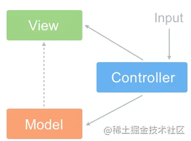
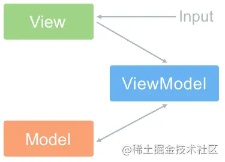
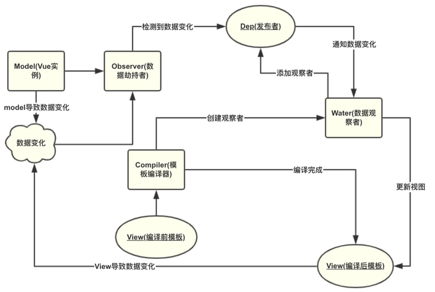
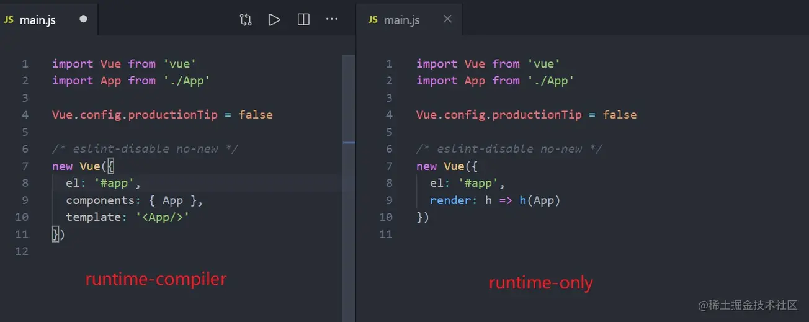
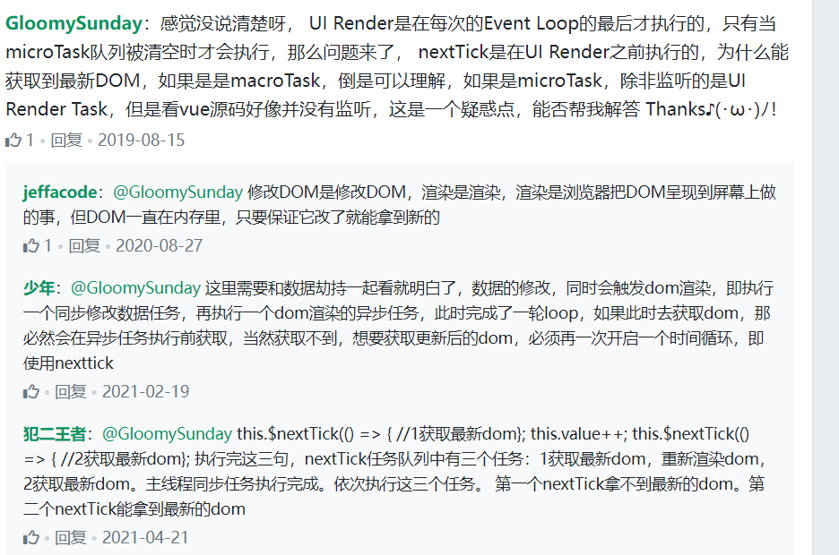

# Vue的优点？Vue的缺点？

### 优点

- 轻量级框架：只关注视图层，是一个构建数据的视图集合，大小只有几十kb；
- 组件化：保留了react的优点，实现了html的封装和重用，在构建单页面应用方面有着独特的优势；
- 渐进式：Vue是一个渐进式框架；
- 虚拟DOM：dom操作是非常耗费性能的，不再使用原生的dom操作节点，极大解放dom操作，但具体操作的还是dom不过是换了另一种方式；
- 双向数据绑定：保留了angular的特点，在数据操作方面更为简单；
- 视图，数据，结构分离：使数据的更改更为简单，不需要进行逻辑代码的修改，只需要操作数据就能完成相关操作；
- 运行速度更快:相比较与react而言，同样是操作虚拟dom，就性能而言，vue存在很大的优势。
- 响应式

### 缺点

单页面不利于seo，不支持IE8以下，首屏加载时间长

# 单页面应用的优缺点

### 优点

#### 良好的交互体验

单页应用的内容的改变不需要重新加载整个页面，获取数据也是通过Ajax异步获取，没有页面之间的切换，就不会出现“白屏现象”,也不会出现假死并有“闪烁”现象，页面显示流畅

#### 良好的前后端工作分离模式

后端不再负责模板渲染、输出页面工作，后端API通用化，即同一套后端程序代码，不用修改就可以用于Web界面、手机、平板等多种客户端

#### 减轻服务器压力

单页应用相对服务器压力小，服务器只用出数据就可以，不用管展示逻辑和页面合成，吞吐能力会提高几倍

### 缺点

#### 首屏加载慢

#### 不利于SEO

解决方案：1，服务端渲染

服务器合成完整的 html 文件再输出到浏览器

2，页面预渲染

3，路由采用h5 history模式

#### 不适合开发大型项目

大型项目中可能会涉及大量的DOM操作、复杂的动画效果，也就不适合使用Vue、react框架进行开发

# 为什么说Vue是一个渐进式框架

在核心库的基础上，vue现在已经有了一套完整的生态系统，我们可以添加Vuex，可以添加vue-router,可以添加任何你想添加的第三方库，这些都是互相独立的。

所以我们也可以说vue是**轻量型**的，是**渐进型**的，你可以在现有的程序上使用Vue，你也可以使用Vue来构建一个完整的工程。

**声明式渲染->组件化应用->客户端路由->集中式状态管理->项目构建**

# Vue跟React的异同点

### 基本区别

相同点：

1.都使用了虚拟dom

2.组件化开发

3.都是单向数据流(父子组件之间，不建议子修改父传下来的数据)

4.都支持服务端渲染

不同点：

1.React的JSX，Vue的template

2.数据变化，React手动(setState)，Vue自动(初始化已响应式处理，Object.defineProperty)

3.React单向绑定，Vue双向绑定

4.React的Redux，Vue的Vuex

5.Vue为了更加简单易用，引入了指令、filter等概念以及大量的[option](https://www.zhihu.com/search?q=option&search_source=Entity&hybrid_search_source=Entity&hybrid_search_extra={"sourceType"%3A"answer"%2C"sourceId"%3A2282544794}) API,比如 watch、[computed](https://www.zhihu.com/search?q=computed&search_source=Entity&hybrid_search_source=Entity&hybrid_search_extra={"sourceType"%3A"answer"%2C"sourceId"%3A2282544794})等都是非常好用的；而React的API比较少， 如果你的JavaScript基础比较好，上手也是比较容易的


### 更多

**Vue 使用的是 web 开发者更熟悉的模板与特性**，Vue的API跟传统web开发者熟悉的模板契合度更高，比如Vue的单文件组件是以模板+JavaScript+CSS的组合模式呈现，它跟web现有的HTML、JavaScript、CSS能够更好地配合。**React 的特色在于[函数式编程](https://www.zhihu.com/search?q=函数式编程&search_source=Entity&hybrid_search_source=Entity&hybrid_search_extra={"sourceType"%3A"answer"%2C"sourceId"%3A1066629375})的理念和丰富的技术选型**。Vue 比起 React 更容易被前端工程师接受，这是一个直观的感受；React 则更容易吸引在 FP 上持续走下去的开发者。

从**使用习惯和思维模式**上考虑，对于一个没有任何Vue和React基础的web开发者来说， Vue会更友好，更符合他的思维模式。React对于拥有函数式编程背景的开发者以及一些并不是以web为主要开发平台的开发人员而言，React更容易接受。这并不意味着他们不能接受Vue，Vue和React之间的差异对他们来说就没有web开发者那么明显。可以说，**Vue更加注重web开发者的习惯**。

**实现上，Vue跟React的最大区别在于数据的reactivity，就是反应式系统上。**Vue提供[反应式](https://www.zhihu.com/search?q=反应式&search_source=Entity&hybrid_search_source=Entity&hybrid_search_extra={"sourceType"%3A"answer"%2C"sourceId"%3A1066629375})的数据，当数据改动时，界面就会自动更新，而React里面需要调用方法SetState。我把两者分别称为**Push-based**和**Pull-based**。所谓Push-based就是说，改动数据之后，数据本身会把这个改动推送出去，告知渲染系统自动进行渲染。在React里面，它是一个Pull的形式，用户要给系统一个明确的信号说明现在需要重新渲染了，这个系统才会重新渲染。两者并没有绝对的优劣之分，更多的也是思维模式和开发习惯的不同。

两者不是完全互斥的，比如说在React里面，你也可以用一些第三方的库像MobX实现Push-based的系统，同时你也可以在Vue2.0里面，通过一些手段，比如把数据freeze起来，让数据不再具有反应式特点，或者通过手动调用组件更新的方法来做一个pull-based系统。所以两者并没有一个绝对的界限，只是默认的倾向性不同而已。


**React 是手动挡，Vue 是自动挡。**

Vue 是响应式的，React 是手动setState。

有很多人说React 比Vue 难，其实难在哪了，React 本身不难，但是React 需要用到很多js原生写法，你不管干什么都要去自己手动去操作，所以js基础很重要。

**而Vue 是一个渐进式框架**，你js基础可能不太好，但是也可以用vue 照着文档去开发一些业务，但是如果你想用好vue 你就要熟练vue 的这套语法，你得清楚各项配置。当你用熟练了，vue 是要比react 开发效率高的。

React是一个用于构建用户界面的开源JavaScript库，主要用于构建UI，很多人认为 React 是 MVC 中的 V（视图）。React 拥有较高的性能，代码逻辑非常简单，越来越多的人已开始关注和使用它。

react整体的思路就是[函数式](https://www.zhihu.com/search?q=函数式&search_source=Entity&hybrid_search_source=Entity&hybrid_search_extra={"sourceType"%3A"answer"%2C"sourceId"%3A2084639183})，所以推崇纯组件，数据不可变，单向数据流，当然需要双向的地方也可以做到，比如结合redux-form，而vue是基于可变数据的，支持双向绑定。react组件的扩展一般是通过高阶组件，而vue组件会使用mixin。vue内置了很多功能，而react做的很少，很多都是由社区来完成的，vue追求的是开发的简单，而react更在乎方式是否正确。

#  MVVM是什么？和MVC有何区别呢？

MVC

- Model(模型)：负责从数据库中取数据
- View(视图)：负责展示数据的地方
- Controller(控制器)：用户交互的地方，例如点击事件等等
- 思想：Controller将Model的数据展示在View上



MVVM

- VM：也就是View-Model，做了两件事达到了**数据的双向绑定** 一是将【模型】转化成【视图】，即将后端传递的数据转化成所看到的页面。实现的方式是：数据绑定。二是将【视图】转化成【模型】，即将所看到的页面转化成后端的数据。实现的方式是：DOM 事件监听。
- 思想：实现了 View 和 Model 的自动同步，也就是当 Model 的属性改变时，我们不用再自己手动操作 Dom 元素，来改变 View 的显示，而是改变属性后该属性对应 View 层显示会自动改变（对应Vue数据驱动的思想）




# Vue的双向绑定和单向数据流


### 前言

众所周知，`Vue`中更加推荐**单向数据流**的状态管理模式(比如`Vuex`)，但`Vue`同时支持通过`v-model`实现双向数据绑定。
那么问题来了，单项数据流和双向数据绑定的概念，这两种不是相互冲突的吗？即然能用`v-model`双向数据绑定，不应该就是双向数据流了吗？

本文主要包括以下内容

1. 单向绑定 `vs` 双向绑定
2. 单向数据流 `vs` 双向数据流
3. 为什么说`v-model`只是语法糖

### 单向绑定 `vs` 双向绑定

单双向绑定，指的是`View`层和`Model`层之间的映射关系。
`react`采取单向绑定，如图所示：

在`React`中，当`View`层发生更改时，用户通过发出`Actions`进行处理，`Actions`中通过`setState`对`State`进行更新，`State`更新后触发`View`更新。可以看出，`View`层不能直接修改`State`，必须要通过`Actions`来进行操作，这样更加清晰可控

单向绑定的方式的优点在于清晰可控，缺点则在于会有一些模板代码，**`Vue`则同时支持单向绑定和双向绑定**

- 单向绑定：插值形式`{{data}}`，`v-bind`也是单向绑定
- 双向绑定：表单的`v-model`，用户对`View`层的更改会直接同步到`Model`层

实际上`v-model`只是`v-bind:value` 和 `v-on:input`的语法糖，我们也可以采取类似`react`的单向绑定。两者各有利弊，单向绑定清晰可控，但是模板代码过多，双向绑定可以简化开发，但是也会导致数据变化不透明，优缺点共存，大家可以根据情况使用。

### 单向数据流 `vs` 双向数据流

**数据流指的是组件之间的数据流动。**
`Vue`与`React`都是单向数据流的模型，虽然`vue`有双向绑定`v-model`，但是`vue`和`react`父子组件之间数据传递，仍然还是遵循单向数据流的，父组件可以向子组件传递`props`，但是子组件不能修改父组件传递来的`props`，子组件只能通过**事件**通知父组件进行数据更改，如图所示：

通过单向数据流的模型，所有状态的改变可记录、可跟踪，相比于双向数据流可加容易维护与定位问题

### 为什么说`v-model`只是语法糖

> 你可以用 `v-model` 指令在表单 `<input>`、`<textarea>` 及 `<select>` 元素上创建**双向数据绑定**。它会根据控件类型自动选取正确的方法来更新元素。尽管有些神奇，但 `v-model` 本质上不过是语法糖。它负责监听用户的输入事件以更新数据，并对一些极端场景进行一些特殊处理

正如上面所述，`Vue`文档中说`v-model`只是语法糖

```javascript
<input v-model=“phoneInfo.phone”/>

//在组件中使用时，实际相当于下面的简写
<input :value="PhoneInfo.phone" @input="val => { PhoneInfo.phone = val }"
```

那么问题来了，为什么说`v-model`不是真正的双向数据流呢？按照这道理，是不是可以认为`model->view`的单向数据流也是语法糖啊，也是`vue`作者通过一定方法实现的而已
真正的原因上面已经说了，**数据绑定是`View`与`Model`之间的映射关系，数据流指的是组件之间的数据流动**
`v-model`不是真正的双向数据流，是因为它不能直接修改父组件的值，比如你在`v-model`中绑定`props`中的值是会报错的，它只能绑定组件的值
而真正的双向数据流，比如`AngularJs`，是允许在子组件中直接更新父组件的值的，这就是为什么说`v-model`只是语法糖的原因

### 总结

总得来说，单双向数据绑定与数据流是两个不同维度的概念，**数据绑定是`View`与`Model`之间的映射关系**，**数据流指的是组件之间的数据流动**。因此，单向数据流也可有双向绑定，双向数据流也可以有双向绑定，两者不应该混为一谈。

# Vue2和Vue3中的v-model

## Vue2 中的 v-model

Vue2 中的 `v-model`，它主要用于**表单元素和自定义组件上**。`v-model`本质上是一个语法糖，会对用户的输入做一些特殊处理以达到更新数据，而所谓的处理其实就是给使用的元素默认绑定属性和事件。

使用V-model 双向数据绑定事件时

```ini
<input v-model = 'something'>
```

- 原理:语法糖

```ini
<input v-bind:value="something" v-on:input="something=$event.target.value">
```

当 `v-model` 使用在表单元素上时，会根据元素的不同而采用不同的处理：

- 当`<input type="text">文本` 和 `<textarea>`上使用时，会默认给元素绑定名为 `value` 的 prop 和名为 `input` 的事件；
- 当`<input type="checkbox">复选框` 和 `<input type="radio">单选框` 上使用时，会默认绑定名为 `checked` 的 prop 和名为 `change` 的事件；
- 当 `<select>选择框` 上使用时，则绑定名为 `value` 的 prop 和名为    `change` 的事件。

一个简单的输入组件，就叫 `MyInput` ：

```html
<!-- MyInput 组件代码 -->

<template>
  <div>
    <input type="text" :value="value" @input="$emit('input',$event.target.value)">
  </div>
</template>

<script>
export default {
  props: {
    value: String,  // 默认接收一个名为 value 的 prop
  }
}
</script>
```

上面代码就实现了组件的 `v-model` 功能，当在这个组件上使用 `v-model` 时：

```html
<my-input v-model="msg"></my-input>
```

其实就等同于：

```html
<my-input :value="msg" @input="msg = $event">
```

Vue 还提供了 `model` 选项，用于将**属性或事件名称改为其他名称**，上面的 `MyInput` 组件，改成：

```html
<template>
  <div>
    <input
      type="text"
      :value="title"
      @input="$emit('change', $event.target.value)"
    />
  </div>
</template>

<script>
export default {
  model: {
    prop: "title", // 将默认的 prop 名 value 改为 title
    event: "change", // 将默认的事件名 input 改为 change
  },
  props: {
    title: String, // 注意 template 代码中也要修改为 title
  },
};
</script>
```

此时使用组件：

```html
<my-input v-model="msg"></my-input>

// 等同于
<my-input :title="msg" @change="msg = $event"></my-input>
```

### 使用 .sync 修饰符

Vue 提供一个 `.sync` 的修饰符，效果跟 `v-model` 一样，也是便于子组件数据更改后自动更新父组件相关数据。实现 `.sync` 的方式与实现 `v-model` 异曲同工，区别就是抛出的事件名需要是 `update:myPropName` 的结构。

还是拿上面的 `MyInput` 说明，我们还是传入一个 `title` 的 prop，同时组件内部抛出 `update:title` 事件，代码如下：

```html
// MyInput 组件中，修改抛出的事件名为 update:title
 <input type="text" :value="title" @input="$emit('update:title', $event.target.value)" />
```

此时如果使用这个组件，正常应该是这样：

```html
<my-input :title="msg" @update:title="msg = $event"></my-input>
```

但此时可以使用 `.sync` 修饰符来简化：

```html
<my-input :title.sync="msg"></my-input>
```

**.sync 修饰符修饰符的另一个作用就是实现多个参数的数据双向绑定**，因为一个组件只有一个  v-model，所以 ， v-model 只能针对一个变量进行数据绑定

## Vue3 中的 v-model

**Vue3中的变化**

### 修改默认 prop 名和事件名

当用在**自定义组件上时，v-model默认绑定的 prop 名从 value变为 modelValue，而事件名也从默认的input改为 update:modelValue** 。在 Vue3 中编写上面那个 `MyInput` 组件时，就需要这样：

```html
<!-- MyInput 组件代码 Vue3 版 -->

<template>
  <div>
    <input
      type="text"
      :value="modelValue"
      @input="$emit('update:modelValue', $event.target.value)"  // 事件名改为 update:modelValue
    />
  </div>
</template>

<script>
export default {
  props: {
    modelValue: String, // 默认 prop 从 value 改为 modelValue
  },
};
</script>
```

使用组件时：

```html
<my-input v-model="msg"></my-input>

// 等同于
<my-input :modelValue="msg" @update:modelValue="msg = $event"></my-input>
```

### 废除 model 选项和 .sync 修饰符

Vue3 中移除了 `model` 选项，这样就不可以在组件内修改默认 prop 名了。现在有一种更简单的方式，就是直接在 `v-model` 后面传递要修改的 prop 名：

```html
// 要修改默认 prop 名，只需在 v-model 后面接上 :propName，例如修改为 title
<my-input v-model:title="msg"></my-input>

// 等同于
<my-input :title="msg" @update:title="msg = $event"></my-input>
```

注意组件内部也要修改 props：

```html
<template>
  <div>
    <input
      type="text"
      :value="title"
      @input="$emit('update:title', $event.target.value)"
    />
  </div>
</template>

<script>
export default {
  // 此时这里不需要 model 选项来修改了
  props: {
    title: String, // 修改为 title，注意 template 中也要修改
  },
};
</script>
```

### 使用多个 v-model

Vue3 中支持使用多个 `v-model`

例如有这样一个表单子组件，用户输入的多个数据都需要更新到父组件中显示，可以这样写：

```html
<!--  表单子组件 Form -->

<template>
  <div class="form">
    
    <label for="name">姓名</label>
    <input id="name" type="text" :value="name" @input="$emit('update:name',$event.target.value)">
    
    <label for="address">地址</label>
    <input id="address" type="text" :value="address" @input="$emit('update:address',$event.target.value)">
  
  </div>
</template>

<script>
export default {
  props:{
    name: String,
    address: String
  }
}
</script>
```

父组件使用这个组件时：

```html
<child-component v-model:name="name" v-model:address="address"></child-component>
    
// 将用户输入数据更新到父组件中显示
<p>{{name}}</p>
<p>{{address}}</p>
```

### 自定义 v-model 修饰符

 Vue2 中的 `v-model` 上，我们用过 `.trim`、`.lazy` 和 `.number`这三个内置修饰符，而 Vue3 则在这个基础上增加了自定义修饰符，即开发者可以自定义修饰符，以按需处理绑定值。

当我们在 `v-model` 后面加上自定义修饰符后，会通过名为 `modelModifiers` 的 prop 传递给子组件，子组件拿到这个修饰符名后，根据条件修改绑定值。我们来看一个例子，自定义一个修饰符 `capitalize`，用于将输入字符串的首字母大写。

假设自定义组件还是叫 `MyInput`，使用 `v-model` 时加上自定义修饰符 `capitalize`：

```html
<my-input v-model.capitalize="msg"></my-input>
```

由于不是内置修饰符，所以需要我们自己在组件内部处理修饰符逻辑，编写组件：

```html
<!-- MyInput 组件 -->

<template>
  <div>
    <input type="text" :value="modelValue" @input="emitValue" />
  </div>
</template>

<script>
export default {
  props: {
    modelValue: String,
    modelModifiers: {  // 自定义修饰符会默认传入这个 prop 中
      type: Object,
      default: () => ({}),
    },
  },
  mounted() {
    // 当组件 v-model 后面加上了自定义修饰符，组件内部会在 modelModifiers 上获取到修饰符状态
    console.log(this.modelModifiers); // {capitalize: true}
  },
  methods: {
    emitValue(e) {
      let value = e.target.value;
      // 如果使用了自定义修饰符，即状态为 true，就处理值
      if (this.modelModifiers.capitalize) {
        value = value.charAt(0).toUpperCase() + value.slice(1);
      }
      // emit value
      this.$emit("update:modelValue", value);
    },
  },
};
</script>
```

这样就完成了一个将输入字符串首字母大写的`v-model`修饰符。

如果是 `v-model` 带上了参数，同时使用了自定义修饰符，比如这样：

```html
<my-input v-model:title.capitalize="msg"></my-input>
```

那么传入组件内部的 prop 就不再是 `modelModifiers` 了，而是 `titleModifiers`。它的格式是 `arg + 'Modifiers'`。此时这个组件应该这样写：

```html
<!-- MyInput 组件 -->

<template>
  <div>
    <input type="text" :value="title" @input="emitValue" />
  </div>
</template>

<script>
export default {
  props: {
    title: String,  // modelValue -> title
    titleModifiers: {  // modelModifiers -> titleModifiers
      type: Object,
      default: () => ({}),
    },
  },
  mounted() {
    console.log(this.titleModifiers); // {capitalize: true}
  },
  methods: {
    emitValue(e) {
      let value = e.target.value;

      // 如果使用了自定义修饰符，就处理值
      if (this.titleModifiers.capitalize) {
        value = value.charAt(0).toUpperCase() + value.slice(1);
      }
      // emit value
      this.$emit("update:title", value);
    },
  },
};
</script>
```

# Vue2和Vue3中的插槽

## Vue2的插槽

### 匿名插槽

```vue

<div id="app">
    <div class="father">
        <h3>这里是父组件</h3>
        <child>
           <span>我是插槽插入的内容</span>
        </child>
    </div>
</div>
<template id="child">
    <div class="child">
        <h3>这里是子组件</h3>
        <slot></slot>
    </div>
</template>
<script>
    var vm = new Vue({
        el: '#app',
        data: {},
        components: {
            child: {
                template: '#child'
            }
        }
 
    });
 
</script>
```

### 具名插槽

```vue
<div id="app">
    <div class="father">
        <h3>这里是父组件</h3>
        <child>
            <span slot="demo1">菜单1</span>
            <span>菜单2</span>
            <span slot="demo3">菜单3</span>
        </child>
    </div>
</div>
<template id="child">
    <div class="child">
        <h3>这里是子组件</h3>
        <slot></slot>
        <slot name="demo3"><slot>
    </div>
</template>
<script>
    var vm = new Vue({
        el: '#app',
        data: {},
        components: {
            child: {
                template: '#child'
            }
        }
    });
</script>
```

具名插槽其实就是在父组件中添加一个 slot='自定义名字' 的属性，然后在子组件中的<slot><slot> 里面添加 <name='自定义名字' 即可，如果父组件中有一部分没有添加 slot 属性，则此处就是默认的插槽，在子组件中的<slot></slot> 直接就是使用的父组件的默认插槽部分。

### 作用域插槽

父组件模板的所有东西都会在父级作用域内编译；子组件模板的所有东西都会在子级作用域内编译。不过，我们可以在父组件中使用slot-scope 特性从子组件获取数据，前提是需要在子组件中使用:data=子组件中的数据 来传递data 的数据！

```vue

<div id="app">
    <div class="father">
        <h3>这里是父组件</h3>
        <child>
            <div slot-scope="user">
                {{user.data}}
            </div>
        </child>
    </div>
</div>
<script>
    Vue.component('child', {
        template:'' +
            '<div class="child">\n' +
            '    <h3>这里是子组件</h3>\n' +
            '    <slot  :data="people"></slot>\n' +
            '  </div>',
        data: function () {
            return {
                people: ['zhangsan', 'lisi', 'wanwu', 'zhaoliu', 'tianqi', 'xiaoba']
            }
        }
    });
    var vm = new Vue({
        el: '#app',
    });
</script>
```

## Vue3的插槽

匿名插槽用法不变

### 具名插槽

```vue
// 子组件
<div class="hello">
    我是一个封装的组件
     <slot name="num"></slot>
</div>
  
  
// 父组件
<HelloWorld v-model="masg" v-slot:num>
    <div>我是插槽插入的</div>
</HelloWorld>
 
// 父组件的另外一个写法
<HelloWorld v-model="masg">
    <template v-slot:num>
         <div>我是插槽插入的</div>
    </template>
</HelloWorld>
```

Vue3（其实从2.6开始）中引入了一个新的指令 **v-slot**，用来表示具名插槽和默认插槽。
在 v2.5 之后屏蔽了 slot-scope,
v-slot引入使其插槽更接近指令化。

注意：如果一个插槽没有指定`name`属性，则会使用它的默认值：`default`

`v-slot` 有对应的**简写方式 `#`**，因此 `<template v-slot:header>` 可以简写为 `<template #header>`。

### 作用域插槽

屏蔽了 slot-scope

父组件直接v-slot="slotAttrs" ，slotAttrs也可以换成其他

```js
    const app = Vue.createApp({

        template:`
            <div>
                <my-list v-slot="slotAttrs" >
                    <span>{{slotAttrs.item}}</span>
                </my-list>
            </div>
        `
    });
    app.component("my-list", {
        data() {
            return {
                myList: ['a', 'b', 'c']
            }
        },
        template: `
            <div>
                <slot v-for="item in myList" :item="item" ></slot>
            </div>
        `
    }); 

// 直接得到 item
    const app = Vue.createApp({
        template:`
            <div>
                <my-list v-slot="{item}" >
                    <span>{{item}}</span>
                </my-list>
            </div>
        `
    });
    app.component("my-list", {

        data() {
            return {
                myList: ['a', 'b', 'c']
            }
        },
        template: `
            <div>
                <slot v-for="item in myList" :item="item" ></slot>
            </div>
        `
    });

```

我们可以使用 v-slot="{item}" 的方式，直接得到 item，效果一样

# ⚝Vue双向绑定原理

## 创建vue类

- 1，vue最少需要两个参数：模板和数据data
- 2，创建Compiler类，用于解析模板中的vue指令，将所需的data渲染到模板中，最后挂载到指定跟节点上。(**模板解析**)
- 3，创建Observer类，用于对data的每个属性都进行get/set拦截（**数据劫持**）。在Compiler类解析模板的时候会触发get拦截，这时候就可以获取到该data所被依赖的所有dom节点（**收集依赖**），当修改该data的值时，会触发set，就可以将收集的所有依赖dom依次修改，实现了数据驱动视图。（**派发更新**）

```javascript
class MyVue {
  // 1，接收两个参数：模板（根节点），和数据对象
  constructor(options) {
    // 保存模板，和数据对象
    if (this.isElement(options.el)) {
      this.$el = options.el;
    } else {
      this.$el = document.querySelector(options.el);
    }
    this.$data = options.data;
    if (this.$el) {
      // 2，拦截data所有属性的get/set
      new Observer(this.$data);
      // 3，解析模板中的vue指令
      new Compiler(this)
    }
  }
  // 判断是否是一个dom元素
  isElement(node) {
    return node.nodeType === 1;
  }
}
```

## 解析模板

实现数据首次渲染到页面

### Compiler

1，node2fragment 函数将模板元素提取到内存中，方便将数据渲染到模板后，再一次性挂载到页面中

2，模板提取到内存后，使用 buildTemplate 函数遍历该模板元素

- 元素节点
  - 使用 buildElement 函数检查元素上以v-开头的属性
- 文本节点
  - 用 buildText 函数检查文本中有无 {{}} 内容

3，创建 CompilerUtil 类，用于处理vue指令和 {{}}，完成数据的渲染

4，**到此就完成了首次数据渲染，接下来需要实现：数据改变时，自动更新视图。**

```javascript
class Compiler {
  constructor(vm) {
    this.vm = vm;
    // 1.将网页上的元素放到内存中
    let fragment = this.node2fragment(this.vm.$el);
    // 2.利用指定的数据编译内存中的元素
    this.buildTemplate(fragment);
    // 3.将编译好的内容重新渲染会网页上
    this.vm.$el.appendChild(fragment);
  }
  node2fragment(app) {
    // 1.创建一个空的文档碎片对象
    let fragment = document.createDocumentFragment();
    // 2.编译循环取到每一个元素
    let node = app.firstChild;
    while (node) {
      // 注意点: 只要将元素添加到了文档碎片对象中, 那么这个元素就会自动从网页上消失
      fragment.appendChild(node);
      node = app.firstChild;
    }
    // 3.返回存储了所有元素的文档碎片对象
    return fragment;
  }
  buildTemplate(fragment) {
    let nodeList = [...fragment.childNodes];
    nodeList.forEach(node => {
      // 需要判断当前遍历到的节点是一个元素还是一个文本
      if (this.vm.isElement(node)) {
        // 元素节点
        this.buildElement(node);
        // 处理子元素
        this.buildTemplate(node);
      } else {
        // 文本节点
        this.buildText(node);
      }
    })
  }
  buildElement(node) {
    let attrs = [...node.attributes];
    attrs.forEach(attr => {
      // v-model="name" => {name:v-model  value:name}
      let { name, value } = attr;
      // v-model / v-html / v-text / v-xxx
      if (name.startsWith('v-')) {
        // v-model -> [v, model]
        let [_, directive] = name.split('-');
        CompilerUtil[directive](node, value, this.vm);
      }
    })
  }
  buildText(node) {
    let content = node.textContent;
    let reg = /\{\{.+?\}\}/gi;
    if (reg.test(content)) {
      CompilerUtil['content'](node, content, this.vm);
    }
  }
}
```

### 工具类CompilerUtil

```javascript
let CompilerUtil = {
  getValue(vm, value) {
    // 解析this.data.aaa.bbb.ccc这种属性
    return value.split('.').reduce((data, currentKey) => {
      return data[currentKey.trim()];
    }, vm.$data);
  },
  getContent(vm, value) {
    // 解析{{}}中的变量
    let reg = /\{\{(.+?)\}\}/gi;
    let val = value.replace(reg, (...args) => {
      return this.getValue(vm, args[1]);
    });
    return val;
  },
  // 解析v-model指令
  model: function (node, value, vm) {
    // 在触发getter之前，为dom创建Wather，并为Watcher.target赋值
    new Watcher(vm, value, (newValue, oldValue) => {
      node.value = newValue;
    });
    let val = this.getValue(vm, value);
    node.value = val;
  },
  // 解析v-html指令
  html: function (node, value, vm) {
    // 在触发getter之前，为dom创建Wather，并为Watcher.target赋值
    new Watcher(vm, value, (newValue, oldValue) => {
      node.innerHTML = newValue;
    });
    let val = this.getValue(vm, value);
    node.innerHTML = val;
  },
  // 解析v-text指令
  text: function (node, value, vm) {
    // 在触发getter之前，为dom创建Wather，并为Watcher.target赋值
    new Watcher(vm, value, (newValue, oldValue) => {
      node.innerText = newValue;
    });
    let val = this.getValue(vm, value);
    node.innerText = val;
  },
  // 解析{{}}中的变量
  content: function (node, value, vm) {
    let reg = /\{\{(.+?)\}\}/gi;
    let val = value.replace(reg, (...args) => {
      // 在触发getter之前，为dom创建Wather，并为Watcher.target赋值
      new Watcher(vm, args[1], (newValue, oldValue) => {
        node.textContent = this.getContent(vm, value);
      });
      return this.getValue(vm, args[1]);
    });
    node.textContent = val;
  }
}
```

## 实现数据驱动视图

### Observer

1，使用 defineRecative 函数对 data 做 Object.defineProperty 处理，使得可以拦截 data 中的每个数据的get/set。

```javascript
class Observer {
  constructor(data) {
    this.observer(data);
  }
  observer(obj) {
    if (obj && typeof obj === 'object') {
      // 遍历取出传入对象的所有属性, 给遍历到的属性都增加get/set方法
      for (let key in obj) {
        this.defineRecative(obj, key, obj[key])
      }
    }
  }
  // obj: 需要操作的对象
  // attr: 需要新增get/set方法的属性
  // value: 需要新增get/set方法属性的取值
  defineRecative(obj, attr, value) {
    // 如果属性的取值又是一个对象, 那么也需要给这个对象的所有属性添加get/set方法
    this.observer(value);
    Object.defineProperty(obj, attr, {
      get() {
        return value;
      },
      set: (newValue) => {
        if (value !== newValue) {
          // 如果给属性赋值的新值又是一个对象, 那么也需要给这个对象的所有属性添加get/set方法
          this.observer(newValue);
          value = newValue;
          console.log('监听到数据的变化');
        }
      }
    })
  }
}
```

2，接下来将考虑：如何在监听到data值改变后，更新视图内容呢？

- 使用观察者设计模式，创建Dep和Wather类。

### 使用观察者设计模式，创建Dep和Wather类

1，在解析模板，收集data中各个属性在模板中被引用的dom节点集合，当该数据改变时，**更新依赖了该数据的dom节点集合**，就实现了数据驱动页面更新。

2，创建Dep类和Watcher类

- Dep：`用于收集某个data属性依赖的dom节点集合，并提供更新方法`
- Watcher：`每个dom节点的包裹对象`
  - attr：该dom使用的data属性
  - cb：修改该dom内容的回调函数，在对象创建的时候会接收

3，到这里感觉思路是没问题了，已经是胜券在握了。那**Dep和Watcher该怎么使用**呢？

- 为data的每个属性添加一个dep数组，用来收集依赖的dom节点。
- 因为vue实例初始化的时候会解析模板，会触发data数据的getter，所以在此收集dom。
- 具体如何收集呢？
  - 在CompilerUtil类解析v-model，{{}}等命令时，会触发getter。
  - 我们在触发之前创建Wather对象，该对象在初始化的时候调用getOldValue，首先为Dep添加一个静态属性target，值为该dom节点。
  - 再调用CompilerUtil.getValue，获取该data的当前值，此时就以及触发了getter。然后我们在getter函数里面获取该静态变量Dep.target，并添加到对应的依赖数组dep中了，就完成了一次收集。
  - 因为每次触发getter之前都对该静态变量赋值，所以不存在收集错依赖的情况。

```javascript
class Dep {
  constructor() {
    // 这个数组就是专门用于管理某个属性所有的观察者对象的
    this.subs = [];
  }
  // 订阅观察的方法
  addSub(watcher) {
    this.subs.push(watcher);
  }
  // 发布订阅的方法
  notify() {
    this.subs.forEach(watcher => watcher.update());
  }
}

class Watcher {
  constructor(vm, attr, cb) {
    this.vm = vm;
    // 该dom使用的data属性
    this.attr = attr;
    // 修改该dom内容的回调函数
    this.cb = cb;
    // 在创建观察者对象的时候就去获取当前的旧值
    this.oldValue = this.getOldValue();
  }
  getOldValue() {
    Dep.target = this;
    let oldValue = CompilerUtil.getValue(this.vm, this.attr);
    Dep.target = null;
    return oldValue;
  }
  // 定义一个更新的方法, 用于判断新值和旧值是否相同
  update() {
    let newValue = CompilerUtil.getValue(this.vm, this.attr);
    if (this.oldValue !== newValue) {
      this.cb(newValue, this.oldValue);
    }
  }
}
```

**4，修改get/set方法**

```javascript
defineRecative(obj, attr, value) {
  this.observer(value);
  // 1，创建了属于当前属性的依赖收集对象
  let dep = new Dep();
  Object.defineProperty(obj, attr, {
    get() {
      // 2，在这里收集依赖
      Dep.target && dep.addSub(Dep.target);
      return value;
    },
    set: (newValue) => {
      if (value !== newValue) {
        // 如果给属性赋值的新值又是一个对象, 那么也需要给这个对象的所有属性添加get/set方法
        this.observer(newValue);
        value = newValue;
        // 通知到视图更新
        dep.notify();
        console.log('监听到数据的变化');
      }
    }
  })
}

```

5，到这里就实现了数据绑定时，视图自动更新。

## 实现视图驱动数据

其实就是监听输入框的input、change事件。修改CompilerUtil的model方法。具体代码如下

```javascript
model: function (node, value, vm) {
    new Watcher(vm, value, (newValue, oldValue)=>{
        node.value = newValue;
    });
    let val = this.getValue(vm, value);
    node.value = val;
	// 看这里
    node.addEventListener('input', (e)=>{
        let newValue = e.target.value;
        this.setValue(vm, value, newValue);
    })
},
```

## 总结

### vue双向绑定原理

vue接收一个模板和data参数。1，首先将data中的数据进行递归遍历，对每个属性执行Object.defineProperty，定义get和set函数。并为每个属性添加一个dep数组。当get执行时，会为调用的dom节点创建一个watcher存放在该数组中。当set执行时，重新赋值，并调用dep数组的notify方法，通知所有使用了该属性watcher，并更新对应dom的内容。2，将模板加载到内存中，递归模板中的元素，检测到元素有v-开头的命令或者双大括号的指令，就会从data中取对应的值去修改模板内容，这个时候就将该dom元素添加到了该属性的dep数组中。这就实现了数据驱动视图。在处理v-model指令的时候，为该dom添加input事件（或change），输入时就去修改对应的属性的值，实现了页面驱动数据。3，将模板与数据进行绑定后，将模板添加到真实dom树中。

### 如何将watcher放在dep数组中？

在**解析模板**的时候，会根据v-指令**获取对应data属性值**，这个时候就会**调用属性的get方法**，我们先创建Watcher实例，并在其内部获取该属性值，作为旧值存放在watcher内部，我们在获取该值之前，在Watcher原型对象上添加属性Watcher.target = this;然后取值，将讲Watcher.target = null；这样get在被调用的时候就可以根据Watcher.target获取到watcher实例对象。

### methods的原理

创建vue实例的时候，接收methods参数

在解析模板的时候遇到v-on的指令。会对该dom元素添加对应事件的监听，并使用call方法将vue绑定为该方法的this：`vm.$methods[value].call(vm, e);`

### computed的原理

创建vue实例的时候，接收computed参数

初始化vue实例的时候，为computed的key进行Object.defineProperty处理，并添加get属性。

# Vue2响应式原理

### Object.defineProperty()

```
Object.defineProperty(obj, prop, descriptor)
```

方法会直接在一个对象上定义一个新属性，或者修改一个对象的现有属性，并返回此对象。

defineProperty的第三个参数是一个对象,表示该key的描述，其中包括的属性有：

1. `value` 值，默认为 undefined。
2. `enumerable` 是否可以被枚举，默认false。
3. `writable` 是否可写，默认false。为true时value才能被赋值运算符(en-US)改变。
4. `configurable`  描述值是否可以配置或删除，默认为false。只有为true时，属性才能被删除，或其描述值（比如：writable，enumerable等）才能被改变。
5. `get` 方法，当访问该属性，会调用该方法，该函数的返回值会被用作属性的值。
6. `set` 方法，当属性值被改变时，会调用该方法，该方法接受一个参数，该参数是被赋予的新值。

Vue实现响应式主要利用的就是: **数据劫持**和**发布订阅模式**。
所谓**发布订阅模式**就是，定义了对象间的一种**一对多的关系**，**让多个观察者对象同时监听某一个主题对象，当一个对象发生改变时，所有依赖于它的对象都将得到通知**。
所谓**数据劫持**，就是**利用JavaScript的访问器属性**，即**Object.defineProperty()方法来劫持各个属性的setter和getter**，当对对象的属性进行赋值时，Object.defineProperty就可以**通过set方法劫持到数据的变化**，然后**通知发布者(主题对象)去通知所有观察者**，观察者收到通知后，就会对视图进行更新。



如上图所示，**View模板**首先经过**Compiler(编译器对象)进行编译**，在编译的过程中，**会分析模板中哪里使用到了Vue数据(Model中的数据)**，**一旦使用到了Vue数据(Model中的数据)，就会创建一个Water(观察者对象)**，并且将这个**观察者对象**添加到**发布者对象**的数组中，同时获取到Vue中的数据替换编译生成一个新的View视图。
在**创建Vue实例**的过程中，会对Vue data中的数据进行数据劫持操作，即将data上的属性都通过Object.definePropery()的方式代理到Vue实例上，**当View视图或者Vue Model中发生数据变化的时候，就会被劫持，然后通知Dep发布者对象进行视图的更新**，从而实现响应式。**数组则是通过重写数组方法来实现**。当页面使用对应属性时，每个属性**都拥有自己的`dep`属性，存放他所依赖的` watcher`**（依赖收集），当**属性变化后会通知自己对应的` watcher` 去更新**(派发更新)。


**Observer（数据监听器）** : Observer的核心是通过Object.defineProprtty()来监听数据的变动，这个函数内部可以定义setter和getter，每当**数据发生变化，就会触发setter**。这时候Observer就要**通知订阅者**，订阅者就是Watcher。当外界通过Watcher**读取数据**时，会触发getter从而将Watcher添加到**依赖管理（Dep）中。**

**Watcher（订阅者）** : Watcher订阅者作为Observer和Compile之间通信的桥梁，主要做的事情是：

1. 在自身实例化时往**属性订阅器(dep)里面添加自己**
2. 自身必须有一个update()方法
3. 待**属性变动dep.notice()通知时**，能调用自身的update()方法，并触发Compile中绑定的回调或者是触发视图更新。

**Compile（指令解析器）** : Compile主要做的事情是解析模板指令，将模板中变量替换成数据，然后初始化渲染页面视图，并将每个指令对应的节点绑定更新函数，添加鉴定数据的**订阅者**，一旦数据有变动，收到通知，更新试图

### 源码实现


#### 初始化

在 new Vue 初始化的时候，会对我们组件的数据 props 和 data 进行初始化，由于本文主要就是介绍响应式，所以其他的不做过多说明来，看一下源码

源码地址：`src/core/instance/init.js - 15行`

```js
export function initMixin (Vue: Class<Component>) {
  // 在原型上添加 _init 方法
  Vue.prototype._init = function (options?: Object) {
    ...
    vm._self = vm
    initLifecycle(vm) // 初始化实例的属性、数据：$parent, $children, $refs, $root, _watcher...等
    initEvents(vm) // 初始化事件：$on, $off, $emit, $once
    initRender(vm) // 初始化渲染： render, mixin
    callHook(vm, 'beforeCreate') // 调用生命周期钩子函数
    initInjections(vm) // 初始化 inject
    initState(vm) // 初始化组件数据：props, data, methods, watch, computed
    initProvide(vm) // 初始化 provide
    callHook(vm, 'created') // 调用生命周期钩子函数
    ...
  }
}
```

初始化这里调用了很多方法，每个方法都做着不同的事，而关于响应式主要就是组件内的数据 `props`、`data`。这一块的内容就是在 `initState()` 这个方法里，所以我们进入这个方法源码看一下

##### initState()

源码地址：`src/core/instance/state.js - 49行`

```js
export function initState (vm: Component) {
  vm._watchers = []
  const opts = vm.$options
  // 初始化 props
  if (opts.props) initProps(vm, opts.props)
  // 初始化 methods
  if (opts.methods) initMethods(vm, opts.methods)
  // 初始化 data 
  if (opts.data) {
    initData(vm)
  } else {
    // 没有 data 的话就默认赋值为空对象，并监听
    observe(vm._data = {}, true /* asRootData */)
  }
  // 初始化 computed
  if (opts.computed) initComputed(vm, opts.computed)
  // 初始化 watch
  if (opts.watch && opts.watch !== nativeWatch) {
    initWatch(vm, opts.watch)
  }
}
```

又是调用一堆初始化的方法，我们还是直奔主题，取我们响应式数据相关的，也就是 `initProps()`、`initData()`、`observe()`

一个一个继续扒，非得整明白响应式的全部过程

##### initProps()

源码地址：`src/core/instance/state.js - 65行`

这里主要做的是：

- 遍历父组件传进来的 `props` 列表
- 校验每个属性的命名、类型、default 属性等，都没有问题就调用 `defineReactive` 设置成响应式
- 然后用 `proxy()` 把属性代理到当前实例上，如把 `vm._props.xx` 变成 `vm.xx`，就可以访问

```js
function initProps (vm: Component, propsOptions: Object) {
  // 父组件传入子组件的 props
  const propsData = vm.$options.propsData || {}
  // 经过转换后最终的 props
  const props = vm._props = {}
  // 存放 props 的 key，就算 props 值空了，key 也会在里面
  const keys = vm.$options._propKeys = []
  const isRoot = !vm.$parent
  // 转换非根实例的 props
  if (!isRoot) {
    toggleObserving(false)
  }
  for (const key in propsOptions) {
    keys.push(key)
    // 校验 props 类型、default 属性等
    const value = validateProp(key, propsOptions, propsData, vm)
    // 在非生产环境中
    if (process.env.NODE_ENV !== 'production') {
      const hyphenatedKey = hyphenate(key)
      if (isReservedAttribute(hyphenatedKey) ||
          config.isReservedAttr(hyphenatedKey)) {
        warn(`hyphenatedKey 是保留属性，不能用作组件 prop`)
      }
      // 把 props 设置成响应式的
      defineReactive(props, key, value, () => {
        // 如果用户修改 props 发出警告
        if (!isRoot && !isUpdatingChildComponent) {
          warn(`避免直接改变 prop`)
        }
      })
    } else {
      // 把 props 设置为响应式
      defineReactive(props, key, value)
    }
    // 把不在默认 vm 上的属性，代理到实例上
    // 可以让 vm._props.xx 通过 vm.xx 访问
    if (!(key in vm)) {
      proxy(vm, `_props`, key)
    }
  }
  toggleObserving(true)
}
```

##### initData()

源码地址：`src/core/instance/state.js - 113行`

这里主要做的是：

- 初始化一个 data，并拿到 keys 集合
- 遍历 keys 集合，来判断有没有和 props 里的属性名或者 methods 里的方法名重名的
- 没有问题就通过 `proxy()` 把 data 里的每一个属性都代理到当前实例上，就可以通过 `this.xx` 访问了
- 最后再调用 `observe` 监听整个 data

```js
function initData (vm: Component) {
  // 获取当前实例的 data 
  let data = vm.$options.data
  // 判断 data 的类型
  data = vm._data = typeof data === 'function'
    ? getData(data, vm)
    : data || {}
  if (!isPlainObject(data)) {
    data = {}
    process.env.NODE_ENV !== 'production' && warn(`数据函数应该返回一个对象`)
  }
  // 获取当前实例的 data 属性名集合
  const keys = Object.keys(data)
  // 获取当前实例的 props 
  const props = vm.$options.props
  // 获取当前实例的 methods 对象
  const methods = vm.$options.methods
  let i = keys.length
  while (i--) {
    const key = keys[i]
    // 非生产环境下判断 methods 里的方法是否存在于 props 中
    if (process.env.NODE_ENV !== 'production') {
      if (methods && hasOwn(methods, key)) {
        warn(`Method 方法不能重复声明`)
      }
    }
    // 非生产环境下判断 data 里的属性是否存在于 props 中
    if (props && hasOwn(props, key)) {
      process.env.NODE_ENV !== 'production' && warn(`属性不能重复声明`)
    } else if (!isReserved(key)) {
      // 都不重名的情况下，代理到 vm 上
      // 可以让 vm._data.xx 通过 vm.xx 访问
      proxy(vm, `_data`, key)
    }
  }
  // 监听 data
  observe(data, true /* asRootData */)
}
```

##### observe()

源码地址：`src/core/observer/index.js - 110行`

这个方法主要就是用来给数据加上监听器的

这里主要做的是：

- 如果是 vnode 的对象类型或者不是引用类型，就直接跳出
- 否则就给没有添加 Observer 的数据添加一个 Observer，也就是监听者

```js
export function observe (value: any, asRootData: ?boolean): Observer | void {
  // 如果不是'object'类型 或者是 vnode 的对象类型就直接返回
  if (!isObject(value) || value instanceof VNode) {
    return
  }
  let ob: Observer | void
  // 使用缓存的对象
  if (hasOwn(value, '__ob__') && value.__ob__ instanceof Observer) {
    ob = value.__ob__
  } else if (
    shouldObserve &&
    !isServerRendering() &&
    (Array.isArray(value) || isPlainObject(value)) &&
    Object.isExtensible(value) &&
    !value._isVue
  ) {
    // 创建监听者
    ob = new Observer(value)
  }
  if (asRootData && ob) {
    ob.vmCount++
  }
  return ob
}
```

##### Observer

源码地址：`src/core/observer/index.js - 37行`

这是一个类，作用是把一个正常的数据成可观测的数据

这里主要做的是：

- 给当前 value 打上已经是响应式属性的标记，避免重复操作
- 然后判断数据类型
  - 如果是对象，就遍历对象，调用 defineReactive()创建响应式对象
  - 如果是数组，就遍历数组，调用 observe()对每一个元素进行监听

```js
export class Observer {
  value: any;
  dep: Dep;
  vmCount: number; // 根对象上的 vm 数量
  constructor (value: any) {
    this.value = value
    this.dep = new Dep()
    this.vmCount = 0
    // 给 value 添加 __ob__ 属性，值为value 的 Observe 实例
    // 表示已经变成响应式了，目的是对象遍历时就直接跳过，避免重复操作
    def(value, '__ob__', this)
    // 类型判断
    if (Array.isArray(value)) {
      // 判断数组是否有__proty__
      if (hasProto) {
        // 如果有就重写数组的方法
        protoAugment(value, arrayMethods)
      } else {
        // 没有就通过 def，也就是Object.defineProperty 去定义属性值
        copyAugment(value, arrayMethods, arrayKeys)
      }
      this.observeArray(value)
    } else {
      this.walk(value)
    }
  }
  // 如果是对象类型
  walk (obj: Object) {
    const keys = Object.keys(obj)
    // 遍历对象所有属性，转为响应式对象，也是动态添加 getter 和 setter，实现双向绑定
    for (let i = 0; i < keys.length; i++) {
      defineReactive(obj, keys[i])
    }
  }
  // 监听数组
  observeArray (items: Array<any>) {
    // 遍历数组，对每一个元素进行监听
    for (let i = 0, l = items.length; i < l; i++) {
      observe(items[i])
    }
  }
}
```

##### defineReactive()

源码地址：`src/core/observer/index.js - 135行`

这个方法的作用是定义响应式对象

这里主要做的是：

- 先初始化一个 dep 实例
- 如果是对象就调用 observe，递归监听，以保证不管结构嵌套多深，都能变成响应式对象
- 然后调用 Object.defineProperty() 劫持对象属性的 getter 和 getter
- 如果获取时，触发 getter 会调用 dep.depend() 把观察者 push 到依赖的数组 subs 里去，也就是依赖收集
- 如果更新时，触发 setter 会做以下操作
  - 新值没有变化或者没有 setter 属性的直接跳出
  - 如果新值是对象就调用 observe() 递归监听
  - 然后调用 dep.notify() 派发更新

```js
export function defineReactive (
  obj: Object,
  key: string,
  val: any,
  customSetter?: ?Function,
  shallow?: boolean
) {

  // 创建 dep 实例
  const dep = new Dep()
  // 拿到对象的属性描述符
  const property = Object.getOwnPropertyDescriptor(obj, key)
  if (property && property.configurable === false) {
    return
  }
  // 获取自定义的 getter 和 setter
  const getter = property && property.get
  const setter = property && property.set
  if ((!getter || setter) && arguments.length === 2) {
    val = obj[key]
  }
  // 如果 val 是对象的话就递归监听
  // 递归调用 observe 就可以保证不管对象结构嵌套有多深，都能变成响应式对象
  let childOb = !shallow && observe(val)
  // 截持对象属性的 getter 和 setter
  Object.defineProperty(obj, key, {
    enumerable: true,
    configurable: true,
    // 拦截 getter，当取值时会触发该函数
    get: function reactiveGetter () {
      const value = getter ? getter.call(obj) : val
      // 进行依赖收集
      // 初始化渲染 watcher 时访问到需要双向绑定的对象，从而触发 get 函数
      if (Dep.target) {
        dep.depend()
        if (childOb) {
          childOb.dep.depend()
          if (Array.isArray(value)) {
            dependArray(value)
          }
        }
      }
      return value
    },
    // 拦截 setter，当值改变时会触发该函数
    set: function reactiveSetter (newVal) {
      const value = getter ? getter.call(obj) : val
      // 判断是否发生变化
      if (newVal === value || (newVal !== newVal && value !== value)) {
        return
      }
      if (process.env.NODE_ENV !== 'production' && customSetter) {
        customSetter()
      }
      // 没有 setter 的访问器属性
      if (getter && !setter) return
      if (setter) {
        setter.call(obj, newVal)
      } else {
        val = newVal
      }
      // 如果新值是对象的话递归监听
      childOb = !shallow && observe(newVal)
      // 派发更新
      dep.notify()
    }
  })
}
复制代码
```

上面说了通过 dep.depend 来做依赖收集，可以说 Dep 就是整个 getter 依赖收集的核心了

#### 依赖收集

依赖收集的核心是 Dep，而且它与 Watcher 也是密不可分的，我们来看一下

##### Dep

源码地址：`src/core/observer/dep.js`

这是一个类，它实际上就是对 Watcher 的一种管理

这里首先初始化一个 subs 数组，用来存放依赖，也就是观察者，谁依赖这个数据，谁就在这个数组里，然后定义几个方法来对依赖添加、删除、通知更新等

另外它有一个静态属性 target，这是一个全局的 Watcher，也表示同一时间只能存在一个全局的 Watcher

```js
let uid = 0
export default class Dep {
  static target: ?Watcher;
  id: number;
  subs: Array<Watcher>;
  constructor () {
    this.id = uid++
    this.subs = []
  }
  // 添加观察者
  addSub (sub: Watcher) {
    this.subs.push(sub)
  }
  // 移除观察者
  removeSub (sub: Watcher) {
    remove(this.subs, sub)
  }
  depend () {
    if (Dep.target) {
      // 调用 Watcher 的 addDep 函数
      Dep.target.addDep(this)
    }
  }
  // 派发更新(下一章节介绍)
  notify () {
    ...
  }
}
// 同一时间只有一个观察者使用，赋值观察者
Dep.target = null
const targetStack = []

export function pushTarget (target: ?Watcher) {
  targetStack.push(target)
  Dep.target = target
}

export function popTarget () {
  targetStack.pop()
  Dep.target = targetStack[targetStack.length - 1]
}
```

##### Watcher

源码地址：`src/core/observer/watcher.js`

Watcher 也是一个类，也叫观察者(订阅者)，这里干的活还挺复杂的，而且还串连了渲染和编译

先看源码吧，再来捋一下整个依赖收集的过程

```js
let uid = 0
export default class Watcher {
  ...
  constructor (
    vm: Component,
    expOrFn: string | Function,
    cb: Function,
    options?: ?Object,
    isRenderWatcher?: boolean
  ) {
    this.vm = vm
    if (isRenderWatcher) {
      vm._watcher = this
    }
    vm._watchers.push(this)
    // Watcher 实例持有的 Dep 实例的数组
    this.deps = []
    this.newDeps = []
    this.depIds = new Set()
    this.newDepIds = new Set()
    this.value = this.lazy
      ? undefined
      : this.get()
    if (typeof expOrFn === 'function') {
      this.getter = expOrFn
    } else {
      this.getter = parsePath(expOrFn)
    }
  }
  get () 
    // 该函数用于缓存 Watcher
    // 因为在组件含有嵌套组件的情况下，需要恢复父组件的 Watcher
    pushTarget(this)
    let value
    const vm = this.vm
    try {
      // 调用回调函数，也就是upcateComponent，对需要双向绑定的对象求值，从而触发依赖收集
      value = this.getter.call(vm, vm)
    } catch (e) {
      ...
    } finally {
      // 深度监听
      if (this.deep) {
        traverse(value)
      }
      // 恢复Watcher
      popTarget()
      // 清理不需要了的依赖
      this.cleanupDeps()
    }
    return value
  }
  // 依赖收集时调用
  addDep (dep: Dep) {
    const id = dep.id
    if (!this.newDepIds.has(id)) {
      this.newDepIds.add(id)
      this.newDeps.push(dep)
      if (!this.depIds.has(id)) {
        // 把当前 Watcher push 进数组
        dep.addSub(this)
      }
    }
  }
  // 清理不需要的依赖(下面有)
  cleanupDeps () {
    ...
  }
  // 派发更新时调用(下面有)
  update () {
    ...
  }
  // 执行 watcher 的回调
  run () {
    ...
  }
  depend () {
    let i = this.deps.length
    while (i--) {
      this.deps[i].depend()
    }
  }
}
复制代码
```

补充：

1. 我们自己组件里写的 watch，为什么自动就能拿到新值和老值两个参数？ 就是在 watcher.run() 里面会执行回调，并且把新值和老值传过去
2. 为什么要初始化两个 Dep 实例数组 因为 Vue 是数据驱动的，每次数据变化都会重新 render，也就是说 vm.render() 方法就又会重新执行，再次触发 getter，所以用两个数组表示，新添加的 Dep 实例数组 newDeps 和上一次添加的实例数组 deps

##### 依赖收集过程

在首次渲染挂载的时候，还会有这样一段逻辑

mountComponent` 源码地址：`src/core/instance/lifecycle.js - 141行

```
export function mountComponent (...): Component {
  // 调用生命周期钩子函数
  callHook(vm, 'beforeMount')
  let updateComponent
  updateComponent = () => {
    // 调用 _update 对 render 返回的虚拟 DOM 进行 patch（也就是 Diff )到真实DOM，这里是首次渲染
    vm._update(vm._render(), hydrating)
  }
  // 为当前组件实例设置观察者，监控 updateComponent 函数得到的数据，下面有介绍
  new Watcher(vm, updateComponent, noop, {
    // 当触发更新的时候，会在更新之前调用
    before () {
      // 判断 DOM 是否是挂载状态，就是说首次渲染和卸载的时候不会执行
      if (vm._isMounted && !vm._isDestroyed) {
        // 调用生命周期钩子函数
        callHook(vm, 'beforeUpdate')
      }
    }
  }, true /* isRenderWatcher */)
  // 没有老的 vnode，说明是首次渲染
  if (vm.$vnode == null) {
    vm._isMounted = true
    // 调用生命周期钩子函数
    callHook(vm, 'mounted')
  }
  return vm
}
```

依赖收集：

- 挂载之前会实例化一个渲染 `watcher` ，进入 `watcher` 构造函数里就会执行 `this.get()` 方法
- 然后就会执行 `pushTarget(this)`，就是把 `Dep.target` 赋值为当前渲染 `watcher` 并压入栈(为了恢复用)
- 然后执行 `this.getter.call(vm, vm)`，也就是上面的 updateComponent() 函数，里面就执行了 `vm._update(vm._render(), hydrating)`
- 接着执行 `vm._render()` 就会生成渲染 `vnode`，这个过程中会访问 vm 上的数据，就触发了数据对象的 getter
- 每一个对象值的 getter 都有一个 `dep`，在触发 getter 的时候就会调用 `dep.depend()` 方法，也就会执行 `Dep.target.addDep(this)`
- 然后这里会做一些判断，以确保同一数据不会被多次添加，接着把符合条件的数据 push 到 subs 里，到这就已经**完成了依赖的收集**，不过到这里还没执行完，如果是对象还会递归对象触发所有子项的getter，还要恢复 Dep.target 状态

##### 移除订阅

移除订阅就是调用 cleanupDeps() 方法。比如在模板中有 v-if 我们收集了符合条件的模板 a 里的依赖。当条件改变时，模板 b 显示出来，模板 a 隐藏。这时就需要移除 a 的依赖

这里主要做的是：

- 先遍历上一次添加的实例数组 deps，移除 dep.subs 数组中的 Watcher 的订阅
- 然后把 newDepIds 和 depIds 交换，newDeps 和 deps 交换
- 再把 newDepIds 和 newDeps 清空

```js
// 清理不需要的依赖
  cleanupDeps () {
    let i = this.deps.length
    while (i--) {
      const dep = this.deps[i]
      if (!this.newDepIds.has(dep.id)) {
        dep.removeSub(this)
      }
    }
    let tmp = this.depIds
    this.depIds = this.newDepIds
    this.newDepIds = tmp
    this.newDepIds.clear()
    tmp = this.deps
    this.deps = this.newDeps
    this.newDeps = tmp
    this.newDeps.length = 0
  }
复制代码
```

#### 派发更新

##### notify()

触发 setter 的时候会调用 `dep.notify()` 通知所有订阅者进行派发更新

```js
notify () {
    const subs = this.subs.slice()
    if (process.env.NODE_ENV !== 'production' && !config.async) {
      // 如果不是异步，需要排序以确保正确触发
      subs.sort((a, b) => a.id - b.id)
    }
    // 遍历所有 watcher 实例数组
    for (let i = 0, l = subs.length; i < l; i++) {
      // 触发更新
      subs[i].update()
    }
  }
复制代码
```

##### update()

触发更新时调用

```js
  update () {
    if (this.lazy) {
      this.dirty = true
    } else if (this.sync) {
      this.run()
    } else {
      // 组件数据更新会走这里
      queueWatcher(this)
    }
  }
复制代码
```

##### queueWatcher()

源码地址：`src/core/observer/scheduler.js - 164行`

这是一个队列，也是 Vue 在做派发更新时的一个优化点。就是说在每次数据改变的时候不会都触发 watcher 回调，而是把这些 watcher 都添加到一个队列里，然后在 nextTick 后才执行

这里和下一小节 `flushSchedulerQueue()` 的逻辑有交叉的地方，所以要联合起来理解

主要做的是：

- 先用 has 对象查找 id，保证同一个 watcher 只会 push 一次
- else 如果在执行 watcher 期间又有新的 watcher 插入进来就会到这里，然后从后往前找，找到第一个待插入的 id 比当前队列中的 id 大的位置，插入到队列中，这样队列的长度就发生了变化
- 最后通过 waiting 保证 nextTick 只会调用一次

```js
export function queueWatcher (watcher: Watcher) {
  // 获得 watcher 的 id
  const id = watcher.id
  // 判断当前 id 的 watcher 有没有被 push 过
  if (has[id] == null) {
    has[id] = true
    if (!flushing) {
      // 最开始会进入这里
      queue.push(watcher)
    } else {
      // 在执行下面 flushSchedulerQueue 的时候，如果有新派发的更新会进入这里，插入新的 watcher，下面有介绍
      let i = queue.length - 1
      while (i > index && queue[i].id > watcher.id) {
        i--
      }
      queue.splice(i + 1, 0, watcher)
    }
    // 最开始会进入这里
    if (!waiting) {
      waiting = true
      if (process.env.NODE_ENV !== 'production' && !config.async) {
        flushSchedulerQueue()
        return
      }
      // 因为每次派发更新都会引起渲染，所以把所有 watcher 都放到 nextTick 里调用
      nextTick(flushSchedulerQueue)
    }
  }
}
复制代码
```

##### flushSchedulerQueue()

源码地址：`src/core/observer/scheduler.js - 71行`

这里主要做的是：

- 先排序队列，排序条件有三点，看注释
- 然后遍历队列，执行对应 watcher.run()。需要注意的是，遍历的时候每次都会对队列长度进行求值，因为在 run 之后，很可能又会有新的 watcher 添加进来，这时就会再次执行到上面的 queueWatcher

```js
function flushSchedulerQueue () {
  currentFlushTimestamp = getNow()
  flushing = true
  let watcher, id

  // 根据 id 排序，有如下条件
  // 1.组件更新需要按从父到子的顺序，因为创建过程中也是先父后子
  // 2.组件内我们自己写的 watcher 优先于渲染 watcher
  // 3.如果某组件在父组件的 watcher 运行期间销毁了，就跳过这个 watcher
  queue.sort((a, b) => a.id - b.id)

  // 不要缓存队列长度，因为遍历过程中可能队列的长度发生变化
  for (index = 0; index < queue.length; index++) {
    watcher = queue[index]
    if (watcher.before) {
      // 执行 beforeUpdate 生命周期钩子函数
      watcher.before()
    }
    id = watcher.id
    has[id] = null
    // 执行组件内我们自己写的 watch 的回调函数并渲染组件
    watcher.run()
    // 检查并停止循环更新，比如在 watcher 的过程中又重新给对象赋值了，就会进入无限循环
    if (process.env.NODE_ENV !== 'production' && has[id] != null) {
      circular[id] = (circular[id] || 0) + 1
      if (circular[id] > MAX_UPDATE_COUNT) {
        warn(`无限循环了`)
        break
      }
    }
  }
  // 重置状态之前，先保留一份队列备份
  const activatedQueue = activatedChildren.slice()
  const updatedQueue = queue.slice()
  resetSchedulerState()
  // 调用组件激活的钩子  activated
  callActivatedHooks(activatedQueue)
  // 调用组件更新的钩子  updated
  callUpdatedHooks(updatedQueue)
}
复制代码
```

##### updated()

终于可以更新了，`updated` 大家都熟悉了，就是生命周期钩子函数

上面调用 `callUpdatedHooks()` 的时候就会进入这里， 执行 `updated` 了

```js
function callUpdatedHooks (queue) {
  let i = queue.length
  while (i--) {
    const watcher = queue[i]
    const vm = watcher.vm
    if (vm._watcher === watcher && vm._isMounted && !vm._isDestroyed) {
      callHook(vm, 'updated')
    }
  }
}
```

至此 Vue2 的响应式原理流程的源码基本就分析完毕了

#  ⚝Vue2 中响应式缺陷及处理

- 初始化时需要**遍历对象所有 key**，如果对象层次较深，性能不好
- 通知更新过程需要维护大量 dep 实例和 watcher 实例，额外占用内存较多
- 无法监听到**数组元素**的变化，只能通过劫持重写了几个数组方法
- **动态新增，删除对象属性无法拦截**，只能用特定 set/delete API 代替
- 不支持 Map、Set 等数据结构

## Vue.set()

给对象添加新的响应式属性时，可以使用一个全局的 API，就是 Vue.set() 方法

源码地址：`src/core/observer/index.js - 201行`

set 方法接收三个参数：

- target：数组或普通对象
- key：表示数组下标或对象的 key 名
- val：表示要替换的新值

这里主要做的是：

- 先判断如果是数组，并且下标合法，就直接使用重写过的 splice 替换
- 如果是对象，并且 key 存在于 target 里，就替换值
- 如果没有 `__ob__`，说明不是一个响应式对象，直接赋值返回
- 最后再把新属性变成响应式，并派发更新

```js
export function set (target: Array<any> | Object, key: any, val: any): any {
  if (process.env.NODE_ENV !== 'production' &&
    (isUndef(target) || isPrimitive(target))
  ) {
    warn(`Cannot set reactive property on undefined, null, or primitive value: ${(target: any)}`)
  }
  // 如果是数组 而且 是合法的下标
  if (Array.isArray(target) && isValidArrayIndex(key)) {
    target.length = Math.max(target.length, key)
    // 直接使用 splice 就替换，注意这里的 splice 不是原生的，所以才可以监测到，具体看下面
    target.splice(key, 1, val)
    return val
  }
  // 到这说明是对象
  // 如果 key 存在于 target 里，就直接赋值，也是可以监测到的
  if (key in target && !(key in Object.prototype)) {
    target[key] = val
    return val
  }
  // 获取 target.__ob__
  const ob = (target: any).__ob__
  if (target._isVue || (ob && ob.vmCount)) {
    process.env.NODE_ENV !== 'production' && warn(
      'Avoid adding reactive properties to a Vue instance or its root $data ' +
      'at runtime - declare it upfront in the data option.'
    )
    return val
  }
  // 在 Observer 里介绍过，如果没有这个属性，就说明不是一个响应式对象
  if (!ob) {
    target[key] = val
    return val
  }
  // 然后把新添加的属性变成响应式
  defineReactive(ob.value, key, val)
  // 手动派发更新
  ob.dep.notify()
  return val
}
```

## Vue2数组的响应式实现

**当通过 Array 原型上的方法改变数组内容的时候是无发触发 getter/setter 的， Vue2 中是放弃了使用 Object.defineProperty 对数组进行监听的方案，对push，pop，shift，unshift，splice，sort，reverse7 个方法进行重写进行监听**。

**原理就是使用拦截器覆盖 Array.prototype，之后再去使用 Array 原型上的方法的时候，其实使用的是拦截器提供的方法，在拦截器里面才真正使用原生 Array 原型上的方法去操作数组。**

对数组的每一个下标做Object.defineProperty拦截，当使用数组方法时，**除了push,pop**，其他方法都会触发多次getter/setter，考虑数组量级比较大时，递归遍历数组，为每一个下标做getter/setter，每一个下标key都对应创建一个Dep来管理依赖，使用数组方法改变数组时，多次触发getter收集依赖(watcher)，setter通知依赖。

这里的创建Dep的内存开销、多次触发getter/setter、watcher的开销是不必要的，我们实际的业务场景中，**对数组的更新，只需要知道数组本身发生了变化，从而去触发视图更新。所以当我们使用数组的方法来改变数组时，就可以知道数组已经发生了改变，此时去做拦截更新就可以了**

解决方法：

- 对于需要响应式处理的数组，**覆盖其数组原型上的7个方法**。==> setter

```javascript
import { def } from '../util/index'
const arrayProto = Array.prototype
export const arrayMethods = Object.create(arrayProto)
const methodsToPatch = [
  'push',
  'pop',
  'shift',
  'unshift',
  'splice',
  'sort',
  'reverse'
]

/**
 * Intercept mutating methods and emit events
 */
methodsToPatch.forEach(function (method) {
  // cache original method
  // 原始方法
  const original = arrayProto[method]
  def(arrayMethods, method, function mutator (...args) {
     //   这里保留原型方法的执行结果
    const result = original.apply(this, args)

	// 这句话是关键
    // this代表的就是数据本身 比如数据是{a:[1,2,3]} 那么我们使用a.push(4)  this就是a  ob就是a.__ob__ 这个属性就是上段代码增加的 代表的是该数据已经被响应式观察过了指向Observer实例
    const ob = this.__ob__
    
    // 如果是新增元素的方法，需要取出新增的元素做响应式处理
    let inserted
    switch (method) {
      case 'push':
      case 'unshift':
        inserted = args
        break
      case 'splice':
        inserted = args.slice(2)
        break
    }
    // 新加入的对象仍然需要响应式处理
    if (inserted) ob.observeArray(inserted)
    // notify change
    // 让内部的dep通知更新
    ob.dep.notify()
    return result
  })
})
```

- 执行原始行为时，数组已经发生了变化，那么怎么去通知依赖发生了变化呢

看源码，我们可以发现，在**创建Observer实例时，会在实例中创建这个观测对象所对应的依赖管理Dep实例，并为这个观测对象创建一个属性ob，指向当前的Observer实例，那么以后我们就可以在已经被观测到的对象中，通过ob去拿到Observer实例，从而获取这个对象的dep并通知变更**

看一下Observer的constructor实现，**新增对Array的具体操作，即对数组的依赖处理**，

```kotlin
export class Observer {
  value: any;
  dep: Dep;
  vmCount: number; // number of vms that have this object as root $data

  constructor (value: any) {
    this.value = value
    // 创建对象一一对应的dep
    this.dep = new Dep()
    this.vmCount = 0
    // 在观测对象中绑定__ob__属性指向Observer实例
    def(value, '__ob__', this)

    if (Array.isArray(value)) {
      if (hasProto) {
          // 将该数组的原型改变为arrayMethods
        protoAugment(value, arrayMethods)
      } else {
        copyAugment(value, arrayMethods, arrayKeys)
      }
      this.observeArray(value)
    } else {
      this.walk(value)
    }
  }
}
```

- 既然对一个对象做了Dep管理，那么哪里去使用到对象的依赖收集？ ==> getter

我们可以看到，对每一个key做侦测时，也会递归遍历对应的value，如果value为对象，那么就会进行侦测，即**我们可以拿到ob实例，从而调用ob实例上的Dep去收集依赖**

```js
export function defineReactive (
  obj: Object,
  key: string,
  val: any,
  customSetter?: ?Function,
  shallow?: boolean
) {
  // 创建key一一对应的dep
  const dep = new Dep()
  
  ...为此处省略部分...

  // 递归遍历，当value为对象时，也需要观测
  let childOb = !shallow && observe(val)
  Object.defineProperty(obj, key, {
    enumerable: true,
    configurable: true,
    get: function reactiveGetter () {
      const value = getter ? getter.call(obj) : val
      // Dep.target就是当前的watcher
      if (Dep.target) {
        dep.depend()

        if (childOb) {
          // 添加依赖
          childOb.dep.depend()
          // 如果是数组，数组内部所有项都要做相同处理
          if (Array.isArray(value)) {
            dependArray(value)
          }
        }
      }
      return value
    },
    set: function reactiveSetter (newVal) {
      const value = getter ? getter.call(obj) : val
      ...为此处省略部分...
      childOb = !shallow && observe(newVal)
      // 变更通知
      dep.notify() 
    }
  })
}
```


# Object.defineProperty 真的不能监听数组的变化吗？

Object.defineProperty 是可以监听数组的变化的。

**数组就是一个特殊的对象，它的下标就可以看作是它的 key。**

所以 Object.defineProperty 也能监听数组变化，那么为什么 Vue2 弃用了这个方案呢？

首先这种直接通过下标获取数组元素的场景就比较少，**其次即便通过了 Object.defineProperty 对数组进行监听，但也监听不了 push、pop、shift 等对数组进行操作的方法，所以还是需要通过对数组原型上的那 7 个方法进行重写监听。**所以为了性能考虑 Vue2 直接弃用了使用 Object.defineProperty 对数组进行监听的方案。

# 为什么只对对象劫持，而要对数组进行方法重写？

因为对象最多也就几十个属性，拦截起来数量不多，虽然Object.defineProperty是可以检测数组变化的，但是数组可能会有几百几千项，拦截起来非常耗性能，所以直接重写数组原型上的方法，是比较节省性能的方案

# 对象新属性无法更新视图，删除属性无法更新视图，为什么？怎么办？

- 原因：`Object.defineProperty`没有对对象的新属性进行属性劫持
- 对象新属性无法更新视图：使用`Vue.$set(obj, key, value)`，组件中`this.$set(obj, key, value)`
- 删除属性无法更新视图：使用`Vue.$delete(obj, key)`，组件中`this.$delete(obj, key)`

# 直接arr[index] = xxx无法更新视图怎么办？为什么？怎么办？

- 原因：Vue没有对数组进行`Object.defineProperty`的属性劫持，所以直接arr[index] = xxx是无法更新视图的
- 使用数组的splice方法，`arr.splice(index, 1, item)`
- 使用`Vue.$set(arr, index, value)`

# Vue.$set方法的原理

> 向响应式对象中添加一个 property，并确保这个新 property 同样是响应式的，且触发视图更新。它必须用于向响应式对象上添加新 property，因为 Vue 无法探测普通的新增 property (比如 `this.myObject.newProperty = 'hi'`)

```js
function set(target, key, val) {
    // 判断是否是数组
    if (Array.isArray(target)) {
        // 判断谁大谁小
        target.length = Math.max(target.length, key)
        // 执行splice
        target.splice(key, 1, val)
        return val
    }

    const ob = target.__ob__

    // 如果此对象没有不是响应式对象，直接设置并返回
    if (key in target && !(key in target.prototype) || !ob) {
        target[key] = val
        return val
    }

    // 否则，新增属性，并响应式处理
    defineReactive(target, key, val)
    return val
}

//defineReactive 为vue源码
//get和set方法
function defineReactive(target,key,value){
    observer(value)//递归观察
    Object.defineProperty(target,key,{
        get(){
            //需要进行依赖收集
            return value
        },
        set(newValue){
            if(value !== newValue){
                observer(newValue)//更新后的数据也需要递归观察
                updataView();
                value = newValue
            }
        }
    })
}
```

# Vue.$delete方法的原理

> 删除对象的 property。如果对象是响应式的，确保删除能触发更新视图。

```js
function del (target, key) {
    // 判断是否为数组
    if (Array.isArray(target)) {
        // 执行splice
        target.splice(key, 1)
        return
    }

    const ob = target.__ob__

    // 对象本身就没有这个属性，直接返回
    if (!(key in target)) return


    // 否则，删除这个属性
    delete target[key]

    // 判断是否是响应式对象，不是的话，直接返回
    if (!ob) return
    // 是的话，删除后要通知视图更新
    ob.dep.notify()
}
```

# 不需要响应式的数据应该怎么处理？

在我们的Vue开发中，会有一些数据，从始至终都`未曾改变过`，这种`死数据`，既然`不改变`，那也就`不需要对他做响应式处理`了，不然只会做一些无用功消耗性能，比如一些写死的下拉框，写死的表格数据，这些数据量大的`死数据`，如果都进行响应式处理，那会消耗大量性能。

```js
// 方法一：将数据定义在data之外
data () {
    this.list1 = { xxxxxxxxxxxxxxxxxxxxxxxxxxxxxxx }
    this.list2 = { xxxxxxxxxxxxxxxxxxxxxxxxxxxxxxx }
    this.list3 = { xxxxxxxxxxxxxxxxxxxxxxxxxxxxxxx }
    this.list4 = { xxxxxxxxxxxxxxxxxxxxxxxxxxxxxxx }
    this.list5 = { xxxxxxxxxxxxxxxxxxxxxxxxxxxxxxx }
    return {}
 }
    
// 方法二：Object.freeze()
data () {
    return {
        list1: Object.freeze({xxxxxxxxxxxxxxxxxxxxxxxx}),
        list2: Object.freeze({xxxxxxxxxxxxxxxxxxxxxxxx}),
        list3: Object.freeze({xxxxxxxxxxxxxxxxxxxxxxxx}),
        list4: Object.freeze({xxxxxxxxxxxxxxxxxxxxxxxx}),
        list5: Object.freeze({xxxxxxxxxxxxxxxxxxxxxxxx}),
    }
 }
```

# Runtime-Compiler和Runtime-Only的区别



在 Vue 实例中，runtime-compiler 创建的项目中的参数是 components 和 template，而在 runtime-only创建的项目中，参数是 render函数，这是他们最大的区别。

### 组件渲染过程

#### runtime-only 版本 不能有 template

在这个vue不完整版，需要借助webpack的 **vue-loader**加载器 **把vue文件编译成js**。

webpack使用vue-loader将vuew文件编译js的过程中会**将组件的template模板编译位render函数**，所以我们得到的是render函数就如上图所示。

所以，该版本只会包含运行时的vue代码，对于template这种需要编译，只交给webpack即可。

这会使得该版本代码的体积小。

#### runtime-complier版本 可以有template

如果写了template，那么就会在运行时直接编译成render函数， 而不是依靠webpack来帮助编译，这不仅仅使得该版本体积变大，而且在编译过程也会对性能有一定的损耗。

#### runtime-complier 解析过程：

- 第一步：将template模板转换成抽象语法树（ast）;
- 第二步：通过render函数将抽象语法树转换成虚拟DOM（vdom）;
- 第三步：将虚拟DOM转换成真正的DOM；

**template => 抽象语法树(ast) => render() => 虚拟DOM(vdom) => 页面**

#### runtime-only 解析过程：

- 第一步：vue-template-compiler插件直接将组件转换成 render函数；
- 第二步：将render函数返回的虚拟DOM转换成页面；

**render() => 虚拟DOM(vdom) => 页面；**

### 结论

**runtime-only：** 将template在打包的时候，就已经编译为 render函数

**runtime-compiler：** 在运行的时候，才去编译 template

**结果：** 发布生产的时候，runtime-only 构建的项目代码体积更小，运行速度更快


# 为什么data是个函数并且返回一个对象呢

对象为引用类型，一个组件被复用多次的话，也就会创建多个实例，由于数据对象都指向同一个data对象，当在一个组件中修改data时，其他重用的组件中的data会同时被修改；而使用返回对象的函数，由于每次返回的都是一个新对象（Object的实例），引用地址不同，则不会出现这个问题。


# Vue的内部指令/方法


# Vue的自定义指令

### 注册自定义指令

注册指令也分为全局注册和局部注册

### 全局注册

全局注册顾名思义，自定义指令注册好后，在项目的所有组件内都可以直接使用。

Vue提供了一个**directive方法**给我们注册自定义指令

**代码如下：**

```javascript
// src/main.js
import Vue from "vue";
import App from "./App.vue";

Vue.config.productionTip = false;
Vue.directive("resize", {
  bind() {},
  inserted() {},
  update() {},
  componentUpdated() {},
  unbind() {},
});
new Vue({
  render: (h) => h(App),
}).$mount("#app");
```

上段代码中我们就直接调用了Vue提供的directive方法来注册全局的自定义指令，该方法接收两个参数：**指令名称、包含指令钩子函数的对象。**

指令注册完毕后，我们就可以在项目中任意组件中的元素上使用“v-指令名称”的形式使用指令了。

需要注意的是，**指令钩子函数不是必须的，大家可以把它与vue的生命周期钩子函数做类比**，它们的作用就是用来让指令在不同的过程中做不同的事情。

### 局部注册

通常来说，如果自定义指令不是每个组件都会用到的话，我们一般局注册自定义指令就好了。

我们改造一下APP.vue文件，在其内部注册自定义指令，代码如下：

```scss
<script>
export default {
  name: "App",
  components: {},
  directives: {
    resize: {
      bind() {},
      inserted() {},
      update() {},
      componentUpdated() {},
      unbind() {},
    },
  },
};
</script>
```

如上所示，Vue提供了一个**directives选项供我们注册自定义指令，它与data、methods同级别**，上段代码中我们注册了一个名叫resize的自定义指令，该指令只允许在组件内部使用。

**全局注册指令使用的是directive，局部注册指令使用的是directives，很好理解，局部指令一次性注意注册很多个，全局指令依次只能注册一个。**

### 钩子函数

**bind：**

> 只调用一次，指令第一次绑定到元素时调用。在这里可以进行一次性的初始化设置。

**inserted：**

> 被绑定元素插入父节点时调用 (仅保证父节点存在，但不一定已被插入文档中)。

**update：**

> 所在组件的 VNode 更新时调用，但是可能发生在其子 VNode 更新之前。指令的值可能发生了改变，也可能没有。但是你可以通过比较更新前后的值来忽略不必要的模板更新

**componentUpdated：**

> 指令所在组件的 VNode及其子 VNode全部更新后调用。

**unbind：**

> 只调用一次，指令与元素解绑时调用。

### 例子

实现自定义指令v-resize指令，窗口大小发生变化时，实时打印最新的窗口宽高。

**代码实现：**

```vue
// src/APP.vue
<template>
  <div id="app">
    <h1>窗口宽度：{{ innerWidth }}</h1>
    <h1>窗口高度：{{ innerHeight }}</h1>
    <div style="height: 300px; width: 80%; background: blue" v-resize></div>
  </div>
</template>

<script>
export default {
  name: "App",
  data() {
    return {
      innerHeight: window.innerHeight,
      innerWidth: window.innerWidth,
    };
  },
  components: {},
  directives: {
    resize: {
      bind() {
        console.log("bind");
      },
      inserted(el, binding, vnode) {
        console.log("inserted");
        console.log(el, binding);
        let that = vnode.context;
        // 监听浏览器的resize事件
        window.addEventListener("resize", () => {
          that.innerHeight = window.innerHeight;
          that.innerWidth = window.innerWidth;
        });
      },
      update() {
        console.log("VNode更新了");
      },
      componentUpdated() {
        console.log("componentUpdated");
      },
      unbind() {
        console.log("unbind");
        window.removeEventListener("resize");
      },
    },
  },
};
</script>
```


# Vue中v-if和v-show的区别

## 共同点

我们都知道在 `vue` 中 `v-show` 与 `v-if` 的作用效果是相同的(不含v-else)，都能控制元素在页面是否显示

在用法上也是相同的

```ini
<Model v-show="isShow" />
<Model v-if="isShow" />
```

- 当表达式为`true`的时候，都会占据页面的位置
- 当表达式都为`false`时，都不会占据页面位置

## ⚝区别

- 控制手段不同
- 编译过程不同
- 编译条件不同

控制手段：`v-show`隐藏则是为该元素添加`css--display:none`，**`dom`元素依旧还在**。`v-if`显示隐藏是将`dom`元素整个添加或删除

编译过程：`v-if`切换有一个局部编译/卸载的过程，**切换过程中合适地销毁和重建内部的事件监听和子组件**；`v-show`只是简单的基于css切换

编译条件：`v-if`是真正的**条件渲染**，它会确保在切换过程中条件块内的**事件监听器和子组件适当地被销毁和重建**。只有渲染条件为假时，并不做操作，直到为真才渲染

- `v-show` 由`false`变为`true`的时候不会触发组件的生命周期
- `v-if`由`false`变为`true`的时候，触发组件的`beforeCreate`、`create`、`beforeMount`、`mounted`钩子，由`true`变为`false`的时候触发组件的`beforeDestory`、`destoryed`方法

性能消耗：`v-if`有更高的切换消耗；`v-show`有更高的初始渲染消耗；

### v-show原理

不管初始条件是什么，元素总是会被渲染

我们看一下在`vue`中是如何实现的

代码很好理解，有`transition`就执行`transition`，没有就直接设置`display`属性

```javascript
// https://github.com/vuejs/vue-next/blob/3cd30c5245da0733f9eb6f29d220f39c46518162/packages/runtime-dom/src/directives/vShow.ts
export const vShow: ObjectDirective<VShowElement> = {
  beforeMount(el, { value }, { transition }) {
    el._vod = el.style.display === 'none' ? '' : el.style.display
    if (transition && value) {
      transition.beforeEnter(el)
    } else {
      setDisplay(el, value)
    }
  },
  mounted(el, { value }, { transition }) {
    if (transition && value) {
      transition.enter(el)
    }
  },
  updated(el, { value, oldValue }, { transition }) {
    // ...
  },
  beforeUnmount(el, { value }) {
    setDisplay(el, value)
  }
}
```

### v-if原理

`v-if`在实现上比`v-show`要复杂的多，因为还有`else` `else-if` 等条件需要处理，这里我们也只摘抄源码中处理 `v-if` 的一小部分

返回一个`node`节点，`render`函数通过表达式的值来决定是否生成`DOM`

## v-show与v-if的使用场景

`v-if` 与 `v-show` 都能控制`dom`元素在页面的显示

`v-if` 相比 `v-show` **开销更大**的（直接操作`dom`节点增加与删除）

如果需要非常频繁地切换，则使用 v-show 较好

如果在运行时条件很少改变，则使用 v-if 较好

# 为什么v-for和v-if不建议用在一起

1.当 v-for 和 v-if 处于同一个节点时，v-for 的优先级比 v-if 更高，这意味着 v-if 将分别重复运行于每个 v-for 循环中。如果要遍历的数组很大，而真正要展示的数据很少时，这将造成很大的性能浪费（Vue2.x）
 2.这种场景建议使用 computed，先对数据进行过滤

注意：3.x 版本中 `v-if` 总是优先于 `v-for` 生效。由于语法上存在歧义，建议避免在同一元素上同时使用两者。比起在模板层面管理相关逻辑，更好的办法是通过创建计算属性筛选出列表，并以此创建可见元素。

解惑传送门 ☞ [# v-if 与 v-for 的优先级对比非兼容](https://link.juejin.cn?target=https%3A%2F%2Fv3.cn.vuejs.org%2Fguide%2Fmigration%2Fv-if-v-for.html%23%E6%A6%82%E8%A7%88)


# Vue的修饰符

## 1.lazy

`lazy`修饰符作用是，改变输入框的值时value不会改变，当光标离开输入框时，`v-model`绑定的值value才会改变

```js
<input type="text" v-model.lazy="value">
<div>{{value}}</div>

data() {
        return {
            value: '222'
        }
    }
```


## 2.trim

`trim`修饰符的作用类似于JavaScript中的`trim()`方法，作用是把`v-model`绑定的值的首尾空格给过滤掉。

```js
<input type="text" v-model.trim="value">
<div>{{value}}</div>

data() {
        return {
            value: '222'
        }
    }
```


## 3.number

`number`修饰符的作用是将值转成数字，但是先输入字符串和先输入数字，是两种情况

```js
<input type="text" v-model.number="value">
<div>{{value}}</div>

data() {
        return {
            value: '222'
        }
    }
复制代码
```

> 先输入数字的话，只取前面数字部分 

> 先输入字母的话，`number`修饰符无效


## 4.stop

`stop`修饰符的作用是阻止冒泡

```js
<div @click="clickEvent(2)" style="width:300px;height:100px;background:red">
    <button @click.stop="clickEvent(1)">点击</button>
</div>

methods: {
        clickEvent(num) {
            不加 stop 点击按钮输出 1 2
            加了 stop 点击按钮输出 1
            console.log(num)
        }
    }
复制代码
```

## 5.capture

事件默认是由里往外`冒泡`，`capture`修饰符的作用是反过来，由外网内`捕获`

```js
<div @click.capture="clickEvent(2)" style="width:300px;height:100px;background:red">
    <button @click="clickEvent(1)">点击</button>
</div>

methods: {
        clickEvent(num) {
            不加 capture 点击按钮输出 1 2
            加了 capture 点击按钮输出 2 1
            console.log(num)
        }
    }
复制代码
```

## 6.self

`self`修饰符作用是，只有点击事件绑定的本身才会触发事件

```js
<div @click.self="clickEvent(2)" style="width:300px;height:100px;background:red">
    <button @click="clickEvent(1)">点击</button>
</div>

methods: {
        clickEvent(num) {
            不加 self 点击按钮输出 1 2
            加了 self 点击按钮输出 1 点击div才会输出 2
            console.log(num)
        }
    }
复制代码
```

## 7.once

`once`修饰符的作用是，事件只执行一次

```js
<div @click.once="clickEvent(2)" style="width:300px;height:100px;background:red">
    <button @click="clickEvent(1)">点击</button>
</div>

methods: {
        clickEvent(num) {
            不加 once 多次点击按钮输出 1
            加了 once 多次点击按钮只会输出一次 1 
            console.log(num)
        }
    }
```

## 8.prevent

`prevent`修饰符的作用是阻止默认事件（例如a标签的跳转）

```js
<a href="#" @click.prevent="clickEvent(1)">点我</a>

methods: {
        clickEvent(num) {
            不加 prevent 点击a标签 先跳转然后输出 1
            加了 prevent 点击a标签 不会跳转只会输出 1
            console.log(num)
        }
    }
```

## 9.native

`native`修饰符是加在自定义组件的事件上，保证事件能执行

```js
执行不了
<My-component @click="shout(3)"></My-component>

可以执行
<My-component @click.native="shout(3)"></My-component>
```

## 10.left，right，middle

这三个修饰符是鼠标的左中右按键触发的事件

```js
<button @click.middle="clickEvent(1)"  @click.left="clickEvent(2)"  @click.right="clickEvent(3)">点我</button>

methods: {
        点击中键输出1
        点击左键输出2
        点击右键输出3
        clickEvent(num) {
            console.log(num)
        }
    }
```

## 11.passive

当我们在监听元素滚动事件的时候，会一直触发onscroll事件，在pc端是没啥问题的，但是在移动端，会让我们的网页变卡，因此我们使用这个修饰符的时候，相当于给onscroll事件整了一个.lazy修饰符

```js
<div @scroll.passive="onScroll">...</div>
```

## 12.camel

```js
不加camel viewBox会被识别成viewbox
<svg :viewBox="viewBox"></svg>

加了canmel viewBox才会被识别成viewBox
<svg :viewBox.camel="viewBox"></svg>
```

## 13.sync

当`父组件`传值进`子组件`，子组件想要改变这个值时，可以这么做

```js
父组件里
<children :foo="bar" @update:foo="val => bar = val"></children>

子组件里
this.$emit('update:foo', newValue)
```

`sync`修饰符的作用就是，可以简写：

```js
父组件里
<children :foo.sync="bar"></children>

子组件里
this.$emit('update:foo', newValue)
```

## 14.keyCode

当我们这么写事件的时候，无论按什么按钮都会触发事件

```js
<input type="text" @keyup="shout(4)">
```

那么想要限制成某个按键触发怎么办？这时候`keyCode`修饰符就派上用场了

```js
<input type="text" @keyup.keyCode="shout(4)">
```

Vue提供的keyCode：

```js
//普通键
.enter 
.tab
.delete //(捕获“删除”和“退格”键)
.space
.esc
.up
.down
.left
.right
//系统修饰键
.ctrl
.alt
.meta
.shift
```

例如（具体的键码请看[键码对应表](https://link.juejin.cn?target=https%3A%2F%2Fzhidao.baidu.com%2Fquestion%2F266291349.html)）

```js
按 ctrl 才会触发
<input type="text" @keyup.ctrl="shout(4)">

也可以鼠标事件+按键
<input type="text" @mousedown.ctrl.="shout(4)">

可以多按键触发 例如 ctrl + 67
<input type="text" @keyup.ctrl.67="shout(4)"> 
```

# ⚝组件传值/组件通信

### 父子

#### **通过props传递**

```js
父组件： <child value = '传递的数据' />

子组件: props['value'],接收数据,接受之后使用和data中定义数据使用方式一样
```

#### **$emit / v-on**

在父组件中给子组件绑定一个自定义的事件，子组件通过$emit()触发该事件并传值。

```js
父组件： <child @receive = 'receive' />

子组件: this.$emit('receive','传递的数据')
```

#### **.sync**

可以帮我们实现父组件向子组件传递的数据 的双向绑定，所以子组件接收到数据后**可以直接修改**，并且会同时修改父组件的数据

#### **v-model**

和 .sync 类似，可以实现将父组件传给子组件的数据为双向绑定，子组件通过 $emit 修改父组件的数据

#### **ref**

ref 如果在普通的**DOM元素**上，引用指向的就是该DOM元素;

如果在**子组件**上，引用的指向就是子组件实例，然后父组件就可以通过 ref 主动获取子组件的属性或者调用子组件的方法

```js
// Child.vue
export default {
    data(){
        return {
            name:"沐华"
        }
    },
    methods:{
        someMethod(msg){
            console.log(msg)
        }
    }
}

// Parent.vue
<template>
    <child ref="child"></child>
</template>
<script>
export default {
    mounted(){
        const child = this.$refs.child
        console.log(child.name) // 沐华
        child.someMethod("调用了子组件的方法")
    }
}
</script>
```

#### $children / $parent

`$children`：获取到一个包含所有子组件(不包含孙子组件)的 VueComponent **对象数组**，可以直接拿到子组件中所有数据和方法等

`$parent`：获取到一个父节点的 VueComponent **对象**，同样包含父节点中所有数据和方法等

```js
// Parent.vue
export default{
    mounted(){
        this.$children[0].someMethod() // 调用第一个子组件的方法
        this.$children[0].name // 获取第一个子组件中的属性
    }
}

// Child.vue
export default{
    mounted(){
        this.$parent.someMethod() // 调用父组件的方法
        this.$parent.name // 获取父组件中的属性
    }
}
```

#### $attrs / $listeners

多层嵌套组件传递数据时，如果只是传递数据，而不做中间处理的话就可以用这个，比如父组件向孙子组件传递数据时

`$attrs`：**包含父作用域里除 class 和 style 除外的非 props 属性集合**。通过 this.$attrs 获取父作用域中所有符合条件的属性集合，然后还要继续传给子组件内部的其他组件，就可以通过 v-bind="$attrs"

`$listeners`：**包含父作用域里 .native 除外的监听事件集合**。如果还要继续传给子组件内部的其他组件，就可以通过 v-on="$linteners"

使用方式是相同的

```js
// Parent.vue
<template>
    <child :name="name" title="1111" ></child>
</template
export default{
    data(){
        return {
            name:"沐华"
        }
    }
}

// Child.vue
<template>
    // 继续传给孙子组件
    <sun-child v-bind="$attrs"></sun-child>
</template>
export default{
    props:["name"], // 这里可以接收，也可以不接收
    mounted(){
        // 如果props接收了name 就是 { title:1111 }，否则就是{ name:"沐华", title:1111 }
        console.log(this.$attrs)
    }
}
```

#### slot

就是把子组件的数据通过插槽的方式传给父组件使用，然后再插回来

```js
// Child.vue
<template>
    <div>
        <slot :user="user"></slot>
    </div>
</template>
export default{
    data(){
        return {
            user:{ name:"沐华" }
        }
    }
}

// Parent.vue
<template>
    <div>
        <child v-slot="slotProps">
            {{ slotProps.user.name }}
        </child>
    </div>
</template>
```


### 兄弟

- 子传父，然后父传子
- 使用`eventBus`进行跨组件触发事件，进而传递数据
- vuex

### 跨级通信

> eventBus； 
>
> Vuex；
>
> provide / inject、 
>
> $attrs / $listeners
>
> $root

#### provide / inject

`provide`：可以让我们指定想要提供给后代组件的数据或方法

`inject`：在任何后代组件中接收想要添加在这个组件上的数据或方法，不管组件嵌套多深都可以直接拿来用

要注意的是 provide 和 inject 传递的数据不是响应式的，也就是说用 inject 接收来数据后，provide 里的数据改变了，后代组件中的数据不会改变，除非传入的就是一个可监听的对象

所以建议还是传递一些常量或者方法

```js
// 父组件
export default{
    // 方法一 不能获取 this.xxx，只能传写死的
    provide:{
        name:"沐华",
    },
    // 方法二 可以获取 this.xxx
    provide(){
        return {
            name:"沐华",
            msg: this.msg // data 中的属性
            someMethod:this.someMethod // methods 中的方法
        }
    },
    methods:{
        someMethod(){
            console.log("这是注入的方法")
        }
    }
}

// 后代组件
export default{
    inject:["name","msg","someMethod"],
    mounted(){
        console.log(this.msg) // 这里拿到的属性不是响应式的，如果需要拿到最新的，可以在下面的方法中返回
        this.someMethod()
    }
}
```

#### eventBus

EventBus 是中央**事件总线**，不管是父子组件，兄弟组件，跨层级组件等都可以使用它完成通信操作

EventBus的本质就是**发布订阅模式**模式，使用者可以进行消息的订阅和发布，所以内部肯定就是维护了一个订阅者的集合，当发布者发布消息时，会找到对应的订阅者，然后调用其事件处理方法。

`EventBus.$emit('emit事件名'，数据) `发送，

`EventBus.$on("emit事件名", callback(payload1,…))` 接受

`EventBus.$off('事件名', 回调函数)` 移除监听器

`EventBus.$once('事件名', callback(payload1,…)` 如果只监听(接受)一次数据可以使用


**vue3和eventBus**

Vue3 从实例中完全删除了 `$on`、`$off` 和 `$once` 方法。`$emit` 仍然是现有API的一部分，因为它用于触发由父组件以声明方式附加的事件。

Vue3不支持[eventBus](https://so.csdn.net/so/search?q=eventBus&spm=1001.2101.3001.7020)，那么官方推荐的做法是使用第三方库：

[mitt](https://github.com/developit/mitt)
[tiny-emitter](https://github.com/scottcorgan/tiny-emitter)


**三种定义方式**

```js
// 方法一
// 抽离成一个单独的 js 文件 Bus.js ，然后在需要的地方引入
// Bus.js
import Vue from "vue"
export default new Vue()

// 方法二 直接挂载到全局
// main.js
import Vue from "vue"
Vue.prototype.$bus = new Vue()

// 方法三 注入到 Vue 根对象上
// main.js
import Vue from "vue"
new Vue({
    el:"#app",
    data:{
        Bus: new Vue()
    }
})
```

使用如下，以方法一按需引入为例

```js
// 在需要向外部发送自定义事件的组件内
<template>
    <button @click="handlerClick">按钮</button>
</template>
import Bus from "./Bus.js"
export default{
    methods:{
        handlerClick(){
            // 自定义事件名 sendMsg
            Bus.$emit("sendMsg", "这是要向外部发送的数据")
        }
    }
}

// 在需要接收外部事件的组件内
import Bus from "./Bus.js"
export default{
    mounted(){
        // 监听事件的触发
        Bus.$on("sendMsg", data => {
            console.log("这是接收到的数据：", data)
        })
    },
    beforeDestroy(){
        // 取消监听
        Bus.$off("sendMsg")	·	
    }
}
```

#### $root

`$root` 可以拿到 App.vue 里的数据和方法

# vue如何获取dom

先给标签设置一个ref值，再通过this.$refs.domName获取，例如：

```
<div ref="test"></div>

const dom = this.$refs.test
```


#  Vue的生命周期


### ⚝流程

**beforeCreate** 在**实例初始化之后**，数据观测(data observer) 和 event/watcher 事件**配置之前被调用**。在当前阶段 data、methods、computed 以及 watch 上的数据和方法都不能被访问

**created** 实例已经**创建完成之后**被调用。在这一步，实例已完成以下的配置：**数据观测(data observer**)，**属性和方法**的运算， **watch/event** 事件回调。这里没有$el,如果非要想与 Dom 进行交互，可以通过 vm.$nextTick 来访问 Dom

**beforeMount** 在**挂载**开始之前被调用：相关的 **render 函数**首次被调用。

**mounted** 在**挂载完成**后发生，在当前阶段，**真实的 Dom 挂载完毕**，数据**完成双向绑定**，可以**访问到 Dom 节点**

**beforeUpdate** **数据更新**时调用，发生在**虚拟 DOM 重新渲染**和打补丁（**patch**）之前。可以在这个钩子中进一步地更改状态，这不会触发附加的重渲染过程

**updated** 发生在更新完成之后，当前阶段组件 **Dom 已完成更新**。要注意的是**避免在此期间更改数据**，因为这可能会导致无限循环的更新，该钩子在服务器端渲染期间不被调用。

**beforeDestroy** 实例销毁之前调用。在这一步，**实例仍然完全可用**。我们可以在这时进行善后收尾工作，比如**清除计时器**。

**destroyed** Vue 实例销毁后调用。调用后，Vue 实例指示的所有东西都会解绑定，所有的事件监听器会被移除，所有的子实例也会被销毁。 该钩子在服务器端渲染期间不被调用。

**activated** keep-alive 专属，组件被激活时调用

**deactivated** keep-alive 专属，组件被销毁时调用


### 异步请求在哪一步发起？

可以在钩子函数 created、beforeMount、mounted 中进行异步请求，因为在这三个钩子函数中，**data 已经创建**，可以将服务端端返回的数据进行赋值。

如果异步请求不需要依赖 Dom 推荐在 created 钩子函数中调用异步请求，因为在 created 钩子函数中调用异步请求有以下优点：

- 能更快获取到服务端数据，减少页面  loading 时间；
- ssr  不支持 beforeMount 、mounted 钩子函数，所以放在 created 中有助于一致性；

### vue生命周期的作用是什么？

它的生命周期中有多个事件钩子，让我们在控制整个Vue实例的过程时更容易形成好的逻辑。

### vue生命周期总共有几个阶段？

它可以总共分为8个阶段：创建前/后, 载入前/后,更新前/后,销毁前/销毁后

### 第一次页面加载会触发哪几个钩子？

beforeCreate， created， beforeMount， mounted

### vue获取数据在哪个周期函数？

一般 created/beforeMount/mounted 皆可.
 比如如果你要操作 DOM , 那肯定 mounted 时候才能操作.

## 组件生命周期

生命周期（父子组件） 父组件beforeCreate --> 父组件created --> 父组件beforeMount --> 子组件beforeCreate --> 子组件created --> 子组件beforeMount --> **子组件 mounted --> 父组件mounted** -->父组件beforeUpdate -->子组件beforeDestroy--> 子组件destroyed --> 父组件updated

**加载渲染过程** 父beforeCreate->父created->父beforeMount->子beforeCreate->子created->子beforeMount->子mounted->父mounted

**挂载阶段** 父created->子created->**子mounted->父mounted**

**父组件更新阶段** 父beforeUpdate->父updated

**子组件更新阶段** 父beforeUpdate->子beforeUpdate->**子updated->父updated**

**销毁阶段** 父beforeDestroy->子beforeDestroy->**子destroyed->父destroyed**

# Vue常用实例属性，实例方法

### 实例属性

- **vm.$el**
- **vm.$data**
- **vm.$options**
- **vm.$refs**
- **vm.$root**

#### vm.$el

该实例属性用于获取Vue实例使用的根DOM元素,即el选项所指的元素DOM

```xml
<body>
<div id="app">
    <h4>你好，这是四级标题</h4>
    <p>这是一个段落，我什么都不想说</p>
</div>
<button onclick="getEl()">获得el选项的DOM元素</button>
<script>
    var vm = new Vue({
        el:‘#app‘
    })
    function getEl(){
        console.log(vm.$el);//获得DOM元素
        vm.$el.style.color=‘red‘;//设置字体颜色
    }
</script>
</body>
```

#### **vm.$data**

Vue 实例观察的数据对象。Vue 实例代理了对其 data 对象属性的访问。
即可以访问data选项中的数据。

```haskell
<button onclick="getData()">vm.$data获得数据值</button>
data:{
    msg:‘你好你好‘,
    arr:[‘what‘,‘are‘,‘you‘,‘doing‘,‘?‘]

}
function getData(){
    console.log(vm.$data.msg);
    console.log(vm.$data.arr.join(‘ ‘));
}
```

获得msg属性，获得arr数组，并通过join生成字符串。

#### **vm.$options**

用于当前 Vue 实例的初始化选项。需要在选项中包含自定义属性时会有用处。：

```javascript
var vm = new Vue({
    el:‘#app‘,
    data:{
        msg:‘你好你好‘,
        arr:[‘what‘,‘are‘,‘you‘,‘doing‘,‘?‘]
    },
    name:‘小小陈先森‘,
    user:{name:‘小小陈先森‘,age:18,sex:‘男‘}，
    show(){
            console.log(this.user.sex);
    }
})
console.log(vm.$options.name);
console.log(vm.$options.user.age);
console.log(vm.$options.show());
```

这个自定义属性，就是跟data选项同级，定义的属性或方法函数。通过$options可以操作调用。

#### **vm.$refs**

返回持有**注册过 ref 特性 的所有 DOM 元素和组件实例**，该类型为Object，且只读。
因为有好多ref，所以通过.名称获得组件实例。

```bash
<input type="text" ref="name" value="this is text"/>
<p ref="hello">HelloWorld</p>
console.log(vm.$refs.hello);
vm.$refs.name.value=‘whats‘;//.style.color=‘red‘;
```

Vue实例中不需要任何设置，只要持有ref属性的元素在根节点元素中即可。

vm.$root

当前组件树的根 Vue 实例。如果当前实例没有父实例，此实例将会是其自己。

```javascript
console.log(vm.$root);
```

若果只有这个一个vm实例，那么么vm.$root将返回自己，返回自己，直接相当于vm。

其他几个实例属性，将在讲解**组件**的时候介绍，而且组件很重要。

### 实例方法(数据操作)

**vm.$watch** **vm.$delete**

#### **vm.$watch**

语法:

```ruby
vm.$watch( expOrFn, callback, [options] )
```

观察Vue实例变化中的一个表达式或计算属性函数。监视某个属性，如果被更该，将执行回调函数。
表达式只接受监督的键路径。对于更复杂的表达式，用一个函数取代。

- 第一个参数为表达式或计算属性函数，也可以是一个属性。

- 第二个参数为，触发的回调函数

- 第三个参数为，可添加的选项

  ```lua
  <input type="text" v-model="msg">
  data:{
  msg:‘你好你好‘
  }
  
  vm.$watch(‘msg‘,function(newVal,oldVal){
  console.log(‘新值为:‘ + newVal + ‘,旧值为:‘ +oldVal);
  });
  ```

  你可以把第一个参数设置为计算属性函数。

  ```javascript
  vm.$watch(
      function(){
          return Number(this.a) +Number(this.b);
      },
      function(newVal,oldVal){
          console.log(‘新值为:‘ + newVal + ‘,旧值为:‘ +oldVal);
      }
  );
  ```

  另外vm.$watch返回一个取消观察函数，用来停止触发回调:

  ```swift
  var unwatch = vm.$watch(‘a‘, cb)
  // 之后取消观察
  unwatch()
  ```

  一旦执行unwatch()函数，就不会触发回调,且不再监视它。

  > [options]可选参数，可以放值deep:true,用来深度监视。
  > immediate：true,立即以表达式的当前值触发回调。
  > 另外vm.$watch方法与实例的watch选项具有相同的作用。

#### **vm.$set**

语法:

```vbnet
vm.$set( target, key, value )
```

参数:

- {Object | Array} target

- {string | number} key

- {any} value
  **设置对象的属性**。如果对象是响应式的，确保属性**被创建后也是响应式**的，同时触发视图更新
  **示例：**

  ```kotlin
  data:{
  user:{
      id:1001,
          name:‘tom‘
      }
  }
  //通过普通方式为对象添加属性时vue无法实时监视到
  this.user.age=25;
  //通过vue实例的$set方法为对象添加属性，可以实时监视
  this.$set(this.user,‘age‘,18); 
  //通过全局API方式设置，全局API在后面介绍
  Vue.set(this.user,‘age‘,22);
  ```

  > 注意对象不能是 Vue 实例，或者 Vue 实例的根数据对象

#### **vm.$delete**

语法:

```vbnet
Vue.delete( target, key )
```

参数:

- {Object | Array} target

- {string | number} key/index

  > 仅在 2.2.0+ 版本中支持 Array + index 用法。

删除对象的属性。如果对象是响应式的，确保删除能触发更新视图。

```kotlin
//使用js的方式无效
delete this.user.age; 
//使用vm.$delete
vm.$delete(this.user,‘name‘);
//使用全局API的方式
Vue.delete(this.user,‘age‘);
```

> 目标对象不能是一个 Vue 实例或 Vue 实例的根数据对象。

### 实例方法(事件操作)

#### **vm.$on,vm.$emit**

语法:

```csharp
vm.$on( event, callback )
```

监听当前实例上的自定义事件。事件可以由vm.$emit触发。回调函数会接收所有传入事件触发函数的额外参数。
语法:

```ruby
vm.$emit( event, […args] )
```

触发当前实例上的事件。附加参数都会传给监听器回调。
**示例:**

```bash
<div id="app">
    <p v-on:click="test($event,‘123‘)">自定义事件</p>
</div>
methods:{
    test(event,num){
        vm.$emit(‘test‘,num);
    }
}

vm.$on(‘test‘,function(num){
    console.log(‘已监听，并执行回调函数‘);
    console.log(‘获得的值为:‘ + num);
});
```

当单击p标签文字时，将触发自定义的单击事件test,我们可以在test函数里进行单击后的操作。
通过vm.$on监听这个自定义的test事件，可以执行回调函数，但是它需要通过vm.$emit方法来触发，第一个参数为自定义事件名，第二个参数为附加参数。

> vm.$emit方法在父子组件中也用于子组件向上传递数据。

#### **vm.$once**

语法:

```ruby
vm.$once( event, callback )
```

**监听一个自定义事件，但是只触发一次**，在第一次触发之后移除监听器。
**示例:**

```javascript
<button v-on:mouseover="mouseover">只执行一次监听</button>
methods:{
    mouseover(){
        console.log(‘移动到了此节点‘)
        vm.$emit(‘mouseover‘);//可随时，在任何处触发.
    }
}
vm.$once(‘mouseover‘,function(){
    console.log(‘已监听，并执行回调函数‘);
});
```

通过测试发现，第一次触碰按钮，将打印“移动到了此节点”，“已监听，并执行回调函数”,但是，等第二次在触碰则只打印“移动到了此节点”。将不会在调用监听的回调函数，因为它已不再被监听。

#### **vm.$off**

语法:

```vbnet
vm.$off( [event, callback] )
```

**移除自定义事件监听器**。

- 如果没有提供参数，则移除所有的事件监听器；
- 如果只提供了事件，则移除该事件所有的监听器；
- 如果同时提供了事件与回调，则只移除这个回调的监听器。

### 实例方法(生命周期)

#### **vm.$mount**

语法:

```ruby
vm.$mount( [elementOrSelector] )
```

如果 Vue 实例在实例化时没有收到 el 选项，则它处于“未挂载”状态，没有关联的 DOM 元素。可以**使用 vm.$mount() 手动地挂载一个未挂载的实例**。
这个方法返回实例自身，因而可以链式调用其它实例方法。
**示例:**

```php
vm.$mount(‘#app‘);
//或
var vm=new Vue({
    data:{
        msg:‘小小陈先森‘,
        name:‘tom‘
    }
}).$mount(‘#app‘);
```

[查看Vue实例生命周期](http://blog.51cto.com/zouzhelu/2105104)

#### **vm.$forceUpdate()**

迫使 Vue 实例重新渲染。注意它仅仅影响实例本身和插入插槽内容的子组件，而不是所有子组件。

**vm.$nextTick( [callback] )**

将**回调延迟到下次 DOM 更新循环之后执行**。在修改数据之后立即使用它，然后等待 DOM 更新。
**在DOM更新完成后再执行回调函数**，一般在修改数据之后使用该方法，以便获取更新后的DOM。
**举个小例子:**

```haskell
<p ref="thisP">{{name}}</p>

data:{
    name:‘小小陈先森‘
}
//js代码
vm.name=‘Tom‘;
console.log(vm.$refs.thisP.textContent);
```

如果你没有添加最后一行的.textContent,那么你执行起来也没什么数据的错误。
设置为“Tom”值，console.log依然为“Tom”。如果你加上.textContent或的其内容。
你会发现，虽然设置了值为“Tom”，但打印控制台在依然为“小小陈先森”。
**原因:**
就如，该函数的介绍所说，当实例渲染加载完毕后显示Tom，但因为**Vue数据更新后，需要渲染视图**，所以需要等待这块DOM更新后才能显示出新值，而js代码执行较快，而直接通过.$refs获得了内容，没等得及DOM加载渲染完毕。
而此方法就是来处理它的。
**代码:**

```php
vm.$nextTick(function(){
    console.log(vm.$refs.thisP.textContent);
});
```

将其放在回调函数里，等DOM执行完后，在执行回调函数。这样就额可以了。

#### **vm.$destroy()**

完全销毁一个实例。清理它与其它实例的连接，解绑它的全部指令及事件监听器。
触发 beforeDestroy 和 destroyed 的钩子函数。

> 在大多数场景中你不应该调用这个方法。最好使用 v-if 和 v-for 指令以数据驱动的方式控制子组件的生命周期。


# nextTick

## 为什么会有nextTick这个东西的存在?

因为 vue 采用的**异步更新策略，当监听到数据发生变化的时候不会立即去更新DOM**，
 而是开启一个任务队列，并缓存在同一事件循环中发生的所有数据变更;
 这种做法带来的好处就是可以将多次数据更新合并成一次，减少操作DOM的次数，
 如果不采用这种方法，假设数据改变100次就要去更新100次DOM，而频繁的DOM更新是很耗性能的；

## nextTick 的作用？

nextTick 接收一个回调函数作为参数，并将这个**回调函数延迟到DOM更新后**才执行；
**使用场景**：想要操作 基于最新数据生成的DOM 时，就将这个操作放在 nextTick 的回调中；

## nextTick 实现原理

将**传入的回调函数包装成异步任务**，异步任务又分微任务和宏任务，为了尽快执行所以**优先选择微任务**；

nextTick 提供了四种异步方法 Promise.then、MutationObserver、setImmediate、setTimeout(fn,0)

## nextTick 与DOM更新的关系



## 源码解读

**源码位置** core/util/next-tick 
**源码并不复杂，三个函数，60几行代码，沉下心去看！** 
 *Tips:为了便于理解我调整了源码中 nextTick、timerFunc、flushCallbacks 三个函数的书写顺序*

```js
import { noop } from 'shared/util'
import { handleError } from './error'
import { isIE, isIOS, isNative } from './env'

//  上面三行与核心代码关系不大，了解即可
//  noop 表示一个无操作空函数，用作函数默认值，防止传入 undefined 导致报错
//  handleError 错误处理函数
//  isIE, isIOS, isNative 环境判断函数，
//  isNative 判断某个属性或方法是否原生支持，如果不支持或通过第三方实现支持都会返回 false


export let isUsingMicroTask = false     // 标记 nextTick 最终是否以微任务执行

const callbacks = []     // 存放调用 nextTick 时传入的回调函数
let pending = false     // 标记是否已经向任务队列中添加了一个任务，如果已经添加了就不能再添加了
    // 当向任务队列中添加了任务时，将 pending 置为 true，当任务被执行时将 pending 置为 false
    // 


// 声明 nextTick 函数，接收一个回调函数和一个执行上下文作为参数
// 回调的 this 自动绑定到调用它的实例上
export function nextTick(cb?: Function, ctx?: Object) {
    let _resolve
    // 将传入的回调函数存放到数组中，后面会遍历执行其中的回调
    callbacks.push(() => {
        if (cb) {   // 对传入的回调进行 try catch 错误捕获
            try {
                cb.call(ctx)
            } catch (e) {    // 进行统一的错误处理
                handleError(e, ctx, 'nextTick')
            }
        } else if (_resolve) {
            _resolve(ctx)
        }
    })
    
    // 如果当前没有在 pending 的回调，
    // 就执行 timeFunc 函数选择当前环境优先支持的异步方法
    if (!pending) {
        pending = true
        timerFunc()
    }
    
    // 如果没有传入回调，并且当前环境支持 promise，就返回一个 promise
    // 在返回的这个 promise.then 中 DOM 已经更新好了，
    if (!cb && typeof Promise !== 'undefined') {
        return new Promise(resolve => {
            _resolve = resolve
        })
    }
}


// 判断当前环境优先支持的异步方法，优先选择微任务
// 优先级：Promise---> MutationObserver---> setImmediate---> setTimeout
// setTimeout 可能产生一个 4ms 的延迟，而 setImmediate 会在主线程执行完后立刻执行
// setImmediate 在 IE10 和 node 中支持

// 当在同一轮事件循环中多次调用 nextTick 时 ,timerFunc 只会执行一次

let timerFunc   
// 判断当前环境是否原生支持 promise
if (typeof Promise !== 'undefined' && isNative(Promise)) {  // 支持 promise
    const p = Promise.resolve()
    timerFunc = () => {
    // 用 promise.then 把 flushCallbacks 函数包裹成一个异步微任务
        p.then(flushCallbacks)
        if (isIOS) setTimeout(noop)
    }
    // 标记当前 nextTick 使用的微任务
    isUsingMicroTask = true
    
    
    // 如果不支持 promise，就判断是否支持 MutationObserver
    // 不是IE环境，并且原生支持 MutationObserver，那也是一个微任务
} else if (!isIE && typeof MutationObserver !== 'undefined' && (
    isNative(MutationObserver) ||
    MutationObserver.toString() === '[object MutationObserverConstructor]'
)) {
    let counter = 1
    // new 一个 MutationObserver 类
    const observer = new MutationObserver(flushCallbacks) 
    // 创建一个文本节点
    const textNode = document.createTextNode(String(counter))   
    // 监听这个文本节点，当数据发生变化就执行 flushCallbacks 
    observer.observe(textNode, { characterData: true })
    timerFunc = () => {
        counter = (counter + 1) % 2
        textNode.data = String(counter)  // 数据更新
    }
    isUsingMicroTask = true    // 标记当前 nextTick 使用的微任务
    
    
    // 判断当前环境是否原生支持 setImmediate
} else if (typeof setImmediate !== 'undefined' && isNative(setImmediate)) {
    timerFunc = () => { setImmediate(flushCallbacks)  }
} else {

    // 以上三种都不支持就选择 setTimeout
    timerFunc = () => { setTimeout(flushCallbacks, 0) }
}


// 如果多次调用 nextTick，会依次执行上面的方法，将 nextTick 的回调放在 callbacks 数组中
// 最后通过 flushCallbacks 函数遍历 callbacks 数组的拷贝并执行其中的回调·
function flushCallbacks() {
    pending = false    
    const copies = callbacks.slice(0)    // 拷贝一份 callbacks
    callbacks.length = 0    // 清空 callbacks
    for (let i = 0; i < copies.length; i++) {    // 遍历执行传入的回调
        copies[i]()
    }
}

// 为什么要拷贝一份 callbacks

// 用 callbacks.slice(0) 将 callbacks 拷贝出来一份，
// 是因为考虑到在 nextTick 回调中可能还会调用 nextTick 的情况,
// 如果在 nextTick 回调中又调用了一次 nextTick，则又会向 callbacks 中添加回调，
// 而 nextTick 回调中的 nextTick 应该放在下一轮执行，
// 否则就可能出现一直循环的情况，
// 所以需要将 callbacks 复制一份出来然后清空，再遍历备份列表执行回调
```

## 应用场景

获取元素属性，点击获取元素宽度。

```vue
<div id="app">
  <p ref="myWidth" v-if="showMe">{{ message }}</p>
  <button @click="getMyWidth">获取p元素宽度</button>
</div>

getMyWidth() {
  this.showMe = true;
  this.message = this.$refs.myWidth.offsetWidth;
  //报错 TypeError: this.$refs.myWidth is undefined
  this.$nextTick(()=>{
      //dom元素更新后执行，此时能拿到p元素的属性
    this.message = this.$refs.myWidth.offsetWidth;
  })
}
```


# Mixin混入

> 混入 (mixin) 提供了一种非常灵活的方式，来分发 Vue 组件中的**可复用功能**。一个混入对象可以包含任意组件选项。当组件使用混入对象时，所有混入对象的选项将被“混合”进入该组件本身的选项。

### 局部组件混入

我们新建一个mixin文件夹用来保存我们想要混入的对象，在需要使用混入对象的组件内进行导入。

**src/mixin/demo.js**

```javascript
export default {
    data(){
      return {
        msg:"这是mixin的数据",
        mixinMsg:"这是mixin的数据",
      }
    },
    created(){
      console.log(123)
    },
    methods:{
      onClick(){
        console.log('触发了mixin中的onClick')
      }
    }
}
```

在组件中引入并使用,需要import这个mixins文件 ，然后通过`mixins:['文件名']`来使用

```xml
<template>
  <div class='container'>
    <div>{{msg}}</div>
    <div>{{mixinMsg}}</div>
    <div @click="onClick"> 点一下 </div>
  </div>
</template>

<script>
import mixin from '@/mixin/demo.js';
export default {
  mixins:[mixin],
}
</script>
```

### 全局组件混入

在初始化Vue之前调用Vue.mixin()进行全局混入

可以在main.js中使用

```javascript
Vue.mixin({
  data(){
    return {
      $_globalMsg:"全局mixin数据"
    }
  },
  created(){
    console.log('触发全局mixin的Created')
  },
  methods:{
    $_globalMixin(){
      console.log('$_globalMixin')
    }
  }
})
```

### 特点

**1、方法和参数在各组件中不共享**

如混入对象中有一个 cont:1的变量,在组件A中改变cont值为5，这时候在组件B中获取这个值，拿到的还是1，还是混入对象里的**初始值，数据不共享**

**2、值为对象的选项**

如methods,components等，选项会被合并，键冲突的组件会覆盖混入对象的，比如混入对象里有个方法A，组件里也有方法A，这时候在组件里调用的话，**执行的是组件里的A方法**

**3、值为函数的选项**

如created,mounted等，就会被合并调用，混合对象里的钩子函数在组件里的钩子函数之前调用，同一个钩子函数里，会**先执行混入对象的东西**，再执行本组件的

**4、与vuex的区别**

vuex：用来做状态管理的，里面定义的变量在每个组件中均可以使用和修改，在任一组件中修改此变量的值之后，其他组件中此变量的值也会随之修改。

Mixins：可以定义共用的变量，在每个组件中使用，引入组件中之后，各个变量是相互独立的，**值的修改在组件中不会相互影响**。

**5、与公共组件的区别**

组件：在父组件中引入组件，相当于在父组件中给出一片独立的空间供子组件使用，然后根据props来传值，但本质上两者是相对独立的。

### mixin 和 mixins 区别

**mixin ⽤于全局混⼊**，会影响到每个组件实例，通常插件都是这样做初始化的,但是这种⽅式会影响到每个组件的 beforeCreate 钩⼦函数

mixins则是局部混入，通过mixins：[混入名]来使用混入， mixins 混⼊的钩⼦函数会先于组件内的钩⼦函数执⾏（生命周期），并且在遇到同名选项的时候也会有选择性的进⾏合并。


# methods，computed，watch的区别

```js
//methods  
 methods: {
   函数1: function(){
   },
   或
   函数2(){
   }
}
//侦听属性
  watch: {
    firstName: function (val) {
      this.fullName = val + ' ' + this.lastName
    },
    lastName: function (val) {
      this.fullName = this.firstName + ' ' + val
    }
  }
  //计算属性
  computed: {
    fullName: function () {
      return this.firstName + ' ' + this.lastName
    }
  }
```


## 从作用机制上

watch 和 computed 都是以 Vue 的**依赖追踪机制为基础的**，当某一个数据发生变化的时候，所有依赖这个数据的“相关”数据“自动”发生变化，也就是自动调用相关的函数去实现数据的变动

对 methods：methods 里面是用来定义函数的，它需要手动调用才能执行。而不像 watch 和 computed 那样，“自动执行”预先定义的函数，相比于 watch / computed，methods 不处理数据逻辑关系，只提供可调用的函数


## methods方法

> 功能 : 它是一个对象，在这个对象中定义函数

## 计算属性computed

> 计算属性根据所依赖的数据动态显示新的计算结果。计算结果会被**缓存**，只有在它依赖的属性值改变之后，下一次获取computed的值时才会重新调用对应的getter来计算

- **支持缓存**，只有依赖数据发生改变，才会重新进行计算
- **不支持异步**，当computed内有异步操作时无效，无法监听数据的变化
- computed 属性值会**默认走缓存**，计算属性是基于它们的**响应式依赖进行缓存**的，**也就是基于data中声明过或者父组件传递的props中的数据通过计算得到的值**
- 如果一个属性是由其他属性计算而来的，是`多个变量`凑在一起计算出`一个变量`，这个属性依赖其他属性，是**多对一或者一对一**，一般用computed
- 如果computed属性属性值是函数，那么默认会走get方法；函数的返回值就是属性的属性值；在computed中的，属性都有一个get和一个set方法，当数据变化时，调用set方法。

## 侦听属性watch

> 通过 vm 对象的 $watch() 或 watch 配置来监听 Vue 实例上的属性变化，或某些特定数据的变化，然后执行某些具体的业务逻辑操作。当属性变化时，回调函数自动调用，在函数内部进行计算。其可以监听的数据来源：data，props，computed 内的数据。

- **不支持缓存**，数据变，直接会触发相应的操作；
- watch**支持异步**；
- 监听的函数接收两个参数，第一个参数是最新的值；第二个参数是输入之前的值；
- 当一个属性发生变化时，需要执行对应的操作；通常是`一个变量`的变化决定`多个变量`的变化，**一对多，用watch**；
- 函数有两个参数：

> immediate：组件加载立即触发回调函数执行

```js
watch: {
  firstName: {
    handler(newName, oldName) {
      this.fullName = newName + ' ' + this.lastName;
    },
    // 代表在wacth里声明了firstName这个方法之后立即执行handler方法
    immediate: true
  }
}
```

> deep: deep的意思就是深入观察，监听器会一层层的往下遍历，给对象的**所有属性**都加上这个监听器，但是这样性能开销就会非常大了，任何修改obj里面任何一个属性都会触发这个监听器里的 handler
>
> 因为改变obj才算，改变obj.a他检测不出来，所以要用deep

```js
watch: {
  obj: {
    handler(newName, oldName) {
      console.log('obj.a changed');
    },
    immediate: true,
    deep: true
  }
}
```

优化：我们可以使用字符串的形式监听

```js
watch: {
  'obj.a': {
    handler(newName, oldName) {
      console.log('obj.a changed');
    },
    immediate: true,
    // deep: true
  }
}
```

这样Vue.js才会一层一层解析下去，直到遇到属性a，然后才给a设置监听函数。

## methods和computed区别

**计算属性是基于它们的响应式依赖进行缓存的**。只在相关响应式依赖发生改变时它们才会重新求值。这就意味着只要依赖的值还没有发生改变，多次访问计算属性会立即返回之前的计算结果，而不必再次执行函数。**而方法却会执行**。

这也同样意味着下面的计算属性将不再更新，因为 `Date.now()` 不是响应式依赖：

```js
computed: {
  now: function () {
    return Date.now()
  }
}
```

**相同之处：** `computed` 和 `methods` 将被混入到 Vue 实例中。`vm.reversedMessage/vm.reversedMessage()` 即可获取相关计算属性/方法。

## watch 和 computed区别

1. 功能上：computed是计算属性，watch是监听一个值的变化，然后执行对应的回调。
2.  是否调用缓存：computed中的函数所依赖的属性没有发生变化，那么调用当前的函数的时候会从缓存中读取，而watch在每次监听的值发生变化的时候都会执行回调。
3. 是否调用return：computed中的函数必须要用return返回，watch中的函数不是必须要用return
4. 是否支持异步：computed不支持异步，watch支持异步

## 三者作用机制区别

1. methods，watch 和 computed 都是以函数为基础的，但各自却都不同
2. watch 和 computed 都是以 Vue 的**依赖追踪机制为基础**的，当某一个数据发生变化的时候，所有依赖这个数据的“相关”数据“自动”发生变化，也就是自动调用相关的函数去实现数据的变动
3. 对 methods：methods 里面是用来定义函数的，**它需要手动调用才能执行**。而不像 watch 和 computed 那样，“自动执行”预先定义的函数，相比于 watch / computed，methods 不处理数据逻辑关系，只提供可调用的函数

## 三者的加载顺序区别

1.computed 是在 HTML DOM 加载后马上执行的，如赋值；（属性将被混入到 Vue 实例）
2.methods 则必须要有一定的触发条件才能执行，如点击事件
3.watch 呢？它用于观察 Vue 实例上的数据变动。

## 三者应用场景区别

1. methods：适用于各类场景，因为它不处理数据逻辑关系，只提供可调用的函数
2. computed：用于处理复杂的逻辑运算；一个数据受一个或多个数据影响；用来处理watch和methods无法处理的，或处理起来不方便的情况。例如处理模板中的复杂表达式、购物车里面的商品数量和总金额之间的变化关系等。
3. watch：用来处理当一个属性发生变化时，需要执行某些具体的业务逻辑操作，或要**在数据变化时执行异步或开销较大的操作**；一个数据改变影响多个数据。例如用来监控路由、inpurt 输入框值的特殊处理等。

# v-for key的作用

当Vue用 v-for 正在更新已渲染过的元素列表是，它默认用“**就地复用**”策略。如果数据项的顺序被改变，Vue将不是移动DOM元素来匹配数据项的改变，而是简单复用此处每个元素，并且确保它在特定索引下显示已被渲染过的每个元素。

为了给Vue一个提示，以便它能跟踪每个节点的身份，从而**重用和重新排序现有元素**，你需要为每项提供一个唯一 key 属性。key属性的类型只能为 string或者number类型。

key 的特殊属性主要用在Vue的虚拟DOM算法，在新旧nodes对比时辨识VNodes。如果不使用 key，Vue会使用一种最大限度减少动态元素并且尽可能的尝试修复/再利用相同类型元素的算法。使用key，它会基于key的变化重新排列元素顺序，并且会移除 key 不存在的元素。

# Diff算法/虚拟DOM

[React、Vue2、Vue3的三种Diff算法](https://juejin.cn/post/6919376064833667080#comment)

[详解vue的diff算法](https://juejin.cn/post/6844903607913938951)

[为什么 Vue 中不要用 index 作为 key？（diff 算法详解）](https://juejin.cn/post/6844904113587634184#heading-9)

## 虚拟DOM

虚拟 DOM 简单说就是 **用JS对象来模拟 DOM 结构**

用 JS 对象模拟 DOM 结构的例子

```xml
<template>
    <div id="app" class="container">
        <h1>沐华</h1>
    </div>
</template>
```

上面的模板转在虚拟 DOM 就是下面这样的

```javascript
{
  'div',
  props:{ id:'app', class:'container' },
  children: [
    { tag: 'h1', children:'沐华' }
  ]
}
```

这样的 DOM 结构就称之为 **虚拟 DOM** (`Virtual Node`)，简称 **vnode**。

它的表达方式就是把每一个标签都转为一个对象，这个对象可以有三个属性：`tag`、`props`、`children`

- **tag**：必选。就是标签。也可以是组件，或者函数
- **props**：非必选。就是这个标签上的属性和方法
- **children**：非必选。就是这个标签的内容或者子节点，如果是文本节点就是字符串，如果有子节点就是数组。换句话说 如果判断 children 是字符串的话，就表示一定是文本节点，这个节点肯定没有子元素

**因为原生DOM 有非常多的属性和事件，就算是创建一个空div也要付出不小的代价，而使用虚拟 DOM 来提升性能的点在于 DOM 发生变化的时候，通过 diff 算法和数据改变前的 DOM 对比，计算出需要更改的 DOM，然后只对变化的 DOM 进行操作，而不是更新整个视图**

## Diff 算法

Diff 算法，在 Vue 里面就是叫做 `patch` ，通过**新旧虚拟 DOM 对比**(即 **patch 过程**)，找出**最小变化的地方转为进行 DOM 操作**

**执行时间**

在页面**首次渲染**的时候会调用一次 patch 并创建新的 vnode，不会进行更深层次的比较

然后是在**组件中数据发生变化时**，会触发 `setter` 然后通过 Notify 通知 `Watcher`，对应的 `Watcher` 会通知更新并执行更新函数，它会执行 `render` 函数获取新的虚拟 DOM，然后执行 `patch` 对比上次渲染结果的老的虚拟 DOM，并计算出最小的变化，然后再去根据这个最小的变化去更新真实的 DOM，也就是视图

**只比较同一层级，不跨级比较**

如图，Diff 过程只会把同颜色框起来的同一层级的 DOM 进行比较，这样来简化比较次数，这是第一个方面。所以我们在代码开发中，如果节点内容没有发生变化，那不要轻易改变它的层级，否则会导致节点无法复用。


**2. 比较标签名**

如果同一层级的比较**标签名不同**，**就直接移除老的虚拟 DOM 对应的节点**，不继续按这个树状结构做深度比较，这是简化比较次数的第二个方面


**3. 比较 key**

如果标签名相同，key 也相同，就会**认为是相同节点**，也不继续按这个树状结构做深度比较，比如我们写 v-for 的时候会比较 key，不写 key 就会报错，这也就是因为 Diff 算法需要比较 key

面试中有一道特别常见的题，就是让你说一下 key 的作用，实际上考查的就是大家对虚拟 DOM 和 patch 细节的掌握程度，能够反应出我们面试者的理解层次，所以这里扩展一下 key

### key 的作用(不建议使用index作为key的原因)

比如有一个列表，我们需要在中间插入一个元素，会发生什么变化呢？先看个图


如图的 `li1` 和 `li2` 不会重新渲染，这个没有争议的。而 `li3、li4、li5` 都会重新渲染

因为在不使用 `key` 或者列表的 `index` 作为 `key` 的时候，每个元素对应的位置关系都是 index，上图中的结果直接导致我们插入的元素到后面的全部元素，对应的位置关系都发生了变更，所以全部都会执行更新操作，这可不是我们想要的，我们希望的是渲染添加的那一个元素，其他四个元素不做任何变更，也就不要重新渲染

而在使用唯一 `key` 的情况下，每个元素对应的位置关系就是 `key`，来看一下使用唯一 `key` 值的情况下


这样如图中的 `li3` 和 `li4` 就不会重新渲染，因为元素内容没发生改变，对应的位置关系也没有发生改变。

这也是为什么 v-for 必须要写 key，而且**不建议开发中使用数组的 index 作为 key 的原因**

总结一下：

- key 的作用主要是为了**更高效的更新虚拟 DOM**，因为它可以非常精确的找到相同节点，因此 patch 过程会非常高效
- Vue 在 patch 过程中**会判断两个节点是不是相同节点时**，key 是一个**必要条件**。比如渲染列表时，如果**不写 key**，Vue 在比较的时候，就**可能会导致频繁更新元素**，使整个 patch 过程比较低效，影响性能
- 应该避免使用数组下标作为 key，因为 key 值不是唯一的话可能会导致上面图中表示的 bug，使 Vue 无法区分它他，还有比如在使用相同标签元素过渡切换的时候，就会导致只替换其内部属性而不会触发过渡效果
- 从源码里可以知道，Vue 判断两个节点是否相同时主要判断两者的元素类型和 key 等，如果不设置 key，就可能永远认为这两个是相同节点，只能去做更新操作，就造成大量不必要的 DOM 更新操作，明显是不可取的

**不要用随机数作为key的原因**

用Math.random()` 作为 `key，新老vnode的key都不相同，在对比时就命中不了，就会新创建节点，然后删除多余的旧节点。

## ⚝Diff 算法原理

### Vue2.X Diff —— 双端比较

**patch函数**

它可以接收四个参数，主要还是前两个

- **oldVnode**：老的虚拟 DOM 节点
- **vnode**：新的虚拟 DOM 节点
- **hydrating**：是不是要和真实 DOM 混合，服务端渲染的话会用到，这里不过多说明
- **removeOnly**：transition-group 会用到，这里不过多说明

**patch函数主要流程**

- vnode 不存在，oldVnode 存在，就删掉 oldVnode
- vnode 存在，oldVnode 不存在，就创建 vnode
- 两个**都存在**的话，通过 sameVnode 函数(后面有详解)**对比是不是同一节点**
  - 如果是同一节点的话，通过 **patchVnode** 进行**后续对比节点文本变化或子节点变化**
  - 如果不是同一节点，就把 **vnode 挂载到 oldVnode 的父元素下**
    - 如果组件的根节点被替换，就遍历更新父节点，然后删掉旧的节点
    - 如果是服务端渲染就用 hydrating 把 oldVnode 和真实 DOM 混合

**sameVnode**

源码地址：`src/core/vdom/patch.js -35行`

**这个是用来判断是不是同一节点的函数**

```javascript
function sameVnode (a, b) {
  return (
    a.key === b.key &&  // key 是不是一样
    a.asyncFactory === b.asyncFactory && ( // 是不是异步组件
      (
        a.tag === b.tag && // 标签是不是一样
        a.isComment === b.isComment && // 是不是注释节点
        isDef(a.data) === isDef(b.data) && // 内容数据是不是一样
        sameInputType(a, b) // 判断 input 的 type 是不是一样
      ) || (
        isTrue(a.isAsyncPlaceholder) && // 判断区分异步组件的占位符否存在
        isUndef(b.asyncFactory.error)
      )
    )
  )
}
```

**patchVnode**

**这个是在新的 vnode 和 oldVnode 是同一节点的情况下，才会执行的函数，主要是对比节点文本变化或子节点变化**

还是先介绍一下主要流程，再看源码吧，流程是这样的：

- 如果 oldVnode 和 vnode 的**引用地址**是一样的，就表示节点没有变化，直接返回
- 如果 oldVnode 的 isAsyncPlaceholder 存在，就跳过异步组件的检查，直接返回
- 如果 oldVnode 和 vnode 都是**静态节点**，并且有一样的 **key**，并且 vnode 是克隆节点或者 v-once 指令控制的节点时，把 oldVnode.elm 和 oldVnode.child 都复制到 vnode 上，然后返回
- 如果 vnode **不是文本节点也不是注释的情况下**
  - 如果 vnode 和 oldVnode 都有子节点，而且子节点不一样的话，就调用 **updateChildren** 更新子节点
  - 如果只有 vnode 有子节点，就调用 addVnodes 创建子节点
  - 如果只有 oldVnode 有子节点，就调用 removeVnodes 删除该子节点
  - 如果 vnode 文本为 undefined，就删掉 vnode.elm 文本
- 如果 vnode 是文本节点但是和 oldVnode 文本内容不一样，就更新文本

**updateChildren**

源码地址：`src/core/vdom/patch.js -404行`

**这个是新的 vnode 和 oldVnode 都有子节点，且子节点不一样的时候进行对比子节点的函数**

**对比的是两个节点的type和key是否相同**

这里很关键，很关键！

比如现在有两个子节点列表对比，对比主要流程如下

循环遍历两个列表，循环停止条件是：其中一个列表的开始指针 startIdx 和 结束指针 endIdx 重合

循环内容是：{

- 新的头和老的头对比
- 新的尾和老的尾对比
- 新的头和老的尾对比
- 新的尾和老的头对比。 这四种对比如图


以上四种只要有一种判断相等，就调用 patchVnode 对比节点文本变化或子节点变化，然后移动对比的下标，继续下一轮循环对比

如果以上四种情况都没有命中，就不断拿新的开始节点的 **key** 去老的 children 里找

- 如果没找到，就创建一个新的节点

- 如果找到了，再对比标签是不是同一个节点

  - 如果是同一个节点，就调用 patchVnode 进行后续对比，然后把这个节点插入到老的开始前面，并且移动新的开始下标，继续下一轮循环对比
  - 如果不是相同节点，就创建一个新的节点

  }

最后如果老节点的头部指针大于老节点的尾部指针，说明新节点多，直接创建剩余新节点插入到DOM中；反之如果新节点的头部指针大于新节点的尾部指针，说明老节点数量多，删除剩余老节点即可。


为什么会有头对尾，尾对头的操作？

因为可以快速检测出 reverse 操作，加快 Diff 效率

### Vue3 Diff —— 最长递增子序列

#### 对比vue2 Diff

- 事件缓存：将事件缓存，可以理解为变成静态的了
- 添加**静态标记**：Vue2 是**全量 Diff**，Vue3 **是静态标记 + 非全量 Diff**
- 静态提升：创建静态节点时保存，后续直接复用
- 使用**最长递增子序列**优化了对比流程：Vue2 里在 updateChildren() 函数里对比变更，在 Vue3 里这一块的逻辑主要在 patchKeyedChildren() 函数里，具体看下面

**事件缓存**

比如这样一个有点击事件的按钮

```javascript
<button @click="handleClick">按钮</button>
```

来看下在 Vue3 被编译后的结果

```javascript
export function render(_ctx, _cache, $props, $setup, $data, $options) {
  return (_openBlock(), _createElementBlock("button", {
    onClick: _cache[0] || (_cache[0] = (...args) => (_ctx.handleClick && _ctx.handleClick(...args)))
  }, "按钮"))
}
```

注意看，onClick 会先读取缓存，如果缓存没有的话，就把传入的事件存到缓存里，都可以理解为变成静态节点了，而在 Vue2 中就没有缓存，就是动态的

**静态标记**

将某些节点标记为静态标记（比如div），patch 过程中就会判断这个标记来 Diff 优化流程，跳过一些静态节点对比

**静态提升**

在 Vue2 里每当触发更新的时候，不管元素是否参与更新，每次都会全部重新创建，而Vue3 中会把这个**不参与更新的元素保存起来**，只**创建一次**，之后在每次渲染的时候不停地**复用**，当有更新的时候，就只**创建这个动态的内容**，**复用上面保存的静态内容**

**patchKeyedChildren**

对比于Vue2 里在 updateChildren() 函数

在 Vue2 里 `updateChildren` 会进行

- 头和头比
- 尾和尾比
- 头和尾比
- 尾和头比
- 都没有命中的对比

在 Vue3 里 `patchKeyedChildren` 为

- 头和头比
- 尾和尾比
- 基于最长递增子序列进行移动/添加/删除

看个例子，比如

- 老的 children：`[ a, b, c, d, e, f, g ]`
- 新的 children：`[ a, b, f, c, d, e, h, g ]`

1. 先进行头和头比，发现不同就结束循环，得到 `[ a, b ]`
2. 再进行尾和尾比，发现不同就结束循环，得到 `[ g ]`
3. 再保存没有比较过的节点 `[ f, c, d, e, h ]`，并通过 newIndexToOldIndexMap 拿到在数组里对应的下标，生成数组 `[ 5, 2, 3, 4, -1 ]`，`-1` 是老数组里没有的就说明是新增
4. 然后再拿取出数组里的最长递增子序列，也就是 `[ 2, 3, 4 ]` 对应的节点 `[ c, d, e ]`
5. 然后只需要把其他剩余的节点，基于 `[ c, d, e ]` 的位置进行移动/新增/删除就可以了

使用最长递增子序列可以最大程度的减少 DOM 的移动，达到最少的 DOM 操作，有兴趣的话去 leet-code 第300题(最长递增子序列) 体验下


# ⚝Vue中的scoped及穿透方法

## 使用scoped的原因

因为Vue是单页面应用，即使是模块化编程下，在对应的模块的js中import css进来，这个css仍然是全局的，会造成样式污染。

## scoped的作用

在Vue.js的组件化开发中，常常会对某个组件的style标签加上scoped属性，如`<style lang='less' scoped>`，

当一个style标签拥有scoped属性时，它的CSS样式**就只能作用于当前的组件**，这样就可以使得**组件之间的样式不互相污染**。如果一个项目中的所有style标签全部加上了scoped，相当于实现了组件的私有化，**样式的模块化。**

## scoped的原理

vue中的scoped 通过在DOM结构以及css样式上加唯一不重复的标记:**data-v-hash**的方式，以保证唯一（而这个工作是由过PostCSS转译实现的），达到样式私有化模块化的目的。

总结一下scoped三条渲染规则：

1. 给HTML的DOM节点加一个**不重复data属性**(形如：data-v-19fca230)来表示他的唯一性
2. 在每句css选择器的末尾（编译后的生成的css语句）加一个当前组件的**data属性选择器**（如[data-v-19fca230]）来私有化样式
3. 如果组件内部包含有其他组件，只会给其他组件的**最外层标签加上当前组件的data属性**

转译前：

```xml
<style lang="scss" scoped>
    .test {
        background: blue;
        span{
            color:red;
        }
    }
</style>
<template>
    <div class="test">
        <span>hello world !</span>
    </div>
</template>
```

转译后：

```xml
<style lang="css">
    .test[data-v-ff86ae42] {
        background: blue;
    }
    .test span[data-v-ff86ae42]{
        color: red;
    }
</style>
<template>
    <div class="test" data-v-ff86ae42>
        <span data-v-ff86ae42>hello world !</span>
    </div>
</template>
```

## scoped的副作用

> 使用 `scoped` 后，父组件的样式将不会渗透到子组件中。不过一个子组件的根节点会同时受其父组件的 scoped CSS 和子组件的 scoped CSS 的影响。这样设计是为了让父组件可以从布局的角度出发，调整其子组件根元素的样式。

## 深度选择器/样式穿透

例子：

**不加样式穿透：**

但是我们自己写的样式（my-Txt input）在被构建之后是什么样子的呢？(下图)

 如上图所示，我们自己写的样式却被拼接了这个唯一的标识，所以我们再怎么操作也是没法命中这个元素的，也就是说Vue并没有给这个input加上这个标识，但是却在我们的样式中加上了这个标识，但是我们如果把scoped去掉，那么就能命中目标，但是这样我们是不推荐的，样式会被打包到统一的样式中，这就是scoped的副作用，那我们怎么解决它呢？样式穿透

**加上：**

这时候我们看下构建后的样式Vue会怎么处理(下图)

 我们可以看到这个唯一标识从input后面跑到了my-Txt的后面了，也就是说我们不加入这个::v-deep,Vue永远都会把这个唯一的标识拼接在我们写的样式的最后一段，如果我们想改变这个唯一标识的位置，就需要你用样式穿透来指定，那么上图的意思就是带有这个唯一标识的my-Txt的元素，它的子元素中的input会应用这个样式，而我们写的这个my-Txt也是具备这个唯一标识的，从上面图可以看到


深度作用选择器的目的，就是为了**修改更深层级的子元素样式**。

我们可以使用 `>>>` 操作符

```xml
<style scoped> 
  .a >>> .b {
    color: red;
  }
</style>
```

上面代码会被编译为 `.a[data-v-xxx] .b` 

但是在 Sass 之类的预处理器无法正确解析 `>>>`（下面代码无法生效）

```xml
// 不生效
<style lang="scss" scoped> 
  .a >>> .b {
    color: red;
  }
</style>
```

这种情况下需要使用 `/deep/` 或 `::v-deep` ，结果也是被编译为 `.a[data-v-xxx] .b`

```xml
<style lang="scss" scoped> 
  .a /deep/ .b {
    color: red;
  }
</style>

<style lang="scss" scoped> 
  .a ::v-deep .b {
    color: red;
  }
</style>
```

需要注意的是，多个`>>>` 、`/deep/` 或 `::v-deep` 操作符，只有最外层才会生效，后面的操作符不会进行处理。

```css
<style>
    .a >>> .b >>> span{
    color:red;
    }
</style>

// 渲染结果
.a[data-v-xxx] .b >>> span{
    color:red;
}
```

### ⚝样式穿透总结

1. 最初是使用 `>>>` 来达到 "deep" 的效果，但是某些 CSS 预处理器不支持
2. 后来选择了 `/deep/`，它曾经是 CSS 的一个真正的提议（甚至在 Chrome 中自带），但是后来被放弃了。所以为了避免用户困惑，最后使用了 `::v-deep`（加了个 v，证明是我 Vue 的纯正血统）
3. 然后 Vue 3 来了，我们可以抛弃历史包袱了，所以在 Vue 3 中，我们不再支持 `>>>` 和 `/deep/` ，推荐大家使用 `::v-deep`

**Vue 2**

- 不推荐使用 `/deep/`
- 在 Sass 之类的预处理器中使用 `::v-deep`
- 没有预处理器的情况下使用 `>>>`
- 使用上面的操作符，`<style>` 必须有 `scoped` 属性

**Vue 3**

- 不支持 `/deep/`
- 不支持 `>>>`
- 推荐使用 `::v-deep(.class)` 代替 `::v-deep .class`
- 针对 `<slot>` 可以使用 `::v-slotted` 选择器
- 可以使用 `::v-global` 注册全局样式
- 使用上面的操作符，`<style>` 必须有 `scoped` 属性

# vue中name的作用

### **组件keep-alive**

name可以用作include和exclude的值

### **递归组件**

递归组件，顾名思义，就是自己的内部实现又调用自己的组件

其实，除了name选项是必须的之外，还有一点也是在实现递归组件要注意的，就是要防止无限递归，造成调用栈溢出，在不满足条件时跳出递归。

### **用于 vue-devtools 调试工具方便定位**

没有定义 name 的组件，会被识别为 <Anonymous component>（匿名组件）。


# keep-alive

`keepalive` 是 `Vue` 内置的一个组件，可以**使被包含的组件保留状态，或避免重新渲染** 。也就是所谓的**组件缓存**

> `<keep-alive>` 包裹动态组件时，会缓存不活动的组件实例，而不是销毁它们。和 `<transition>` 相似，`<keep-alive>` 是一个抽象组件：它自身不会渲染一个 `DOM` 元素，也不会出现在父组件链中。

## 生命周期执行

- 页面第一次进入，钩子的触发顺序
  `created-> mounted-> activated`，
  退出时触发 `deactivated ` 当再次进入（前进或者后退）时，只触发 `activated`
- 事件挂载的方法等，只执行一次的放在 `mounted` 中；组件每次进去执行的方法放在 `activated` 中；

## 基本用法

```html
<!--被keepalive包含的组件会被缓存-->
<keep-alive>
    <component><component />
</keep-alive>
```

被`keepalive`包含的组件不会被再次初始化，也就意味着**不会重走生命周期函数**
 但是有时候是希望我们缓存的组件可以能够再次进行渲染，这时 `Vue` 为我们解决了这个问题 被包含在 `keep-alive` 中创建的组件，会多出两个生命周期的钩子: `activated` 与 `deactivated`：

- `activated` 当 `keepalive` 包含的组件再次渲染的时候触发
- `deactivated` 当 `keepalive` 包含的组件销毁的时候触发

`keepalive`**是一个抽象的组件，缓存的组件不会被** `mounted`,**为此提供**`activated`**和**`deactivated`**钩子函数**

## 参数理解

`keepalive` 可以接收3个属性做为参数进行匹配对应的组件进行缓存:

- `include` 包含的组件(可以为字符串，数组，以及正则表达式,只有匹配的组件会被缓存)
- `exclude` 排除的组件(以为字符串，数组，以及正则表达式,任何匹配的组件都不会被缓存)
- `max` 缓存组件的最大值(类型为字符或者数字,可以控制缓存组件的个数)

**注：当使用正则表达式或者数组时，一定要使用 `v-bind`**

```html
<!-- 将（只）缓存组件name为a或者b的组件, 结合动态组件使用 -->
<keep-alive include="a,b">
  <component></component>
</keep-alive>

<!-- 组件name为c的组件不缓存(可以保留它的状态或避免重新渲染) -->
<keep-alive exclude="c"> 
  <component></component>
</keep-alive>

<!-- 使用正则表达式，需使用v-bind -->
<keep-alive :include="/a|b/">
  <component :is="view"></component>
</keep-alive>

<!-- 动态判断 -->
<keep-alive :include="includedComponents">
  <router-view></router-view>
</keep-alive>

<!-- 如果同时使用include,exclude,那么exclude优先于include， 下面的例子只缓存a组件 -->
<keep-alive include="a,b" exclude="b"> 
  <component></component>
</keep-alive>

<!-- 如果缓存的组件超过了max设定的值5，那么将删除第一个缓存的组件 -->
<keep-alive exclude="c" max="5"> 
  <component></component>
</keep-alive>
```

## 遇见 `vue-router` 结合`router`使用，缓存部分页面

### **所有路径下的视图组件都会被缓存**

```html
<keep-alive>
    <router-view>
        <!-- 所有路径匹配到的视图组件都会被缓存！ -->
    </router-view>
</keep-alive>
复制代码
```

### **如果只想要`router-view`里面的某个组件被缓存，怎么办？**

- 使用 `include`/`exclude`
- 使用 `meta` 属性

1、用 `include` (`exclude`例子类似)

> 缺点：需要知道组件的 name，项目复杂的时候不是很好的选择

```html
<keep-alive include="a">
    <router-view>
        <!-- 只有路径匹配到的 include 为 a 组件会被缓存 -->
    </router-view>
</keep-alive>
```

2、使用 meta 属性

> 优点：不需要例举出需要被缓存组件名称 使用$route.meta的keepAlive属性：

```html
<keep-alive>
    <router-view v-if="$route.meta.keepAlive"></router-view>
</keep-alive>
<router-view v-if="!$route.meta.keepAlive"></router-view>
```

需要在`router`中设置router的元信息meta：

```js
//...router.js
export default new Router({
  routes: [
    {
      path: '/',
      name: 'Hello',
      component: Hello,
      meta: {
        keepAlive: false // 不需要缓存
      }
    },
    {
      path: '/page1',
      name: 'Page1',
      component: Page1,
      meta: {
        keepAlive: true // 需要被缓存
      }
    }
  ]
})
```


# Vue-Router

### vue-router 动态路由是什么

我们经常需要把某种模式匹配到的所有路由，全都映射到同个组件。例如，我们有一个 User 组件，对于所有 ID 各不相同的用户，都要使用这个组件来渲染。那么，我们可以在 vue-router 的路由路径中使用“**动态路径参数**”(dynamic segment) 来达到这个效果：

可以在router目录下的index.js文件中，对path属性加上/:id。使用router对象的params.id获取动态参数

```javascript
const User = {
  template: "<div>User</div>",
};

const router = new VueRouter({
  routes: [
    // 动态路径参数 以冒号开头
    { path: "/user/:id", component: User },
  ],
});
```

### 怎么使用vue-router

第一步安装

```
npm install vue-router -S
```

第二步在main.js中使用Vue Router组件


第三步配置路由

- 定义 (路由) 组件

路由组件可以是直接定义，也可以是导入已经定义好的组件。这里导入已经定义好的组件。如下


- 定义路由（路由对象数组）

定义路由对象数组。对象的path是自定义的路径（即使用这个路径可以找到对应的组件），component是指该路由对应的组件。如下：


- 实例化Vue Router对象

调用Vue Router的构造方法创建一个Vue Router的实例对象，将上一步定义的路由对象数组作为参数对象的值传入。如下


- 挂载根实例


第四步在App.vue中使用路由

在App.vue中使用标签来显示路由对应的组件，使用标签指定当点击时显示的对应的组件，to属性就是指定组件对应的路由。如下：


### active-class 是哪个组件的属性？

active-class是router-link终端属性，用来做选中样式的切换，当router-link标签被点击时将会应用这个样式

### $router和$route的区别

> route为当前活跃的router跳转对象里面可以获取name、path、query、params等

> router为VueRouter实例，想要导航到不同URL，则使用router.push方法

### 怎么定义动态路由？

- 动态路由的创建，主要是使用path属性过程中，使用动态路径参数，以冒号开头，如下：

```css
{
  path: '/details/:id'
  name: 'Details'
  components: Details
}
```

访问details目录下的所有文件，如果details/a，details/b等，都会映射到Details组件上。

- 当匹配到/details下的路由时，参数值会被设置到this.$route.params下，所以通过这个属性可以获取动态参数


### 获取路由传过来的参数/URL后的参数

路由有三种传参方式，获取方式各不相同。

- ```
  meta
  ```

  ：路由元信息，写在routes配置文件中。

  ```css
  {
      path: '/home',
      name: 'home',
      component: load('home'),
      meta: {
          title: '首页'
      },
  },
  ```

  获取方式

  ```
  this.$route.meta.title
  ```

- query：

  ```php
  this.$route.push({
      path:'/home',
      query:{
          userId:123
      }
  })
  ```

  浏览器地址：

  ```
  http://localhost:8036/home?userId=123
  ```

  获取方式：

  ```
  this.$route.query.userId
  ```

- params：这种方式比较麻烦。

  - 首先要在地址上做配置

    ```css
    {
        path: '/home/:userId',
        name: 'home',
        component: load('home'),
        meta: {
            title: '首页'
        },
    },
    ```

  - 访问传参

    ```php
    const userId = '123'
    this.$router.push({ name: 'home', params: { userId } })
    ```

    注意用params传参，只能用命名的路由（用name访问），如果用path，params不起作用。

    ```
    this.$router.push({ path: '/home', params: { userId }})
    ```

    不生效。

  - 浏览器地址：`http://localhost:8036/home/123`

  - 获取方式：`this.$route.params.userId`

### 路由之间是怎么跳转的？有哪些方式？

声明式：通过使用内置组件`<router-link :to="/home">`来跳转

编程式：通过调用router实例的push方法`router.push({ path: '/home' })`或replace方法`router.replace({ path: '/home' })`


### vue-router响应路由参数的变化

- 用watch 检测

```scss
// 监听当前路由发生变化的时候执行
watch: {
  $route(to, from){
    console.log(to.path)
    // 对路由变化做出响应
  }
}
```

- 组件内导航钩子函数

```vbnet
beforeRouteUpdate(to, from, next){
  // to do somethings
}
```

### ⚝vue-router的两种模式history模式、hash模式

**hash 模式**

hash 模式是一种把前端路由的路径用井号 `#` 拼接在真实 URL 后面的模式。当井号 `#` 后面的路径发生变化时，**浏览器并不会重新发起请求，而是会触发 `hashchange` 事件。**

- hash 有#符号
- **原理是onhashchage事件监听hash的改变，借此实现无刷新跳转的功能**

```javascript
window.onhashchange = function(event){
  console.log(event.oldURL, event.newURL)
  let hash = location.hash.slice(1)
}
```

- **优点**：浏览器兼容性较好，连 IE8 都支持
- **缺点**：路径在井号 `#` 的后面，比较丑
- **每次URL改变不属于一次http请求，所以不利于SEO优化。**

**history模式**

利用了HTML5 **window.history**中新增的**pushState()和replaceState()方法**，允许开发者直接更改前端路由，**即更新浏览器 URL 地址而不重新发起请求**。

- 需要后台配置支持。如果刷新时，服务器没有响应响应的资源，会刷出404，

要注意404的问题，因为在history模式下，**只是动态的通过js操作window.history来改变浏览器地址栏里的路径，并没有发起http请求，当直接在浏览器里输入这个地址的时候，就一定要对服务器发起http请求，但是这个目标在服务器上又不存在，所以会返回404。**

所以要在Ngnix中将所有请求都转发到index.html上就可以了。

```perl
location / {
    try_files  $uri $uri/ @router index index.html;
}
location @router {
    rewrite ^.*$ /index.html last;
}
```

- **优点**：路径比较正规，没有井号 `#`
- **缺点**：兼容性不如 hash，且需要服务端支持，否则一刷新页面就404了

### 为什么history会404，而hash模式不会？

SPA 虽然在浏览器里游刃有余，但真要通过 URL 向后端发起 HTTP 请求时，两者的差异就来了。尤其在用户手动输入 URL 后回车，或者刷新（重启）浏览器的时候。

- 在 hash 模式下，**仅 hash 符号（也就是#）之前的内容会被包含在请求中**，如 http://www.test.com ，因此对于后端来说，即使没有做到对路由的全覆盖，也不会返回 404 错误。
- history 模式下，前端的 URL 必须和实际向后端发起请求的 URL 一致，如 http://www.test.com/user/id。如果后端缺少对 /user/id 的路由处理，将返回 404 错误

### Vue路由传参

- Params
  - 只能使用name，不能使用path
  - 参数不会显示在路径上
  - 浏览器强制刷新参数会被清空，

```php
  // 传递参数
  this.$router.push({
    name: Home，
    params: {
    	number: 1 ,
    	code: '999'
  	}
  })
  // 接收参数
  const p = this.$route.params
```

- Query:
  - 参数会显示在路径上，刷新不会被清空
  - name 可以使用path路径

```php
// 传递参数
this.$router.push({
  name: Home，
  query: {
  number: 1 ,
  code: '999'
}
                  })
// 接收参数
const q = this.$route.query
```

> 使用query方法传入的参数使用this.$route.query接受

> 使用params方式传入的参数使用this.$route.params接受

#### 说说你对router-link的了解

<router-link>是Vue-Router的内置组件，在具有路由功能的应用中作为声明式的导航使用。
<router-link>有8个props，其作用是：

to：必填，表示目标路由的链接。当被点击后，内部会立刻把to的值传到router.push()，所以这个值可以是一个字符串或者是描述目标位置的对象。<router-

```
link to="home">Home</router-link>
<router-link :to="'home'">Home</router-link>
<router-link :to="{ path: 'home' }">Home</router-link>
<router-link :to="{ name: 'user', params: { userId: 123 }}">User</router-link>
<router-link :to="{ path: 'user', query: { userId: 123 }}">User</router-link>
```

注意path存在时params不起作用，只能用query
replace：默认值为false，若设置的话，当点击时，会调用router.replace()而不是router.push()，于是导航后不会留下 history 记录。
append：设置 append 属性后，则在当前 (相对) 路径前添加基路径。
tag：让<router-link>渲染成tag设置的标签，如tag:'li,渲染结果为<li>foo</li>。
active-class：默认值为router-link-active,设置链接激活时使用的 CSS 类名。默认值可以通过路由的构造选项 linkActiveClass 来全局配置。
exact-active-class：默认值为router-link-exact-active,设置链接被精确匹配的时候应该激活的 class。默认值可以通过路由构造函数选项 linkExactActiveClass 进行全局配置的。
exact：是否精确匹配，默认为false。<!-- 这个链接只会在地址为 / 的时候被激活 -->

```
<router-link to="/" exact></router-link>
```


event：声明可以用来触发导航的事件。可以是一个字符串或是一个包含字符串的数组，默认是click。


### ⚝vue-router中的导航钩子

#### 全局前置守卫

```js
const router = new VueRouter({})
router.beforeEach((to, from, next) = {
  // to do somethings
})
```

- to:Route,代表要进入的目标，它是一个**路由对象**。
- from:Route,代表当前正要离开的路由，也是一个**路由对象**
- next:Function,必须需要调用的方法，具体的执行效果则依赖next方法调用的参数
  - next():进入管道中的下一个钩子，如果全部的钩子执行完了，则导航的状态就是comfirmed（确认的）
  - next(false):终端当前的导航。如浏览器URL改变，那么URL会充值到from路由对应的地址。
  - next('/')||next({path:'/'}):跳转到一个不同的地址。当前导航终端，执行新的导航。

###### * next 方法必须调用，否则钩子函数无法resolved

#### 全局后置钩子

```js
router.afterEach((to, from) = {
 // to do somethings
})
```

- 后置钩子并没有next函数，也不会改变导航本身。

  它们对于分析、更改页面标题、声明页面等辅助功能以及许多其他事情都很有用。

#### 路由独享钩子

- beforEnter

```js
const router = new VueRouter({
  routes: [
    {
      path: '/home',
      component: Home，
      beforeEnter: (to, from, next) = {
        // to do somethings
        // 参数与全局守卫参数一样
    	}
    }
  ]
})
```

`beforeEnter` 守卫 **只在进入路由时触发**，不会在 `params`、`query` 或 `hash` 改变时触发。例如，从 `/users/2` 进入到 `/users/3` 或者从 `/users/2#info` 进入到 `/users/2#projects`。它们只有在 **从一个不同的** 路由导航时，才会被触发。

#### 组件内导航钩子

可以在路由组件内直接定义路由导航守卫(传递给路由配置的)

```javascript
const Home = {
  template: `<div></div>`,
  beforeRouteEnter(to, from, next){
    // 在渲染该组件的对应路由被 confirm 前调用
    // 不能获取组件实例 ‘this’，因为当守卫执行前，组件实例还没被创建
  },
  beforeRouteUpdate(to, from, next){
    // 在当前路由改变，但是该组件被复用时调用
    // 例：对于一个动态参数的路径 /home/:id,在/home/1 和 /home/2 之间跳转的时候
    // 由于会渲染同样的 Home 组件，因此组件实例会被复用，而这个钩子就会在这个情况下被调用。
    // 可以访问组件实例 'this'
  },
  beforeRouteLeave(to, from, next){
    // 导航离开该组件的对应路由时调用
    // 可以访问组件实例 'this'
  }
}
```

- beforeRouterEnter不能访问this，因为守卫在导航确认前被调用，因此新组建还没有被创建,可以通过传一个回调给 next 来访问组件实例。在导航被确认的时候执行回调，并把实例作为回调的方法参数。

```javascript
const Home = {
  template: `<div></div>`,
  beforeRouteEnter(to, from, next){
    next( vm = {
      // 通过 'vm' 访问组件实例
    })
  }
}
```

### Vue导航守卫（路由钩子）执行顺序

常用的是router.beforeEach(to,from,next)，在跳转前进行权限判断。一共有三种：

- 全局导航钩子：router.beforeEach(to,from,next)
- 组件内的钩子
- 单独路由独享组件

**完整的导航解析流程:**

1. 导航被触发。
2. 在失活的组件里调用 beforeRouteLeave 守卫。
3. 调用全局的 beforeEach 守卫。
4. 在重用的组件里调用 beforeRouteUpdate 守卫 (2.2+)。
5. 在路由配置里调用 beforeEnter。
6. 解析异步路由组件。
7. 在被激活的组件里调用 beforeRouteEnter。
8. 调用全局的 beforeResolve 守卫 (2.5+)。
9. 导航被确认。
10. 调用全局的 afterEach 钩子。
11. 触发 DOM 更新。
12. 调用 beforeRouteEnter 守卫中传给 next 的回调函数，创建好的组件实例会作为回调函数的参数传入。

### vue-router实现路由懒加载（动态加载路由）

- 把不同路由对应的组件分割成不同的代码块，然后当路由被访问时才加载对应的组件即为路由的懒加载，可以加快项目的加载速度，提高效率

```js
// 将
// import UserDetails from './views/UserDetails'
// 替换成
const UserDetails = () => import('./views/UserDetails')

const router = createRouter({
  // ...
  routes: [{ path: '/users/:id', component: UserDetails }],
})
```

`component` (和 `components`) 配置接收一个**返回 Promise 组件的函数**，Vue Router **只会在第一次进入页面时才会获取这个函数**，然后使用缓存数据。

**懒加载前提的实现：ES6的动态地加载模块——import()。**

可以理解也是为通过Promise的resolve机制。因为Promise函数返回的Promise为resolve组件本身，而我们又可以使用import来导入组件。

**注意：import会返回一个Promise对象。**

# Vuex

### vuex是什么

Vuex 是一个专为 Vue.js应用程序开发的**状态管理模式**。它采用集中式存储管理应用的所有组件的状态，并以相应的规则保证状态以一种可预测的方式发生变化。Vuex 也集成到 Vue 的官方调试工具 devtools extension，提供了诸如零配置的 time-travel 调试、状态快照导入导出等高级调试功能。

### vuex 原理

vuex 规定所有的数据操作必须通过 `action -> mutation -> state(响应式数据)` 的流程来进行，再结合 Vue 的数据视图双向绑定特性来实现页面的展示更新。统一的页面状态管理以及操作处理，可以让复杂的组件交互与通信变得简单清晰，同时可在调试模式下进行时光机般的倒退前进操作，查看数据改变过程，使代码调试更加方便

### Vuex解决了什么问题？

- 多个组件依赖于同一状态时，对于多层嵌套的组件的传参将会非常繁琐，并且对于兄弟组件间的状态传递无能为力。
- 来自不同组件的行为需要变更同一状态。以往采用父子组件直接引用或者通过事件来变更和同步状态的多份拷贝。以上的这些模式非常脆弱，通常会导致无法维护的代码。

### 怎么使用vuex

第一步安装

```js
npm install vuex -S
```

第二步创建store

```js
import Vue from 'vue';
import Vuex from 'vuex';
Vue.use(Vuex);
//不是在生产环境debug为true
const debug = process.env.NODE_ENV !== 'production';
//创建Vuex实例对象
const store = new Vuex.Store({
    strict:debug,//在不是生产环境下都开启严格模式
    state:{
    },
    getters:{
    },
    mutations:{
    },
    actions:{
    }
})
export default store;
```

第三步注入vuex

```js
import Vue from 'vue';
import App from './App.vue';
import store from './store';
const vm = new Vue({
    store:store,
    render: h => h(App)
}).$mount('#app')
```

### vuex中有几个核心属性，分别是什么？


一共有5个核心属性，分别是:

- **state** 唯一数据源,Vue 实例中的 data 遵循相同的规则
- **getters** 可以认为是 store 的计算属性,就像计算属性一样，getter 的返回值会根据它的依赖被缓存起来，且只有当它的依赖值发生了改变才会被重新计算。Getter 会暴露为 **store.getters** 对象，你可以以属性的形式访问这些值。

```js
const store = new Vuex.Store({
  state: {
    todos: [
      { id: 1, text: '...', done: true },
      { id: 2, text: '...', done: false }
    ]
  },
  getters: {
    doneTodos: state => {
      return state.todos.filter(todo => todo.done)
    }
  }
})

store.getters.doneTodos // -> [{ id: 1, text: '...', done: true }]
```

- **mutation** 更改 Vuex 的 store 中的状态的唯一方法是提交 mutation,非常类似于事件,通过**store.commit 方法**触发

```js
const store = new Vuex.Store({
  state: {
    count: 1
  },
  mutations: {
    increment (state) {
      // 变更状态
      state.count++
    }
  }
})

store.commit('increment')
```

- **action** Action 类似于 mutation，不同在于**Action 提交的是 mutation**，而不是直接变更状态，Action 可以包含任意**异步操作**

```js
const store = new Vuex.Store({
  state: {
    count: 0
  },
  mutations: {
    increment (state) {
      state.count++
    }
  },
  actions: {
    increment (context) {
      context.commit('increment')
    }
  }
})
```

- **module**  由于使用单一状态树，应用的所有状态会集中到一个比较大的对象。当应用变得非常复杂时，store 对象就有可能变得相当臃肿。为了解决以上问题，Vuex 允许我们将 store 分割成模块（module）。

```js
const moduleA = {
  state: () => ({ ... }),
  mutations: { ... },
  actions: { ... },
  getters: { ... }
}

const moduleB = {
  state: () => ({ ... }),
  mutations: { ... },
  actions: { ... }
}

const store = new Vuex.Store({
  modules: {
    a: moduleA,
    b: moduleB
  }
})

store.state.a // -> moduleA 的状态
store.state.b // -> moduleB 的状态
```

### mutation和action有什么区别

- action 提交的是 mutation，而不是直接变更状态。mutation可以直接变更状态
- action 可以**包含任意异步操作**。mutation只能是同步操作
- 提交方式不同

```
action 是用this.store.dispatch('ACTION_NAME',data)来提交。
mutation是用this.$store.commit('SET_NUMBER',10)来提交	
```

- 接收参数不同，mutation第一个参数是state，而action第一个参数是context，其包含了

```js
{
    state,      // 等同于 `store.state`，若在模块中则为局部状态
    rootState,  // 等同于 `store.state`，只存在于模块中
    commit,     // 等同于 `store.commit`
    dispatch,   // 等同于 `store.dispatch`
    getters,    // 等同于 `store.getters`
    rootGetters // 等同于 `store.getters`，只存在于模块中
}
```

### Vuex的严格模式是什么,有什么作用,怎么开启？

在严格模式下，无论何时发生了状态变更且不是由mutation函数引起的，将会抛出错误。这能保证所有的状态变更都能被调试工具跟踪到。

在Vuex.Store 构造器选项中开启,如下

```
const store = new Vuex.Store({
    strict:true,
})
```

### 在v-model上怎么用Vuex中state的值？

需要通过computed计算属性来转换。

```js
<input v-model="message">
// ...
computed: {
    message: {
        get () {
            return this.$store.state.message
        },
        set (value) {
            this.$store.commit('updateMessage', value)
        }
    }
}
```

### 怎么在组件中批量使用Vuex的state状态？

使用mapState辅助函数, 利用对象展开运算符将state混入computed对象中

```javascript
import {mapState} from 'vuex'
export default{
    computed:{
        ...mapState(['price','number'])
    }
}
```

### 怎么在组件中批量使用Vuex的getter属性

使用mapGetters辅助函数, 利用对象展开运算符将getter混入computed 对象中

```javascript
import {mapGetters} from 'vuex'
export default{
    computed:{
        ...mapGetters(['total','discountTotal'])
    }
}
```

### 在组件中多次提交同一个mutation，怎么写使用更方便。

使用mapMutations辅助函数,在组件中这么使用

```css
import { mapMutations } from 'vuex'
methods:{
    ...mapMutations({
        setNumber:'SET_NUMBER',
    })
}
```

然后调用`this.setNumber(10)`相当调用`this.$store.commit('SET_NUMBER',10)`

### 在组件中多次提交同一个action，怎么写使用更方便。

使用mapActions辅助函数,在组件中这么使用

```css
methods:{
    ...mapActions({
        setNumber:'SET_NUMBER',
    })
}
```

然后调用`this.setNumber(10)`相当调用`this.$store.dispatch('SET_NUMBER',10)`

### Vuex中有两个action，分别是actionA和actionB，其内都是异步操作，在actionB要提交actionA，需在actionA处理结束再处理其它操作，怎么实现？

利用ES6的`async`和`await`来实现。

```javascript
actions:{
    async actionA({commit}){
        //...
    },
    async actionB({dispatch}){
        await dispatch ('actionA')//等待actionA完成
        // ... 
    }
}
```

### 在模块中，getter和mutation和action中怎么访问全局的state和getter？

在getter中可以通过第三个参数rootState访问到全局的state,可以通过第四个参数rootGetters访问到全局的getter。

在mutation中不可以访问全局的satat和getter，只能访问到局部的state。

在action中第一个参数context中的`context.rootState`访问到全局的state，`context.rootGetters`访问到全局的getter。


### Vuex 页面刷新数据丢失怎么解决

用sessionstorage 或者 localstorage 存储数据

```
存储： sessionStorage.setItem( '名', JSON.stringify(值) )
使用： sessionStorage.getItem('名') ---得到的值为字符串类型，用JSON.parse()去引号；
```

也可以使用 vuex-persist 插件，它就是为 Vuex 持久化存储而生的一个插件。不需要你手动存取 storage ，而是直接将状态保存至 cookie 或者 localStorage 中。

### Vuex 为什么要分模块并且加命名空间

**模块**:由于使用**单一状态树**，应用的所有状态会集中到一个比较大的对象。当应用变得非常复杂时，store 对象就有可能变得相当臃肿。为了解决以上问题，Vuex 允许我们将 store 分割成模块（module）。每个模块拥有自己的 state、mutation、action、getter、甚至是嵌套子模块。

**命名空间**：默认情况下，模块内部的 action、mutation 和 getter 是注册在全局命名空间的——这样使得多个模块能够对同一 mutation 或 action 作出响应。如果希望你的模块具有更高的封装度和复用性，你可以通过添加 namespaced: true 的方式使其成为带命名空间的模块。当模块被注册后，它的所有 getter、action 及 mutation 都会自动根据模块注册的路径调整命名。

# Vuex和EventBus的区别

- `eventBus`利用发布订阅的原理进行传递数据
- `Vuex`是响应式的，和数据双向绑定的原理一样，使用了`getter`和`setter`进行数据劫持

Vuex 实现了**更加友好的响应式状态**之外，还禁止了 vuex 里面数据的直接修改，大大增强了**信任度**（有点像promise的status），通过增加 mutations 和 actions 这种“中间层”，它能**更好的控制中间的变化**，比如实现时间旅行、状态回退和状态保存的功能。

# Vue3

## Vue3的优化

### 更小

Vue3`移除一些不常用的 `API

引入`tree-shaking`，可以将无用模块“剪辑”，仅打包需要的，使打包的整体体积变小了

### 更快

主要体现在编译方面：

- diff算法优化
- 静态提升
- 事件监听缓存
- SSR优化

### 更友好

`vue3`在兼顾`vue2`的`options API`的同时还推出了`composition API`，大大增加了代码的逻辑组织和代码复用能力

### 优化方案

`vue3`从很多层面都做了优化，可以分成三个方面：

- 源码
- 性能
- 语法 API

#### 源码

源码可以从两个层面展开：

- 源码管理
- TypeScript

#### 性能

- 体积优化
- 编译优化
- 数据劫持优化

#### 语法 API

这里当然说的就是`composition API`，其两大显著的优化：

- 优化逻辑组织
- 优化逻辑复用

## ⚝Vue3的性能提升

### 编译阶段

试想一下，一个组件结构如下图

```html
<template>
    <div id="content">
        <p class="text">静态文本</p>
        <p class="text">静态文本</p>
        <p class="text">{{ message }}</p>
        <p class="text">静态文本</p>
        ...
        <p class="text">静态文本</p>
    </div>
</template>
```

可以看到，组件内部只有一个动态节点，剩余一堆都是静态节点，所以这里很多 `diff` 和遍历其实都是不需要的，造成性能浪费

因此，`Vue3`在编译阶段，做了进一步优化。主要有如下：

- diff算法优化
- 静态提升
- 事件监听缓存
- SSR优化

#### diff算法看上面

#### **事件缓存**

比如这样一个有点击事件的按钮

```javascript
<button @click="handleClick">按钮</button>
```

来看下在 Vue3 被编译后的结果

```javascript
export function render(_ctx, _cache, $props, $setup, $data, $options) {
  return (_openBlock(), _createElementBlock("button", {
    onClick: _cache[0] || (_cache[0] = (...args) => (_ctx.handleClick && _ctx.handleClick(...args)))
  }, "按钮"))
}
```

注意看，onClick 会先读取缓存，如果缓存没有的话，就把传入的事件存到缓存里，都可以理解为变成静态节点了，而在 Vue2 中就没有缓存，就是动态的

#### **静态标记**

将某些节点标记为静态标记（比如div），patch 过程中就会判断这个标记来 Diff 优化流程，跳过一些静态节点对比

#### **静态提升**

在 Vue2 里每当触发更新的时候，不管元素是否参与更新，每次都会全部重新创建，而Vue3 中会把这个**不参与更新的元素保存起来**，只**创建一次**，之后在每次渲染的时候不停地**复用**，当有更新的时候，就只**创建这个动态的内容**，**复用上面保存的静态内容**

####  SSR优化

当静态内容大到一定量级时候，会用`createStaticVNode`方法在客户端去生成一个static node，这些**静态`node`**，会被**直接innerHtml**，就不需要创建对象，然后根据对象渲染

### 源码体积

除了移出一些不常用的API，再重要的是`Tree shanking`

任何一个函数，如`ref`、`reavtived`、`computed`等，仅仅在用到的时候才打包，没用到的模块都被摇掉，打包的整体体积变小

### 响应式系统

`vue2`中采用 `defineProperty`来劫持整个对象，然后进行深度遍历所有属性，给每个属性添加`getter`和`setter`，实现响应式

`vue3`采用`proxy`重写了响应式系统，因为`proxy`可以对整个对象进行监听，所以不需要深度遍历

- 可以监听动态属性的添加

- 可以监听到数组的索引和数组`length`属性

- 可以监听删除属性

  

## 组合式API（Composition Api）和选项式API（Option Api）

options API（Vue2）开发出来的vue应用如左图所示。它的特点是理解容易，好上手。因为各个选项都有固定的书写位置（比如数据就写到data选项中，操作方法就写到methods中，等等），应用大了之后，相信大家都遇到过来回上下找代码的困境。

composition API(Vue3)开发的vue应用如右图所示。它的特点是特定功能相关的所有东西都放到一起维护，比如功能A相关的响应式数据，操作数据的方法等放到一起，这样不管应用多大，都可以快读定位到某个功能的所有相关代码，维护方便设置，如果功能复杂，代码量大，我们还可以进行逻辑拆分处理


1. `Composition API`是一组API，包括：Reactivity API、生命周期钩子、依赖注入，使用户可以通过导入函数方式编写vue组件。而`Options API`则通过声明组件选项的对象形式编写组件。
2. `Composition API` **结构更加清晰，更好的复用性**。解决了过去`Options API`中**`mixins`的各种缺点**；另外`Composition API`具有更加敏捷的代码组织能力，很多用户喜欢`Options API`，认为所有东西都有固定位置的选项放置代码，但是单个组件增长过大之后这反而成为限制，一个逻辑关注点分散在组件各处，形成代码碎片，维护时需要反复横跳，`Composition API`则可以将它们有效组织在一起。最后`Composition API`拥有更好的类型推断，对ts支持更友好，`Options API`在设计之初并未考虑类型推断因素，虽然官方为此做了很多复杂的类型体操，确保用户可以在使用`Options API`时获得类型推断，然而还是没办法用在mixins和provide/inject上。
3. Vue3首推`Composition API`，但是这会让我们在代码组织上多花点心思，因此在选择上，如果我们项目属于**中低复杂度**的场景，**`Options API`仍是一个好选择**。对于那些**大型，高扩展，强维护的项目上**，**`Composition API`会获得更大收益**。

**（1）选项式 API 存在的缺陷**

随着业务复杂度越来越高，代码量会不断的加大；由于代码需要遵循 option 的配置写到特定的区域，导致后续维护非常的复杂，代码可复用性也不高。比如，很长的 methods 区域代码、data变量声明与方法区域未在一起。

**（2）与 mixins 的比较**

对于上述提到的问题，我们可能会想到会 mixins 来解决，但是当抽离并引用了大量的 mixins，你就会发现两个不可避免的问题：命名冲突和数据来源不清晰。

组合式 API 和 mixins 二者的差别：

- 层级不同：组合式 API 与组件是嵌套关系，而mixin与组件是同 层级关系
- 影响面不同：组合式 API 作为组件的被调用方，并且变量逻辑是组件控制，耦合性很低。而 mixins 是耦合在代码逻辑里，并且存在变量的互相引用，为将来的升级和维护埋下隐患。

**（3）与 React Hook 的比较**

不可置否，组合式 API 的诞生确实受到了 React Hooks 的启发。对于使用者而言，使用一些概念时大同小异，这也不用就此贴上抄袭的标签，因为很多语言上都有相似的概念或者语法，比如 TS 可以规范变量的声明，但是 Java 中为了方便也出现了 var。事实上，组合式 API 的实现与 React Hook 是截然不同的。

组合式 API 使用上 比 React Hooks简便了不少：

- 同样的逻辑组合、组件复用能力
- 只调用一次 setup 方法 更加符合 JS 直觉 没有闭包变量问题 没有内存/GC压力 不存在内联回调导致子组件永远更新的问题

**（4）组合式 API 的使用**

下面简单概述了组合式 API 的使用，主要是一些 方法增加 和 概念迁移：

- setup方法： vue3.0 中，所有的代码逻辑将在setup方法中实现，包括 data、watch、computed、methods 等，并且不再有this。 vue3.0 会先执行setup方法，再执行兼容2.x的其他方法。 vue3.0 中setup方法在组件生命周期内只执行一次，不会重复执行。
- 生命周期钩子： 2.x 中生命周期钩子放在跟 methods 同级属性下。 3.x 中需要先导入钩子，然后在 setup 方法中注册钩子回调，并且钩子命名也跟 React 保持一样。 3.x 移除了 2.x 中的 beforeCreate 和 created 钩子，通过 setup 方法代替。


### Setup

`setup`函数是一个新的组件选项。作为在组件内使用`Composition Api`的入口点。下面我们分为4个方面来讲解它

- 调用时机
- this指向
- 函数参数
- 返回值

#### 调用时机

创建组件实例，然后初始化`props`，紧接着就调用`setup`函数。 从生命周期的角度来看，它会**在`beforeCreate`之前执行**。也就是创建组件先执行`setup`、`beforeCreate`、`create`。

```javascript
<template>
  <div>蛙人</div>
</template>
<script>
export default {
  name: 'App',
  setup() {
    console.log("hey 蛙人")
  }
}
</script>
```

#### this指向

由于不能在`setup`函数中使用`data`、`methods`，为了避免使用`Vue`出错，**所以把`setup`函数中`this`修改为了`undefined`**。

```javascript
<template>
  <div>蛙人</div>
</template>
<script>
export default {
  name: 'App',
  setup() {
    console.log(this); // undefined
  }
}
</script>
```

#### 函数参数

- props
- context

**props**

接收组件传递过来的所有数据，并且都是响应式的。

```javascript
<template>
  <div>蛙人</div>
</template>
<script>
export default {
  name: 'App',
  props: {
      title: {
          type: String
      }
  },
  setup(props) {
    console.log(props.title)
  }
}
</script>
```

> 注意一点，props数据不能使用解构，否则响应式数据失效

```javascript
<template>
  <div>蛙人</div>
</template>
<script>
export default {
  name: 'App',
  props: {
      title: {
          type: String
      }
  },
  setup({ title }) {
    console.log(title) // 这里响应式数据将失效
  }
}
</script>
```

**context**

该参数提供一个上下文对象，从原来的2.x中选择性的暴露了一些属性。

- attrs
- slots
- emit

```javascript
<template>
  <div>蛙人</div>
</template>
<script>
export default {
  name: 'App',
  props: {
      title: {
          type: String
      }
  },
  setup(props, { attrs, slots, emit } ) {
    console.log(attrs) 
  }
}
</script>··		
```

上面，`attrs`和`slots`都是内部组件实例上对应项的代理，可以确保在更新后仍然还是最新的值。所以这里可以使用解构语法。

#### 返回值

可以将`setup`函数返回值渲染到页面上。但前提是，`setup`返回值必须是一个对象，否则返回其它值则渲染无效。

```javascript
<template>
  <div>蛙人</div>
</template>
<script>
export default {
  name: 'App',
  props: {
      title: {
          type: String
      }
  },
  setup() {
    const name = "蛙人"
    return {
       name
    }
  }
}
</script>
```

### props父传子

**子组件**

```javascript
<template>
  <span>{{props.name}}</span>
  // 可省略【props.】
  <span>{{name}}</span>
</template>

<script setup>
  // import { defineProps } from 'vue'
  // defineProps在<script setup>中自动可用，无需导入
  // 需在.eslintrc.js文件中【globals】下配置【defineProps: true】

  // 声明props
  const props = defineProps({
    name: {
      type: String,
      default: ''
    }
  })  
</script>
复制代码
```

**父组件**

引入子组件，组件会自动注册

```javascript
<template>
  <child name='Jerry'/>  
</template>

<script setup>
  // 引入子组件
  import child from './child.vue'
</script>
```

### emit子传父

**子组件**

```javascript
<template>
  <span>{{props.name}}</span>
  // 可省略【props.】
  <span>{{name}}</span>
  <button @click='changeName'>更名</button>
</template>

<script setup>
  // import { defineEmits, defineProps } from 'vue'
  // defineEmits和defineProps在<script setup>中自动可用，无需导入
  // 需在.eslintrc.js文件中【globals】下配置【defineEmits: true】、【defineProps: true】
	
  // 声明props
  const props = defineProps({
    name: {
      type: String,
      default: ''
    }
  }) 
  // 声明事件
  const emit = defineEmits(['updateName'])
  
  const changeName = () => {
    // 执行
    emit('updateName', 'Tom')
  }
</script>
复制代码
```

**父组件**

```javascript
<template>
  <child :name='state.name' @updateName='updateName'/>  
</template>

<script setup>
  import { reactive } from 'vue'
  // 引入子组件
  import child from './child.vue'

  const state = reactive({
    name: 'Jerry'
  })
  
  // 接收子组件触发的方法
  const updateName = (name) => {
    state.name = name
  }
</script>
```

### 响应式对象Reactive

该方法接收一个参数`{}`创建一个响应式对象。跟Vue2.x的`Vue.observable`一样。如果该参数不是对象的话，也可以渲染到模板上，但不是响应式的数据。

```javascript
<template>
  <div class="test">
    姓名:  {{ name.value }}
    {{ test() }}
  </div>
</template>

<script>
import { reactive } from "vue"
export default {
 name: 'test',
  data() {
    return {

    }
  },
  setup() {
    let name = reactive({value: "蛙人"})
    function test() {
        name.value = "abc"; // 该方法测试响应式数据，可以看到执行完该方法视图也会发生改变
    }
    return {
        name,
        test
    }
  }
}
</script>
```

**解构响应式对象响应式状态会消失**，**需要将将我们的响应式对象转换为一组 ref，才会保持响应式**

```js
import { reactive, toRefs } from 'vue'

const book = reactive({
  author: 'Vue Team',
  year: '2020',
  title: 'Vue 3 Guide',
  description: 'You are reading this book right now ;)',
  price: 'free'
})

let { author, title } = book    //响应式状态消失
let { author, title } = toRefs(book)

title.value = 'Vue 3 Detailed Guide' // 我们需要使用 .value 作为标题，现在是 ref
console.log(book.title) // 'Vue 3 Detailed Guide'
```

### method

```vue
<template>
  // 调用方法
  <button @click='changeName'>按钮</button>  
</template>

<script setup>
  import { reactive } from 'vue'

  const state = reactive({
    name: 'Jery'
  })

  // 声明method方法
  const changeName = () => {
    state.name = 'Tom'
  }  
</script>
```


### Computed

该方法可以传入一个函数，默认该函数就是`getter`，不管`getter`返回值为一个`ref`响应式数据还是一个`普通变量`，数据都是`只读`不能改变。

```javascript
<script>
import { ref, computed } from "vue"
export default {
 name: 'test',
 setup() {
    let name = ref("蛙人")
    let test = computed(() => name.value);
    test.value = "123" // 修改无效，只能只读
  }
}
</script>
复制代码
```

传入一个对象`set`和`get`函数方法，这样就可以修改啦

```javascript
<script>
import { ref, computed } from "vue"
export default {
 name: 'test',
 setup() {
    let name = ref("蛙人")
    let test = computed({
        get() {
            return name.value;
        },
        set(val) {
            return name.value = val;
        }
    });
    test.value = "123" 
  }
}
</script>
```


### 响应式值Ref

该方法接收一个参数，可以是单个值，也可以是一个对象，并且都是响应式的数据。当传入一个对象时`{}`，内部将调用`reactive`方法进行转换为响应式数据。返回值里面带有`.value`属性取值，当使用模板渲染的时候可省去`.value`。

```javascript
<template>
  <div class="test">
    姓名:  {{ name }}
    {{ test() }}
  </div>
</template>

<script>
import { ref } from "vue"
export default {
 name: 'test',
  data() {
    return {

    }
  },
  setup() {

    let name = ref("蛙人")
    function test() {
        name.value = "abc"; // 只是渲染模板可以省略.value，但是在逻辑中还得写哦
    }
    return {
        name,
        test
    }
  }
}
</script>
```

### toRef

**抽离响应式对象（被reactive包裹的对象）**中的某一个属性的，并且把这个属性包裹成ref对象，使其和原对象产生链接。

```js
const state = reactive({
  foo: 1,
  bar: 2
})

const fooRef = toRef(state, 'foo')

fooRef.value++
console.log(state.foo) // 2

state.foo++
console.log(fooRef.value) // 3
```

### toRefs

**批量版的toRef**

toRef不是只能对象中的一个属性嘛，这个可以直接给你整个对象的属性都一起给整成ref。

```js
const state = reactive({
  foo: 1,
  bar: 2
})

const stateAsRefs = toRefs(state)
/*
stateAsRefs 的类型:

{
  foo: Ref<number>,
  bar: Ref<number>
}
*/

// ref 和原始 property 已经“链接”起来了
state.foo++
console.log(stateAsRefs.foo.value) // 2

stateAsRefs.foo.value++
console.log(state.foo) // 3
```

和toRef的区别，在**使用的时候注意要加上xxx.属性名.value**

**ref、reactive数据更新后立马会更新HTML视图。
toRef、toRefs更新会后会等下次更新视图的时候更新视图**

### Readonly

该方法接收传入一个对象，默认是只读功能，是深层对象只读，不管嵌套多少层的属性都是只读状态。

```javascript
<script>
import { readonly } from "vue"
export default {
 name: 'test',
  setup() {
    let obj = {
        name: "蛙人",
        sex: "male",
        prodution: {
            proName: "音响"
        }
    }
    let only = readonly(obj)
    only.name = "前端娱乐圈" // 修改无效
    only.prodution.proName = "欢迎关注" // 修改无效
    console.log(only) 
  }
}
</script>
```

### WatchEffect

该方法**接收一个函数**并且**立即执行**，并当该函数里的变量变更时，重新执行该函数。**该方法无法获取到原值，只能是改变之后的值。**

> 如果要监听哪个值，需要在该函数里写出来，否则监听无效

```javascript
import { ref, watchEffect } from "vue"
export default {
 name: 'test',
  setup() {
    let name = ref("蛙人");
    let age = ref(23);
    watchEffect(() => {
        name.value; // 监听name
        age.value;  // 监听age
        
        console.log(name.value)
        console.log(age.value)
    })
    
    setTimeout(() => {
        name.value = "前端娱乐圈"
    }, 5000)

    setTimeout(() => {
        age.value = 18
    }, 1000)
  }
}
</script>
```

**取消监听**

有时候我们想在触发一定的条件后取消监听。这时可以执行`watchEffect`的返回值。

```js
    let stop = watchEffect(() => {
        name.value; // 监听name
        age.value;  // 监听age
        
        console.log(name.value)
        console.log(age.value)
    })
```

### Watch

```vue
watch(source, callback, [options])
```

参数说明：

- source: 可以支持 string,Object,Function,Array; 用于指定要侦听的响应式变量
- callback: 执行的回调函数
- options：支持 deep、immediate 和 flush 选项。
- 

`watch`需要监听特定数据，**默认情况是懒执行**，也就是只有当数据发生变化时才执行第二个参数函数。

对比`WatchEffect` ，`Watch`允许我们

- **懒执行**函数
- 更**明确哪些状态**改变触发监听器
- 可以**监听获取到变化前后的值**

**监听单个值**

```javascript
<script>
import { ref, watch } from "vue"
export default {
 name: 'test',
  setup() {
    let name = ref("蛙人");

    watch(name, (newVal, oldVal) => {
        console.log(newVal, oldVal) // 前端娱乐圈， 蛙人
    })

    setTimeout(() => {
        name.value = "前端娱乐圈"
    }, 1000)

  }
}
</script>
```

**监听多个值**

监听多个值，返回的是一个数组对象。

```javascript
<script>
import { ref, watch } from "vue"
export default {
 name: 'test',
  setup() {
    let name = ref("蛙人");
    let age = ref(23);

    watch([name, age], (newVal, oldVal) => {
        console.log(newVal, oldVal) // ["前端娱乐圈", 18], ["蛙人", 23]
    })
    
    setTimeout(() => {
        name.value = "前端娱乐圈"
        age.value = 18
    }, 1000)

  }
}
</script>
```

**对比**

`watch `需要**具体监听参数**，`watchEffect `**不需要传入监听参数**

`watch `的**回调函数**跟以前一样有前后对比的参数，`watchEffect `啥都没有

`watch `只有监听属性变化才执行，`watchEffect` **第一次会立即执行**

` watch ` 和` watchEffect `都无法监听未被绑定的属性

`watch ` 可以直接监听 `ref` 和 `reactive `绑定的对象，`watchEffect `不可以（ref的值要.value，reactive的值要具体到内部属性），只会执行第一次


### Provide && Inject

该方法和Vue2.x的 `provide`、`inject`一样的。但是Vue3新特性这俩方法只能在`setup`中使用。

- Provide：接收2个参数，第一个`key`值，第二个`value`值，进行传递
- Inject：接收2个参数，第一个是`provide`的`key`值，默认第二个参数可选，可以设置默认值(当找不到key值，设置一个默认值)

**App.vue**

```javascript
<script>
import test from "./components/test"
import { provide, ref } from "vue"
export default {
  name: 'App',
  components: {
    test
  },
  setup() {
    let name = ref("蛙人")
    provide("name", name) // 传入一个响应式数据
  },
}
</script>
复制代码
```

**test.vue**

```javascript
<template>
	{{ NAME }}    
</template>
<script>
import { inject } from "vue"
export default {
 name: 'test',
  setup() {
    let NAME = inject("name")
    console.log(NAME) // 蛙人
      
    let title = inject("key", 123)
    console.log(title) // 这时就会触发默认值，因为这里找不到这个key值
      
    return {
        NAME
    }
  }
}
</script>
```

### 生命周期的变化

 从图中我们可以看到 Vue3.0 新增了`setup`，这个在前面我们也详细说了， 然后是将 Vue2.x 中的`beforeDestroy`名称变更成`beforeUnmount`; `destroyed` 表更为 `unmounted`，作者说这么变更纯粹是为了更加语义化，因为一个组件是一个`mount`和`unmount`的过程。其他 Vue2 中的生命周期仍然保留。 上边`生命周期图`中并没包含全部的生命周期钩子， 还有其他的几个， 全部生命周期钩子如图所示：  我们可以看到`beforeCreate`和`created`被`setup`替换了（但是 Vue3 中你仍然可以使用， 因为 Vue3 是向下兼容的， 也就是你实际使用的是 vue2 的)。其次，**钩子命名都增加了`on`**; Vue3.x 还新增用于调试的钩子函数`onRenderTriggered`和`onRenderTricked` ，**Vue3.x 中的钩子需要从 vue 中导入，在 setup 方法中注册钩子回调**

## reactive()详解

`reactive()` 的作用主要是将目标转化为响应式的 proxy 实例。例如：

```js
const obj = {
    count: 0
}

const proxy = reactive(obj)
```

如果是嵌套的对象，会继续递归将子对象转为响应式对象。

`reactive()` 是向用户暴露的 API，它真正执行的是 `createReactiveObject()` 函数：

```js
// 根据 target 生成 proxy 实例
function createReactiveObject(
  target: Target,
  isReadonly: boolean,
  baseHandlers: ProxyHandler<any>,
  collectionHandlers: ProxyHandler<any>
) {
  if (!isObject(target)) {
    if (__DEV__) {
      console.warn(`value cannot be made reactive: ${String(target)}`)
    }
    return target
  }
  
  // target is already a Proxy, return it.
  // exception: calling readonly() on a reactive object
  if (
    target[ReactiveFlags.raw] &&
    !(isReadonly && target[ReactiveFlags.isReactive])
  ) {
    return target
  }
  // target already has corresponding Proxy
  if (
    hasOwn(target, isReadonly ? ReactiveFlags.readonly : ReactiveFlags.reactive)
  ) {
    return isReadonly
      ? target[ReactiveFlags.readonly]
      : target[ReactiveFlags.reactive]
  }
  // only a whitelist of value types can be observed.
  if (!canObserve(target)) {
    return target
  }
 
  const observed = new Proxy(
    target,
    // 根据是否 Set, Map, WeakMap, WeakSet 来决定 proxy 的 handler 参数
    collectionTypes.has(target.constructor) ? collectionHandlers : baseHandlers
  )
  // 在原始对象上定义一个属性（只读则为 "__v_readonly"，否则为 "__v_reactive"），这个属性的值就是根据原始对象生成的 proxy 实例。
  def(
    target,
    isReadonly ? ReactiveFlags.readonly : ReactiveFlags.reactive,
    observed
  )
  
  return observed
}
```

这个函数的处理逻辑如下：

1. 如果 target 不是一个对象，返回 target。
2. 如果 target 已经是 proxy 实例，返回 target。
3. 如果 target 不是一个可观察的对象，返回 target。
4. 生成 proxy 实例，并在原始对象 target 上添加一个属性（只读则为 `__v_readonly`，否则为 `__v_reactive`），指向这个 proxy 实例，最后返回这个实例。添加这个属性就是为了在第 2 步做判断用的，防止对同一对象重复监听。

**什么是可观察的对象**

```js
const canObserve = (value: Target): boolean => {
  return (
    !value[ReactiveFlags.skip] &&
    isObservableType(toRawType(value)) &&
    !Object.isFrozen(value)
  )
}
```

`canObserve()` 函数就是用来判断 value 是否是可观察的对象，满足以下条件才是可观察的对象：

1. ReactiveFlags.skip 的值不能为 `__v_skip`，`__v_skip` 是用来定义这个对象是否可跳过，即不监听。
2. target 的类型必须为下列值之一 `Object,Array,Map,Set,WeakMap,WeakSet` 才可被监听。
3. 不能是冻结的对象。

#### 有多少种 proxy 实例

`createReactiveObject()` 根据不同的参数，可以创建多种不同的 proxy 实例：

1. 完全响应式的 proxy 实例，如果有嵌套对象，会递归调用 `reactive()`。
2. 只读的 proxy 实例。
3. 浅层响应的 proxy 实例，即一个对象只有第一层的属性是响应式的。
4. 只读的浅层响应的 proxy 实例。

**浅层响应的 proxy 实例是什么？**

之所以有浅层响应的 proxy 实例，是因为 proxy 只代理对象的第一层属性，更深层的属性是不会代理的。如果确实需要生成完全响应式的 proxy 实例，就得递归调用 `reactive()`。不过这个过程是内部自动执行的，用户感知不到。


## ref()详解

在 Vue2.x 中，基本数值类型是不能监听的。但在 Vue3.0 中通过 `ref()` 可以实现这一效果。

```js
const r = ref(0)
effect(() => console.log(r.value)) // 打印 0
r.value++ // 打印 1
```

`ref()` 会把 0 转成一个 ref 对象。如果给 `ref(value)` 传的值是个对象，在函数内部会调用 `reactive(value)` 将其转为 proxy 实例。

## ⚝Vue3响应式

#### **响应式性能的提升**

- 更高效的 `ref` 实现，读取提升约 `260%`，写入提升约 `50%`
- 依赖收集速度提升约 `40%`
- 减少内存消耗约 `17%`

#### **使用上的区别**

Vue2 中只要写在组件中 data 函数返回的对象里的属性 自动就有响应式

Vue3 则是通过 ref 定义**普通类型响应式**和 reactive 定义**复杂类型响应式数据**

因为在Vue3中composition-api的出现我们可以在.vue文件中，直接用setup()函数来处理之前的大部分逻辑，没有必要在 export default{ } 中在声明生命周期 ， data(){} 函数，watch{} , computed{} 等 ，**但是传统的Vue2写法的 data(){ return{} } 形式 也还是兼容的**

```js
<script setup>
  import { ref, reactive, toRefs } from "vue"
  const name = ref('沐华')
  const obj = reactive({ name: '沐华' })
  const data = { ...toRefs(obj) }
</script>
```

> 扩展：通过 toRefs 可以把响应式对象转为普通对象
>  因为使用 reactive 定义的响应式对象在进行解构(展开)或者销毁的时候，响应式就会失效了，因为 reactive 实例下有很多属性，解构就丢失了，所以在需要解构且保持响应式的时候就可以用 toRefs

**惰性监听**

**什么是"惰性监听"?**

简单讲就是"偷懒"，**开发者可以选择性的生成可观察对象**。在平时的开发中常有这样的场景，一些页面上的数据在页面的整个生命周期中是不会变化的，这时这部分数据不需要具备响应式能力，这在 Vue3.0 以前是没有选择余地的，所有在模板中使用到的数据都需要在 data 中定义，组件实例在初始化的时候会将 data 整个对象变为可观察对象。

**惰性监听有什么好处？**

1. 提高了组件**实例初始化**速度

   Vue3.0 以前组件实例在初始化的时候会将 data 整个对象变为可观察对象，通过递归的方式给每个 Key 使用Object.defineProperty 加上 getter 和 settter，如果是数组就重写代理数组对象的七个方法。而在 Vue3.0 中，将可响应式对象创建的权利交给了开发者，开发者可以通过暴露的 **reactive, compted, effect** 方法自定义自己需要响应式能力的数据，实例在初始化时不需要再去递归 data 对象了，从而降低了组件实例化的时间。

2. 降低了**运行内存**的使用

   Vue3.0 以前生成响应式对象会对对象进行深度遍历，同时为每个 Key 生成一个 def 对象用来保存 Key 的所有依赖项，当 Key 对应的 Value 变化的时候通知依赖项进行 update。但如果这些依赖项在页面整个生命周期内不需要更新的时候，这时 def 对象收集的依赖项不仅没用而且还会占用内存，如果可以在初始化 data 的时候忽略掉这些不会变化的值就好了。Vue3.0 通过暴露的 **reactive** 方法，开发者可以**选择性的创建可观察对象**，达到减少依赖项的保存，降低了运行内存的使用。

#### **原理上的区别**

 Vue2 中响应式是存在一些缺陷的

- 初始化时需要**遍历对象所有 key**，如果对象层次较深，性能不好
- 通知更新过程需要维护大量 dep 实例和 watcher 实例，额外占用内存较多
- 无法监听到**数组元素**的变化，只能通过劫持重写了几个数组方法
- **动态新增，删除对象属性无法拦截**，只能用特定 set/delete API 代替
- 不支持 Map、Set 等数据结构

而在 Vue3 中则是用 `Proxy` 进行重构，完全取代了 `defineProperty`，就**不存在上述问题**了


**Vue2的原理**

`Vue2.x`是借助`Object.defineProperty()`实现的，而`Vue3.x`是借助`Proxy`实现的。

```javascript
Object.defineProperty(obj, key, {
    enumerable: true,
    configurable: true,
    //拦截get，当我们访问data.key时会被这个方法拦截到
    get: function getter () {
        //我们在这里收集依赖
        return obj[key];
    },
    //拦截set，当我们为data.key赋值时会被这个方法拦截到
    set: function setter (newVal) {
        //当数据变更时，通知依赖项变更UI
    } 
})
```

我们通过`Object.defineProperty`为对象`obj`添加属性，可以设置对象属性的`getter`和`setter`函数。之后我们每次通过点语法获取属性都会执行这里的`getter`函数，在这个函数中我们会把调用此属性的依赖收集到一个集合中 ；而在我们给属性赋值(修改属性)时，会触发这里定义的`setter`函数，在次函数中会去通知集合中的依赖更新，做到数据变更驱动视图变更。

为什么**动态新增，删除对象属性无法拦截**，它是需要根据具体的 key 去 obj 里找 `obj[key]`，来进行拦截处理的，所以就有需要满足一个前置条件，一开始就得知道 key 是啥，所以就需要**遍历每一个 key**，并定义 `getter`、`setter`，这也是为什么后面添加的属性没有响应式的原因

**⚝Vue3的原理**

3.x的与2.x的核心思想一致，只不过数据的劫持使用`Proxy`而不是`Object.defineProperty`，只不过Proxy相比Object.defineProperty在**处理数组**和**新增属性**的响应式处理上更加方便。

```javascript
let nObj=new Proxy(obj,{
  //拦截get，当我们访问nObj.key时会被这个方法拦截到
  get: function (target, propKey, receiver) {
    console.log(`getting ${propKey}!`);
    return Reflect.get(target, propKey, receiver);
  },
  //拦截set，当我们为nObj.key赋值时会被这个方法拦截到
  set: function (target, propKey, value, receiver) {
    console.log(`setting ${propKey}!`);
    return Reflect.set(target, propKey, value, receiver);
  }
})
//handler.get() 接收三个参数，第一个参数 target 为代理的目标对象，第二个参数 prop 是代理的目标对象的属性，第三个参数是 Proxy 或者继承Proxy的对象，通常是 proxy 本身。
//handler.set() 接收四个参数，其中三个参数都与 get 方法相同，唯独多出来一个 value 表示新的属性值。

```

**由参数就可以看出，开始创建响应式的时候，根本不需要知道这个对象里有哪些字段，因为不用传具体的 key，这样就算是后面新增的，自然也能够拦截得到**

**也就是说不会上来就递归遍历把所有用到没用到的都设置响应式，从而加快了首次渲染**


**依赖收集的区别**

Vue2 中是通过 `Observer`，`Dep`，`Watcher` 这三个类来实现依赖收集，

Vue3 中是通过 `track` 收集依赖，通过 `trigger` 触发更新，本质上就是用 WeakMap，Map，Set 来实现，具体可以看下面源码的实现过程


Vue3 是通过 Proxy 对数据实现 getter/setter 代理，从而实现响应式数据，然后在effect函数中读取响应式数据的时候，就会触发 Proxy 的 getter，在 getter 里面把对当前的effect函数保存起来，将来对应响应式数据发生更改的话，则把之前保存起来的effect函数取出来执行。


简单代码实现：

`Reflect`是一个内置的对象，它提供拦截 JavaScript 操作的方法。Reflect不是一个函数对象，因此它是不可构造的。

```javascript
// 使用一个全局变量存储被注册的副作用函数
let activeEffect
// 注册副作用函数
function effect(fn) {
    activeEffect = fn
    fn()
}
const obj = new Proxy(data, {
    // getter 拦截读取操作
    get(target, key) {
        // 将副作用函数 activeEffect 添加到存储副作用函数的全局变量 targetMap 中
        track(target, key)
        // 返回读取的属性值
        return Reflect.get(target, key)
    },
    // setter 拦截设置操作
    set(target, key, val) {
        // 设置属性值
        const result = Reflect.set(target, key, val)
        // 把之前存储的副作用函数取出来并执行
        trigger(target, key)
        return result
    }
})
// 存储副作用函数的全局变量
const targetMap = new WeakMap()
// 在 getter 拦截器内追踪依赖的变化
function track(target, key) {
    // 没有 activeEffect，直接返回
    if(!activeEffect) return
    // 根据 target 从全局变量 targetMap 中获取 depsMap
    let depsMap = targetMap.get(target)
    if(!depsMap) {
       // 如果 depsMap 不存，那么需要新建一个 Map 并且与 target 关联
       depsMap = new Map()
       targetMap.set(target, depsMap)
    }
    // 再根据 key 从 depsMap 中取得 deps, deps 里面存储的是所有与当前 key 相关联的副作用函数
    let deps = depsMap.get(key)
    if(!deps) {
       // 如果 deps 不存在，那么需要新建一个 Set 并且与 key 关联
       deps = new Set()
       depsMap.set(key, deps)
    }
    // 将当前的活动的副作用函数保存起来
    deps.add(activeEffect)
}
// 在 setter 拦截器中触发相关依赖
function trgger(target, key) {
    // 根据 target 从全局变量 targetMap 中取出 depsMap
    const depsMap = targetMap.get(target)
    if(!depsMap) return
    // 根据 key 取出相关联的所有副作用函数
    const effects = depsMap.get(key)
    // 执行所有的副作用函数
    effects && effects.forEach(fn => fn())
}
```

通过上面的代码我们可以知道 Vue3 中依赖收集的规则，首先把响应式对象作为 key，一个 Map 的实例做为值方式存储在一个 WeakMap 的实例中，其中这个 Map 的实例又是以响应式对象的 key 作为 key, 值为一个 Set 的实例为值。而且这个 Set 的实例中存储的则是跟那个响应式对象 key 相关的副作用函数。


#### Vue3 中是怎么监测数组的变化

 Vue2 中源码 Observer 类中对数组进行了过滤，是担心如果数组长度几千上万，**性能消耗太大**，所以为了更好的操作数组并触发响应式，就**重写了会改变原数组的7个方法**，再通过 `ob.dep.notify()` 手动派发更新，（源码地址：`src/core/observer/array.js`可能会问源码）

**在 Vue2 是不可以通过数组下标对响应式数组进行设置和读取的，而 Vue3 中是可以的，**数组中仍然有很多其他特别的读取和设置的方法，这些方法没经过特殊处理，是无法通过普通的 Proxy 中的 getter/setter 进行响应式处理的。

数组中对属性或元素进行读取的操作方法。

- 通过索引访问数组的元素值
- 访问数组的长度
- 把数组作为对象，使用 for ... in 循环遍历
- 使用 for ... of 迭代遍历数组
- 数组的原型方法，如 concat、join、every、some、find、findIndex、includes 等

数组中对属性或元素进行设置的操作方法。

- 通过索引修改数组的元素值
- 修改数组的长度
- 数组的栈方法
- 修改原数组的原型方法：splice、fill、sort 等

Vue3 对数组实现代理时，**用于代理普通对象的大部分代码可以继续使用，但由于对数组的操作与对普通对象的操作存在很多的不同，那么也需要对这些不同的操作实现正确的响应式联系或触发响应。这就需要对数组原型上的一些方法进行重写。**

**在 Vue3 中也需要像 Vue2 那样对一些数组原型上方法进行重写。**

比如通过索引为数组设置新的元素，可能会隐式地修改数组的 length 属性的值。同时如果修改数组的 length 属性的值，也可能会间接影响数组中的已有元素。另外用户通过 includes、indexOf 以及 lastIndexOf 等对数组元素进行查找时，可能是使用代理对象进行查找，也有可能使用原始值进行查找，所以我们就需要重写这些数组的查找方法，从而实现用户的需求。原理很简单，当用户使用这些方法查找元素时，先去响应式对象中查找，如果没找到，则再去原始值中查找。


#### **vue3.0 响应式用到的捕获器**

##### Proxy

**Proxy** 对象用于创建一个**对象**的代理，从而实现基本操作的拦截和自定义（如属性查找、赋值、枚举、函数调用等）。

##### 语法

```
const p = new Proxy(target, handler)
```

##### 参数

- `target`

  要使用 `Proxy` 包装的目标对象（可以是任何类型的对象，包括原生数组，函数，甚至另一个代理）。

- `handler`

  一个通常以函数作为属性的对象，各属性中的函数分别定义了在执行各种操作时代理 `p` 的行为。

##### ① has捕获器

**has(target, propKey)**

target:目标对象

propKey:待拦截属性名

作用:  拦截判断target对象是否含有属性propKey的操作

拦截操作： **propKey in proxy**;   不包含for...in循环

对应Reflect: **Reflect.has(target, propKey)**

🌰例子：

```js
const handler = {
    has(target, propKey){
        /*
        * 做你的操作
        */
        return propKey in target
    }
}
const proxy = new Proxy(target, handler)

```

##### ② get捕获器

**get(target, propKey, receiver)**

target:目标对象

propKey:待拦截属性名

receiver: proxy实例

返回： 返回读取的属性

作用：拦截对象属性的读取

拦截操作：proxy[propKey]或者点运算符

对应Reflect：  **Reflect.get(target, propertyKey[, receiver])**

🌰例子：

```js
const handler = {
    get: function(obj, prop) {
        return prop in obj ? obj[prop] : '没有此水果';
    }
}

const foot = new Proxy({}, handler)
foot.apple = '苹果'
foot.banana = '香蕉';

console.log(foot.apple, foot.banana);    /* 苹果 香蕉 */
console.log('pig' in foot, foot.pig);    /* false 没有此水果 */
```

**特殊情况**

```js
const person = {};
Object.defineProperty(person, 'age', {
  value: 18, 
  writable: false,
  configurable: false
})
const proxPerson = new Proxy(person, {
  get(target,propKey) {
    return 20
    //应该return 18;不能返回其他值，否则报错
  }
})
console.log( proxPerson.age ) /* 会报错 */
```

##### ③ set捕获器

**set(target,propKey, value,receiver)**

target:目标对象

propKey:待拦截属性名

value:新设置的属性值

receiver: proxy实例

返回：严格模式下返回true操作成功；否则失败，报错

作用： 拦截对象的属性赋值操作

拦截操作： proxy[propkey] = value

对应Reflect：  **Reflect.set(obj, prop, value, receiver)**

```js
let validator = {
  set: function(obj, prop, value) {
    if (prop === 'age') {
      if (!Number.isInteger(value)) { /* 如果年龄不是整数 */
        throw new TypeError('The age is not an integer')
      }
      if (value > 200) {  /* 超出正常的年龄范围 */
        throw new RangeError('The age seems invalid')
      }
    }
    obj[prop] = value
    // 表示成功
    return true
  }
}
let person = new Proxy({}, validator)
person.age = 100
console.log(person.age)  // 100
person.age = 'young'     // 抛出异常: Uncaught TypeError: The age is not an integer
person.age = 300         // 抛出异常: Uncaught RangeError: The age seems invalid
复制代码
```

**当对象的属性writable为false时，该属性不能在拦截器中被修改**

```js
const person = {};
Object.defineProperty(person, 'age', {
    value: 18,
    writable: false,
    configurable: true,
});

const handler = {
    set: function(obj, prop, value, receiver) {
        return Reflect.set(...arguments);
    },
};
const proxy = new Proxy(person, handler);
proxy.age = 20;
console.log(person) // {age: 18} 说明修改失败
复制代码
```

##### ④ deleteProperty 捕获器

**deleteProperty(target, propKey)**

target:目标对象

propKey:待拦截属性名

返回：严格模式下只有返回true, 否则报错

作用： 拦截删除target对象的propKey属性的操作

拦截操作： delete proxy[propKey]

对应Reflect：  **Reflect.delete(obj, prop)**

```js
var foot = { apple: '苹果' , banana:'香蕉'  }
var proxy = new Proxy(foot, {
  deleteProperty(target, prop) {
    console.log('当前删除水果 :',target[prop])
    return delete target[prop]
  }
});
delete proxy.apple
console.log(foot)

/*
运行结果：
'当前删除水果 : 苹果'
{  banana:'香蕉'  }
*/
```

**特殊情况： 属性是不可配置属性时，不能删除**

```js
var foot = {  apple: '苹果' }
Object.defineProperty(foot, 'banana', {
   value: '香蕉', 
   configurable: false
})
var proxy = new Proxy(foot, {
  deleteProperty(target, prop) {
    return delete target[prop];
  }
})
delete proxy.banana /* 没有效果 */
console.log(foot)
复制代码
```

##### ⑤ownKeys 捕获器

**ownKeys(target)**

target：目标对象

返回： 数组（数组元素必须是字符或者Symbol,其他类型报错）

作用： 拦截获取键值的操作

拦截操作：

**1 Object.getOwnPropertyNames(proxy)**

**2 Object.getOwnPropertySymbols(proxy)**

**3 Object.keys(proxy)**

**4 for...in...循环**

对应Reflect：**Reflect.ownKeys()**

```js
var obj = { a: 10, [Symbol.for('foo')]: 2 };
Object.defineProperty(obj, 'c', {
   value: 3, 
   enumerable: false
})
var p = new Proxy(obj, {
 ownKeys(target) {
   return [...Reflect.ownKeys(target), 'b', Symbol.for('bar')]
 }
})
const keys = Object.keys(p)  // ['a']
// 自动过滤掉Symbol/非自身/不可遍历的属性

/* 和Object.keys()过滤性质一样，只返回target本身的可遍历属性 */
for(let prop in p) { 
 console.log('prop-',prop) /* prop-a */
}

/* 只返回拦截器返回的非Symbol的属性，不管是不是target上的属性 */
const ownNames = Object.getOwnPropertyNames(p)  /* ['a', 'c', 'b'] */

/* 只返回拦截器返回的Symbol的属性，不管是不是target上的属性*/
const ownSymbols = Object.getOwnPropertySymbols(p)// [Symbol(foo), Symbol(bar)]

/*返回拦截器返回的所有值*/
const ownKeys = Reflect.ownKeys(p)
// ['a','c',Symbol(foo),'b',Symbol(bar)]
```


## Vue3响应式原理源码

#### 响应式原理初探

#### 不同类型的Reactive

vue3.0可以根据业务需求引进不同的API方法。这里需要

##### ① reactive

建立响应式reactive，返回proxy对象，这个reactive可以深层次递归，也就是如果发现展开的属性值是**引用类型**的而且被**引用**，还会用reactive**递归处理**。而且属性是可以被修改的。

##### ② shallowReactive

建立响应式shallowReactive，返回proxy对象。和reactive的区别是只建立一层的响应式，也就是说如果发现展开属性是**引用类型**也不会**递归**。

##### ③ readonly

返回的proxy处理的对象，可以展开递归处理，但是属性是只读的，不能修改。可以做props传递给子组件使用。

##### ④ shallowReadonly

返回经过处理的proxy对象，但是建立响应式属性是只读的，不展开引用也不递归转换，可以这用于为有状态组件创建props代理对象。

#### 储存对象与proxy

上文中我们提及到。用Reactive处理过并返回的对象是一个proxy对象，假设存在很多组件，或者在一个组件中被多次reactive，就会有很多对proxy对象和它代理的原对象。为了能把proxy对象和原对象建立关系，**vue3.0采用了WeakMap去储存这些对象关系**。WeakMaps 保持了对键名所引用的对象的弱引用，即垃圾回收机制不将该引用考虑在内。只要所引用的对象的其他引用都被清除，垃圾回收机制就会释放该对象所占用的内存。也就是说，一旦不再需要，WeakMap 里面的键名对象和所对应的键值对会自动消失，不用手动删除引用。

```js
const rawToReactive = new WeakMap<any, any>()
const reactiveToRaw = new WeakMap<any, any>()
const rawToReadonly = new WeakMap<any, any>() /* 只读的 */
const readonlyToRaw = new WeakMap<any, any>() /* 只读的 */
```

vue3.0 用readonly来设置被拦截器拦截的对象能否被修改，可以满足之前的props不能被修改的单向数据流场景。 我们接下来重点讲一下接下来的四个weakMap的储存关系。

**rawToReactive**

键值对 ： { [targetObject] : obseved  }

target（键）:目标对象值(这里可以理解为**reactive**的第一个参数。) obsered（值）:经过proxy代理之后的proxy对象。

**reactiveToRaw** reactiveToRaw 储存的刚好与 rawToReactive的键值对是相反的。 键值对 { [obseved] : targetObject }

**rawToReadonly**

键值对 ： { [target] : obseved  }

target（键）：目标对象。 obsered（值）:经过proxy代理之后的只读属性的proxy对象。

**readonlyToRaw** 储存状态与rawToReadonly刚好相反。

#### reactive入口解析

接下来我们重点从reactive开始讲。

##### reactive({ ...object }) 入口

```js
/* TODO: */
export function reactive(target: object) {
  if (readonlyToRaw.has(target)) {
    return target
  }
  return createReactiveObject(
    target,                   /* 目标对象 */
    rawToReactive,            /* { [targetObject] : obseved  }   */
    reactiveToRaw,            /* { [obseved] : targetObject }  */
    mutableHandlers,          /* 处理 基本数据类型 和 引用数据类型 */
    mutableCollectionHandlers /* 用于处理 Set, Map, WeakMap, WeakSet 类型 */
  )
}
```

**reactive函数的作用就是通过createReactiveObject方法产生一个proxy,而且针对不同的数据类型给定了不同的处理方法。**

##### createReactiveObject

之前说到的createReactiveObject，我们接下来看看createReactiveObject发生了什么。

```js
const collectionTypes = new Set<Function>([Set, Map, WeakMap, WeakSet])
function createReactiveObject(
  target: unknown,
  toProxy: WeakMap<any, any>,
  toRaw: WeakMap<any, any>,
  baseHandlers: ProxyHandler<any>,
  collectionHandlers: ProxyHandler<any>
) {
  /* 判断目标对象是否被effect */
  /* observed 为经过 new Proxy代理的函数 */
  let observed = toProxy.get(target) /* { [target] : obseved  } */
  if (observed !== void 0) { /* 如果目标对象已经被响应式处理，那么直接返回proxy的observed对象 */
    return observed
  }
  if (toRaw.has(target)) { /* { [observed] : target  } */
    return target
  }
  /* 如果目标对象是 Set, Map, WeakMap, WeakSet 类型，那么 hander函数是 collectionHandlers 否侧目标函数是baseHandlers */
  const handlers = collectionTypes.has(target.constructor)
    ? collectionHandlers
    : baseHandlers
   /* TODO: 创建响应式对象  */
  observed = new Proxy(target, handlers)
  /* target 和 observed 建立关联 */
  toProxy.set(target, observed)
  toRaw.set(observed, target)
  /* 返回observed对象 */
  return observed
}
```

通过上面源码创建proxy对象的大致流程是这样的： ①首先判断目标对象有没有被proxy响应式代理过，如果是那么直接返回对象。 ②然后通过判断目标对象是否是[ Set, Map, WeakMap, WeakSet  ]数据类型来选择是用collectionHandlers ， 还是baseHandlers->就是reactive传进来的mutableHandlers作为proxy的hander对象。 ③最后通过真正使用new proxy来创建一个observed ，然后通过rawToReactive reactiveToRaw 保存 target和observed键值对。

大致流程图：


#### 拦截器对象baseHandlers -> mutableHandlers

之前我们介绍过baseHandlers就是调用reactive方法createReactiveObject传进来的mutableHandlers对象。 我们先来看一下mutableHandlers对象

**mutableHandlers**

##### 拦截器的作用域

```ts
export const mutableHandlers: ProxyHandler<object> = {
  get,
  set,
  deleteProperty,
  has,
  ownKeys
}
```

vue3.0 用到了以上几个拦截器，我们在上节已经介绍了这几个拦截器的基本用法,首先我们对几个基本用到的拦截器在做一下回顾。

①get,对数据的读取属性进行拦截，包括 target.点语法  和 target[]

②set，对数据的存入属性进行拦截 。

③deleteProperty delete操作符进行拦截。

**vue2.0**不能对对象的**delete操作符**进行属性拦截。

例子🌰：

```js
delete object.a
```

是无法监测到的。

**vue3.0**proxy中**deleteProperty** 可以拦截 **delete 操作符**，这就表述vue3.0响应式可以监听到属性的删除操作。

④has，对 in 操作符进行属性拦截。

**vue2.0**不能对对象的**in操作符**进行属性拦截。

例子

```js
a in object
```

has 是为了解决如上问题。这就表示了vue3.0可以对 **in 操作符** 进行拦截。

⑤ownKeys **Object.keys(proxy)** ,**for...in...循环** **Object.getOwnPropertySymbols(proxy)** ， **Object.getOwnPropertyNames(proxy)** 拦截器

例子

```js
Object.keys(object)
```

说明vue3.0可以对以上这些方法进行拦截。

#### 组件初始化阶段

如果我们想要弄明白整个响应式原理。那么组件初始化，到初始化过程中composition-api的reactive处理data，以及编译阶段对data属性进行依赖收集是分不开的。vue3.0提供了一套从初始化，到render过程中依赖收集，到组件更新,到组件销毁完整响应式体系，我们很难从一个角度把东西讲明白，所以在正式讲拦截器对象如何收集依赖，派发更新之前，我们看看effect做了些什么操作。

##### 1 effect -> 新的渲染watcher

**vue3.0用effect副作用钩子来代替vue2.0watcher。我们都知道在vue2.0中，有渲染watcher专门负责数据变化后的从新渲染视图。vue3.0改用effect来代替watcher达到同样的效果。**

我们先简单介绍一下mountComponent流程，后面的文章会详细介绍mount阶段的

##### 1 mountComponent 初始化mountComponent

```js
  // 初始化组件
  const mountComponent: MountComponentFn = (
    initialVNode,
    container,
    anchor,
    parentComponent,
    parentSuspense,
    isSVG,
    optimized
  ) => {
    /* 第一步: 创建component 实例   */
    const instance: ComponentInternalInstance = (initialVNode.component = createComponentInstance(
      initialVNode,
      parentComponent,
      parentSuspense
    ))

    /* 第二步 ： TODO:初始化 初始化组件,建立proxy , 根据字符窜模版得到 */
    setupComponent(instance)
    /* 第三步：建立一个渲染effect，执行effect */
    setupRenderEffect(
      instance,     // 组件实例
      initialVNode, //vnode  
      container,    // 容器元素
      anchor,
      parentSuspense,
      isSVG,
      optimized
    )   
  }
```

上面是整个mountComponent的主要分为了三步，我们这里分别介绍一下每个步骤干了什么： **① 第一步: 创建component 实例 。** **② 第二步：初始化组件,建立proxy ,根据字符窜模版得到render函数。生命周期钩子函数处理等等** **③ 第三步：建立一个渲染effect，执行effect。**

从如上方法中我们可以看到，在**setupComponent**已经构建了响应式对象，但是还没有**初始化收集依赖**。

##### 2 setupRenderEffect 构建渲染effect

```js
 const setupRenderEffect: SetupRenderEffectFn = (
    instance,
    initialVNode,
    container,
    anchor,
    parentSuspense,
    isSVG,
    optimized
  ) => {
    /* 创建一个渲染 effect */
    instance.update = effect(function componentEffect() {
      //...省去的内容后面会讲到
    },{ scheduler: queueJob })
  }
```

**为了让大家更清楚的明白响应式原理，我这只保留了和响应式原理有关系的部分代码。**

**setupRenderEffect的作用**

**① 创建一个effect，并把它赋值给组件实例的update方法，作为渲染更新视图用。** **② componentEffect作为回调函数形式传递给effect作为第一个参数**

##### 3 effect做了些什么

```js
export function effect<T = any>(
  fn: () => T,
  options: ReactiveEffectOptions = EMPTY_OBJ
): ReactiveEffect<T> {
  const effect = createReactiveEffect(fn, options)
  /* 如果不是懒加载 立即执行 effect函数 */
  if (!options.lazy) {
    effect()
  }
  return effect
}
```

**effect作用如下**

**① 首先调用。createReactiveEffect** **② 如果不是懒加载 立即执行 由createReactiveEffect创建出来的ReactiveEffect函数**

##### 4 ReactiveEffect

```js
function createReactiveEffect<T = any>(
  fn: (...args: any[]) => T, /**回调函数 */
  options: ReactiveEffectOptions
): ReactiveEffect<T> {
  const effect = function reactiveEffect(...args: unknown[]): unknown {
    try {
        enableTracking()
        effectStack.push(effect) //往effect数组中里放入当前 effect
        activeEffect = effect //TODO: effect 赋值给当前的 activeEffect
        return fn(...args) //TODO:    fn 为effect传进来 componentEffect
      } finally {
        effectStack.pop() //完成依赖收集后从effect数组删掉这个 effect
        resetTracking() 
        /* 将activeEffect还原到之前的effect */
        activeEffect = effectStack[effectStack.length - 1]
    }
  } as ReactiveEffect
  /* 配置一下初始化参数 */
  effect.id = uid++
  effect._isEffect = true
  effect.active = true
  effect.raw = fn
  effect.deps = [] /* TODO:用于收集相关依赖 */
  effect.options = options
  return effect
}
```

createReactiveEffect

**createReactiveEffect**的作用主要是配置了一些初始化的参数，然后包装了之前传进来的fn，**重要的一点是把当前的effect赋值给了activeEffect,这一点非常重要，和收集依赖有着直接的关系**

在这里留下了一个疑点，

**①为什么要用effectStack数组来存放这里effect**

#### ⚝初始化总结/模板解析总结

我们这里个响应式初始化阶段进行总结

**① setupComponent创建组件，调用composition-api,处理options（构建响应式）得到Observer对象。**

**② 创建一个渲染effect，里面包装了真正的渲染方法componentEffect，添加一些effect初始化属性。**

**③ 然后立即执行effect，然后将当前渲染effect赋值给activeEffect**

最后我们用一张图来解释一下整个流程。


#### 依赖收集，get做了些什么？

##### 1 回归mutableHandlers中的get方法

##### 1 不同类型的get

```js
/* 深度get */
const get = /*#__PURE__*/ createGetter()
/* 浅get */
const shallowGet = /*#__PURE__*/ createGetter(false, true)
/* 只读的get */
const readonlyGet = /*#__PURE__*/ createGetter(true)
/* 只读的浅get */
const shallowReadonlyGet = /*#__PURE__*/ createGetter(true, true)
```

上面我们可以知道，对于之前讲的四种不同的建立响应式方法，对应了四种不同的get,下面是一一对应关系。

**reactive ---------> get**

**shallowReactive --------> shallowGet**

**readonly ----------> readonlyGet**

**shallowReadonly --------------->   shallowReadonlyGet**

四种方法都是调用了createGetter方法，只不过是参数的配置不同，我们这里那第一个get方法做参考，接下来探索一下createGetter。

##### createGetter

```js
function createGetter(isReadonly = false, shallow = false) {
  return function get(target: object, key: string | symbol, receiver: object) {
    const res = Reflect.get(target, key, receiver)
    /* 浅逻辑 */
    if (shallow) {
      !isReadonly && track(target, TrackOpTypes.GET, key)
      return res
    }
    /* 数据绑定 */
    !isReadonly && track(target, TrackOpTypes.GET, key)
    return isObject(res)
      ? isReadonly
        ?
          /* 只读属性 */
          readonly(res)
          /*  */
        : reactive(res)
      : res
  }
}
```

这就是createGetter主要流程，**特殊的数据类型**和**ref**我们暂时先不考虑。 这里用了一些流程判断，我们用流程图来说明一下这个函数主要做了什么？


我们可以得出结论： **在vue2.0的时候。响应式是在初始化的时候就深层次递归处理了** 但是

**与vue2.0不同的是,即便是深度响应式我们也只能在获取上一级get之后才能触发下一级的深度响应式。** 比如

```js
setup(){
 const state = reactive({ a:{ b:{} } })
 return {
     state
 }
}
```

**在初始化的时候，只有a的一层级建立了响应式，b并没有建立响应式，而当我们用state.a的时候，才会真正的将b也做响应式处理，也就是说我们访问了上一级属性后，下一代属性才会真正意义上建立响应式**

这样做好处是， **1 初始化的时候不用递归去处理对象，造成了不必要的性能开销。** 2 有一些没有用上的state，这里就不需要在深层次响应式处理。

##### 2 track->依赖收集器

我们先来看看track源码：

##### track做了些什么

```js
/* target 对象本身 ，key属性值  type 为 'GET' */
export function track(target: object, type: TrackOpTypes, key: unknown) {
  /* 当打印或者获取属性的时候 console.log(this.a) 是没有activeEffect的 当前返回值为0  */
  let depsMap = targetMap.get(target)
  if (!depsMap) {
    /*  target -map-> depsMap  */
    targetMap.set(target, (depsMap = new Map()))
  }
  let dep = depsMap.get(key)
  if (!dep) {
    /* key : dep dep观察者 */
    depsMap.set(key, (dep = new Set()))
  }
   /* 当前activeEffect */
  if (!dep.has(activeEffect)) {
    /* dep添加 activeEffect */
    dep.add(activeEffect)
    /* 每个 activeEffect的deps 存放当前的dep */
    activeEffect.deps.push(dep)
  }
}
```

里面主要引入了两个概念 **targetMap** 和 **depsMap**

**targetMap** 键值对 proxy  :  depsMap proxy ： 为reactive代理后的 Observer对象 。 depsMap ：为存放依赖dep的 map 映射。

**depsMap** 键值对：key : deps key 为当前get访问的属性名， deps 存放effect的set数据类型。

**我们知道track作用大致是，首先根据 proxy对象，获取存放deps的depsMap，然后通过访问的属性名key获取对应的dep,然后将当前激活的effect存入当前dep收集依赖。**

主要作用 **①找到与当前proxy 和 key对应的dep。** **②dep与当前activeEffect建立联系，收集依赖。**

为了方便理解，**targetMap** 和 **depsMap**的关系，下面我们用一个例子来说明： 例子： 父组件A

```html
<div id="app" >
  <span>{{ state.a }}</span>
  <span>{{ state.b }}</span>
<div>
<script>
const { createApp, reactive } = Vue

/* 子组件 */
const Children ={
    template="<div> <span>{{ state.c }}</span> </div>",
    setup(){
       const state = reactive({
          c:1
       })
       return {
           state
       }
    }
}
/* 父组件 */
createApp({
   component:{
       Children
   } 
   setup(){
       const state = reactive({
           a:1,
           b:2
       })
       return {
           state
       }
   }
})mount('#app')

</script>
```

我们用一幅图表示如上关系：


##### 渲染effect函数如何触发get

我们在前面说过，创建一个渲染renderEffect，然后把赋值给activeEffect，最后执行renderEffect ，在这个期间是怎么做依赖收集的呢，让我们一起来看看,update函数中做了什么，我们回到之前讲的componentEffect逻辑上来

```js
function componentEffect() {
    if (!instance.isMounted) {
        let vnodeHook: VNodeHook | null | undefined
        const { el, props } = initialVNode
        const { bm, m, a, parent } = instance
        /* TODO: 触发instance.render函数，形成树结构 */
        const subTree = (instance.subTree = renderComponentRoot(instance))
        if (bm) {
          //触发 beforeMount声明周期钩子
          invokeArrayFns(bm)
        }
        patch(
            null,
            subTree,
            container,
            anchor,
            instance,
            parentSuspense,
            isSVG
        )
        /* 触发声明周期 mounted钩子 */
        if (m) {
          queuePostRenderEffect(m, parentSuspense)
        }
        instance.isMounted = true
      } else {
        // 更新组件逻辑
        // ......
      }
}
```

**这边代码大致首先会通过renderComponentRoot方法形成树结构，这里要注意的是，我们在最初mountComponent的setupComponent方法中，已经通过编译方法compile编译了template模版的内容，state.a state.b等抽象语法树，最终返回的render函数在这个阶段会被触发，在render函数中在模版中的表达式 state.a state.b 点语法会被替换成data中真实的属性，这时候就进行了真正的依赖收集，触发了get方法。接下来就是触发生命周期 beforeMount ,然后对整个树结构重新patch,patch完毕后，调用mounted钩子**

#### ⚝依赖收集总结

① 首先执行renderEffect ，赋值给activeEffect ，调用renderComponentRoot方法，然后触发render函数。

② 根据render函数，解析经过compile，语法树处理过后的模版表达式，访问真实的data属性，触发get。

③ get方法首先经过之前不同的reactive，通过track方法进行依赖收集。

④ track方法通过当前proxy对象target,和访问的属性名key来找到对应的dep。

⑤ 将dep与当前的activeEffect建立起联系。将activeEffect压入dep数组中，（此时的dep中已经含有当前组件的渲染effect,这就是响应式的根本原因）如果我们触发set，就能在数组中找到对应的effect，依次执行。

最后我们用一个流程图来表达一下依赖收集的流程。 

#### set 派发更新

接下来我们set部分逻辑。

```js
const set = /*#__PURE__*/ createSetter()
/* 浅逻辑 */
const shallowSet = /*#__PURE__*/ createSetter(true)
```

set也是分两个逻辑，set和shallowSet,两种方法都是由createSetter产生，我们这里主要以set进行剖析。

##### createSetter创建set

```js
function createSetter(shallow = false) {
  return function set(
    target: object,
    key: string | symbol,
    value: unknown,
    receiver: object
  ): boolean {
    const oldValue = (target as any)[key]
    /* shallowSet逻辑 */

    const hadKey = hasOwn(target, key)
    const result = Reflect.set(target, key, value, receiver)
    /* 判断当前对象，和存在reactiveToRaw 里面是否相等 */
    if (target === toRaw(receiver)) {
      if (!hadKey) { /* 新建属性 */
        /*  TriggerOpTypes.ADD -> add */
        trigger(target, TriggerOpTypes.ADD, key, value)
      } else if (hasChanged(value, oldValue)) {
        /* 改变原有属性 */
        /*  TriggerOpTypes.SET -> set */
        trigger(target, TriggerOpTypes.SET, key, value, oldValue)
      }
    }
    return result
  }
}
```

**createSetter的流程大致是这样的**

**① 首先通过toRaw判断当前的proxy对象和建立响应式存入reactiveToRaw的proxy对象是否相等。** **② 判断target有没有当前key,如果存在的话，改变属性，执行trigger(target, TriggerOpTypes.SET, key, value, oldValue)。** **③ 如果当前key不存在，说明是赋值新属性，执行trigger(target, TriggerOpTypes.ADD, key, value)。**

##### trigger

```js
/* 根据value值的改变，从effect和computer拿出对应的callback ，然后依次执行 */
export function trigger(
  target: object,
  type: TriggerOpTypes,
  key?: unknown,
  newValue?: unknown,
  oldValue?: unknown,
  oldTarget?: Map<unknown, unknown> | Set<unknown>
) {
  /* 获取depssMap */
  const depsMap = targetMap.get(target)
  /* 没有经过依赖收集的 ，直接返回 */
  if (!depsMap) {
    return
  }
  const effects = new Set<ReactiveEffect>()        /* effect钩子队列 */
  const computedRunners = new Set<ReactiveEffect>() /* 计算属性队列 */
  const add = (effectsToAdd: Set<ReactiveEffect> | undefined) => {
    if (effectsToAdd) {
      effectsToAdd.forEach(effect => {
        if (effect !== activeEffect || !shouldTrack) {
          if (effect.options.computed) { /* 处理computed逻辑 */
            computedRunners.add(effect)  /* 储存对应的dep */
          } else {
            effects.add(effect)  /* 储存对应的dep */
          }
        }
      })
    }
  }

  add(depsMap.get(key))

  const run = (effect: ReactiveEffect) => {
    if (effect.options.scheduler) { /* 放进 scheduler 调度*/
      effect.options.scheduler(effect)
    } else {
      effect() /* 不存在调度情况，直接执行effect */
    }
  }

  //TODO: 必须首先运行计算属性的更新，以便计算的getter
  //在任何依赖于它们的正常更新effect运行之前，都可能失效。

  computedRunners.forEach(run) /* 依次执行computedRunners 回调*/
  effects.forEach(run) /* 依次执行 effect 回调（ TODO: 里面包括渲染effect ）*/
}
```

#### ⚝派发更新总结

我们这里保留了trigger的核心逻辑

**① 首先从targetMap中，根据当前proxy找到与之对应的depsMap。** **② 根据key找到depsMap中对应的deps，然后通过add方法分离出对应的effect回调函数和computed回调函数。** **③ 依次执行computedRunners 和 effects 队列里面的回调函数，如果发现需要调度处理,放进scheduler事件调度**

值得注意的的是：

**此时的effect队列中有我们上述负责渲染的renderEffect，还有通过effectAPI建立的effect，以及通过watch形成的effect。我们这里只考虑到渲染effect。至于后面的情况会在接下来的文章中和大家一起分享。**

我们用一幅流程图说明一下set过程。


#### ⚝全部总结

我们总结一下整个数据绑定建立响应式大致分为三个阶段

1 初始化阶段： 初始化阶段通过组件初始化方法形成对应的**proxy**对象，然后形成一个负责渲染的effect。

2 get依赖收集阶段：通过解析template，替换真实data属性，来触发get,然后通过**track**方法，通过proxy对象和key形成对应的deps，将负责渲染的effect存入deps。（这个过程还有其他的effect，比如watchEffect存入deps中 ）。

3 set派发更新阶段：当我们 this[key] = value 改变属性的时候，首先通过**trigger**方法，通过proxy对象和key找到对应的deps，然后给deps分类分成computedRunners和effect,然后依次执行，如果需要**调度**的，直接放入调度。


## Tree-Shaking Support（摇树优化）

tree-sharking 即在构建工具构建后消除程序中无用的代码，来减少包的体积。

相比 Vue2.x 导入整个 Vue 对象，Vue3.0 支持按需导入，只打包需要的代码。Tree-Shaking 依赖 ES2015 模块语法的静态结构（即 import 和 export），通过编译阶段的静态分析，找到没有引入的模块并打上标记。像我们在项目中如果没有引入 Transition、KeepAlive 等不常用的组件，那么它们对应的代码就不会打包进去。


Vue3.x 在考虑到 `tree-shaking`的基础上重构了全局和内部 API, 表现结果就是现在的全局 API 需要通过 `ES Module`的引用方式进行具名引用， 比如在 Vue2.x 中，我们要使用 `nextTick`:

```vue
// vue2.x
import Vue from "vue"

Vue.nextTick(()=>{
    ...
})
```

`Vue.nextTick()` 是一个从 Vue 对象直接暴露出来的全局 API，其实 `$nextTick()` 只是 `Vue.nextTick()` 的一个简易包装，只是为了方便而把后者的回调函数的 `this` 绑定到了当前的实例。虽然我们借助`webpack`的`tree-shaking`, 但是不管我们实际上是否使用`Vue.nextTick()`, 最终都会进入我们的生产代码， 因为 Vue 实例是作为单个对象导出的， 打包器无法坚持出代码总使用了对象的哪些属性。 在 Vue3.x 中改写成这样：

```vue
import { nextTick } from "vue"

nextTick(() =>{
    ...
})
```

### 受影响的 API

这是一个比较大的变化， 因为以前的全局 API 现在只能通过具名导入，这一更改会对以下 API 有影响：

- `Vue.nextTick`
- `Vue.observable`（用 `Vue.reactive` 替换）
- `Vue.version`
- `Vue.compile`（仅限完整版本时可用）
- `Vue.set`（仅在 2.x 兼容版本中可用）
- `Vue.delete`（与上同）

### 内置工具

出来上面的 API 外， 还有许多内置的组件 以上仅适用于 `ES Modules` builds，用于支持 tree-shaking 的绑定器——UMD 构建仍然包括所有特性，并暴露 Vue 全局变量上的所有内容 (编译器将生成适当的输出，以使用全局外的 api 而不是导入)。::: 前面都是 Vue3.0 的一些新特性，后面着重介绍一下相对于 Vue2.x 来说， 有什么变更呢？


## Fragment 片段、Teleport、Suspense

**（1）Fragment 片段**

- Vue2.x中，vue template只允许有一个根节点。
- Vue3.0中，vue template支持多个根节点。

```html
// vue2.x
<template>
    <div>
        <Headers></Headers>
        <Main></Main>
        <Footer></Footer>
    </div>
</template>
复制代码
// Vue3.0
<template>
    <Headers></Headers>
    <Main></Main>
    <Footer></Footer>
</template>
复制代码
```

**（2）Teleport**

Teleport 是一种能够将我们的模板渲染至指定 DOM 节点，不受父级 style 、v-show 等属性影响，但 data、prop 数据依旧能够共用的技术；类似于 React 的 Portal。

例子： 在子组件`Header`中使用到`Dialog`组件，我们实际开发中经常会在类似的情形下使用到 `Dialog` ，此时`Dialog`就被渲染到一层层子组件内部，处理嵌套组件的定位、`z-index`和样式都变得困难。 `Dialog`从用户感知的层面，应该是一个独立的组件，从 dom 结构应该完全剥离 Vue 顶层组件挂载的 DOM；同时还可以使用到 Vue 组件内的状态（`data`或者`props`）的值。简单来说就是,**即希望继续在组件内部使用`Dialog`, 又希望渲染的 DOM 结构不嵌套在组件的 DOM 中**。 此时就需要 Teleport 上场，我们可以用`<Teleport>`包裹`Dialog`, 此时就建立了一个传送门，可以将`Dialog`渲染的内容传送到任何指定的地方。


**（3）Suspense**

`<Suspense>` 是一个特殊的组件，它将呈现回退内容，而不是对于的组件，直到满足条件为止，这种情况通常是组件 setup 功能中发生的异步操作或者是**异步组件中使用**。

使用场景：父组件展示的内容包含异步的子组件，**异步的子组件需要一定的时间才可以加载并展示，这时就需要一个组件处理一些占位逻辑或者加载异常逻辑。**

```html
// vue2.x
<template>
    <div>
        <div v-if="!loading">
            ...
        </div>
        <div v-if="loading">Loading...</div>
    </div>
</template>

// vue3.x
<Suspense>
    <template >
        <Suspended-component />
    </template>
    <template #fallback>
        Loading...
    </template>
</Suspense>
```


## Vue3中Treeshaking特性

`Tree shaking` 是一种通过清除多余代码方式来优化项目打包体积的技术，简单来讲，就是在保持代码运行结果不变的前提下，去除无用的代码

在`Vue2`中，无论我们使用什么功能，它们最终都会出现在生产代码中。主要原因是`Vue`实例在项目中是单例的，捆绑程序无法检测到该对象的哪些属性在代码中被使用到

```js
import Vue from 'vue'
 
Vue.nextTick(() => {})
```

而`Vue3`源码引入`tree shaking`特性，将全局 API 进行分块。如果您不使用其某些功能，它们将不会包含在您的基础包中

```js
import { nextTick, observable } from 'vue'
 
nextTick(() => {})
```


### 原理

Vue3通过将大多数`全局API`和内部帮助程序移动到`Javascript`的`module.exports`属性上实现优化项目打包体积。

`Tree shaking`是基于`ES6`模板语法（`import`与`exports`），主要是借助`ES6`模块的静态编译思想，在编译时就能确定模块的依赖关系，以及输入和输出的变量

`Tree shaking`无非就是做了两件事：

- 编译阶段利用`ES6 Module`判断哪些模块已经加载
- 判断那些模块和变量未被使用或者引用，进而删除对应代码

### 作用

通过`Tree shaking`，`Vue3`给我们带来的好处是：

- 减少程序体积（更小）
- 减少程序执行时间（更快）
- 便于将来对程序架构进行优化（更友好）


# Vue 中使用了哪些设计模式

1.工厂模式 - 传入参数即可创建实例

虚拟 DOM 根据参数的不同返回基础标签的 Vnode 和组件 Vnode

2.单例模式 - 整个程序有且仅有一个实例

vuex 和 vue-router 的插件注册方法 install 判断如果系统存在实例就直接返回掉

3.发布-订阅模式 (vue 事件机制)

4.观察者模式 (响应式数据原理)

5.装饰模式: (@装饰器的用法)

6.策略模式 策略模式指对象有某个行为,但是在不同的场景中,该行为有不同的实现方案-比如选项的合并策略


https://juejin.cn/post/6940454764421316644#heading-3