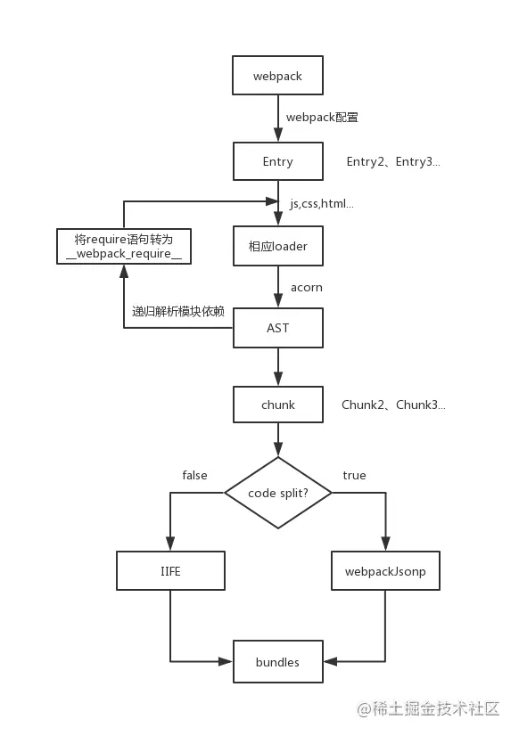
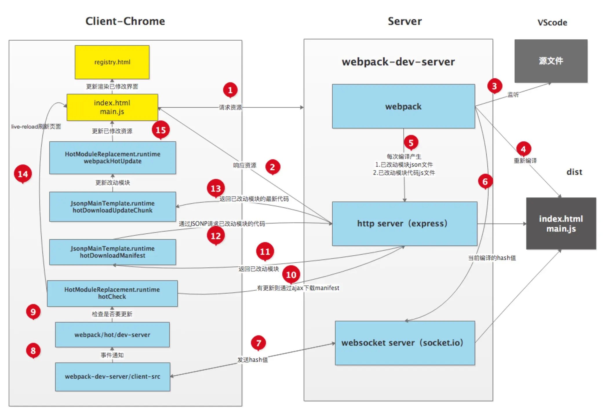

# Webpack

## ⚝webpack 是什么？

`webpack` 是一个现代 `JavaScript` 应用程序的**静态模块打包器**，当 `webpack` 处理应用程序时，会递归构建一个依赖关系图，其中包含应用程序需要的每个模块，然后将这些模块打包成一个或多个 `bundle`。

webpack主要实现的功能:

- **代码转换**(如: ES6转换ES5、sass和less转换为css等)
- **文件优化**(如: 将模块内容进行压缩)
- **代码分割**(如: 多页面应用公共模块的抽离、路由懒加载)
- **模块合并**(如: 按照不同的功能将多个模块合并为一个模块)
- **自动刷新**(如: 启动本地服务，代码更新后进行自动刷新)
- **代码校验**(如: 添加eslint进行代码规范检查)
- **自动发布**(如: 应用打包完成后，自动发布)


## webpack 的核心概念

- entry: 入口
- output: 输出
- loader: 模块转换器，用于把模块原内容按照需求转换成新内容
- 插件(plugins): 扩展插件，在webpack构建流程中的特定时机注入扩展逻辑来改变构建结果或做你想要做的事情

## webpack打包项目

新建一个文件夹，如: `webpack-first` (当然，你可以使用任意一个你喜欢的项目名)。推荐大家参考本文一步一步进行配置，不要总是在网上找什么最佳配置，你掌握了`webpack`之后，根据自己的需求配置出来的，就是最佳配置。

本篇文章对应的项目地址(编写本文时使用): [github.com/YvetteLau/w…](https://link.juejin.cn?target=https%3A%2F%2Fgithub.com%2FYvetteLau%2Fwebpack%2Ftree%2Fmaster%2Fwebpack-first)

使用 `npm init -y` 进行初始化(也可以使用 `yarn`)。

要使用 `webpack`，那么必然需要安装 `webpack`、`webpack-cli`:

```sh
npm install webpack webpack-cli -D
```

鉴于前端技术变更迅速，祭出本篇文章基于 `webpack` 的版本号:

```sh
├── webpack@4.41.5 
└── webpack-cli@3.3.10 
```

从 `wepack V4.0.0` 开始， `webpack` 是开箱即用的，在不引入任何配置文件的情况下就可以使用。

新建 `src/index.js` 文件，我们在文件中随便写点什么:

```js
//index.js
class Animal {
    constructor(name) {
        this.name = name;
    }
    getName() {
        return this.name;
    }
}

const dog = new Animal('dog');
```

使用 `npx webpack --mode=development` 进行构建，默认是 `production` 模式，我们为了更清楚得查看打包后的代码，使用 `development` 模式。

可以看到项目下多了个 `dist` 目录，里面有一个打包出来的文件 `main.js`。

## 将JS转义为低版本

将JS代码向低版本转换，我们需要使用 `babel-loader`。

首先安装一下 `babel-loader`

```
npm install babel-loader -D
```

此外，我们还需要配置 `babel`，为此我们安装一下以下依赖:

```
npm install @babel/core @babel/preset-env @babel/plugin-transform-runtime -D

npm install @babel/runtime @babel/runtime-corejs3
```

新建 `webpack.config.js`，如下:

```js
//webpack.config.js
module.exports = {
    module: {
        rules: [
            {
                test: /\.jsx?$/,
                use: ['babel-loader'],
                exclude: /node_modules/ //排除 node_modules 目录
            }
        ]
    }
}
```

建议给 `loader` 指定 `include` 或是 `exclude`，指定其中一个即可，因为 `node_modules` 目录通常不需要我们去编译，排除后，有效提升编译效率。

这里，我们可以在 `.babelrc` 中编写 `babel` 的配置，也可以在 `webpack.config.js` 中进行配置。

## Babel

### Babel是什么

　　Babel官网对Babel的定义就是：

> Babel 是一个 JavaScript 编译器。

　　用通俗的话解释就是它主要用于**将高版本的JavaScript代码转为向后兼容的JS代码**，从而能让我们的代码运行在更低版本的浏览器或者其他的环境中。

### Babel原理

大多数JavaScript Parser遵循 `estree` 规范，Babel 最初基于 `acorn` 项目(轻量级现代 JavaScript 解析器) Babel大概分为三大部分：

- 解析：将代码转换成 AST
  - 词法分析：将代码(字符串)分割为token流，即语法单元成的数组
  - 语法分析：分析token流(上面生成的数组)并生成 AST
- 转换：访问 AST 的节点进行变换操作生产新的 AST
  - [Taro](https://link.juejin.cn?target=https%3A%2F%2Fgithub.com%2FNervJS%2Ftaro%2Fblob%2Fmaster%2Fpackages%2Ftaro-transformer-wx%2Fsrc%2Findex.ts%23L15)就是利用 babel 完成的小程序语法转换
- 生成：以新的 AST 为基础生成代码

## Webpack构建流程

Webpack 的运行流程是一个串行的过程，从启动到结束会依次执行以下流程：

- `初始化参数`：从配置文件和 Shell 语句中读取与合并参数，得出最终的参数
- `开始编译`：用上一步得到的参数初始化 **Compiler 对象**，加载所有配置的插件，执行对象的 run 方法开始执行编译
- `确定入口`：根据配置中的 entry 找出所有的入口文件
- `编译模块`：从入口文件出发，调用所有配置的 **Loader** 对模块进行翻译，再找出该模块依赖的模块，再递归本步骤直到所有入口依赖的文件都经过了本步骤的处理
- `完成模块编译`：在经过第4步使用 Loader 翻译完所有模块后，得到了每个模块被翻译后的最终内容以及它们之间的依赖关系,最后将所有模块的 `require` 语句替换为 `__webpack_require__` 来模拟模块化操作；
- `输出资源`：根据入口和模块之间的依赖关系，组装成一个个包含多个模块的 Chunk，再把每个 Chunk 转换成一个单独的文件加入到输出列表，这步是可以修改输出内容的最后机会
- `输出完成`：在确定好输出内容后，根据配置确定输出的路径和文件名，把文件内容写入到文件系统

整个过程中`webpack`会通过**发布订阅模式**，向外抛出一些`hooks`，而`webpack`的**插件Plugin**即可通过监听这些关键的事件节点，执行插件任务进而达到干预输出结果的目的。

其中文件的解析与构建是一个比较复杂的过程，在`webpack`源码中主要依赖于`compiler`和`compilation`两个核心对象实现。

`compiler`对象是一个**全局单例**，他负责把控整个`webpack`打包的构建流程。 `compilation`对象是每一次构建的上下文对象，它包含了当次构建所需要的所有信息**，每次热更新和重新构建，`compiler`都会重新生成一个新的`compilation`对象，负责此次更新的构建过程**。

而每个模块间的依赖关系，则依赖于**`AST`语法树**。每个模块文件在通过`Loader`解析完成之后，会通过`acorn`库生成模块代码的`AST`语法树，通过语法树就可以分析这个模块是否还有依赖的模块，进而继续循环执行下一个模块的编译解析。




简单说

- 初始化：启动构建，读取与合并配置参数，加载 Plugin，实例化 Compiler
- 编译：从 Entry 出发，针对每个 Module 串行调用对应的 Loader 去翻译文件的内容，再找到该 Module 依赖的 Module，递归地进行编译处理
- 输出：将编译后的 Module 组合成 Chunk，将 Chunk 转换成文件，输出到文件系统中

## Webpack输出文件分析

这些输出并不是最新的，webpack5做出了 相当的精简。5：https://juejin.cn/post/6943468761575849992

通过分析webpack输出的bundle文件，了解bundle文件是如何在浏览器中运行的。

### 单文件分析

首先创建 `src/index.js` ，执行一个最简单的js语句：

```
  console.log('hello world')
```

创建 `webpack.config.js`， 配置如下：

```
  const path = require('path')

  module.exports = {
    mode: 'none',
    entry: './src/index.js',
    output: {
      path: path.resolve(__dirname, 'dist')
    }
  }
```

输出到dist文件夹中的 `main.js` 文件内容如下：

```
 (function(modules) { // webpackBootstrap
// 模块缓存
var installedModules = {};

// 模块加载函数
function __webpack_require__(moduleId) {

	// 如果加载过该模块，则直接从缓存中读取
	if(installedModules[moduleId]) {
		return installedModules[moduleId].exports;
	}
	// 创建新模块并将其缓存起来
	var module = installedModules[moduleId] = {
		i: moduleId,
		l: false,
		exports: {}
	};

	// 执行模块函数，设置module.exports
	modules[moduleId].call(module.exports, module, module.exports, __webpack_require__);

	// 将module标记为已加载
	module.l = true;

	// 返回设置好的module.exports
	return module.exports;
}


// 指向modules
__webpack_require__.m = modules;

// 指向缓存
__webpack_require__.c = installedModules;

// 定义exports的get方式
__webpack_require__.d = function(exports, name, getter) {
	if(!__webpack_require__.o(exports, name)) {
		Object.defineProperty(exports, name, { enumerable: true, get: getter });
	}
};

// 设置es6模块标记
__webpack_require__.r = function(exports) {
	if(typeof Symbol !== 'undefined' && Symbol.toStringTag) {
		Object.defineProperty(exports, Symbol.toStringTag, { value: 'Module' });
	}
	Object.defineProperty(exports, '__esModule', { value: true });
};

// create a fake namespace object
// mode & 1: value is a module id, require it
// mode & 2: merge all properties of value into the ns
// mode & 4: return value when already ns object
// mode & 8|1: behave like require
__webpack_require__.t = function(value, mode) {
	if(mode & 1) value = __webpack_require__(value);
	if(mode & 8) return value;
	if((mode & 4) && typeof value === 'object' && value && value.__esModule) return value;
	var ns = Object.create(null);
	__webpack_require__.r(ns);
	Object.defineProperty(ns, 'default', { enumerable: true, value: value });
	if(mode & 2 && typeof value != 'string') for(var key in value) __webpack_require__.d(ns, key, function(key) { return value[key]; }.bind(null, key));
	return ns;
};

// 兼容commonjs和es6模块
__webpack_require__.n = function(module) {
	var getter = module && module.__esModule ?
		function getDefault() { return module['default']; } :
		function getModuleExports() { return module; };
	__webpack_require__.d(getter, 'a', getter);
	return getter;
};

// Object.prototype.hasOwnProperty的封装
__webpack_require__.o = function(object, property) { return Object.prototype.hasOwnProperty.call(object, property); };

// webpack配置的publicpath
__webpack_require__.p = "";


// 加载模块并返回
return __webpack_require__(__webpack_require__.s = 0);
 })
/************************************************************************/
 ([
/* 0 */
/***/ (function(module, exports) {

console.log('hello world')

/***/ })
 ]);
```

可以看到输出的代码是个IIFE（立即执行函数），可以简化如下：

### ⚝简化打包后文件分析

由于打包后的文件比较繁琐， 这里我们简化一下打包后的文件

```js
(function(modules) {
    var installedModules = {}
    function __webpack_require__(moduleIid) {

    }
    return __webpack_require__(__webpack_require__.s = "./src/index.js")
})({
    "./src/index.js": (function(module, exports) {
    eval("console.log('test webpack entry')");
                    })
   })
```

从上面的代码可以看到，

1. 经过 `webpack` 打包后的代码通过一个 `IIFE` 自执行函数， 这个函数接收一个对象参数， 这个对象的 `key` 为入口文件的目录， `value`  是一个执行入口文件里面代码的函数
2. 这个对象作为参数 `modules` 传递给 `IIFE` 函数
3. `IIFE` 函数里面声明了一个变量 `installedModules` 用来存放缓存，  一个函数 `__webpack_require__`， 用来转化入口文件里面的代码
4. `IIFE` 最终把 `modules` 里面的的 `key` 传递给 `__webpack_require__` 函数并返回。

**`__webpack_require__` 分析**

```js
function (modules) {
    var installedModules = {}

    function __webpack_require__ (moduleId) {
        if(installedModules[moduleId]) {
            return installedModules[moduleId].exports
        }

        var module = installedModules[moduleId] = {
            i: moduleId,
            l:false,
            exports: {}
        }

        modules[moduleId].call(module.exports, module, module.exports, __webpack_require__)

        module.l = true

        return module.exports
    }
}
```

1. `__webpack_require__` 函数接收 `./src/index.js`
2. 首先检查缓存 `installedModules` 中是否包含 `key` 为 `./src/index.js` 的对象， 如果存在直接返回这个对象中的 `exports`
3. 当缓存中不存在入口模块的时候， 在缓存中生成一个对象并放到缓存中， 这个对象包括三个值： `i` `l` `exports`
4. 使用 `modules[moduleId].call` 调用 `IIFE` 参数的 `value` 函数， 并把 `value` 对应的函数中的 `this` 指向赋值给了 `module.exports`, 后面的 `call` 方法的后面三个参数为 `value` 对应函数的参数
5. 最后返回了 `module.exports`， 这里的 `module.exports` 在第四步的时候已赋值为 `IIFE` 参数对象中的 `value` 对应的函数。

所以可以看出来。 函数 `__webpack_require__`  实际返回的就是 `IIFE` 参数对象中的 `value` 对应的函数， 也就是 `eval("\nconsole.log('test webpack entry')\n\n\n//# sourceURL=webpack:///./src/index.js?")`，

当我们运行 `webpack` 打包后的文件的时候执行的是 `"console.log('test webpack entry')"`

> eval() 函数可计算某个字符串，并执行其中的的 JavaScript 代码。

### 多文件引用分析

在 `./src/` 下新建 `main.js`

```
module.exports = () => {
    console.log('main module')
}
```

在 `./src/index.js` 中引入 `main.js`

```
const main = reuiqre('./main.js')
console.log('webpack index entry')
main()
```

运行 `npx webpack` 打包后的文件

**`IIFE` 参数的变化**

```
(function (mudoles) {

})({
    './src/index.js': (function(module,exports, __webpack_require__) {
        eval("const main = __webpack_require__(/*! ./main.js */ \"./src/main.js\")\r\nconsole.log('test webpack entry')\r\n\n\n//# sourceURL=webpack:///./src/index.js?");
    }), 
    './src/main.js': (function(module, exports) {
        eval("console.log('main module')\n\n//# sourceURL=webpack:///./src/main.js?");
    })
})
```

如果入口文件中引用了其他模块的文件，将会把这些模块添加到 `IIFE` 的参数对象中， `key` 为模块的路径， `value` 执行该模块代码的函数。

**`IIFE` 函数执行逻辑的变化**

```
function (modules) {
    var installedModules = {}

    function __webpack_require__ (moduleId) {
        if (installedModules[moduleId]) {
            return installedMOdules[mudoleId].exports
        }

        var module = installedModuled[moduleId] = {
            i: moduleId,
            l: false,
            exports: {}
        }
        modules[moduleId].call(module.exports, module, module.exports, __webpack_require__)

        return module.exports
    }

    return __webpack_require__(__webpack_require__.s = "./src/index.js")
}
```

上面的代码中依旧返回了以 `./src/index.js` 为参数的函数。  但是函数里面的逻辑发生了改变。

1. 声明一个 `installedModules` 变量存放缓存

2. 将 `./src/index.js` 传入 `__webpack_require__` 函数

3. `./src/index.js` 不在缓存中， 往下执行

4. 声明一个 `module` 并在缓存中存放一以 `./src/index.js` 为 `key` 的对象

5. 调用  

   ```
   modules[moduleId]
   ```

    函数，并指明 作用域和参数 也就是

   ```
   function(module,exports, __webpack_require__) {
           eval("const main = __webpack_require__(/*! ./main.js */ \"./src/main.js\")\r\nconsole.log('test webpack entry')\r\n\n\n//# sourceURL=webpack:///./src/index.js?")}
   ```

6. 返回 `module.exports`, 由于在第五步调用 `modules['./src/index.js']` 函数的时候， 已经把 `module.exports` 作为了函数的 `this` 作用域， 所以这时 `module.exports` 实际就是 `modules['./src/index.js']` 执行的函数。

7. 在上面的函数中， `eval` 代码中使用了一个函数 `__webpack_require__`, 这个函数就是在第五步 `modules[moduleId].call(module.exports, module, module.exports, __webpack_require__)` 的最后一个参数 `__webpack_require__`, 这时继续调用 `__webpack__require__` 函数并传入 `./src/main.js`

8. `./src/main.js` 传入 `__webpack_require__` 中， 依旧不在缓存， 再次声明一个变量 `module` 并在缓存中新增一个 `key` 为 `./src/main.js` 的对象。

9. ```
   modules[moduleId].call
   ```

    这时调用 

   ```
   IIFE
   ```

    参数对象中 

   ```
   key
   ```

    为 

   ```
   ./src/main.js
   ```

    的函数:

   ```
        (function(module, exports) {
           eval("console.log('main module')\n\n//# sourceURL=webpack:///./src/main.js?");
       })
   ```

10. 返回 `module.export`, 同第6步相似这时的 `module.exports` 就是 `modules[./src/main.js]` 对应的函数。

11. 返回的最终结果就是(去除了 `eval` 和注释)：

```
    const main = console.log('main module')
    console.log(test webpack entry)
```

### 异步加载分析

入口主文件加载异步模块的大概流程：

1. 执行	`__webpack_require__.e` 加载异步模块；
2. 创建chunkid对应的script标签加载脚本，并返回promise；
3. 如果加载失败，reject掉promise；如果加载成功，异步chunk立即执行 `window[webpackJsonp]` 的push方法，将模块标记为已加载，并resolve掉相应的promise；
4. 成功后可在 `__webpack_require__.e().then` 中以同步的方式加载模块。

### 输出文件总结

在webpack输出的文件中，通过IIFE的形式将所有模块作为参数都传递进来，用 `__webpack_require__` 模拟import或者require语句，然后从入口模块开始依次递归的执行加载模块，需要异步加载的模块，通过在dom上插入一个新的script标签加载。并且内部对模块加载做了缓存处理优化。

在实际的项目中，输出的bundle内容会远比本文中的demo复杂的多，并且会有chunkId设置，公共chunk抽取，代码压缩混淆等优化


## sourceMap

使用：

```javascript
module.exports = {
	mode: 'development',
	devtool: 'eval-source-map',
	// devtool: false,   // 不想使用的情况下可以使用false
}
```

`sourceMap`是一项将编译、打包、压缩后的**代码映射回源代码**的技术，由于打包压缩后的代码并没有阅读性可言，一旦在开发中报错或者遇到问题，直接在混淆代码中`debug`问题会带来非常糟糕的体验，`sourceMap`可以帮助我们快速定位到源代码的位置，提高我们的开发效率。`sourceMap`其实并不是`Webpack`特有的功能，而是`Webpack`支持`sourceMap`，像`JQuery`也支持`souceMap`。

既然是一种源码的映射，那必然就需要有一份映射的文件，来**标记混淆代码里对应的源码的位置**，通常这份映射文件以`.map`结尾，里边的数据结构大概长这样：

```js
{
  "version" : 3,                          // Source Map版本
  "file": "out.js",                       // 输出文件（可选）
  "sourceRoot": "",                       // 源文件根目录（可选）
  "sources": ["foo.js", "bar.js"],        // 源文件列表
  "sourcesContent": [null, null],         // 源内容列表（可选，和源文件列表顺序一致）
  "names": ["src", "maps", "are", "fun"], // mappings使用的符号名称列表
  "mappings": "A,AAAB;;ABCDE;"            // 带有编码映射数据的字符串
}
```

其中`mappings`数据有如下规则：

- 生成文件中的一行的每个组用“;”分隔；
- 每一段用“,”分隔；
- 每个段由1、4或5个可变长度字段组成；

有了这份映射文件，我们只需要在我们的压缩代码的最末端加上这句注释，即可让sourceMap生效：

```js
//# sourceURL=/path/to/file.js.map
```

有了这段注释后，浏览器就会通过`sourceURL`去获取这份映射文件，通过解释器解析后，实现源码和混淆代码之间的映射。因此sourceMap其实也是一项需要浏览器支持的技术。

如果我们仔细查看webpack打包出来的bundle文件，就可以发现在默认的`development`开发模式下，每个`_webpack_modules__`文件模块的代码最末端，都会加上`//# sourceURL=webpack://file-path?`，从而实现对sourceMap的支持。


## Webpack Chunk 分包规则

webpack 实现中，原始的资源模块以 `Module` 对象形式存在、流转、解析处理。

而 `Chunk` 则是输出产物的基本组织单位，在生成阶段 webpack 按规则将 `entry` 及其它 `Module` 插入 `Chunk` 中，之后再由 `SplitChunksPlugin` 插件根据优化规则与 `ChunkGraph` 对 `Chunk` 做一系列的变化、拆解、合并操作，重新组织成一批性能(可能)更高的 `Chunks` 。运行完毕之后 webpack 继续将 `chunk` 一一写入物理文件中，完成编译工作。

综上，`Module` 主要作用在 webpack 编译过程的前半段，解决原始资源“**如何读**”的问题；而 Chunk 对象则主要作用在编译的后半段，解决编译产物“**如何写**”的问题，两者合作搭建起 webpack 搭建主流程

Webpack 4 之后编译过程大致上可以拆解为四个阶段


在构建(make) 阶段，webpack 从 entry 出发根据模块间的引用关系(require/import) 逐步构建出模块依赖关系图([ModuleDependencyGraph](https://link.juejin.cn?target=https%3A%2F%2Fmp.weixin.qq.com%2Fs%2Fkr73Epnn6wAx9DH7KRVUaA))，依赖关系图表达了模块与模块之间互相引用的先后次序，基于这种次序 webpack 就可以推断出模块运行之前需要先执行那些依赖模块，也就可以进一步推断出那些模块应该打包在一起，那些模块可以延后加载(异步执行)

到了生成(seal) 阶段，webpack 会根据模块依赖图的内容组织分包 —— Chunk 对象，默认的分包规则有：

- 同一个 `entry` 下触达到的模块组织成一个 chunk
- 异步模块单独组织为一个 chunk
- `entry.runtime` 单独组织成一个 chunk

默认规则集中在 `compilation.seal` 函数实现，seal 核心逻辑运行结束后会生成一系列的 `Chunk`、`ChunkGroup`、`ChunkGraph` 对象，后续如 `SplitChunksPlugin` 插件会在 `Chunk` 系列对象上做进一步的拆解、优化，最终反映到输出上才会表现出复杂的分包结果。

## 是否写过Loader？简单描述一下编写loader的思路？

从上面的打包代码我们其实可以知道，`Webpack`最后打包出来的成果是一份`Javascript`代码，实际上在`Webpack`内部默认也只能够处理`JS`模块代码，在打包过程中，会默认把所有遇到的文件都当作 `JavaScript`代码进行解析，因此当项目存在非`JS`类型文件时，我们需要先对其进行**必要的转换**，才能继续执行打包任务，这也是`Loader`机制存在的意义。

`Loader`的配置使用我们应该已经非常的熟悉：

```js
// webpack.config.js
module.exports = {
  // ...other config
  module: {
    rules: [
      {
        test: /^your-regExp$/,
        use: [
          {
             loader: 'loader-name-A',
          }, 
          {
             loader: 'loader-name-B',
          }
        ]
      },
    ]
  }
}
```

通过配置可以看出，针对每个文件类型，`loader`是支持以数组的形式配置多个的，因此当`Webpack`在转换该文件类型的时候，会按顺序**链式调用**每一个`loader`，前一个`loader`返回的内容会作为下一个`loader`的入参。因此`loader`的开发需要遵循一些规范，比如返回值必须是标准的`JS`代码字符串，以保证下一个`loader`能够正常工作，同时在开发上需要严格遵循“单一职责”，**只关心`loader`的输出以及对应的输出**。

### ⚝同步loader

　　loader默认导出一个**函数**，接受匹配到的文件资源字符串和SourceMap，我们可以修改文件内容字符串后再返回给下一个loader进行处理，因此最简单的一个loader如下：

```js
module.exports = function(source, map){
    return source
}
```

> 导出的`loader函数`不能使用箭头函数，很多loader内部的属性和方法都需要通过`this`进行调用，比如`this.cacheable()`来进行缓存、`this.sourceMap`判断是否需要生成sourceMap等。

　　我们在项目中创建一个loader文件夹，用来存放我们自己写的loader，然后新建我们自己的style-loader：

```js
//loader/style-loader.js
function loader(source, map) {
  let style = `
    let style = document.createElement('style');
    style.innerHTML = ${JSON.stringify(source)};
    document.head.appendChild(style)
  `;
  return style;
}
module.exports = loader;
```

　　这里的`source`就可以看做是处理后的css文件字符串，我们把它通过style标签的形式插入到head中；同时我们也发现最后返回的是一个JS代码的字符串，webpack最后会将返回的字符串打包进模块中。

### 异步loader

　　上面的`style-loader`都是同步操作，我们在处理source时，有时候会进行异步操作，一种方法是通过async/await，阻塞操作执行；另一种方法可以通过loader**本身提供的回调函数`callback`**。

```js
//loader/less-loader
const less = require("less");
function loader(source) {
  const callback = this.async();
  less.render(source, function (err, res) {
    let { css } = res;
    callback(null, css);
  });
}
module.exports = loader;
```

　　callback的详细传参方法如下：

```js
callback({
    //当无法转换原内容时，给 Webpack 返回一个 Error
    error: Error | Null,
    //转换后的内容
    content: String | Buffer,
    //转换后的内容得出原内容的Source Map（可选）
    sourceMap?: SourceMap,
    //原内容生成 AST语法树（可选）
    abstractSyntaxTree?: AST 
})
```

　　有些时候，除了将原内容转换返回之外，还需要返回原内容对应的Source Map，比如我们转换less和scss代码，以及babel-loader转换ES6代码，为了方便调试，需要将Source Map也一起随着内容返回。

```js
//loader/less-loader
const less = require("less");
function loader(source) {
  const callback = this.async();
  less.render(source,{sourceMap: {}}, function (err, res) {
    let { css, map } = res;
    callback(null, css, map);
  });
}
module.exports = loader;
```

　　这样我们在下一个loader就能接收到less-loader返回的sourceMap了，但是需要注意的是：

> Source Map生成很耗时，通常在开发环境下才会生成Source Map，其它环境下不用生成。Webpack为loader提供了`this.sourceMap`这个属性来告诉loader当前构建环境用户是否需要生成Source Map。


## 是否写过Plugin？简单描述一下编写plugin的思路？

详细： https://juejin.cn/post/6888936770692448270#heading-8

**如果说Loader负责文件转换，那么Plugin便是负责功能扩展**。`Loader`和`Plugin`作为`Webpack`的两个重要组成部分，承担着两部分不同的职责。

上文已经说过，`webpack`基于**发布订阅模式**，**在运行的生命周期中会广播出许多事件，插件通过监听这些事件，就可以在特定的阶段执行自己的插件任务，从而实现自己想要的功能。**

既然基于发布订阅模式，那么知道`Webpack`到底提供了哪些事件钩子供插件开发者使用是非常重要的，上文提到过`compiler`和`compilation`是`Webpack`两个非常核心的对象，其中`compiler`暴露了和 `Webpack`整个生命周期相关的钩子（[compiler-hooks](https://link.juejin.cn?target=https%3A%2F%2Fwebpack.js.org%2Fapi%2Fcompiler-hooks%2F)），而`compilation`则暴露了与模块和依赖有关的粒度更小的事件钩子（[Compilation Hooks](https://link.juejin.cn?target=https%3A%2F%2Fwebpack.js.org%2Fapi%2Fcompilation-hooks%2F)）。

`Webpack`的事件机制基于`webpack`自己实现的一套`Tapable`事件流方案（[github](https://link.juejin.cn?target=https%3A%2F%2Fgithub.com%2Fwebpack%2Ftapable)）

```js
// Tapable的简单使用
const { SyncHook } = require("tapable");

class Car {
    constructor() {
        // 在this.hooks中定义所有的钩子事件
        this.hooks = {
            accelerate: new SyncHook(["newSpeed"]),
            brake: new SyncHook(),
            calculateRoutes: new AsyncParallelHook(["source", "target", "routesList"])
        };
    }

    /* ... */
}


const myCar = new Car();
// 通过调用tap方法即可增加一个消费者，订阅对应的钩子事件了
myCar.hooks.brake.tap("WarningLampPlugin", () => warningLamp.on());
```

`Plugin`的开发和开发`Loader`一样，需要遵循一些开发上的规范和原则：

- **插件必须是一个函数或者是一个包含 `apply` 方法的对象，这样才能访问`compiler`实例**；
- 传给每个插件的 `compiler` 和 `compilation` 对象都是同一个引用，若在一个插件中修改了它们身上的属性，会影响后面的插件;
- 异步的事件需要在插件处理完任务时调用回调函数通知 `Webpack` 进入下一个流程，不然会卡住;

了解了以上这些内容，想要开发一个 `Webpack Plugin`，其实也并不困难。

```js
class MyPlugin {
  apply (compiler) {
    // 找到合适的事件钩子，实现自己的插件功能
    compiler.hooks.emit.tap('MyPlugin', compilation => {
        // compilation: 当前打包构建流程的上下文
        console.log(compilation);
        
        // do something...
    })
  }
}
```

## ⚝Loader和Plugin的区别

`Loader` **本质就是一个函数**，在该函数中对接收到的内容进行转换，返回转换后的结果。 因为 Webpack 只认识 JavaScript，所以 Loader 就成了翻译官，对其他类型的资源进行转译的预处理工作。

`Plugin` **就是插件**，基于事件流框架 `Tapable`，插件可以扩展 Webpack 的功能，**在 Webpack 运行的生命周期中会广播出许多事件，Plugin 可以监听这些事件，在合适的时机通过 Webpack 提供的 API 改变输出结果。**

`Loader` 在 module.rules 中配置，作为模块的解析规则，类型为数组。每一项都是一个 Object，内部包含了 test(类型文件)、loader、options (参数)等属性。

`Plugin` 在 plugins 中单独配置，类型为数组，每一项是一个 Plugin 的实例，参数都通过构造函数传入。

## Webpack 的热更新原理

刷新我们一般分为两种：

- 一种是页面刷新，不保留页面状态，就是简单粗暴，直接`window.location.reload()`。
- 另一种是基于`WDS (Webpack-dev-server)`的模块热替换，只需要局部刷新页面上发生变化的模块，同时可以保留当前的页面状态，比如复选框的选中状态、输入框的输入等。

`HMR`作为一个`Webpack`内置的功能，可以通过`HotModuleReplacementPlugin`或`--hot`开启。

在启动开发服务的时候，在 webpack 的配置文件中配置 `devServe` 属性，即可开启热更新模式。

```javascript
// webpack.config.js
module.exports = {
...
  devServer: {
    hot: true, // 开启热更新
    port: 8080, // 指定服务器端口号
  },
...
}
```



如上图所示，右侧`Server`端使用`webpack-dev-server`去启动本地服务，内部实现主要使用了`webpack`、`express`、`websocket`。

- 使用`express`启动本地服务，当浏览器访问资源时对此做响应。
- 服务端和客户端使用`websocket`实现长连接
- `webpack`监听源文件的变化，即当开发者保存文件时触发`webpack`的重新编译。
  - 每次编译都会生成`hash值`、`已改动模块的json文件`、`已改动模块代码的js文件`
  - 编译完成后通过`socket`向客户端推送当前编译的`hash戳`
- 客户端的`websocket`监听到有文件改动推送过来的`hash戳`，会和上一次对比
  - 一致则走缓存
  - 不一致则通过`ajax`和`jsonp`向服务端获取最新资源
- 使用`内存文件系统`去替换有修改的内容实现局部刷新

### ⚝总结

HMR的核心就是客户端从服务端拉去更新后的文件，准确的说是 **chunk diff** (chunk 需要更新的部分)，**实际上 WDS 与浏览器之间维护了一个 Websocket，当本地资源发生变化时，WDS 会向浏览器推送更新，并带上构建时的 hash，让客户端与上一次资源进行对比。**客户端对比出差异后会向 WDS **发起 Ajax 请求来获取更改内容**(文件列表、hash)，这样客户端就可以再借助这些信息继续向 WDS 发起 `jsonp` 请求获取该chunk的增量更新。

后续的部分(拿到增量更新之后如何处理？哪些状态该保留？哪些又需要更新？)由 `HotModulePlugin` 来完成，提供了相关 API 以供开发者针对自身场景进行处理，像`react-hot-loader` 和 `vue-loader` 都是借助这些 API 实现 HMR。

## 有哪些常见的Loader？你用过哪些Loader？

`raw-loader`：加载文件原始内容（utf-8）

`file-loader`：把文件输出到一个文件夹中，在代码中通过相对 URL 去引用输出的文件 (处理图片和字体)

`url-loader`：与 file-loader 类似，区别是用户可以设置一个阈值，大于阈值会交给 file-loader 处理，小于阈值时返回文件 base64 形式编码 (处理图片和字体)

`source-map-loader`：加载额外的 Source Map 文件，以方便断点调试

`svg-inline-loader`：将压缩后的 SVG 内容注入代码中

`image-loader`：加载并且压缩图片文件

`json-loader` 加载 JSON 文件（默认包含）

`handlebars-loader`: 将 Handlebars 模版编译成函数并返回

`babel-loader`：把 ES6 转换成 ES5

`ts-loader`: 将 TypeScript 转换成 JavaScript

`awesome-typescript-loader`：将 TypeScript 转换成 JavaScript，性能优于 ts-loader

`sass-loader`：将SCSS/SASS代码转换成CSS

`css-loader`：加载 CSS，支持模块化、压缩、文件导入等特性

`style-loader`：把 CSS 代码注入到 JavaScript 中，通过 DOM 操作去加载 CSS

`postcss-loader`：扩展 CSS 语法，使用下一代 CSS，可以配合 autoprefixer 插件自动补齐 CSS3 前缀

`eslint-loader`：通过 ESLint 检查 JavaScript 代码

`tslint-loader`：通过 TSLint检查 TypeScript 代码

`mocha-loader`：加载 Mocha 测试用例的代码

`coverjs-loader`：计算测试的覆盖率

`vue-loader`：加载 Vue.js 单文件组件

`i18n-loader`: 国际化

`cache-loader`: 可以在一些性能开销较大的 Loader 之前添加，目的是将结果缓存到磁盘里

## 有哪些常见的Plugin？你用过哪些Plugin？

**webpack-bundle-analyzer**： 可视化 Webpack 输出文件的体积 (业务组件、依赖第三方模块)

**babel-plugin-component**:按需引入

`define-plugin`：定义环境变量 (Webpack4 之后指定 mode 会自动配置)

**ignore-plugin**：忽略部分文件

**html-webpack-plugin**：简化 HTML 文件创建 (依赖于 html-loader)

`web-webpack-plugin`：可方便地为单页应用输出 HTML，比 html-webpack-plugin 好用

`uglifyjs-webpack-plugin`：不支持 ES6 压缩 (Webpack4 以前)

`terser-webpack-plugin`: 支持压缩 ES6 (Webpack4)

`webpack-parallel-uglify-plugin`: 多进程执行代码压缩，提升构建速度

`mini-css-extract-plugin`: 分离样式文件，CSS 提取为独立文件，支持按需加载 (替代extract-text-webpack-plugin)

`serviceworker-webpack-plugin`：为网页应用增加离线缓存功能

`clean-webpack-plugin`: 目录清理

`ModuleConcatenationPlugin`: 开启 Scope Hoisting

`speed-measure-webpack-plugin`: 可以看到每个 Loader 和 Plugin 执行耗时 (整个打包耗时、每个 Plugin 和 Loader 耗时)

## 文件指纹是什么？怎么用？(hash)

文件指纹是打包后输出的文件名的后缀。

- `Hash`：和整个项目的构建相关，只要**项目文件**有修改，整个项目构建的 hash 值就会更改
- `Chunkhash`：和 Webpack 打包的 **chunk** 有关，不同的 entry 会生出不同的 chunkhash
- `Contenthash`：根据**文件内容**来定义 hash，文件内容不变，则 contenthash 不变

### JS的文件指纹设置

设置 output 的 filename，用 chunkhash。

```css
module.exports = {
    entry: {
        app: './scr/app.js',
        search: './src/search.js'
    },
    output: {
        filename: '[name][chunkhash:8].js',
        path:__dirname + '/dist'
    }
}
复制代码
```

### CSS的文件指纹设置

设置 MiniCssExtractPlugin 的 filename，使用 contenthash。

```css
module.exports = {
    entry: {
        app: './scr/app.js',
        search: './src/search.js'
    },
    output: {
        filename: '[name][chunkhash:8].js',
        path:__dirname + '/dist'
    },
    plugins:[
        new MiniCssExtractPlugin({
            filename: `[name][contenthash:8].css`
        })
    ]
}
```

### 图片的文件指纹设置

设置file-loader的name，使用hash。

占位符名称及含义

- ext 资源后缀名
- name 文件名称
- path 文件的相对路径
- folder 文件所在的文件夹
- contenthash 文件的内容hash，默认是md5生成
- hash 文件内容的hash，默认是md5生成
- emoji 一个随机的指代文件内容的emoj

```css
const path = require('path');

module.exports = {
    entry: './src/index.js',
    output: {
        filename:'bundle.js',
        path:path.resolve(__dirname, 'dist')
    },
    module:{
        rules:[{
            test:/\.(png|svg|jpg|gif)$/,
            use:[{
                loader:'file-loader',
                options:{
                    name:'img/[name][hash:8].[ext]'
                }
            }]
        }]
    }
}
```

## 体积优化策略

```
Tree-shaking
公共资源分离
图片压缩
动态polyfill
```

### Tree-shaking

Tree-shaking是webpack内置的一个优化，主要功能就是去除没有用到代码。

这部分代码也被称为Dead Code, Dead Code 一般具有以下几个特征

- 代码不会被执行，不可到达
- 代码执行的结果不会被用到
- 代码只会影响死变量（只写不读）

Tree-shaking主要依赖于ES6的模块化import和export，我们都知道ES6的module只能是顶层出现，和运行时无关，不能运行时加载。如果是require，需要执行后才知道有没有引用，就无法进行Tree-shaking。

ES6 module 特点：

- 只能作为模块顶层的语句出现
- import 的模块名只能是字符串常量
- import binding 是 immutable的

在webpack5中已经自带tree-shaking功能，在打包模式为`production`时，默认开启 tree-shaking功能。

### HappyPack

webpack中最耗时的就是loader的转换过程，转换的流程很长。happypack的原理就是把这部分的任务拆解成多个子进程去并行处理，减少构建时间。

通过new HappyPack()实例化，然后把任务交由实例统一调度分配。核心调度器会将一个个任务分配给空闲的子进程。处理完毕后发送给核心调度器。


## webpack性能优化

- 使用`高版本`的 Webpack 和 Node.js
- `多进程/多实例构建`：HappyPack(不维护了)、thread-loader
- `压缩代码`
  - 多进程并行压缩
    - webpack-paralle-uglify-plugin
    - uglifyjs-webpack-plugin 开启 parallel 参数 (不支持ES6)
    - terser-webpack-plugin 开启 parallel 参数
  - 通过 mini-css-extract-plugin 提取 Chunk 中的 CSS 代码到单独文件，通过 css-loader 的 minimize 选项开启 cssnano 压缩 CSS。
- `图片压缩`
  - 使用基于 Node 库的 imagemin (很多定制选项、可以处理多种图片格式)
  - 配置 image-webpack-loader
- `缩小打包作用域`：
  - exclude/include (确定 loader 规则范围)
  - resolve.modules 指明第三方模块的绝对路径 (减少不必要的查找)
  - resolve.mainFields 只采用 main 字段作为入口文件描述字段 (减少搜索步骤，需要考虑到所有运行时依赖的第三方模块的入口文件描述字段)
  - resolve.extensions 尽可能减少后缀尝试的可能性
  - noParse 对完全不需要解析的库进行忽略 (不去解析但仍会打包到 bundle 中，注意被忽略掉的文件里不应该包含 import、require、define 等模块化语句)
  - IgnorePlugin (完全排除模块)
  - 合理使用alias
- `提取页面公共资源`：
  - 基础包分离：
    - 使用 html-webpack-externals-plugin，将基础包通过 CDN 引入，不打入 bundle 中
    - 使用 SplitChunksPlugin 进行(公共脚本、基础包、页面公共文件)分离(Webpack4内置) ，替代了 CommonsChunkPlugin 插件
- `DLL`：
  - 使用 DllPlugin 进行分包，使用 DllReferencePlugin(索引链接) 对 manifest.json 引用，让一些基本不会改动的代码先打包成静态资源，避免反复编译浪费时间。
  - HashedModuleIdsPlugin 可以解决模块数字id问题
- `充分利用缓存提升二次构建速度`：
  - babel-loader 开启缓存
  - terser-webpack-plugin 开启缓存
  - 使用 cache-loader 或者 hard-source-webpack-plugin
- `Tree shaking`
  - 打包过程中检测工程中没有引用过的模块并进行标记，在资源压缩时将它们从最终的bundle中去掉(只能对ES6 Modlue生效) 开发中尽可能使用ES6 Module的模块，提高tree shaking效率
  - 禁用 babel-loader 的模块依赖解析，否则 Webpack 接收到的就都是转换过的 CommonJS 形式的模块，无法进行 tree-shaking
  - 使用 PurifyCSS(不在维护) 或者 uncss 去除无用 CSS 代码
    - purgecss-webpack-plugin 和 mini-css-extract-plugin配合使用(建议)
- `Scope hoisting`
  - 构建后的代码会存在大量闭包，造成体积增大，运行代码时创建的函数作用域变多，内存开销变大。Scope hoisting 将所有模块的代码按照引用顺序放在一个函数作用域里，然后适当的重命名一些变量以防止变量名冲突
  - 必须是ES6的语法，因为有很多第三方库仍采用 CommonJS 语法，为了充分发挥 Scope hoisting 的作用，需要配置 mainFields 对第三方模块优先采用 jsnext:main 中指向的ES6模块化语法
- `动态Polyfill`
  - 建议采用 polyfill-service 只给用户返回需要的polyfill，社区维护。 (部分国内奇葩浏览器UA可能无法识别，但可以降级返回所需全部polyfill)


## webpack搭建多页面


#### 配置文件配置

**多入口配置 多个键值对**

```javascript
module.exports = {
  entry: {
    page1: "./src/pages/page1/index.jsx",
    page2: "./src/pages/page2/index.jsx",
    // ...
  },
};
```

**输出配置 path.resolve**

```javascript
module.exports = {
  entry: {
    page1: "./src/pages/page1/index.jsx",
    page2: "./src/pages/page2/index.jsx",
    // ...
  },
  output: {
    path: path.resolve(__dirname, "./dist"),
    filename: "[name]/index.js",
  },
};
```

**配置多个 html-webpack-plugin，指定chunks**

```js
module.exports = {
  ...
  plugins: [
    new HtmlWebpackPlugin({
      filename: 'page1/index.html',
      chunks: ['page1']
    }),
    new HtmlWebpackPlugin({
      filename: 'page2/index.html',
      chunks: ['page2']
    }),
  ],
}
```

#### 每个页面分别编辑


## 网络教程

[官方指南](https://www.webpackjs.com/guides/) 还得是官方教程

[codewhy webpack基础配置](https://www.bilibili.com/video/BV17j411f74d?p=77)

[一看就懂之webpack基础配置](https://juejin.cn/post/6844904176502177805#heading-11)

以上是未用vue cli时对webpack的配置，详细配置是在webpack.config.js中完成，以下是在vue cli 中对webpack进行配置，配置是在vue.config.js中完成。

[webpack 相关](https://cli.vuejs.org/zh/guide/webpack.html#webpack-%E7%9B%B8%E5%85%B3:~:text=ads%20via%20Carbon-,webpack%20%E7%9B%B8%E5%85%B3,-%23)

[vue.config中configureWebpack 与 chainWebpack区别](https://www.jianshu.com/p/27d82d98a041)

[我曾为配置 webpack 感到痛不欲生，直到我遇到了 webpack-chain](https://juejin.cn/post/6950076780669566983)


# Vite

## 当前工程化痛点

现在常用的构建工具如`Webpack`，主要是通过抓取-编译-构建整个应用的代码（也就是常说的打包过程），生成一份编译、优化后能良好兼容各个浏览器的的生产环境代码。在开发环境流程也基本相同，需要先将整个应用构建打包后，再把打包后的代码交给`dev server`（开发服务器）。

`Webpack`等构建工具的诞生给前端开发带来了极大的便利，但随着前端业务的复杂化，js代码量呈指数增长，打包构建时间越来越久，`dev server`（开发服务器）性能遇到瓶颈：

- **缓慢的服务启动：** 大型项目中`dev server`启动时间达到几十秒甚至几分钟。
- **缓慢的HMR热更新：** 即使采用了 HMR 模式，其热更新速度也会随着应用规模的增长而显著下降，已达到性能瓶颈，无多少优化空间。

**缓慢的开发环境，大大降低了开发者的幸福感，在以上背景下`Vite`应运而生。**

------

## ⚝什么是Vite？

**基于esbuild与Rollup，依靠浏览器自身ESM编译功能， 实现极致开发体验的新一代构建工具！**

### 概念

先介绍以下文中会经常提到的一些基础概念：

- **依赖：** 指开发不会变动的部分(npm包、UI组件库)，**esbuild进行预构建**。esbuild 使用 **Go 编写**，并且比以 JavaScript 编写的打包器预构建依赖快 10-100 倍；
- **源码：** 浏览器不能直接执行的非js代码(.jsx、.css、.vue等)，vite**只在浏览器请求相关源码的时候进行转换**，**以提供ESM源码**。

### 开发环境

- 利用浏览器原生的`ES Module`编译能力，省略费时的编译环节，直给浏览器开发环境源码，`dev server`只提供轻量服务。
- 浏览器执行ESM的`import`时，会向`dev server`发起该模块的`ajax`请求，服务器对源码做简单处理后返回给浏览器。
- `Vite`中HMR是在原生 ESM 上执行的。当编辑一个文件时，Vite 只需要精确地使已编辑的模块失活，使得无论应用大小如何，HMR 始终能保持快速更新。
- 使用`esbuild`处理项目依赖，`esbuild`使用go编写，比一般`node.js`编写的编译器快几个数量级。

### 生产环境

- 集成`Rollup`**打包**生产环境代码，依赖其成熟稳定的生态与更简洁的插件机制。

在**开发环境（Development）** 下基于浏览器原生 `ES Module` 开发，完全跳过了打包这个概念；

在**生产环境（Production）** 下基于 `Rollup` 打包来构建代码。

### 处理流程对比

`Webpack`通过先将整个应用打包，再将打包后代码提供给`dev server`，开发者才能开始开发。


Vite 通过原生 ES Modules 托管源代码，本质上是让浏览器来接管部分打包器的工作。Vite 只会在浏览器请求发生时，按需将源码转成 ES Modules 格式返回给浏览器，由浏览器加载并执行 ES Modules 文件。


------

## 基本用法

### 创建vite项目

```
1$ npm create vite@latest
```

### 选取模板

`Vite` 内置6种常用模板与对应的TS版本，可满足前端大部分开发场景，可以点击下列表格中模板直接在 [StackBlitz](https://vite.new/) 中在线试用，还有其他更多的 [社区维护模板](https://github.com/vitejs/awesome-vite#templates)可以使用。

| JavaScript                          | TypeScript                                |
| ----------------------------------- | ----------------------------------------- |
| [vanilla](https://vite.new/vanilla) | [vanilla-ts](https://vite.new/vanilla-ts) |
| [vue](https://vite.new/vue)         | [vue-ts](https://vite.new/vue-ts)         |
| [react](https://vite.new/react)     | [react-ts](https://vite.new/react-ts)     |
| [preact](https://vite.new/preact)   | [preact-ts](https://vite.new/preact-ts)   |
| [lit](https://vite.new/lit)         | [lit-ts](https://vite.new/lit-ts)         |
| [svelte](https://vite.new/svelte)   | [svelte-ts](https://vite.new/svelte-ts)   |

### 启动

```
1{
2  "scripts": {
3    "dev": "vite", // 启动开发服务器，别名：`vite dev`，`vite serve`
4    "build": "vite build", // 为生产环境构建产物
5    "preview": "vite preview" // 本地预览生产构建产物
6  }
7}
```

------

## ⚝实现原理

### ESbuild 编译

`esbuild` 使用go编写，cpu密集下更具性能优势，编译速度更快，以下摘自官网的构建速度对比：


### 依赖预构建

- **模块化兼容：** 如开头背景所写，现仍共存多种模块化标准代码，`Vite`在预构建阶段将依赖中各种其他模块化规范(CommonJS、UMD)转换 成ESM，以提供给浏览器。
- **性能优化：** npm包中大量的ESM代码，大量的`import`请求，会造成网络拥塞。`Vite`使用`esbuild`，将有大量内部模块的ESM关系转换成单个模块，以减少 `import`模块请求次数。

### 按需加载

- 服务器只在接受到import请求的时候，才会编译对应的文件，将ESM源码返回给浏览器，实现真正的按需加载。

### 缓存

- **HTTP缓存：** 充分利用`http`缓存做优化，依赖（不会变动的代码）部分用max-age,immutable **强缓存**，源码部分用304**协商缓存**，提升页面打开速度。
- **文件系统缓存：** `Vite`在预构建阶段，将构建后的依赖缓存到`node_modules/.vite` ，相关配置更改时，或手动控制时才会重新构建，以提升预构建速度。

### 热更新

在基于 Bundle 构建的构建器中，当一个文件变动时，重新构建整个 Bundle 文件是非常低效的，且随着应用规模的上升，构建速度会直线下降。

传统的构建器虽然提供了热更新的能力，但是也会存在随着应用规模上升，热更新速度显著下降的问题。

**Vite 基于 ESM 按需提供源码文件**，当一个文件被编辑后，Vite 只会重新编译并提供该文件。因此，无论项目规模多大，Vite 的热更新都可以保持快速更新。

此外，**Vite 合理利用浏览器缓存来加速页面加载**，源码模块请求根据 `304 Not Modified` 进行协商缓存；依赖模块请求通过 `Cache-Control: max-age=31536000,immutable `进行强缓存，因此一旦缓存，不会再次请求。

### 生产环境仍需打包

在生产环境使用 ESM 会存在大量额外网络请求问题，因此生产环境不太试用 ESM，最好的方式还是代码进行 tree-shaking、懒加载、和 chunk 分隔等。

那么生产环境的构建为什么不直接使用 esbuild，而是**使用 rollup** 呢？这是因为 esbuild 在代码分隔、css 处理等方面的功能仍在开发中，rollup 在应用打包方面更加的成熟且灵活。


### 重写模块路径

浏览器`import`只能引入相对/绝对路径，而开发代码经常使用`npm`包名直接引入`node_module`中的模块，需要做路径转换后交给浏览器。

- `es-module-lexer` 扫描 import 语法
- `magic-string` 重写模块的引入路径

```
1// 开发代码
2import { createApp } from 'vue'
3
4// 转换后
5import { createApp } from '/node_modules/vue/dist/vue.js'
```

### 源码分析

与`Webpack-dev-server`类似`Vite`同样使用`WebSocket`与客户端建立连接，实现热更新，源码实现基本可分为两部分，源码位置在:

- `vite/packages/vite/src/client` client（用于客户端）
- `vite/packages/vite/src/node` server（用于开发服务器）

client 代码会在启动服务时注入到客户端，用于客户端对于`WebSocket`消息的处理（如更新页面某个模块、刷新页面）；server 代码是服务端逻辑，用于处理代码的构建与页面模块的请求。

简单看了下源码（vite@2.7.2），核心功能主要是以下几个方法（以下为源码截取，部分逻辑做了删减）：

1. 命令行启动服务`npm run dev`后，源码执行`cli.ts`，调用`createServer`方法，创建http服务，监听开发服务器端口。

```
1// 源码位置 vite/packages/vite/src/node/cli.ts
2const { createServer } = await import('./server')
3try {
4    const server = await createServer({
5        root,
6        base: options.base,
7        ...
8    })
9    if (!server.httpServer) {
10        throw new Error('HTTP server not available')
11    }
12    await server.listen()
13}
```

1. `createServer`方法的执行做了很多工作，如整合配置项、创建http服务（早期通过koa创建）、创建`WebSocket`服务、创建源码的文件监听、插件执行、optimize优化等。下面注释中标出。

```
1// 源码位置 vite/packages/vite/src/node/server/index.ts
2export async function createServer(
3    inlineConfig: InlineConfig = {}
4): Promise<ViteDevServer> {
5    // Vite 配置整合
6    const config = await resolveConfig(inlineConfig, 'serve', 'development')
7    const root = config.root
8    const serverConfig = config.server
9
10    // 创建http服务
11    const httpServer = await resolveHttpServer(serverConfig, middlewares, httpsOptions)
12
13    // 创建ws服务
14    const ws = createWebSocketServer(httpServer, config, httpsOptions)
15
16    // 创建watcher，设置代码文件监听
17    const watcher = chokidar.watch(path.resolve(root), {
18        ignored: [
19            '**/node_modules/**',
20            '**/.git/**',
21            ...(Array.isArray(ignored) ? ignored : [ignored])
22        ],
23        ...watchOptions
24    }) as FSWatcher
25
26    // 创建server对象
27    const server: ViteDevServer = {
28        config,
29        middlewares,
30        httpServer,
31        watcher,
32        ws,
33        moduleGraph,
34        listen,
35        ...
36    }
37
38    // 文件监听变动，websocket向前端通信
39    watcher.on('change', async (file) => {
40        ...
41        handleHMRUpdate()
42    })
43
44    // 非常多的 middleware
45    middlewares.use(...)
46    
47    // optimize
48    const runOptimize = async () => {...}
49
50    return server
51}
```

1. 使用[chokidar](https://www.npmjs.com/package/chokidar)监听文件变化，绑定监听事件。

```
1// 源码位置 vite/packages/vite/src/node/server/index.ts
2  const watcher = chokidar.watch(path.resolve(root), {
3    ignored: [
4      '**/node_modules/**',
5      '**/.git/**',
6      ...(Array.isArray(ignored) ? ignored : [ignored])
7    ],
8    ignoreInitial: true,
9    ignorePermissionErrors: true,
10    disableGlobbing: true,
11    ...watchOptions
12  }) as FSWatcher
```

1. 通过 [ws](https://www.npmjs.com/package/ws) 来创建`WebSocket`服务，用于监听到文件变化时触发热更新，向客户端发送消息。

```
1// 源码位置 vite/packages/vite/src/node/server/ws.ts
2export function createWebSocketServer(...){
3    let wss: WebSocket
4    const hmr = isObject(config.server.hmr) && config.server.hmr
5    const wsServer = (hmr && hmr.server) || server
6
7    if (wsServer) {
8        wss = new WebSocket({ noServer: true })
9        wsServer.on('upgrade', (req, socket, head) => {
10            // 服务就绪
11            if (req.headers['sec-websocket-protocol'] === HMR_HEADER) {
12                wss.handleUpgrade(req, socket as Socket, head, (ws) => {
13                    wss.emit('connection', ws, req)
14                })
15            }
16        })
17    } else {
18        ...
19    }
20    // 服务准备就绪，就能在浏览器控制台看到熟悉的打印 [vite] connected.
21    wss.on('connection', (socket) => {
22        socket.send(JSON.stringify({ type: 'connected' }))
23        ...
24    })
25    // 失败
26    wss.on('error', (e: Error & { code: string }) => {
27        ...
28    })
29    // 返回ws对象
30    return {
31        on: wss.on.bind(wss),
32        off: wss.off.bind(wss),
33        // 向客户端发送信息
34        // 多个客户端同时触发
35        send(payload: HMRPayload) {
36            const stringified = JSON.stringify(payload)
37            wss.clients.forEach((client) => {
38                // readyState 1 means the connection is open
39                client.send(stringified)
40            })
41        }
42    }
43}
```

1. 在服务启动时会向浏览器注入代码，用于处理客户端接收到的`WebSocket`消息，如重新发起模块请求、刷新页面。

```
1//源码位置 vite/packages/vite/src/client/client.ts
2async function handleMessage(payload: HMRPayload) {
3  switch (payload.type) {
4    case 'connected':
5      console.log(`[vite] connected.`)
6      break
7    case 'update':
8      notifyListeners('vite:beforeUpdate', payload)
9      ...
10      break
11    case 'custom': {
12      notifyListeners(payload.event as CustomEventName<any>, payload.data)
13      ...
14      break
15    }
16    case 'full-reload':
17      notifyListeners('vite:beforeFullReload', payload)
18      ...
19      break
20    case 'prune':
21      notifyListeners('vite:beforePrune', payload)
22      ...
23      break
24    case 'error': {
25      notifyListeners('vite:error', payload)
26      ...
27      break
28    }
29    default: {
30      const check: never = payload
31      return check
32    }
33  }
34}
```

------

## 优势

- 快！快！非常快！！
- 高度集成，开箱即用。
- 基于ESM急速热更新，无需打包编译。
- 基于`esbuild`的依赖预处理，比`Webpack`等node编写的编译器快几个数量级。
- 兼容`Rollup`庞大的插件机制，插件开发更简洁。
- 不与`Vue`绑定，支持`React`等其他框架，独立的构建工具。
- 内置SSR支持。
- 天然支持TS。

## 不足

- `Vue`仍为第一优先支持，量身定做的编译插件，对`React`的支持不如`Vue`强大。
- 虽然已经推出2.0正式版，已经可以用于正式线上生产，但目前市场上实践少。
- 生产环境集成`Rollup`打包，与开发环境最终执行的代码不一致。

------

## 与 webpack 对比

由于`Vite`主打的是开发环境的极致体验，生产环境集成`Rollup`，这里的对比主要是`Webpack-dev-server`与`Vite-dev-server`的对比：

- `Webpack`配置丰富使用极为灵活但上手成本高，`Vite`开箱即用配置高度集成
- `Webpack`启动服务需利用Webpack对代码打包，结合webpack-dev-server提供静态资源服务,速度慢，`Vite`开发环境下基于浏览器原生ES6 Modules，无需对代码进行打包直接让浏览器使用。
- `Webpack`热更新 HMR 时需要把改动模块及相关依赖全部编译,vite HMR时只需让浏览器重新请求该模块，同时利用浏览器的缓存（源码模块协商缓存，依赖模块强缓存）来优化请求；使得无论应用大小如何，HMR 始终能保持快速更新。
- `Webpack`成熟稳定、资源丰富、大量实践案例，`Vite`实践较少
- `Vite`使用`esbuild`编译，构建速度比`webpack`快几个数量级

## RollUp和Webpack对比/区别

webpack致力于复杂SPA的模块化构建，优势在于:

- 通过loader处理各种各样的资源依赖
- HMR模块热替换
- 代码按需加载
- 提取公共模块

rollup致力于打造性能出众的类库，有如下优势：

- 编译出来的代码`可读性好`，打包后生成的bundle内容十分`干净`，没有什么多余的代码，只是将各个模块按照依赖顺序拼接起来，所有模块构建在一个函数内（Scope Hoisting）, 执行效率更高
- `编译时依赖处理（rollup）自然比运行时依赖处理（webpack）性能更好`
- 不用额外的配置就支持`tree-shaking`，而webapck需要配合`UglifyJsPlugin`来实现`tree-shaking`

## 兼容性

- 默认目标浏览器是在`script`标签上支持原生 ESM 和 原生 ESM 动态导入
- 可使用官方插件 `@vitejs/plugin-legacy`，转义成传统版本和相对应的`polyfill`

### 未来探索

- 传统构建工具性能已到瓶颈，主打开发体验的`Vite`，可能会受到欢迎。
- 主流浏览器基本支持ESM，ESM将成为主流。
- `Vite`在`Vue3.0`代替`vue-cli`，作为官方脚手架，会大大提高使用量。
- `Vite2.0`推出后，已可以在实际项目中使用`Vite`。
- 如果觉得直接使用`Vite`太冒险，又确实有`dev server`速度慢的问题需要解决，可以尝试用`Vite`单独搭建一套`dev server`


# Git

## 指令大全

https://blog.csdn.net/qq_45649807/article/details/125621056?spm=1001.2101.3001.6650.12&utm_medium=distribute.pc_relevant.none-task-blog-2%7Edefault%7ECTRLIST%7ERate-12-125621056-blog-119875198.pc_relevant_aa_2&depth_1-utm_source=distribute.pc_relevant.none-task-blog-2%7Edefault%7ECTRLIST%7ERate-12-125621056-blog-119875198.pc_relevant_aa_2&utm_relevant_index=17

## 框架介绍


git是一个常用的[分布式](https://so.csdn.net/so/search?q=分布式&spm=1001.2101.3001.7020)版本管理工具。

- Workspace：开发者工作区
- Index / Stage：暂存区/缓存区
- Repository：仓库区（或本地仓库）
- Remote：远程仓库


## 列举工作中常用的几个git命令？

新增文件的命令：git add file或者git add .
提交文件的命令：git commit –m或者git commit –a
查看工作区状况：git status –s
拉取合并远程分支的操作：git fetch/git merge或者git pull
查看提交记录命令：git reflog

## 提交时发生冲突，如何解决？

**为什么会产生冲突？**

因为在合并分支的时候，master分支和dev分支恰好有人都修改了同一个文件，GIT不知道应该以哪一个人的文件为准，所以就产生了冲突了。 两个分支相同文件相同位置的的不同操作！

**如何解决？**

1. 发生冲突，在IDE里面一般都是对比本地文件和远程分支的文件，然后把远程分支上文件的内容手工修改到本地文件，然后再提交冲突的文件使其保证与远程分支的文件一致，这样才会消除冲突，然后再提交自己修改的部分。特别要注意下，修改本地冲突文件使其与远程仓库的文件保持一致后，需要提交后才能消除冲突，否则无法继续提交。必要时可与同事交流，消除冲突。
2. 发生冲突，也可以使用命令：

- 通过git stash命令，把工作区的修改提交到栈区，目的是保存工作区的修改；
- 通过git pull命令，拉取远程分支上的代码并合并到本地分支，目的是消除冲突；
- 通过git stash pop命令，把保存在栈区的修改部分合并到最新的工作空间中；

## 新建git功能分支的步骤？

```bash
Git branch name     创建名字为name的branch

Git checkout xxx_dev    切换到名字为xxx_dev的分支

Git pull    从远程分支拉取代码到本地分支

Git checkout -b main_furture_xxx    创建并切换到 main_furture_xxx 分支

Git push origin main_furture_xxx    执行推送的操作，完成本地分支向远程分支的同步

在执行git pull的时候，提示当前branch没有跟踪信息：

01：git pull origin  远程分支名称

02：git branch --set-upstream-to=origin/远程分支名称 本地分支名       （先建立远程分支与本地分支的连接，再pull）
    git pull    再pull
```

## 说明GIT合并的两种方法以及区别

Git代码合并有两种：**Git Merge** 和 **Git ReBase**

Git Merge：这种合并方式是将两个分支的历史合并到一起，现在的分支不会被更改，它会比对双方不同的文件缓存下来，生成一个commit，去push。

Git ReBase：这种合并方法通常被称为“衍合”。他是提交修改历史，比对双方的commit，然后找出不同的去缓存，然后去push，修改commit历史。

## Git提交代码的步骤

```bash
git clone （这个是你新建本地git仓库，如已有可忽略此步）
git pull    取回远程主机某个分支的更新，再与本地的指定分支合并。
git status  查看当前状态
git add + 文件
git add -u + 路径：将修改过的被跟踪代码提交缓存
git add -A + 路径: 将修改过的未被跟踪的代码提交至缓存
git add -u com/breakyizhan/src
将 com/breakyizhan/src 目录下被跟踪的已修改过的代码提交到缓存中
git commit -m "修复XXbug"   推送修改到本地git库中
git push    把当前提交到git本地仓库的代码推送到远程主机的某个远程分之上
```

## git pull、git merge、git fetch三个命令的区别？

- git pull：是在本地仓库已经存在的情况下，将远程最新的commits抓取并合并到本地版本库的过程
- git fetch： 从远程版本库抓取最新的commits，不会进行合并
- git merge：合并分支

所以git pull = git fetch + git merge

## push之前一定要进行哪个操作？

push之前一定要进行本地更新操作。使用`git pull`命令或者使用`git fetch`和`git merge`的命令组合。这时候，可能会出现版本冲突，如果出现的话，需要解决完冲突再进行代码push。

## Git vs SVN

**Git是分布式的，SVN是集中式的**；因为 Git 是分布式的，所以 Git 支持离线工作，在本地可以进行很多操作，包括接下来将要重磅推出的分支功能。而 SVN 必须联网才能正常工作。

**Git复杂概念多，SVN简单易上手**；在易用性这方面，SVN 会好得多，简单易上手，对新手很友好。但是从另外一方面看，Git 命令多意味着功能多；

**Git分支廉价，SVN分支昂贵**，Git 分支是指针指向某次提交，而 SVN 分支是拷贝的目录。这个特性使 Git 的分支切换非常迅速，且创建成本非常低。而且 Git 有本地分支，SVN 无本地分支。在实际开发过程中，经常会遇到有些代码没写完，但是需紧急处理其他问题，若我们使用 Git，便可以创建本地分支存储没写完的代码，待问题处理完后，再回到本地分支继续完成代码

