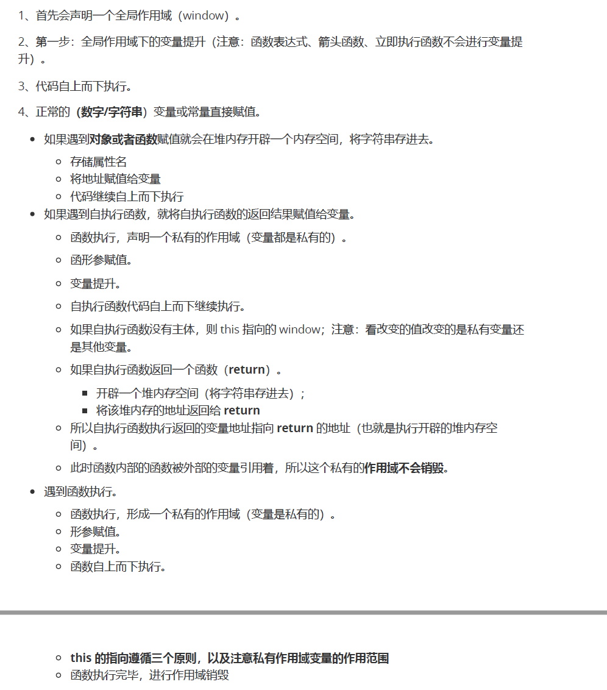
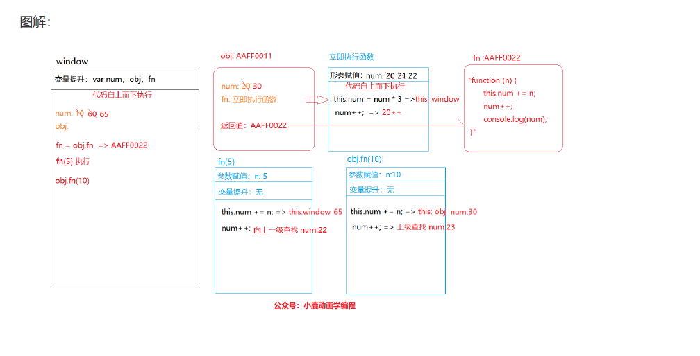

# 宏任务微任务输出题

1.

```js
console.log('script start')

async function async1() {
    await async2()
    console.log('async1 end')
}
async function async2() {
	console.log('async2 end')	
}
async1()

setTimeout(function() {
	console.log('setTimeout')
}, 0)

new Promise(resolve => {
    console.log('Promise')
    resolve()
})
.then(function() {
	console.log('promise1')
})
.then(function() {
	console.log('promise2')
})

console.log('script end')
// script start => async2 end => Promise => script end => async1 end => promise1 => promise2 => setTimeout
```


```js
console.log('script start')

async function async1() {
    await async2()
    console.log('async1 end')
}
async function async2() {
    console.log('async2 end')
    return Promise.resolve().then(()=>{
        console.log('async2 end1')
    })
}
async1()

setTimeout(function() {
    console.log('setTimeout')
}, 0)

new Promise(resolve => {
    console.log('Promise')
    resolve()
})
.then(function() {
    console.log('promise1')
})
.then(function() {
    console.log('promise2')
})

console.log('script end')
// script start => async2 end => Promise => script end => async2 end1 => promise1 => promise2 => async1 end => setTimeout
```

个人理解为，await后的代码相当于then，async2中的then放在任务队列中后，await中的then被阻塞，当async2中的then完成后，在执行new Promise，所以得等new Promise中的then执行完，才回去将await后的代码添加到任务队列中。(错)

对比和第一题的差别在于 async2 函数前面没有了 `async`

```js
async function async1() {
    console.log('async1 start');
    await async2();
    console.log('async1 end');
}

function async2() {
    console.log('async2 start');
    return new Promise((resolve, reject) => {
        resolve();
        console.log('async2 promise');
    })
}

console.log('script start');
setTimeout(function () {
    console.log('setTimeout');
}, 0);
async1();
new Promise(function (resolve) {
    console.log('promise1');
    resolve();
}).then(function () {
    console.log('promise2');
}).then(function () {
    console.log('promise3');
});
console.log('script end');
// script start  async1 start  async2 start  async2 promise  promise1  script end  
// async1 end
// promise2 promise3
// setTimeout
```


```js
function test() {
  console.log(1)
  setTimeout(function () { 	// timer1
    console.log(2)
  }, 1000)
}

test();

setTimeout(function () { 		// timer2         setTimeout中若无delay参数，取默认值 0
  console.log(3)
})

new Promise(function (resolve) {
  console.log(4)
  setTimeout(function () { 	// timer3
    console.log(5)
  }, 100)
  resolve()
}).then(function () {
  setTimeout(function () { 	// timer4
    console.log(6)
  }, 0)
  console.log(7)
})

console.log(8)
//结果：1，4，8，7，3，6，5，2
```


```js
const promise1 = new Promise((resolve, reject) => {
  setTimeout(() => {
    resolve("success");
    console.log("timer1");
  }, 1000);
  console.log("promise1里的内容");
});
const promise2 = promise1.then(() => {
  throw new Error("error!!!");
});
console.log("promise1", promise1);
console.log("promise2", promise2);
setTimeout(() => {
  console.log("timer2");
  console.log("promise1", promise1);
  console.log("promise2", promise2);
}, 2000);
```

结果：

```js
'promise1里的内容'
'promise1' Promise{<pending>}
'promise2' Promise{<pending>}
'timer1'
test5.html:102 Uncaught (in promise) Error: error!!! at test.html:102
'timer2'
'promise1' Promise{<resolved>: "success"}
'promise2' Promise{<rejected>: Error: error!!!}
```

# 变量提升、闭包、this输出题

## **变量提升**

```js
var a = '林一一'
function fn(){
    if(!a){
        var a = 12
    }
    console.log(a)
}
fn()
/* 输出
* 12
*/
```

不管条件是否成立都会进行变量提升`a= undefined`，`if(!a) ==> if(!undefined) ==> true`，输出就是 12

```js
var a=12, b = 13, c = 14
function fn(a){
    a = 0
    var b = 0
    c = 0
}
fn(a)
console.log(a)
console.log(b)
console.log(c)
/* 输出
* 12
* 13
* 0
*/
```

> 函数的形参和带 `var`的 `b` 是私有变量，所以函数内的 `a, b`不对全局下的 `a, b`有何影响。输出结果就是`12, 13, 0`

## **闭包**

### 1

```js
var num = 10;
var obj = {num: 20};
obj.fn = (function (num){
    this.num = num * 3;
    num++;
    return function (n) {
        this.num += n;
        num++;
        console.log(num);
}
})(obj.num)

var fn = obj.fn;
fn(5)
obj.fn(10)
console.log(num,obj.num)
// 22 23 65 30
```






### 2

```js
    function someFunction() {
        let a = 0;
        return function () {
            return a++;
        }
    }
    let f1 = someFunction()
    let f2 = someFunction()
    console.log(f1())
    console.log(f2())
    let f = someFunction()
    console.log(f())
    console.log(f())

	//0001
```


### 3

```js
    let x = 5;
    function fn(x) {
        return function (y) {
            console.log(y + (++x))
        }
    }
    let f = fn(6);
    f(7);
    console.log(x);
	// 14 7
```

```js
    let x = 5;
    function fn(z) {
        return function (y) {
            console.log(y + (++z))
        }
    }
    let f = fn(6);
    f(7);
    console.log(x);
	// 14 5
```

```js
    let x = 5;
    function fn(z) {
        return function (y) {
            console.log(y + (++x))
        }
    }
    let f = fn(6);
    f(7);
    console.log(x);
    //13 6
```

### 4

```js
    let obj1= {
        name: 'A'
    };
    let obj2 = obj1;
    obj2.name = 'B';
    console.log(obj1.name);
    function fn(obj) {
        obj.name = 'C';
        // 以下obj的引用不会被改变，只是在内部被重写了
        obj = {
            name: 'D'
        }
        obj.age = 3
    }
    fn(obj1);
    console.log(obj2.name);
	//B C
```

3和4体现的是对象和基本类型作为参数的情形，在js中所有的函数的参数都是按值传递的，无论是基本数据类型还是引用数据类型

# 原型

```js
function Fn(){
    var n = 10
    this.m = 20
    this.aa = function() {
        console.log(this.m)
    }
}

Fn.prototype.bb = function () {
    console.log(this.n)
}

var f1 = new Fn
Fn.prototype = {
    aa: function(){
        console.log(this.m + 10)
    }
}

var f2 = new Fn
console.log(f1.constructor)     // ==> function Fn(){...}
console.log(f2.constructor)     // ==> Object() { [native code] }
f1.bb()    // undefined
f1.aa()    // 20
f2.aa()    // 20
f2.__proto__.aa()    // NaN
f2.bb()     //  Uncaught TypeError: f2.bb is not a function
```

**`f1,f2中本没有 constructor` 但是会从构造函数的 `prototype` 中查找相当于 `f1.prototype.constructor`，`f2`的原型被重新定义了指向基类 `object`; `f2.__proto__.aa()` 中的 `this` 指向的是原型 `prototype`，原型中并没有属性 `m`，所以 `this.m + 10 ==> undefined + 10 ==> NaN` 。`f2.bb()`中 `f2` 没有属性 `bb`，通过 `__proto__` 向上查找，而原型是经过重定向的原型也没有属性 `bb`，再向上到基类 `object` 中也没有属性 `bb`，则 `f2.bb() ==> undefined()`，所以报错 `TypeError`**


```js
function Foo() {
    getName = function (){
        console.log(1)
    }
    return this
}

Foo.getName = function () {
    console.log(2)
}

Foo.prototype.getName = function(){
    console.log(3)
}

var getName = function (){
    console.log(4)
}

function getName() {
    console.log(5)
}
// 1
Foo.getName()
//2
getName()
//3
Foo().getName();
//4
getName();
//5
new Foo.getName()
//6
new Foo().getName()
//7
new new Foo().getName()
```

- 在变量提升阶段带 `var 和 function` 都会变量提升，两则的区别在于 `var` 只声明为 `undefined` 不定义，`function` 的同时声明和定义。同名的 `getName` 会先声明和定义赋值一个函数的推内存地址，也就是上面输出 `console.log(5)` 的函数地址，在 JS 代码执行后 `getName` 被重新赋值一个新堆内存地址 `console.log(4)`。`Foo.getName()` 就是函数作为对象的调用，1中的输出就是2；
- 2 中 `getName()` 输出就是4，因为 `getName()` 的引用地址是 `console.log(4)`中的；
- 3 中 `Foo().getName()`，`Foo()`执行后全局下的 `getName` 引用地址再次改变成 `console.log(1)` 且返回了 `this`指向 `window` 输出结果就是1；
- 4 中`getName`是全局下的，输出自然是也是`1`；
- 5中 `new Foo.getName()` 函数执行输出 `2`；
- 6 中`new Foo().getName() => new A.getName()`，先对 `new Foo()` 实例化再对 `A.getName()` 调用，对 `new Foo()` 实例化调用的 `getName()` 方法是原型 `prototype` 上的，输出就是 `3`；
- 7 中 `new new Foo().getName() => new B.getName()`，先对 `new Foo()` 实例化再对 `new B.getName()` 实例化，`new B.getName()` 同时也在执行 `B.getName()` 方法输出的还是实例 `B` 上的方法也就是原型 `prototype` 的 `getName`。


```js
    function ClassA() {
        this.x = 'hello';
    }

    ClassA.prototype.x = 'world';

    var a = new ClassA();
    a.x = 'what'
    console.log(a.x);
    delete a.x;
    console.log(a.x)
    a.x = undefined;
    console.log(a.x)

    //what
    //world
    //undefined
```

delete只会删除实例上的属性，将实例属性设置为undefined，属性还是会用undefined，不会用原型上
