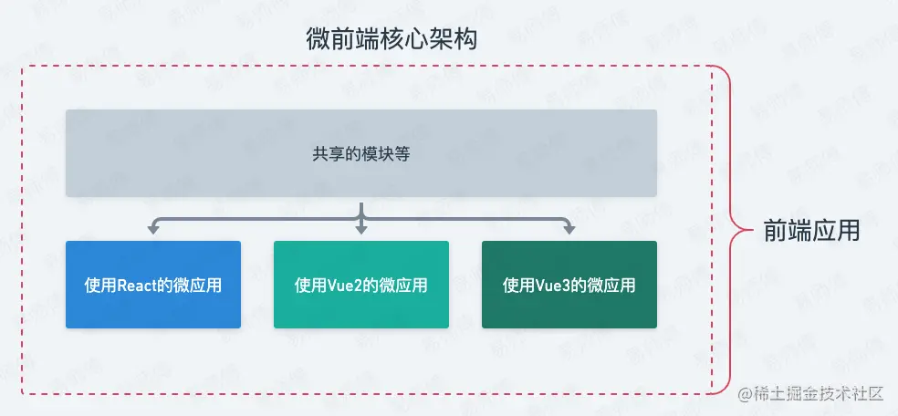

# 如何自学前端

## **首先，了解前端路线，制定大致学习计划**

### 前端基础

- HTML
- CSS
- Javascript

### 计算机基础

- 计算机网络
- 数据结构与算法

### 常用框架

- Vue
- React
- Angular
- jQuery
- Bootstrap

### 打包工具

- webpack
- vite

### 浏览器

- 浏览器工作原理
- 浏览器渲染机制

## 不同的学习方法

### 第一阶段：基础学习

HTML CSS：基础，看视频+看W3School，了解基本的选择器，进行简单的布局，了解定位，浮动，bfc等

JavaScript基础：看JS高级程序设计，学习基础，ECMA+BOM+DOM

### 第二阶段：加深

HTML5：HTML5新语义标签、Web视频

CSS3:CSS3新选择器、伪元素、边框、阴影、Transition、动画

计算机网络：《Web性能权威指南》HTTP、TCP/IP

ES6：const let var 、箭头函数、promise、闭包，原型，事件循环机制《阮一峰ES6标准入门》

### 第三阶段：框架和浏览器

VUE框架，官网＋视频

搭建vue2 demo

vue响应式原理，生命周期，diff算法

webpack+npm

浏览器的渲染过程、浏览器垃圾回收机制、跨域

### 第四阶段：上手项目

项目，西奥项目和个人组件库项目

西奥项目：elementUI和ECharts，websocket和**前端性能优化**

个人组件库项目：组件间通信，**单元测试**


## 保持技术敏感度

我基本每天早晚会抽出30分钟，浏览一些论坛和前沿技术博客，比如思否掘金知乎 等。时刻保持自己对技术的敏感度。

**大厂团队关注**

- [阿里`UED`](https://link.juejin.cn/?target=http%3A%2F%2Fwww.aliued.com%2F%3Fcat%3D14)
- [滴滴 `FE BLOG`](https://link.juejin.cn/?target=https%3A%2F%2Fgithub.com%2FDDFE%2FDDFE-blog)
- [头条前端](https://link.juejin.cn/?target=https%3A%2F%2Ftechblog.toutiao.com%2Ftag%2F%E5%89%8D%E7%AB%AF%2F)
- [有赞前端](https://link.juejin.cn/?target=https%3A%2F%2Ftech.youzan.com%2Ftag%2Ffront-end%2Fpage%2F2%2F)
- [腾讯 `AlloyTeam`](https://link.juejin.cn/?target=http%3A%2F%2Fwww.alloyteam.com%2Fpage%2F0%2F)
- [腾讯 `TNFE`](https://link.juejin.cn/?target=https%3A%2F%2Fgithub.com%2FTnfe%2FTNFE-Weekly)
- [百度 `EFE`](https://link.juejin.cn/?target=https%3A%2F%2Fefe.baidu.com%2F)
- [HYPERS 前端团队博客](https://link.juejin.cn/?target=https%3A%2F%2Fblog.rsuitejs.com%2F)
- [InfoQ 前端专栏](https://link.juejin.cn/?target=https%3A%2F%2Fwww.infoq.cn%2Ftopic%2F33)
- [印记中文周刊](https://link.juejin.cn/?target=https%3A%2F%2Fweekly.docschina.org%2Fjavascript)
- [阮一峰老师weekly](https://link.juejin.cn/?target=https%3A%2F%2Fgithub.com%2Fruanyf%2Fweekly)
- [蚂蚁数据体验技术团队](https://link.juejin.cn/?target=https%3A%2F%2Fgithub.com%2FProtoTeam%2Fblog)
- [TNFE-Weekly](https://link.juejin.cn/?target=https%3A%2F%2Fgithub.com%2FTnfe%2FTNFE-Weekly)

## 善用工具

### **LightHouse**

### devtools

### JEST

### 阿里iconfont

## 多看官网


# 对前端的看法

## 按领域分

按领域分，可以分为 前端基础、PC端技术、移动端技术、服务端技术、优化、前端监控、前端工程化技术

### 前端基础

- HTML
- CSS
- Javascript

### **PC 端技术**

对于现在的 PC 端来说，内容分成两块：

1. 以 jQuery 为代表的一系列高兼容性框架（或者说是库）
2. MVVM 框架，如 Angular、React、Vue），这一块内容，以 Vue 为例进行解释

#### **以 jQuery 为代表的一系列高兼容性框架（或者说是库）**

虽然jQuery非常老，跟不上时代发展的潮流，但是因为一些历史遗留问题或者业务兼容问题（IE9浏览器兼容），还是有很多的基于jQuery的系统在运作和维护。

#### **以 Vue 为例的一系列 MVVM 框架**

1.根据渲染模式的不同，我们需要了解两部分：

1. 单页应用：SPA
2. 基于服务端的渲染：SSR

2.Vue 全家桶知识：

1. 路由管理：VueRouter
2. 全局状态管理：Vuex
3. 脚手架工具：@vue/cli

3.组件库部分：

1. 比如：Element-UI
2. 比如：Vuetify
3. 比如：vant-ui

当然除了这些之外，其他的周边库还有很多，比如 网络请求库：axios 等等，这些都是需要大家去进行掌握的。

### **移动端技术**

对于移动端技术来说，目前主要有两个方向：

1. 以 微信小程序 为代表的小程序技术
2. 跨平台技术

#### **以 微信小程序 为代表的小程序技术**

微信作为国民应用，推出的小程序现在也很火热，小程序最初以 原生 的方式进行开发，后来逐渐出现了一批基于小程序的框架，如果你是一个小程序开发为主的前端工程师，那么以下知识点，你是必须要掌握的：

1. 小程序原生开发
2. 小程序框架开发（比如：wepy、mpvue）
3. 小程序 UI 库（比如：WeUI、Vant weapp、iView weapp）

#### **跨平台技术**

跨平台技术的提出主要是为了解决 **移动端设备碎片化** 的问题，移动端设备碎片化就是因为

目前移动端的设备，主要分成两块
1、Android
2、IOS
而对于任何一端来说，又分为 **原生应用**（APP） 和 **网页应用** ，同时还多了一个 **小程序**（虽然小程序的设计之初也有为了解决 移动端设备碎片化 问题的原因） 。
如果我们为每一种应用方式都开发一个版本的话，那么我们就需要大约 4 个应用的维护。这样的一个成本是任何一家中小型企业都难以接受的。
所以大家一直期望，有一种方式可以开发一个应用，但同时运行在多个设备之中。

**跨平台技术的出现，旨在解决 一个项目无法同时作用于多种不同设备之上 的问题。**

整个跨平台技术方案中，目前主要流行的有以下 4 种：

1. React Native
2. Flutter
3. Weex
4. uni-app (一套代码编到8个平台)

### **服务端技术**

服务端技术 可能在你的初期对你帮助不大，但是当你在技术领域越来越深入的时候，它是必不可少的内容。

四个方面：Node.js 、数据库知识、服务器、云概念

#### Node.js

大体可以分成两个框架方向：

1. Express
2. KOA

#### 数据库知识

目前的数据库同样分成了两块大的方向：

1. SQL 型数据库，推荐：MySql
2. NO SQL 型数据库，推荐：MongoDB，Redis

#### 服务器

1. Apache
2. Nginx (重点推荐)，针对于 Nginx 来说，你至少需要掌握两点：

1.单页应用的部署

2.反向代理 / 跨域处理

#### 云概念

（个人认为：云概念是未来的主要方式），云概念至少需要掌握以下 5 点：

1.**云服务器**

1.标准 ECS 云服务器

2.应用云服务器

2.**云数据库**

1.SQL 型

2.NO SQL 型

3.**云存储服务**

1.OSS：对象存储

2.NAS：文件存储

4.ServerLess：无服务结构（小程序云开发是一个很好的切入点）

5.CDN 服务

### **优化技术**

优化技术主要 针对网页访问速度的优化 和 用户误操作规避的优化，

列举几个方向：

1. 静态资源优化
2. 接口访问优化
3. 页面渲染速度优化
4. 防抖 / 节流方案

### **监控技术**

什么叫做监控技术呢？

> 当我们的项目上线之后：
> 到底有多少人来访问？
> 项目出现过多少次catch？
> 用户在哪个页面停留的时间比较长？
> 等等…

获取这些数据的方式我们就称为：**数据监控技术**，这里简称 **监控技术**。

你如果只作为一个码农角色的话，那么确实没有用。但是如果你站在**开发者**的角度、或者 **项目所有人** 的角度来看的话，那么这些数据是非常重要的依据。基于这些数据来完成的 **数据可视化平台** ，也是现在非常重要的一个方向。

实现数据监控的方式主要可以分成两种：

1. 自定义数据监控
2. 使用现成的第三方监控平台（前期推荐使用）

如果你对监控技术刚刚接触，或者处于项目前期的话，那么我个人推荐你使用 现成的第三方监控平台，这一类的平台有很多，简单列出三个：

1. 百度统计
2. 诸葛IO
3. GrowingIO

### **工程化技术**

什么是工程化呢？

> 比如说：
> 你的代码提交到 Git ，那么这个 Git 平台是怎么搭建的？
> 你的代码提交，如果不合规（死链或者代码格式不合规），如何避免被提交？
> 代码部署这种重复的工作如何自动化？
> 新版本上线如何最大程度的减轻 BUG 出现导致大面积崩溃的风险？
> 如果真的出现了大面的崩溃，如何快速的返回上一个稳定版本？
> 等等…

这些场景，我们都可以称之为是属于 **前端工程化** 的一部分

工程化代表的应该是一整套前端从开发到上线的全流程。目前的工程化以自动工程化为主。也就是说你的开发、测试、部署等等，全部都自动化。

工程化技术方面，简单的给大家进行一下列举：

1.代码托管平台搭建

1.Gitlab

2.自动化工具

1.合规检测

1.ESLint 提交检测

2.兼容性检测

3.死链检测

2.自动化测试

3.自动化部署

1.CI：持续集成

2.CD：持续部署

3.产品迭代方面

1.灰度发布

2.A/B 测试


### 数据可视化技术

#### 基础开发技术

1、SVG

2、Canvas

3、WebGL

#### 可视化组件和工具

##### ZRender

ZRender是一个轻量级的Canvas类库，是一个二维绘图引擎，它提供 Canvas、SVG、VML 多种渲染方式，并提供类 Dom 事件模型。同时，ZRender 也是 ECharts 的渲染器。

##### Echarts

如果需要做可视化方面的工作，那么你对Echarts一定不陌生。Echarts是百度开源的一个javaScript可视化图库，可以流畅地在 PC 和移动设备上运行，兼容当前绝大部分浏览器，底层依赖矢量图形库 ZRender，提供直观、交互丰富、可高度个性化定制的数据可视化图表。同时，Echarts的学习和使用也相对容易，通过几个简单的option配置项就可以很快地绘制出一个图表出来。

##### AntV

AntV 是一个数据可视化项目，也是一个团队，即蚂蚁集团的数据可视化团队。AntV 目前覆盖了统计图表、移动端图表、图可视化、地理可视化、2D 绘图引擎和智能可视化等多个领域，主要包含 G2栈、F2栈、G6栈、X6栈、L7栈、AVA 以及一套完整的图表使用和设计规范。

##### Wyn Enterprise

Wyn Enterprise 是一款强大的嵌入式数据可视化工具，提供了灵活的数据交互和探索分析能力，以及 OEM 白标集成的方式，全面满足行业应用软件的数据分析需求。它具备多源数据整合、报表设计、数据可视化、自助式BI分析、以及数据填报等功能，帮助用户挖掘数据的潜在价值，为管理者制定决策提供数据支撑。

##### D3

D3.js库是一个开源项目，作者是纽约时报的工程师。准确来说，D3.js实际是一个JavaScript函数库，不是图表库，比较适合于做数据可视化。D3有丰富的数学函数处理数据转换和物理计算，可以把数据和 HTML 结构或者 SVG 文档对应起来，这种特性让我们可以更方便的操作DOM绘制图表。

##### Vega

使用Vega不需要写前端代码，它做到了只需要 JSON 就能完成所有图表相关的开发，包括数据的加载、转换、交互等。由于Vega致力于通过一些JSON配置项实现图表的绘制，导致在生成一些基础简单的图表时，也需要很多行的配置。比如最简单的柱状图就需要95行配置，所以它提供了更简明的语法Vega-Lite，用于快速生成可视化以支持分析。

## 职位来分

前端工程师分为

前端游戏

前端架构

pc前端

移动前端

node工程师

重构和js工程师

可视化，webgl、业务、babel、网页设计

# 未来规划/发展计划

## 第一阶段

**熟练掌握基本知识**

1. HTML + CSS ：这是基础中的基础，是必须要掌握的
2. JavaScript： JS 作为前端的核心语言，用来处理所有逻辑相关的问题，是入门前端的一个必备内容

## 第二阶段

**工作知识的掌握**

vue生态：vue、vueX、vueRouter、周边库（echarts）、UI库、组件库等（**看公司业务去具体学习，通过阅读源码加深理解**）

TypeScript+vite+vue3

跨域，模块化

工具：

包管理npm、转译babel、构建webpack rollup、质量检查eslint csslint 、版本控制git、 自动化测试 单元测试 界面功能测试

学习**小程序技术** 和 **跨平台技术** 

浏览器机制，缓存、渲染

**前端工程化** 

工程化代表的应该是一整套前端从开发到上线的全流程。目前的工程化以自动工程化为主。也就是说你的开发、测试、部署等等，全部都自动化。

工程化技术方面，简单的给大家进行一下列举：

1.代码托管平台搭建

1.Gitlab

2.自动化工具

1.合规检测

1.ESLint 提交检测

2.兼容性检测

3.死链检测

2.自动化测试

3.自动化部署

1.CI：持续集成

2.CD：持续部署

3.产品迭代方面

1.灰度发布

2.A/B 测试

**Node.js**

大体可以分成两个框架方向：

1. Express
2. KOA

**数据库知识**

目前的数据库同样分成了两块大的方向：

1. SQL 型数据库，推荐：MySql
2. NO SQL 型数据库，推荐：MongoDB，Redis

**服务器**

1. Apache
2. Nginx (重点推荐)，针对于 Nginx 来说，你至少需要掌握两点：

**云概念**

## 第三阶段

进阶知识 和 底层知识

1.TypeScript

2.ES6

3.CSS 预处理器

1.Scss

2.Less

3.Stylus

4.**思想层面**

1.组件化思想

2.数据驱动思想

设计思想

计算机网络体系

数据结构和算法和实际

**性能优化**，实际应用

数据监控技术

工程化技术

工程化代表的应该是一整套前端从开发到上线的全流程。目前的工程化以自动工程化为主。也就是说你的开发、测试、部署等等，全部都自动化。

**知道怎么用，并且知道为什么（阅读源码，经验积累）**


## 大前端

现有的移动端（Android、IOS）原生开发工程师、小程序开发工程师都会逐渐的融入到前端的概念中，也就是共同组成 大前端

更笼统概念加上 服务端技术，优化技术，监控技术，工程化技术

## 微前端

`微前端（Micro-Frontends）` 并没有定义框架或 API，它其实是一个类似 **微服务架构** 的概念；**将 `微服务` 的概念扩展到了前端世界；**

以前端的角度一句话概括就是： `将您的大型前端应用拆分为多个小型前端应用，这样每个小型前端应用都有自己的仓库，可以专注于单一的某个功能；`

需要强调的是，尽管我们将前端应用拆分为多个项目，但它们最终还是会被集成到一个单页前端应用程序中；因此，通过使用微前端架构，您不会在用户体验上有任何损失，只会有过之而无不及；

**前端微前端架构图**



通过这张图，我们就可以很明显的看得出来微前端架构就是在一个前端应用中塞进去多个子前端应用，这样就构成了最简单的微前端概念，也是最核心的概念；

## ServerLess概念

ServerLess：无服务架构

Serverless 强调的是一种架构思想和服务模型，让开发者无需关心基础设施（服务器等），而是专注到应用程序业务逻辑上。Serverless 也是下一代计算引擎。

**Serverless的优势**

- 可用性冗余，以便单个机器故障不会导致服务中断
- 冗余副本的地理分布，以便在发生灾难时保留服务
- 负载平衡和请求路由以有效利用资源
- 响应负载变化进行自动缩放以扩展或缩小系统
- 监控以确保服务仍然运行良好
- 记录以记录调试或性能调整所需的消息
- 系统升级，包括安全修补
- 迁移到新实例时可用

**与其说Serverless是一项技术，不如说Serverless是一种理想的工作模式，是一种专注于业务价值的思考**。单纯的通过函数进行业务交付，而不再需要关心解决业务问题之外的事情，比如：那些非常繁琐的基础设施。托管服务可以让开发者更专注于编写业务函数，从而减少对机器资源、降低运维成本的考虑，可以让开发者更专注的为产品和用户创造价值。随着云厂商对于Serverless的支持，后续会有越来越多的开发者，可以体会到云时代给大家带来的便利。

开发者选择应用Serverless的场景有很多，比如：为小程序、Web、Mobile提供基础性的API服务，大规模批处理任务处理，Web站点、DevOps的工具以及GraphQLAPI能力。


## 前端低代码low-code

### 低代码的产生背景

**互联网产品趋于标准化**

**应用开发的技术栈趋于成熟**

### 前端低代码实现

可以通过配置化的低成本交互方式（主流是拖拽）加上少量的一些胶水代码，去满足一类应用的需求。这里笔者以发展更加成熟的B端低代码讲述，C端也是很类似，但是因为样式、动画等定制要求要比B端的复杂许多，所以目前前端低代码相对成熟的应用是在B端。低代码实现原理其实非常简单，就是先预置丰富的原子组件，通过拖拽选择所需组件在画板上进行位置的编排。之后，进行一些组件属性的设置。


### 缺点

1. 低代码太弱了，比如某一个细分领域且复杂的功能就无法实现。
2. 会造成一部分失业


## WebAssembly（WASM）

WebAssembly 或者 wasm 是一个可移植、体积小、加载快并且兼容 Web 的全新格式

**WebAssembly 是一种运行在现代网络浏览器中的新型代码**，并且提供新的性能特性和效果。它设计的目的不是为了手写代码而是为诸如 C、C++和 Rust 等低级源语言提供一个高效的编译目标。

对于网络平台而言，这具有巨大的意义——**这为客户端 app 提供了一种在网络平台以接近本地速度的方式运行多种语言编写的代码的方式**；在这之前，客户端 app 是不可能做到的。

而且，你在不知道如何编写 WebAssembly 代码的情况下就可以使用它。WebAssembly 的模块可以被导入的到一个网络 app（或 Node.js）中，并且暴露出**供 JavaScript 使用的 WebAssembly 函数**。JavaScript 框架不但可以使用 WebAssembly 获得巨大性能优势和新特性，而且还能使得各种功能保持对网络开发者的易用性。

**什么时候使用WebAssembly？**

总结下来，大部分情况分两个点。 - **对性能有很高要求的编解码库、算法库、加密解密库/App/Module/游戏** - 在Web中使用C/C++/Rust/Go的库 举个简单的例子。如果你要实现的Web版本的Ins或者Facebook， 你想要提高效率。那么就可以把其中对图片进行压缩、解压缩、处理的工具，用C++实现，然后再编译回WebAssembly。

**是如何工作的**

第一步：你使用 C、C++ 或其他语言生成源代码，这段代码应该可以解决某个问题，或者完成某段对浏览器中的 JavaScript 来说太过复杂的流程。

第二步：使用 Emscripten 将你的源代码编译为 WebAssembly，这一步完成时，你将得到一个 wasm文件。

第三步：你将在网页上使用这个 wasm文件，将来你可以像其他 ES6 模块一样加载这个文件。

## 前端智能化

狭义的智能化利用深度学习技术，在图像、NlP等方向，通过模型训练、预测的方式的智能化， 广义前端智能化可以从输入到输出的角度思考。

近些年出现的代码分析工具 DeepCode，基于 GPT-3 的代码生成工具 Copilot，还有野心非常大的从自然语言到代码生产的 NL2Code 方向，都扩展了我们对于前端智能化的认知。

业界阿里在前端智能化上探索得较早，不仅取得了较多成果，而且界定了前端智能化的分级，为前端智能化的发展指明了方向：  目前阿里 imgcook 的能力处于 D2C 的 L3 级别，智能生成的代码还需要可视化干预或人工兜底开发后验证上线；未来期望达到 L4 级别，需要对 UI 信息架构进行拆解，对从 UI 信息自动生成代码的智能化能力进行细分。


## **web3.0 去中心化**

Web3的数字化生态，**在其中用户可以真正拥有自己的数据，并且交易受到了加密技术保障。**

用户无需再信任品牌背书，而是可以依赖确定的软件代码逻辑来严格执行协议。

- **区块链让数据成为资产**
- **智能合约打造可编程的智能经济体系**
- **人工智能构建全球智慧大脑并创造“数字人”**
- **物联网让物理世界的现实物体向数字空间广泛映射**
- **AR实现了数字世界与物理世界的叠加**
- **5G网络、云计算、边缘计算将构建更加宏伟的数字新空间**
- 元宇宙

所以我认为去中心化不是目的，去中心化带来的透明、自我可掌控、代码即真理才是目的。

用户可以掌握自己在互联网上的数据及数据资产、代码开源自由接入、资产在全球流动、数据公开透明等等。


## 新技术 Bun (21年)

目前已经证明一些语言（如 Rust、Go 甚至 Zig）在捆绑、转译和编译方面比 JavaScript 具有更好的性能。

最近，JavaScript 工具生态系统中出现了一个新成员——Bun。**它的目标是让整个 JavaScript 开发过程更加快速，这是一个全能的工具，它不仅加快了编译和解析的速度，还提供了自己的依赖项管理器工具和捆绑。**

all in one概念

Bun 提供了 **打包、转译、安装和运行 JavaScript & TypeScript 项目的功能，内置原生打包器 (native bundler)、转译器、task runner、npm 客户端，以及数百个 Node.js API 和 Web API，包括约 90% 的 Node-API函数（本机模块）、fs、path、Buffer 等。**

这就意味着你可以实现在 Bun 上运行的大部分 Node API 和 Web API， 还可以在不需要使用 `Webpack、Rollup、esbuild、babel` 等工具的前提下直接运行 `TypeScript 、JSX` 了；

Bun 支持一些开箱即用的复杂特性，如 TypeScript、CSS in Js、JSX，不过还缺少一些基本功能，如源映射、Minifier、摇树优化等。

Bun 的一个显著特性是它**提供了自己的 Node 模块解析器实现**，这是最值得关注的优化之一。


### 为什么快

引擎差异

不同于 Node.js 和 Deno，Bun 并没有基于 `V8` 引擎，而是使用了 [JavaScriptCore](https://link.juejin.cn/?target=https%3A%2F%2Fgithub.com%2FWebKit%2FWebKit%2Ftree%2Fmain%2FSource%2FJavaScriptCore) 引擎，它的执行速度往往要比 `V8` 等更传统引擎要快。

语言差异

`Bun.js`使用的是新兴的系统编程语言 [ZIG](https://link.juejin.cn/?target=https%3A%2F%2Fziglang.org%2F) 编写的，主要通过手动内存管理对内存进行更细粒度的控制、无隐藏的控制流来提升程序的性能；

从零开始

在上两点的前提下，`Bun.js` 的大部分内容都是完全从零开始编写的，包括 `JSX/TypeScript` 转译器、`npm` 客户端、打包器、`SQLite` 客户端、`HTTP` 客户端、`WebSocket` 客户端等等。

### Bun 的常见功能使用

##### 1. 当做包管理器使用

> 根据测试，在 Linux 上 `bun install` 运行安装包速度往往比 `npm install` 运行脚本快 20 - 100 倍。

##### 2. 直接运行`scripts`脚本

1. 用 `bun run` 来代替 `npm run`

   ```bash
    # Instead of "npm run clean"
    bun run clean
    # This also works
    bun clean
   ```

2. 运行 `package.json` 中的脚本

> 根据测试，`bun` 运行 `package.json` 脚本比 `npm` 运行 `package.json` 脚本快 30 倍。

##### 3. 快速创建 Next.js 项目

1. 快速创建

2. 关联一个已经存在的 Next.js 应用

   

> 注意：Next.js 的需多功能都支持，但是也有小部分暂时不支持，所以生成环境使用需谨慎。

##### 4. 快速创建 React 项目

1. 快速创建

   ```bash
    bun create react ./app
    cd app
    bun dev # start dev server
   ```

2. 关联现有的React项目

##### 5. 运行 TypeScript

在 `Bun` 中，天然支持运行运行 TypeScript，无需配置，无需额外安装；

如果你导入一个`.ts`or`.tsx`文件，bun 会将它转换成 JavaScript；bun 还编译`node_modules`中的`.ts`或`.tsx`文件；这是由 bun 内置了 TypeScript 转译器，且速度很快。

##### 6. 常用命令

- **bun add**：等同于 `yarn add` 或 `npm install`
- **bun install**：等同于 `yarn install` 或 `npm install`
- **bun run**：类似于 `npm run`
- **bun create**：通过该命令，可快速创建一个模板项目
- **bun bun**：该命令会递归收集指定文件的导入依赖，然后生成包含这些信息的 `node_modules.bun` 文件
- **bun upgrade**：要升级 bun，请运行`bun upgrade`


## Svelte(16年)

Svelte 与诸如 React 和 Vue 等 JavaScript 框架类似，关键区别有 3 点：

1. 编译时间不一样；
2. 无虚拟 Dom；
3. 响应式原理不一样；

##### 编译器

Svelte 是一种全新的构建用户界面的方法。传统框架如 React 和 Vue 在浏览器中需要做大量的工作，而 Svelte 将这些工作放到构建应用程序的编译阶段来处理。

Svelte 组件需要在 `.svelte` 后缀的文件中编写，Svelte 会将编写好的代码翻编译 `JS` 和 `CSS` 代码。

##### 打包体积更小

##### 不使用 Virtual DOM

而 Svelte 在未使用虚拟DOM的情况下实现了响应式设计。

我以粗暴的方式理解：Svelte 会监听顶层组件所有变量，一旦某个变量发生变化，就更新使用过该变量的组件。这就仅仅只需更新受影响的那部分DOM元素，而不需要整个组件更新。

##### 更自然的响应式

现在流行的前端框架基本都使用 **数据驱动视图** 这个概念，像 Vue 和 React 这些框架，都有响应式数据的概念。

但 Vue 和 React 在数据响应方面还是有点“不那么自然”，我简单举几个例子：

- 在 React 中，如果需要更新数据并在视图中响应，需要使用 `setState` 方法更新数据。
- 在 Vue2 中，响应式数据要放在 `data` 里，在 `methods` 中使用 `this.xxx` 来更新数据。
- 在 Vue3 的 Composition API 语法中，需要使用 `ref` 或者 `reactive` 等方法包裹数据，使用 `xxx.value` 等方式修改数据。

```html
<h1>{name}</h1>

<script>
  let name = '雷猴'

  setTimeout(() => {
    name = '鲨鱼辣椒'
  }, 1000)
</script>
```

上面的代码中，1秒后修改 `name` 的值，并更新视图。

从代码就能看出，在使用 Svelte 开发项目时，开发者一般无需使用额外的方法就能做到和 Vue、React 的响应式效果。

##### 性能强

##### 内存优化

插值：这种语法和 Vue 是有点像的，Vue 使用双大括号的方式 `{{}}` 绑定数据。Svelte 就少一对括号。

样式绑定、条件渲染 #if、

事件绑定 on:event 使用 `on:` 指令监听 `DOM` 事件，`on:` 后面跟随事件类型

事件修饰符

数据绑定 bind


**但 `Svelte` 的兼容性和周边生态相比起 `Vue` 和 `React` 会差一点。**

## SolidJS (18年)

SolidJS是用于构建用户界面的声明式、高效且灵活的 JavaScript 库。

SolidJS 最大的特点就是“性能直逼原生JS”。

#### **为什么它这么快？**

答：主要因为 3 点：

1. **没有用虚拟 DOM**（无 diff 算法）：它编译出来的 DOM ，就是原生 DOM ，其它语法是直接调用的，也没有那一整套复杂的虚拟 DOM。
2. **提前编译，按需打包**：无论是 react 还是 vue，这些框架采用的是运行时才编译方案，而 Solid 是预编译，将 jsx 部分的代码，转换成原生的语法。并且，react 和 vue使用，都需要引入整个框架本身。而 Solid 可以按需引入，比方说像 lodash、Rxjs 那样，用个某个功能，按需引入对应的组件即可。
3. **响应式实现，细粒度更新**：如果了解 React 的原理，就会知道，只要是 props 或者 state 改变，React 组件就会重新渲染，而每一次判断是否会重新改变，值是否不一样，也是一整套算法……而 Solid 不一样，他另辟蹊径，每一个组件都是一个独立的线程，每个组件里的 createMemo 或 createEffect 里面去收集对应的依赖， 在 set 改变值后，都会重新执行这些方法。看起来就像是实时更新了一样。

**Solid 和使用JSX(不使用VDOM)，React Hook 代码风格、语法极其相似.**

> 虽然长得像 React，但它的思路和 React 是完全不一样的。

1. 强制所有read行为通过getter实现响应性，因此是显式reactive，避免了mobx读值忘记observer的问题。
2. 强制所有read行为通过getter实现响应性，无需依赖组件函数的重复执行来实现，因此可以在函数组件语法下，支持像模板一样的预编译响应式。
3. 像mobx一样提供了一系列响应式工具函数。
4. 由于组件函数只执行一次，于是组件函数摸执行，本质上就被限定在生命周期的场景内，而不是useEffect一样通过渲染函数的重复执行来触发effect，从而确保了用户对effect的使用，是对app state变化的effect，而非对view data的effect。这两者在react中常常被混淆，而后者在react中经常被滥用，导致了model对view，尤其是对[render](https://www.zhihu.com/search?q=render&search_source=Entity&hybrid_search_source=Entity&hybrid_search_extra={"sourceType"%3A"answer"%2C"sourceId"%3A"2398649960"})行为的依赖，诱导用户写出问题代码。在[solidjs](https://www.zhihu.com/search?q=solidjs&search_source=Entity&hybrid_search_source=Entity&hybrid_search_extra={"sourceType"%3A"answer"%2C"sourceId"%3A"2398649960"})中，用户无论把代码写在组件外，还是组件内，都不会形成在逻辑层面model对渲染行为的依赖，提升性能的同时，避免了开发人员能力不足写出垃圾代码。

#### **响应式**

**createSignal**

```javascript
import { render } from "solid-js/web";
import { createSignal } from "solid-js";

function Counter() {
    const [count, setCount] = createSignal(0);
    setInterval(() => setCount(count() + 1), 1000);
    return <div>{count()}</div>;
}
    
render(() => <Counter />, document.getElementById('app'));
```

signal是solid中基本的响应单元，createSignal类似react中的useState,传递给createSignal调用的参数是初始值，createSignal返回一个两个==函数==的数组，第一个getter，第二个是setter，第一个返回的值是一个getter而不是一个值，使用的时候需要调用，框架拦截读取值的任何位置来进行自动跟踪，从而响应式更新，所以调用getter的位置很重要，和react不同的是，例如setState触发更新，react会生成Fiber树，进行diff算法，最后执行dom操作。solid则是直接调用编译好的dom操作方法，没有虚拟dom比较。

**createEffect**

```javascript
import { render } from 'solid-js/web';
import { createSignal, createEffect } from 'solid-js';

function Counter() {
    const [count, setCount] = createSignal(0);
    
    createEffect(() => {
        console.log('count is :', count())
    })
    
    
    return <button onClick={() => setCount(count() + 1)}>Click me</button>;
}
    
render(() => <Counter />, document.getElementById('app'));
```

createEffect接收一个函数，监听其执行情况，createEffect会自动订阅在执行期间读取的所有Signal，并在Signal值之一发生改变的时候，重新运行此函数。count更改的时候，createEffect函数就会运行，从而点击一次，就打印一次结果。类似react的useEffect

#### Props

Props是组件执行的时候传进来的对象，Props是只读的，并且具备对象getter的响应性的，但是响应性，只能通过props.propsName的形式来访问，才能被追踪到。不能解构props，解构就会脱离追踪范围而失去响应。

#### Store

**内嵌式响应**

**solid可以独立处理嵌套更新，是因为它提供了一细粒度响应式，也就是哪里需要更新，就更新哪里，指哪打哪。**

store是代理对象，属性可以被跟踪，那么是不是可以实现内嵌式响应，createStore接收一个初始值，返回一个类似于signal的读/写的两个元素，第一个是元素只读的store代理，第二个是setter函数。

#### 生命周期

**onMount**

**onCleanup**

## 前端工程师的选择

前端工程师分为

前端游戏

前端架构

pc前端

移动前端

node工程师

重构和js工程师

可视化，webgl、业务、babel、网页设计、seo

## **前端架构师总结：**

#### **跨界**：

真正的架构师是需要有跨界的能力的，随着技术的持续完善，这种通过岗位变迁实现技术架构升级的情况会越来越少。而架构层面新的变化将来自于岗位自发的对自身工作内容、职责的重新定义，也就是这里说的边界。所以说并不是你作为一个前端开发岗位，你就不能干前端之外的事了，要尝试跳出边界来思考和解决问题。

#### **尝鲜**：

作为一个架构师，不断学习新的技术是非常重要的，这里所说的尝鲜，就是要对技术保持一定的热情，不能只满足于现状，说白了讲就是要不断的学。

#### **工具和平台化建设**：

可以看出来工具平台主要就是围绕我们的研发流程中的每一步关键节点去建设起来的，结合起来说，我们可以称之为工程化。工程化是这几年非常热门的概念，对前端来讲也是一个很明确的前端发展方向，其实工具平台的完善过程就是架构工程化的推进过程。


身为一名架构师，你需要有敏锐的嗅觉来洞悉这些节点。并且在适当的时机能够做出对业务有提升的工具平台，要做到遇到重复性的问题时，想想是不是开发出一款自动化工具平台来处理，这才是代码之外对业务提升解决方案。

#### **流程和规范化**：

这里的规范，总结起来可以分为成：

1. 结构的规范：对项目的代码结构，不管前后端，合理的分层和[组件化](https://www.zhihu.com/search?q=组件化&search_source=Entity&hybrid_search_source=Entity&hybrid_search_extra={"sourceType"%3A"answer"%2C"sourceId"%3A815383194})是非常必要的。
2. 编码的规范：这里主要就是代码codereview了，定期的进行codeview的同时，最好可以使用一些自动化工具。
3. 流程的规范：项目的评审，研发，测试，发布这些阶段都需要有流程来约束，这些需要结合自身团队的实际情况来制定。
4. 规范的落地：对于规范来说最关键的是执行落地，在制定完规范的同事，要不时的回顾是否切实的落地，这个应该是团队里每个成员坚持的基本准则。

#### **方法论**：

所谓方法论，可能单单说起来是比较抽象的，这里的方法论，主要是指在完成一项小的需求，或者是承接一个重大的项目，在具体的实施过程中，要有一定的方法和技巧，

#### **安全意识**

这里为什么要把安全单独拿出来说呢，因为对于一个业务而言，安全是第一要素，就好比一个国家，安全稳定才是发展一切的前提，一旦业务出现安全问题，就可能瞬间损失掉全部，代价是非常惨重的。所以作为一名架构师，必须要保证业务的稳定性，可以总结以下几点：

1. 对低级的的代码安全问题，要坚决说不，例如前端里面的xss，[csrf](https://www.zhihu.com/search?q=csrf&search_source=Entity&hybrid_search_source=Entity&hybrid_search_extra={"sourceType"%3A"answer"%2C"sourceId"%3A815383194})这些问题。
2. 对大型运营类活动需求，要有容灾意识和**备份**，例如在准备了一套方案的同时，要有可选的备用方案。
3. 尝试使用工具化来解决和预防安全问题，例如BAT这种大型企业，在运维和代码层面，都有一层保障机制，如腾讯的门神系统等。

#### **团队合作**

所以团队合作的目的就是让团队中的每个人都能明确自己的职责，并发挥出最大的价值，架构师有义务来维护这种合作关系。并且对你的认同，也是团队成员赋予你的，维护良好的氛围，才能让团队成员信服。


# 分号问题

### 分号的作用

分号也是一个执行语句，叫做**空语句**，分号是断句用的，每一个分号就是一个程序语句结束的标志。

### ASI（**自动插入分号机制**）

抽象语法树中并没有分号这个东西。**插入分号只是一个概念，意思是解析器除了分号，还会把换行符当作断句的依据，从而保证语句解析的正确性，并不是真的往里插一个分号**（当然了，你本地压缩代码的时候，emmm，应该是需要真的插入的）。

但是ASI并不是将所有的换行符都识别成分号，而是通过以下规则。

#### ASI的插入规则

大前提，ASI的纲领：

- 以换行为基础。（就是你肯定得有换行符才行）
- JS解析器是尽量把语句合并成同一行的解析的。只有符合ASI规则的时候，才会加入分号进行断句

#### 什么情况下不会触发ASI了

就一句

新的一行以(， [， /， +， -， ， %， ,， .开头

因为这些符号开头的话，根据上述的ASI的第一条规则，这一行和上一行并成一行的时候，并不会形成非法语句。例如`[]`会被识别成属性。`()`会被识别成函数执行语句。

解决方法就是在新一行的开始，手动加一个分号即可。

### 到底应该加不加分号呢

加不加分号 一看个人习惯喜好，二看**团队要求**。规范上加不加并没有对错之分，但是你都要对ASI了解。

**但是加分号，有可能会误导或扰乱ASI的解析机制，发生预想不到错误或bug。**

例子：

```js
//所有 JavaScript 开发者都必须了解 ASI，即使是那些「总是使用分号」的人。举个例子：
function foo () {
  return
    {
      bar: 1,
      baz: 2
    };
}
//哇哦，虽然你记得在最后添加分号，但这无关紧要。ASI 会强行介入并把你的代码修改为：
function foo () {
  return; // <-- ASI 在这里插入了一个分号。现在你的代码出现了一个 bug！
    {
      bar: 1,
      baz: 2
    };
}
```

# 页面出现长时间的白屏要怎样排查问题？

## 从网络方面检测

1. 先确保网络连接顺畅
2. 再检查 `URL` 地址是否错误
3. 打开 `控制台` 查看是否有报错信息
4. 查看`接口访问` 是否有请求
5. 查看 `路由` 是否有 `path错误` ，导致加载了不存在的页面

## 从js和css方面检测

排除了 `网络问题` 以后，如果还是白屏，那一般都是 `css和js` 加载造成的；`css和js` 会造成`阻塞渲染`。比如不正确的引入`css和js` ， 就会导致它们的加载速度过长，从而导致白屏现象。
正确的引入方式是：

1. 在 `<head>` 标签中引入`css`：因为在加载`HTML` 前不先渲染`css` 的话，整个页面会乱掉；
2. 在 `</body>` 标签之前、`body` 标签中`html` 内容的`后面` ，引入 `js`：因为浏览器加载`script` 标签时，处理内部代码的顺序都是`从上到下` 依次执行的，如果在 `html` 内容前就引入`js` 的话，那么就会导致，在所有的代码处理完毕之前，会阻塞其他资源的加载；会导致页面的其他内容都无法显示，因此如果不规范引入js的话，会对页面的其他内容带来影响。

**补充说明：**
`script` 标签里可以添加`async或defer` 属性，如果`不添加` 这个属性，浏览器就会`立即加载并执行`脚本；也就是在渲染`script` 标签之前，不等后续的文档加载前执行；他们的区别在于：

1. `async`：加载和渲染后续文档元素的过程将和 `script.js`的加载与执行并行进步（异步）
2. `defer`: 加载后续文档元素的过程中和`script.js`的加载与执行并行进步（异步）。但是`script.js`的执行要在所有元素解析完成之后，`DOMContentLoaded` 事件触发之前完成。

`defer` 和`async` 在`网络读取（下载）` 方面是一样的，都是`异步的` ；区别在于脚本下载完成之后什么时候开始执行。


# 怎么理解库与框架

**库（Library）是一系列预先编写好的代码集合，供开发者在编程中调用，大大减少重复工作量**。 库的概念很宽泛。程序员第一次输出hello world用的printf就来自C语言标准库； 从npm、Maven、Nuget下载的包都是库; 库更多是一个封装好的特定的集合，提供给开发者使用，而且是特定于某一方面的集合（方法和函数），**库没有控制权，控制权在使用者手中，在库中查询需要的功能在自己的应用中使用，我们可以从封装的角度理解库**

**框架顾名思义就是一套架构，会基于自身的特点向用户提供一套相当于叫完整的解决方案，而且控制权的在框架本身，使用者要找框架所规定的某种规范进行开发。**框架（Framework）是库的一种。很多人会把框架和普通库的区别仅仅理解为规模和复杂度，其实不然。[jQuery](https://so.csdn.net/so/search?q=jQuery&spm=1001.2101.3001.7020)的规模够大了，但仍然是库，不是框架。框架的最大特征是它会接管程序的主控制流，开发者只需编写业务逻辑代码，具体执行工作由框架来调用。实践中经常会用到控制反转（IoC）以及模板类继承等方式。


**框架与库之间最本质区别在于控制权**：you call libs, frameworks call you（控制反转）

**同时用jQuery和Vue没问题，因为jQuery是库可以包含在Vue框架中；同时使用Vue和React就不行，因为两个都是框架，主控制流只能有一个。**

在实际中，像angular、backbone、vue就属于框架，而jQuery、react、underscore就是库，在前者中我们完全可以自由的使用后者，同时也可以没有前者的基础之上使用后者，都是很自由，控制权始终在我们的手中，但是使用框架时候就必须按照它的规范来进行模块化的开发；

可能有人会问react也是库么？的确它就是一个库，为什么呢？ 答案：React和react-router, react-redux结合起来才叫框架，本身只是充当一个前端渲染的库而已；


# 注册登录流程


登录逻辑和注册逻辑基本一致，但登录的过程只对数据库进行读，比对用户的信息是否存在。

### 注册具体流程

1、首先前端需要做一个注册的页面

表单

2、然后前端需要在用户提交数据后，获取到这些数据

3、前端需要将上一步所获得的数据通过post请求发送给服务端

4、后端接收前端发来的请求并从中读取到需要的信息（如传过来的邮箱密码）

5、简单的数据校验

后端拿到数据后，进行简单的数据校验，出错后将错误信息返回给前端，前端进行解释展示给用户。

- 关于前端校验和后端校验 看到这里你会发现，其实前端和后端都可以的进行简单的数据校验，但是要注意的是：**前端可以没有表单校验的过程**（当然有一些简单的数据校验更好），但是**后端必须得有数据校验**。主要原因是：**前端的数据校验是很容易被绕过去的**（比如curl 命令可以绕过前端直接向后台发请求），我们不能过于依赖网页中的JS校验，必须得有后台的数据校验来确保数据的安全。

6、注册成功后将用户数据传到数据库中

实际开发中不能将密码直接传到数据库存储，数据库中应该存的是**用户的密码加密后的数据**，然后用户如果登录，服务端得到密码，将其加密后再和数据库中的信息做对比，

7、后端校验：邮箱是否被注册


### 登录成功跳转

vue实现登录跳转可以：

```js

router.beforeEach((to, from, next) => {
  if (to.matched.some(route => route.meta && route.meta.requiresAuth)) {
    if (!this.$storage.getStorage("userInfo")) {  // 没有登录信息跳转到登录页
      next({
        path: "/login",
        query: { redirect: to.fullPath }  // 'to.fullPath'跳转到登录之前页面的路径
      });
    } else {
      next();
    }
  } else {
    next();
  }
});
```


### `Cookie`

登录流程虽然简单，这不是我们今天要研究的重点。

既然网站服务商需要用户祖册，那肯定注册用户和非注册用户能访问的页面肯定不一样，那网站服务商怎么**区分注册用户和非注册用户呢？**

对，就是`Cookie`，当用户登录成功后，浏览器会向用户发送一个 Cookie，用户下次请求时会带上`Cookie`，后端都能匹配上`Cookie`，就说明他是我们的注册用户，可以访问这个页面；如果`Cookie`匹配不上，当然就禁止访问了，


# 常用的登录方式

- Cookie + Session 登录
- Token 登录
- SSO 单点登录
- OAuth 第三方登录


#### Cookie + Session 登录

用户首次登录时：

1. 用户访问 `a.com/pageA`，并输入密码登录。
2. 服务器验证密码无误后，会创建 SessionId，并将它保存起来。
3. 服务器端响应这个 HTTP 请求，并通过 Set-Cookie 头信息，将 SessionId 写入 Cookie 中。

> 服务器端的 SessionId 可能存放在很多地方，例如：内存、文件、数据库等。

第一次登录完成之后，后续的访问就可以直接使用 Cookie 进行身份验证了：

1. 用户访问 `a.com/pageB` 页面时，会自动带上第一次登录时写入的 Cookie。
2. 服务器端比对 Cookie 中的 SessionId 和保存在服务器端的 SessionId 是否一致。
3. 如果一致，则身份验证成功。

##### Cookie + Session 存在的问题

虽然我们使用 Cookie + Session 的方式完成了登录验证，但仍然存在一些问题：

- 由于服务器端需要对接大量的客户端，也就需要存放大量的 SessionId，这样会导致服务器压力过大。
- 如果服务器端是一个集群，为了同步登录态，需要将 SessionId 同步到每一台机器上，无形中增加了服务器端维护成本。
- 由于 SessionId 存放在 Cookie 中，所以无法避免 CSRF 攻击。


#### Token 登录

用户首次登录时：


1. 用户输入账号密码，并点击登录。
2. 服务器端验证账号密码无误，创建 Token。
3. 服务器端将 Token 返回给客户端，由**客户端自由保存**。

后续页面访问时：

1. 用户访问 `a.com/pageB` 时，带上第一次登录时获取的 Token。
2. 服务器端验证 Token ，有效则身份验证成功。

##### Token 机制的特点

根据上面的案例，我们可以分析出 Token 的优缺点：

- 服务器端不需要存放 Token，所以不会对服务器端造成压力，即使是服务器集群，也不需要增加维护成本。
- Token 可以存放在前端任何地方，可以不用保存在 Cookie 中，提升了页面的安全性。
- Token 下发之后，只要在生效时间之内，就一直有效，如果服务器端想收回此 Token 的权限，并不容易。

##### Token 的生成方式

最常见的 Token 生成方式是使用 JWT（Json Web Token），它是一种简洁的，自包含的方法用于通信双方之间以 JSON 对象的形式安全的传递信息。

上文中我们说到，使用 Token 后，服务器端并不会存储 Token，那怎么判断客户端发过来的 Token 是合法有效的呢？

答案其实就在 Token 字符串中，其实 Token 并不是一串杂乱无章的字符串，而是通过多种算法拼接组合而成的字符串，

服务端通过算法计算冰河token对比得出结果


#### SSO 单点登录

单点登录指的是在公司内部搭建一个公共的认证中心，公司下的所有产品的登录都可以在认证中心里完成，一个产品在认证中心登录后，再去访问另一个产品，可以不用再次登录，即可获取登录状态。

##### SSO 机制实现流程

用户首次访问时，需要在认证中心登录：


1. 用户访问网站 `a.com` 下的 pageA 页面。
2. 由于没有登录，则会重定向到认证中心，并带上回调地址 `www.sso.com?return_uri=a.com/pageA`，以便登录后直接进入对应页面。
3. 用户在认证中心输入账号密码，提交登录。
4. 认证中心验证账号密码有效，然后重定向 `a.com?ticket=123` 带上授权码 ticket，并将认证中心 `sso.com` 的登录态写入 Cookie。
5. 在 `a.com` 服务器中，拿着 ticket 向认证中心确认，授权码 ticket 真实有效。
6. 验证成功后，服务器将登录信息写入 Cookie（此时客户端有 2 个 Cookie 分别存有 `a.com` 和 `sso.com` 的登录态）

认证中心登录完成之后，继续访问 `a.com` 下的其他页面：

这个时候，由于 `a.com` 存在已登录的 Cookie 信息，所以服务器端直接认证成功。


如果认证中心登录完成之后，访问 `b.com` 下的页面：

这个时候，由于认证中心存在之前登录过的 Cookie，所以也不用再次输入账号密码，直接返回第 4 步，下发 ticket 给 `b.com` 即可。

##### SSO 单点登录退出

目前我们已经完成了单点登录，在同一套认证中心的管理下，多个产品可以共享登录态。现在我们需要考虑退出了，即：在一个产品中退出了登录，怎么让其他的产品也都退出登录？

原理其实不难，可以回过头来看第 5 步，每一个产品在向认证中心验证 ticket 时，其实可以顺带将自己的退出登录 api 发送到认证中心。

当某个产品 `c.com` 退出登录时：

1. 清空 `c.com` 中的登录态 Cookie。
2. 请求认证中心 `sso.com` 中的退出 api。
3. 认证中心遍历下发过 ticket 的所有产品，并调用对应的退出 api，完成退出。

#### OAuth 第三方登录


OAuth 机制实现流程

这里以微信开放平台的接入流程为例：


1. 首先，`a.com` 的运营者需要在微信开放平台注册账号，并向微信申请使用微信登录功能。
2. 申请成功后，得到申请的 appid、appsecret。
3. 用户在 `a.com` 上选择使用微信登录。
4. 这时会跳转微信的 OAuth 授权登录，并带上 `a.com` 的回调地址。
5. 用户输入微信账号和密码，登录成功后，需要选择具体的授权范围，如：授权用户的头像、昵称等。
6. 授权之后，微信会根据拉起 `a.com?code=123` ，这时带上了一个临时票据 code。
7. 获取 code 之后， `a.com` 会拿着 code 、appid、appsecret，向微信服务器申请 token，验证成功后，微信会下发一个 token。
8. 有了 token 之后， `a.com` 就可以凭借 token 拿到对应的微信用户头像，用户昵称等信息了。
9. `a.com` 提示用户登录成功，并将登录状态写入 Cooke，以作为后续访问的凭证。

#### 总结

本文介绍了 4 种常见的登录方式，原理应该大家都清楚了，总结一下这 4 种方案的使用场景：

- Cookie + Session 历史悠久，适合于简单的后端架构，需开发人员自己处理好安全问题。
- Token 方案对后端压力小，适合大型分布式的后端架构，但已分发出去的 token ，如果想收回权限，就不是很方便了。
- SSO 单点登录，适用于中大型企业，想要统一内部所有产品的登录方式。
- OAuth 第三方登录，简单易用，对用户和开发者都友好，但第三方平台很多，需要选择合适自己的第三方登录平台。


# RTSP、RTMP、HLS对比总结


# WebRTC

WebRTC (Web Real-Time Communications) 是 RTC 的一部分，是一项实时通讯技术，它允许网络应用或者站点，在不借助中间媒介的情况下，建立浏览器之间**点对点（Peer-to-Peer）的连接**，实现视频流/音频流或者其他任意数据的传输。

传统的视频推流的技术实现一般是这样的：客户端采集视频数据，推流到服务器上，服务器再根据具体情况将视频数据推送到其他客户端上。

但是 WebRTC 却截然不同，它可以在客户端之间直接搭建基于 UDP 的数据通道，经过简单的握手流程之后，可以在不同设备的两个浏览器内直接传输任意数据。

### 优势

- 跨平台(Web、Windows、MacOS、Linux、iOS、Android)
- 实时传输
- 音视频引擎
- 免费、免插件、免安装
- 主流浏览器支持
- 强大的打洞能力

### 应用场景

在线教育、在线医疗、音视频会议、即时通讯工具、直播、共享远程桌面、P2P网络加速、游戏(狼人杀、线上KTV)等。


WebRTC有如下4个Javascript的API供使用：（点击链接可以查看demo，不过要科学上网）

- [`getUserMedia()`](https://webrtc.github.io/samples/src/content/getusermedia/gum/) 从麦克风和摄像头获取音视频
- [`MediaRecorder`](https://webrtc.github.io/samples/src/content/getusermedia/record/) 录制音视频
- [`RTCPeerConnection`](https://webrtc.github.io/samples/src/content/peerconnection/pc1/) 用户之间利用p2p传递音视频流
- [`RTCDataChannel`](https://webrtc.github.io/samples/src/content/datachannel/basic/) 用户之间利用p2p传递数据流，例如文字


### 流程

这其中的流程包括：

1. 采集视频流数据，创建一个 RTCPeerConnection
2. 创建一个 SDP offer 和相应的回应
3. 为双方找到 ICE 候选路径
4. 成功创建一个 WebRTC 连接

下面我们介绍这其中涉及到的一些关键词：

##### 1、RTCPeerConnection 对象

`RTCPeerConnection` 对象是 WebRTC API 的入口，它负责创建、维护一个 WebRTC 连接，以及在这个连接中的数据传输。目前新版本的浏览器大都支持了这一对象，但是由于目前 API 还不稳定，所以需要加入各个浏览器内核的前缀，例如 Chrome 中我们使用 `webkitRTCPeerConnection` 来访问它。

##### 2、会话描述协议（SDP）

为了连接到其他用户，我们必须要对其他用户的设备情况有所了解，比如音频视频的编码解码器、使用何种编码格式、使用何种网络、设备的数据处理能力，所以我们需要一张“名片”来获得用户的所有信息，而 SDP 为我们提供了这些功能。

一个 SDP 的握手由一个 offer 和一个 answer 组成。

##### 3、网络通信引擎（ICE）

通信的两侧可能会处于不同的网络环境中，有时会存在好几层的访问控制、防火墙、路由跳转，所以我们需要一种方法在复杂的网络环境中找到对方，并且连接到相应的目标。WebRTC 使用了集成了 STUN、TURN 的 ICE 来进行双方的数据通信。
