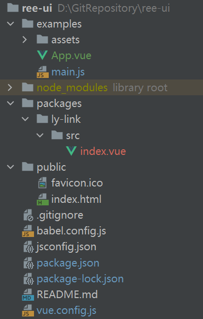
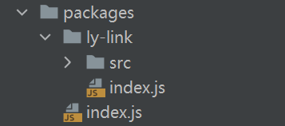
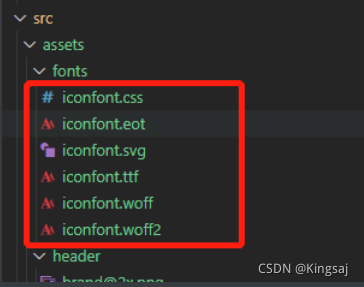
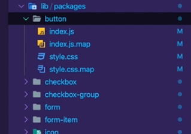

## 准备

### 安装vue-cli

可以使用下列任一命令安装这个新的包：

```sh
npm install -g @vue/cli
# OR
yarn global add @vue/cli
```

安装之后，你就可以在命令行中访问 `vue` 命令。你可以通过简单运行 `vue`，看看是否展示出了一份所有可用命令的帮助信息，来验证它是否安装成功。

你还可以用这个命令来检查其版本是否正确：

```sh
vue --version
```

### 创建项目

运行以下命令来创建一个新项目：

```
vue create hello-world
```

### 修改文件名称

#### 新建 packages

新建一个存放组件的文件夹 `packages` ，后面我们大部分组件开发工作也是在这里面进行的

#### 修改 src

再将 `src` 文件夹改成 `examples` ，`examples` 我们用来做测试使用

#### 新建 vue.config.js 

```js
module.exports = {
    pages: {
      index: {
        // 修改入口
        entry: 'examples/main.js',
        template: 'public/index.html',
        filename: 'index.html'
      }
    },
    chainWebpack: config => {
        config.module
          .rule('js')
          .include
            .add('/packages')
            .end()
          .use('babel')
            .loader('babel-loader')
            .tap(options => {
              return options
          })
     }
}
```

用来配置入口等信息

### 目录结构



## 组件设置

我们所有的组件放在 `packages` 目录下，那么目录结构肯定是长这样

```sh
|packages
|--- aComponent
|--- bComponent
|--- cComponent
```

将vue放在这里

```gherkin
|packages
|--- lyLink
|---|--- src
|---|---|--- index.vue
|---|--- index.js
```

### 创建index.js

通过index.js 作为暴露组件的 js

将packages中的组件统一由index.js来集中展示，引入到main.js 中。

> 是将packages处理成插件，在main.js中通过use来使用

### 按需引入

市面上的 UI组件库，一般都有个按需引入

比如 `element-ui`

```javascript
import { Button, Select } from 'element-ui'
```

为了实现按需引入的效果呢？在对应的组件文件夹中，再写上一个 `index.js`

就可以单独引入这个组件

结构如图



### cdn 引入

在外面的index.js加入这些语句即可

```js
 // 判断是否是直接引入cdn文件
 if (typeof window !== 'undefined' && window.Vue) {
     install(window.Vue)
 }
```


## ⚝基础组件

### ⚝按钮(Button)

| 属性     | 值               | 描述                                                         |
| -------- | ---------------- | ------------------------------------------------------------ |
| type     | String           | 按钮类型：primary,info,success,warning,danger                |
| plain    | Boolean          | 是否为朴素按钮，默认为 false                                 |
| mimicry  | Boolean          | 是否为拟态按钮，和 plain 不能同时设置，会被 plain 覆盖。默认为 false |
| disabled | Boolean          | 是否禁用按钮，默认为 false                                   |
| round    | Boolean          | 是否为圆角按钮，默认为 false                                 |
| circle   | Boolean          | 是否为圆形按钮，默认为 false                                 |
| icon     | Array 或 Boolean | font-awesome 字体数组，默认为 false                          |

| 事件  | 值       | 描述     |
| ----- | -------- | -------- |
| click | Function | 点击事件 |

#### 相关知识

> 组件通讯
>
> 组件插槽
>
> props校验

#### 代码	

```vue
<re-button @c="handleAlert">按钮</re-button> //App.vue

//子组件
<template>
  <button class="re-button" :class="[`re-button-${type}`,{
    'is-plain':plain,
    'is-round':round,
    'is-circle':circle,
    'is-disabled':disabled
  }]"
          @click="handleClick"
          :disabled="disabled"
  >
    <i v-if="icon" :class="`re-icon-${icon}`"></i>
    <!-- 如果没传入文本插槽，则不显示span内容 -->
    <span v-if="$slots.default"><slot></slot></span>
  </button>
</template>

<script>
export default {
  name: 'reButton',
  // 此时对props进行校验，值接收string类型的type值
  props: {
    type: {
      type: String,
      // 设置默认值：如果不传值，那么使用default
      default: 'defalut'
    },
    plain: {
      type: Boolean,
      default: false
    },
    round: {
      type: Boolean,
      default: false
    },
    circle: {
      type: Boolean,
      default: false
    },
    icon: {
      type: String,
      default: ''
    },
    disabled: {
      type: Boolean,
      default: false
    }
  },
  created () {
    // 显示所有插槽
    // console.log(this.$slots)
  },
  methods: {
    // 定义一个点击事件，这个点击事件的作用是调用父组件中的点击事件，并且回调
    handleClick (e) {
      this.$emit('c', e)
    }
  }
}
</script>
```


### ⚝对话框(Dialog)

| 属性     | 值      | 描述                               |
| -------- | ------- | ---------------------------------- |
| title    | String  | 对话框头部提示，默认为"提示"       |
| visiable | Boolean | 对话框可见状态，默认为 false       |
| mimicry  | Boolean | 对话框是否为拟态风格，默认为 false |
| width    | String  | 对话框宽度，默认为 60%             |
| top      | String  | 对话框距离顶部位置，默认为 15vh    |

| 插槽   | 描述                    |
| ------ | ----------------------- |
| title  | Dialog 标题区的内容     |
| footer | Dialog 按钮操作区的内容 |

#### 相关知识

> vue过度与动画
>
> sync修饰符 在vue3中已废弃，用v-model代替
>
> 具名插槽和v-slot指令
>
> 冒泡

#### 代码

```vue
    //App.vue
    <re-dialog :vis.sync="visible">
<!--      <re-dialog :vis="visible" @update:vis="visible = $event">-->
      <template v-slot:title>
        <h3>对话框</h3>
      </template>
      <template v-slot:footer>
        <re-button type="primary" @click="close">确认</re-button>
        <re-button @click="fn">取消</re-button>
      </template>
      这里是主体内容!!!!!!!!!!
    </re-dialog>
    
    //子组件
    <template>
  <transition name="dialog-fade">
    <!-- @click.self避免冒泡，只有点击自己时才能触发   -->
    <!--    遮罩-->
    <div class="re-dialog_wrapper" v-show="vis" @click.self="handleClose">
      <div class="re-dialog" :style="{width:width,marginTop:top}">
        <div class="re-dialog_header">
          <slot name="title">
            <!-- 将span放到slot内，这样不仅可以定义title文本，还可以定义样式等 -->
            <span class="re-dialog_title">
            {{title}}
            </span>
          </slot>
          <button class="re-dialog_headerbtn" @click="handleClose">
            <i class="re-icon-close"></i>
          </button>
        </div>
        <div class="re-dialog_body">
          <!-- 内容可能是除span以外的其他内容，比如列表等，所以在这里使用插槽，并且不规定插槽内具体的标签 -->
          <!-- 并且在这里使用匿名插槽，使用匿名插槽的好处就是不用指定名称，这样在不使用<template v-slot>指定插槽内容的时候，也可以自定义内容 -->
          <slot></slot>
        </div>
        <div class="re-dialog_footer">
          <!-- 如果footer不传递内容，则不显示footer -->
          <slot name="footer" v-if="$slots.footer">
          </slot>
        </div>
      </div>
    </div>
  </transition>
</template>

<script>
export default {
  name: 'reDialog',
  components: {
  },
  props: {
    title: {
      type: String,
      default: '提示'
    },
    width: {
      type: String,
      default: '50%'
    },
    top: {
      type: String,
      default: '15vh'
    },
    footer: {
      type: Object
    },
    vis: {
      type: Boolean,
      default: false
    }
  },
  data () {
    return {
      show: false
    }
  },
  methods: {
    handleClose () {
      this.$emit('update:vis', false)
    }
  }
}
</script>
```

### ⚝输入框(Input)

| 属性         | 值      | 描述                               |
| ------------ | ------- | ---------------------------------- |
| placeholder  | String  | 占位符，默认为空字符串             |
| type         | String  | 表单类型，默认为'text'             |
| mimicry      | Boolean | 对话框是否为拟态风格，默认为 false |
| name         | String  | 表单命名，默认为空                 |
| value        | String  | 表单值，默认为空字符串             |
| disabled     | Boolean | 是否禁用，默认为 false             |
| clearable    | Boolean | 是否可清空，默认为 false           |
| showPassword | Boolean | 是否显示密码可见，默认为 false     |

#### 相关知识

> v-model
>
> vue3 v-model父子组件的双向绑定和vue2的不一样，如下
>
> https://blog.csdn.net/skyblacktoday/article/details/116081638

#### 代码


```vue
    <re-input v-model="value"></re-input>  //App.vue
    //子组件
    <template>
  <div class="re-input" :class="{'one-input_suffix':showSuffix}">
    <input
        class="re-input_inner"
        :class="{'is-disabled': disabled}"
        :placeholder="placeholder"
        :type="showPassword ? (passwordVisible ? 'text' : 'password') : type"
        :name="name"
        :value="value"
        @input="handleInput"
        :disabled=disabled>
    <span class="re-input_suffix">
   <i class="on-input_icon re-icon-cancel" v-if="clearable && value" @click="clear"></i>
   <i class="on-input_icon re-icon-visible" v-if="showPassword && type=='password'" @click="handlePassword"></i>
 </span>
  </div>
</template>
<script>
export default {
  name: 'reInput',
  components: {
  },
  props: {
    placeholder: {
      type: String,
      default: ''
    },
    type: {
      type: String,
      default: 'text'
    },
    name: {
      type: String,
      default: ''
    },
    disabled: {
      type: Boolean,
      default: false
    },
    modelValue: {
      type: String,
      default: ''
    },
    clearable: {
      type: Boolean,
      default: false
    },
    showPassword: {
      type: Boolean,
      default: false
    }
  },
  watch: {},
  computed: {
    showSuffix () {
      return this.clearable || this.showPassword
    }
  },
  data () {
    return {
      // 显示是否显示密码框
      passwordVisible: false
    }
  },
  methods: {
    handleInput (e) {
      this.$emit('input', e.target.value)
    },
    clear () {
      this.$emit('input', '')
    },
    handlePassword () {
      this.passwordVisible = !this.passwordVisible
    }
  }
}
```

### 切换(Switch)

| 属性          | 值      | 描述                               |
| ------------- | ------- | ---------------------------------- |
| mimicry       | Boolean | 对话框是否为拟态风格，默认为 false |
| name          | String  | 表单命名，默认为空                 |
| value         | String  | 表单值，默认为空字符串             |
| disabled      | Boolean | 是否禁用，默认为 false             |
| activeColor   | String  | 激活状态颜色，默认为#dcdfe6        |
| inactiveColor | String  | 未激化状态颜色，默认为#dcdfe6      |

| 事件   | 值       | 描述                               |
| ------ | -------- | ---------------------------------- |
| change | Function | 状态修改触发事件，返回修改后的状态 |

#### 相关知识

> 生命周期mounted()时就修改颜色
>
> 改的时候修改颜色用watch，因为要等value发生改变再换颜色

#### 代码

在mounted周期时设置按钮初始化，通过watch监听value来改变颜色

点击input不仅改变value的值，同时也改变input的checked属性

```vue
//App.vue
<re-switch v-model="input"></re-switch>
//子组件
<template>
  <div class="re-switch" :class="{'is-checked':value}" @click="handleClick">
    <span class="re-switch_core" ref="core">
      <span class="re-switch_button"></span>
    </span>
<!--    用input是为了加上name属性-->
    <input type="checkbox" class="re-switch_input" :name="name" ref="input">
  </div>
</template>
<script>
export default {
  name: 'reSwitch',
  components: {
  },
  props: {
    value: {
      type: Boolean,
      defualt: false
    },
    activeColor: {
      type: String,
      defualt: true
    },
    inactiveColor: {
      type: String,
      defualt: false
    },
    name: {
      type: String,
      defualt: ''
    }
  },
  mounted () {
    // 修改开关颜色
    if (this.activeColor || this.inactiveColor) {
      var color = !this.value ? this.activeColor : this.inactiveColor
      this.$refs.core.style.borderColor = color
      this.$refs.core.style.backgroundColor = color
    }
    // 控制checkbox的值,input值同步value值
    this.$refs.input.checked = this.value
  },
  watch: {
    'value' (e) {
      // 修改开关颜色
      if (this.activeColor || this.inactiveColor) {
        var color = !e ? this.activeColor : this.inactiveColor
        this.$refs.core.style.borderColor = color
        this.$refs.core.style.backgroundColor = color
      }
    }
  },
  data () {
    return {}
  },
  methods: {
    handleClick () {
      this.$emit('change', !this.value)
      // 控制checkbox的值,input值同步value值
      this.$refs.input.checked = this.value
    }
  }
}
</script>
```


### 单选框(Radio)

| 属性    | 值                        | 描述                               |
| ------- | ------------------------- | ---------------------------------- |
| label   | [String, Number, Boolean] | 单选框 label 值，默认为空字符串    |
| mimicry | Boolean                   | 对话框是否为拟态风格，默认为 false |
| name    | String                    | 表单命名，默认为空                 |
| value   | String                    | 表单值，默认为空字符串             |
| color   | String                    | 单选框选择时的颜色，默认为#409eff  |


### 单选框组(RadioGroup)

用于包裹 radio，通过 v-model 指定组内所有的 radio 的 v-model

#### 相关知识

> 计算属性
>
> 爷孙通信provide 和 inject

#### 单选框和单选框组代码

```vue
//App.vue
<!--    ratio组件-->
    <br>
    <re-radio label="1" v-model="picked">男</re-radio>
    <re-radio label="0" v-model="picked">女</re-radio>
    <span>Picked:{{picked}}</span>
<!--    redio-group组件 升级为单选框组，组间互斥，子单选框不用v-model由group完成-->
    <br>
    <re-radio-group v-model="gender">
      <re-radio label="1">男</re-radio>
      <re-radio label="0">女</re-radio>
      <span>Picked:{{gender}}</span>
    </re-radio-group>
//子组件
//单选框组
<template>
  <div class="re-radio-group">
    <slot></slot>
  </div>
</template>
<script>
export default {
  name: 'reRadioGroup',
  provide () {
    return {
      RadioGroup: this
    }
  },
  props: {
    // 组件接收到了value值，我们需要触发这个组件的input事件
    // provide 与 inject  用来做祖孙之间得组件通讯
    modelValue: null
  }
}
</script>

//单选框
<template>
  <label class="re-radio" :class="{'is-checked': label == model}">
    <span class="re-radio_input">
      <span class="re-radio_inner"></span>
      <input
          type="radio"
          class="re-radio_original"
          :value="label"
          v-model="model"
      >
    </span>
    <span class="re-radio_label">
      <slot></slot>
      <!-- 如果没有传值，就把label作为文本显示 -->
      <template v-if="!$slots.default">{{label}}</template>
      </span>
  </label>
</template>
<script>
export default {
  name: 'reRadio',
  props: {
    label: {
      type: [String, Number, Boolean],
      defualt: ''
    },
    modelValue: null,
    name: {
      type: String,
      defualt: ''
    }
  },
  inject: {
    RadioGroup: {
      default: ''
    }
  },
  computed: {
    model: {
      get () {
        return this.isGroup ? this.RadioGroup.modelValue : this.modelValue
      },
      set (value) {
        // 触发父组件的input事件
        this.isGroup ? this.RadioGroup.$emit('update:modelValue', value) : this.$emit('update:modelValue', value)
      }
    },
    // 用于判断radio是否被radioGroup包裹
    isGroup () {
      return !!this.RadioGroup
    }
  },
  data () {
    return {}
  },
  methods: {}
}
</script>
```


### 复选框(Checkbox)

| 属性    | 值                        | 描述                               |
| ------- | ------------------------- | ---------------------------------- |
| label   | [String, Number, Boolean] | 单选框 label 值，默认为空字符串    |
| mimicry | Boolean                   | 对话框是否为拟态风格，默认为 false |
| name    | String                    | 表单命名，默认为空                 |
| value   | String                    | 表单值，默认为空字符串             |
| color   | String                    | 单选框选择时的颜色，默认为#409eff  |

### 复选框组(CheckboxGroup)

用于包裹多个 checkbox，通过 v-model 指定组内所有的 checkout 的 v-model

单个用是true或false，多个用是数组

> 原理和单选框相似，在传值的细节等方面由差别

#### 复选框和复选框组代码

```vue
//App.vue
<!--    单个checkbox组件-->
    <re-checkbox label="option" v-model="status"></re-checkbox>
    <span>Status:{{status}}</span>
<!--    多个checkbox-->
    <re-checkbox-group v-model="fruits">
      <re-checkbox label="西瓜" ></re-checkbox>
      <re-checkbox label="草莓" ></re-checkbox>
      <re-checkbox label="火龙果" ></re-checkbox>
      <span>Fruits:{{fruits}}</span>
    </re-checkbox-group>
//子组件
//复选框组
<template>
  <div class="one-checkbox-group">
    <slot></slot>
  </div>
</template>
<script>
export default {
  name: 'reCheckboxGroup',
  provide () {
    return {
      CheckboxGroup: this
    }
  },
  props: {
    modelValue: {
      type: Array
    }
  }
}
</script>

//单选框
<template>
  <label class="re-checkbox" :class="{' is-checked':isChecked}">
    <span class="re-checkbox_input">
      <span class="re-checkbox_inner"></span>
      <input type="checkbox"
             class="re-checkbox_original"
             :name="name"
             v-model="model"
             :value="label"
      >
    </span>
    <span class="re-checkbox_label">
      <slot></slot>
      <template v-if="!$slots.default">
        {{label}}
      </template>
    </span>
  </label>
</template>
<script>
export default {
  name: 'reCheckbox',
  inject: {
    CheckboxGroup: {
      default: ''
    }
  },
  props: {
    modelValue: {
      type: Boolean,
      default: false
    },
    label: {
      type: String,
      default: ''
    },
    name: {
      type: String,
      default: ''
    }
  },
  computed: {
    model: {
      get () {
        return this.isGroup ? this.CheckboxGroup.modelValue : this.modelValue
      },
      set (value) {
        this.isGroup ? this.CheckboxGroup.$emit('update:modelValue', value) : this.$emit('update:modelValue', value)
      }
    },
    isGroup () {
      return !!this.CheckboxGroup
    },
    isChecked () {
      // 如果是group包裹，判断label是否在model中
      // 如果没有group包裹,直接使用model
      return this.isGroup ? this.model.includes(this.label) : this.model
    }
  }
}
</script>

```


### 表单项(Form-item)

| 属性  | 值     | 描述                            |
| ----- | ------ | ------------------------------- |
| label | String | 单选框 label 值，默认为空字符串 |

### 表单(Form)

| 属性        | 值     | 描述                 |
| ----------- | ------ | -------------------- |
| model       | Object | 表单对象，必填       |
| label-width | String | 标签宽度，默认"80px" |

#### 相关知识

> html中form的使用

#### 表单项和表单代码

```vue
    //App.vue
    <re-form model="model" label-width="100px">
      <re-form-item label="用户名">
        <re-input placeholder="请输入用户名" v-model="model.username"></re-input>
      </re-form-item>
      <re-form-item label="选择">
        <re-switch v-model="model.activate"></re-switch>
      </re-form-item>
    </re-form>
    //re-form
    <template>
  <div class="one-form">
    <slot></slot>
  </div>
</template>
<script>
export default {
  name: 'reForm',
  provide () {
    return {
      Form: this
    }
  },
  props: {
    model: {
      type: Object,
      required: true
    },
    labelWidth: {
      type: String,
      default: '80px'
    }
  }
}
</script>
//re-form-item
<template>
  <div class="one-form-item">
    <label :style="labelStyle" class="one-form-item_label">{{label}}</label>
    <div class="one-form-item_content">
      <slot></slot>
    </div>
  </div>
</template>
<script>
export default {
  name: 'reFormItem',
  props: {
    label: {
      type: String,
      default: ''
    }
  },
  inject: ['Form'],
  computed: {
    labelStyle () {
      return {
        width: this.Form.labelWidth
      }
    }
  }
}
</script>
```

### 抽屉(Drawar)

有些时候, `Dialog` 组件并不满足我们的需求, 比如你的表单很长, 亦或是你需要临时展示一些文档, `Drawer` 拥有和 `Dialog` 几乎相同的 API, 在 UI 上带来不一样的体验.

| 属性      | 值      | 描述                                    |
| --------- | ------- | --------------------------------------- |
| title     | String  | Drawer标题                              |
| visiable  | Boolean | Drawer可见状态，默认为 false            |
| mimicry   | Boolean | Drawer是否为拟态风格，默认为 false      |
| size      | String  | Drawer宽度，默认为 60%                  |
| direction | String  | Drawer 打开的方向 rtl / ltr / ttb / btt |

| 插槽  | 描述                |
| ----- | ------------------- |
| title | Dialog 标题区的内容 |

```js
<template>
  <transition
    name="el-drawer-fade"
    @after-enter="afterEnter"
    @after-leave="afterLeave">
    <div
      class="el-drawer__wrapper"
      tabindex="-1"
      v-show="visible">
      <div
        class="el-drawer__container"
        :class="visible && 'el-drawer__open'"
        @click.self="handleWrapperClick"
        role="document"
        tabindex="-1">
        <div
          aria-modal="true"
          aria-labelledby="el-drawer__title"
          :aria-label="title"
          class="el-drawer"
          :class="[direction, customClass]"
          :style="isHorizontal ? `width: ${drawerSize}` : `height: ${drawerSize}`"
          ref="drawer"
          role="dialog"
          tabindex="-1"
          >
          <header class="el-drawer__header" id="el-drawer__title" v-if="withHeader">
            <slot name="title">
              <span role="heading" :title="title">{{ title }}</span>
            </slot>
            <button
              :aria-label="`close ${title || 'drawer'}`"
              class="el-drawer__close-btn"
              type="button"
              v-if="showClose"
              @click="closeDrawer">
              <i class="el-dialog__close el-icon el-icon-close"></i>
            </button>
          </header>
          <section class="el-drawer__body" v-if="rendered">
            <slot></slot>
          </section>
        </div>
      </div>
    </div>
  </transition>
</template>

<script>
import Popup from 'element-ui/src/utils/popup';
import emitter from 'element-ui/src/mixins/emitter';

export default {
  name: 'ElDrawer',
  mixins: [Popup, emitter],
  props: {
    appendToBody: {
      type: Boolean,
      default: false
    },
    beforeClose: {
      type: Function
    },
    customClass: {
      type: String,
      default: ''
    },
    closeOnPressEscape: {
      type: Boolean,
      default: true
    },
    destroyOnClose: {
      type: Boolean,
      default: false
    },
    modal: {
      type: Boolean,
      default: true
    },
    direction: {
      type: String,
      default: 'rtl',
      validator(val) {
        return ['ltr', 'rtl', 'ttb', 'btt'].indexOf(val) !== -1;
      }
    },
    modalAppendToBody: {
      type: Boolean,
      default: true
    },
    showClose: {
      type: Boolean,
      default: true
    },
    size: {
      type: [Number, String],
      default: '30%'
    },
    title: {
      type: String,
      default: ''
    },
    visible: {
      type: Boolean
    },
    wrapperClosable: {
      type: Boolean,
      default: true
    },
    withHeader: {
      type: Boolean,
      default: true
    }
  },
  computed: {
    isHorizontal() {
      return this.direction === 'rtl' || this.direction === 'ltr';
    },
    drawerSize() {
      return typeof this.size === 'number' ? `${this.size}px` : this.size;
    }
  },
  data() {
    return {
      closed: false,
      prevActiveElement: null
    };
  },
  watch: {
    visible(val) {
      if (val) {
        this.closed = false;
        this.$emit('open');
        if (this.appendToBody) {
          document.body.appendChild(this.$el);
        }
        this.prevActiveElement = document.activeElement;
      } else {
        if (!this.closed) {
          this.$emit('close');
          if (this.destroyOnClose === true) {
            this.rendered = false;
          }
        }
        this.$nextTick(() => {
          if (this.prevActiveElement) {
            this.prevActiveElement.focus();
          }
        });
      }
    }
  },
  methods: {
    afterEnter() {
      this.$emit('opened');
    },
    afterLeave() {
      this.$emit('closed');
    },
    hide(cancel) {
      if (cancel !== false) {
        this.$emit('update:visible', false);
        this.$emit('close');
        if (this.destroyOnClose === true) {
          this.rendered = false;
        }
        this.closed = true;
      }
    },
    handleWrapperClick() {
      if (this.wrapperClosable) {
        this.closeDrawer();
      }
    },
    closeDrawer() {
      if (typeof this.beforeClose === 'function') {
        this.beforeClose(this.hide);
      } else {
        this.hide();
      }
    },
    handleClose() {
      // This method here will be called by PopupManger, when the `closeOnPressEscape` was set to true
      // pressing `ESC` will call this method, and also close the drawer.
      // This method also calls `beforeClose` if there was one.
      this.closeDrawer();
    }
  },
  mounted() {
    if (this.visible) {
      this.rendered = true;
      this.open();
      if (this.appendToBody) {
        document.body.appendChild(this.$el);
      }
    }
  },
  destroyed() {
    // if appendToBody is true, remove DOM node after destroy
    if (this.appendToBody && this.$el && this.$el.parentNode) {
      this.$el.parentNode.removeChild(this.$el);
    }
  }
};
</script>

```


## button实现双向绑定

```html
<!DOCTYPE html>
<html lang="zh-CN">
<head>
    <meta charset="UTF-8">
    <title>Title</title>
</head>
<body>
<div id="app">
    我有{{total}}块钱
    <my-button :money="total" @update:money="total = $event"></my-button>
    //<my-button :money.sync="total"></my-button>    //.sync 语法糖写法

</div>

<template id="cpn2">
    <button @click="handleAdd">
        +
    </button>
</template>

<script src="js/vue.js"></script>
<script>
    let vm = new Vue({
        el: '#app',
        data() {
            return {
                total: 10,
            }
        },
        components: {
            myButton: {
                template: '#cpn2',
                props: {
                    money: {
                        type: Number
                    }
                },
                methods: {
                    handleAdd() {
                        this.$emit('update:money', this.money + 10)
                    },
                }
            }
        }

    });

</script>
</body>
</html>

```


## 可视化拖拽组件

### 相关知识

> vue-router
>
> vuex
>
> 组件冒泡
>
> css3动画（annimate）
>
> 

### 组件组成

上侧工具栏

左侧组件列表

中间画布

右侧功能列表

### 上侧工具栏

#### Toolbar组件

提供撤销、重做、插入图片、预览、保存、清空画布和调整画布大小功能

**撤销、重做**

先看一下代码：

```js
snapshotData: [], // 编辑器快照数据
snapshotIndex: -1, // 快照索引
        
undo(state) {
    if (state.snapshotIndex >= 0) {
        state.snapshotIndex--
        store.commit('setComponentData', deepCopy(state.snapshotData[state.snapshotIndex]))
    }
},

redo(state) {
    if (state.snapshotIndex < state.snapshotData.length - 1) {
        state.snapshotIndex++
        store.commit('setComponentData', deepCopy(state.snapshotData[state.snapshotIndex]))
    }
},

setComponentData(state, componentData = []) {
    Vue.set(state, 'componentData', componentData)
},

recordSnapshot(state) {
    // 添加新的快照
    state.snapshotData[++state.snapshotIndex] = deepCopy(state.componentData)
    // 在 undo 过程中，添加新的快照时，要将它后面的快照清理掉
    if (state.snapshotIndex < state.snapshotData.length - 1) {
        state.snapshotData = state.snapshotData.slice(0, state.snapshotIndex + 1)
    }
},
```

用一个数组来保存编辑器的快照数据。保存快照就是不停地执行 `push()` 操作，将当前的编辑器数据推入 `snapshotData` 数组，并增加快照索引 `snapshotIndex`。目前以下几个动作会触发保存快照操作：

- 新增组件
- 删除组件
- 改变图层层级
- 拖动组件结束时

...

**撤销**

假设现在 `snapshotData` 保存了 4 个快照。即 `[a, b, c, d]`，对应的快照索引为 3。如果这时进行了撤销操作，我们需要将快照索引减 1，然后将对应的快照数据赋值给画布。

例如当前画布数据是 d，进行撤销后，索引 -1，现在画布的数据是 c。

**重做**

明白了撤销，那重做就很好理解了，就是将快照索引加 1，然后将对应的快照数据赋值给画布。

不过还有一点要注意，就是在撤销操作中进行了新的操作，要怎么办呢？有两种解决方案：

1. 新操作替换当前快照索引后面所有的数据。还是用刚才的数据 `[a, b, c, d]` 举例，假设现在进行了两次撤销操作，快照索引变为 1，对应的快照数据为 b，如果这时进行了新的操作，对应的快照数据为 e。那 e 会把 cd 顶掉，现在的快照数据为 `[a, b, e]`。
2. 不顶掉数据，在原来的快照中新增一条记录。用刚才的例子举例，e 不会把 cd 顶掉，而是在 cd 之前插入，即快照数据变为 `[a, b, e, c, d]`。

采用的是第一种方案。


**预览、保存**

预览和编辑的渲染原理是一样的，区别是不需要编辑功能。所以只需要将原先渲染组件的代码稍微改一下就可以了。

```html
<!--页面组件列表展示-->
<Shape v-for="(item, index) in componentData"
    :defaultStyle="item.style"
    :style="getShapeStyle(item.style, index)"
    :key="item.id"
    :active="item === curComponent"
    :element="item"
    :zIndex="index"
>
    <component
        class="component"
        :is="item.component"
        :style="getComponentStyle(item.style)"
        :propValue="item.propValue"
    />
</Shape>
```

经过刚才的介绍，我们知道 `Shape` 组件具备了拖拽、放大缩小的功能。现在只需要将 `Shape` 组件去掉，外面改成套一个普通的 DIV 就可以了（其实不用这个 DIV 也行，但为了绑定事件这个功能，所以需要加上）。

```html
<!--页面组件列表展示-->
<div v-for="(item, index) in componentData" :key="item.id">
    <component
        class="component"
        :is="item.component"
        :style="getComponentStyle(item.style)"
        :propValue="item.propValue"
    />
</div>
```

保存代码的功能也特别简单，只需要保存画布上的数据 `componentData` 即可。保存有两种选择：

1. 保存到服务器
2. 本地保存

在 DEMO 上我使用的 `localStorage` 保存在本地。


### 左侧组件列表

#### ComponentList组件

**从组件列表到画布**

一个元素如果要设为可拖拽，必须给它添加一个 `draggable` 属性。另外，在将组件列表中的组件拖拽到画布中，还有两个事件是起到关键作用的：

1. `dragstart` 事件，在拖拽刚开始时触发。它主要用于将拖拽的组件信息传递给画布。
2. `drop` 事件，在拖拽结束时触发。主要用于接收拖拽的组件信息。

先来看一下左侧组件列表的代码：

```html
<div @dragstart="handleDragStart" class="component-list">
    <div v-for="(item, index) in componentList" :key="index" class="list" draggable :data-index="index">
        <i :class="item.icon"></i>
        <span>{{ item.label }}</span>
    </div>
</div>

handleDragStart(e) {
    e.dataTransfer.setData('index', e.target.dataset.index)
}
```

可以看到给列表中的每一个组件都设置了 `draggable` 属性。另外，在触发 `dragstart` 事件时，使用 `dataTransfer.setData()` 传输数据。再来看一下接收数据的代码：

```html
<div class="content" @drop="handleDrop" @dragover="handleDragOver" @click="deselectCurComponent">
    <Editor />
</div>

handleDrop(e) {
    e.preventDefault()
    e.stopPropagation()
    const component = deepCopy(componentList[e.dataTransfer.getData('index')])
    this.$store.commit('addComponent', component)
}
```

然后在画布中设置触发 `drop` 事件时，使用 `dataTransfer.getData()` 接收传输过来的索引数据，然后根据索引找到对应的组件数据，再添加到画布，从而渲染组件。


**组件在画布中移动**

首先需要将画布设为相对定位 `position: relative`，然后将每个组件设为绝对定位 `position: absolute`。除了这一点外，还要通过监听三个事件来进行移动：

1. `mousedown` 事件，在组件上按下鼠标时，记录组件当前的位置，即 xy 坐标（为了方便讲解，这里使用的坐标轴，实际上 xy 对应的是 css 中的 `left` 和 `top`。
2. `mousemove` 事件，每次鼠标移动时，都用当前最新的 xy 坐标减去最开始的 xy 坐标，从而计算出移动距离，再改变组件位置。
3. `mouseup` 事件，鼠标抬起时结束移动。

```js
handleMouseDown(e) {
    e.stopPropagation()
    this.$store.commit('setCurComponent', { component: this.element, zIndex: this.zIndex })

    const pos = { ...this.defaultStyle }
    const startY = e.clientY
    const startX = e.clientX
    // 如果直接修改属性，值的类型会变为字符串，所以要转为数值型
    const startTop = Number(pos.top)
    const startLeft = Number(pos.left)

    const move = (moveEvent) => {
        const currX = moveEvent.clientX
        const currY = moveEvent.clientY
        pos.top = currY - startY + startTop
        pos.left = currX - startX + startLeft
        // 修改当前组件样式
        this.$store.commit('setShapeStyle', pos)
    }

    const up = () => {
        document.removeEventListener('mousemove', move)
        document.removeEventListener('mouseup', up)
    }

    document.addEventListener('mousemove', move)
    document.addEventListener('mouseup', up)
}
```


### 中间画布

#### **Editor组件**

这个编辑器的实现思路：

1. 用一个数组 `componentData` 维护编辑器中的数据。
2. 把组件拖拽到画布中时，使用 `push()` 方法将新的组件数据添加到 `componentData`。
3. 编辑器使用 `v-for` 指令遍历 `componentData`，将每个组件逐个渲染到画布（也可以使用 JSX 语法结合 `render()` 方法代替）。

编辑器渲染的核心代码如下所示：

```js
<component 
  v-for="item in componentData"
  :key="item.id"
  :is="item.component"
  :style="item.style"
  :propValue="item.propValue"
/>
```

每个组件数据大概是这样：

```js
{
    component: 'v-text', // 组件名称，需要提前注册到 Vue
    label: '文字', // 左侧组件列表中显示的名字
    propValue: '文字', // 组件所使用的值
    icon: 'el-icon-edit', // 左侧组件列表中显示的名字
    animations: [], // 动画列表
    events: {}, // 事件列表
    style: { // 组件样式
        width: 200,
        height: 33,
        fontSize: 14,
        fontWeight: 500,
        lineHeight: '',
        letterSpacing: 0,
        textAlign: '',
        color: '',
    },
}
```

在遍历 `componentData` 组件数据时，主要靠 `is` 属性来识别出真正要渲染的是哪个组件。

例如要渲染的组件数据是 `{ component: 'v-text' }`，则 `<component :is="item.component" />` 会被转换为 `<v-text />`。当然，你这个组件也要提前注册到 Vue 中。


Editor由Shape, ContextMenu, MarkLine, Area, Grid子组件构成

| 组件        | 描述                                                         |
| :---------- | ------------------------------------------------------------ |
| Shape       | 将componentData中的组件渲染到画布上，同时设置点击选中事件，提供选中样式和放大缩小功能，并提供相应信息（是否在编辑器中，当前组件选中状态等信息） |
| ContextMenu | 右键上下文，有复制、粘贴、剪切、删除、锁定、置顶、置底、上移、下移等功能 |
| MarkLine    | 组件标线吸附                                                 |
| Area        | 提供选中区域的组件信息和位置信息，并展示样式                 |
| Grid        | 画布展示网格线                                               |

#### Shape组件

点击画布上的组件时，组件上会出现 8 个小圆点。这 8 个小圆点用来放大缩小。实现原理如下：

1. 在每个组件外面包一层 `Shape` 组件，`Shape` 组件里包含 8 个小圆点和一个 `<slot>` 插槽，用于放置组件。

```html
<!--页面组件列表展示-->
<Shape v-for="(item, index) in componentData"
    :defaultStyle="item.style"
    :style="getShapeStyle(item.style, index)"
    :key="item.id"
    :active="item === curComponent"
    :element="item"
    :zIndex="index"
>
    <component
        class="component"
        :is="item.component"
        :style="getComponentStyle(item.style)"
        :propValue="item.propValue"
    />
</Shape>
```

`Shape` 组件内部结构：

```html
<template>
    <div class="shape" :class="{ active: this.active }" @click="selectCurComponent" @mousedown="handleMouseDown"
    @contextmenu="handleContextMenu">
        <div
            class="shape-point"
            v-for="(item, index) in (active? pointList : [])"
            @mousedown="handleMouseDownOnPoint(item)"
            :key="index"
            :style="getPointStyle(item)">
        </div>
        <slot></slot>
    </div>
</template>
```

2. 点击组件时，将 8 个小圆点显示出来。

起作用的是这行代码 `:active="item === curComponent"`。

3. 计算每个小圆点的位置。

先来看一下计算小圆点位置的代码：

```js
const pointList = ['t', 'r', 'b', 'l', 'lt', 'rt', 'lb', 'rb']

getPointStyle(point) {
    const { width, height } = this.defaultStyle
    const hasT = /t/.test(point)
    const hasB = /b/.test(point)
    const hasL = /l/.test(point)
    const hasR = /r/.test(point)
    let newLeft = 0
    let newTop = 0

    // 四个角的点
    if (point.length === 2) {
        newLeft = hasL? 0 : width
        newTop = hasT? 0 : height
    } else {
        // 上下两点的点，宽度居中
        if (hasT || hasB) {
            newLeft = width / 2
            newTop = hasT? 0 : height
        }

        // 左右两边的点，高度居中
        if (hasL || hasR) {
            newLeft = hasL? 0 : width
            newTop = Math.floor(height / 2)
        }
    }

    const style = {
        marginLeft: hasR? '-4px' : '-3px',
        marginTop: '-3px',
        left: `${newLeft}px`,
        top: `${newTop}px`,
        cursor: point.split('').reverse().map(m => this.directionKey[m]).join('') + '-resize',
    }

    return style
}
```

计算小圆点的位置需要获取一些信息：

- 组件的高度 `height`、宽度 `width`

注意，小圆点也是绝对定位的，相对于 `Shape` 组件。所以有四个小圆点的位置很好确定：

1. 左上角的小圆点，坐标 `left: 0, top: 0`
2. 右上角的小圆点，坐标 `left: width, top: 0`
3. 左下角的小圆点，坐标 `left: 0, top: height`
4. 右下角的小圆点，坐标 `left: width, top: height`


另外的四个小圆点需要通过计算间接算出来。例如左边中间的小圆点，计算公式为 `left: 0, top: height / 2`，其他小圆点同理。


4. 点击小圆点时，可以进行放大缩小操作。

```js
handleMouseDownOnPoint(point) {
    const downEvent = window.event
    downEvent.stopPropagation()
    downEvent.preventDefault()

    const pos = { ...this.defaultStyle }
    const height = Number(pos.height)
    const width = Number(pos.width)
    const top = Number(pos.top)
    const left = Number(pos.left)
    const startX = downEvent.clientX
    const startY = downEvent.clientY

    // 是否需要保存快照
    let needSave = false
    const move = (moveEvent) => {
        needSave = true
        const currX = moveEvent.clientX
        const currY = moveEvent.clientY
        const disY = currY - startY
        const disX = currX - startX
        const hasT = /t/.test(point)
        const hasB = /b/.test(point)
        const hasL = /l/.test(point)
        const hasR = /r/.test(point)
        const newHeight = height + (hasT? -disY : hasB? disY : 0)
        const newWidth = width + (hasL? -disX : hasR? disX : 0)
        pos.height = newHeight > 0? newHeight : 0
        pos.width = newWidth > 0? newWidth : 0
        pos.left = left + (hasL? disX : 0)
        pos.top = top + (hasT? disY : 0)
        this.$store.commit('setShapeStyle', pos)
    }

    const up = () => {
        document.removeEventListener('mousemove', move)
        document.removeEventListener('mouseup', up)
        needSave && this.$store.commit('recordSnapshot')
    }

    document.addEventListener('mousemove', move)
    document.addEventListener('mouseup', up)
}
```

它的原理是这样的：

1. 点击小圆点时，记录点击的坐标 xy。
2. 假设我们现在向下拖动，那么 y 坐标就会增大。
3. 用新的 y 坐标减去原来的 y 坐标，就可以知道在纵轴方向的移动距离是多少。
4. 最后再将移动距离加上原来组件的高度，就可以得出新的组件高度。
5. 如果是正数，说明是往下拉，组件的高度在增加。如果是负数，说明是往上拉，组件的高度在减少。


#### ContextMenu组件

有复制、粘贴、剪切、删除、锁定、置顶、置底、上移、下移等功能，这些功能的实现分别如下：

**复制操作**

在 vuex 中使用 `copyData` 来表示复制的数据。当用户按下 `ctrl + c` 时，将当前组件数据深拷贝到 `copyData`。

```js
copy(state) {
    state.copyData = {
        data: deepCopy(state.curComponent),
        index: state.curComponentIndex,
    }
},
```

同时需要将当前组件在组件数据中的索引记录起来，在剪切中要用到。

**粘贴操作**

```js
paste(state, isMouse) {
    if (!state.copyData) {
        toast('请选择组件')
        return
    }

    const data = state.copyData.data

    if (isMouse) {
        data.style.top = state.menuTop
        data.style.left = state.menuLeft
    } else {
        data.style.top += 10
        data.style.left += 10
    }

    data.id = generateID()
    store.commit('addComponent', { component: data })
    store.commit('recordSnapshot')
    state.copyData = null
},
```

粘贴时，如果是按键操作 `ctrl+v`。则将组件的 `top` `left` 属性加 10，以免和原来的组件重叠在一起。如果是使用鼠标右键执行粘贴操作，则将复制的组件放到鼠标点击处。

**剪切操作**

```js
cut(state) {
    if (!state.curComponent) {
        toast('请选择组件')
        return
    }

    if (state.copyData) {
        store.commit('addComponent', { component: state.copyData.data, index: state.copyData.index })
        if (state.curComponentIndex >= state.copyData.index) {
            // 如果当前组件索引大于等于插入索引，需要加一，因为当前组件往后移了一位
            state.curComponentIndex++
        }
    }

    store.commit('copy')
    store.commit('deleteComponent')
},
```

剪切操作本质上还是复制，只不过在执行复制后，需要将当前组件删除。为了避免用户执行剪切操作后，不执行粘贴操作，而是继续执行剪切。这时就需要将原先剪切的数据进行恢复。所以复制数据中记录的索引就起作用了，可以通过索引将原来的数据恢复到原来的位置中。

**通过右键操作**

右键操作和按键操作是一样的，一个功能两种触发途径。

```html
<li @click="copy" v-show="curComponent">复制</li>
<li @click="paste">粘贴</li>
<li @click="cut" v-show="curComponent">剪切</li>

cut() {
    this.$store.commit('cut')
},

copy() {
    this.$store.commit('copy')
},

paste() {
    this.$store.commit('paste', true)
}
```

**锁定组件**

锁定组件主要是看到 `processon` 和墨刀有这个功能，于是我顺便实现了。锁定组件的具体需求为：不能移动、放大缩小、旋转、复制、粘贴等，只能进行解锁操作。

它的实现原理也不难：

1. 在自定义组件上加一个 `isLock` 属性，表示是否锁定组件。
2. 在点击组件时，根据 `isLock` 是否为 `true` 来隐藏组件上的八个点和旋转图标。
3. 为了突出一个组件被锁定，给它加上透明度属性和一个锁的图标。
4. 如果组件被锁定，置灰上面所说的需求对应的按钮，不能被点击。

**改变图层层级**

由于拖拽组件到画布中是有先后顺序的，所以可以按照数据顺序来分配图层层级。

例如画布新增了五个组件 abcde，那它们在画布数据中的顺序为 `[a, b, c, d, e]`，图层层级和索引一一对应，即它们的 `z-index` 属性值是 01234（后来居上）。用代码表示如下：

```html
<div v-for="(item, index) in componentData" :zIndex="index"></div>
```

改变图层层级，即是改变组件数据在 `componentData` 数组中的顺序。例如有 `[a, b, c]` 三个组件，它们的图层层级从低到高顺序为 abc（索引越大，层级越高）。

如果要将 b 组件上移，只需将它和 c 调换顺序即可：

```js
const temp = componentData[1]
componentData[1] = componentData[2]
componentData[2] = temp
```

同理，置顶置底也是一样，例如我要将 a 组件置顶，只需将 a 和最后一个组件调换顺序即可：

```js
const temp = componentData[0]
componentData[0] = componentData[componentData.lenght - 1]
componentData[componentData.lenght - 1] = temp
```


#### MarkLine组件

提供吸附功能，就是在拖拽组件时，如果它和另一个组件的距离比较接近，就会自动吸附在一起。


吸附的代码大概在 300 行左右，建议自己打开源码文件看（文件路径：`src\components\Editor\MarkLine.vue`）。这里不贴代码了，主要说说原理是怎么实现的。

**标线**

在页面上创建 6 条线，分别是三横三竖。这 6 条线的作用是对齐，它们什么时候会出现呢？

1. 上下方向的两个组件左边、中间、右边对齐时会出现竖线
2. 左右方向的两个组件上边、中间、下边对齐时会出现横线

具体的计算公式主要是根据每个组件的 xy 坐标和宽度高度进行计算的。例如要判断 ab 两个组件的左边是否对齐，则要知道它们每个组件的 x 坐标；如果要知道它们右边是否对齐，除了要知道 x 坐标，还要知道它们各自的宽度。

```js
// 左对齐的条件
a.x == b.x

// 右对齐的条件
a.x + a.width == b.x + b.width
```

在对齐的时候，显示标线。

另外还要判断 ab 两个组件是否“足够”近。如果足够近，就吸附在一起。是否足够近要靠一个变量来判断：

```js
diff: 3, // 相距 dff 像素将自动吸附
复制代码
```

小于等于 `diff` 像素则自动吸附。

**吸附**

**吸附效果是怎么实现的呢？**

假设现在有 ab 组件，a 组件坐标 xy 都是 0，宽高都是 100。现在假设 a 组件不动，我们正在拖拽 b 组件。当把 b 组件拖到坐标为 `x: 0, y: 103` 时，由于 `103 - 100 <= 3(diff)`，所以可以判定它们已经接近得足够近。这时需要手动将 b 组件的 y 坐标值设为 100，这样就将 ab 组件吸附在一起了。


**优化**

在拖拽时如果 6 条标线都显示出来会不太美观。所以我们可以做一下优化，在纵横方向上最多只同时显示一条线。实现原理如下：

1. a 组件在左边不动，我们拖着 b 组件往 a 组件靠近。
2. 这时它们最先对齐的是 a 的右边和 b 的左边，所以只需要一条线就够了。
3. 如果 ab 组件已经靠近，并且 b 组件继续往左边移动，这时就要判断它们俩的中间是否对齐。
4. b 组件继续拖动，这时需要判断 a 组件的左边和 b 组件的右边是否对齐，也是只需要一条线。

可以发现，关键的地方是我们要知道两个组件的方向。即 ab 两个组件靠近，我们要知道到底 b 是在 a 的左边还是右边。

这一点可以通过鼠标移动事件来判断，之前在讲解拖拽的时候说过，`mousedown` 事件触发时会记录起点坐标。所以每次触发 `mousemove` 事件时，用当前坐标减去原来的坐标，就可以判断组件方向。例如 x 方向上，如果 `b.x - a.x` 的差值为正，说明是 b 在 a 右边，否则为左边。

```js
// 触发元素移动事件，用于显示标线、吸附功能
// 后面两个参数代表鼠标移动方向
// currY - startY > 0 true 表示向下移动 false 表示向上移动
// currX - startX > 0 true 表示向右移动 false 表示向左移动
eventBus.$emit('move', this.$el, currY - startY > 0, currX - startX > 0)
```


| 事件        | 值       | 描述                                                         |
| ----------- | -------- | ------------------------------------------------------------ |
| contextmenu | Function | 右键将当前位移状态更新到vuex state并且将右键上下文内容的class设置为true，并将其显示。 |
| mousedown   | Function | 点击时展示点击样式，以及提供编辑器位置属性并得到选中区域中的组件，如果有选中的组件，设置选中区域位移大小信息和区域内的组件数据 |

### 右侧功能列表

有属性列表、动画列表、事件列表，分别对应

AttrList组件，AnimationList组件，EventList组件

#### AttrList组件

每个组件都有一些通用属性和独有的属性，我们需要提供一个能显示和修改属性的地方。

```js
// 每个组件数据大概是这样
{
    component: 'v-text', // 组件名称，需要提前注册到 Vue
    label: '文字', // 左侧组件列表中显示的名字
    propValue: '文字', // 组件所使用的值
    icon: 'el-icon-edit', // 左侧组件列表中显示的名字
    animations: [], // 动画列表
    events: {}, // 事件列表
    style: { // 组件样式
        width: 200,
        height: 33,
        fontSize: 14,
        fontWeight: 500,
        lineHeight: '',
        letterSpacing: 0,
        textAlign: '',
        color: '',
    },
}
```


我定义了一个 `AttrList` 组件，用于显示每个组件的属性。

```html
<template>
    <div class="attr-list">
        <el-form>
            <el-form-item v-for="(key, index) in styleKeys" :key="index" :label="map[key]">
                <el-color-picker v-if="key == 'borderColor'" v-model="curComponent.style[key]"></el-color-picker>
                <el-color-picker v-else-if="key == 'color'" v-model="curComponent.style[key]"></el-color-picker>
                <el-color-picker v-else-if="key == 'backgroundColor'" v-model="curComponent.style[key]"></el-color-picker>
                <el-select v-else-if="key == 'textAlign'" v-model="curComponent.style[key]">
                    <el-option
                        v-for="item in options"
                        :key="item.value"
                        :label="item.label"
                        :value="item.value"
                    ></el-option>
                </el-select>
                <el-input type="number" v-else v-model="curComponent.style[key]" />
            </el-form-item>
            <el-form-item label="内容" v-if="curComponent && curComponent.propValue && !excludes.includes(curComponent.component)">
                <el-input type="textarea" v-model="curComponent.propValue" />
            </el-form-item>
        </el-form>
    </div>
</template>
```

代码逻辑很简单，就是遍历组件的 `style` 对象，将每一个属性遍历出来。并且需要根据具体的属性用不同的组件显示出来，例如颜色属性，需要用颜色选择器显示；数值类的属性需要用 `type=number` 的 input 组件显示等等。

为了方便用户修改属性值，我使用 `v-model` 将组件和值绑定在一起。


#### AnimationList组件

动画和事件的原理是一样的，先将所有的动画通过 `v-for` 指令渲染出来，然后点击动画将对应的动画添加到组件的 `animations` 数组里。同事件一样，执行的时候也是遍历组件所有的动画并执行。

为了方便，我们使用了 [animate.css](https://link.juejin.cn?target=https%3A%2F%2Fanimate.style%2F) 动画库。

```js
// main.js
import '@/styles/animate.css'
```

现在我们提前定义好所有的动画数据：

```js
export default [
    {
        label: '进入',
        children: [
            { label: '渐显', value: 'fadeIn' },
            { label: '向右进入', value: 'fadeInLeft' },
            { label: '向左进入', value: 'fadeInRight' },
            { label: '向上进入', value: 'fadeInUp' },
            { label: '向下进入', value: 'fadeInDown' },
            { label: '向右长距进入', value: 'fadeInLeftBig' },
            { label: '向左长距进入', value: 'fadeInRightBig' },
            { label: '向上长距进入', value: 'fadeInUpBig' },
            { label: '向下长距进入', value: 'fadeInDownBig' },
            { label: '旋转进入', value: 'rotateIn' },
            { label: '左顺时针旋转', value: 'rotateInDownLeft' },
            { label: '右逆时针旋转', value: 'rotateInDownRight' },
            { label: '左逆时针旋转', value: 'rotateInUpLeft' },
            { label: '右逆时针旋转', value: 'rotateInUpRight' },
            { label: '弹入', value: 'bounceIn' },
            { label: '向右弹入', value: 'bounceInLeft' },
            { label: '向左弹入', value: 'bounceInRight' },
            { label: '向上弹入', value: 'bounceInUp' },
            { label: '向下弹入', value: 'bounceInDown' },
            { label: '光速从右进入', value: 'lightSpeedInRight' },
            { label: '光速从左进入', value: 'lightSpeedInLeft' },
            { label: '光速从右退出', value: 'lightSpeedOutRight' },
            { label: '光速从左退出', value: 'lightSpeedOutLeft' },
            { label: 'Y轴旋转', value: 'flip' },
            { label: '中心X轴旋转', value: 'flipInX' },
            { label: '中心Y轴旋转', value: 'flipInY' },
            { label: '左长半径旋转', value: 'rollIn' },
            { label: '由小变大进入', value: 'zoomIn' },
            { label: '左变大进入', value: 'zoomInLeft' },
            { label: '右变大进入', value: 'zoomInRight' },
            { label: '向上变大进入', value: 'zoomInUp' },
            { label: '向下变大进入', value: 'zoomInDown' },
            { label: '向右滑动展开', value: 'slideInLeft' },
            { label: '向左滑动展开', value: 'slideInRight' },
            { label: '向上滑动展开', value: 'slideInUp' },
            { label: '向下滑动展开', value: 'slideInDown' },
        ],
    },
    {
        label: '强调',
        children: [
            { label: '弹跳', value: 'bounce' },
            { label: '闪烁', value: 'flash' },
            { label: '放大缩小', value: 'pulse' },
            { label: '放大缩小弹簧', value: 'rubberBand' },
            { label: '左右晃动', value: 'headShake' },
            { label: '左右扇形摇摆', value: 'swing' },
            { label: '放大晃动缩小', value: 'tada' },
            { label: '扇形摇摆', value: 'wobble' },
            { label: '左右上下晃动', value: 'jello' },
            { label: 'Y轴旋转', value: 'flip' },
        ],
    },
    {
        label: '退出',
        children: [
            { label: '渐隐', value: 'fadeOut' },
            { label: '向左退出', value: 'fadeOutLeft' },
            { label: '向右退出', value: 'fadeOutRight' },
            { label: '向上退出', value: 'fadeOutUp' },
            { label: '向下退出', value: 'fadeOutDown' },
            { label: '向左长距退出', value: 'fadeOutLeftBig' },
            { label: '向右长距退出', value: 'fadeOutRightBig' },
            { label: '向上长距退出', value: 'fadeOutUpBig' },
            { label: '向下长距退出', value: 'fadeOutDownBig' },
            { label: '旋转退出', value: 'rotateOut' },
            { label: '左顺时针旋转', value: 'rotateOutDownLeft' },
            { label: '右逆时针旋转', value: 'rotateOutDownRight' },
            { label: '左逆时针旋转', value: 'rotateOutUpLeft' },
            { label: '右逆时针旋转', value: 'rotateOutUpRight' },
            { label: '弹出', value: 'bounceOut' },
            { label: '向左弹出', value: 'bounceOutLeft' },
            { label: '向右弹出', value: 'bounceOutRight' },
            { label: '向上弹出', value: 'bounceOutUp' },
            { label: '向下弹出', value: 'bounceOutDown' },
            { label: '中心X轴旋转', value: 'flipOutX' },
            { label: '中心Y轴旋转', value: 'flipOutY' },
            { label: '左长半径旋转', value: 'rollOut' },
            { label: '由小变大退出', value: 'zoomOut' },
            { label: '左变大退出', value: 'zoomOutLeft' },
            { label: '右变大退出', value: 'zoomOutRight' },
            { label: '向上变大退出', value: 'zoomOutUp' },
            { label: '向下变大退出', value: 'zoomOutDown' },
            { label: '向左滑动收起', value: 'slideOutLeft' },
            { label: '向右滑动收起', value: 'slideOutRight' },
            { label: '向上滑动收起', value: 'slideOutUp' },
            { label: '向下滑动收起', value: 'slideOutDown' },
        ],
    },
]
复制代码
```

然后用 `v-for` 指令渲染出来动画列表。


**添加动画**

```html
<el-tabs v-model="animationActiveName">
    <el-tab-pane v-for="item in animationClassData" :key="item.label" :label="item.label" :name="item.label">
        <el-scrollbar class="animate-container">
            <div
                class="animate"
                v-for="(animate, index) in item.children"
                :key="index"
                @mouseover="hoverPreviewAnimate = animate.value"
                @click="addAnimation(animate)"
            >
                <div :class="[hoverPreviewAnimate === animate.value && animate.value + ' animated']">
                    {{ animate.label }}
                </div>
            </div>
        </el-scrollbar>
    </el-tab-pane>
</el-tabs>
复制代码
```

点击动画将调用 `addAnimation(animate)` 将动画添加到组件的 `animations` 数组。

**触发动画**

运行动画的代码：

```js
export default async function runAnimation($el, animations = []) {
    const play = (animation) => new Promise(resolve => {
        $el.classList.add(animation.value, 'animated')
        const removeAnimation = () => {
            $el.removeEventListener('animationend', removeAnimation)
            $el.removeEventListener('animationcancel', removeAnimation)
            $el.classList.remove(animation.value, 'animated')
            resolve()
        }
            
        $el.addEventListener('animationend', removeAnimation)
        $el.addEventListener('animationcancel', removeAnimation)
    })

    for (let i = 0, len = animations.length; i < len; i++) {
        await play(animations[i])
    }
}
```

运行动画需要两个参数：组件对应的 DOM 元素（在组件使用 `this.$el` 获取）和它的动画数据 `animations`。并且需要监听 `animationend` 事件和 `animationcancel` 事件：一个是动画结束时触发，一个是动画意外终止时触发。

利用这一点再配合 `Promise` 一起使用，就可以逐个运行组件的每个动画了。

#### EventList组件

每个组件有一个 `events` 对象，用于存储绑定的事件。目前我只定义了两个事件：

- alert 事件
- redirect 事件

```js
// 编辑器自定义事件
const events = {
    redirect(url) {
        if (url) {
            window.location.href = url
        }
    },

    alert(msg) {
        if (msg) {
            alert(msg)
        }
    },
}

const mixins = {
    methods: events,
}

const eventList = [
    {
        key: 'redirect',
        label: '跳转事件',
        event: events.redirect,
        param: '',
    },
    {
        key: 'alert',
        label: 'alert 事件',
        event: events.alert,
        param: '',
    },
]

export {
    mixins,
    events,
    eventList,
}
```

不过不能在编辑的时候触发，可以在预览的时候触发。


**添加事件**

通过 `v-for` 指令将事件列表渲染出来：

```html
<el-tabs v-model="eventActiveName">
    <el-tab-pane v-for="item in eventList" :key="item.key" :label="item.label" :name="item.key" style="padding: 0 20px">
        <el-input v-if="item.key == 'redirect'" v-model="item.param" type="textarea" placeholder="请输入完整的 URL" />
        <el-input v-if="item.key == 'alert'" v-model="item.param" type="textarea" placeholder="请输入要 alert 的内容" />
        <el-button style="margin-top: 20px;" @click="addEvent(item.key, item.param)">确定</el-button>
    </el-tab-pane>
</el-tabs>
```

选中事件时将事件添加到组件的 `events` 对象。

**触发事件**

预览或真正渲染页面时，也需要在每个组件外面套一层 DIV，这样就可以在 DIV 上绑定一个点击事件，点击时触发我们刚才添加的事件。

```html
<template>
    <div @click="handleClick">
        <component
            class="conponent"
            :is="config.component"
            :style="getStyle(config.style)"
            :propValue="config.propValue"
        />
    </div>
</template>

handleClick() {
    const events = this.config.events
    // 循环触发绑定的事件
    Object.keys(events).forEach(event => {
        this[event](events[event])
    })
}
```

## 函数式组件

在 Vue 2 中，函数式组件主要有两个应用场景：

- 作为性能优化，因为它们的初始化速度比有状态组件快得多
- 返回多个根节点

然而，在 Vue 3 中，有状态组件的性能已经提高到它们之间的区别可以忽略不计的程度。此外，有状态组件现在也支持返回多个根节点。

因此，函数式组件剩下的唯一应用场景就是简单组件，比如创建动态标题的组件。否则，建议你像平常一样使用有状态组件。

所以在vue2中用到

https://www.jianshu.com/p/3e22abebc97b

https://github.com/GeekQiaQia/Blob/blob/master/%E5%89%8D%E7%AB%AFVue%EF%BC%9A%E5%87%BD%E6%95%B0%E5%BC%8F%E7%BB%84%E4%BB%B6.md

https://segmentfault.com/a/1190000040159888


## ⚝mixin的使用

对有**弹出层**的组件进行共性提取，本项目中有多个组件需要弹出，分别是drawer抽屉，dialog对话框。

这些组件的共性就是 都需要**显示和隐藏**，都有遮罩层部分，动画效果一致。

**将props中的visible、zIndex等进行抽离，对handleClose方法进行抽离，beforeDestroy钩子函数进行抽离**

所以实现了弹出层组件**显示和隐藏功能**的mixins文件

```js
// src/common/mixins/visibility.js
const EVENT_TOGGLE = 'toggle'

export default {
  model: {
    prop: 'visible',
    event: EVENT_TOGGLE
  },
  props: {
    visible: {
      type: Boolean,
      default: false
    },
    zIndex: {
      type: Number,
      default: 100
    },
    maskStyle: {
      type: Object,
      default: () => {}
    },
    containerStyle: {
      type: Object,
      default: () => {}
    }
  },
  data () {
    return {
      isVisible: false
    }
  },
  methods: {
    handleClose () {
      this.$emit('update:vis', false)
    }
  },
  beforeDestroy () {
    this.lockScroll && (document.body.style.overflow = '')
  }
}
```

使用：

```js
// 组件文件

<script>
import visibilityMixin from 'mixins/visibility'

export default {
    mixins: [ visibilityMixin ]
}
</script>
```


## 文件结构

```sh
├── dist                       # 文档打包目录
├── docs                       # 说明文档目录
├── examples                   # 组件案例目录
├── build                      # 相关构建文件
│   ├── webpack.common.js      # 组件全局打包 
│   ├── webpack.component.js   # 组件按需打包
├── packages                   # 组件目录
│   ├── re-button              #
│       ├── src                # 
│            ├── index.vue     # 组件
│       ├── index.js           # 单个组件注册并暴露
│   ├── index.js               # 收集所有子组件 一起注册 然后全局导出
├── test                       # 单元测试目录
├── components.json            # 组件路径关系，以key,value的形式保存

```

## ⚝全局引入和按需引入实现

### 全局引入实现

在和packages同级的index.js中将所有的子组件存到数组中，定义一个install方法，将所有的组件以（组件名，组件）的形式进行全局注册，然后导出install方法和各子组件

```js
// 引入组件
import reLink from './re-link'
import reButton from './re-button'
import reDialog from './re-dialog'
import reInput from './re-input'
import reSwitch from './re-switch'
import reRadio from './re-ratio'
import reRadioGroup from './re-radio-group'
import reCheckbox from './re-checkbox'
import reCheckboxGroup from './re-checkbox-group'
import reForm from './re-from'
import reFormItem from './re-form-item'
// 存放组件的数组
const components = [
    reLink,
    reButton,
    reDialog,
    reInput,
    reSwitch,
    reRadio,
    reRadioGroup,
    reCheckbox,
    reCheckboxGroup,
    reForm,
    reFormItem
]

// 定义 install 方法，接收 Vue 作为参数。
const install = function (Vue) {
    // 判断是否安装
    if (install.installed) return
    // 遍历 components 数组，来进行全局注册
    components.map(component => {
        Vue.component(component.name, component)
    })
}

 // 判断是否是直接引入cdn文件
 if (typeof window !== 'undefined' && window.Vue) {
     install(window.Vue)
 }

export default install

export {
    // 导出的对象必须具有 install，才能被 Vue.use() 方法安装
    install,
    reLink,
    reButton,
    reDialog,
    reInput,
    reSwitch,
    reRadio,
    reRadioGroup,
    reCheckbox,
    reCheckboxGroup,
    reForm,
    reFormItem
}
```


#### 使用

```js
import reUI from 'ree-ui'
import 'ree-ui/lib/styles/owl-ui.css'

Vue.use(reUI)
```

### 全局引入优化

在index中手动使用 import 逐个引入会导致import 写的越来越多，可以使用require.context进行代码优化

```php
require.context(directory,useSubdirectories,regExp)
```

- `directory`:表示检索的目录
- `useSubdirectories`：表示是否检索子文件夹
- `regExp`:匹配文件的正则表达式,一般是文件名

例如 `require.context("@/views/components",false,/\.vue$/)`

```js
import upperFirst from 'lodash/upperFirst'
import camelCase from 'lodash/camelCase'

const components = {}

const requireComponent = require.context('../packages', true, /\.js/)

requireComponent.keys().forEach(filePath => {
  const componentConfig = requireComponent(filePath)
  const key = upperFirst(camelCase(filePath.split('/')[1]))
  components[key] = componentConfig.default || componentConfig
})

const install = function (Vue, opts = {}) {
  if (install.installed) return

  Object.keys(components).forEach(key => {
    const component = components[key]
    Vue.component(component.name, component)
  })
}

if (typeof window !== 'undefined' && window.Vue) {
  install(window.Vue)
}

module.exports = {
  install,
  ...components
}

module.exports.default = module.exports
```


### 按需引入实现

在子组件文件夹下的index.js文件中单独注册，然后export

```js
// 引入组件
import reInput from './src';

// 提供 install 安装方法，供按需引入
reInput.install = function (Vue) {
    // 注册组件
    Vue.component(reInput.name, reInput)
}
// 暴露组件
export default reInput
```

#### 使用

```js
import Button from 'owl-ui/lib/button/button.js'
import 'owl-ui/lib/button/button.css'

Vue.use(Button)
```

#### 优化

要引入组件需要同时引入它的逻辑和样式代码。代码转换的工具是为了简化引用过程，该工具会在编译时完成自动转换。假设打包后某个组件xxx和其样式所在路径为componets/lib/xxx，代码转换工具的转换前后代码如下：

```js
// 转换前
import { xxx } from 'componets
// 转换后
import xxx form 'componets/lib/xxx' 
import 'componets/lib/xxx/xxx.css'
```

Element官方建议使用**babel-plugin-component**插件，在.babelrc 配置

```json
{
  "presets": [["es2015", { "modules": false }]],
  "plugins": [
    [
      "component",
      {
        "libraryName": "element-ui", //js的引用路径
        "styleLibraryName": "theme-chalk" //css的引用路径
      }
    ]
  ]
}
```

### ⚝按需引入的原理

目前按需加载有两种方式实现。

- 使用babel-plugin-import或者babel-plugin-component插件来自动按需引入，两者基本相同
- 提供`es module`版本，开启`tree shaking`

这里只说babel-plugin-component插件，这个**插件本质上就是将`按需引入`的方式变更为`直接引入`的方式**。 如果配置了`style`字段，同时也会注入`style`的直接引入代码。

```javascript
import { Button } from 'element-ui'
```

怎么就变成了

```javascript
var Button = require('element-ui/lib/button.js')
require('element-ui/lib/theme-chalk/button.css')
```

插件是基于babel的，所以先说下Babel流程

**babel流程：**

大多数JavaScript Parser遵循 `estree` 规范，Babel 最初基于 `acorn` 项目(轻量级现代 JavaScript 解析器) Babel大概分为三大部分：

- 解析：将代码转换成 AST
  - 词法分析：将代码(字符串)分割为token流，即语法单元成的数组
  - 语法分析：分析token流(上面生成的数组)并生成 AST
- 转换：访问 AST 的节点进行变换操作生产新的 AST
  - [Taro](https://link.juejin.cn?target=https%3A%2F%2Fgithub.com%2FNervJS%2Ftaro%2Fblob%2Fmaster%2Fpackages%2Ftaro-transformer-wx%2Fsrc%2Findex.ts%23L15)就是利用 babel 完成的小程序语法转换
- 生成：以新的 AST 为基础生成代码

而插件做的事：

`babel-plugin-import` 和普遍的 `babel` 插件一样，会遍历代码的 `ast`，然后在 `ast` 上做了一些事情：

1. **收集依赖**：找到 `importDeclaration`，分析出包 `a` 和依赖 `b,c,d....`，假如 `a` 和 `libraryName` 一致，就将 `b,c,d...` 在内部收集起来，（就是获取`import { Button } from 'antd'`中的`Button`）
2. **判断是否使用**：在多种情况下（比如文中提到的 `CallExpression`）判断 收集到的 `b,c,d...` 是否在代码中被使用，如果有使用的，就调用 `importMethod` 生成新的 `impport` 语句
3. **生成引入代码**：根据配置项生成代码和样式的 `import` 语句


## component、install和use

vue.component()是注册组件，Vue.use()是注册插件

定义一个install方法，install方法将接收两个参数，第一个是参数是Vue，第二个参数是配置项options可选

Vue.use 可以接收一个对象，对象obj中需要提供一个 install 函数，在 Vue.use(obj) 时，会自动调用该 install 函数，并传入 Vue构造器

，用vue.use进行组件注册时候，会首先判断组件的installed属性是否为true,为true说明此组件已经注册过,如果没有注册的话,在use注册的同时,会给组件添加一个属性installed：true

因此需要先定义install方法，里面注册组件，然后再在main.js中使用.use()注册插件

## 样式设计

### 样式文件

样式文件夹theme-chalk放在和组件同级的packages下

```
|packages
|--- aComponent
|--- bComponent
|--- cComponent
|--- theme-chalk
|---|--- src
|---|---|--- button.scss
```

具体的样式文件scss放在theme-chalk/src/下

然后在theme-chalk下定义一个index.scss负责引用所有的组件样式用于全局引用，单个的组件scss用于按需引入是到处对应的组件样式。

要使用直接在main.js中

```js
import 'packages/theme-chalk/src/index.scss';
```


### 字体图标

1、使用iconfont阿里开源库，下下来如下所示



2、用的是svg格式的图标，可以使用gulp的两个插件`gulp-iconfont`和`gulp-iconfont-css`将svg文件转换为字体样式引入使用

3、直接使用现有的element-ui中的icon.scss

```css
[class^="re-icon-"], [class*=" re-icon-"] {
  /* use !important to prevent issues with browser extensions that change fonts */
  font-family: 'element-icons' !important;
  speak: none;
  font-style: normal;
  font-weight: normal;
  font-variant: normal;
  text-transform: none;
  line-height: 1;
  vertical-align: baseline;
  display: inline-block;

  /* Better Font Rendering =========== */
  -webkit-font-smoothing: antialiased;
  -moz-osx-font-smoothing: grayscale;
}
```

使用了一个 属性选择器来应用所有的带有re-icon头的样式

## 文档

文档实现的是类似于element-ui官网的样式

文档对组件的**参数、类型和默认值**进行说明

对**slot**说明，对**事件**进行说明

### element-ui中的处理

在docs中编写md文档，**每一个md文档，分别对应着其官网的展示页面**

**如何把md文档上写的Vue代码，编译成Vue组件呢？**

md中使用的是组件标签


它是用了特定的标识符给包裹起来，比如`:::demo`、`:::`就把一些Vue组件的代码给包裹起来

```go
:::demo

\```html

这里面的内容有两个作用：

1、以Vue组件的形式展现出来

2、以md的形式展现出来

\```

:::
```

**为什么要同`:::demo`这样的标识符去给代码包裹起来呢？**

其实是因为，**Element要把demo标识符里面的代码给单独提取出去，去给Vue-loader处理，从而生成Vue组件。**

那么**具体实施思路**是怎样的呢？

在说这个之前，先**复习一下Webpack中的loaders相关的三个知识**：

- loaders的执行顺序是，从下到上、从右到左的
- 前一个loaders执行的结果，会返回到下一个loaders中
- Vue-loader可以帮我们把SFC规范的语法，编译成Vue组件


**这个功能的实现，底层就是Element自己编写了一个loader，把里面的内容抽出来，然后传给vue-loader去编译。**

webpack配置

```js
  module: {
    rules: [
      {
        test: /\.vue$/,
        loader: 'vue-loader',
        options: {
          compilerOptions: {
            preserveWhitespace: false
          }
        }
      },
      {
        test: /\.md$/,
        use: [
          {
            loader: 'vue-loader',
            options: {
              compilerOptions: {
                preserveWhitespace: false
              }
            }
          },
          {
            loader: path.resolve(__dirname, './md-loader/index.js')
          }
        ]
      }
    ]
  }

```

根据这段配置，`webpack` 一旦遇到以 `.md` 结尾的文件，就会读取文件中的内容，将这些内容传入相应的 `loader` 中进行处理。由于 `loader` 的调用顺序是从下往上的，所以会先调用 `md-loader`，然后将 `md-loader` 处理好的内容传入 `vue-loader` 中 。只要传入 `vue-loader` 中的内容符合  `vue` 的[单文件组件的规范](https://link.juejin.cn?target=https%3A%2F%2Fvue-loader.vuejs.org%2Fzh%2Fspec.html%23%E7%AE%80%E4%BB%8B)，就可以当做一个 `vue` 文件处理。这样一来，我们就将 `.md` 文件处理为 `vue` 文件了。扩展开来，只要我们配置好相应的 `loader` ，不只是 `.md` 文件，任意的文件都可以通过 `vue-loader` 进行处理。


**`./md-loader/index.js`**的原理

`md-loader` 主要做了两件事：

1. 第一步是将 `.md` 文件转换为普通的 `html` 格式。
2. 第二步是将转换后的 `html` 代码处理为 `vue` 格式。

关于第一步，`md-loader` 的实现方式是引入了 `markdown-it` 包。

`:::demo` 标记包裹是`markdown-it` 的一个插件，名叫 `markdown-it-container`。这个插件的作用是获取标记内的代码（ :::demo ）并返回自定义内容。这个过程就类似于 `JavaScript` 的 `replace` 方法。

https://juejin.cn/post/6844903998189731853

## ⚝打包

### 打包样式文件

**将packages/theme-chalk下的所有scss都编译成css**

**当你需要全局引入的时候，就去引入index.scss文件，这样所有组件的样式都齐全了。**

这一点webpack不容易办到(鉴于我使用webpack的渣渣经验，我没想到该如何用webpack去实现会比较优雅，如果小伙伴知道，欢迎分享)，但是**gulp却很容易**

所以样式打包，并不是用webpack的，是用了gulp，基于工作流去处理样式。

结合gulp去使用

```javascript
'use strict';

const { series, src, dest } = require('gulp');
const sass = require('gulp-sass'); // 编译gulp工具
const autoprefixer = require('gulp-autoprefixer');// 添加厂商名字工具
const cssmin = require('gulp-cssmin'); // 压缩css工具

function compile() {
  return src('./src/*.scss') // 引入src下所有的scss样式
    .pipe(sass.sync()) // 把scss文件编译成css
    .pipe(autoprefixer({ // 基于目标浏览器版本，添加厂商前缀
      browsers: ['ie > 9', 'last 2 versions'],
      cascade: false
    }))
    .pipe(cssmin()) // 压缩css
    .pipe(dest('./lib')); // 输出到lib下
}

function copyfont() {
  return src('./src/fonts/**') // 读取src/fonts下的所有文件
    .pipe(cssmin()) // 压缩
    .pipe(dest('./lib/fonts')); // 输出到lib/fonts下
}

exports.build = series(compile, copyfont);
```

### 全局打包

elementui在package.json中的scripts下 是用dist一起打包了webpack.common.js和webpack.component.js

其中**webpack.common.js**是全局引入的打包，webpack.component.js是局部引入的打包

```js
  entry: {
    app: ['./src/index.js']
  },
  output: {
    path: path.resolve(process.cwd(), './lib'),
    publicPath: '/dist/',
    filename: 'element-ui.common.js',
    chunkFilename: '[id].js',
    libraryExport: 'default',
    library: 'ELEMENT',
    libraryTarget: 'commonjs2'
  },
```

打包至lib文件夹下为单个js

`filename` 指**列在** `entry` 中，打包后输出的文件的名称。

`chunkFilename` 指**未列在** `entry` 中，却又需要被打包出来的文件的名称。

### 按需打包

使用到的是**webpack.component.js**

入口是Components对象数组，也就是**多入口打包**

```js
  entry: Components,
  output: {
    path: path.resolve(process.cwd(), './lib/packages'),
    publicPath: '/dist/',
    filename: '[name].js',
    chunkFilename: '[id].js',
    libraryTarget: 'commonjs2'
  },
```

**webpack.component.js里面的output.filename: [name].js,保留原组件名，实现了每个组件单独打包。**

打包至lib/packages下里面




## ⚝单元测试

### 什么是单元测试？

英文叫 Unit Testing，又称为模块测试，是针对程序模块来进行正确性检验的测试工作。程序单元是应用的最小可测试部件。在过程化编程中，一个单元就是单个程序、函数、过程等；对于面向对象编程，最小单元就是方法，包括基类（超类）、抽象类、或者派生类（子类）中的方法。

### 为什么需要单元测试？

单元测试我总结出以下三个优点。

**1. 可能会测出功能的隐藏bug**

我在写单元测试的时候，遇到过不止一次我认为输出结果应该为 `a`，但是结果却为 `b` 的情况。这时你就要重新审视你的代码了。

**2. 保证代码重构的安全性**

组件库中每一个组件都可能会重构或者更新迭代，如果单元测试覆盖率高的话，修改代码之后就越可能会发现潜在的问题。比如某些功能代码不小心删掉了。这样会导致用户更新最新版本时，缺少了之前使用过的功能，产生一些疑惑。

**3. 易于测试的代码，源于好的设计**

一句话，当我开始为组件库添加单元测试的时候，我才意识到我写的代码是有多么的烂。

除了这些还有一种设计方法论叫 **测试驱动开发(TDD)**，它是敏捷开发中的一项核心实践和技术，在开发功能代码之前，先编写单元测试用例代码，测试代码确定需要编写什么样的代码。另外有一种设计方法论叫 **行为驱动开发(BDD)**。 感兴趣的同学可以自行查阅。

### 技术选型

单元测试用到的工具大致分为三部分：分别为管理工具、测试框架、断言库。

测试框架市面上有很多种，常用的测试框架有以下几种：

- Jasmine：Behavior-Drive development(BDD)风格的测试框架，在业内较为流行,功能很全面，自带 asssert、mock 功能

- Qunit：该框架诞生之初是为了 jquery 的单元测试，后来独立出来不再依赖于 jquery 本身，但是其身上还是脱离不开 jquery 的影子

- **Mocha**：Mocha 是一个功能丰富的前端测试框架。所谓"测试框架"，就是运行测试的工具。通过它，可以为 JavaScript 应用添加测试用例，从而保证代码的质量。Mocha 既可以基于 Node.js 环境运行也可以在浏览器环境运行。**（element用的）**

- Jest：来自于 facebook 出品的通用测试框架，Jest 是一个令人愉快的 JavaScript 测试框架，专注于简洁明快。他适用但不局限于使用以下技术的项目：Babel, TypeScript, Node, React, Angular, Vue

### Jest+Vue-Test-Utils测试

#### 安装

##### 安装浏览器环境

```
$ npm install --save-dev jest @vue/test-utils
```

##### 安装和配置 `vue-jest` 预处理器

```
npm install --save-dev vue-jest
```

##### 配置 Babel

```
npm install --save-dev babel-jest
```

配置package.json

```json
  "jest": {
    "moduleFileExtensions": [ // 告诉jest要处理哪些文件
      "js",
      "json",
      "vue"
    ],
    "transform": {
      ".*\\.(vue)$": "vue-jest",//用 vue-jest 处理.vue文件 
      "^.+\\.js$": "<rootDir>/node_modules/babel-jest"
    },
    "preset": "@vue/cli-plugin-unit-jest",
      
    "moduleNameMapper": {
    "^@/(.*)$": "<rootDir>/src/$1", // 支持源代码中相同的 `@` -> `src` 别名
    "vfox-ui(.*)$": "<rootDir>/packages/$1",
    },
    "collectCoverage": true, // 生成测试覆盖率报告
    "coverageDirectory": './docs/unit-test-coverage', // 目标输出目录
    "collectCoverageFrom": [ // 定义需要收集测试覆盖率信息的文件
          "packages/**/*.{js,ts,vue}",
          "!src/App.vue", // 入口文件排除
          "!src/main.js", // 设置文件排除
          "!src/router/index.js",
          "!**/node_modules/**",
      ],


  }
```


- 当 Jest 加载 `.vue` 或 `.js` 文件时，会在正确的转换器中运行，并将文件转换为可在 Node 下运行的 JavaScript 代码。
- Jest 通过 vue-jest 和 babel-jest 编译一个组件。

Vue Test Utils 通过将它们**隔离挂载**，然后模拟必要的输入 (prop、注入和用户事件) 和对输出 (渲染结果、触发的自定义事件) 的断言来测试 Vue 组件。

### ⚝⚝⚝单元测试详解

在test/unit/specs文件目录下创建button.spec.js，作为button的测试文件

一个简单的测试例子如下

```js
import { shallowMount } from '@vue/test-utils'
import ToDoList from '@/components/ToDoList'

describe('test ToDoList', () => {
    it('输入框初始值为空字符串', () => {
        const wrapper = shallowMount(ToDoList)
        expect(wrapper.vm.toDoText).toBe('')
    })
})
```

#### ⚝⚝⚝测试文件简要说明：

- `shallowMount` 将会创建一个包含被**挂载和渲染**的 `Vue` 组件的 `Wrapper`，只存根当前组件，不包含子组件。
- `describe(name, fn)` 这边是定义一个**测试套件**，`test ToDoList` 是测试套件的名字，`fn` 是具体的可执行的函数
- `it(name, fn)` 是一个**测试用例**，`输入框初始值为空字符串` 是测试用例的名字，`fn` 是具体的可执行函数；一个测试套件里可以保护多个测试用例。
- `expect` 是 `Jest` 内置的**断言风格**，业界还存在别的断言风格比如 `Should`、`Assert` 等。
- `toBe` 是 `Jest` 提供的**断言方法**， 更多的可以到[`Jest Expect`](https://link.juejin.cn?target=https%3A%2F%2Fjestjs.io%2Fdocs%2Fzh-Hans%2Fexpect) 查看具体用法。常用的断言方法有`toBe(value)`比较原始值，`.toContain(item)`是否是子数组或者子字符串，`.toBeTruthy()`结果是否为真

#### ⚝个人总结

在测试一个组件时，定义一个describe(name1, fn1)，这是一个测试套件，测试套件有名字name1，这个在最后输出测试覆盖率的时候显示在最外层，在describe的参数fn1内可以编写多个测试用例，每个测试用例用it(name2, fn2)来表示，测试用例的name2参数在输出时作为name1的值参数，fn2中通过shallowMount方法来创建一个Vue` 组件的 `Wrapper，，然后通过断言expect和断言方法toBe来判断是否为目标结果。

#### Vue Test Utils中的API

这些api大多是得到一个包裹器wrapper，包裹器将里面的组件挂载并渲染，可以通过wrapper.vm访问vue所有实例属性和方法，比如wrapper.vm.$data`、`wrapper.vm.$nextTick()，可以给wrapper设置props和slot，包裹器也可以是个dom节点。还有其他的选择器，css选择器，查找选择对象用find()可查找指定name和$ref的对象。createLocalVue返回一个 Vue 的类，可以用use来添加组件、混入和插件

##### **mount()**

- **参数：**
  - `{Component} component`
  - `{Object} options`
- **返回值：** `{Wrapper}`

**用法：**
创建一个包含被[挂载](https://so.csdn.net/so/search?q=挂载&spm=1001.2101.3001.7020)和渲染的 Vue 组件的 Wrapper。

**Without options:**

```js
import { mount } from '@vue/test-utils'
import Foo from './Foo.vue'

describe('Foo', () => {
  it('renders a div', () => {
    const wrapper = mount(Foo)
    expect(wrapper.contains('div')).toBe(true)
  })
})
```

**使用 Vue 选项：**

```js
import { mount } from '@vue/test-utils'
import Foo from './Foo.vue'

describe('Foo', () => {
  it('renders a div', () => {
    const wrapper = mount(Foo, {
      propsData: {
        color: 'red'
      }
    })
    expect(wrapper.props().color).toBe('red')
  })
})
```

**固定在 DOM 上：**

```js
import { mount } from '@vue/test-utils'
import Foo from './Foo.vue'

describe('Foo', () => {
  it('renders a div', () => {
    const div = document.createElement('div')
    document.body.appendChild(div)
    const wrapper = mount(Foo, {
      attachTo: div
    })
    expect(wrapper.contains('div')).toBe(true)
    wrapper.destroy()
  })
})
```

**默认插槽和具名插槽：**

```js
import { mount } from '@vue/test-utils'
import Foo from './Foo.vue'
import Bar from './Bar.vue'
import FooBar from './FooBar.vue'

describe('Foo', () => {
  it('renders a div', () => {
    const wrapper = mount(Foo, {
      slots: {
        default: [Bar, FooBar],
        fooBar: FooBar, // 将匹配 `<slot name="FooBar" />`。
        foo: '<div />'
      }
    })
    expect(wrapper.contains('div')).toBe(true)
  })
})
```

**将全局属性存根：**

```js
import { mount } from '@vue/test-utils'
import Foo from './Foo.vue'

describe('Foo', () => {
  it('renders a div', () => {
    const $route = { path: 'http://www.example-path.com' }
    const wrapper = mount(Foo, {
      mocks: {
        $route
      }
    })
    expect(wrapper.vm.$route.path).toBe($route.path)
  })
})
```

**将组件存根：**

```js
import { mount } from '@vue/test-utils'
import Foo from './Foo.vue'
import Bar from './Bar.vue'
import Faz from './Faz.vue'

describe('Foo', () => {
  it('renders a div', () => {
    const wrapper = mount(Foo, {
      stubs: {
        BarFoo: true,
        FooBar: Faz,
        Bar: { template: '<div class="stubbed" />' }
      }
    })
    expect(wrapper.contains('.stubbed')).toBe(true)
    expect(wrapper.contains(Bar)).toBe(true)
  })
}
```

##### shallowMount()

**参数：**
{Component} component
{Object} options
**返回值：** {Wrapper}
**选项：** 同mount()
**用法：**
和 mount 一样，创建一个包含被挂载和渲染的 Vue 组件的 Wrapper，不同的是被存根的子组件。
具体代码略，基本就是把mount换成shallowMount

##### render()

**返回值：** {Promise< CheerioWrapper>}
**选项：**也是和mount一样
**使用：**
将一个对象渲染成为一个字符串并返回一个 [cheerio 包裹器](https://www.jianshu.com/p/629a81b4e013)
Cheerio 是一个类似 jQuery 的库，可以在 Node.js 中游览 DOM 对象。它的 API 和 Vue Test Utils 的 Wrapper 类似。
render 在底层使用 vue-server-renderer 将一个组件渲染为静态的 HTML。
render 被包含在了 @vue/server-test-utils 包之中。
具体代码，和mount只有一点点不一样

##### renderToString()

**返回值：** {Promise< string>}
**选项：** 跟mount一样
**使用**：将一个组件渲染为 HTML。
renderToString 在底层使用 vue-server-renderer 将一个组件渲染为 HTML。
具体代码只需要将上面的render替换成renderToString。

##### 选择器

很多方法的参数中都包含选择器。一个选择器可以是一个 CSS 选择器、一个 Vue 组件或是一个查找选项对象。

**CSS 选择器**

挂载处理任何有效的 CSS 选择器：

- 标签选择器 (`div`、`foo`、`bar`)
- 类选择器 (`.foo`、`.bar`)
- 特性选择器 (`[foo]`、`[foo="bar"]`)
- id 选择器 (`#foo`、`#bar`)
- 伪选择器 (`div:first-of-type`)

你也可以结合使用：

- 直接从属结合 (`div > #bar > .foo`)
- 一般从属结合 (`div #bar .foo`)
- 近邻兄弟选择器 (`div + .foo`)
- 一般兄弟选择器 (`div ~ .foo`)

Vue 组件

Vue 组件也是有效的选择器。

```js
// Foo.vue

export default {
  name: 'FooComponent'
}
import { shallowMount } from '@vue/test-utils'
import Foo from './Foo.vue'

const wrapper = shallowMount(Foo)
expect(wrapper.is(Foo)).toBe(true)
```

**查找选项对象**

**Name**

Vue Test Utils 允许通过一个查找选项对象在组件包裹器上根据一个组件的 `name` 选择元素。

```js
const buttonWrapper = wrapper.find({ name: 'my-button' })
buttonWrapper.trigger('click')
```

**Ref**

Vue Test Utils 允许通过一个查找选项对象在组件包裹器上根据 `$ref` 选择元素。

```js
const buttonWrapper = wrapper.find({ ref: 'myButton' })
buttonWrapper.trigger('click')
```

##### createLocalVue()

- **参数：**

  - ```
    {Object} options
    ```

    - `{Function} errorHandler`

- **返回值：**

  - `{Component}`

- **用法：**

`createLocalVue` 返回一个 Vue 的类供你添加组件、混入和安装插件而不会污染全局的 Vue 类。

在组件渲染功能和观察者期间，[`errorHandler`](https://cn.vuejs.org/v2/api/index.html#errorHandler)选项可用于处理未捕获的错误。

可通过 `options.localVue` 来使用：

**Without options:**

```js
import { createLocalVue, shallowMount } from '@vue/test-utils'
import MyPlugin from 'my-plugin'
import Foo from './Foo.vue'

const localVue = createLocalVue()
localVue.use(MyPlugin)
const wrapper = shallowMount(Foo, {
  localVue,
  mocks: { foo: true }
})
expect(wrapper.vm.foo).toBe(true)

const freshWrapper = shallowMount(Foo)
expect(freshWrapper.vm.foo).toBe(false)
```

**使用[`errorHandler`](https://cn.vuejs.org/v2/api/index.html#errorHandler)选项:**

```js
import { createLocalVue, shallowMount } from '@vue/test-utils'
import Foo from './Foo.vue'

const errorHandler = (err, vm, info) => {
  expect(err).toBeInstanceOf(Error)
}

const localVue = createLocalVue({
  errorHandler
})

// Foo在生命周期挂钩中引发错误
const wrapper = shallowMount(Foo, {
  localVue
})
```

#### mount和shallowMount的区别

1. 渲染结果：
   1. mount：踏踏实实的渲染，会将被测试组件中使用到的子子孙孙组件完全渲染。最终结果内肯定不存在自定义组件名作为标签名，包括插件提供的V-btn之类的dom结构，全部不存在，彻底渲染到`<div><span><p>`之类
   2. shallowMount：浅渲染，与mount相反，既不会渲染子组件，更不用提孙子辈的组件，仅限测试组件本身。子组件会原原本本的显示子组件的存根，当使用stubs的时候，子组件存根是可以自定义显示内容的，如果未自定义，将会显示子组件名-stub的标签名，如`<my-componet-stub></my-componet-stub>`

**渲染结果总结**

mount刨根问底，祖宗十八代都不会放过，shallowMount仅限测试组件，不牵扯子组件内容

1. 使用场景：
   1. mount：多数情况出现在snapshot中使用，而且也只是部分snapshot中~~必须~~使用mount。下面将说明何种情况：当被测试组件内包含子组件，且子组件的dom结构通过slot在被测试组件内定义的时候，~~必须~~使用mount来测试snapshot。

#### 同步例子

组件ToDoList

```vue
<template>
    <div id="app">
        <ToDoList></ToDoList>
    </div>
</template>

<script>
import ToDoList from './components/ToDoList'

export default {
    components: {
        ToDoList
    }
}
</script>

<template>
    <div class="todolist">
        <header>
            <h5>ToDoList</h5>
            <input class="to-do-text" 
                v-model="toDoText" 
                @keyup.enter="enterText" 
                placeholder="输入计划要做的事情"/>
        </header>
        <h4 v-show="toDoList.length > 0">待完成</h4>
        <ul class="wait-to-do">
            <li v-for="(item, index) in toDoList" :keys="item">
                <p>
                    <i>{{index + 1}}</i>
                    <input :value="item" @blur="setValue(index, $event)" type="text" />
                </p>
                <p>
                    <span class="move" @click="removeToComplete(item, index)">√</span>
                    <span class="del" @click="deleteWait(index)">-</span>
                </p>
            </li>
        </ul>
        <h4 v-show="completedList.length > 0">已完成</h4>
        <ul class="has-completed">
            <li v-for="(item, index) in completedList" :keys="item">
                <p>
                    <i>{{index + 1}}</i>
                    <input :value="item" disabled="true" type="text" />
                </p>
                <p>
                    <span class="move" @click="removeToWait(item, index)">x</span>
                    <span class="del" @click="deleteComplete(index)">-</span>
                </p>
            </li>
        </ul>
    </div>
</template>
<script>
export default {
    data() {
        return {
            toDoText: '',
            toDoList: [],
            completedList: []
        }
    },
    methods: {
        setValue(index, e) {
            this.toDoList.splice(index, 1, e.target.value)
        },
        removeToComplete(item, index) {
            this.completedList.splice(this.completedList.length, 0, item)
            this.toDoList.splice(index, 1)
        },
        removeToWait(item, index) {
            this.toDoList.splice(this.toDoList.length, 0, item)
            this.completedList.splice(index, 1)
        },
        enterText() {
            if (this.toDoText.trim().length > 0) {
                this.toDoList.splice(this.toDoList.length, 0, this.toDoText)
                this.toDoText = ''
            }
        },
        deleteWait(index) {
            this.toDoList.splice(index, 1)
        },
        deleteComplete(index) {
            this.completedList.splice(index, 1)
        }
    }
};
</script>
```

##### 实操

```scss
it('输入框值变化的时候，toDoText应该跟着变化', () => {
    const wrapper = shallowMount(ToDoList)
    wrapper.find('.to-do-text').setValue('晚上要陪妈妈逛超市')
    expect(wrapper.vm.toDoText).toBe('晚上要陪妈妈逛超市')
})
it('输入框没有值，敲入回车的时候，无变化', () => {
    const wrapper = shallowMount(ToDoList)
    const length = wrapper.vm.toDoList.length
    const input = wrapper.find('.to-do-text')
    input.setValue('')
    input.trigger('keyup.enter')
    expect(wrapper.vm.toDoList.length).toBe(length)
})
it('输入框有值，敲入回车的时候，待完成列表将新增一条数据，同时清空输入框', () => {
    const wrapper = shallowMount(ToDoList)
    const length = wrapper.vm.toDoList.length
    const input = wrapper.find('.to-do-text')
    input.setValue('晚上去吃大餐')
    input.trigger('keyup.enter')
    expect(wrapper.vm.toDoList.length).toBe(length + 1)
    expect(wrapper.vm.toDoText).toBe('')
})
```

- `setValue` 可以设置一个文本控件的值并更新 `v-model` 绑定的数据。
- `.to-do-text` 是一个 `CSS` 选择器；`Vue-Test-Utils` 提供了 `find` 方法来通过查找选择器，来返回一个 `Wrapper`；选择器可以是 `CSS` 选择器、可以是 `Vue` 组件也可以是一个对象，这个对象包含了组件的 `name` 或 `ref` 属性，比如可以这样用：`wrapper.find({ name: 'my-button' })`
- `wrapper.vm` 是一个 `Vue` 实例，只有 `Vue` 组件的包裹器才有 `vm` 这个属性；通过 `wrapper.vm` 可以访问所有 [`Vue` 实例的属性和方法](https://link.juejin.cn?target=https%3A%2F%2Fvuejs.org%2Fv2%2Fapi%2F%23Instance-Properties)。比如：`wrapper.vm.$data`、`wrapper.vm.$nextTick()`。
- `trigger` 方法可以用来触发一个 `DOM` 事件，这里触发的事件都是同步的，所以不必将断言放到 `$nextTick()` 里去执行；同时支持传入一个对象，当捕获到事件的时候，可以获取到传入对象的属性。可以这样写：`wrapper.trigger('click', {name: "bubuzou.com"})`

```scss
it('待完成列表支持编辑功能，编辑后更新toDoList数组', () => {
    const wrapper = shallowMount(ToDoList)
    wrapper.setData({toDoList: ['跑步半小时']})
    wrapper.find('.wait-to-do li').find('input').setValue('绕着公园跑3圈') 
    wrapper.find('.wait-to-do li').find('input').trigger('blur') 
    expect(wrapper.vm.toDoList[0]).toBe('绕着公园跑3圈')
})
复制代码
```

先用 `setData` 给 `toDoList` 设置一个初始值，使其渲染出一个列表项；然后找到这个列表项，用 `setValue` 给其设置值，模拟了编辑；列表项的输入框是用 `:value="item"` 绑定的 `value`, 所以 `setValue` 无法触发更新；只能通过 `trigger` 来触发更新 `toDoList` 的值。

#### 异步例子

为了模拟异步测试，所以加一个需求，即页面加载的时候会去请求远程待完成列表的数据。 在项目根目录新建 `__mocks__` 目录，同时新建 `axios.js`:

```javascript
const toToList = {
    success: true,
    data: ['上午去图书馆看书', '下去出去逛街']
}

export const get = (url) => {
    if (url === 'toToList.json') {
        return new Promise((resolve, reject) => {
            if (toToList.success) {
                resolve(toToList)
            } else {
                reject(new Error())
            }
        })
    }
}
```

修改 `ToDoList.vue`，导入 `axios` 和增加 `mounted`：

```xml
<script>
import * as axios from '../../__mocks__/axios'
export default {
    mounted () {
        axios.get('toToList.json').then(res => {
            this.toDoList = res.data
        }).catch(err => {
            
        })
    },
};
</script>

```

测试用例编写为：

```scss
it('当页面挂载的时候去请求数据，请求成功后应该会返回2条数据', (done) => {
    wrapper.vm.$nextTick(() => {
        expect(wrapper.vm.toDoList.length).toBe(2)
        done()
    })
})
```

对于异步的代码，写断言的时候需要放在 `wrapper.vm.$nextTick()` 里，且手动调用 `done()`。

#### 配置测试覆盖率

测试用例写了部分，如果我们看下覆盖率如何，就需要要配置测试覆盖率。在 `jest.config.js` 里新增配置：

```vbnet
collectCoverage: true,
collectCoverageFrom: ["**/*.{js,vue}", "!**/node_modules/**"],
```

在 `package.json` 的 `scripts` 中新增一条配置:

```json
"test:cov": "vue-cli-service test:unit --coverage"
```

然后我们在终端运行： `npm run test:cov`，结果如下：


### mount与shallowMount的区别

**渲染结果：**

1. mount：踏踏实实的渲染，会将被测试组件中使用到的子子孙孙组件完全渲染。最终结果内肯定不存在自定义组件名作为标签名，包括插件提供的V-btn之类的dom结构，全部不存在，彻底渲染到`<div><span><p>`之类
2. shallowMount：浅渲染，与mount相反，既不会渲染子组件，更不用提孙子辈的组件，仅限测试组件本身。子组件会原原本本的显示子组件的存根，当使用stubs的时候，子组件存根是可以自定义显示内容的，如果未自定义，将会显示子组件名-stub的标签名，如`<my-componet-stub></my-componet-stub>`

**使用场景：**

1. mount：多数情况出现在snapshot中使用，而且也只是部分snapshot中~~必须~~使用mount。下面将说明何种情况：当被测试组件内包含子组件，且子组件的dom结构通过slot在被测试组件内定义的时候，~~必须~~使用mount来测试snapshot。
2. shallowMount：所有必须使用mount的情况以外都使用shallowMount，使用mount将更大的消耗时间和性能，
   ----> 实际上所有测试都可以不使用mount，但是鉴于测试的复杂性，有可能会出现用shallowMount怎么也报错的情况，但是改成mount就能测试通过

### ⚝button测试

对**属性**进行测试

```js
 it('color', () => {
    const wrapper = shallowMount(ReButton, {
      propsData: {
        color: 'red'
      }
    })
    // 断言ant-btn-sm类名存在
    expect(wrapper.classes()).toContain("对应的class样式");
  });
```

对click**事件**进行测试

```js
  it("测试click触发", async () => {
    const wrapper = shallowMount(ReButton);
    // 获取对应按钮
    const button = wrapper.find("button");
    // 点击按钮
    button.trigger("click");
    await wrapper.vm.$nextTick();
    // 断言$emit('click')函数被触发
    expect(wrapper.emitted().click).toBeTruthy();
  });
```

### Input测试

属性create测试

```js
 it('create', () => {
    const wrapper = shallowMount(ReInput, {
        propsData: {
            ...props,
        },
        data() {
            return {
                ...data,
            };
        },
        
    })
    // 断言ant-btn-sm类名存在
    expect(wrapper.classes()).toContain("对应的class样式");
  });
```


## 设计组件库的心得

### **调研&想法**

这个组件库是用来干嘛？相似的组件库市面上的优秀案例？有什么创新和想法

市面上是否有类似的竞品，是否有优势。

### **代码**

基础知识、业务逻辑很重要

CSS很重要，CSS 的兼容性

### **抄袭/创新**

成熟部分沿袭，有把握的部分创新

可以先拿 80% 模仿市面上的实现和 API 设计，再留 20% 给创新。千万别自己“发明”轮子。过于奇怪的创新会显得不伦不类， **不仅给使用者造成很大的心智负担，而且使用的人也不信任你的轮子。**

### **审美**

组件库不仅功能重要，美观程度也很重要

**大家都是做前端的，都是外貌者协会会长，没有好看的皮肤几乎没有会看下去的。**

### **测试**

对组件的单元测试

### **发布**

发布一块只能多看关于 npm 的发布流程的文章，npm publish，打 tag，自动更新版本号之类的，本地测试要熟悉 npm link 这些命令。现在 Github 上也有很多 repo 有自己的流水线，可以多参考别人的部署和发布流程，看到好用的先搬过来，再改改效率会比较高。

### **README（文案）**

言简意赅，有吸引力

分享一下我写 README 的套路：

- 标题
- 产品图、Logo
- 是什么（1~2句话），加上官网（哪怕只是个静态网页也好过没有）
- 解决了什么问题（1~2句话）
- 怎么用（带简单代码 Demo，最好有 CodeSandbox，CodePen 动态的 Demo）+ 效果图片/Gif动图或者视频最佳
- 更多高级用法（一般到这没人有耐心看下去了）
- Future/为什么做这个东西（一些个人凡尔赛的废话） README 对于所有的库来说是很重要的一步，不亚于组件库的功能实现，不要总想着写完代码、收工、回家、打游戏去了。**排面你得支棱起来啊。**

### **宣传**

第一步 v2ex.com 先试试水收集一下反馈。如果被喷了，说明你的轮子还不行，有待提高，如果有人提出更好的解决方案，说明你的轮子没亮点。假如有人点赞了，那可以进一步推广了。

第二步去知乎、掘金之类的技术论坛里发帖喽，大概的意思就是自己做了个轮子之类的。

第三步，终极杀手锏，就是去阮一峰的《技术爱好者周刊》去投稿，如果被推荐，而且你的轮子也有实力来托住这样的推荐，那么你的 Star 数一定不会令你失望的。

## 还知道哪些组件库

### **Element UI**

1. Element-UI **基于 Vue** 的桌面端 UI 组件库

2. 支持 @vue/cli 项目的直接添加，支持**按需导入**、国际化、支持自定义主题

3. 文档清晰，学习成本低

4. 提供的**组件足够使用**

5. UI 的风格符合目前大众的普遍审美

### Bootstrap

Bootstrap 是全球受欢迎的前端开源工具库，Bootstrap4中文文档这个UI 库来自Twitter 的成员，拥有了box-flex布局等更新，但是组件比较少，特点是提供了很多工具类;**需要引入JQuery**，如果有自己特殊的需求，就需要重新定制样式。

### **vuetify**

1. vuetify 是国外团队进行开发的一个**基于 vue** 的组件库

2. 支持 @vue/cli 项目的直接添加，支持**按需导入**、国际化、提供了定制功能（样式、颜色、主题等等）

3. 文档相对清晰，但是和国人的思维不太一样，导致学习成本相对高一些

4. 提供的组件足够使用，并且提供了 v- 开头的扩展指令，还有**付费专题模块**

5. UI 的风格使用的是 Google 推出的 **Material Design 的设计风格**，在国内推广度相对低一些

6. 使用 vuetify 在 UI 样式上，会有一些额外的风险，但是可以**避免同质化**的问题，比较适合一些个人或者需要彰显个性的项目

### **Ant Design**

1. Ant Design 是阿里巴巴-**蚂蚁金服**体验技术部所设计的一个 UI 库，一般用于基于 **React 的项目**

2. 支持在 create-react-app（React 官方脚手架） 项目的直接添加，支持按需导入、国际化、提供了定制主题

3. 文档清晰，学习成本低

4. 提供的组件足够使用，并且提供了精品社区服务

5. UI 的风格符合目前大众的普遍审美

6. 如果你想要做一个公司级别的产品，那么 Ant Design 基本可以满足需求，但是难免样式、风格上会同质化严重

### **Vant-UI**

1. Vant-UI 是**有赞前端团队**所设计的一个 UI 库，一般用于**基于 Vue 的移动端项目**

2. 支持 @vue/cli 项目的直接添加，支持按需导入、国际化、提供了定制功能（样式、颜色、主题等等）

3. 文档清晰，学习成本低

4. 提供的组件足够使用，性能不错，并且提供了基于商城业务的成套组件

5. UI 的风格以及交互操作可以达到现在的主流标准

6. 适用于 web app 或者 基于移动端的网页开发

### **WEUI**

1. weui 是**微信**官方团队开发的一套同微信原生视觉体验一致的基础样式库。

2. 因为**只应对微信内部网页和微信小程序**，所以所提供的功能相对简单。

3. 文档稍微乱一些。

4. 提供的功能组件有限，主要还是应对场景的问题。

5. UI 的风格同微信原生视觉体验一致

6. 适用微信内部网页和微信小程序。

### VUX

**移动端**组件库、基于WeUI、个人维护

### cube-ui

cube-ui 是滴滴团队开发的基于 Vue.js 实现的精致移动端组件库。支持按需引入和后编译，轻量灵活；扩展性强，可以方便地基于现有组件实现二次开发。

### Flutter

Flutter 是谷歌的**移动端 UI 框架**，可在极短的时间内构建 Android 和 iOS 上高质量的**原生级应用**。

 Flutter 可与现有代码一起工作, 它被世界各地的开发者和组织使用, 并且 Flutter 是免费和开源的.


## 组件库版本管理/版本控制

> 组件打包后如果别人使用你的组件，所依赖的版本不一样怎么办


谷歌上对于`版本控制`的定义如下：“版本控制（英语：Version control）是维护工程蓝图的标准作法，能追踪工程蓝图从诞生一直到定案的过程。此外，版本控制也是一种软件工程技巧，借此能在软件开发的过程中，确保由不同人所编辑的同一程序文件都得到同步。”对于组件库来说，版本管理也尤其的重要，确保用户使用的便利性和开发的统一规范性。

### 目标

1. 组件库的版本号需要满足[语义化版本2.0的规则](https://link.juejin.cn/?target=https%3A%2F%2Fsemver.org%2Flang%2Fzh-CN%2F)；
2. 自动生成相应版本的Change Log。

### 语义化版本 2.0.0

版本格式：主版本号.次版本号.修订号，版本号递增规则如下：

1. 主版本号：当你做了不兼容的 API 修改，
2. 次版本号：当你做了向下兼容的功能性新增，
3. 修订号：当你做了向下兼容的问题修正。

先行版本号及版本编译信息可以加到“主版本号.次版本号.修订号”的后面，作为延伸。

### 自动生成相应版本的Change Log

一般Change Log都是依赖于每次的commit信息，因此只要把对应的commit信息进行规范化，自动化工具就可以从其中提取出更新的关键信息，从而自动生成到Change Log中去。

#### commit规范化

使用最广泛的是[Angular规范](https://link.juejin.cn/?target=https%3A%2F%2Fdocs.google.com%2Fdocument%2Fd%2F1QrDFcIiPjSLDn3EL15IJygNPiHORgU1_OOAqWjiDU5Y%2Fedit%23heading%3Dh.greljkmo14y0)，其中关于提交类型type的总结如下：

| 标识名   | 说明                                                         |
| -------- | ------------------------------------------------------------ |
| feat     | 新功能                                                       |
| fix      | bug修复                                                      |
| docs     | 文档更新                                                     |
| chore    | 不属于以上类型的其他类型，比如构建流程, 依赖管理             |
| style    | 不影响程序逻辑的代码修改(修改空白字符，格式缩进，补全缺失的分号等，没有改变代码逻辑) |
| feat     | 新功能                                                       |
| refactor | 重构代码(既没有新增功能，也没有修复 bug)                     |
| test     | 新增测试用例或是更新现有测试                                 |
| build    | 主要目的是修改项目构建系统(例如 glup，webpack，rollup 的配置等)的提交 |
| ci       | 主要目的是修改项目继续集成流程(例如 Travis，Jenkins，GitLab CI，Circle等)的提交 |
| revert   | 回滚某个更早之前的提交                                       |

#### commit信息校验

可以commitlint+husky组合来进行实现

commitlint配置相应提交规范

`husky`继承了 git 下所有的钩子，在触发钩子的时候，可以阻止不合法的 `commit`、`push` 等等

#### 自动生成Change log

通过开源工具`conventional-changelog-cli`自动生成log

#### 版本标准化

通过`standard-version`进行自动化版本控制。

## 自动发布/自动化部署

最简单的来形容自动化部署：但我在本地开发之后，只需要把代码进行推送到远程仓库（比如：github），服务器会自动进行构建打包，自动完成部署！

使用jenkins来进行自动化部署

1. 服务器上搭建环境，安装Java环境，安装Jenkins
2. 配置nginx，将vscode与远程服务器进行连接
3. 配置Jenkins，构建触发器，构建环境

## stages

我这里大致描述一下我的 stages，大家可以根据自己项目的情况，进行编排。

1. **version check**：已经发布过的版本，就不再发布了
2. **依赖安装**
3. **单元测试**
4. **构建**
5. **文档部署**：组件文档网站我们是用 nginx 部署的，因此此步骤只需要把构建出来的文档网站资源，上传到服务器对应位置上即可
6. **npm publish**

## 组件设计规范

### 组件命名规范

|packages
|--- button
|---|--- src
|---|---|--- index.vue
|---|--- index.js


1. 放在模块文件夹之下
2. 如果单个vue命名为index.vue，多个vue,命名为所属模块名字加 - 区分
3. 组件名命名为 re- 加上模块名
4. 文件夹为 小写名词单词
5. 方法名由小驼峰命名

### 组件结构化

- 按首字母排序 properties、data、computed、watches 和 methods 使得这些对象内的属性便于查找
- 合理组织，使得组件易于阅读。（name; extends; props, data 和 computed; components; watch 和 methods; lifecycle methods 等）。
- 使用 `name` 属性。借助于 [vue devtools](https://chrome.google.com/webstore/detail/vuejs-devtools/nhdogjmejiglipccpnnnanhbledajbpd?hl=en) 可以让你更方便的测试。
- 使用单文件 .vue 文件格式来组件代码。
- 之间时间命名加上前缀on-

### 其他规范

- 永远不要把 `v-if` 和 `v-for` 同时用在同一个元素上。
- 在声明 prop 的时候，其命名应该始终使用 camelCase（小驼峰）。
- 指令缩写 (用 `:` 表示 `v-bind:` 和用 `@` 表示 `v-on:`) 。
- eslint进行代码校验
- Mixins 封装可重用的代码，避免重复。
