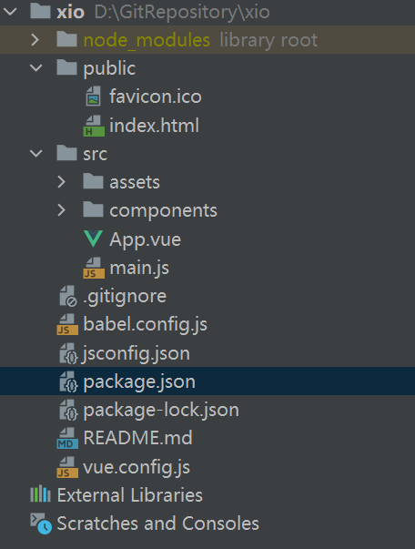
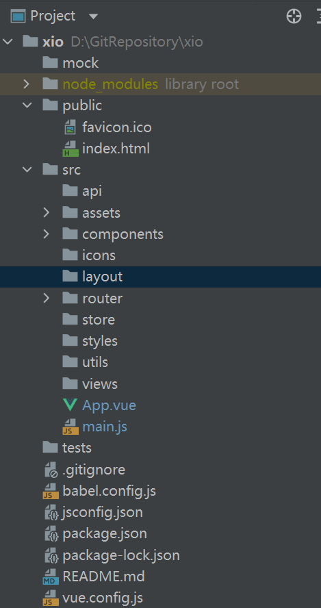
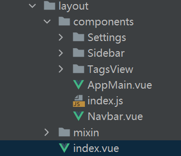
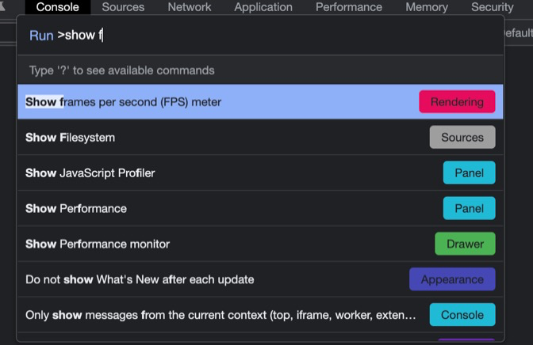
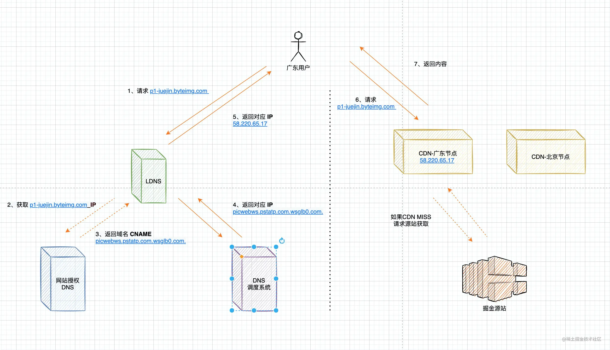
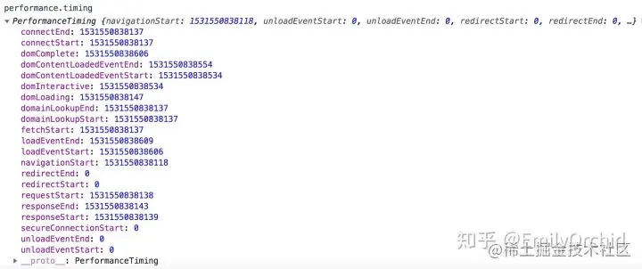

# 技术栈

Vuex+Vue Router+ Vuex+elementUI+ECharts

vue2.6  element-ui2.7 webpack5 vue/cli5

# 准备

### 创建项目

运行以下命令来创建一个新项目：

```
vue create xio
```

刚创建完的文件结构如图



### 修改文件结构



结构为

```sh
├── build                      # 构建相关
├── mock                       # 项目mock 模拟数据
├── public                     # 静态资源
│   │── favicon.ico            # favicon图标
│   └── index.html             # html模板
├── src                        # 源代码
│   ├── api                    # 所有请求
│   ├── assets                 # 主题 字体等静态资源
│   ├── components             # 全局公用组件
│   ├── icons                  # 项目所有 svg icons
│   ├── layout                 # 全局 layout
│   ├── router                 # 路由
│   ├── store                  # 全局 store管理
│   ├── styles                 # 全局样式
│   ├── utils                  # 全局公用方法
│   ├── views                  # views 所有页面
│   ├── App.vue                # 入口页面
│   └── main.js                # 入口文件 加载组件 初始化等
├── tests                      # 测试
├── .env.xxx                   # 环境变量配置
├── .eslintrc.js               # eslint 配置项
├── .babelrc                   # babel-loader 配置
├── .travis.yml                # 自动化CI配置
├── vue.config.js              # vue-cli 配置
├── postcss.config.js          # postcss 配置
└── package.json               # package.json
```

# 页面布局

在layout中



完成侧边栏Sidebar，主体Layout的页面显示

```vue
<template>
  <div :class="classObj" class="app-wrapper">
    <div v-if="device==='mobile'&&sidebar.opened" class="drawer-bg" @click="handleClickOutside" />
    <sidebar class="sidebar-container" />
    <div :class="{hasTagsView:needTagsView}" class="main-container">
      <div :class="{'fixed-header':fixedHeader}">
        <navbar />
        <tags-view v-if="needTagsView" />
      </div>
      <app-main />
      <right-panel v-if="showSettings">
        <settings />
      </right-panel>
    </div>
  </div>
</template>
```

上图为整个页面的html，各个组件都在layout下的components里面定义

其中AppMain中嵌套了一个路由，用于在router中切换显示，下图为AppMain

```vue
<template>
  <section class="app-main">
    <transition name="fade-transform" mode="out-in">
      <keep-alive :include="cachedViews">
        <router-view :key="key" />
      </keep-alive>
    </transition>
  </section>
</template>
```


# 路由设置

路由设置如下：

```js
// No layout
{
  path: '/401',
  component: () => import('errorPage/401')
}

// Has layout
{
  path: '/documentation',

  // 你可以选择不同的layout组件
  component: Layout,

  // 这里开始对应的路由都会显示在app-main中 如上图所示
  children: [{
    path: 'index',
    component: () => import('documentation/index'),
    name: 'documentation'
  }]
}
```

项目中开局为layout，除了401，404页面外，其他页面都为layout，然后使用嵌套路由在`app-main`这个主体区域中显示主体内容

具体的例子

```js
  {
    path: '/guide',
    component: Layout,
    redirect: '/guide/index',
    children: [
      {
        path: 'index',
        component: () => import('@/views/guide/index'),
        name: 'Guide',
        meta: { title: 'Guide', icon: 'guide', noCache: true }
      }
    ]
  },
```

使用redirect重定向

### 怎么让elementUi的侧边栏和路由所对应

官方侧边栏

```html
    <el-menu
      default-active="2"
      class="el-menu-vertical-demo"
      @open="handleOpen"
      @close="handleClose">
      <el-submenu index="1">
        <template slot="title">
          <i class="el-icon-location"></i>
          <span>导航一</span>
        </template>
        <el-menu-item-group>
          <template slot="title">分组一</template>
          <el-menu-item index="1-1">选项1</el-menu-item>
          <el-menu-item index="1-2">选项2</el-menu-item>
        </el-menu-item-group>
        <el-menu-item-group title="分组2">
          <el-menu-item index="1-3">选项3</el-menu-item>
        </el-menu-item-group>
        <el-submenu index="1-4">
          <template slot="title">选项4</template>
          <el-menu-item index="1-4-1">选项1</el-menu-item>
        </el-submenu>
      </el-submenu>
      <el-menu-item index="2">
        <i class="el-icon-menu"></i>
        <span slot="title">导航二</span>
      </el-menu-item>
      <el-menu-item index="3" disabled>
        <i class="el-icon-document"></i>
        <span slot="title">导航三</span>
      </el-menu-item>
      <el-menu-item index="4">
        <i class="el-icon-setting"></i>
        <span slot="title">导航四</span>
      </el-menu-item>
    </el-menu>
```

<el-menu>和</el-menu-item>

这里的实现：

> 本项目侧边栏主要基于 `element-ui` 的 `el-menu` 改造。
>
> 前面也介绍了，侧边栏是通过读取路	由并结合权限判断而动态生成的，而且还需要支持路由无限嵌套，所以这里还使用到了递归组件。

```vue
<template>
  <div :class="{'has-logo':showLogo}">
    <logo v-if="showLogo" :collapse="isCollapse" />
    <el-scrollbar wrap-class="scrollbar-wrapper">
      <el-menu
        :default-active="activeMenu"
        :collapse="isCollapse"
        :background-color="variables.menuBg"
        :text-color="variables.menuText"
        :unique-opened="false"
        :active-text-color="variables.menuActiveText"
        :collapse-transition="false"
        mode="vertical"
      >
        <sidebar-item v-for="route in permission_routes" :key="route.path" :item="route" :base-path="route.path" />
      </el-menu>
    </el-scrollbar>
  </div>
</template>
```

动态绑定item 和 path

# AppMain页面

appmain的显示内容组件在views文件夹下

通过在vue文件中编写template style 和 script 然后导出这个组件名，

但是具体的组件写在components中

# 图表组件

组件都写在components中，然后导出到views中

## chart组件

### 使用echarts

官网柱状图：

```js
import * as echarts from 'echarts';

var chartDom = document.getElementById('main');
var myChart = echarts.init(chartDom);
var option;

option = {
  legend: {},
  tooltip: {},
  dataset: {
    source: [
      ['product', '2012', '2013', '2014', '2015'],
      ['Matcha Latte', 41.1, 30.4, 65.1, 53.3],
      ['Milk Tea', 86.5, 92.1, 85.7, 83.1]
    ]
  },
  xAxis: [
    { type: 'category', gridIndex: 0 },
    { type: 'category', gridIndex: 1 }
  ],
  yAxis: [{ gridIndex: 0 }, { gridIndex: 1 }],
  grid: [{ bottom: '55%' }, { top: '55%' }],
  series: [
    // These series are in the first grid.
    { type: 'bar', seriesLayoutBy: 'row' },
    { type: 'bar', seriesLayoutBy: 'row' }
  ]
};

option && myChart.setOption(option);
```

1、引入ehcarts

```html
<!DOCTYPE html>
<html>
<head>
    <meta charset="utf-8">
    <!-- 引入 ECharts 文件 -->
    <script src="echarts.min.js"></script>
</head>
</html>
```

2、准备一个具备高宽的 DOM 容器

```html
<body>
    <!-- 为 ECharts 准备一个具备大小（宽高）的 DOM -->
    <div id="main" style="width: 600px;height:400px;"></div>
</body>
```

3、设置配置信息

**init**

```js
var chartDom = document.getElementById('main');
var myChart = echarts.init(chartDom);
```

**指定配置项和数据**

```js
// 指定图表的配置项和数据
var option = {
    title: {
        text: '第一个 ECharts 实例'
    },
    tooltip: {},
    legend: {
        data:['销量']
    },
    xAxis: {
        data: ["衬衫","羊毛衫","雪纺衫","裤子","高跟鞋","袜子"]
    },
    yAxis: {},
    series: [{
        name: '销量',
        type: 'bar',
        data: [5, 20, 36, 10, 10, 20]
    }]
};
```

**setOption**

```js
// 使用刚指定的配置项和数据显示图表。
myChart.setOption(option);
```


### 柱状图

需求就是每隔1分钟刷新一次表格，为了降低网络负载，于是用websocket

**未用websocket情况**

使用axios和定时器来解决

initChart来initwebcarts

drawData来使用axios获得后台数据，将option.series[0].data覆盖，最后setOption

```js
    // 初始化图表
    initChart () {
      // 基于准备好的dom，初始化echarts实例
      this.chart = echarts.init(this.$el, 'macarons')
      this.drawData()
    },
    // 获取后台数据
    drawData () {
      getCpuData().then(res => {
        let code = res["code"]
        if (code == 20000) {
          console.log(res)
          this.option.series[0].data = []        
          this.cpuData = res["cpu"]["pct"];
          // 赋值给图表data
          this.option.series[0].data.push({
            name: 'CPU占用率',
            value: Math.round(this.cpuData * 100)
          });
		//绘制图表数据
          this.chart.setOption(this.option, true)
        } else {
          alert("get failed")
        }
        console.log(this.cpuData)
      })
    },
```

生命周期mounted来初始化图表和设置定时器

```js
  mounted () {
    this.$nextTick(() => {
      this.initChart()
             // 设置定时器
      timer = setInterval(() => {
        this.drawData();
      }, 10000);
    })
  },
```

然后watch侦听器来监视option

```js
  watch: {
    // 观察cpu_option的变化
    option: {
      handler(newVal, oldVal) {
		//使用setOption更新数据
      },
      deep: true   //对象内部属性的监听
    },
  },
```

页面销毁时移除定时器，销毁echarts实例

```js
    // 页面销毁时移除定时器，销毁echarts实例
    beforeDestroy() {
      if (!chart) {
        return;
      }
      chart.dispose();
      clearInterval(timer);
    },
```

### **axios的基本使用**

```js
// 1、安装axios
npm install axios --save-dev
// 2、在main.js中引用axios
import axios from 'axios';
Vue.prototype.$axios = axios //全局注册，使用方法为:this.$axios
// 3、就可以在代码中使用axios发送请求了
this.$axios({
        url: '/vue-element-admin/article/list',
        method: 'get',
        params: query
    })
      .then(response => {
        console.log(response, "success");   // 成功的返回      
      })
      .catch(error => console.log(error, "error")); // 失败的返回
```

> 横坐标显示时间段，纵坐标显示人数，series为未戴的戴的
>
> 每隔1分钟向后台请求
>
> https://blog.csdn.net/qq_36256590/article/details/119611451
>
> 用到watch、定时器、清除上一次数据
>
> 可以说的坑：定时器清除
>
> https://evestorm.github.io/posts/55651/
>
> https://cloud.tencent.com/developer/article/1147082
>

优化

### **websocket**

使用websocket让后端给前端每隔1分钟传一次数据

在mounted钩子中先initCharts，进行echarts的init和setoption

然后this.init()，开启websocket

```vue
<template>
  <div class="demo-container">
    <div ref="chart_wrap" class="chart_wrap"></div>
  </div>
</template>
<script>
export default {
  name: "demo",
  computed: {},
  data() {
    return {
      path: "**************",
      ws: {},
      seriesData: [],
      wsData: {},
    };
  },
  created() {},
  mounted() {
    this.initCharts();
    this.init();
  },
  watch: {
    seriesData(data) {
      console.log(data);
      let a = data.map((x) => x.size);
      let b = data.map((x) => x.price);
      this.setOptions(a, b);
    },
  },
  methods: {
    initCharts() {
      this.chart = this.$echarts.init(this.$refs.chart_wrap);
      this.setOptions();
    },
    setOptions(a, b) {
      console.log(a);
      this.chart.setOption({
        title: {
          text: "trade",
        },
        tooltip: {},
        legend: {
          data: ["size","price"],
        },
        xAxis: {
          data: [],
        },
        yAxis: {},
        series: [
          {
            name:"size",
            data: a,
            type: "line",
            smooth: true,
          },
          {
            name:"price",
            data: b,
            type: "line",
            smooth: true,
          },
        ],
      });
    },
    init() {
        // 连接服务器
        var ws = new WebSocket("ws://127.0.0.1:8090")
        // 连接成功
        ws.onopen = function () {
            alert('连接成功')
        }
        ws.onerror = function () { alert("WebSocket连接发生错误") };

        // 接收到消息的回调方法
        ws.onmessage = function (msg) {
            console.log(
                msg.data
            );
            var data = JSON.parse(msg.data)
            option.series[0].data = data.message  //赋值
            myChart.setOption(option);  //设置
        }
    },
  },
};
</script>
<style  scoped>
.chart_wrap {
  height: 400px;
}
</style>
```

> websocket和http
>
> [前端和后台进行WebSocket长连接和axios轮询的方法（vue框架）](https://blog.csdn.net/weixin_43216105/article/details/89555480)
>
> [客户端及服务端的实现](https://blog.csdn.net/qq_33426324/article/details/104491306)
>
> 结合echarts
>
> https://blog.csdn.net/LoveMe_LoveMyDog/article/details/118248534
>
> 也可以在onmessage中setOption
>
> https://www.jianshu.com/p/6c35eb6f978a
>
> https://blog.csdn.net/weixin_43216105/article/details/89555480

#### websocket是否要及时断开和组件是否要设置keep-alive

因为考虑到实际场景，路由页面不会频繁切换，且切换后大屏幕进行展示，所以vue组件不设置keep-alive

且websocket页面切换后断开，不知道对不对，所以不讲

```js
//vue 是单页面的，在路由切换的时候，websocket的close()方法断开不了连接，不管是放在beforeDestroy()还是destroyed()里，打开网络监控的ws里发现它还是存在。然后我发现websocket在刷新页面后，会自己断开连接，所以我的解决方案是在销毁的那个生命周期里调用

destroyed() {
    this.close()
    this.$router.go(0) // 在history记录中前进或者后退val步，当val为0时刷新当前页面。
  },
```

```js
在methods中定义websocket函数
方法一：

 websocket () {
     let ws = new WebSocket('ws://localhost:8080')
     ws.onopen = () => {
        // Web Socket 已连接上，使用 send() 方法发送数据
          ws.send('Holle')
          console.log('数据发送中...')
      }
      ws.onmessage = evt => {
        // console.log('数据已接收...')
      }
      ws.onclose = function () {
        // 关闭 websocket
        console.log('连接已关闭...')
      }
      // 路由跳转时结束websocket链接
      this.$router.afterEach(function () {
        ws.close()
      })
    }

方法二：

methods: {
    websocket () {
         let ws = new WebSocket('ws://localhost:8080')
         ws.onopen = () => {
            // Web Socket 已连接上，使用 send() 方法发送数据
              ws.send('Holle')
              console.log('数据发送中...')
          }
          ws.onmessage = evt => {
            // console.log('数据已接收...')
          }
          ws.onclose = function () {
            // 关闭 websocket
            console.log('连接已关闭...')
          }
           // 组件销毁时调用，中断websocket链接
          this.over = () => {
            ws.close()
          }
    }
},  
beforeDestroy () {
    this.over()
}
```


## list组件


对违规的记录使用el-table进行展示，考虑到items量过大的情况，使用虚拟列表进行优化，加快渲染时间，减少浏览负担。

虚拟列表分两种做法，第一种是懒加载，第二种是可视区域渲染

### 懒加载

对于长列表渲染，传统的方法是使用懒加载的方式，下拉到底部获取新的内容加载进来，其实就相当于是在垂直方向上的分页叠加功能，**`但随着加载数据越来越多，浏览器的回流和重绘的开销将会越来越大`**，整个滑动也会造成卡顿，这个时候我们就可以考虑使用虚拟列表来解决问题

**实现思路**

监听父元素的 scroll 事件（一般是 window），通过父元素的 scrollTop 判断是否到了页面是否到了页面底部，如果到了页面底部，就加载更多的数据。

使用 Vue 实现了一个简单的例子，这个例子中的可滚动区域是在 window 上的，其中的核心代码只有三行：

```js
const maxScrollTop = Math.max(document.body.scrollHeight, document.documentElement.scrollHeight) - window.innerHeight;
const currentScrollTop = Math.max(document.documentElement.scrollTop, document.body.scrollTop);

if (maxScrollTop - currentScrollTop < 20) {
  //...
}
```

**实现**

element table + vue基于插件实现：

因为element有针对列表的无限滚动组件，但是没有针对table的，所以需要自己实现

[基于el-table-infinite-scroll插件实现](https://blog.csdn.net/weixin_44019370/article/details/124600797)

https://github.com/yujinpan/el-table-infinite-scroll

懒加载相关

https://juejin.cn/post/7074865088309493791

https://zhuanlan.zhihu.com/p/26022258

### 可视区域渲染

其核心思想就是在处理用户滚动时，只改变列表在可视区域的渲染部分，

**虚拟列表相关**

[虚拟列表，我真的会了！！！](https://juejin.cn/post/7085941958228574215)

[「前端进阶」高性能渲染十万条数据(虚拟列表)](https://juejin.cn/post/6844903982742110216)

**table的实现**

和列表实现相差不大，注意的是和自己项目的案例中，这里数据应该是一次性请求完成，然后根据滚动事件改变data，以下是实现案例

[前端分享--虚拟列表在el-table中的实现](https://juejin.cn/post/7046666637050642446)

http://www.codebaoku.com/it-vue/it-vue-221377.html

https://cloud.tencent.com/developer/article/1836477


**使用的是element的el-table**

```vue
<template>
  <div class="app-container">
    <el-table v-loading="listLoading" :data="list" infinite-scroll-disabled="scrollDisabled" v-el-table-infinite-scroll="toLoadMore" infinite-scroll-immediate="false" border fit highlight-current-row style="width: 100%" >
      <el-table-column align="center" label="ID" width="80">
        <template slot-scope="scope">
          <span>{{ scope.row.id }}</span>
        </template>
      </el-table-column>

      <el-table-column width="180px" align="center" label="Date">
        <template slot-scope="scope">
          <span>{{ scope.row.timestamp | parseTime('{y}-{m}-{d} {h}:{i}') }}</span>
        </template>
      </el-table-column>

      <el-table-column width="120px" align="center" label="Author">
        <template slot-scope="scope">
          <span>{{ scope.row.author }}</span>
        </template>
      </el-table-column>

      <el-table-column width="100px" label="Importance">
        <template slot-scope="scope">
          <svg-icon v-for="n in +scope.row.importance" :key="n" icon-class="star" class="meta-item__icon" />
        </template>
      </el-table-column>

      <el-table-column class-name="status-col" label="Status" width="110">
        <template slot-scope="{row}">
          <el-tag :type="row.status | statusFilter">
            {{ row.status }}
          </el-tag>
        </template>
      </el-table-column>

      <el-table-column min-width="300px" label="Title">
        <template slot-scope="{row}">
          <router-link :to="'/example/edit/'+row.id" class="link-type">
            <span>{{ row.title }}</span>
          </router-link>
        </template>
      </el-table-column>

      <el-table-column align="center" label="Actions" width="120">
        <template slot-scope="scope">
          <router-link :to="'/example/edit/'+scope.row.id">
            <el-button type="primary" size="small" icon="el-icon-edit">
              Edit
            </el-button>
          </router-link>
        </template>
      </el-table-column>
    </el-table>

<!--    <pagination v-show="total>0" :total="total" :page.sync="listQuery.page" :limit.sync="listQuery.limit" @pagination="getList" />-->
  </div>
</template>

<script>
import { fetchList } from '@/api/article'
// import Pagination from '@/components/Pagination' // Secondary package based on el-pagination
import elTableInfiniteScroll from 'el-table-infinite-scroll'

export default {
  name: 'ArticleList',
  directives: {
    'el-table-infinite-scroll': elTableInfiniteScroll
  },
  // components: { Pagination },
  filters: {
    statusFilter(status) {
      const statusMap = {
        published: 'success',
        draft: 'info',
        deleted: 'danger'
      }
      return statusMap[status]
    }
  },
  data() {
    return {
      listLoading: false,
      scrollDisabled: false,
      list: [],
      listQuery: {
        page: 1,
        limit: 20
      }
    }
  },
  created() {
    // this.getList()
    this.toGetList()
  },
  methods: {
    toGetList() {
      this.listQuery.page = 1 // 初始化 搜索条件 页码
      this.scrollDisabled = true
      // this.list = [] // 搜索前清空滚动加载获取的数据，避免内容重复
      this.loadList(this.listQuery)
    },

    toLoadMore() {
      // 监听表格滚动事件
      this.listQuery.page++
      this.loadList(this.listQuery)
    },
    loadList(param) {
      this.listLoading = true
      fetchList(param).then(response => {
        this.listLoading = false
        // 没数据的时候，禁用 infinite-scroll-disabled 滚动事件
        if (response.data.length === 0) return (this.scrollDisabled = true)
        this.scrollDisabled = false
        this.list.push(...response.data.items)
      })

    }
  }
}
</script>

<style scoped>
.edit-input {
  padding-right: 100px;
}
.cancel-btn {
  position: absolute;
  right: 15px;
  top: 10px;
}
</style>

```

**使用了虚拟列表的技术**

elementUi对原生列表实现了**无限滚动**，用的是**懒加载的方式**

现在我们的需求是给elementUi中的table加上无限滚动，网上有**'el-table-infinite-scroll'**，

但是也是基于懒加载的方式实现的，缺点是**节点数变多页面负担增加**

### 'el-table-infinite-scroll'实现原理

v-el-table-infinite-scroll封装了滚动事件，当滚动到底部时，触发"toLoadMore" 事件，

```js
    toLoadMore() {
      // 监听表格滚动事件
      this.listQuery.page++
      this.loadList(this.listQuery)
    },
```

```js
    loadList(param) {
      this.listLoading = true
      fetchList(param).then(response => {
        this.listLoading = false
        // 没数据的时候，禁用 infinite-scroll-disabled 滚动事件
        if (response.data.length === 0) return (this.scrollDisabled = true)
        this.scrollDisabled = false
        this.list.push(...response.data.items)
      })

    }
```

### 使用可视区域渲染来对el-table进行优化

**思路**

虚拟列表的实现，实际上就是在首屏加载的时候，**只加载`可视区域`内需要的列表项**，当滚动发生时，动态通过计算获得`可视区域`内的列表项，并将`非可视区域`内存在的列表项删除。


**设置父子容器，item在子容器中渲染，给子容器设置所有列表项的高度，形成滚动条；**

**设置滚动事件，根据scrollTop得到到容器顶部的距离，可计算出开始索引、结束索引和偏移量；**

**在计算属性中的visibleData发生变化，因为visibleData为this.listData.slice(this.start, Math.min(this.end,this.listData.length))那么可是区域就跟着变化；**

**因为设置了偏移量，通过样式控制将`渲染区域`偏移至`可视区域`中。**


**需要的数据**

**可视区域高度screenHeight** 为父容器的高度，固定

**列表项高度itemSize** 固定

**列表数据data** 一次性从后端请求

**当前滚动位置scrollTop **为滚动条到顶部的距离

可算出

**列表总高度`listHeight`** = listData.length * itemSize

**可显示的列表项数`visibleCount`** = Math.ceil(screenHeight / itemSize)

**数据的起始索引`startIndex`** = Math.floor(scrollTop / itemSize)

**数据的结束索引`endIndex`** = startIndex + visibleCount

**列表显示数据为`visibleData`** = listData.slice(startIndex,endIndex)

**偏移量startOffset** = scrollTop - (scrollTop % itemSize);

startOffset这样设置是因为

> 这个scrollTop - (scrollTop % this.itemSize)就是没达到一个itemSize的时候就是多余的减掉多余的变成0这个内容会被浏览器带着走 就会看到动画 如果你有设置等于scrollTop的话 你浏览器滚动了 那你偏移量和scrollTop一样的话 相当于没有动画 和浏览器同步走了 然后到了换数据item1变成item2的时候就会突然给你换掉 就没有动画了 这样写就让浏览器带着走有动画


**具体实现**

在data中定义可视区域高度screenHeight，偏移量startOffset，数据的起始索引`startIndex`，数据的结束索引`endIndex`，*每项高度*

```js
  data() {
    return {
      //可视区域高度
      screenHeight:0,
      //偏移量
      startOffset:0,
      //起始索引
      start:0,
      //结束索引
      end:null,
      itemSize： 200
    };
  },
```

在created钩子中 toGetList()将所有数据通过axios请求到listData，然后将数据截取为visibleData；

在computed中得到列表总高度`listHeight`，可显示的列表项数`visibleCount` ，*偏移量对应的style*，*真实显示列表数据*

```js
  computed:{
    //列表总高度
    listHeight(){
      return this.listData.length * this.itemSize;
    },
    //可显示的列表项数
    visibleCount(){
      return Math.ceil(this.screenHeight / this.itemSize)
    },
    //偏移量对应的style
    getTransform(){
      return `translate3d(0,${this.startOffset}px,0)`;
    },
    //获取真实显示列表数据
    visibleData(){
      return this.listData.slice(this.start, Math.min(this.end,this.listData.length));
    }
  },
```

在mounted钩子中计算可视区域高度screenHeight，起始索引，结束索引

```js
  mounted() {
    this.screenHeight = this.$el.clientHeight;
    this.start = 0;
    this.end = this.start + this.visibleCount;
  },
```

然后在methods定义滚动函数

```js
  methods: {
    scrollEvent() {
      //当前滚动位置
      let scrollTop = this.$refs.list.scrollTop;
      //此时的开始索引
      this.start = Math.floor(scrollTop / this.itemSize);
      //此时的结束索引
      this.end = this.start + this.visibleCount;
      //此时的偏移量
      this.startOffset = scrollTop - (scrollTop % this.itemSize);
    }
  }
```

template中父元素高度已设置，子元素的高度为列表总高度`listHeight`，撑开了盒子，然后用transform将渲染区域偏移至可视区域

1. 是created先执行。因为created是初始化data中的值。因此最先执行；
2. 然后是 执行computed中的，因为此时html正在被渲染，computed发生在 created 和 mounted 之间；
3. 最后是mounted()因为这个函数此时已经将页面渲染完成了。

### **基础上优化**

**下拉置地自动请求和加载数据**

在真实的开发场景中，我们不会一次性请求1w、10w条数据过来，这样请求时间那么长，用户早就把页面关掉了，还优化个屁啊哈哈！

所以真实开发中，我们还是要结合原来的懒加载方式，等到下拉触底的时候去加载新的数据进来，放置到缓存数据当中，然后我们再根据滚动事件决定具体渲染哪一部分的数据到页面上去。

```js
// 组件刚挂载以及下拉触底的时候请求更多数据
useEffect(() => {
  (async () => {
    try {
      // 表明当前正处于请求过程中
      isRequestRef.current = true
      const { offset } = options
      let limit = 20
      if (offset === 1) limit = 40
      const { data: { comments, more } } = await axios({
        url: `http://localhost:3000/comment/music?id=${186015 - offset}&limit=${limit}&offset=1`
      })
      isNeedLoad.current = more
      // 将新请求到的数据添加到存储列表数据的变量当中
      dataListRef.current = [...dataListRef.current, ...comments]
      // 必选要在boxScroll之前将isRequestRef设为false，因为boxScroll函数内部会用到这个变量
      isRequestRef.current = false
      // 请求完最新数据的时候需要重新触发一下boxScroll函数，因为容器内的数据、空白填充区域可能需要变化
      boxScroll()
    } catch (err) {
      isRequestRef.current = false
      console.log(err);
    }
  })()
  // 在boxScroll函数里面，一旦发生了触底操作就会去改变optiosn的值
}, [options])
```

**增大结束索引,增大缓冲区**

可以将结束索引设置的大一点，比如为

```
this.end = this.start + this.visibleCount * 2;
```

增大缓冲区


**滚动事件请求动画帧进行节流优化**

虚拟列表很依赖于滚动事件，考虑到用户可能会滑动很快，我们在用节流优化的时候事件必须要设置的够短，否则还是会出现白屏现象。

这里我没有用传统的节流函数，而是用到了请求动画帧帮助我们进行节流，这里我就不做具体介绍了，想了解的可以看我另一篇文章[juejin.cn/post/708236…](https://juejin.cn/post/7082366494348148744)[juejin.cn/post/684490…](https://juejin.cn/post/6844903982742110216#heading-3)

```js
// 利用请求动画帧做了一个节流优化
let then = useRef(0)
const boxScroll = () => {
  const now = Date.now()
  /**
   * 这里的等待时间不宜设置过长，不然会出现滑动到空白占位区域的情况
   * 因为间隔时间过长的话，太久没有触发滚动更新事件，下滑就会到padding-bottom的空白区域
   * 电脑屏幕的刷新频率一般是60HZ，渲染的间隔时间为16.6ms，我们的时间间隔最好小于两次渲染间隔16.6*2=33.2ms，一般情况下30ms左右，
   */
  if (now - then.current > 30) {
    then.current = now
    // 重复调用scrollHandle函数，让浏览器在下一次重绘之前执行函数，可以确保不会出现丢帧现象
    window.requestAnimationFrame(scrollHandle)
  }
}
```

**另一种方法：scroll节流**

```
export default function(fn, delay) {
    let lock = false;
    return (...args) => {
        if (lock)
            return;
        //进入加锁
        lock = true;
        setTimeout(() => {
            fn.apply(this, args);
            //执行完毕解锁
            lock = false;
        }, delay);
    }
}


```


### 不定高虚拟列表实现

如果列表项是不定高的，那么结束索引和偏移量都不能用之前的计算方法。

可以**设置预估高度**

预估高度应该设置为列**表项产生的最小值**，这样尽管可能会多渲染出几条数据，但能保证首次呈现给用户的画面中没有空白。

**实现**

1、定义一个预估高度estimatedItemSize

2、定义一个positions数组，里面为对象，来存储每个列表项的index，top，bottom，height信息

```js
this.positions = [
  // {
  //   top:0,
  //   bottom:100,
  //   height:100
  // }
];
```

3、初始化时，用listData来初始化positions数组

```js
initPositions(){
  this.positions = this.listData.map((item,index)=>{
    return {
      index,
      height:this.estimatedItemSize,
      top:index * this.estimatedItemSize,
      bottom:(index + 1) * this.estimatedItemSize
    }
  })
}
```

4、计算出列表总高度为positions最后一项底部距离顶部的位置

```js
//列表总高度
listHeight(){
  return this.positions[this.positions.length - 1].bottom;
}
```

5、每次列表更新之后将列表项真实高度更新缓存中的预估高度

当下次我们再用到缓存中的这些数据时，使用的就是真实高度了

```js
updated(){
  let nodes = this.$refs.items;
  nodes.forEach((node)=>{
    let rect = node.getBoundingClientRect();
    let height = rect.height;
    let index = +node.id.slice(1)
    let oldHeight = this.positions[index].height;
    let dValue = oldHeight - height;
    //存在差值
    if(dValue){
      this.positions[index].bottom = this.positions[index].bottom - dValue;
      this.positions[index].height = height;
      for(let k = index + 1;k<this.positions.length; k++){
        this.positions[k].top = this.positions[k-1].bottom;
        this.positions[k].bottom = this.positions[k].bottom - dValue;
      }
    }
  })
}
```

6、滚动后获取列表`开始索引`的方法修改为通过`缓存`获取：

列表项的`bottom`属性代表的就是该元素尾部到容器顶部的距离，不难发现，可视区的第一个元素的`bottom`是第一个大于滚动高度的；可视区最后一个元素的`bottom`是第一个大于（滚动高度+可视高度）的。我们可以利用这条规则遍历缓存数组找到对应的`startIndex`和`endIndex`

由于我们的缓存数据，本身就是有顺序的，所以获取开始索引的方法可以考虑通过**二分查找**的方式来降低检索次数，减少时间复杂度

```js
//获取列表起始索引
getStartIndex(scrollTop = 0){
  //二分法查找
  return this.binarySearch(this.positions,scrollTop)
},
//二分法查找
binarySearch(list,value){
  let start = 0;
  let end = list.length - 1;
  let tempIndex = null;
  while(start <= end){
    let midIndex = parseInt((start + end)/2);
    let midValue = list[midIndex].bottom;
    if(midValue === value){
      return midIndex + 1;
    }else if(midValue < value){
      start = midIndex + 1;
    }else if(midValue > value){
      if(tempIndex === null || tempIndex > midIndex){
        tempIndex = midIndex;
      }
      end = end - 1;
    }
  }
  return tempIndex;
},
```

偏移量也可以获得

```js
scrollEvent() {
  //...省略
  if(this.start >= 1){
    this.startOffset = this.positions[this.start - 1].bottom
  }else{
    this.startOffset = 0;
  }
}
```

7、开始索引、结束索引、偏移量都能获得，那么就能够显示了。

#### 问题

但如果列表项中包含**图片**，并且列表高度由图片撑开。在这种场景下，由于图片会发送网络请求，列表项可能已经渲染到页面中了，但是图片还没有加载出来，此时无法保证我们在获取列表项真实高度时图片是否已经加载完成，获取到的高度有无包含图片高度，从而造成计算不准确的情况。

解决：

如果你真的遇到了这种列表项会由图片任意撑开的场景，可以给图片绑定`onload`事件，等到它加载完之后再重新计算一下列表的高度，然后把它更新到缓存数据中，这是一种方法。其次，还可以使用[ResizeObserver](https://link.juejin.cn/?target=https%3A%2F%2Fdeveloper.mozilla.org%2Fzh-CN%2Fdocs%2FWeb%2FAPI%2FResizeObserver)来监听列表项内容区域的高度改变，从而实时获取每一列表项的高度，只不过MDN有说道这只是在实验中的一个功能，所以暂时可能没有办法兼容所有的浏览器！


### 最终问题

> 这种方式实现的问题比较多，主要就是在滚动时的卡顿。在单元格内容使用函数或者更复杂的渲染方式的时候，滚动流畅度还不如非虚拟化。本质原因是浏览器的滚动条在滚动的时候和js执行是互斥的，必须要模拟一个滚动条，然后再用js去调用滚动，这样就能保证在实际渲染前js已经执行好了，实际上只有渲染的事情了。

> 白屏的根本原因是浏览器触发混动事件的频率太快，你可能会说节流，没用的，你节的只是js执行频率，你阻止不了浏览器根据你的手势移动viewport，所以这是你白屏的原因，解决的根本办法就是自己模拟滚动，这样就可以限制滚动事件派发的速度

原理

> 大概是用transform先将容器的滚动条挤出可视区域，然后用自己实现的滚动条去渲染到原先的位置，同时监听鼠标滚轮事件(mousewheel)，根据滚轮的状态（1，-1）来计算滚动的位置，然后直接调用js的scrollTo去滚动到对应的位置。
> 这种方式配合实现方式为定位的虚拟列表效果比较好，可以将具体展示的表格内容定位到容器区域，根据scroll的位置计算应该显示的数据，然后重新计算定位位置即可，可以很大程度的去复用元素。
>
> 具体的可以参考这里[segmentfault.com](https://link.juejin.cn/?target=https%3A%2F%2Fsegmentfault.com%2Fa%2F1190000039808261)，然后自己去实现一下，并不是很难。表格还有很多其他功能，如何把它们整合到一起，怎么去设计好才是难点。


# 视频展示

https://juejin.cn/post/7091212799426166797

https://juejin.cn/post/7091588511526027271

https://blog.csdn.net/weixin_43643250/article/details/120215395


# 前端性能优化

## 讲解思路

从编码、体积、网络和体验来说

## Lighthouse

谷歌官方提供的性能检测工具Lighthouse，它可以搜集多个现代网页性能指标，分析 Web 应用的性能并生成报告，为开发人员进行性能优化的提供了参考方向。

### 性能指标

[首次内容绘制](https://link.juejin.cn?target=https%3A%2F%2Fweb.dev%2Fi18n%2Fzh%2Ffcp%2F)（**First Contentful Paint**）。即浏览器首次将任意内容（如文字、图像、canvas 等）绘制到屏幕上的时间点。

[可交互时间](https://link.juejin.cn?target=https%3A%2F%2Fweb.dev%2Fi18n%2Fzh%2Ftti%2F)（Time to Interactive）。指的是所有的页面内容都已经成功加载，且能够快速地对用户的操作做出反应的时间点。

[速度指标](https://link.juejin.cn?target=https%3A%2F%2Fweb.dev%2Fspeed-index%2F)（**Speed Index**）。衡量了首屏可见内容绘制在屏幕上的速度。在首次加载页面的过程中尽量展现更多的内容，往往能给用户带来更好的体验，所以速度指标的值约小越好。

[总阻塞时间](https://link.juejin.cn?target=https%3A%2F%2Fweb.dev%2Fi18n%2Fzh%2Ftbt%2F)（Total Blocking Time）。指First Contentful Paint 首次内容绘制 (FCP)与Time to Interactive 可交互时间 (TTI)之间的总时间

[最大内容绘制](https://link.juejin.cn?target=https%3A%2F%2Fweb.dev%2Fi18n%2Fzh%2Flcp%2F)（**Largest Contentful Paint**）。度量标准报告视口内可见的最大图像或文本块的呈现时间

[累积布局偏移](https://link.juejin.cn?target=https%3A%2F%2Fweb.dev%2Fi18n%2Fzh%2Fcls%2F)（# Cumulative Layout Shift）。衡量的是页面整个生命周期中每次元素发生的非预期布局偏移得分的总和。每次可视元素在两次渲染帧中的起始位置不同时，就说是发生了LS（Layout Shift）。

### 三个方面

这六个指标中，`LCP、 FCP、speed index`、 这三个指数尤为重要，因为在一般情况下 这个三个指标会影响 `TTI、TBT、CLS` 的分数，所以思路是优化`LCP、 FCP、speed index`

#### 优化FCP

在优化页面的内容之前我们声明三个前提

1. 提高FCP的时间其实就是在优化[关键渲染路径](https://link.juejin.cn?target=https%3A%2F%2Fdeveloper.mozilla.org%2Fzh-CN%2Fdocs%2FWeb%2FPerformance%2FCritical_rendering_path)
2. 如果它是一个样式文件（CSS文件），浏览器就必须在渲染页面之前完全解析它（这就是为什么说CSS具有渲染阻碍性）
3. 如果它是一个脚本文件（JavaScript文件），浏览器必须： 停止解析，下载脚本，并运行它。只有在这之后，它才能继续解析，因为 JavaScript 脚本可以改变页面内容（特别是HTML）。（这就是为什么说JavaScript阻塞解析）

针对以上的用例测试，我们发现，无论我们怎么优化，框架本身的性能损耗是无法抹除的，我们唯一能做的就是让框架更早的去执行初始化，并且初始化更少的内容，可做的优化手段如下：

1. 所有初始化用不到的js 文件全部走异步加载，也就是加上`defer`或者`asnyc` ，并且一些需要走cdn的第三方插件需要放在页面底部（因为放在顶部，他的解析会阻止html 的解析，从而影响css 等文件的下载，这也是`雅虎军规`的一条）
2. js 文件拆包，以vue-cli 为例，一般情况下我们可以通过cli的配置 splitChunks 做代码分割，将一些第三方的包走cdn，或者拆包。如果有路由的情况下将路由做拆包处理，保证每个路由只`加载当前路由对应的js代码`
3. 优化文件大小 减少字体包、css文件、以及js文件的大小（当然这些 脚手架默认都已经做了）
4. 优化项目结构，每个组件的初始化都是有`性能损耗`的，在在保证`可维护性`的基础上，尽量减少初始化组件的加载数量 
5. 网络协议层面的优化，这个优化手段需要服务端配合纯前端已经无法达到，在现在`云服务器`盛行的时代,自家单位一般都会默认在云服务器中开启这些优化手段，比如开启`gzip`，使用`cdn` 等等

其实说来说去，提高FCP 的核心只有理念之后两个 `减少初始化视图内容`和 `减少初始化下载资源大小`

#### 优化LCP

顾名思义就是`最大内容绘制`，通常情况下，`图片、视频以及大量文本绘制完成后`就会报告LCP

理解了这一点，的优化手段就明确了,尽量减少这些资源的大小就可以了，经过测试，减少首屏渲染的图片以及视频内容大小后，整体分数显著提高，提供一些优化方法：

1. 本地图片可以使用在线压缩工具自己压缩 推荐[tinypng.com](https://link.juejin.cn?target=https%3A%2F%2Ftinypng.com%2F)
2. 接口中附带图片，一般情况下单位中都有对应的oss或者cdn传参配置通过地址栏传参方式控制图片质量
3. 图片懒加载

#### 优化SpeedIndex（速度指数）

`Speed Index`采用可视页面加载的视觉进度，计算内容绘制速度的总分

以上是官方解释的计算方式，其实通俗的将，所谓速度指数就是衡量页面内容填充的速度


```
一图胜千言
```

经过测试，跟LCP相同，图片以及视频内容对于SpeedIndex的影响巨大，所有优化方向，通之前一致，总的来说，**只要提高LCP 以及FCP 的时间SpeedIndex 的时间就会有显著提高**

不过需要注意的是，接口的速度也会影响SpeedIndex的时间，由于AJAX流行的今天，我们大多数的数据都是使用接口拉取。如果接口速度过慢，他就会影响你页面的初始渲染， 导致性能问题，所以，在做性能优化的同时，`请求后端伙伴协助，也是性能优化的一个方案`


## 优化的指标

1、Performance API

2、页面流畅度

- FPS
- raf（requestAnimationFrame）

3、首屏性能

- FP、FCP、FMP
- CWV（Core Web Vitals）

## Performance API

通常我们将浏览器提供的可以进行测算和采集的 API 统称为 Performance API，该类型的对象可以通过调用只读属性 window.performance 来获得。

### 页面流畅度

#### FPS

帧率 FPS（Frames Per Second - 每秒传输帧数），一般对于网页而言，最优的帧率在 60 FPS，如果越接近这个值，页面就越流畅，帧率如果远低于这个值，用户可能会明显感觉到卡顿。

60 FPS 意味着页面每隔 16.5ms（1/60）就需要渲染一次，否则就会出现丢帧的现象，而浏览器中的 JavaScript 执行和页面渲染都是会相互阻塞的，如果在代码中有非常复杂的逻辑占用了大量的执行时长，就会导致页面出现卡顿。

在 Chrome 的 devtools 中我们可以执行 Cmd+Shift+P 输入 show fps 来快速打开 fps 面板，如下图所示：



通过观察 FPS 面板，我们可以很方便的对当前页面的流畅度进行监控

```js
var lastTime = performance.now();
var frame = 0;
var lastFameTime = performance.now();
var loop = function(time) {
  var now = performance.now();
  var fs = (now - lastFameTime);
  lastFameTime = now;
  var fps = Math.round(1000/fs);
  frame++;
  if(now > 1000 + lastTime) {
    var fps = Math.round((frame * 1000) / (now - lastTime));
    frame = 0;
    lastTime = now;
  };
  window.requestAnimationFrame(loop);
}
```

#### **requestAnimationFrame**

window.requestAnimationFrame() 告诉浏览器你希望执行一个动画，并且要求浏览器在下次重绘之前调用指定的回调函数更新动画。

这里借用 MDN 的描述，顾名思义就是传入一个函数，让浏览器在下一次渲染之前进行调用。那么基于这个特性，结合上面提供的 FPS 计算示例代码，我们可以发现，如果我们持续对 requestAnimationFrame 进行调用，那么每次调用的间隔应该在 16.7ms 左右，即满足我们对于页面流畅度 60 FPS 的要求，可以使用如下代码在控制台执行试试看：

```js
let lastTime = 0;
const measure = () => {
  console.log(`${Date.now() - lastTime}ms`);
  lastTime = Date.now();
  requestAnimationFrame(measure);
};
measure();
```

## 首屏性能

### **FP、FCP、FMP**

FP（**First Paint** 译为“首次绘制”）代表浏览器第一次向屏幕传输像素的时间，仅表示当前已经开始绘制了，实际意义比较小。也就是**白屏**的概念

FCP（**First Contentful Paint** 译为“首次内容绘制”）代表浏览器第一次向屏幕绘制 “**内容**”（只有首次绘制文本、图片（包含背景图）、非白色）。也就是**首屏**的概念。

相比之下，FCP 指的是浏览器**首次绘制来自 DOM 的内容**。例如：文本，图片，SVG，canvas元素等，这个时间点叫 FCP。

FMP（**First Meaningful Paint** 译为“首次有效绘制”）表示页面中**有意义的内容**开始出现在屏幕上的时间点。它也是我们来衡量用户加载体验的主要指标。

FMP 本质上是一个主观认知指标，是通过一个算法来猜测某个时间点可能是 FMP，但是计算方式过于复杂而且不准确，后来 Google 也放弃了 FMP 的探测算法，转而采用更加明确的客观指标 - LCP。


### **CWV（Core Web Vitals）**

目前的 **Web 核心指标**由三个方面构成 — 页面加载性能、交互性、视觉稳定性，包含如下三个指标及阈值：

- Largest Contentful Paint (LCP)：**最大内容绘制**，测量加载性能。为了提供良好的用户体验，LCP 应在页面首次开始加载后的2.5 秒内发生。

- First Input Delay (FID)：首次输入延迟，测量交互性。为了提供良好的用户体验，页面的 FID 应为100 毫秒或更短。

- Cumulative Layout Shift (CLS)：累积布局偏移，测量视觉稳定性。为了提供良好的用户体验，页面的 CLS 应保持在 0.1. 或更少。

#### 1）LCP

LCP 关注的是**首屏中最大元素渲染渲染的时间**，和 FCP 不同的是，FCP 更关注浏览器什么时候开始绘制内容，比如一个 loading 页面或者骨架屏，并没有实际价值，所以 LCP 相较于 FCP 更适合作为首屏指标。


拿 Detail 页举例，在 FCP 时，商品图片并未加载，此时对于用户而言，一个近乎白屏的页面是不具备可交互价值的，在 LCP 时，图片已经完成了加载，首屏主要元素也几乎加载完毕，此时的时间作为首屏时间，才是比较接近用户体感的。

既然 LCP 是根据页面上**占据面积最大的元素渲染时间确定**的，那么元素包含哪些呢？

- 图片
- 内嵌在 svg 中的 image 元素
- 视频的封面
- 通过 url() 加载的 background image
- 文字

在 webpagetest 上可以很直观的看到当前 LCP 元素的详情信息




元素面积的计算规则有如下几点：

- 在 viewport 内可见元素的大小，如果是超出可视区域或者被裁减、遮挡等，都不算入该元素大小

- 对于图片元素来说，大小是取图片实际大小和原始大小的较小值，即Min(实际大小，原始大小)

- 对于文字元素，只取能够覆盖文字的最小矩形面积

- 对所有元素，margin、padding、border 等都不算

#### 2）FID

FID 指标是指用户**首次和网站进行交互到浏览器响应该事件的实际延时时间**，可以想象一下，如果在你点击了一个 button 后，页面没有任何变化，2-3s 后才开始响应，可想而知体验是非常糟糕的。

FID 判定的交互行为有：

- 点击、触摸、按键等（不包含滚动和缩放）
- 有事件绑定的行为，比如注册在某个 dom 上的 click 事件

那么为什么会产生交互延迟呢？比如我在 button 上注册了一个 click 事件，例如：

```
btn.addEventListener('click', () => {  // do something})
```

按照预期，用户点击按钮的时候，回调函数会被直接触发，但是如果当前主线程被渲染、Long Tasks 占用，这个回调的执行就会被延后，就会导致 FID 时长增加。

但是 FID 作为一个“非客观值”，需要用户进行交互才能采集到，用户的交互时机，同样也会对指标的采集、统计造成影响。

#### 3）CLS

CLS 是用来衡量视觉界面稳定性的一个指标，指的是**页面产生的连续累计布局偏移分数**。我们在日常业务中经常会用到懒加载、骨架屏等方式，用较低的成本先展示页面框架，再用动态渲染的方式，来对页面内容进行填充，如果此时布局发生变化，比如动态加载的元素和原本占位的元素大小不一致，可能就会导致用户误操作，影响用户体验，CLS 就是为了度量这类问题而存在。

当我们在说布局偏移的时候，指的是：页面中一个可见元素的起始位置发生改变，而元素的增删则并不会触发布局偏移。

那么如何定义偏移的连续累计呢？有如下几个要素：

- CLS 计算的并非页面整个周期的偏移分数之和，而是累计值最高的连续布局偏移

- 偏移相隔的时间少于 1s，且整个窗口的最大持续时间为 5s，则被计为连续偏移


## 网络传输优化

#### **三个时间指标**

- Total Connection Time：整体的连接耗时
- TTFB（Time to First Byte）：首字节传输耗时
- Content Download：内容传输耗时


#### **Total Connection Time**

导致连接耗时长的因素可能会有很多种：

- 机器距离用户端的物理距离过长（美国 - 中国）
- 重复建联，在页面中**使用了多个不同域名**，每次都需要重新建立连接
- 用户端网络环境问题

那么为了解决这些问题我们可以采取哪些手段呢：

- 利用 **CDN** 对主域名进行动态加速，对资源域名进行缓存，利用**边缘节点的特性**缩短用户请求距离

- 利用 **pre-connect** 对域名进行**预建联**，同时对域名进行收拢，这样在 http2 的情况下可以减少建联耗时

- 充分利用 http 缓存和 servicesworker 请求拦截的特性，对可缓存的资源进行**本地缓存**，减少发起网络请求次数

#### **TTFB + Content Download**

TTFB 是从发起请求到收到服务器请求第一个字节的时间，一般来说，如果首屏 html 请求的 TTFB 能达到 100ms 以内，就已经具备不错的体验了，如果超过了 500ms，那么用户就能明显的感受到白屏，精准的来说，TTFB 是在完成 DNS 查询、TCP 握手、SSL 握手后发起 HTTP 请求报文到接收到服务端第一个响应报文的时间差，大约等于 一个RTT（Round-Trip Time 即往返时延）+ ServerRT。

那么当 TTFB 耗时很长时，如何进行优化呢？可以参考如下几种方式：

- 减少请求传输量，避免无用信息

- 减少服务端处理时间（增加缓存、慢 SQL 治理等等）

- 对首屏 HTML 内容做流式渲染，由于浏览器对 HTML 的解析并不依赖与下载完整的 HTML，而是解析一部分渲染一部分，所以服务端可以先将部分准备好的内容通过流式渲染的方式返回，而不是等全部内容就绪后再返回

- 懒加载：优先返回必要内容，例如超长页面，可以先返回首屏看到的内容，剩下的通过异步加载的方式进行渲染，分多个接口进行请求

那么，是 TTFB 越短越好吗？

其实也不尽然，我们需要做好 TTFB 和 Content Download 的权衡，例如当我们开启 gzip/br 压缩的时候，TTFB 必然会呈上涨趋势，但是相对应的资源体积变小，就会加快传输耗时，减少 Content Download 时间，所以我们应该关注的用户真实的体验，而不是一味地盯着时间进行优化。

#### preload

preload 也就是预加载，关于预加载的方式有很多种，端内和端外也各自有不同的方案，比较常见的有：

- preload 标签：<link rel="preload" as="image" href="xxx" />
- serviceworker 预加载：flasher、workbox-preload 等
- zcache：在客户端端内通过资源离线包的方式进行预加载


### 内容分发网络CDN

CDN 的`工作原理` 就是将源站的资源缓存CDN各个节点上，当请求命中了某个节点的资源缓存时，立即返回客户端，避免每个请求的资源都通过源站获取，避免网络拥塞、缓解源站压力，保证用户**访问资源的速度和体验**。

#### CDN访问过程



1、用户访问图片内容，先经过 `本地DNS` 解析，如果 LDNS 命中，直接返回给用户。

2、`LDNS` MISS，转发 `授权DNS` 查询

3、返回域名 `CNAME ` [picwebws.pstatp.com.wsglb0.com.](https://link.juejin.cn?target=) 对应IP地址(实际就是**DNS调度系统的ip地址**)

4、域名解析请求发送至`DNS调度系统`，DNS调度系统为请求分配最佳节点IP地址。

5、返回的解析`IP地址`

6、用户向`缓存服务器`发起请求，缓存服务器响应用户请求，将用户所需内容传送到用户终端。

#### CDN组成

CDN网络主要由中心节点、边缘节点两部分构成。

#### **中心节点**

中心节点包括CDN网管中心和全局负载均衡DNS重定向解析系统，负责**整个CDN网络的分发及管理**。

#### **边缘节点**

CDN边缘节点主要指异地分发节点，由**负载均衡设备**、高速缓存服务器两部分组成。

负载均衡设备负责每个节点中各个Cache的负载均衡，保证节点的工作效率；同时还负责收集节点与周围环境的信息，保持与全局负载均衡DNS的通信，实现整个系统的负载均衡。

高速缓存服务器（Cache）负责存储客户网站的大量信息，就像一个靠近用户的网站服务器一样响应本地用户的访问请求。通过全局负载均衡DNS的控制，用户的请求被透明地指向离他最近的节点，节点中Cache服务器就像网站的原始服务器一样，响应终端用户的请求。因其距离用户更近，故其响应时间才更快。


#### CDN 调度策略

##### DNS 调度

基于请求端 local DNS 的出口 IP 归属地以及运营商的 DNS 调度。

DNS 调度的问题：

- DNS 缓存时间在 TTL 过期前是不会刷新的， 这样会导致节点异常的时候自动调度延时很大，会直接影响线上业务访问。
- 大量的 local DNS 不支持 EDNS 协议，拿不到客户的真实IP，CDN 绝大多数时候只能通过local DNS IP来做决策，经常会出现跨区域调度的情况。

##### HTTP DNS 调度

客户端请求固定的 HTTP DNS 地址，根据返回获取解析结果。可以提高解析的准确性(不像DNS调度，只能通过local DNS IP来做决策)，能很好的避免劫持等问题。

当然这种模式也有一些问题，例如客户端每次加载URL都可能产生一次HTTP DNS查询，这就对性能和网络接入要求很高。

##### 302调度

基于客户端 IP 和 302 调度集群进行实时的流量调度。

我们来看一个例子：

1. 访问 URL 链接后，此时请求到了调度群集上，我们能拿到的客户端信息有 客户端的出口IP（绝大多情况下是相同的），接下来算法和基于 DNS 的调度可以是一样的，只是判断依据由 local DNS 出口 ip 变成了客户端的出口IP。
2. 浏览器收到302回应，跟随 Location 中的 URL，继续发起 http 请求，这次请求的目标 IP 是CDN 边缘节点，CDN节点会响应实际的文件内容。

302 调度的优势：

- 实时调度，因为没有 local DNS 缓存的，适合 CDN 的削峰处理，对于成本控制意义重大；
- 准确性高，直接获取客户端出口 IP 进行调度。

302 调度的劣势：

- 每次都要跳转，对于延时敏感的业务不友好。一般只适用于大文件。

##### AnyCast BGP路由调度

基于 BGP AnyCast 路由策略，只提供极少的对外 IP，路由策略可以很快的调整。

目前 AWS CloudFront、CloudFlare 都使用了这种方式，在路由层面进行调度。

这种方式可以很好地抵御 DDOS 攻击，降低网络拥塞。

当然这种方式的成本和方案设计都比较复杂，所以国内的 CDN 目前还都是用 UniCast 的方式。


### GZIP压缩传输

在 `http／1.0` 协议中关于服务端发送的数据可以配置一个 `Content-Encoding` 字段，这个字段用于说明数据的压缩方法

```csp
Content-Encoding: gzip
Content-Encoding: compress
Content-Encoding: deflate
```

客户端在接受到返回的数据后去检查对应字段的信息，然后根据对应的格式去做相应的解码。客户端在请求时，可以用 `Accept-Encoding` 字段说明自己接受哪些压缩方法。

```ada
Accept-Encoding: gzip, deflate
```

**当响应头的` Content-Encoding`指定了gzip时，浏览器则会进行对应解压**


### Prefetch、Preload、Preconnect


例如：`<link rel="preconnect" href="https://code.jquery.com" as="script">`

1. preconnect ( 对比 dns-prefetch )

   提前 DNS查询，TLS协商，tcp握手

   1. 对当前域名的资源无效（因为已经有缓存了
   2. 一般对cdn或其他域的资源 有效

   场景：页脚有个cdn资源<script>，则可以在页眉可以放一个preconnect资源提示

   ```html
   <head>
     <meta charset="utf-8">
     <title>preconnect example</title>
     
     <link rel="preconnect" href="https://code.jquery.com/jquery-3.6.0.min.js" as="script">
   </head>
   
   <body>
     <script src="https://code.jquery.com/jquery-3.6.0.min.js"></script>
   </body>
   复制代码
   ```

   对比：dns-prefetch，  dns-prefetch只有DNS查询，多了2次RTT（Round-trip delay 往返延迟）

   `<link rel="dns-prefetch" href="https://fonts.googleapis.com/"> `

2. preload 预加载（用法几乎同上）

   作用：**提前加载资源**：提前 DNS查询，TLS协商，tcp握手，和资源下载

   支持的格式多：image，style，script，font，audio，video 等

   场景：希望把 资源 放页脚（不阻塞dom解析），然后又想让资源提前下载，就可以用 preload + as="[type]"

   建议不要滥用：因为他的优先级会提很高，只在会影响白屏时间的重点资源上使用（预加载）(不要所有的资源都加preload，优先级没那么高的资源，就不要跟优先级高的抢了)

   ```html
   <head>
     <meta charset="utf-8">
   
     <link rel="preload" href="style.css" as="style">
     <link rel="preload" href="main.js" as="script">
   
     <link rel="stylesheet" href="style.css">
   </head>
   
   <body>
     <h1>bouncing balls</h1>
     <canvas></canvas>
   
     <script src="main.js"></script>
   </body>
   
   -----------------
   
   <head>
     <meta charset="utf-8">
     <title>Video preload example</title>
     <link rel="preload" href="sintel-short.mp4" as="video" type="video/mp4">
   </head>
   <body>
     <video controls>
       <source src="sintel-short.mp4" type="video/mp4">
       <source src="sintel-short.webm" type="video/webm">
       <p>Your browser doesn't support HTML5 video. Here is a <a href="sintel-short.mp4">link to the video</a> instead.</p>
     </video>
   </body>
   复制代码
   ```

3. prefetch 预请求（用法几乎同上）

   作用：提前下载未来某个资源 （当前页面资源加载完了后，才会去预取）

   - 预取“将来”的资源（比如下一个页面，用户也有概率不到下一个页面），优先级比preload低（因为是下一个页面，preload是作用于当前页面）
     - 可以预下载资源到浏览器缓存，等到真正执行的时候，就直接拿缓存

   场景：下一个页面有个cdn资源<script>，则可以在当前页加 个link标签 prefetch资源提示符

   `<link rel="prefetch" href="https://code.jquery.com/jquery-3.6.0.min.js" as="script"></link>`

   注意：

   - 在 Chrome 中，如果用户导航离开一个页面，而对其他页面的预取请求仍在进行中，这些请求将不会被终止。
   - 此外，无论资源的可缓存性如何，`prefetch` 请求在未指定的网络堆栈缓存中至少保存 5 分钟。


### 开启HTTP2

HTTP2较于HTTP1 速度更快、延迟更低，功能更多。 目前来看[兼容性](https://link.juejin.cn/?target=https%3A%2F%2Fcaniuse.com%2F%3Fsearch%3Dhttp2)方面也算过得去，在国内有超过50%的覆盖率。

通常浏览器在传输时并发请求数是有限制的，超过限制的请求需要排队，以往我们通过**域名分片、资源合并**来避开这一限制，而使用HTTP2协议后，其可以在一个TCP连接分帧处理多个请求（多路复用），不受此限制。（其余的头部压缩等等也带来了一定性能提升）

如果网站支持HTTPS，请一并开启HTTP2，成本低收益高，对于请求多的页面提升很大，尤其是在网速不佳时

#### Nginx开启HTTP2（>V1.95）

- 调整Nginx配置

```cpp
// nginx.conf
listen 443 http2;
```

- 重启Nginx

```vbnet
nginx -s stop && nginx
```

- 验证效果


HTTP2开启后

> 多路复用避开了资源并发限制，但资源太多的情况，也会造成浏览器性能损失（Chrome进程间通信与资源数量相关）


### 路由懒加载

SPA中一个很重要的提速手段就是路由懒加载，当打开页面时才去加载对应文件，我们利用Vue的异步组件和webpack的代码分割（`import()`）就可以轻松实现懒加载了。


### 优化分包策略

vue-cli3的默认优化是将所有npm依赖都打进chunk-vendor，但这种做法在依赖多的情况下导致chunk-vendor过大

```javascript
optimization: isProd ? {
  splitChunks: {
    chunks: 'all',
    maxInitialRequests: Infinity, // 默认为3，调整为允许无限入口资源
    minSize: 20000, // 20K以下的依赖不做拆分
    cacheGroups: {
      vendors: {
        // 拆分依赖，避免单文件过大拖慢页面展示
        // 得益于HTTP2多路复用，不用太担心资源请求太多的问题
        name(module) {
          // 拆包
          const packageName = module.context.match(/[\\/]node_modules[\\/](.*?)([\\/]|$)/)[1]
          // 进一步将Ant组件拆分出来,请根据情况来
          // const packageName = module.context.match(/[\\/]node_modules[\\/](?:ant-design-vue[\\/]es[\\/])?(.*?)([\\/]|$)/)[1]
          return `npm.${packageName.replace('@', '')}` // 部分服务器不允许URL带@
        },
        test: /[\\/]node_modules[\\/]/,
        priority: -10,
        chunks: 'initial'
      }
    }
  },
  runtimeChunk: { name: entrypoint => `runtime-${entrypoint.name}` }
} : {}
```

> 1. Tips: vue inspect > output.js --mode production 可以查看最终配置
> 2. 分包这块需要根据实际情况做对应处理，才能取得比较好的效果，总之多看文档多试就对了


## 体积优化

### 排查并移除冗余依赖、静态资源

- 移除项目模板冗余依赖
- 将public的静态资源移入assets。静态资源应该放在assets下，public只会单纯的复制到dist，应该放置不经webpack处理的文件，比如不兼容webpack的库，需要指定文件名的文件等等

### 构建时压缩图片


## 感知性能优化

### 首屏骨架加载

### 白屏时的loading动画

首屏优化，在JS没解析执行前，让用户能看到Loading动画，减轻等待焦虑。通常会在index.html上写简单的CSS动画，直到Vue挂载后替换挂载节点的内容，但这种做法实测也会出现短暂的白屏，建议手动控制CSS动画关闭


#### 首屏性能衡量的指标

1. FPS：最能反映页面性能的指标FPS(frame per second)，一般系统设置屏幕的刷新率为60fps。小于24就会出现明显的卡顿
2. DOMContentLoaded：DOM加载并解析完成会触发DOMContentLoaded事件，如果源码输出的内容太多，客户端解析DOM的时间也会变长，例如增加2000个嵌套层叠可能会相应增加50-200ms，尽量保证首屏输出即可，后续的内容只保留钩子，利用js渲染。
3. 流畅度：FPS 值越高，视觉呈现越流畅，在等待的过程中可以加入一些视觉缓冲。
4. 首屏加载时间：通过`window.performance.timing`来计算出来。




```
1. DNS解析耗时: domainLookupEnd - domainLookupStart
2. TCP连接耗时: connectEnd - connectStart
3. SSL安全连接耗时: connectEnd - secureConnectionStart
4. 网络请求耗时(TTFB): responseStart - requestStart
5. 数据传输耗时: responseEnd - responseStart
6. DOM解析耗时: domInteractive - responseEnd
7. 资源加载耗时: loadEventStart - domContentLoadedEventEnd
8. 首包时间: responseStart - domainLookupStart
9. 首次渲染时间 / 白屏时间: responseEnd - fetchStart
10. 首次可交互时间: domInteractive - fetchStart
11. DOM Ready时间: domContentLoadEventEnd - fetchStart
12. 页面完全加载时间: loadEventStart - fetchStart
```

这是 navigation timing 监测指标图，从图中我们可以看出，浏览器在得到用户请求之后，经历了下面这些阶段：重定向→拉取缓存→DNS 查询→建立 TCP 链接→发起请求→接收响应→处理 HTML 元素→元素加载完成。

[前端实现首屏优化](https://juejin.cn/post/7085375180167446535)

方式有：

压缩

路由懒加载

CDN引入

SSR服务器渲染https://zhuanlan.zhihu.com/p/90746589

增加带宽

提取第三方库 vendor

## 实战优化

### **webpack-bundle-analyzer**

**新版vuecli直接内置不用安装**

**最新指令**

```
npm run build -- --report
```

\1. 首先安装webpack的可视化资源分析工具，命令行执行：

```css
npm i webpack-bundle-analyzer -D
```

\2. 然后在webpack的dev开发模式配置中，引入插件，代码如下：

```javascript
const { BundleAnalyzerPlugin } = require('webpack-bundle-analyzer')

plugins: [
    new BundleAnalyzerPlugin()
]
```

\3. 最后命令行执行`npm run build --report` , 浏览器会自动打开分析结果，如下所示：


​    可以看到vue全家桶相关依赖占用了很大的空间，对webpack的构建速度和网站加载速度都会有比较大的影响。单页应用会随着项目越大，导致首屏加载速度很慢，针对目前所暴露出来的问题，有以下几种优化方案可以参考：


### DNS优化

#### 使用HttpDns

**Local DNS有什么缺陷**

- Local DNS劫持

> 域名劫持是互联网攻击的一种方式，通过攻击域名解析服务器（DNS），或伪造域名解析服务器（DNS）的方法，把目标网站域名解析到错误的地址从而实现用户无法访问目标网站的目的。

- DNS解析过慢

DNS解析分为递归查询和迭代查询两种。

> 递归查询：如果主机所询问的本地域名服务器不知道被查询域名的 IP 地址，那么本地域名服务器就以 DNS 客户的身份，向其他根域名服务器继续发出查询请求报文，而不是让该主机自己进行下一步的查询。

> 迭代查询：当根域名服务器收到本地域名服务器发出的迭代查询请求报文时，要么给出所要查询的 IP 地址，要么告诉本地域名服务器：你下一步应当向哪一个域名服务器进行查询。然后让本地域名服务器进行后续的查询，而不是替本地域名服务器进行后续的查询。

由于递归模式会导致DNS服务器流量很大，所以现在大多数采用迭代模式。

由于端上网络环境的复杂性已经DNS解析的流程也较为复杂，有些场景下DNS解析时间高达几百毫秒，对于一次网络请求来说，是相当缓慢的。

**什么是HttpDns**

> HTTPDNS 是面向移动开发者推出的一款域名解析产品，具有域名防劫持、精准调度等特性。

目前来说，腾讯和阿里都有自己的HTTPDNS解决方案。HTTPDNS有以下特性：

1. 安全，由于httpdns使用http或者https协议通过ip直连的方式进行解析，绕过了运营商的Local DNS，避免了域名劫持
2. 快速，通过预解析机制，将热点域名提前解析，网络连接时直接缓存获取


#### DNS预加载

```
<link rel="dns-prefetch" href="//www.baidu.com">

<link rel="preload" href="style.css" **as**="style">
```

#### DNS缓存优化。

设置合理的缓存时间

#### 页面中资源的域名的合理分配。

减少一个新域名，就能减少一次DNS Lookup

#### 稳定可靠的DNS服务器等。

### CDN

Vue项目打包的时候，默认会`把所有代码合并`生产新文件,其中包括各种库导致打包出来很大。如果使用cdn的话,会更利于程序的加载速度。

在Vue项目中，**引入到工程中的所有js、css文件，编译时都会被打包进vendor.js**，浏览器在加载该文件之后才能开始显示首屏。若是引入的库众多，那么vendor.js文件**体积将会相当的大**，影响首开的体验。

#### **解决方法**

将引用的外部js、css文件剥离开来，**不编译到vendor.js中**，而是**用资源的形式引用**，这样浏览器可以使用多个线程异步将vendor.js、外部的js等加载下来，达到加速首开的目的。

外部的库文件，可以使用`CDN资源`，或者别的服务器资源等。

#### **使用CDN主要解决两个问题**

1. 打包时间太长、打包后代码体积太大，请求慢
2. 服务器网络不稳带宽不高，使用cdn可以回避服务器带宽问题

#### 具体步骤

将依赖的`vue`、`vue-router`、`vuex`、`element-ui`和`axios`这五个库，全部改为通过`CDN`链接获取。

#### 资源引入

##### 1. 在项目根目录index.html使用cdn节点导入

```html
<body>
    <div id="app"></div>
    <!-- built files will be auto injected -->
    <!--开发环境-->
    <script src="https://cdn.bootcss.com/vue/2.6.11/vue.js"></script>
    <!--生产环境-->
    <!--<script src="https://cdn.bootcss.com/vue/2.6.11/vue.min.js"></script>-->
    <!-- 引入组件库 -->
    <script src="https://cdn.bootcss.com/vue-router/3.2.0/vue-router.min.js"></script>
    <script src="https://cdn.bootcss.com/axios/0.23.0/axios.min.js"></script>
    <script src="https://cdn.bootcss.com/element-ui/2.15.6/index.js"></script>
    <script src="https://cdn.bootcdn.net/ajax/libs/moment.js/2.29.1/moment.min.js"></script>
</body>
```

##### 2. 在vue.config.js中加入externals外部扩展

```js
configureWebpack: {
    externals: {
        "vue": "Vue",
        "vue-router": "VueRouter",
        "axios": "axios",
        "moment": "moment",
        "element-ui": "ELEMENT",
    }
},
```

这里解释一下`externals` 配置选项的作用：

> 我们想引用一个库，但是又不想让webpack打包，并且又不影响我们在程序中以CMD、AMD或者window/global全局等方式进行使用，那就可以通过配置externals。

踩坑配置注意点：element-ui要大写为ELEMENT

##### 3. 卸载依赖的`npm`包，`npm uninstall axios element-ui vue vue-router vuex`

4.去掉原有的引用

如果不删除原先的`import`，项目还是会从`node_modules`中引入资源。
 也就是说不删的话，`npm run build`时候仍会将引用的资源一起打包，生成文件会大不少。所以我认为还是删了好

所有 的`js`和`css`等静态资源都是请求的我们**自己的`nginx`服务器**，而现在大部分的静态资源都请求的是第**三方的`CDN`资源**， 这不仅可以带来速度上的提升，在高并发的时候，这无疑大大降低的自己服务器的带宽压力，想象一下原来首屏900多KB的文件 现在仅剩20KB是请求自己服务器的！

### HTTP2

HTTP2较于HTTP1 速度更快、延迟更低，功能更多。 目前来看[兼容性](https://link.juejin.cn/?target=https%3A%2F%2Fcaniuse.com%2F%3Fsearch%3Dhttp2)方面也算过得去，在国内有超过50%的覆盖率。

通常浏览器在传输时**并发请求数**是有限制的，超过限制的请求需要排队，以往我们通过**域名分片、资源合并**来避开这一限制，而使用HTTP2协议后，其可以在一个TCP连接分帧处理多个请求（**多路复用**），不受此限制。（其余的**头部压缩**等等也带来了一定性能提升）

如果**网站支持HTTPS，请一并开启HTTP2**，**因为Chrome/Safari/Firefox/Opera等浏览器只支持https的http/2**，成本低收益高，对于请求多的页面提升很大，尤其是在网速不佳时

**Nginx开启HTTP2（>V1.95）**

#### 升级Https

升级到`Http2.0`就必须先升级到`Https`

升级`Https`，我们需要先在下载或者购买SSL证书中，下载cert证书，然后放到[nginx](https://so.csdn.net/so/search?q=nginx&spm=1001.2101.3001.7020)服务器上

1、查看nginx是否支持ssl

2、配置ssl模块

3、重新编译一下nginx

#### 升级HTTP2

- 调整Nginx配置

```cpp
// nginx.conf
listen 443 http2;
```

- 重启Nginx

```vbnet
nginx -s stop && nginx
```

- 验证效果


HTTP2开启后

> 多路复用避开了资源并发限制，但资源太多的情况，也会造成浏览器性能损失（Chrome进程间通信与资源数量相关）

#### 是什么决定http使用版本

1. DNS 查找。找到stackoverflow的ip地址。
2. TCP握手
3. TLS握手。
4. HTTP 请求/响应（应用程序协议）。
5. ……

TLS握手时，服务端响应中设置了这次http的版本

- 选择的密码套件。
- 选择 TLS 版本。
- 一个随机生成的数字
- 并且，在[TLS 应用层协议协商 (ALPN)](https://www.rfc-editor.org/rfc/rfc7301)中选择的应用协议，例如`HTTP/2`

### GZIP

使用`Gzip`两个明显的好处，一是可以减少存储空间，二是通过网络传输文件时，可以减少传输的时间。

#### 谁去压缩

这件事看起来貌似只能服务端来做，我们在网上看到最多的也是诸如 `nginx` 开启 `gZip` 配置之类的文章，但是现在前端流行 `spa` 应用, 用 `react`, `vue` 之类的框架时候总伴随这一套自己的脚手架,一般用 `webpack` 作为打包工具，其中可以配置插件 如[compression-webpack-plugin](https://link.segmentfault.com/?enc=uQp%2BoluXV1g82ApJcE%2FJkA%3D%3D.fGNx%2BF2bozbpvKgnV186eMFYs1LmjtjHQ7oRZsBM%2BogMSpng2D%2BrpfYYcpwYxfPCROKj1JSnJqe%2BuEpjPoHpYQ%3D%3D) 可以让我们把生成文件进行 `gZip` 等压缩并生成对应的压缩文件，而我们应用在构架时候有可能也会在服务区和前端文件中放置一层 `node` 应用来进行接口鉴权和文件转发。`nodejs`中我们熟悉的`express` 框架中也有一个[compression](https://link.segmentfault.com/?enc=V6qvXJubF4M45TameBSiIw%3D%3D.kpIKBMZVNroRRs94M4h04f%2F4tJ2mVl9HOjA63hG%2B8e2iuSyR%2F%2FdoetIOomP2tuho) 中间件，可以开启`gZip`,一时间看的人眼花缭乱，到底应该用谁怎么用呢？

其实 `nginx` 压缩和 webpack去压缩都是一样的，当我们点击网页发送一个请求时候，我们的服务端会找到对应的文件，然后对文件进行压缩返回压缩后的内容【*当然可以利用缓存减少压缩次数*】，并配置好我们上面提到的 `Content-Encoding` 信息。对于一些应用在构架时候并没有上游代理层，比如服务端就一层 `node` 就可以直接用自己本身的压缩插件对文件进行压缩，如果上游配有有 `nginx` 转发处理层，最好交给 `nginx` 来处理这些，因为它们有专门为此构建的内容，可以更好的利用缓存并减小开销（很多使用c语言编写的）。

既然服务端都可以做了为什么 `webpack` 在打包前端应用时候还有这样一个压缩插件呢，我们可以在上面 `nginx` 配置中看到 `gzip_comp_level 2` 这个配置项，上面也有注释写道 `1-10` 数字越大压缩效果越好，但是会耗费更多的CPU和时间，我们压缩文件除了减少文件体积大小外，也是为了减少传输时间，如果我们把压缩等级配置的很高，**每次请求服务端都要压缩很久才回返回信息回来，不仅服务器开销会增大很多，请求方也会等的不耐烦**。但是现在的 `spa` 应用既然文件都是打包生成的，那如果我们在打包时候就直接生成高压缩等级的文件，作为静态资源放在服务器上，**可以分担服务器压力**

#### webpack配置

`webpack` 的 `compression-webpack-plugin` 就是做这个事情的，配置起来也很简单只需要在装置中加入对应插件,简单配置如下

```javascript
const CompressionWebpackPlugin = require('compression-webpack-plugin');

webpackConfig.plugins.push(
    new CompressionWebpackPlugin({
      asset: '[path].gz[query]',
      algorithm: 'gzip',
      test: new RegExp('\\.(js|css)$'),
      threshold: 10240,
      minRatio: 0.8
    })
)
```

`webpack` 打包完成后生成打包文件外还会额外生成 `.gz` 后缀的压缩文件


那么这个插件的压缩等级是多少呢，我们可以在[源码](https://link.segmentfault.com/?enc=vJ4%2FAfQ6A%2BmC7bwKEqFlfA%3D%3D.uHQ%2FYyWhZl%2BBduh0%2B6uODGA%2FOCahfEiBzf5ucufny7IJX%2B4NuKfULy2Up4npNueGLO09jv%2BlF%2BNYGWW7%2B7519Rur%2FjmoK6Zbc24HPi0y1czDPpoPPy%2FB3Y%2BCTopP7Mwv)中看到默认的 `level` 是 **9**

```javascript
...
const zlib = require('zlib');
this.options.algorithm = zlib[this.options.algorithm];
...
this.options.compressionOptions = {
    level: options.level || 9,
    flush: options.flush
    ...
}
```

可以看到压缩使用的是 `zlib` 库，而 `zlib` 分级来说，默认是 6 ，最高的级别就是`9 Best compression (also zlib.Z_BEST_COMPRESSION)`,因为我们只有在上线项目时候才回去打包构建一次，所以我们在构建时候使用最高级的压缩方式压缩多耗费一些时间对我们来说根本没任何损耗，而我们在服务器上也不用再去压缩文件，只需要找到相应已经压缩过的文件直接返回就可以了。


### 优化分包策略

#### 配置cacheGroups选项

先来看看脚手架内置的默认配置，项目根目录下运行`vue ui`进入可视化界面选择`inspect`任务执行：


找到相关配置如下：

```yaml
optimization: {
    splitChunks: {
      cacheGroups: {
        vendors: {
          name: 'chunk-vendors',
          test: /[\\/]node_modules[\\/]/,
          priority: -10,
          chunks: 'initial'
        },
        common: {
          name: 'chunk-common',
          minChunks: 2,
          priority: -20,
          chunks: 'initial',
          reuseExistingChunk: true
        }
      }
    }
}
```

**cacheGroups**字面意思缓存组，其实就是定义分包股则，满足条件就将这些依赖提取到一个模块中，是splitChunks的关键配置。webpack就是通过这里判断如何拆分模块的。

上面可以看到，vendors利用test选项正则匹配，将node_modules下用到的所有依赖都打包到名为chunk-vendors的模块中。

你可能要问了，jquery也是node_modules里面的呀，为什么不在vendors中呢。因为我是在组件里引用的，所以就和组件打包到一起了。

假设超过两个组件中出现了以下引用语句：

```javascript
import $ from 'jquery'
```

那么就会符合第二条规则common（minChunks为2），被提取出来，打包进名为chunk-common的文件中。至于同时满足好几条规则的情况，就使用priority来设置权重，决定听谁的。

还有很多其他的属性，这里就不展开了，感兴趣的可以去百度一下。 知道了这些之后就好办了。

**模块太多太少都不好，不能那么极端。集中在一起能减少请求数量，分开能加快下载速度，但同时，前者增加了下载时间，后者增加了连接建立释放所花费的时间。这其中的利弊还需根据具体情况来衡量。**

一般情况下，越早使用的模块越先加载。该项目中我将依赖分为：

1. vue全家桶
2. UI组件
3. 其他依赖

配置如下：

```php
/**
 * vue.config.js
 */
configureWebpack: config => {
    Object.assign(config.optimization.splitChunks.cacheGroups, {
      'view-design': { // 分离组件库
        name: true, // name 为true会自动命名
        test: /[\\/]view-design[\\/]/,
        priority: 10,
        chunks: 'initial'
      },
      vue: { // 分离vue全家桶
        name: true,
        test: /[\\/]vue(.+?)[\\/]/,
        priority: 5,
        chunks: 'initial'
      }
    })
  }
}
```


### 图片

#### 使用webP图片

- 自动化生成，可以使用image-min-webp或其他webpack插件

- HTML中使用，`<picture>`标签兼容

```bash
<picture>
    <source srcset="hehe.webp" type="image/webp">
    
</picture>
复制代码
```

- CSS中使用，需要配合JS做判断

```javascript
// main.js
window.addEventListener('DOMContentLoaded', () => {
    const isSupportWebP = document.createElement('canvas')
    .toDataURL('image/webp')
    .indexOf('data:image/webp') === 0
    document.documentElement.classList.add(isSupportWebP ? '' : '.no-support-webp');
})
// css
.support-webp .bg{
    background-image: url("hehe.webp");
}

.no-support-webp .bg {
    background-image: url("hehe.png");
}
```


#### 构建时压缩图片

每次使用在线服务手动压缩较为麻烦，可以直接在构建流程中加入压缩图片

##### 使用**image-webpack-loader**

```javascript
// install
npm i image-webpack-loader -D
// vue.config.js
chainWebpack: (config) => {
    if (isProd) {
        // 图片压缩处理
        const imgRule = config.module.rule('images')
        imgRule
            .test(/\.(png|jpe?g|gif|webp)(\?.*)?$/)
            .use('image-webpack-loader')
            .loader('image-webpack-loader')
            .options({ bypassOnDebug: true })
            .end()
    }
}
```


#### 使用雪碧图

浏览器请求资源的时候，同源域名请求资源的时候有**最大并发限制，chrome 为 6 个**，就比如你的页面上有 10 个相同 CDN 域名小图片，那么需要发起 10 次请求去拉取，分两次并发。第一次并发请求回来后，发起第二次并发。如果你把 10 个小图片合并为一张大图片的画，那么只用一次请求即可拉取下来 10 个小图片的资源。减少服务器压力，减少并发，减少请求次数。

**优点**

把诸多小图片合成一张大图，利用 `backround-position` 属性值来确定图片呈现的位置，可以有效的较少请求个数，而且，而不影响开发体验，使用构建插件可以做到对开发者透明。适用于页面图片多且丰富的场景。

**缺点**

生成的图片体积较大，减少请求个数同时也增加了图片大小，不合理拆分将不利于并行加载。

**合成雪碧图**

在 webpack 中，有相应的插件提供了自动合成雪碧图的功能并且可以自动生成对应的样式文件—— webpack-spritesmith，使用方法如下

```js
var path = require('path')
var SpritesmithPlugin = require('webpack-spritesmith')

module.exports = {
  // ...
  plugins: [
    new SpritesmithPlugin({
      src: {
        cwd: path.resolve(__dirname, 'src/ico'),
        glob: '*.png',
      },
      target: {
        image: path.resolve(__dirname, 'src/spritesmith-generated/sprite.png'),
        css: path.resolve(__dirname, 'src/spritesmith-generated/sprite.styl'),
      },
      apiOptions: {
        cssImageRef: '~sprite.png',
      },
    }),
  ],
}
```

#### 使用 iconfont

iconfont(字体图标)，即通过字体的方式展示图标，多用于渲染图标、简单图形、特殊字体等。

**优点**

- **矢量图形**，设置大小、颜色及其他样式，**不失真**
- 灵活，高维护性，设计者无需针对不同场景切换图片，通过class即可完成修改，只需要维护一个图标项目库即可。
- **有效减少 HTTP 请求次数**
- **节约流量**，图标是图片格式，每个几K到几十K，而css文件一般一共只有几K。

##### IconFont 原理

IconFont 的使用原理来自于 css 的 `@font-face` 属性。这个属性用来定义一个新的字体，基本用法如下

```css
@font-face {
  font-family: <YourFontName>;
  src: <url> [<format>],[<source> [<format>]], *;
  [font-weight: <weight>];
  [font-style: <style>];
}
```

**font-family**：为载入的字体取名字。

**src**：[url]加载字体，可以是相对路径，可以是绝对路径，也可以是网络地址。[format]定义的字体的格式，用来帮助浏览器识别。主要取值为：【truetype(.ttf)、opentype（.otf）、truetype-aat、embedded-opentype(.eot)、svg(.svg)、woff(.woff)】。

**font-weight**：定义加粗样式。

**font-style**：定义字体样式。

format对应字体格式 以及 常见兼容性写法：

```css
@font-face {
 font-family: 'defineName';
 src: url('../fonts/custom-font.eot');
 src: url('../fonts/custom-font.eot?#iefix') format('embedded-opentype'),
      url('../fonts/custom-font.woff') format('woff'),
      url('../fonts/custom-font.ttf') format('truetype'),
      url('../fonts/custom-font.svg#defineName') format('svg');
 font-weight: normal;
 font-style: normal;
}
```

定义好自己的 font-face 后，就有了新的 IconFont，给要使用这个 IconFont 的对象赋予对应的 font-family 即可。

```css
.example {
  font-family: 'defineName';
  content: '/e103';
}
```

这个例子就会将 example 选中的元素渲染为 `/e103` 对应的 icon。

##### 使用方法

在阿里素材库网站iconfont下载素材


三种使用方式：

1、Unicode 引用

特点是：

- 支持按字体的方式去动态调整图标大小，颜色等等。
- 默认情况下不支持多色，直接添加多色图标会自动去色。

Unicode 使用步骤如下：

第一步：拷贝项目下面生成的 `@font-face`

```css
@font-face {
  font-family: 'iconfont';
  src: url('iconfont.ttf?t=1659679164412') format('truetype');
}
```

第二步：定义使用 iconfont 的样式

```css
.iconfont {
  font-family: "iconfont" !important;
  font-size: 16px;
  font-style: normal;
  -webkit-font-smoothing: antialiased;
  -moz-osx-font-smoothing: grayscale;
}
```

第三步：挑选相应图标并获取字体编码，应用于页面

```html
<span class="iconfont">&#x33;</span>
```

2、font-class 引用

font-class 是 Unicode 使用方式的一种变种，主要是解决 Unicode 书写不直观，语意不明确的问题。

与 Unicode 使用方式相比，具有如下特点：

- 相比于 Unicode 语意明确，书写更直观。可以很容易分辨这个 icon 是什么。
- 因为使用 class 来定义图标，所以当要替换图标时，只需要修改 class 里面的 Unicode 引用。

使用步骤如下：

第一步：引入项目下面生成的 fontclass 代码：

```html
<link rel="stylesheet" href="./iconfont.css">
```

第二步：挑选相应图标并获取类名，应用于页面：

```html
<span class="iconfont icon-xxx"></span>
```

**Unicode方式和FontClass方式是极其相似的，只不过他们一个用的是图标的字体编码，一个用的是图标的unicode引用而已**

3、Symbol 引用

这种用法其实是做了一个 SVG 的集合，与另外两种相比具有如下特点：

- **支持多色图标了**，不再受单色限制。
- 通过一些技巧，支持像字体那样，通过 `font-size`, `color` 来调整样式。
- 兼容性较差，支持 IE9+，及现代浏览器。
- 浏览器渲染 SVG 的性能一般，还不如 png。

使用步骤如下：

第一步：引入项目下面生成的 symbol 代码：

```html
<script src="./iconfont.js"></script>
```

第二步：加入通用 CSS 代码（引入一次就行）：

```html
<style>
.icon {
  width: 1em;
  height: 1em;
  vertical-align: -0.15em;
  fill: currentColor;
  overflow: hidden;
}
</style>
```

第三步：挑选相应图标并获取类名，应用于页面：

```html
<svg class="icon" aria-hidden="true">
  <use xlink:href="#icon-xxx"></use>
</svg>
```

#### 优化SVG图标

一般项目中SVG使用方式都是在iconfont生成JS然后引入（接上面iconfont的Symbel引入）。这种做法

- 不直观，每次都得去iconfont复制名称使用
- 每次增删改图标需要重新替换整个JS
- 不能**按需加载**，没使用到的也会一起打包，特别是UI换图标时一般不会将旧图标删除....
- 添加自定义SVG不友善，必须上传iconfont添加到一起再下载

##### 更优的SVG玩法

- 新增/修改图标
  - 在iconfont下载UI上传或者其他地方找的任意SVG图标放入icons/svg/下
  - 页面中使用全局svg组件，传入复制下SVG的文件名即可
- 删除
  - 只需要去掉使用的地方，然后删除对应图标即可

要实现上述效果，只需要

- 引入**svg-sprite-loader**

```lua
// install
npm i svg-sprite-loader -D
// vue.config.js
chainWebpack: (config) => {
    // SVG处理
    config.module
      .rule('svg')
      .exclude.add(resolve('src/icons/svg'))
      .end()
    config.module
      .rule('icons')
      .test(/\.svg$/)
      .include.add(resolve('src/icons/svg'))
      .end()
      .use('svg-sprite-loader')
      .loader('svg-sprite-loader')
      .options({
        symbolId: 'icon-[name]'
      })
      .end()
    
}
```

- 创建src/icons/svg并将图标放进去，并通过webpack的require.context自动导入

```javascript
// src/icons/index.js
const req = require.context('./svg', false, /\.svg$/)
const requireAll = requireContext => requireContext.keys().map(requireContext)
requireAll(req)

// main.js
import '@/icons'
```

- 创建全局组件ca-svg

```javascript
// src/icons/index.js
import Vue from 'vue'
import CaSVG from '@/components/ca-svg'
Vue.component('ca-svg', CaSVG)

// src/components/ca-svg.vue
<template>
  <svg :class="svgClass" aria-hidden="true" v-on="$listeners" :style="svgStyle">
    <use :xlink:href="iconName" />
  </svg>
</template>
...
// name属性为必须字段，其他size或color可以自由定制
```

##### 压缩优化

SVG通常会有一些冗余信息导致影响体积，这里我们可以使用svgo-loader来进一步压缩

```scss
// install
npm i svgo-loader -D

// vue.config.js
// 接上面svg的配置
...
.end()
.use('svgo-loader')
.loader('svgo-loader')
.end()
```

#### 

#### 使用 base64 格式

原理：将图片转换为 base64 编码字符串 inline 到页面或 css 中。

**优点**

- 提升性能: 网页上的每一个图片，都是需要消耗一个 http 请求下载而来的, 图片的下载始终都要向服务器发出请求，要是图片的下载不用向服务器发出请求，base64 可以随着 HTML 的下载同时下载到本地.减少 https 请求。
- 加密: 让用户一眼看不出图片内容 , 只能看到编码。
- 方便引用: 在多个文件同时使用某些图片时, 可以把图片转为 base64 格式的文件, 把样式放在全局中, 比如 common.css, 以后在用的时候就可以直接加类名, 二不需要多层找文件路径, 会提升效率

**缺点**
1、若转化的图片太大，导致数据太大，加载过慢，所以一般像Vue在limit通常默认设置的是10000B。
2、使用base64的资源**将不会拥有缓存**，即如果些张图片被用来做为有频率切换动画（例如自定义模拟喇叭播放的动画）这样就会由于图片没有缓存而反复请求导致其他的资源请求排队，pending时间从几秒到一分钟不等的问题。

但需要注意的是：如果图片较大，图片的色彩层次比较丰富，则不适合使用这种方式，因为该图片经过 base64 编码后的字符串非常大，会明显增大 HTML 页面的大小，从而影响加载速度。

base64 化最常见的就是在 url-loader 中使用。

```javascript
module.exports = {
...
  module: {
    rules: [
      {
        test: /\.(png|jpe?g|gif|svg)(\?.*)?$/,
        loader: 'url-loader',
        options: {
          limit: 10240,
          name: utils.assetsPath('img/[name].[hash:7].[ext]'),
        }
      },
    ],
  },
}
```

这样就能将项目中小于 10kb 的图片转化为 base64 应用到页面中

#### 图片懒加载

懒加载是一种网页性能优化的方式，它能极大的提升用户体验。图片一直是影响网页性能的主要元凶，现在一张图片超过几兆已经是很经常的事了。如果每次进入页面就请求所有的图片资源，那么可能等图片加载出来用户也早就走了。所以进入页面的时候，只请求可视区域的图片资源。

总结出来就是：

- 减少资源的加载，页面启动只加载首屏的图片，这样能明显减少了服务器的压力和流量，也能够减小浏览器的负担。
- 防止并发加载的资源过多而阻塞 js 的加载，影响整个网站的启动，影响用户体验
- 浪费用户的流量，有些用户并不想全部看完，全部加载会耗费大量流量。

**原理**

图片懒加载的原理就是暂时不设置图片的 src 属性，而是将图片的 url 隐藏起来，比如先写在 data-src 里面，等当前图片是否到了可视区域再将图片真实的 url 放进 src 属性里面，从而实现图片的延迟加载。

```js
function lazyload() {
  let viewHeight = document.body.clientHeight //获取可视区高度
  let imgs = document.querySelectorAll('img[data-src]')
  imgs.forEach((item, index) => {
    if (item.dataset.src === '') return

    // 用于获得页面中某个元素的左，上，右和下分别相对浏览器视窗的位置
    let rect = item.getBoundingClientRect()
    if (rect.bottom >= 0 && rect.top < viewHeight) {
      item.src = item.dataset.src
      item.removeAttribute('data-src')
    }
  })
}

// 可以使用节流优化一下
window.addEventListener('scroll', lazyload)
复制代码
```

通过上面例子的实现，我们要实现懒加载都需要去监听 scroll 事件，尽管我们可以通过函数节流的方式来阻止高频率的执行函数,但是我们还是需要去计算 scrollTop,offsetHeight 等属性，

#### 使用 CDN 图片

#### 使用CSS代替图片

比如实现修饰效果，如半透明、边框、圆角、阴影、渐变等，在当前主流浏览器中都可以用 CSS 达成，这样能减少图片的请求，达到优化的目的。

**缺点**

- 受限于 css 的浏览器的兼容性
- 对于较复杂的图案就无能为力了，写也麻烦，开发成本大

### 按需引入

#### element-ui按需引入

如果是**全局引入**，如下:

```js
import Vue from 'vue';
import ElementUI from 'element-ui';
import 'element-ui/lib/theme-chalk/index.css';
import App from './App.vue';

Vue.use(ElementUI);

new Vue({
  el: '#app',
  render: h => h(App)
});
```

import然后use注册

**按需引入**

1、按照文档上的按需引入需要先安装 babel-plugin-component：

```
npm install babel-plugin-component -D
```

2、在babel.config.js中修改

```js
{
  "presets": [["es2015", { "modules": false }]],
  "plugins": [
    [
      "component",
      {
        "libraryName": "element-ui",
        "styleLibraryName": "theme-chalk"
      }
    ]
  ]
}
```

3、接下来，如果你只希望引入部分组件，比如 Button 和 Select，那么需要在 main.js 中写入以下内容：

```javascript
import Vue from 'vue';
import { Button, Select } from 'element-ui';
import App from './App.vue';

 Vue.use(Button)
 Vue.use(Select)

new Vue({
  el: '#app',
  render: h => h(App)
});
```

import＋use

按需引入的时候，并不是按照你使用的组件去按需引入，而是看你用了多少它的标签，每一个使用的标签都需要去引入，不然没办法解析。

那这里你用到的每一个标签，你都要去引入。 `<el-row> <el-col> <el-dropdown> `

`<el-dropdown-menu> <el-dropdown-item>` 都需要去引入，在按需引入的官方文档上都能找的到这些标签：

```php
import { 
    Row,
    Col,
    Dropdown,
    DropdownMenu,
    DropdownItem
    } from 'element-ui';
Vue.use(Row).use(Col).use(Dropdown).use(DropdownMenu).use(DropdownItem);
```

要注意，部分标签的引入方式不是通过 `use` 而是直接在 `Vue` 的原型上绑定，比如说 `Message` :

```ini
Vue.prototype.$message = Message
```


#### ECarts按需引入

```js
// 引入 echarts 核心模块，核心模块提供了 echarts 使用必须要的接口。
import * as echarts from 'echarts/core';
// 引入柱状图图表，图表后缀都为 Chart
import { BarChart } from 'echarts/charts';
// 引入提示框，标题，直角坐标系，数据集，内置数据转换器组件，组件后缀都为 Component
import {
  TitleComponent,
  TooltipComponent,
  GridComponent,
  DatasetComponent,
  TransformComponent
} from 'echarts/components';
// 标签自动布局，全局过渡动画等特性
import { LabelLayout, UniversalTransition } from 'echarts/features';
// 引入 Canvas 渲染器，注意引入 CanvasRenderer 或者 SVGRenderer 是必须的一步
import { CanvasRenderer } from 'echarts/renderers';

// 注册必须的组件
echarts.use([
  TitleComponent,
  TooltipComponent,
  GridComponent,
  DatasetComponent,
  TransformComponent,
  BarChart,
  LabelLayout,
  UniversalTransition,
  CanvasRenderer
]);

// 接下来的使用就跟之前一样，初始化图表，设置配置项
var myChart = echarts.init(document.getElementById('main'));
myChart.setOption({
  // ...
});
```

> 需要注意的是为了保证打包的体积是最小的，ECharts 按需引入的时候不再提供任何渲染器，所以需要选择引入 `CanvasRenderer` 或者 `SVGRenderer` 作为渲染器。这样的好处是假如你只需要使用 svg 渲染模式，打包的结果中就不会再包含无需使用的 `CanvasRenderer` 模块。


### 预渲染Prerender

无需使用`web` 服务器实时动态编译 `HTML`，而是使用**预渲染方式**，在构建时 (`build time`) 简单地生成针对**特定路由的静态` HTML` 文件。**

场景：

常见的`Vue`单页应用构建之后的`index.html`只是一个包含根节点的空白页面，当所有需要的`js`加载完毕之后，才会开始解析并创建`vnode`,然后再渲染出真实的`DOM`。当这些`js`文件过大而网速又很慢或者出现意料之外的报错时，就会出现所谓的白屏，相信做`Vue`开发的小伙伴们一定都遇到过这种情况。而且单页应用还有一个很大的弊端就是对`SEO`很不友好。

好处：

- 更好的 `SEO`，由于搜索引擎爬虫抓取工具可以直接查看完全渲染的页面。
- 更快的内容到达时间 (`time-to-content`)，特别是对于缓慢的网络情况或运行缓慢的设备。

使用：

首先需要将vue的router模式设置成history模式

1. 安装`prerender-spa-plugin`依赖

```sql
yarn add prerender-spa-plugin --dev
```

2. 创建`vue.config.js`

```js
// vue.config.js
const path = require('path')
const PrerenderSPAPlugin = require('prerender-spa-plugin')
const Renderer = PrerenderSPAPlugin.PuppeteerRenderer

function resolve (dir) {
  return path.join(__dirname, dir)
}

module.exports = {
  publicPath: './',
  configureWebpack: () => {
    if (process.env.NODE_ENV === 'production') {
      return {
        plugins: [
          new PrerenderSPAPlugin({
            staticDir: resolve('dist'),
            routes: ['/', '/about'], // 你需要预渲染的路由
            renderer: new Renderer({
              inject: {
                _m: 'prerender'
              },
              // 渲染时显示浏览器窗口，调试时有用
              headless: true,
              // 等待触发目标时间后，开始预渲染
              renderAfterDocumentEvent: 'render-event'
            })
          })
        ]
      }
    }
  }
}
```

3. 在生命周期里调用自定义事件

```js
// main.js
import Vue from 'vue'
import App from './App.vue'
import router from './router'

Vue.config.productionTip = false

new Vue({
  router,
  render: h => h(App),
  mounted () {
    // 触发renderAfterDocumentEvent
    document.dispatchEvent(new Event('render-event'))
  }
}).$mount('#app')
```

没有使用预渲染得到根目录`html文件`：


使用预渲染得到根目录`html文件`：


可以看到使用预渲染时初始化的`HTML`文件已经有了`DOM`结构，这样爬虫就可以来抓取到`DOM`结构，`SEO`优化更好。

#### 坑

如果使用了路由懒加载，会报错。

因为`prerender-spa-plugin`渲染静态页面时，也会将类似于`<script src="/static/js/0.9231fc498af773fb2628.js" type="text/javascript" async charset="utf-8"></script>`这样的异步`script`标签注入到生成的`html`的`head`标签内。这会导致它先于`app.js`,`vendor.js`,`manifest.js`（位于`body`底部）执行。（`async`只是不会阻塞后面的`DOM`解析，这并不意味这它最后执行）。而且当这些`js`加载完毕后，又会在`head`标签重复创建这个异步的`script`标签。虽然这个报错不会对程序造成影响，但是最好的方式，还是不要把这些异步组件直接渲染到最终的`html`中。好在`prerender-spa-plugin`提供了`postProcess`选项，可以在真正生成`html`文件之前做一次处理，这里我使用一个简单的正则表达式，**将这些异步的`script`标签剔除**。

#### 原理

在webpack打包结束并生成文件后（after-emit hook），会启动一个server模拟网站的运行，用puppeteer（google官方的headless 无头浏览器）访问指定的页面route，然后将 Puppeteer 中渲染的页面输出到 HTML 文件中，并建立路由对应的目录。


### 服务端渲染SSR

从输入页面URL到页面渲染完成大致流程为：

- 解析URL
- 浏览器本地缓存
- DNS解析
- 建立TCP/IP连接
- 发送HTTP请求
- 服务器处理请求并返回HTTP报文
- 浏览器根据深度遍历的方式把html节点遍历构建DOM树
- 遇到CSS外链，异步加载解析CSS，构建CSS规则树
- **遇到script标签，如果是普通JS标签则同步加载并执行，阻塞页面渲染，如果标签上有defer / async属性则异步加载JS资源**
- 将dom树和CSS DOM树构造成render树
- 渲染render树

- **FP**：首次绘制。用于标记导航之后浏览器在屏幕上渲染像素的时间点。这个不难理解，就是浏览器开始请求网页到网页首帧绘制的时间点。这个指标表明了网页请求是否成功。
- **FCP**：首次内容绘制。FCP 标记的是浏览器渲染来自 DOM 第一位内容的时间点，该内容可能是文本、图像、SVG 甚至 `<canvas>` 元素。
- **FMP**：首次有效绘制。这是一个很主观的指标。根据业务的不同，每一个网站的有效内容都是不相同的，有效内容就是网页中"主角元素"。对于视频网站而言，主角元素就是视频。对于搜索引擎而言，主角元素就是搜索框。
- **TTI**：可交互时间。用于标记应用已进行视觉渲染并能可靠响应用户输入的时间点。应用可能会因为多种原因而无法响应用户输入：①页面组件运行所需的JavaScript尚未加载完成。②耗时较长的任务阻塞主线程

虽然浏览器端渲染配合预渲染方式（loading、骨架图）可以提前FP、FCP从而减少白屏问题，但无法提前FMP；SSR将FMP提前至js加载前触发，提前显示网页中的"主角元素"。SSR不仅可以减少白屏时间还可以大幅减少首屏加载时间。

#### **SSR优点**

1、加快首屏时间

传统 SPA 需完整的 JS 下载完成才可执行，而SSR 服务器渲染标记在服务端渲染 html 后即可显示，用户会更快的看到首屏渲染页面。如果首屏渲染时间转化率对应用程序至关重要，那可以使用 SSR 来优化。

2、优化SEO抓取

**需更好的支持 SEO** 优势在于**同步**。搜索引擎爬虫是不会等待异步请求数据结束后再抓取信息的，如果 SEO 对应用程序至关重要，但你的页面又是异步请求数据，那 SSR 可以帮助你很好的解决这个问题。

以下三种场景 SSR 使用需要慎重

- **同构资源的处理** 劣势在于程序需要具有通用性。结合 Vue 的钩子来说，能在 SSR 中调用的生命周期只有 **beforeCreate** 和 **created**，这就导致在使用三方 API 时必须保证运行不报错。在三方库的引用时需要特殊处理使其支持服务端和客户端都可运行。
- **部署构建配置资源的支持** 劣势在于运行环境单一。程序需处于 **node.js server** 运行环境。
- **服务器更多的缓存准备** 劣势在于高流量场景需采用缓存策略。应用代码需在双端运行解析，cpu 性能消耗更大，负载均衡和多场景缓存处理比 SPA 做更多准备。

#### 核心原理

整体来说 `react` 服务端渲染原理不复杂，其中最核心的内容就是同构。

`node server` 接收客户端请求，得到当前的`req url path`,然后在已有的路由表内查找到对应的组件，拿到需要请求的数据，将数据作为 `props` 、`context`或者`store` 形式传入组件，然后基于 `react` 内置的服务端渲染api `renderToString() or renderToNodeStream()` 把组件渲染为 `html字符串`或者 `stream 流`, 在把最终的 `html` 进行输出前需要将数据注入到浏览器端(注水)，server 输出(response)后浏览器端可以得到数据(脱水)，浏览器开始进行渲染和节点对比，然后执行组件的`componentDidMount` 完成组件内事件绑定和一些交互，浏览器重用了服务端输出的 `html 节点`，整个流程结束。

技术点确实不少，但更多的是架构和工程层面的，需要把各个知识点进行链接和整合。

这里放一个架构图


### 懒加载

#### 路由懒加载

##### 路由懒加载所做的事情

 \1. 将路由对应的组件加载成一个个对应的js包 。
  \2. 在路由被访问时才将对应的组件加载。  

##### 如何使用路由懒加载呢

```go
    routes: [   //未使用                  routes:[   //使用
    {                                       {
      path: '/imgDetail',                    path:'/imgDeatail',
      name: 'imgDetail',                     name::'imgDetail',
      component: imgDetail                   component:()=>import('../components/imgDetail')
    },                                     },
  ]                                       ]
 
 或者依然使用第一种路由的声明方式，但是在函数外部引用：
   const imgDetail = ()=> import('./components/imgDetail')
```

#### 组件懒加载

```js
1.  异步方法
<template>
  <div class="hello">
  <One-com></One-com>
  1111
  </div>
</template>

<script>
export default {
  components:{
    "One-com":resolve=>(['./one'],resolve)
  },
  data () {
    return {
      msg: 'Welcome to Your Vue.js App'
    }
  }
}
</script>

2.  ES6的const方法
<template>
  <div class="hello">
  <One-com></One-com>
  1111
  </div>
</template>

<script>
const One = ()=>import("./one");
export default {
  components:{
    "One-com":One
  },
  data () {
    return {
      msg: 'Welcome to Your Vue.js App'
    }
  }
}
</script>
```

#### 图片懒加载


### **webpack相关配置优化**

（1）使用uglifyjs-webpack-plugin插件代替webpack自带UglifyJsPlugin插件来压缩JS文件；生产环境关闭源码映射，一方面能减少代码包的大小，另一方面也有利于系统代码安全；清除打印日志和debugger信息；配置SplitChunks 抽取公有代码，提升你的应用的性能

（2）使用mini-xss-extract-plugin提取CSS 到单独的文件, 并使用optimize-css-assets-webpack-plugin来压缩CSS文件 。

#### js文件压缩

内置插件`uglifyjs-webpack-plugin`

注：webpack3需要手动引用配置该插件，webpack4默认使用。

在 webpack4 中，通过配置 optimization.minimize 与 optimization.minimizer 来自定义压缩相关的操作,uglifyjs不支持es6语法，可配置TerserPlugin替代。

#### css文件压缩

使用`optimize-css-assets-webpack-plugin`,同时使用cssnano预处理器处理css

```css
plugins: [
    new OptimizeCSSAssetsPlugin({
        assetNameRegExp: /.css$/g,
        cssProcessor: require('cssnano'),  
    })
];
```

#### html文件压缩

修改`html-webpack-plugin`,设置压缩参数

```yaml
plugins: [
    new HtmlWebpackPlugin({
        filename: 'index.html',
        template: 'build/index.html',
        inject: true,
        minify: { 
            collapseWhitespace: true,           
            removeComments: true, 
            removeAttributeQuotes: true
        }
    })
];
```

### 公共代码抽离

https://juejin.cn/post/6844904001792655373

### Vue其他思路

#### vue 中的函数式组件

在vue中我们知道组件的初始化是比较损耗性能的，大家可以去试一下，使用vue 直接渲染一个文字内容，和直接渲染一个app.vue 组件他的分数是略有不同的。

但是当有了函数式组件，这个问题就迎刃而解了

因为函数是组件顾名思义他就是个函数，说白了就是个`render函数`，他少了组件初始化的过程，省去了很多初始化过程的`开销`

**什么时候用函数式组件呢?**

当你的组件中没有业务逻辑只展示内容时，这时候函数式组件就派上用场了

#### 利用v-show 、KeepAlive 复用dom

我们知道v-show是通过display 控制dom的展示隐藏，他并不会删除dom 而我们在切换v-show的时候其实是减少了diff的对比，而KeepAlive 则是直接复用dom，**能在组件切换过程中将状态保留在内存中，防止重复渲染DOM**。连diff 的过程都没了，并且他们俩的合理使用还不会影响到初始化渲染。如此一来减少了js 的执行开销，但是值得注意的是，`他并不能优化你初始化的性能，而是操作中的性能`

**`keep-alive`的声明周期执行**

- 页面第一次进入，钩子的触发顺序
   `created-> mounted-> activated`，
   退出时触发 `deactivated ` 当再次进入（前进或者后退）时，只触发 `activated`
- 事件挂载的方法等，只执行一次的放在 `mounted` 中；组件每次进去执行的方法放在 `activated` 中；


#### computed 和 watch  区分使用场景

**computed：** 是计算属性，依赖其它属性值，并且 computed 的值有缓存，只有它依赖的属性值发生改变，下一次获取 computed 的值时才会重新计算 computed  的值；

**watch：** 更多的是「观察」的作用，类似于某些数据的监听回调 ，每当监听的数据变化时都会执行回调进行后续操作；

**运用场景：**

- 当我们需要进行数值计算，并且依赖于其它数据时，应该使用 computed，因为可以利用 computed 的缓存特性，避免每次获取值时，都要重新计算；
- 当我们需要在数据变化时执行异步或开销较大的操作时，应该使用 watch，使用 watch 选项允许我们执行异步操作 ( 访问一个 API )，限制我们执行该操作的频率，并在我们得到最终结果前，设置中间状态。这些都是计算属性无法做到的。

#### v-for 遍历必须为 item 添加 key，且避免同时使用 v-if

#### 长列表性能优化

Vue 会通过 Object.defineProperty 对数据进行劫持，来实现视图响应数据的变化，然而有些时候我们的组件就是纯粹的数据展示，不会有任何改变，我们就不需要 Vue 来劫持我们的数据，在大量数据展示的情况下，这能够很明显的减少组件初始化的时间，那如何禁止 Vue 劫持我们的数据呢？可以通过 Object.freeze 方法来冻结一个对象，一旦被冻结的对象就再也不能被修改了。

```javascript
export default {
  data: () => ({
    users: {}
  }),
  async created() {
    const users = await axios.get("/api/users");
    this.users = Object.freeze(users);
  }
};
```

#### 事件的销毁

Vue 组件销毁时，会自动清理它与其它实例的连接，解绑它的全部指令及事件监听器，但是仅限于组件本身的事件。 如果在 js 内使用 addEventListene 等方式是不会自动销毁的，我们需要在组件销毁时手动移除这些事件的监听，以免造成内存泄露，如：

```javascript
created() {
  addEventListener('click', this.click, false)
},
beforeDestroy() {
  removeEventListener('click', this.click, false)
}
```


### 代码层面

（1）合理使用v-if和v-show

（2）合理使用watch和computed

（3）使用v-for必须添加key, 最好为唯一id, 避免使用index, 且在同一个标签上，v-for不要和v-if同时使用

（4）定时器的销毁。可以在beforeDestroy()生命周期内执行销毁事件；也可以使用$once这个事件侦听器，在定义定时器事件的位置来清除定时器。详细见vue官网

1. 优化HTML代码和结构，缩短HTML下载时间，加快HTML解析速度。
2. 优化CSS文件和结构，缩短CSS文件下载时间和解析时间。
3. 合理优化Js代码。并合理放置JS代码，避免前面第三种情况的出现，这也是最重要的。

通常内联的 JS代码运行大概消耗几十毫秒，也就是暂停构建几毫秒到几十毫秒。

它最大的危害在于上面第三种情况提到的，即DOM树构建被阻塞的时间不是只有JS代码运行的时间，而是会加上样式资源文件下载和CSSOM 树的构建时间，这时浏览器所进行的串行解析过程，与我们在前面期望的DOM树和CSSOM树的并行解析过程相差甚远。

