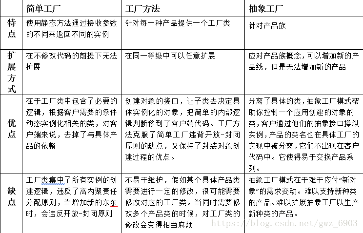

## 设计模式简介

设计模式是一套被反复使用的、多数人知晓的、经过分类编目的、代码设计经验的总结。使用设计模式是为了重用代码、让代码更容易被他人理解、保证代码可靠性。

设计模式就是在软件设计、开发过程中，针对特定问题、场景的**更优解决方案**。

## 设计模式分类（23种设计模式）

- 创建型
  - **单例模式**
  - 原型模式
  - **工厂模式**
  - **抽象工厂模式**
  - 建造者模式
- 结构型
  - 适配器模式
  - **装饰器模式**
  - **代理模式**
  - 外观模式
  - 桥接模式
  - 组合模式
  - 享元模式
- 行为型
  - **观察者模式**
  - 迭代器模式
  - 策略模式
  - 模板方法模式
  - 职责链模式
  - 命令模式
  - 备忘录模式
  - 状态模式
  - 访问者模式
  - 中介者模式
  - 解释器模式

## 六大设计原则

- S – Single Responsibility Principle 单一职责原则

  - 一个程序只做好一件事
  - 如果功能过于复杂就拆分开，每个部分保持独立

- O – Open Closed Principle 开放/封闭原则

  - 对扩展开放，对修改封闭
  - 增加需求时，扩展新代码，而非修改已有代码

- L – Liskov Substitution Principle 里氏替换原则

  - 子类能覆盖父类
  - 父类能出现的地方子类就能出现

- I – Interface Segregation Principle 接口隔离原则

  - 保持接口的单一独立
  - 类似单一职责原则，这里更关注接口

- D – Dependency Inversion Principle 依赖倒转原则

  - 面向接口编程，依赖于抽象而不依赖于具体
  - 使用方只关注接口而不关注具体类的实现

- 迪米特法则：认为类对自己需要耦合或调用的其它类知道得越少；

  在实际应用中，如果一个类跳转两次以上才能访问到另一个类，就需要想办法进行重构了，因为跳转次数越多，系统越复杂，维护就越困难。

其中单一职责原则 S、开闭原则 O、里氏替换原则 L、接口隔离原则 I、依赖倒置原则 D 的组合被称为”SOLID“原则。

> 在编写 OOP 代码时，如果遵循这 5 条设计原则，就更可能写出可扩展、易于修改的代码。相反，如果不断违反其中的一条或多条原则，那么很快你的代码就会变得不可扩展、难以维护。

##### SO体现较多，举个栗子：（比如Promise）

- 单一职责原则：每个then中的逻辑只做好一件事
- 开放封闭原则（对扩展开放，对修改封闭）：如果新增需求，扩展then


在 JS 设计模式中，**最核心的思想——封装变化**，怎么理解，比如我们写一个东西，这个东西在初始 `v1.0` 的时候是这 B 样，到了 `v5.0`、`v10.0` 甚至 `v99.0`、`v100.0` 还是这 B 样，那 ojbk，你爱怎么写就怎么写，你只要实现就可以了。

> 设计模式的核心操作是去观察你整个逻辑里面的变与不变，然后将变与不变分离，达到使变化的部分灵活、不变的地方稳定的目的。


## 单例模式 Singleton Pattern

> 保证一个类只有一个实例，并提供一个访问它的全局访问点（调用一个类，任何时候返回的都是同一个实例）。

应用：线程池、全局缓存，浏览器中的window对象、`Redux/Vuex`中的store、jQuery的$或者业务场景中的购物车、登录框都是单例模式的应用

实现方法：使用一个变量来标志当前是否已经为某个类创建过对象，如果创建了，则在下一次获取该类的实例时，直接返回之前创建的对象，否则就创建一个对象。

### 饿汉式

```js
// 最常见的单例模式
class SingleObject{
    login(){
        console.log('登录')
    }
}
// 自执行函数 饿汉式
SingleObject.getInstance = (function() {
    // 通过闭包来保存当前的 instance
    let instance = null;
    return function(params) {
        if (!instance){
            instance = new SingleObject()
        }
        return instance;
    }
})()

let SingleObject1 = SingleObject.getInstance()
let SingleObject2 = SingleObject.getInstance()
console.log(SingleObject1===SingleObject2)
```

```js
// 懒汉式
class SingleObject{
    Instance
    login(){
        console.log('登录')
    }
    static getInstance(){
        if (!this.instance){
            this.instance = new SingleObject()
        }
        return this.instance;
    }
}

let SingleObject1 = SingleObject.getInstance()
let SingleObject2 = SingleObject.getInstance()
console.log(SingleObject1===SingleObject2)
```

> 懒汉式：和懒加载一样，使用得时候去创建实例子（实例复杂的时候可以使用。）
>
> 饿汉式：生命周期开始的时候就创建实例（实例不复杂的时候可以，复杂的时候影响页面加载速度）

> 单例模式，    
>
> 优势：只有一个实例，内存占用肯定少，提高性能    
>
> 劣势: 使用常见少，扩展性差，业务修改就得改，


## 观察者模式 Observer Pattern（发布-订阅模式）

> 定义对象间的一种一对多的依赖关系，当一个对象的状态发生改变时，所有依赖于它的对象都得到通知并被自动更新。

观察者模式（Observer）又称发布-订阅模式（Publish-Subscribe：Pub/Sub）。它是一种通知机制，让发送通知的一方（被观察方）和接收通知的一方（观察者）能彼此分离，互不影响。

有些文章也把观察者模式称为发布订阅模式，其实二者是有所区别的，发布订阅相较于观察者模式多一个调度中心。

应用：Redux的subscribe、Vue的双向绑定

- 发布 & 订阅
- 一对多

```js
// 主题 保存状态，状态变化之后触发所有观察者对象
class Subject {
  constructor() {
    this.state = 0
    this.observers = []
  }
  getState() {
    return this.state
  }
  setState(state) {
    this.state = state
    this.notifyAllObservers()
  }
  notifyAllObservers() {
    this.observers.forEach(observer => {
      observer.update()
    })
  }
  attach(observer) {
    this.observers.push(observer)
  }
}

// 观察者
class Observer {
  constructor(name, subject) {
    this.name = name
    this.subject = subject
    this.subject.attach(this)
  }
  update() {
    console.log(`${this.name} update, state: ${this.subject.getState()}`)
  }
}

// 测试
let s = new Subject()
let o1 = new Observer('o1', s)
let o2 = new Observer('o2', s)

s.setState(12)
```

## 装饰器模式 Decorator Pattern

> 装饰者(decorator)模式能够在不改变对象自身的基础上，在程序运行期间给对象动态的添加职责（方法或属性）。与继承相比，装饰者是一种更轻便灵活的做法。

简单说：可以动态的给某个对象添加额外的职责，而不会影响从这个类中派生的其它对象。

应用：React高阶组件HOC、ES7 装饰器

```js
//ES7装饰器
function info(target) {
  target.prototype.name = '张三'
  target.prototype.age = 10
}
@info
class Man {}
let man = new Man()
man.name // 张三
```

## 代理模式 Proxy Pattern

> 由于某些原因需要给某对象提供一个代理以控制对该对象的访问。这时，访问对象不适合或者不能直接引用目标对象，代理对象作为访问对象和目标对象之间的中介。

> 为其他对象提供一种代理以控制对这个对象的访问。
> 代理模式使得代理对象控制具体对象的引用。代理几乎可以是任何对象：文件，资源，内存中的对象，或者是一些难以复制的东西。

应用：事件代理、`jQuery的$.proxy`、ES6的`proxy`都是这一模式的实现，

```js
//es6 Proxy
const target = {}
const handler = {
    get(target, property) {
        if (property in target) {
            return target[property]
        } else {
            throw new ReferenceError("Property \"" + property + "\" does not exist.")
        }
    }
}
const p = new Proxy(target, handler)
p.a = 3  // 被转发到代理的操作
console.log(p.c) //
```

### 代理模式 vs 装饰器模式

代理模式是把当前的行为或功能委托给其它对象执行，代理类负责接口限定：是否可以调用真实角色，以及是否对发送到真实角色的消息进行变形处理，它不对被主题角色（也就是被代理类）的功能做任何处理，**保证原汁原味的调用**。

装饰模式是在要保证接口不变的情况下加强类的功能，它保证的是**被修饰的对象功能比原始对象丰富**（当然，也可以减弱），但不做准入条件判断和准入参数过滤，如是否可以执行类的功能，过滤输入参数是否合规等，这不是装饰模式关心的。

### 工厂模式 Factory Pattern

工厂模式即对创建对象逻辑的封装，或者可以简单理解为对`new`的封装，这种封装就像创建对象的工厂，故名工厂模式。工厂模式常见于大型项目，比如JQ的$对象，我们创建选择器对象时之所以没有new selector就是因为$()已经是一个工厂方法，其他例子例如`React.createElement()`、`Vue.component()`都是工厂模式的实现。工厂模式有多种：`简单工厂模式`、`工厂方法模式`、`抽象工厂模式`，

```js
// 文本工厂
class Text {
    constructor(text) {
        this.text = text
    }
    insert(where) {
        const txt = document.createTextNode(this.text)
        where.appendChild(txt)
    }
}

// 链接工厂
class Link {
    constructor(url) {
        this.url = url
    }
    insert(where) {
        const link = document.createElement('a')
        link.href = this.url
        link.appendChild(document.createTextNode(this.url))
        where.appendChild(link)
    }
}

// 图片工厂
class Image {
    constructor(url) {
        this.url = url
    }
    insert(where) {
        const img = document.createElement('img')
        img.src = this.url
        where.appendChild(img)
    }
}

// DOM工厂
class DomFactory {

  constructor(type) {
    return new (this[type]())
  }

  // 各流水线
  link() { return Link }
  text() { return Text }
  image() { return Image }
}

// 创建工厂
const linkFactory = new DomFactory('link')
const textFactory = new DomFactory('text')

linkFactory.url = 'https://surmon.me'
linkFactory.insert(document.body)

textFactory.text = 'HI! I am surmon.'
textFactory.insert(document.body)
```

#### 各工厂模式的区别



